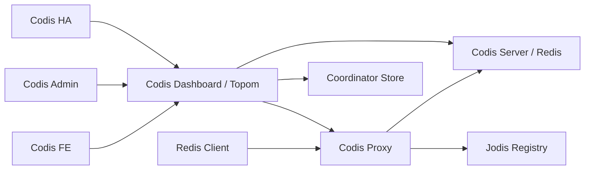

# Codis 架构总入口

## 0. 术语

- **Codis Proxy**：客户端连接的 Redis 协议代理，负责认证、命令解析、slot 路由、pipeline 响应写回和运行时指标；入口在 `cmd/proxy/main.go:31`，核心类型是 `pkg/proxy/proxy.go:29`。
- **Topom / Codis Dashboard**：集群拓扑管理进程。`cmd/dashboard` 创建 `topom.Topom` 并启动管理 HTTP API；`Topom` 内部持有 store、cache、slot action、stats 和 HA 状态，见 `pkg/topom/topom.go:28`。
- **Coordinator / Store**：保存集群元数据的外部存储抽象。`models.Client` 定义读写、列表、watch、临时节点接口，支持 zookeeper、etcd、filesystem 和 consul 实现；Consul 后端用 KV 保存 `/codis3` / `/jodis` 数据，用 Session 表达 ephemeral ownership，见 `pkg/models/client.go:15`、`pkg/models/client.go:31` 和 `pkg/models/consul/consulclient.go:27`。
- **Slot**：Codis 的路由分片单位，固定为 1024 个；模型常量在 `pkg/models/slots.go:13`，proxy 内部 slot 状态在 `pkg/proxy/slots.go:12`。
- **Group**：一组后端 Redis Server，第一台按现有代码语义承担 master 位置，类型定义在 `pkg/models/group.go:8`。
- **Hot key cache**：Codis Proxy 进程内、默认关闭、按 exact key 配置的短 TTL string 读缓存；只作用于稳定 slot 上的 `GET` / `MGET` 完整 bulk value，不进入 coordinator。启用广播后，写命令经过 source proxy 成功返回时可由 source proxy 上报 dashboard/topom，再由 dashboard/topom 通知其他 online proxy 删除本地 DB+key cache entry。
- **Session auth brute-force guard**：Codis Proxy 进程内、默认关闭、面向客户端 `session_auth` 的 Redis `AUTH` 失败保护；它按客户端 remote IP 保存失败计数和临时锁定截止时间，只影响未认证 session 的后续 `AUTH`，不进入 coordinator，也不影响已认证 session 的普通命令。
- **Codis-managed Redis ACL**：默认关闭的 Redis 8 ACL 管理与 proxy 多账号认证能力。dashboard/topom 是当前 product ACL 配置的管理面，coordinator 保存 `/codis3/{product}/acl` 的目标 revision；topom 先把 ACL 同步到所有后端 Redis Server，再写 coordinator，并把 snapshot 下发给 online proxy。proxy 启用 `codis_acl_enabled` 后接受客户端 `AUTH [username] password`，按 session identity 选择 user-bound backend connection，必要时用 backend service identity 做本地命令和迁移包装前的 `ACL DRYRUN`；普通客户端不能通过 proxy 执行 ACL 管理命令。
- **Cluster nodes compat**：Codis Proxy 进程内、默认关闭的 `CLUSTER NODES` 兼容输出能力；只为 cluster-mode SDK bootstrap 生成伪 Redis Cluster 节点清单，使用 Redis Cluster 逻辑 slot `0-16383`，但不改变 Codis 真实 1024 slot 路由，也不实现 `MOVED` / `ASK` / cluster bus。
- **Stream command support**：Codis Proxy 对 Redis Stream 命令的受控路由子集；它让 Redis 8 backend 的单 stream 命令、`XGROUP` / `XINFO` 容器命令和非阻塞同 hash tag `XREAD` / `XREADGROUP` 经 proxy 按真实 stream key 路由，同时拒绝 blocking read、跨 hash tag multi-stream 和无 key/未知 Stream 子命令。它不是完整 Redis Stream 语义承诺，也不表示 Redis 3 backend 能执行 Stream。
- **RDB Analysis**：dashboard/topom 进程内的离线 RDB 文件分析能力。它通过 `github.com/hdt3213/rdb` 解析已有 RDB 文件，输出 DB/type/prefix 聚合、big keys、hot keys 和 flamegraph 树形数据；输入可以来自浏览器上传、dashboard 受控 workspace 路径，或 dashboard 从当前 product 内 Redis 8 Codis Server 的 RDB HTTP export 拉取后的临时文件。它不在 proxy 业务请求路径中执行，也不是 Redis 在线命令。核心类型在 `pkg/topom/topom_rdb_analysis.go:36` 到 `pkg/topom/topom_rdb_analysis.go:95`。
- **RDB HTTP export**：Redis 8 Codis Server 上默认关闭的本机 RDB 导出入口。它复用 Redis 监听端口，只接受精确 `GET /codis/rdb/latest` 和 `X-Codis-RDB-Auth` header，传输当前 `server.rdb_filename` 指向且已经存在的本地 RDB 文件；它不调用 `SAVE` / `BGSAVE`，也不主动上传到 dashboard。`codis-rdb-export-rate-limit` 可对所有 export 连接共享的 body bytes/sec 做 server 级限速，默认 0 不限速；限速只暂停 export 自身 writable handler，不进入普通 Redis 命令执行或 reply 写出路径。实现锚点在 `extern/redis-8.6.3/src/codis_rdb_export.c`、`extern/redis-8.6.3/src/networking.c` 和 `extern/redis-8.6.3/src/iothread.c`。
- **Remote RDB fetch analysis**：dashboard/topom 对 RDB HTTP export 的受控拉取入口。dashboard API 只接受当前 product model 中精确匹配的 `server_addr`，用 dashboard 本地持久化的 `rdb_analysis_remote_fetch_auth` 生成 `X-Codis-RDB-Auth` header，下载完整 RDB 到受控临时文件后才创建 RDB Analysis job；它不是任意 URL 拉取器，不支持 tus/resume/Range，也不触发 `SAVE` / `BGSAVE`。
- **Go module manifest**：仓库根目录的 `go.mod` / `go.sum`，用于现代 Go module mode 下解析 cmd/pkg 默认构建标签依赖；当前使用 `go 1.26.1`，默认 cmd/pkg、`cgo_jemalloc` proxy 构建和 Makefile 测试入口都已接通。
- **Go Redis helper**：`pkg/utils/redis` 暴露给 topom、admin、HA 和部分测试工具的 Redis 管理适配层。它对上层保留 `Client` / `Pool` / `InfoCache` / `Sentinel` API，底层使用 `github.com/redis/go-redis/v9` standalone client + dedicated `Conn`，继续维护 Codis 自己的 DB selection、pipeline send/recv 计数、reply shape 校验和 Sentinel 管理语义；它不是 `pkg/proxy/redis` RESP codec。

## 1. 定位与受众

这份文档描述当前仓库已经落地的系统地图，服务于 feature-design、issue-analyze 和新人上手。读完应能判断一次改动会碰到哪个入口、哪个核心包、哪些运行期状态，以及哪些变更必须经过 dashboard/topom。

## 2. 结构与交互

Coordinator 后端通过 `pkg/models/client.go` 的工厂集中挂入，调用方仍只依赖 `models.Client` / `models.Store`。Consul 后端位于 `pkg/models/consul`，只接入 HashiCorp Go API 模块 `github.com/hashicorp/consul/api`，把 Codis slash path 转成无前导 `/` 的 Consul KV key；`Create` 使用 `KV.CAS(ModifyIndex=0)`，`List` 使用 `KV.Keys(prefix, "/", ...)`，`WatchInOrder` 使用 blocking query 的 `WaitIndex`，Jodis ephemeral 节点使用 `Session.CreateNoChecks` + `KV.Acquire` + `Session.RenewPeriodic`。dashboard、proxy、admin 和 fe 仍通过原有配置/CLI 参数选择 coordinator，新增 `consul` 分支不改变默认 coordinator。

构建层面，仓库已有 `go.mod` / `go.sum`，`go.mod` 使用 `go 1.26.1`，旧 `vendor/` / `Godeps/` 依赖目录已经退休。常规 Go 依赖由 `go.mod/go.sum` 解析，`GO111MODULE=on go test ./cmd/... ./pkg/...`、`GO111MODULE=on go build ./cmd/... ./pkg/...` 和 `GO111MODULE=on go build -tags cgo_jemalloc ./cmd/proxy` 都可在 module mode 下通过。`cgo_jemalloc` 路径通过 `go.mod` 的 `replace github.com/spinlock/jemalloc-go => ./third_party/jemalloc-go` 指向仓库内受控的本地模块，不再依赖旧 `vendor/github.com/spinlock/jemalloc-go` 的预处理状态。`Makefile` 已切换到 module mode（移除了 `GO15VENDOREXPERIMENT` 和旧 `vendor/github.com/spinlock/jemalloc-go` 预处理调用），产出 `codis-dashboard`、`codis-proxy`、`codis-admin`、`codis-ha`、`codis-fe` 和嵌入式 `codis-server`；Go 二进制和平台变量构建规则在 `Makefile:6` 到 `Makefile:30`。默认 `make` / `make build-all` / `make codis-server` 保持 host build userspace，从 `extern/redis-8.6.3/` 构建正式 Redis 8 Codis Server，复制为默认 `bin/codis-server`、`bin/redis-cli`、`bin/redis-benchmark` 和 `bin/redis-sentinel`，并刷新 tracked 的 `config/redis.conf` / `config/sentinel.conf`；`config/redis.conf` 来自 Redis 8 模板并显式写入 `codis-enabled yes`，仍不启用 Redis Cluster。显式 `make build-platforms` / `make release-platforms` 使用 `TARGET_PLATFORMS` 矩阵生成 `bin/<os>-<arch>/` 平台目录，默认矩阵为 `darwin/arm64 linux/amd64 linux/arm64`；每个平台目录包含目标平台 Go 二进制、默认 `cgo_jemalloc` proxy、Redis 8 `codis-server`、Redis helper、FE assets 和配置副本。`build-platform-artifact` 自身先执行 `TARGET_OS` / `TARGET_ARCH` allowlist、unsafe label 校验和 C/cgo cross toolchain guard，再进入 `rm -rf bin/<label>`、构建、复制和 `file` 平台校验；非 host full build 没有显式 `ALLOW_CROSS_FULL_BUILD=1` 与对应 `PLATFORM_CC_<os>_<arch>` 时会 fail-fast，不能复制 host Redis 假冒 target 产物。`build-no-redis-platform` 只生成 `bin/<os>-<arch>-no-redis/` 下的 Go 入口、FE assets 和配置副本，不构建 Redis Server / helper；它不承诺纯 Go，因为当前 proxy 的非 jemalloc allocator 路径仍使用 cgo。Redis 3 通过显式 `make codis-server-redis3` fallback 目标保留，产物使用 `*-redis3` 后缀，不覆盖默认 Redis 8 发布物；`make codis-server-redis8` 只作为兼容 alias，从默认 Redis 8 产物复制 suffixed 调试二进制和 `config/redis8.conf` / `config/sentinel8.conf`。当前 Redis 8 Codis Server 已具备 `codis-enabled yes` 运行模式：Redis 8 server 可在不启用 Redis Cluster 协议的前提下按 Codis 1024 slot 组织 keyspace，通过 `SLOTSHASHKEY`、`SLOTSINFO`、`SLOTSSCAN`、`SLOTSDEL`、`SLOTSCHECK` 暴露当前 DB 的 slot 查询、统计、扫描、删除和一致性检查能力，通过 `SLOTSMGRTSLOT`、`SLOTSMGRTONE`、`SLOTSMGRTTAGSLOT`、`SLOTSMGRTTAGONE` 与 `SLOTSRESTORE` 支撑 Redis 8 ↔ Redis 8 同步迁移，通过 `SLOTSMGRT*-ASYNC`、`SLOTSRESTORE-ASYNC*`、`SLOTSMGRT-ASYNC-FENCE/CANCEL/STATUS` 和 `SLOTSMGRT-EXEC-WRAPPER` 支撑 Redis 8 ↔ Redis 8 异步迁移、ACK 推进、迁移屏障和迁移中写保护，并维护 `redisDb.codis_tagged_keys` 作为 tag-aware migration 的辅助索引。Go proxy/topom/admin 对 Redis 8 Codis Server 的兼容面已通过测试矩阵和真实 Redis 8 smoke 验证：默认配置继续兼容 `AUTH <password>` default-user 模型、`SELECT` 当前 DB、`SLAVEOF` alias、`CONFIG GET/REWRITE`、`CLIENT KILL TYPE normal`、`SLOTSINFO`、同步/异步迁移返回 `[migrated_count, remaining_count]` 和 `SLOTSMGRT-EXEC-WRAPPER [code, reply]`；启用 Codis-managed Redis ACL 后，Go 侧可使用 `AUTH <username> <password>` 的 backend service identity、user-bound proxy connection、replication `masteruser` / `masterauth` 和 Redis 8 migration named auth。发布包装入口围绕默认 `codis-server`：Docker 镜像基础环境使用 module-capable Go 版本，`scripts/docker.sh server` 显式加载 tracked `config/redis.conf` 并在容器场景下传 `--protected-mode no --bind 0.0.0.0`，`example/server.py` 生成临时配置时写入 `codis-enabled yes`，`kubernetes/codis-server.yaml` 继续通过仓库默认配置启动。Redis 8 本地非性能 validation gate 由 `scripts/redis8_local_validation.py` 承载，只作为验证入口，不是生产组件：它使用临时 filesystem coordinator、临时 dashboard/proxy/Redis 进程，覆盖 `semi-async` 与 `sync` slot migration、proxy 写读和 Redis 3/Redis 8 fragment 方向性观察，证据落在 `.codestable/features/2026-05-17-redis8-validation-cutover/redis8-local-validation-evidence.json`。

Redis 8 Codis Server 还提供默认关闭的本机 RDB HTTP export。`codis-rdb-export-enabled no` 和 `codis-rdb-export-auth ""` 是 Redis immutable config，开启时必须配置非空 auth 并重启生效；`codis-rdb-export-rate-limit 0` 是可运行期 `CONFIG SET` 的 size_t config，0 表示不限速，正数表示单 Redis Server 进程内所有 RDB export 连接共享的 body bytes/sec 预算。配置模板位于 `extern/redis-8.6.3/redis.conf` 和 tracked `config/redis.conf`。入口复用 Redis 端口，只拦截完整、精确的 `GET /codis/rdb/latest HTTP/1.0|1.1`，认证只读取 `X-Codis-RDB-Auth` header；非精确 HTTP-like 请求继续回到 Redis 既有协议/安全处理。`networking.c` 在 Redis parser 前调用 export helper；当请求由 Redis IO thread 读到时，`iothread.c` 只把 client 标记并转回主线程，真正的 auth、`server.rdb_filename` snapshot、文件校验、fd open、streaming state 安装、token bucket refill/consume 和 `CONFIG SET` 后的 bucket clamp/reset 都在主线程完成。候选文件限定为当前 `server.rdb_filename` 的 basename，路径位于 Redis `dir`，必须通过 basename/suffix、`lstat` 普通文件、`open` 后 `fstat` device/inode/mode 一致和 RDB `REDIS` magic 校验；它不扫描其他 `.rdb`，不允许客户端指定路径，不调用 `SAVE` / `BGSAVE`，也不新增 Go proxy/coordinator 接口。限速只作用于成功响应的 RDB body streaming，HTTP header 和短错误响应不消耗 token；token 不足时 export 移除自身 writable handler 并创建 ae time event，time event 只恢复 write handler，由下一轮可写事件继续推进 body。这是协作式降低 export 写出优先级，不修改 `aeProcessEvents` 全局调度语义，不让普通 Redis 命令解析、执行或普通 reply 写出检查/消耗该 token bucket。dashboard/topom 的 Remote RDB fetch analysis 是该 export 的受控调用方：目标只来自当前 product group server，auth 只来自 dashboard 配置，HTTP client 不跟随 redirect，下载完整后才进入 RDB Analysis。

版本元数据由 `pkg/utils/version.go` 提供 clean checkout 默认值，`version` 脚本生成 `bin/version` 和 `bin/version.ldflags`，Makefile 通过 `-ldflags -X` 注入真实 git/date 信息。该文件不再由构建脚本覆盖，避免一次 `make` 后源码进入脏状态。

运行入口按组件拆在 `cmd/`。`cmd/proxy/main.go:31` 解析 proxy 参数和配置，创建 `proxy.New(config)` 后按 dashboard、coordinator 或 fillslots 三种方式上线，见 `cmd/proxy/main.go:187` 和 `cmd/proxy/main.go:219`。`cmd/dashboard/main.go:25` 解析 dashboard 参数，创建 coordinator client 和 `topom.New`，启动时通过 store 抢占拓扑锁，见 `cmd/dashboard/main.go:118`、`cmd/dashboard/main.go:136` 和 `pkg/topom/topom.go:179`。

proxy 内部先建立两个监听器：对客户端的 Redis 协议监听和对管理面的 HTTP API 监听，分别由 `Proxy.setup` 填入 model，见 `pkg/proxy/proxy.go:105` 到 `pkg/proxy/proxy.go:143`。`Proxy.New` 创建 router、启动 admin/proxy 服务并启动 metrics reporter，见 `pkg/proxy/proxy.go:58` 到 `pkg/proxy/proxy.go:102`。

客户端连接在 `serveProxy` 中被 accept 后创建 `Session`，每个 session 拆出 reader 和 writer 两条 goroutine；reader 解码 Redis multi bulk、生成 `Request` 并交给 router，writer 等待后端响应后按原顺序写回，见 `pkg/proxy/proxy.go:396`、`pkg/proxy/session.go:114`、`pkg/proxy/session.go:152` 和 `pkg/proxy/session.go:199`。已通过上线检查的活动 session 会注册进 proxy 进程内的 session registry，用于当前 proxy 实例的连接观测；该 registry 不进入 coordinator，也不跨 proxy 同步，见 `pkg/proxy/client_list.go:18` 和 `pkg/proxy/session.go:122`。

命令路由的第一层在 `Session.handleRequest`。它先处理 `QUIT`、`AUTH`、`SELECT`、`CLIENT LIST`、`ACL WHOAMI` 和启用后的 `CLUSTER NODES` 等本地命令，再对 `GET`、`MGET`、`MSET`、`DEL`、`EXISTS`、`SLOTSINFO`、`SLOTSSCAN`、`SLOTSMAPPING` 做特殊处理，其余命令走 `Router.dispatch`，见 `pkg/proxy/session.go:257` 到 `pkg/proxy/session.go:337`。Redis Stream 命令不再依赖未知命令 fallback：`pkg/proxy/stream_commands.go` 维护单一 Stream command metadata，`mapper.go` 从该 metadata 注册读写属性，`Session.handleRequest` 在 default dispatch 前把显式 Stream 命令交给 Stream key resolver。普通 `X* key ...` 按第 1 参数路由，`XGROUP CREATE/SETID/DESTROY/CREATECONSUMER/DELCONSUMER` 和 `XINFO STREAM/GROUPS/CONSUMERS` 按第 2 参数路由，非阻塞 `XREAD` / `XREADGROUP` 从 `STREAMS` 段提取 key 列表；multi-stream 只在所有 key 共享同一 hash tag/key 时整条转发，带 `BLOCK`、跨 hash tag、`XGROUP HELP`、`XINFO HELP` 或未知 Stream subcommand 会在 proxy 返回 Redis error，不转发后端。Stream resolver 成功后复用 `slot.forward`、迁移包装、master/replica 选择和 hot key cache 写后失效计划；`XREADGROUP` 按写命令走 master，Stream 写命令按解析出的 stream key 失效 cache。`AUTH` 由 `Session.handleAuth` 在本地执行：ACL 未启用时保持旧 `session_auth` 校验；ACL 启用且 proxy 已安装 snapshot 时，`AUTH password` 映射 Redis `default` 用户，`AUTH username password` 映射指定 ACL 用户，认证成功后 session 保存 username、credential hash、短期 password 和 ACL revision，认证失败不替换已有有效身份。启用 `session_auth_bruteforce_enabled` 且客户端 remote IP 可解析时，未认证 session 会在密码比较前检查 proxy-local guard 的锁定状态，密码错误后记录失败，密码正确后清理该 IP 的失败记录。普通客户端发来的 `ACL SETUSER`、`ACL DELUSER`、`ACL DRYRUN` 等管理子命令不会透传到后端；只有 ACL active 且已认证的 session 可本地执行 `ACL WHOAMI`。`CLIENT LIST` 在 proxy 本地生成当前 proxy 实例的活动客户端连接快照，返回 RESP bulk string 的 Redis `key=value` 行，不转发到后端 Redis，见 `pkg/proxy/client_list.go:155` 到 `pkg/proxy/client_list.go:239`。`CLUSTER NODES` 只有在 `cluster_nodes_compat = "self"` 或 `"all"` 时由 proxy 本地返回 RESP bulk string；`self` 输出当前 proxy 覆盖 `0-16383`，`all` 读取后台刷新出的 Jodis proxy 快照并均分 `0-16383`，其他 `CLUSTER` 子命令仍返回不支持错误且不转发后端。启用 Hot key cache 且 key 在 allowlist、slot 稳定时，`GET` / `MGET` 可由 proxy 本地 copied bulk bytes 在短 TTL 内直接返回；miss、未配置 key、不可缓存响应、slot 迁移或锁定状态仍回到既有 router/forward 路径。ACL active 时，Hot key cache 命中前仍按 session ACL identity 校验原始命令，无权限用户不能绕过后端授权读取本地 cache。写命令不做写穿填充，只在后端响应完成后的 coalesce 收尾中按 invalidation plan 清理本 proxy cache，避免写前失效导致旧 miss 回填，见 `pkg/proxy/hot_key_cache.go:308` 到 `pkg/proxy/hot_key_cache.go:570`。启用 hot key cache broadcast 且 source proxy 已获得 dashboard/topom admin 地址时，可枚举写后失效事件会先进入 source proxy 有界合并队列，再通过二进制安全的 `keys_base64` payload 上报 dashboard/topom；dashboard/topom 锁内只校验 source 和复制 proxy registry 快照，锁外 fan-out 到其他 online proxy 的 admin API，见 `pkg/proxy/hot_key_cache_broadcast.go:22` 到 `pkg/proxy/hot_key_cache_broadcast.go:255`、`pkg/topom/topom_hot_key_cache.go:35` 到 `pkg/topom/topom_hot_key_cache.go:113`。`Router.dispatch` 用 hash key 计算 slot id 后调用 slot 的 forward method，见 `pkg/proxy/router.go:139` 到 `pkg/proxy/router.go:143`。

slot 路由状态由 dashboard 下发到 proxy。`Topom.reinitProxy` 会向 proxy 填充 slot、启动 proxy 并设置 sentinel；局部 slot 变化通过 `resyncSlotMappings` 并发调用所有 proxy 的 `FillSlots`，见 `pkg/topom/topom_proxy.go:126` 到 `pkg/topom/topom_proxy.go:170`。proxy 侧 `FillSlot` 根据 `models.Slot` 更新 backend、migrate、replicaGroups 和 forward method，见 `pkg/proxy/router.go:102` 到 `pkg/proxy/router.go:120` 以及 `pkg/proxy/router.go:168` 到 `pkg/proxy/router.go:213`。

迁移由 dashboard/topom 组织状态机，proxy 在请求转发时配合迁移。dashboard 创建 slot action 后把状态从 pending 推进到 prepared/migrating/finished，见 `pkg/topom/topom_slots.go:19`、`pkg/topom/topom_slots.go:188` 和 `pkg/topom/topom_slots.go:307`。真正搬迁 key 时，topom 根据 migration method 调用 Redis 侧迁移命令，见 `pkg/topom/topom_slots.go:358` 到 `pkg/topom/topom_slots.go:446`；proxy 在转发中遇到 migrating slot 会先执行同步或半异步迁移包装逻辑，见 `pkg/proxy/forward.go:35` 到 `pkg/proxy/forward.go:62` 和 `pkg/proxy/forward.go:72` 到 `pkg/proxy/forward.go:132`。Redis 8 Codis Server 的同步迁移路径由源端 `SLOTSMGRT*` 命令发起：源端复用 `server.slotsmgrt_cached_sockets` 中按 `host:port` 缓存的裸 TCP 连接，必要时先发 `AUTH` / `SELECT`，再用 `createDumpPayload` 生成 Redis 8 RDB fragment 并发送 `SLOTSRESTORE key ttlms payload [...]` 到目标；目标端反序列化成功后源端才 `dbSyncDelete` 删除本地 key，并把删除传播为确定性的 `DEL`。

dashboard 的管理 API 在 `pkg/topom/topom_api.go:31` 注册。它暴露 proxy、group、slot action、rebalance、sentinel 等操作路由，见 `pkg/topom/topom_api.go:72` 到 `pkg/topom/topom_api.go:126`；Codis-managed ACL API 挂在 `/api/topom/acl/:xauth`，提供当前 ACL view 读取和 ACL revision 提交，见 `pkg/topom/topom_api.go:90` 到 `pkg/topom/topom_api.go:91`、`pkg/topom/topom_acl.go:51` 到 `pkg/topom/topom_acl.go:352`；hot key cache broadcast source 上报 API 挂在 `/api/topom/hot-key-cache/invalidate/:xauth`，见 `pkg/topom/topom_api.go:89` 和 `pkg/topom/topom_api.go:226`。RDB Analysis API 也挂在 dashboard `/api/topom/rdb-analysis` 下，提供上传文件启动、workspace 路径启动、从当前 product server 远端拉取 RDB、读取 job snapshot、取消和删除任务，所有路由都要求 `xauth`；remote fetch 路由为 `PUT /api/topom/rdb-analysis/remote-fetch/:xauth`，见 `pkg/topom/topom_api.go:82` 到 `pkg/topom/topom_api.go:89`、`pkg/topom/topom_rdb_analysis_api.go:32` 到 `pkg/topom/topom_rdb_analysis_api.go:113` 和 `pkg/topom/topom_rdb_analysis_remote_fetch.go:38` 到 `pkg/topom/topom_rdb_analysis_remote_fetch.go:193`。proxy 自己的管理 API 在 `pkg/proxy/proxy_api.go:29` 注册，提供 model、stats、slots、start、fillslots、sentinels、ACL snapshot 安装、forcegc、shutdown 等操作，见 `pkg/proxy/proxy_api.go:63` 到 `pkg/proxy/proxy_api.go:85`；proxy ACL snapshot API 挂在 `/api/proxy/acl/:xauth`，只供 dashboard/topom 下发，不供 FE 直接调用；目标 proxy 本地 hot key cache 失效 API 挂在 `/api/proxy/hot-key-cache/invalidate/:xauth`，见 `pkg/proxy/proxy_api.go:85` 和 `pkg/proxy/proxy_api.go:249`。

运维入口分三类：`codis-admin` 是命令行入口，按参数分发到 proxy、dashboard 或底层配置操作，见 `cmd/admin/main.go:12` 到 `cmd/admin/main.go:85`；它还提供 `--acl` / `--acl-set FILE` 读取和提交 dashboard ACL view，dry-run 输出会 redact `new_password`，以及 `--rdb-analysis-remote-fetch --server=ADDR` 调用 dashboard remote fetch API，成功时只打印 RDB Analysis job id，不接收 Redis export auth，见 `cmd/admin/dashboard.go:291` 到 `cmd/admin/dashboard.go:360` 和 `cmd/admin/rdb_analysis_remote_fetch.go:15`。`codis-fe` 既提供静态前端资源，也根据静态列表或 coordinator 动态发现 dashboard 并做 reverse proxy，见 `cmd/fe/main.go:127` 到 `cmd/fe/main.go:194` 和 `cmd/fe/main.go:259` 到 `cmd/fe/main.go:330`；`codis-fe` 的 AngularJS 页面提供 ACL 配置区域和 RDB Analysis 区域。ACL 区域只调用 dashboard/topom ACL API，展示 enabled、revision、sync status 和用户列表，编辑态可提交用户 enabled/rules/new_password，提交成功后重新 GET view，前端逻辑在 `cmd/fe/assets/acl.js:3`，页面入口在 `cmd/fe/assets/index.html:104`；RDB Analysis 区域复用 product 选择、`xauth` 和 reverse proxy 访问 dashboard，支持 upload、workspace path 和 Remote server addr 三种启动入口，前端逻辑在 `cmd/fe/assets/rdb-analysis.js:3`；`codis-ha` 周期性读取 dashboard stats，发现异常 proxy/server 后通过 dashboard API 做清理或 promote，见 `cmd/ha/main.go:90` 到 `cmd/ha/main.go:99` 和 `cmd/ha/main.go:248` 到 `cmd/ha/main.go:369`。

## 3. 数据与状态

集群元数据统一放在 `/codis3/{product}` 命名空间下：topom 锁、slot、group、proxy、sentinel 和 ACL 路径由 `pkg/models/store.go:27` 到 `pkg/models/store.go:59` 定义。`Store` 封装对这些路径的读写，包含 slot mappings、group、proxy、sentinel、ACL 的 load/list/update/delete，见 `pkg/models/store.go:73` 到 `pkg/models/store.go:256`。ACL 元数据只保存 revision、enabled、user enabled、password hashes、rules 和 updated_at，不保存客户端明文密码。

当 coordinator 选择 Consul 时，上述 slash path 在 client 内部映射为 Consul KV key，例如 `/codis3/{product}/topom` 对应 `codis3/{product}/topom`。普通元数据使用 KV CAS/Put/Get/Delete 维护；Jodis `/jodis/{product}/proxy-{token}` 使用 Consul Session 持有 KV ownership，`Delete` / `Close` 会销毁 session 并只删除仍归属当前 session 的 key。Consul token 通过 `coordinator_auth` / `jodis_auth` 写入 API client config，不进入结构化日志。

dashboard/topom 的内存状态分为 model、store、cache、action、stats、ha、aclSync 和 rdbAnalysis 几块：cache 保存 slots/group/proxy/sentinel/ACL 快照，action 保存迁移执行状态，stats 保存 Redis 和 proxy 统计，ha 保存 sentinel 观察到的 masters，aclSync 保存最近一次 ACL 下发 proxy 的 per-proxy 失败结果和 `sync_status` 观测信息，rdbAnalysis 保存当前 dashboard 进程内的 RDB analysis job registry、analysis 并发限制、remote fetch 并发计数、上传 workspace、临时文件路径和结果快照，见 `pkg/topom/topom.go:28` 到 `pkg/topom/topom.go:78`、`pkg/topom/topom_acl.go:51` 到 `pkg/topom/topom_acl.go:352`、`pkg/topom/topom_rdb_analysis.go:146` 到 `pkg/topom/topom_rdb_analysis.go:205` 和 `pkg/topom/topom_rdb_analysis_remote_fetch.go:72` 到 `pkg/topom/topom_rdb_analysis_remote_fetch.go:193`。RDB analysis job 不写入 coordinator，dashboard 重启后任务消失；job snapshot 只返回 source 摘要、进度和聚合结果，workspace 输入通过 `rdb_analysis_workspace` 限制，remote fetch 输入通过当前 product server allowlist 和 dashboard 本地 `rdb_analysis_remote_fetch_auth` 配置限制，见 `pkg/topom/topom_rdb_analysis.go:213` 到 `pkg/topom/topom_rdb_analysis.go:438`。

proxy 的内存状态包括身份认证 token、`models.Proxy`、两个 listener、router、HA sentinel monitor、可选 Jodis 注册器、默认关闭的 session auth brute-force guard 和活动 session registry，见 `pkg/proxy/proxy.go:29` 到 `pkg/proxy/proxy.go:54` 以及 `pkg/proxy/client_list.go:18` 到 `pkg/proxy/client_list.go:55`。router 持有 1024 个 slot、主从后端连接池、online/closed 状态、ACL snapshot、ACL revision 绑定的 user-bound backend pools、默认关闭的 Hot key cache 运行态、默认关闭的 hot key cache broadcast reporter，以及默认关闭的 cluster nodes provider，见 `pkg/proxy/router.go:18` 到 `pkg/proxy/router.go:43`。ACL snapshot 采用 copy-on-write 安装；新 revision 安装时关闭旧 user pools，并把旧 revision 的已认证 session 标记 stale，旧 session 下一条非 AUTH 命令返回重新认证要求。Session ACL identity 保存 username、credential hash、短期 password 和 revision，用于 backend reconnect，不写 stats/API/FE/coordinator。session auth brute-force guard 以规范化客户端 IP 作为本地状态 key，保存 `failures`、`lastFailureAt`、`lockedUntil` 和聚合统计；状态表有内部固定 tracked IP 上限，插入新 IP 前清理过期记录，满载时优先淘汰最旧的未锁定记录，全部记录锁定时不再新增 tracking。Hot key cache 以 `database + raw Redis key bytes` 作为本地条目 key，保存 copied bulk bytes、slot id、expire time、LRU 元素和统计计数；router 同时维护 slot version，cache 维护全局失效 version，读 miss 回填前会校验两类 version，防止 slot 更新或写失效后旧响应重新写入 cache，见 `pkg/proxy/hot_key_cache.go:16` 到 `pkg/proxy/hot_key_cache.go:570`。这份 cache 的数据只存在于单个 proxy 进程内，不写 coordinator，不改变 dashboard/topom 拓扑语义；broadcast reporter 只保存 source proxy token、dashboard/topom admin addr、xauth、HTTP timeout 和有界事件队列，队列内只含 DB+raw key bytes，不含 Redis value，见 `pkg/proxy/hot_key_cache_broadcast.go:45` 到 `pkg/proxy/hot_key_cache_broadcast.go:130`。cluster nodes provider 在 `self` 模式保存当前 proxy 的单节点快照，在 `all` 模式复用 Jodis coordinator 配置周期性读取 `/jodis/{product}` 或兼容路径下的 proxy 注册记录，过滤坏 JSON、空地址、非 online、重复 token 和重复 addr 后，用稳定排序生成覆盖 `0-16383` 的伪节点快照；命令处理路径只读内存快照，不等待 coordinator IO，刷新失败时保留 last good 或回退 self。session registry 以进程内递增 id 索引活动 `Session`，是 `SessionsAlive()` 和 `CLIENT LIST` 的当前活动连接权威来源；`stats.go` 中的 `sessions.total` 只表示累计连接数，见 `pkg/proxy/stats.go:169` 到 `pkg/proxy/stats.go:183`。

后端 Redis 数据本身不进入 coordinator；coordinator 只保存拓扑和动作状态。Codis Server 基于嵌入式 Redis 源码构建，并增加 slot 查询、slot 删除和迁移相关命令，说明见 `doc/redis_change_zh.md:1` 到 `doc/redis_change_zh.md:17` 以及 `doc/redis_change_zh.md:84` 到 `doc/redis_change_zh.md:103`。Redis 8 支线新增独立的 `server.codis_enabled` 状态和 `codis-enabled` immutable config；`cluster-enabled` 与 `codis-enabled` 互斥，Codis mode 保留 standalone 多 DB 行为，DB 的 `keys`、`expires`、`subexpires` 在该模式下使用 10-bit `kvstore` / `estore` slot 分区。Codis mode 下 slot keyspace 的唯一权威来源是 Redis 8 `kvstore`，不再恢复 Redis 3 的 `hash_slots[1024]` 平行索引；`SLOTSSCAN` 只扫描目标 slot dict，`SLOTSDEL` 先收集 key 快照再通过 Redis 正常删除路径触发 tag index、dirty 和 key modified 副作用，`SLOTSCHECK` 校验 key 所在 dict index 与 Codis hash slot 一致后复用 tag index assert。`redisDb.codis_tagged_keys` 只记录带 `{...}` hash tag 的 key，score 使用完整 CRC32，元素由 skiplist 持有 SDS 副本。tag index 在 DB init、temp DB、flush/swap/lazyfree、key add/delete、RDB load 和 replica full sync load 后通过 helper 维护或从 `kvstore` full-load rebuild。同步迁移 socket 缓存由 `slotsmgrt_sockfd` 描述单条目标连接，记录 fd、已选择 DB、AUTH 状态和最近使用时间；`redisServer.slotsmgrt_cached_sockets` 持有这些连接，`serverCron` 周期清理超过 TTL 的空闲项。异步迁移状态按 DB 存放在 `redisServer.slotsmgrt_cached_clients[dbid]`，每个条目持有连接到目标 Redis 的内部 cached client、目标 host/port、timeout、待 ACK 消息数、当前 `batchedObjectIterator` 和 blocked/fence 客户端列表；该数组在 `initServer()` 中按最终 `server.dbnum` 分配，保证自定义 `databases` 配置下 DB 隔离仍正确。

Redis 8 异步迁移由 `extern/redis-8.6.3/src/slots_async.c` 承载。源端 `SLOTSMGRTSLOT-ASYNC` / `SLOTSMGRTTAGSLOT-ASYNC` 从 `kvstore` per-slot dict 收集 key，tag-aware 分支用 `codisHashInfoForKey` 和 `redisDb.codis_tagged_keys` 扩展同完整 CRC32 tag key；`SLOTSMGRTONE-ASYNC` / `SLOTSMGRTTAGONE-ASYNC` 处理显式 key 列表；dump-only 命令只返回可执行的 `SLOTSRESTORE-ASYNC delete/object` 命令流，不改源端 keyspace。源端首次使用 cached client 时发送 `SLOTSRESTORE-ASYNC-AUTH`（如需要）和 `SLOTSRESTORE-ASYNC-SELECT`，之后按 `maxbulks` / `maxbytes` 推进命令流。目标端 `SLOTSRESTORE-ASYNC` 对 `string/object/list/hash/dict/zset` 统一走 Redis 8 RDB payload 校验和恢复链路，返回 `SLOTSRESTORE-ASYNC-ACK errno message`；坏 payload、认证失败、连接关闭、timeout 或 cancel 都会释放 async 状态并保留源端 key。所有 ACK 成功后，源端才删除已确认迁移的 key，并通过确定性的 `DEL` 传播删除，阻止原始 `SLOTSMGRT*-ASYNC` 进入 AOF/replica。`SLOTSMGRT-ASYNC-FENCE` 等待当前 DB 的 active migration 完成，`SLOTSMGRT-ASYNC-CANCEL` 中断当前 DB migration，`SLOTSMGRT-ASYNC-STATUS` 暴露 host、port、timeout、sending_msgs、blocked_clients 和 batched_iterator 快照。`SLOTSMGRT-EXEC-WRAPPER` 在包装命令为写且 hash key 命中当前迁移 key 或同 tag key 时返回 being migrated，读命令和无关 key 保持可执行。

Go 组件访问 Redis Server 的协议边界仍由现有 `pkg/utils/redis.Client`、proxy backend 和 topom slot action 维护。`pkg/utils/redis.Client` 底层使用 go-redis/v9 standalone client 和 dedicated `Conn`，显式保持 `Protocol: 2`、`DisableIdentity: true`、`MaxRetries: -1`，并沿用连接/读/写 timeout；构造阶段会触发 go-redis `HELLO 2` fallback 和受控 `PING` 来保持“构造失败即返回 error”的旧语义，但不会启用 RESP3、`CLIENT SETINFO` 或 go-redis cluster/ring/failover client。Codis 自己的 `Pool` 仍以 `Client.Database`、`Pipeline.Send/Recv`、idle timeout 和连接错误状态决定是否复用，不能用 go-redis 共享自动 pool 替代。`InfoFull()` 解析 Redis `INFO` 文本并通过 `CONFIG GET maxmemory` 补充 `maxmemory`，仅在 `master_host` / `master_port` 存在时合成 `master_addr`；`SetMaster()` 保持 `MULTI`、`CONFIG SET masteruser` / `CONFIG SET masterauth`、`SLAVEOF`、`CONFIG REWRITE`、`CLIENT KILL TYPE normal`、`EXEC` 序列并检查事务子命令 error，password-only 旧路径保持 `masterauth` 兼容并 best-effort 清理旧 `masteruser`；`SlotsInfo()`、`MigrateSlot()`、`MigrateSlotAsync()` 继续严格要求 Redis 返回数组形状。Sentinel 管理路径继续通过 `pkg/utils/redis.Sentinel` 维护：subscribe 使用 go-redis PubSub 等待订阅 ack 后再计入多数派，masters/slaves/monitor/remove/flushconfig 仍按既有 batch 顺序和 string map shape 处理。proxy 后端 service connection 在建连后按配置发送 `AUTH [username] password` 和按 DB 发送 `SELECT`，user-bound connection 使用客户端 session ACL identity 发送 `AUTH [username] password`；stale keepalive 只在 `INFO` 未显示 `loading:1` 或 `master_link_status:down` 时恢复 connected。Redis 8 Codis Server 的同步/异步迁移 socket 也支持 `codis-migration-auth-user` / `codis-migration-auth-pass`，关闭 default user、只保留 backend service user 时仍可迁移。业务客户端经 proxy 的命令边界仍由 `pkg/proxy/mapper.go` 和 session ACL gate 控制，Redis 8 支线存在的 `CONFIG`、`SLAVEOF`、`SLOTSMGRT*`、`SLOTSRESTORE-ASYNC*`、`SLOTSMGRT-EXEC-WRAPPER` 等危险命令仍不对业务流量放开。

运行指标在 proxy 和 dashboard 两侧都有。proxy 的 HTTP stats/model/slots API 见 `pkg/proxy/proxy_api.go:104` 到 `pkg/proxy/proxy_api.go:149`，并可上报 JSON、InfluxDB、StatsD，见 `pkg/proxy/metrics.go:42` 到 `pkg/proxy/metrics.go:174`。Hot key cache 开启或已有非零统计时，proxy stats JSON 额外带出 `hot_key_cache.enabled/entries/hits/misses/stores/invalidations/evictions/broadcast_attempts/broadcast_failures/broadcast_dropped/broadcast_coalesced/remote_invalidations`；默认关闭且无统计时该字段省略，见 `pkg/proxy/proxy.go:533` 到 `pkg/proxy/proxy.go:634`。session auth brute-force guard 开启或已有非零统计时，proxy stats JSON 额外带出 `session_auth_bruteforce.enabled/tracked_ips/locked_ips/failures/locks/unlocks`；stats 不包含完整 IP 列表和客户端提交的密码。dashboard 周期刷新 Redis 和 proxy stats，见 `pkg/topom/topom.go:204` 到 `pkg/topom/topom.go:226`。

## 5. 代码锚点

- `cmd/proxy/main.go:main` — proxy 进程入口、配置解析、上线方式选择。
- `pkg/proxy.Proxy` — proxy 运行态对象，持有 listener、router、HA、Jodis 和 metrics。
- `pkg/proxy.Session` — 客户端连接生命周期、Redis 命令解析、pipeline 读写。
- `pkg/proxy/client_list.go` — `CLIENT LIST` 的本地命令处理、session registry、活动连接快照和 Redis `key=value` 输出格式。
- `pkg/proxy/cluster_nodes.go` — `CLUSTER NODES` 的本地兼容输出、Jodis proxy 快照轮询、节点规范化、fake node id 和 `0-16383` slot range 均分。
- `pkg/proxy/stream_commands.go` — Redis Stream command metadata、Stream key resolver、blocking/cross-tag/unsupported 子命令拒绝策略，以及 Stream dispatch 到 router/hot key cache 的接入点。
- `pkg/proxy/acl.go` / `pkg/proxy/session_auth.go` / `pkg/proxy/acl_backend.go` — proxy ACL snapshot、session identity、`AUTH [username] password`、`ACL WHOAMI`、ACL DRYRUN 和 user-bound backend pool 接入点。
- `pkg/proxy.Router` — slot 到后端连接的路由表和 master/replica 选择。
- `pkg/proxy/auth_bruteforce.go` — session auth brute-force guard、客户端 IP 规范化、失败计数、临时锁定、自动解锁、tracked IP 上限和聚合 stats。
- `pkg/proxy/hot_key_cache.go` — proxy 进程内 Hot key cache、GET/MGET cache-aware 分支、写后失效 plan、slot version/cache version 保护和 stats snapshot。
- `pkg/proxy/hot_key_cache_broadcast.go` — source proxy hot key cache 失效广播 reporter、binary-safe wire request/result、有界队列、短窗口合并、drop/coalesce 统计和 dashboard/topom 上报。
- `pkg/topom/topom_hot_key_cache.go` — dashboard/topom hot key cache invalidation fan-out：source 校验、proxy registry snapshot、timeout clamp、锁外通知其他 online proxy。
- `pkg/proxy.forwardSync` / `forwardSemiAsync` — slot 迁移期间的请求转发策略。
- `pkg/utils/redis/client.go` — topom/admin/HA 访问 Redis Server 的 Go client 封装，底层通过 go-redis/v9 dedicated `Conn` 保留 AUTH/SELECT/pipeline/pool recycle 语义，承载 INFO/CONFIG、复制控制、slot 查询和同步/异步迁移返回解析。
- `pkg/utils/redis/reply.go` — Go Redis helper 的 reply conversion helper，集中解析 string、int、array、integer array 和 Sentinel string map shape。
- `pkg/utils/redis/sentinel.go` — Sentinel 管理适配层，承载 PubSub switch-master 监听、masters/slaves 解析、monitor/remove/flushconfig batch 命令。
- `pkg/proxy/backend.go` / `pkg/proxy/session.go` / `pkg/proxy/forward.go` / `pkg/proxy/mapper.go` — proxy 后端 AUTH/SELECT/INFO keepalive、本地 `SLOTSINFO` / `SLOTSSCAN` dispatch、半异步迁移 wrapper 解析和业务命令 allow-list 边界。
- `pkg/proxy/redis/redistest` — Go 兼容性测试共用的 fake Redis server helper，用于复用 RESP transport、命令记录和测试响应构造。
- `cmd/dashboard/main.go:main` — dashboard 进程入口、coordinator client 创建、topom 启动。
- `pkg/topom.Topom` — 拓扑管理核心对象，承载 store/cache/action/stats/ha。
- `pkg/topom/topom_api.go:newApiServer` — dashboard HTTP 管理 API 路由。
- `pkg/topom/topom_acl.go` / `pkg/topom/topom_acl_api.go` — dashboard/topom ACL view、ACL update、Redis Server `ACL SETUSER` 同步、proxy snapshot fan-out 和 partial proxy sync 状态。
- `pkg/topom/topom_rdb_analysis.go` — dashboard/topom 进程内 RDB analysis manager、job 生命周期、UUID v7 job id、workspace/upload 输入控制、RDB 流式解析和聚合结果构建。
- `pkg/topom/topom_rdb_analysis_api.go` — RDB Analysis dashboard API handler 与 `ApiClient` 封装，覆盖 upload/start/remote-fetch/get/cancel/remove。
- `pkg/topom/topom_rdb_analysis_remote_fetch.go` — dashboard remote RDB fetch analysis：product server allowlist、Redis HTTP export GET、禁止 redirect、大小限制、下载临时文件、清理和日志。
- `pkg/topom/topom_slots.go` — slot action、迁移推进、rebalance。
- `pkg/topom/topom_group.go` — group/server 增删、主从 promotion、同步标记。
- `pkg/topom/topom_proxy.go` — proxy 注册、上线、重初始化和 slot 同步。
- `pkg/topom/topom_sentinel.go` — sentinel 配置同步和 master 切换。
- `pkg/models.Client` / `pkg/models.Store` — coordinator 存储抽象和 Codis 元数据路径。
- `pkg/models/acl.go` — coordinator 中 Codis-managed ACL 模型、revision、用户状态、password hashes、rules 和 updated_at。
- `pkg/models/consul` — Consul coordinator/Jodis 后端，使用 Consul KV + Session 实现 `models.Client`。
- `cmd/fe/main.go` — FE 静态资源服务和 dashboard reverse proxy。
- `cmd/fe/assets/acl.js` / `cmd/fe/assets/index.html` — FE ACL 区域、dashboard ACL view 加载、用户新增/编辑/删除、new_password 提交后清理和错误展示。
- `cmd/fe/assets/rdb-analysis.js` / `cmd/fe/assets/index.html` — FE RDB Analysis 区域、upload/workspace/Remote 任务创建、轮询、取消、错误展示、结果表格和 flamegraph 树形表格。
- `cmd/admin/main.go` / `cmd/admin/dashboard.go` / `cmd/admin/rdb_analysis_remote_fetch.go` — admin CLI 参数分发、ACL 读取/提交/dry-run redaction 和 RDB Analysis remote fetch 命令入口。
- `cmd/ha/main.go` — HA 巡检和自动维护循环。
- `Makefile` — 二进制、嵌入式 Redis、默认配置、显式平台矩阵产物和 no-redis 平台产物的构建入口。
- `config/redis.conf` / `config/sentinel.conf` — Redis 8 Codis Server tracked 默认配置模板；`redis.conf` 显式包含 `codis-enabled yes`，Sentinel 模板保留 Redis 8 默认并补充 Codis packaging 暴露面说明。
- `Dockerfile` / `scripts/docker.sh` / `example/server.py` / `kubernetes/codis-server.yaml` — 默认 Redis 8 Codis Server 的发布包装和本地示例入口。
- `scripts/redis8_local_validation.py` — Redis 8 本地 Mac 非性能 validation gate，启动临时 filesystem coordinator、dashboard、proxy、Redis 8 group 和 Redis 3 fallback 进程，输出 e2e 与跨版本迁移 evidence；它不是生产运行入口。
- `.codestable/features/2026-05-17-redis8-validation-cutover/redis8-local-validation-matrix.md` / `redis8-linux-validation-handoff.md` / `redis8-cutover-runbook-draft.md` / `redis8-local-validation-evidence.json` — Redis 8 cutover 验证矩阵、Linux 正式验证交接、runbook 草案和本地证据。
- `extern/redis-8.6.3/src/config.c` / `server.h` / `server.c` / `db.c` / `lazyfree.c` — Redis 8 `codis-enabled` 模式、1024 slot `kvstore` keyspace、Codis CRC32 slot 计算和 flush/temp DB 重建路径。
- `extern/redis-8.6.3/src/slots.c` / `extern/redis-8.6.3/src/commands/slotshashkey.json` / `extern/redis-8.6.3/src/commands/slotsinfo.json` / `extern/redis-8.6.3/src/commands/slotsscan.json` / `extern/redis-8.6.3/src/commands/slotsdel.json` / `extern/redis-8.6.3/src/commands/slotscheck.json` / `extern/redis-8.6.3/tests/unit/codis.tcl` — Redis 8 Codis mode 基础 slot 命令、slot keyspace helper、tag index helper 和 Tcl 回归测试。
- `extern/redis-8.6.3/src/slots.c` / `extern/redis-8.6.3/src/server.h` / `extern/redis-8.6.3/src/server.c` / `extern/redis-8.6.3/src/commands/slotsmgrtone.json` / `extern/redis-8.6.3/src/commands/slotsmgrtslot.json` / `extern/redis-8.6.3/src/commands/slotsmgrttagone.json` / `extern/redis-8.6.3/src/commands/slotsmgrttagslot.json` / `extern/redis-8.6.3/src/commands/slotsrestore.json` / `extern/redis-8.6.3/tests/unit/codis_migration.tcl` / `extern/redis-8.6.3/tests/unit/codis_slotsrestore.tcl` — Redis 8 同步迁移、RDB fragment restore、`slotsmgrt_sockfd` socket 缓存和迁移 Tcl 回归测试。
- `extern/redis-8.6.3/src/slots_async.c` / `extern/redis-8.6.3/src/server.h` / `extern/redis-8.6.3/src/server.c` / `extern/redis-8.6.3/src/networking.c` / `extern/redis-8.6.3/src/blocked.c` / `extern/redis-8.6.3/src/commands/*async*.json` / `extern/redis-8.6.3/src/commands/slotsmgrt-exec-wrapper.json` / `extern/redis-8.6.3/tests/unit/codis_async_migration.tcl` — Redis 8 异步迁移、restore async ACK 子协议、per-DB cached migration client、fence/cancel/status、exec wrapper 写保护和 Tcl 回归测试。
- `extern/redis-8.6.3/src/slots.c` / `extern/redis-8.6.3/src/slots_async.c` / `extern/redis-8.6.3/src/config.c` / `extern/redis-8.6.3/src/server.h` — Redis 8 同步/异步 migration 对 `codis-migration-auth-user` / `codis-migration-auth-pass` 的 named ACL 认证支持。
- `.gitignore` / `extern/redis-8.6.3/Makefile` / `extern/redis-8.6.3/src/Makefile` — Redis 8 vendored Makefile 可审查接入点；`src/Makefile` 将 `codis_rdb_export.o` 纳入 Redis Server object。
- `extern/redis-8.6.3/src/codis_rdb_export.c` / `extern/redis-8.6.3/src/networking.c` / `extern/redis-8.6.3/src/iothread.c` / `extern/redis-8.6.3/src/server.h` / `extern/redis-8.6.3/src/server.c` / `extern/redis-8.6.3/src/config.c` — Redis 8 RDB HTTP export 的配置、parser 前识别、IO-thread 主线程转交、文件校验、fd streaming、server 级 body token bucket、CONFIG SET apply/clamp 和协作式暂停恢复实现。
- `extern/redis-8.6.3/tests/unit/codis_rdb_export.tcl` — RDB HTTP export 的 Redis Tcl 回归测试，覆盖默认关闭、auth、404、symlink/非 RDB 拒绝、body 一致、`io-threads 2`、非精确 HTTP-like 请求 fallback、默认限速配置、CONFIG SET、限速耗时下限、并发共享预算和运行期调低限速后的 bucket clamp。
- `go.mod` / `go.sum` — Go modules 最小编译闭环的依赖入口和校验锁定。
- `third_party/jemalloc-go` — `github.com/spinlock/jemalloc-go` 的本地 replace 模块，提供 `cgo_jemalloc` 构建所需的 Go wrapper、头文件和 C 源码。
- `pkg/utils/version.go` / `version` — clean checkout 版本元数据兜底和 Makefile 构建时的 ldflags 注入来源。

## 6. 已知约束 / 边界情况

- 当前仓库已建立 Go modules 编译闭环：默认 cmd/pkg module mode 可编译测试，`cgo_jemalloc` proxy 也可通过 `third_party/jemalloc-go` 的本地 replace 模块在 module mode 下构建；`Makefile` 已完成 module mode 切换（`make gotest`、`make build-all` 均不再依赖 GOPATH/vendor 参数）；旧 `vendor/` / `Godeps/` 已退休。
- 默认 `make` / `make build-all` 仍是 host build，显式多平台发布构建走 `make build-platforms` 或 `make release-platforms`。首版 platform allowlist 为 `darwin|linux` × `amd64|arm64`，默认 `TARGET_PLATFORMS` 只影响显式矩阵 target。完整非 host 平台产物需要原生 target runner 或显式 C/cgo cross toolchain；仅设置 Go 的 `GOOS` / `GOARCH` 不能保证 Redis 8 和 proxy cgo 产物正确。
- RDB Analysis 只分析“已经存在的 RDB 文件”：浏览器上传会先落到 dashboard 的 `rdb_analysis_workspace/uploads` 临时文件，本地路径模式只能读取 `rdb_analysis_workspace` 下的文件；remote fetch 模式只能从当前 product model 里的 Redis 8 Codis Server 调用固定 `GET /codis/rdb/latest`，并在完整下载到 dashboard 受控临时文件后创建 analysis job。它不自动执行 `BGSAVE` / `SAVE`，不读取 Redis Server 机器上的任意路径，不实现 replication stream 抓取 RDB，也不支持 tus、Range 或断点续传。分析结果可能包含 key 名，所有 RDB Analysis API 都要求 `xauth`，任务和结果只保存在 dashboard 进程内存中，不进入 coordinator。
- Redis 8 RDB HTTP export 只导出当前 `server.rdb_filename` 对应的已存在本机 RDB 文件，默认关闭，独立依赖 `X-Codis-RDB-Auth` header secret 和 Redis 端口网络隔离；它不复用 Redis `AUTH` / ACL，不提供 Range、压缩、加密、独立 HTTP 端口、目录扫描或客户端指定路径。`codis-rdb-export-enabled` 和 `codis-rdb-export-auth` 是 immutable config，开启后需要重启；`codis-rdb-export-rate-limit` 默认 0 不限速，可运行期调整为所有 export 连接共享的 server 级 body bytes/sec，但不承诺 per-client fairness、并发连接上限或硬事件循环优先级。启用后 streaming 在 Redis 主线程安装和推进，限速时通过移除 export writable handler + ae time event 恢复来协作式降低写出优先级；普通 Redis 命令执行线程模型、普通 reply 写出、IO thread 主线程转交规则不变。生产使用仍需要配合网络隔离、TLS 或外层访问控制。dashboard remote fetch 使用的是 dashboard 本地持久化的 `rdb_analysis_remote_fetch_auth`，该密钥不进入请求体、FE 状态、job source、coordinator 或日志。
- 默认 `make` / `make codis-server` 已切换为 Redis 8 Codis Server 发布物，`config/redis.conf` 显式启用 `codis-enabled yes`，但仍不启用 Redis Cluster 协议。Redis 3 只作为显式 `make codis-server-redis3` fallback 保留；`make codis-server-redis8` 是默认 Redis 8 产物的 suffixed alias，不再代表独立第二套 Redis 8 构建。Redis 8 ↔ Redis 8 的 1024 slot keyspace、tag index、RDB fragment restore、restore async ACK、fence/cancel/status、exec wrapper 写保护、Go proxy/topom/admin 关键协议兼容面、本地 Mac 非性能 e2e 和跨版本 fragment 观察已验证；远程 Linux 正式 e2e、性能基线、fork/RDB、复制、Docker/部署包装和最终 cutover 证据仍属于 `redis8-linux-validation-cutover`。
- 本地跨版本 fragment 矩阵结论是 Redis 3 → Redis 8 `SLOTSMGRTTAGONE` 对 string/hash/list/zset 样本成功，Redis 8 → Redis 3 对同类样本返回可观测 `SLOTSRESTORE` 错误且源端 key 保留。该结论只约束 slot migration fragment 方向性，不等价于 Redis 8 持久化 RDB/AOF 可降级给 Redis 3。
- 本地 Mac validation gate 不产出性能、fork/RDB、复制或网络栈正式结论；所有 throughput/latency、RDB/fork、replication、Docker/部署包装和生产 cutover 判断以后续 Linux 验证为准。
- Redis 8 同步迁移的安全边界是“目标端确认写入成功后才删除源端 key”：connect/write/read、AUTH、SELECT 或 `SLOTSRESTORE` 任一失败都会关闭对应 socket 缓存并返回错误，不能删除源端数据；成功路径只传播 `DEL`，不传播原始 `SLOTSMGRT*` 命令。
- Redis 8 异步迁移同样遵守“所有 ACK 成功后才删除源端 key”：connect/write/read、AUTH、SELECT、restore async ACK、timeout、cancel 或 client close 任一失败都会保留源端数据；同一 DB 同时只允许一个 async migration，`SLOTSMGRT-ASYNC-STATUS` / `FENCE` / `CANCEL` 都按当前 DB 隔离。
- Codis-managed Redis ACL 默认关闭，旧 `session_auth` 和 password-only backend auth 行为保持兼容。启用后，ACL source of truth 是 dashboard/topom 提交到 coordinator 的 `/codis3/{product}/acl` revision，并同步到 Redis Server 和 proxy snapshot；普通客户端不能通过 proxy 执行 ACL 管理命令，FE 只能调用 dashboard/topom ACL API，不能直调 proxy admin ACL API 或 Redis Server ACL。ACL 当前只管理 Redis 8 OSS ACL 用户、命令和 key pattern，不实现 RESP3/HELLO parity、Redis Cluster ACL、Pub/Sub channel ACL、Redis Stack/module key-spec 语义或跨 dashboard 的分布式原子 rollout。若 proxy fan-out 部分失败，dashboard/topom 会在 ACL view 的 `sync_status` 暴露 partial failure，并允许幂等重试收敛。
- `go.mod` 使用当前本地工具链版本 `go 1.26.1`；Go modules 构建迁移全部完成，编译契约和注意事项已落档入 `CLAUDE.md` 和 `.codestable/attention.md`。
- Go Redis helper 的第三方 client 固定走 `github.com/redis/go-redis/v9` module path；默认兼容选项必须保持 RESP2、禁用 identity、禁用 command retry，并通过 dedicated connection 维护 Codis 的单连接 DB 和 pipeline 计数语义。测试 fake Redis 需要对 go-redis `HELLO` 返回 Redis error 以触发 RESP2 fallback；不要把该 handshake 当作业务命令断言。
- 对同一个业务集群，现有文档要求同一时刻最多一个 dashboard，且所有集群修改都经由 dashboard 完成，见 `doc/tutorial_zh.md:43` 到 `doc/tutorial_zh.md:46`。
- proxy 通过普通 Redis 协议面向客户端，但并不支持所有 Redis 命令；现有 README 明确提到 unsupported command list，见 `README.md:23` 到 `README.md:26`。`CLIENT` 命令族只支持 `CLIENT LIST`，且语义限定为当前 proxy 实例的活动客户端连接快照；它不聚合多个 proxy，不下探后端 Redis，不承诺 Redis 8.6.3 的全字段 parity，其余 `CLIENT` 子命令仍不支持，见 `doc/unsupported_cmds.md:37` 和 `pkg/proxy/client_list.go:155` 到 `pkg/proxy/client_list.go:239`。
- session auth brute-force guard 默认关闭，只保护 Codis Proxy 客户端 `AUTH <password>` 的 `session_auth` 校验；它不改变 `product_auth`、dashboard/topom `xauth`、coordinator/Jodis auth 或后端 Redis auth，不实现 Redis ACL username 维度、手动解锁 API、allowlist/denylist/CIDR 或跨 proxy 全局计数。锁定状态只保存在单 proxy 进程内，proxy 重启后清空；NAT、四层代理或负载均衡会让多个真实客户端在 proxy 视角共享同一个来源 IP。已有已认证 session 不因后续同 IP 锁定而关闭、降级或返回 `NOAUTH`；普通已认证命令不访问 guard。
- `CLUSTER` 命令族默认仍不可用；只有显式配置 `cluster_nodes_compat = "self"` 或 `"all"` 时，`CLUSTER NODES` 才返回伪 Redis Cluster 节点清单供 cluster-mode SDK bootstrap。该清单的 `0-16383` 是 Redis Cluster 逻辑 slot 输出，不代表 Codis 真实路由 slot，Codis 的真实 `MaxSlotNum` 仍为 1024；其他 `CLUSTER` 子命令、`MOVED` / `ASK`、cluster bus、gossip、failover 和 Redis Cluster 配置文件均不实现。`all` 模式只轮询 Jodis/coordinator 注册信息，不做 proxy 间 RPC、探活或广播，也不读取 Consul service catalog / health check / service mesh API。
- Redis Stream support 是 Redis 8 backend 的 proxy 路由子集，不是完整 Redis Stream 支持声明。`XGROUP HELP`、`XINFO HELP`、未知 Stream subcommand、带 `BLOCK` 的 `XREAD` / `XREADGROUP` 和跨 hash tag multi-stream 会被 proxy 拒绝；后端仍是 Redis 3 时，proxy 只保证按 stream key 正确路由，最终由后端返回 unknown command。该能力不新增 Vector Set、Hash field expiration、RedisJSON、RedisBloom、RedisTimeSeries、RediSearch、Redis Stack 模块、配置开关、dashboard/FE 页面、coordinator schema 或 proxy admin API。
- Hot key cache 是 opt-in bounded-stale 能力：默认关闭，只缓存配置 allowlist 中 exact key 的 `GET` / `MGET` string bulk value；同 proxy 写请求在后端响应完成后清理本地 cache。启用 broadcast 且 source proxy 已获得 dashboard/topom admin addr 时，可枚举写请求会 best-effort 触发 source proxy -> dashboard/topom -> other proxies 的失效通知；该链路有界排队、短窗口合并、keys 上限和 timeout clamp，失败、队列满、proxy 离线、dashboard/topom 不可达或直连后端 Redis 写入都不能改变客户端写响应，未收到通知的 proxy 仍靠 `hot_key_cache_ttl` 收敛。slot 迁移或锁定状态不从 cache 返回，slot 映射更新会失效对应 slot 的本地条目。首版不做自动热点探测、dashboard 管理页、coordinator 元数据、proxy-to-proxy 通信，也不缓存派生读或非 string value。
- slot 数固定为 1024，改变该常量会影响模型、路由、迁移和外部元数据兼容性，见 `pkg/models/slots.go:13`。
- `product_name` 同时参与元数据命名空间、proxy/dashboard 鉴权和运行期路由隔离，格式校验在 `pkg/models/store.go:258` 到 `pkg/models/store.go:263`。
- `Makefile` 的组件构建会刷新 `config/dashboard.toml`、`config/proxy.toml`、`config/redis.conf`、`config/sentinel.conf`，见 `Makefile:12` 到 `Makefile:37`。
- Consul coordinator 后端只覆盖 Codis 需要的 KV、blocking query 和 Session ephemeral 语义，不表示 Codis 使用 Consul service catalog、health check 或 service mesh。默认配置仍不切到 Consul；迁移既有 filesystem/Zookeeper/Etcd 元数据到 Consul 不属于该后端实现本身。

## 7. 相关文档

- `.codestable/requirements/redis-cluster-service.md` — 当前架构承载的核心能力描述。
- `.codestable/features/2026-05-22-proxy-auth-bruteforce/proxy-auth-bruteforce-design.md` / `.codestable/features/2026-05-22-proxy-auth-bruteforce/proxy-auth-bruteforce-acceptance.md` — `session_auth` 防暴力破解能力的设计与验收记录。
- `.codestable/features/2026-05-22-proxy-cluster-nodes-compat/proxy-cluster-nodes-compat-design.md` / `.codestable/features/2026-05-22-proxy-cluster-nodes-compat/proxy-cluster-nodes-compat-acceptance.md` — `CLUSTER NODES` 有限兼容能力的设计与验收记录。
- `.codestable/features/2026-05-27-proxy-stream-commands/proxy-stream-commands-design.md` / `.codestable/features/2026-05-27-proxy-stream-commands/proxy-stream-commands-acceptance.md` — Redis Stream 命令受控路由子集的设计与验收记录。
- `.codestable/features/2026-06-01-multi-platform-build/multi-platform-build-design.md` / `.codestable/features/2026-06-01-multi-platform-build/multi-platform-build-acceptance.md` — 显式多平台构建产物隔离能力的设计与验收记录。
- `.codestable/features/2026-06-01-redis8-rdb-http-export/redis8-rdb-http-export-design.md` / `.codestable/features/2026-06-01-redis8-rdb-http-export/redis8-rdb-http-export-acceptance.md` — Redis 8 本机 RDB HTTP export 的设计与验收记录。
- `.codestable/features/2026-06-02-redis8-rdb-http-export-rate-limit/redis8-rdb-http-export-rate-limit-design.md` / `.codestable/features/2026-06-02-redis8-rdb-http-export-rate-limit/redis8-rdb-http-export-rate-limit-acceptance.md` — Redis 8 本机 RDB HTTP export body 限速和协作式低优先级写出的设计与验收记录。
- `.codestable/features/2026-06-04-codis-acl/codis-acl-design.md` / `.codestable/features/2026-06-04-codis-acl/codis-acl-acceptance.md` — Codis-managed Redis 8 ACL、多账号 proxy AUTH、user-bound backend、service identity 和 ACL 管理面的设计与验收记录。
- `.codestable/features/2026-05-19-rdb-remote-transfer-analysis/rdb-remote-transfer-analysis-design.md` / `.codestable/features/2026-05-19-rdb-remote-transfer-analysis/rdb-remote-transfer-analysis-acceptance.md` — dashboard Remote RDB fetch analysis 的设计与验收记录。
- `.codestable/features/2026-05-18-consul-coordinator-sdk-upgrade/consul-coordinator-sdk-upgrade-design.md` / `.codestable/features/2026-05-18-consul-coordinator-sdk-upgrade/consul-coordinator-sdk-upgrade-acceptance.md` — Consul coordinator/Jodis 后端设计与验收记录。
- `.codestable/features/2026-05-17-redis8-validation-cutover/redis8-validation-cutover-acceptance.md` — Redis 8 本地 validation-cutover 验收报告。
- `README.md` — 项目定位、特性对比、用户入口。
- `doc/tutorial_zh.md` / `doc/tutorial_en.md` — 组件说明、快速启动、HA 和部署说明。
- `doc/redis_change_zh.md` — Codis Server 对 Redis 的命令扩展。
- `doc/unsupported_cmds.md` — proxy 命令兼容边界。
- `doc/proxy_hot_key_cache_zh.md` — Codis Proxy Hot key cache 配置、行为边界、一致性模型和 stats 字段说明。
- `doc/proxy_session_auth_bruteforce_zh.md` — Codis Proxy `session_auth` 防暴力破解配置、锁定语义、自动解锁和边界说明。
- `.codestable/reference/shared-conventions.md` — CodeStable 目录和命名规范。
- `.codestable/roadmap/go-mod-migration/go-mod-migration-roadmap.md` — Go modules 迁移后续条目和边界。
