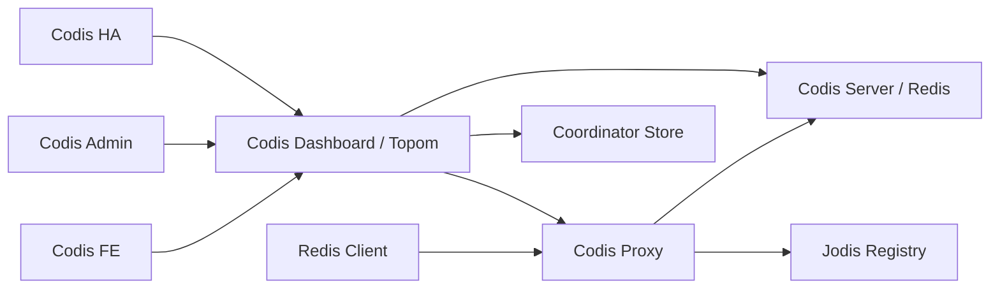

# Codis 架构总入口

## 0. 术语

- **Codis Proxy**：客户端连接的 Redis 协议代理，负责认证、命令解析、slot 路由、pipeline 响应写回和运行时指标；入口在 `cmd/proxy/main.go:31`，核心类型是 `pkg/proxy/proxy.go:29`。
- **Topom / Codis Dashboard**：集群拓扑管理进程。`cmd/dashboard` 创建 `topom.Topom` 并启动管理 HTTP API；`Topom` 内部持有 store、cache、slot action、stats 和 HA 状态，见 `pkg/topom/topom.go:28`。
- **Coordinator / Store**：保存集群元数据的外部存储抽象。`models.Client` 定义读写、列表、watch、临时节点接口，支持 zookeeper、etcd、filesystem 三类实现，见 `pkg/models/client.go:15` 和 `pkg/models/client.go:31`。
- **Slot**：Codis 的路由分片单位，固定为 1024 个；模型常量在 `pkg/models/slots.go:13`，proxy 内部 slot 状态在 `pkg/proxy/slots.go:12`。
- **Group**：一组后端 Redis Server，第一台按现有代码语义承担 master 位置，类型定义在 `pkg/models/group.go:8`。
- **Go module manifest**：仓库根目录的 `go.mod` / `go.sum`，用于现代 Go module mode 下解析 cmd/pkg 默认构建标签依赖；当前是迁移过渡态，默认 cmd/pkg 和 `cgo_jemalloc` proxy 构建都已接通，完整 vendor 清理和 Makefile module mode 收口仍由 roadmap 后续条目处理。

## 1. 定位与受众

这份文档描述当前仓库已经落地的系统地图，服务于 feature-design、issue-analyze 和新人上手。读完应能判断一次改动会碰到哪个入口、哪个核心包、哪些运行期状态，以及哪些变更必须经过 dashboard/topom。

## 2. 结构与交互

构建层面，仓库已有 `go.mod` / `go.sum`，`GO111MODULE=on go test ./cmd/... ./pkg/...`、`GO111MODULE=on go build ./cmd/... ./pkg/...` 和 `GO111MODULE=on go build -tags cgo_jemalloc ./cmd/proxy` 都可在 module mode 下通过。`go.mod` 暂时使用 `go 1.13` + `toolchain go1.26.1`，原因是顶层旧 `vendor/` 仍存在且没有 `vendor/modules.txt`；Go 1.14+ 会在存在 vendor 目录时默认进入 vendor mode。`cgo_jemalloc` 路径通过 `go.mod` 的 `replace github.com/spinlock/jemalloc-go => ./third_party/jemalloc-go` 指向仓库内受控的本地模块，不再依赖旧 `vendor/github.com/spinlock/jemalloc-go` 的预处理状态。`Makefile` 已切换到 module mode（移除了 `GO15VENDOREXPERIMENT` 和旧 `vendor/github.com/spinlock/jemalloc-go` 预处理调用），产出 `codis-dashboard`、`codis-proxy`、`codis-admin`、`codis-ha`、`codis-fe` 和嵌入式 `codis-server`；Go 二进制构建规则在 `Makefile:10` 到 `Makefile:25`，Redis Server 构建和配置刷新在 `Makefile:28` 到 `Makefile:37`。

版本元数据由 `pkg/utils/version.go` 提供 clean checkout 默认值，`version` 脚本生成 `bin/version` 和 `bin/version.ldflags`，Makefile 通过 `-ldflags -X` 注入真实 git/date 信息。该文件不再由构建脚本覆盖，避免一次 `make` 后源码进入脏状态。

运行入口按组件拆在 `cmd/`。`cmd/proxy/main.go:31` 解析 proxy 参数和配置，创建 `proxy.New(config)` 后按 dashboard、coordinator 或 fillslots 三种方式上线，见 `cmd/proxy/main.go:187` 和 `cmd/proxy/main.go:219`。`cmd/dashboard/main.go:25` 解析 dashboard 参数，创建 coordinator client 和 `topom.New`，启动时通过 store 抢占拓扑锁，见 `cmd/dashboard/main.go:118`、`cmd/dashboard/main.go:136` 和 `pkg/topom/topom.go:179`。

proxy 内部先建立两个监听器：对客户端的 Redis 协议监听和对管理面的 HTTP API 监听，分别由 `Proxy.setup` 填入 model，见 `pkg/proxy/proxy.go:105` 到 `pkg/proxy/proxy.go:143`。`Proxy.New` 创建 router、启动 admin/proxy 服务并启动 metrics reporter，见 `pkg/proxy/proxy.go:58` 到 `pkg/proxy/proxy.go:102`。

客户端连接在 `serveProxy` 中被 accept 后创建 `Session`，每个 session 拆出 reader 和 writer 两条 goroutine；reader 解码 Redis multi bulk、生成 `Request` 并交给 router，writer 等待后端响应后按原顺序写回，见 `pkg/proxy/proxy.go:396`、`pkg/proxy/session.go:114`、`pkg/proxy/session.go:152` 和 `pkg/proxy/session.go:199`。

命令路由的第一层在 `Session.handleRequest`。它先处理 `QUIT`、`AUTH`、`SELECT` 等本地命令，再对 `MGET`、`MSET`、`DEL`、`EXISTS`、`SLOTSINFO`、`SLOTSSCAN`、`SLOTSMAPPING` 做特殊处理，其余命令走 `Router.dispatch`，见 `pkg/proxy/session.go:257` 到 `pkg/proxy/session.go:308`。`Router.dispatch` 用 hash key 计算 slot id 后调用 slot 的 forward method，见 `pkg/proxy/router.go:139` 到 `pkg/proxy/router.go:143`。

slot 路由状态由 dashboard 下发到 proxy。`Topom.reinitProxy` 会向 proxy 填充 slot、启动 proxy 并设置 sentinel；局部 slot 变化通过 `resyncSlotMappings` 并发调用所有 proxy 的 `FillSlots`，见 `pkg/topom/topom_proxy.go:126` 到 `pkg/topom/topom_proxy.go:170`。proxy 侧 `FillSlot` 根据 `models.Slot` 更新 backend、migrate、replicaGroups 和 forward method，见 `pkg/proxy/router.go:102` 到 `pkg/proxy/router.go:120` 以及 `pkg/proxy/router.go:168` 到 `pkg/proxy/router.go:213`。

迁移由 dashboard/topom 组织状态机，proxy 在请求转发时配合迁移。dashboard 创建 slot action 后把状态从 pending 推进到 prepared/migrating/finished，见 `pkg/topom/topom_slots.go:19`、`pkg/topom/topom_slots.go:188` 和 `pkg/topom/topom_slots.go:307`。真正搬迁 key 时，topom 根据 migration method 调用 Redis 侧迁移命令，见 `pkg/topom/topom_slots.go:358` 到 `pkg/topom/topom_slots.go:446`；proxy 在转发中遇到 migrating slot 会先执行同步或半异步迁移包装逻辑，见 `pkg/proxy/forward.go:35` 到 `pkg/proxy/forward.go:62` 和 `pkg/proxy/forward.go:72` 到 `pkg/proxy/forward.go:132`。

dashboard 的管理 API 在 `pkg/topom/topom_api.go:31` 注册。它暴露 proxy、group、slot action、rebalance、sentinel 等操作路由，见 `pkg/topom/topom_api.go:72` 到 `pkg/topom/topom_api.go:123`。proxy 自己的管理 API 在 `pkg/proxy/proxy_api.go:29` 注册，提供 model、stats、slots、start、fillslots、sentinels、forcegc、shutdown 等操作，见 `pkg/proxy/proxy_api.go:63` 到 `pkg/proxy/proxy_api.go:83`。

运维入口分三类：`codis-admin` 是命令行入口，按参数分发到 proxy、dashboard 或底层配置操作，见 `cmd/admin/main.go:12` 到 `cmd/admin/main.go:85`；`codis-fe` 既提供静态前端资源，也根据静态列表或 coordinator 动态发现 dashboard 并做 reverse proxy，见 `cmd/fe/main.go:127` 到 `cmd/fe/main.go:194` 和 `cmd/fe/main.go:259` 到 `cmd/fe/main.go:330`；`codis-ha` 周期性读取 dashboard stats，发现异常 proxy/server 后通过 dashboard API 做清理或 promote，见 `cmd/ha/main.go:90` 到 `cmd/ha/main.go:99` 和 `cmd/ha/main.go:248` 到 `cmd/ha/main.go:369`。

## 3. 数据与状态

集群元数据统一放在 `/codis3/{product}` 命名空间下：topom 锁、slot、group、proxy、sentinel 路径由 `pkg/models/store.go:27` 到 `pkg/models/store.go:59` 定义。`Store` 封装对这些路径的读写，包含 slot mappings、group、proxy、sentinel 的 load/list/update/delete，见 `pkg/models/store.go:73` 到 `pkg/models/store.go:256`。

dashboard/topom 的内存状态分为 model、store、cache、action、stats、ha 几块：cache 保存 slots/group/proxy/sentinel 快照，action 保存迁移执行状态，stats 保存 Redis 和 proxy 统计，ha 保存 sentinel 观察到的 masters，见 `pkg/topom/topom.go:28` 到 `pkg/topom/topom.go:78`。

proxy 的内存状态包括身份认证 token、`models.Proxy`、两个 listener、router、HA sentinel monitor 和可选 Jodis 注册器，见 `pkg/proxy/proxy.go:29` 到 `pkg/proxy/proxy.go:54`。router 持有 1024 个 slot、主从后端连接池和 online/closed 状态，见 `pkg/proxy/router.go:18` 到 `pkg/proxy/router.go:30`。

后端 Redis 数据本身不进入 coordinator；coordinator 只保存拓扑和动作状态。Codis Server 基于嵌入式 Redis 源码构建，并增加 slot 查询、slot 删除和迁移相关命令，说明见 `doc/redis_change_zh.md:1` 到 `doc/redis_change_zh.md:17` 以及 `doc/redis_change_zh.md:84` 到 `doc/redis_change_zh.md:103`。

运行指标在 proxy 和 dashboard 两侧都有。proxy 的 HTTP stats/model/slots API 见 `pkg/proxy/proxy_api.go:104` 到 `pkg/proxy/proxy_api.go:149`，并可上报 JSON、InfluxDB、StatsD，见 `pkg/proxy/metrics.go:42` 到 `pkg/proxy/metrics.go:174`。dashboard 周期刷新 Redis 和 proxy stats，见 `pkg/topom/topom.go:204` 到 `pkg/topom/topom.go:226`。

## 5. 代码锚点

- `cmd/proxy/main.go:main` — proxy 进程入口、配置解析、上线方式选择。
- `pkg/proxy.Proxy` — proxy 运行态对象，持有 listener、router、HA、Jodis 和 metrics。
- `pkg/proxy.Session` — 客户端连接生命周期、Redis 命令解析、pipeline 读写。
- `pkg/proxy.Router` — slot 到后端连接的路由表和 master/replica 选择。
- `pkg/proxy.forwardSync` / `forwardSemiAsync` — slot 迁移期间的请求转发策略。
- `cmd/dashboard/main.go:main` — dashboard 进程入口、coordinator client 创建、topom 启动。
- `pkg/topom.Topom` — 拓扑管理核心对象，承载 store/cache/action/stats/ha。
- `pkg/topom/topom_api.go:newApiServer` — dashboard HTTP 管理 API 路由。
- `pkg/topom/topom_slots.go` — slot action、迁移推进、rebalance。
- `pkg/topom/topom_group.go` — group/server 增删、主从 promotion、同步标记。
- `pkg/topom/topom_proxy.go` — proxy 注册、上线、重初始化和 slot 同步。
- `pkg/topom/topom_sentinel.go` — sentinel 配置同步和 master 切换。
- `pkg/models.Client` / `pkg/models.Store` — coordinator 存储抽象和 Codis 元数据路径。
- `cmd/fe/main.go` — FE 静态资源服务和 dashboard reverse proxy。
- `cmd/admin/main.go` — admin CLI 参数分发。
- `cmd/ha/main.go` — HA 巡检和自动维护循环。
- `Makefile` — 二进制、嵌入式 Redis、默认配置的构建入口。
- `go.mod` / `go.sum` — Go modules 最小编译闭环的依赖入口和校验锁定。
- `third_party/jemalloc-go` — `github.com/spinlock/jemalloc-go` 的本地 replace 模块，提供 `cgo_jemalloc` 构建所需的 Go wrapper、头文件和 C 源码。
- `pkg/utils/version.go` / `version` — clean checkout 版本元数据兜底和 Makefile 构建时的 ldflags 注入来源。

## 6. 已知约束 / 边界情况

- 当前仓库已建立 Go modules 编译闭环：默认 cmd/pkg module mode 可编译测试，`cgo_jemalloc` proxy 也可通过 `third_party/jemalloc-go` 的本地 replace 模块在 module mode 下构建；`Makefile` 已完成 module mode 切换（`make gotest`、`make build-all` 均不再依赖 GOPATH/vendor 参数）；旧 `vendor/` / `Godeps/` 清理仍由 `.codestable/roadmap/go-mod-migration/` 后续条目处理。
- `go.mod` 的 `go 1.13` 是旧 `vendor/` 清理前的临时规避，不是长期最低 Go 版本承诺；旧 `vendor/` 退休后应提升到当前工具链版本。
- 对同一个业务集群，现有文档要求同一时刻最多一个 dashboard，且所有集群修改都经由 dashboard 完成，见 `doc/tutorial_zh.md:43` 到 `doc/tutorial_zh.md:46`。
- proxy 通过普通 Redis 协议面向客户端，但并不支持所有 Redis 命令；现有 README 明确提到 unsupported command list，见 `README.md:23` 到 `README.md:26`。
- slot 数固定为 1024，改变该常量会影响模型、路由、迁移和外部元数据兼容性，见 `pkg/models/slots.go:13`。
- `product_name` 同时参与元数据命名空间、proxy/dashboard 鉴权和运行期路由隔离，格式校验在 `pkg/models/store.go:258` 到 `pkg/models/store.go:263`。
- `Makefile` 的组件构建会刷新 `config/dashboard.toml`、`config/proxy.toml`、`config/redis.conf`、`config/sentinel.conf`，见 `Makefile:12` 到 `Makefile:37`。

## 7. 相关文档

- `.codestable/requirements/redis-cluster-service.md` — 当前架构承载的核心能力描述。
- `README.md` — 项目定位、特性对比、用户入口。
- `doc/tutorial_zh.md` / `doc/tutorial_en.md` — 组件说明、快速启动、HA 和部署说明。
- `doc/redis_change_zh.md` — Codis Server 对 Redis 的命令扩展。
- `doc/unsupported_cmds.md` — proxy 命令兼容边界。
- `.codestable/reference/shared-conventions.md` — CodeStable 目录和命名规范。
- `.codestable/roadmap/go-mod-migration/go-mod-migration-roadmap.md` — Go modules 迁移后续条目和边界。
