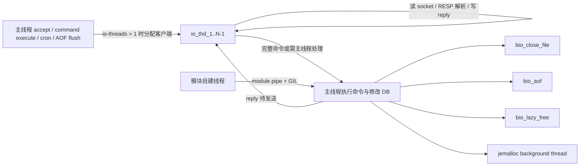

## 问题与范围

回答当前项目内嵌 `extern/redis-8.6.3/` 的 Redis 8 多线程模型：进程内有哪些常驻/条件线程，各自做什么，不把 `fork()` 的 RDB/AOF 子进程误归为线程。

## 速答

Redis 8 仍以主线程串行执行命令和维护核心数据结构为中心。默认配置下网络 I/O 线程未开启，因为 `io-threads` 默认是 `1`，项目 `config/redis8.conf` 也只是注释了 `# io-threads 4`；但 BIO 三个后台线程会在启动末尾创建，`jemalloc-bg-thread yes` 默认打开时还会启用 jemalloc 内部后台清理线程。

## 关键证据

- `extern/redis-8.6.3/src/config.c:3242` 定义 `io-threads` 默认值为 `1`，`config/redis8.conf:1357` 只是注释示例，因此默认没有额外网络 I/O 线程。
- `extern/redis-8.6.3/src/server.c:3190` 在 `InitServerLast()` 依次调用 `bioInit()`、`initThreadedIO()`、`set_jemalloc_bg_thread()`，线程创建发生在模块加载之后。
- `extern/redis-8.6.3/src/iothread.c:887` 到 `extern/redis-8.6.3/src/iothread.c:935`：`server.io_threads_num > 1` 才创建 I/O 线程，实际创建 `1..io_threads_num-1`，线程名是 `io_thd_%d`，每个线程有自己的 `aeEventLoop`。
- `extern/redis-8.6.3/src/networking.c:1618` 到 `extern/redis-8.6.3/src/networking.c:1619`：新客户端接受后，如果 `io_threads_num > 1` 会被分配到 I/O 线程。
- `extern/redis-8.6.3/src/networking.c:3667` 到 `extern/redis-8.6.3/src/networking.c:3673`：I/O 线程读到完整命令后不执行命令，只标记 `CLIENT_IO_PENDING_COMMAND` 并转交主线程。
- `extern/redis-8.6.3/src/server.c:1983` 到 `extern/redis-8.6.3/src/server.c:2007`：主线程在 `beforeSleep()` 中处理 I/O 线程交回的客户端、处理 pending write，再把客户端送回 I/O 线程。
- `extern/redis-8.6.3/src/bio.c:51` 到 `extern/redis-8.6.3/src/bio.c:63` 定义三个 BIO worker：`bio_close_file`、`bio_aof`、`bio_lazy_free`；`extern/redis-8.6.3/src/bio.c:171` 到 `extern/redis-8.6.3/src/bio.c:178` 启动三个 pthread。
- `extern/redis-8.6.3/src/zmalloc.c:970` 到 `extern/redis-8.6.3/src/zmalloc.c:975` 通过 jemalloc `background_thread` mallctl 开关控制 jemalloc 后台线程；`extern/redis-8.6.3/src/config.c:3165` 默认开启。

## 细节展开

### 1. 主线程

职责是 `accept`、执行 Redis 命令、修改 DB/复制/AOF/集群等核心状态、跑 `serverCron` 和 `beforeSleep/afterSleep`。即使启用 I/O 线程，命令执行仍回到主线程；I/O 线程只负责网络读写、协议解析和客户端生命周期中的一部分可并行工作。

主线程也负责 I/O 线程协同：暂停/恢复 I/O 线程、处理从 I/O 线程转交过来的完整命令、把执行完命令且可回到 I/O 线程的客户端再送回去。

### 2. 网络 I/O 线程

触发条件：`io-threads > 1`。`io-threads` 的含义包含主线程，所以配置为 `4` 时实际额外创建 `3` 个 `io_thd_1..3`。

每个 I/O 线程有自己的事件循环、pending client 队列和 notifier。普通客户端接受后会被分配给客户端数最少的 I/O 线程。I/O 线程负责：

- 监听自己绑定的客户端 socket。
- 读请求、填充 query buffer、RESP 解析。
- 写客户端输出缓冲。
- 对 replication client 做受限的读写进度维护。
- 定时把需要 cron 的客户端交回主线程。

不能在 I/O 线程执行 Redis 命令；完整命令会打上 `CLIENT_IO_PENDING_COMMAND` 交给主线程。Pub/Sub、monitor、blocked、tracking、Lua debug、Codis RDB export、ASM migrating/importing 等有竞态风险的客户端会留在或切回主线程。

### 3. BIO 后台线程

BIO 是启动后固定创建的三个 pthread，分别有独立 FIFO 队列：

- `bio_close_file`：后台 `close()` 文件，必要时先 `fsync` 和回收 page cache，避免慢 close 阻塞主线程。
- `bio_aof`：后台执行 AOF `fsync`，以及 `fsync + close` AOF fd。
- `bio_lazy_free`：后台释放大对象、异步 `FLUSH*` 换下来的 DB、tracking table、Lua scripts、functions ctx、replication backlog 引用内存等。

这些线程不执行命令，也不碰主线程不允许并发访问的 DB 逻辑；它们只处理被主线程逻辑上摘除后的资源。

### 4. jemalloc 后台线程

`jemalloc-bg-thread yes` 默认开启；Redis 通过 `set_jemalloc_bg_thread()` 打开 jemalloc 的 `background_thread`。它属于 allocator 内部线程，用于异步 purge/归还内存页。若构建没有使用 jemalloc，这个函数是 no-op。

### 5. 模块线程

Redis core 不主动为模块创建固定 worker，但模块可以自己 `pthread_create`。Redis 给模块线程提供两类协作机制：

- `module_pipe` 唤醒主事件循环。
- `RedisModule_ThreadSafeContextLock/Unlock` 通过 module GIL 保护线程安全上下文。

所以模块线程数量和职责由具体加载的模块决定，不是 Redis core 固定线程池。

### 6. 不是线程的并发实体

RDB `BGSAVE`、AOF rewrite、module fork 是 `redisFork()` 产生的子进程，不是线程。active defrag 也不是独立线程，它由主事件循环/cron 分片推进。

## 未决问题

没有发现项目默认配置打开 `io-threads`。如果线上配置覆盖了 `config/redis8.conf`，实际网络 I/O 线程数需要以运行时 `CONFIG GET io-threads` 或启动配置为准。

## 后续建议

如果要评估性能或线程安全风险，下一步应结合实际运行配置和 `INFO stats` 中 `io_threaded_reads_processed` / `io_threaded_writes_processed` 判断 I/O 线程是否真正参与工作。

## 相关文档

- `.codestable/compound/2026-05-27-explore-redis8-proxy-data-structures.md`
