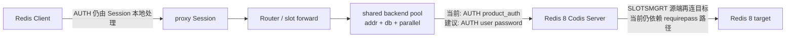

## 问题与范围

问题：当前底层 `codis-server` 已从 Redis 3 升级到 Redis 8，Redis 8 支持 ACL 用户名/密码和命令/key 权限。若先限定只改 `codis-proxy`，应该如何适配这项能力？

范围限定：本次只探索 `codis-proxy` 数据路径、客户端认证、后端连接池、proxy HA 读 Redis 信息和迁移时 proxy 触发的内部命令。没有设计 dashboard/topom、codis-server、coordinator schema 或 FE/API 管理面。

## 速答

判断：只改 `codis-proxy` 时，第一阶段应该做“proxy 作为后端 Redis 的服务账号，用 Redis 8 ACL 用户登录后端”，而不是承诺“客户端多账号 ACL 透传”。后者会撞上共享后端连接池、proxy 本地命令、迁移内部命令和 Redis server-to-server 迁移认证，已经超出小范围 proxy 改动。

推荐的 proxy-only 方案是新增独立后端认证配置，例如：

- `backend_auth_username = ""`
- `backend_auth_password = ""`

兼容规则：

- 两个新字段为空：保持现状，继续用 `product_auth` 对后端发 `AUTH <password>`。
- 只配置 `backend_auth_password`：对后端发旧形式 `AUTH <password>`，用于兼容 Redis `requirepass` / default user。
- 同时配置 `backend_auth_username` 和 `backend_auth_password`：对后端发 Redis 6+ ACL 形式 `AUTH <username> <password>`。
- 禁止只配置 username 不配置 password；新 secret 字段不要出现在 stats/config JSON。

这解决的是“Redis 8 backend 可以关闭无密码 default user，并允许 proxy 用命名服务账号登录”的一部分。但如果目标是“default user 关闭后迁移、topom 直连、sentinel、客户端 ACL 权限都完整可用”，只改 proxy 不够。

## 关键证据

1. `pkg/proxy/config.go:172` 到 `pkg/proxy/config.go:195` 只有 `ProductAuth`、`SessionAuth` 和后端连接参数，没有后端 Redis ACL username/password 字段；`Validate` 也没有相关校验。

2. `pkg/proxy/backend.go:157` 到 `pkg/proxy/backend.go:175` 建后端连接后先 `verifyAuth(c, config.ProductAuth)`，再 `SELECT` DB；`pkg/proxy/backend.go:183` 到 `pkg/proxy/backend.go:191` 的 `verifyAuth` 只会拼 `AUTH <auth>`，不支持 `AUTH <user> <pass>`。

3. `pkg/proxy/router.go:37` 到 `pkg/proxy/router.go:40` 创建 primary/replica 后端连接池时只传 `Config`；`pkg/proxy/backend.go:514` 到 `pkg/proxy/backend.go:520` 连接池按 `addr` 复用 `sharedBackendConn`。现有池没有“客户端用户/ACL 身份”维度，所以不能直接把不同客户端 ACL 用户透传到底层共享连接。

4. `pkg/proxy/session.go:290` 到 `pkg/proxy/session.go:303` 在本地拦截 `AUTH`，未认证时只看 `session_auth`；`pkg/proxy/session.go:352` 到 `pkg/proxy/session.go:380` 要求 `AUTH` 必须 2 个 bulk 参数，只比较 `SessionAuth`，不转发后端，也不保存 username。

5. `pkg/proxy/forward.go:137` 到 `pkg/proxy/forward.go:149` 在同步迁移中由 proxy 对迁移源发 `SLOTSMGRTTAGONE`；`pkg/proxy/forward.go:169` 到 `pkg/proxy/forward.go:180` 在半异步迁移中由 proxy 对迁移源发 `SLOTSMGRT-EXEC-WRAPPER`。因此 proxy 后端服务账号不仅要能跑普通业务命令，还要能跑 Codis 扩展迁移命令。

6. `extern/redis-8.6.3/src/commands/slotsmgrttagone.json` 和 `slotsmgrt-exec-wrapper.json` 把这些 Codis 迁移命令标在 `KEYSPACE` / `DANGEROUS` ACL category。若生产希望最小权限，不能简单套 `+@read +@write`；要么先用受网络隔离保护的服务账号 `+@all ~*`，要么维护一份和 proxy allow-list 同步的精确命令白名单。

7. `pkg/proxy/router.go:257` 到 `pkg/proxy/router.go:265` 的 master 切换 run-id 检查仍用 `redis.InfoCache{Auth: s.config.ProductAuth}`；`pkg/proxy/proxy.go:338` 到 `pkg/proxy/proxy.go:346` 的 Sentinel 监听仍用 `redis.NewSentinel(..., ProductAuth)`。如果 Redis/Sentinel 也要求 ACL username，这些 proxy HA 辅助路径也要同步处理。

8. Redis 8 Codis Server 迁移链路目前仍有非 proxy 边界：`extern/redis-8.6.3/src/slots.c:519` 到 `extern/redis-8.6.3/src/slots.c:523` 的同步迁移目标认证只按 `server.requirepass` 发送旧形式 `AUTH <password>`；`extern/redis-8.6.3/src/slots_async.c:418` 到 `extern/redis-8.6.3/src/slots_async.c:421` 的异步 prelude 也先发 `SLOTSRESTORE-ASYNC-AUTH <requirepass>`。虽然 `SLOTSRESTORE-ASYNC-AUTH2` 已存在，但 prelude 当前没有使用它。

## 细节展开

### 方案 A：后端服务账号登录，适合先做

目标：proxy 到 Redis 8 后端的连接支持 ACL username/password。客户端仍只面对 Codis Proxy 的 `session_auth`，不暴露 Redis ACL 多用户语义。

改动面：

- `Config` 增加 `BackendAuthUsername` / `BackendAuthPassword`，默认空，JSON 隐藏 password。
- 加一个小的 auth helper，从 config 计算“后端认证身份”；新字段为空时落回 `ProductAuth`，保证 Never break userspace。
- `BackendConn.verifyAuth` 从 `string` 改为结构化 auth，按是否有 username 发送二参数或三参数 `AUTH`。
- `Router.SwitchMasters` 的 `InfoCache` 不能继续只拿 `ProductAuth`。若严格不改 `pkg/utils/redis`，就在 proxy 内补一个只用于 `run_id` 的轻量 `INFO` helper；若允许改共享 Redis client，则给 `redis.Client` / `InfoCache` 加 username 字段，但这会影响 topom/ha 等非 proxy 调用方。
- 若 proxy 自己监听 Sentinel 且 Sentinel 也启用 ACL，`redis.NewSentinel` 路径同样需要 username；否则先明确 sentinel ACL 不在本阶段范围。

测试重点：

- 后端 fake Redis 收到 `AUTH user pass` 后再收到 `SELECT` / 业务命令。
- 新字段为空时仍只发旧的 `AUTH <product_auth>`。
- username 非空但 password 为空时配置校验失败。
- proxy HA `SwitchMasters` 的 run-id 检查在 ACL backend 下能认证成功。

### 方案 B：客户端 `AUTH user pass` 兼容，只能算协议兼容

可以让 `Session.handleAuth` 接受 `AUTH <password>` 和 `AUTH <username> <password>` 两种形式，例如 username 只允许 `default` 或配置的 `session_auth_username`。这能兼容一些 Redis 6+ 客户端库默认发三参数 `AUTH` 的行为。

但它不是 Redis ACL：proxy 仍只比较一个 `SessionAuth`，不会按用户限制命令/key，不应该对外宣称“支持多账号 ACL”。

### 方案 C：客户端多账号 ACL 透传，不适合 proxy-only 小改

如果目标是客户端连接 proxy 后使用 Redis ACL 用户，并让 Redis server 执行命令/key 权限校验，有两条路：

- 每个客户端 ACL 用户独立后端连接池：后端池 key 至少要从 `addr` 扩展到 `addr + user + db + parallel`。这会显著放大连接数，并要求 proxy 长期持有客户端凭据用于重连。proxy 本地命令如 `CLIENT LIST`、`SLOTSMAPPING`、`CLUSTER NODES`、`INFO` 仍不会被后端 ACL 校验。
- proxy 自己实现 ACL enforcement：后端只用服务账号登录，proxy 在本地按用户规则过滤命令/key。这样才符合代理架构，但需要 ACL 规则来源、存储、热更新、命令 key-spec 解析和与 Redis ACL 语义的一致性设计，已经不是只改 `codis-proxy` 的轻量适配。

所以这一步不建议把后端 Redis ACL 当成客户端 ACL 透明透传。

### Redis 8 ACL 官方行为约束

Redis 官方文档说明 ACL 会把连接和认证用户绑定，限制该连接可执行的命令和可访问 key；`AUTH` 在 Redis 6 起支持 `AUTH <username> <password>`，旧形式 `AUTH <password>` 等价于对 `default` 用户认证。也就是说 ACL 是“连接身份”，这正是 Codis 共享后端连接池不能直接透传多客户端用户的根本原因。

## 未决问题

- 本阶段成功标准到底是“proxy 后端服务账号能用命名 ACL 登录”，还是“客户端可以通过 proxy 获得 Redis ACL 多账号权限”？二者实现复杂度不同。
- 是否允许 Redis 8 backend 在过渡期继续保留 default user / `requirepass` 兼容路径？如果要关闭 default user，当前 server-to-server 迁移认证也需要改 codis-server。
- proxy HA 是否必须在同一阶段支持 Sentinel ACL username？如果是，范围会碰到 `pkg/utils/redis` 或需要 proxy-local Sentinel client 改造。
- 是否需要支持 `HELLO ... AUTH ...` / RESP3？当前 proxy 没有本地处理 `HELLO`，不能把 Redis 8 ACL 客户端体验等同于原生 Redis。

## 后续建议

先把“后端服务账号 ACL 登录”拆成一个小 feature 设计；若目标是完整客户端 ACL，多开一份 roadmap，不要混在同一个 proxy-only 小改里。

## 相关文档

- `.codestable/architecture/ARCHITECTURE.md` — 当前 Redis 8 Codis Server、proxy 路由和迁移链路系统地图。
- `doc/unsupported_cmds.md` — proxy 命令兼容边界。
- Redis 官方 ACL 文档：https://redis.io/docs/latest/operate/oss_and_stack/management/security/acl/
- Redis 官方 AUTH 命令文档：https://redis.io/docs/latest/commands/auth/
