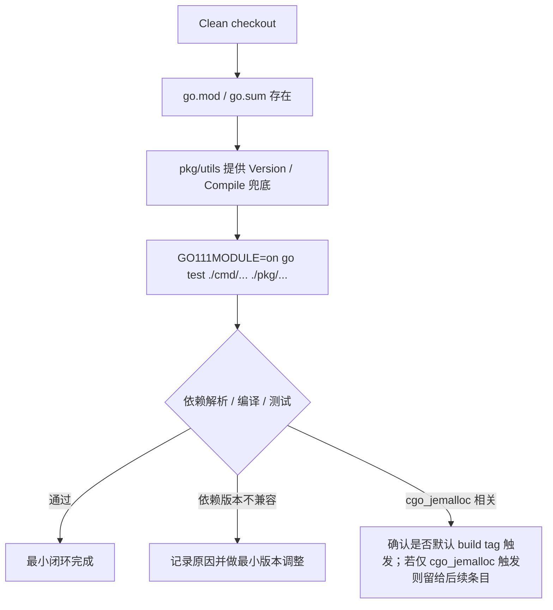

# go-module-compile-baseline design

## 0. 术语约定

- **Go module manifest**：指仓库根目录的 `go.mod` / `go.sum`。代码中当前没有 `go.mod` / `go.sum`，只有 `Godeps/Godeps.json`。
- **module mode**：指 `GO111MODULE=on` 下运行 `go test` / `go build`。当前基线命令 `GO111MODULE=on go test ./cmd/... ./pkg/...` 失败，错误是 `directory prefix cmd does not contain main module or its selected dependencies`。
- **Godeps baseline**：指 `Godeps/Godeps.json` 里的 Go 1.8 时代依赖锁定。它是本 feature 迁移依赖版本的主要输入，不代表必须无条件保留每个旧 revision。
- **version metadata**：指 `pkg/utils.Version` / `pkg/utils.Compile` 两个 Go 变量。当前由根目录 `version` 脚本生成，clean checkout 下缺失会导致 `cmd/fe`、`cmd/proxy` 等包编译失败。
- **cgo_jemalloc**：指 `go build -tags cgo_jemalloc ./cmd/proxy` 使用的 jemalloc 路径。本 feature 不实现它，只保证非 `cgo_jemalloc` 的 cmd/pkg 编译最小闭环；后续由 roadmap 条目 `jemalloc-module-build` 处理。
- **temporary go directive**：指本 feature 暂时使用 `go 1.13` + `toolchain go1.26.1`。原因是仓库根目录仍保留旧 `vendor/`，`go 1.14+` 会自动进入 vendor mode，而旧 vendor 没有 `vendor/modules.txt`，会阻断 module cache 依赖解析。

## 1. 决策与约束

### 需求摘要

本 feature 要让维护者在仓库根目录、默认现代 Go modules 语义下，执行 `GO111MODULE=on go test ./cmd/... ./pkg/...` 能完成基础编译和测试。目标服务对象是维护 Codis 构建体系的人；成功标准是 cmd/pkg 在非 `cgo_jemalloc` 路径下不再依赖 GOPATH 或旧 vendor 解析。

明确不做：

- 不处理 `go build -tags cgo_jemalloc ./cmd/proxy`，该能力留给 `jemalloc-module-build`。
- 不改 `Makefile` 的构建入口，除非为了本 feature 的基础验证补充最小注释或不影响旧入口的兜底；Makefile 模块化留给 `makefile-module-mode`。
- 不删除 `vendor/` 或 `Godeps/`，旧依赖清理留给 `legacy-vendor-retirement`。
- 不改 Dockerfile、kubernetes、scripts/docker.sh。
- 不改变 Codis 运行协议、配置格式、proxy/topom 行为。

### 复杂度档位

按“项目内部构建能力”默认档位走，偏离项如下：

- 兼容性 = backward-compatible（偏离内部工具默认 active 的原因：迁移必须保持现有 Redis/proxy/topom 行为，不把构建迁移变成运行行为变化）。
- 可测试性 = tested（偏离内部工具默认 testable 的原因：本 feature 的产出必须用 `go test ./cmd/... ./pkg/...` 自证，不接受只生成文件不验证）。
- 确定性 = reproducible（偏离默认未指定的原因：`go.mod/go.sum` 必须锁定依赖解析，避免不同机器拿到不同依赖图）。

### 关键决策

1. 模块名固定为 `github.com/CodisLabs/codis`。
   - 依据：所有内部 import 已经使用该路径；改模块名会把迁移扩大成全仓 import 改写。

2. 本 feature 临时使用 `go 1.13` + `toolchain go1.26.1`。
   - 依据：当前本机 `go version` 是 `go1.26.1 darwin/arm64`；但仓库仍保留旧 `vendor/`，如果 `go` 指令直接写 `1.26.1`，Go 会自动使用 vendor mode 并要求 `vendor/modules.txt`，这会把最小闭环提前扩大成 vendor 迁移。`toolchain go1.26.1` 保留本地工具链约束，`go 1.13` 只用于临时规避旧 vendor 自动接管。
   - 维护约束：`go.mod` 内必须保留该临时选择的注释，因为 `go 1.13` 在这里不是长期最低版本承诺，而是旧 `vendor/` 清理前的过渡手段。`go help build` 已确认 `go.mod` 中 `go >= 1.14` 且存在顶层 `vendor/` 时，Go 默认等同 `-mod=vendor`。
   - 长期方案：`legacy-vendor-retirement` 完成后删除或彻底归档旧 vendor，再把 `go` directive 提升到 `1.26.1`，届时不再需要该临时规避。

3. 依赖版本从 `Godeps/Godeps.json` 迁移，但允许为 module path 或现代 Go 编译做最小升级。
   - 依据：Godeps 记录的是 import path + revision；Go modules 需要 module path + semantic version 或 pseudo-version。不能无依据地“大升级”，但也不能为了保留旧 revision 牺牲 module mode 编译。
   - 本次实际调整：`github.com/ugorji/go` 从 Godeps 旧 revision 升到 `v1.2.14`，因为旧 revision 在 Go 1.26 下初始化 codec alphabet 时 panic；`github.com/coreos/etcd` 升到 `v3.3.27+incompatible`，因为 `v3.0.17+incompatible` 的生成代码依赖旧 codec helper，无法与现代 `ugorji/go` 一起编译。

4. version metadata 采用“仓库内有兜底 Go 文件，Makefile 用 ldflags 注入真实值”的策略。
   - 依据：当前 `version` 脚本生成 `pkg/utils/version.go`；旧 GOPATH 测试基线在正确路径下仍因该文件缺失失败。兜底文件能让 clean checkout 可测试。
   - 修正后的所有权：`pkg/utils/version.go` 作为源码提交，只提供默认变量；`version` 脚本不再写该文件，只生成 `bin/version` 与 `bin/version.ldflags`；Makefile 构建通过 `-ldflags -X` 注入真实 git/date 信息，避免 `make` 覆盖源码造成脏工作区。

5. 测试里的临时 admin 监听地址固定为 `127.0.0.1:0`。
   - 依据：`0.0.0.0:0` 经过 `ReplaceUnspecifiedIP` 会通告成本机 hostname；在部分本地环境下该 hostname 不能稳定回连测试进程。该调整只影响 `*_test.go`，不改变运行时默认配置。

## 2. 名词与编排

### 2.1 名词层

#### Go module manifest

现状：

- 仓库根目录没有 `go.mod` / `go.sum`。
- `Godeps/Godeps.json` 声明 `ImportPath: github.com/CodisLabs/codis`、`GoVersion: go1.8`，并锁定 `github.com/BurntSushi/toml`、`github.com/coreos/etcd`、`github.com/garyburd/redigo`、`golang.org/x/net/context` 等依赖。
- `vendor/` 下保存普通 Go 依赖和 `github.com/spinlock/jemalloc-go`。

变化：

- 新增 `go.mod`，模块名为 `github.com/CodisLabs/codis`；本 feature 阶段临时写 `go 1.13` 和 `toolchain go1.26.1`，用于在旧 `vendor/` 尚未清理前建立 module mode 最小闭环。
- 新增 `go.sum`，由 Go toolchain 根据实际依赖图生成。
- 依赖导入以当前源码实际 import 为准，Godeps 是版本选择输入；未被源码引用的 Godeps 条目不强制进入最终 require。
- `github.com/spinlock/jemalloc-go` 不作为本 feature 的必过项；如果普通 `go test ./cmd/... ./pkg/...` 因 build tag 默认排除它，则不在本 feature 里解决它的 module 来源。
- 长期彻底更新方案：等 `legacy-vendor-retirement` 删除或归档旧 vendor，并确认不再触发自动 vendor mode 后，把 `go.mod` 的 `go` directive 从 `1.13` 提升为 `1.26.1`；如果仍需要 vendor 模式，则必须生成并维护一致的 `vendor/modules.txt`，但这不是本 roadmap 的首选方向。

接口示例：

```text
输入：GO111MODULE=on go test ./cmd/... ./pkg/...
输出：Go toolchain 从 go.mod/go.sum 解析依赖，不再报 "directory prefix cmd does not contain main module"
来源：Go module manifest 契约，roadmap 第 4.1 节
```

#### Version metadata

现状：

- `cmd/proxy/main.go`、`cmd/dashboard/main.go`、`cmd/fe/main.go`、`cmd/ha/main.go`、`pkg/proxy/proxy.go`、`pkg/topom/topom.go` 都读取 `utils.Version` / `utils.Compile`。
- `version` 脚本会写 `pkg/utils/version.go`，但该文件不在 clean checkout 中。
- 旧 GOPATH 路径下直接 `go test ./cmd/... ./pkg/...` 已能解析 vendor 依赖，但会因 `undefined: utils.Version` / `undefined: utils.Compile` 失败。

变化：

- 在 `pkg/utils` 内保留一个可提交的默认 version metadata 定义，提供 `Version` / `Compile` 两个变量。
- `version` 脚本仍可在构建时生成真实 git/date 信息，但不再写 `pkg/utils/version.go`；Makefile 通过 `bin/version.ldflags` 注入真实值，裸 `go build` / `go test` 则使用默认值。

接口示例：

```go
package utils

var (
    Version = "unknown version"
    Compile = "unknown datetime"
)
// 来源：cmd/proxy/main.go, pkg/proxy/proxy.go, version
```

### 2.2 编排层



现状：

- `Makefile` 通过 `export GO15VENDOREXPERIMENT=1` 和 GOPATH/vendor 语义构建。
- 本机 `GO111MODULE=on`，仓库根目录无 module manifest，module mode 命令当前在入口阶段失败。
- 旧 GOPATH 基线不在当前 checkout 路径直接工作；复制到 GOPATH 正确路径后，依赖能解析，但 clean checkout 缺 `pkg/utils/version.go`。

变化：

- 在不改变运行入口和业务代码语义的前提下，先建立 module mode 的最小编译路径。
- 编排顺序是先提供 module manifest，再补 version metadata 兜底，再跑 module mode 测试，根据失败结果只做为测试通过所需的依赖版本最小调整。
- 对于 `cgo_jemalloc` 的失败，只判断它是否影响默认 `go test ./cmd/... ./pkg/...`；不把 jemalloc 模块化并入本 feature。

流程级约束：

- 依赖解析失败必须落到具体 module path 和版本原因，不用“升级全部依赖”兜底。
- `go.mod/go.sum` 是本 feature 的唯一新依赖入口；不能新增并依赖旧 vendor 机制。
- 本 feature 的 `go 1.13` 是临时兼容手段，不是长期目标；后续 vendor 清理完成后必须回到 `go 1.26.1`。
- `Version` / `Compile` 兜底值只服务 clean checkout 编译；Makefile 需要真实版本信息时必须通过 `bin/version.ldflags` 注入，不能覆盖源码文件。
- `version` 脚本不能再写 `pkg/utils/version.go`；真实版本信息只能通过 `bin/version` 和 `bin/version.ldflags` 进入 Makefile 构建。
- 所有运行期行为变化都视为越界；本 feature 的验证以编译和既有测试为主。

### 2.3 挂载点清单

- `go.mod`：仓库根目录 — 新增 Go module manifest，成为 Go toolchain 依赖解析入口。
- `go.sum`：仓库根目录 — 新增 checksum lockfile，固定 module 依赖校验。
- `pkg/utils.Version` / `pkg/utils.Compile`：`pkg/utils` 包 — 新增 clean checkout 兜底定义。

### 2.4 推进策略

1. Module manifest 骨架：建立 `go.mod`，模块名和 Go 版本符合契约。
   - 退出信号：`GO111MODULE=on go test ./cmd/... ./pkg/...` 不再停在 “does not contain main module”。

2. Version metadata 兜底：让 clean checkout 下 `utils.Version` / `utils.Compile` 总是存在。
   - 退出信号：旧 GOPATH 基线中的 `undefined: utils.Version` / `undefined: utils.Compile` 类错误在 module mode 下不再出现。

3. 依赖图收敛：根据源码实际 import 和 Godeps baseline 生成 `go.sum`，对无法直接编译的依赖做最小调整并记录原因。
   - 退出信号：`GO111MODULE=on go test ./cmd/... ./pkg/...` 能完成依赖下载、编译和测试。
   - 已知最小调整：`github.com/ugorji/go v1.2.14` 用于避免旧 codec 初始化 panic；`github.com/coreos/etcd v3.3.27+incompatible` 用于保留 `github.com/coreos/etcd/client` import 的同时兼容现代 codec 生成代码。

4. 范围守护：确认 jemalloc、Makefile、vendor 清理、Dockerfile 和部署脚本没有被本 feature 顺手修改。
   - 退出信号：diff 中不存在这些范围外文件的行为性改动。

### 2.5 结构健康度与微重构

##### 评估

- 文件级 — `version`：职责单一，迁移后只生成 `bin/version` 和 `bin/version.ldflags`；本 feature 只调整生成目标，不需要拆分。
- 文件级 — `Godeps/Godeps.json`：127 行，作为迁移输入读取；本 feature 不直接改它。
- 目录级 — 仓库根目录：当前 9 个同层文件，本次新增 `go.mod` / `go.sum` 符合 Go 项目惯例，不构成目录摊平问题。
- 目录级 — `pkg/utils`：当前 6 个同层 Go 文件和多个子目录，新增一个 version metadata 文件符合包职责，不需要重组目录。
- compound convention 检索结果：`.codestable/compound` 当前没有相关 convention 文档。

##### 结论：不做微重构

原因：本 feature 的新增点是 Go toolchain 标准入口和一个小型兜底版本元数据文件；目标文件/目录没有达到“只搬不改行为”的收益阈值。任何 Makefile 模块化、vendor 清理或 jemalloc 目录迁移都已拆到后续 roadmap 条目，不在这里做结构调整。

## 3. 验收契约

### 关键场景清单

- 触发：在仓库根目录执行 `GO111MODULE=on go test ./cmd/... ./pkg/...`。期望：命令不再报 `directory prefix cmd does not contain main module or its selected dependencies`，并完成 cmd/pkg 的编译和测试。
- 触发：clean checkout 未先运行 `bash version`，直接编译引用 `utils.Version` / `utils.Compile` 的包。期望：不出现 `undefined: utils.Version` 或 `undefined: utils.Compile`。
- 触发：删除本地 module cache 后重新执行 module mode 测试。期望：依赖由 `go.mod/go.sum` 恢复，不依赖 GOPATH 下的 `src/github.com/CodisLabs/codis`。
- 触发：检查默认构建标签下的测试。期望：不要求 `github.com/spinlock/jemalloc-go` 的 cgo 链路必须通过；`cgo_jemalloc` 只在后续条目验收。
- 触发：查看 `go.mod`。期望：`module github.com/CodisLabs/codis`，本 feature 阶段为 `go 1.13` + `toolchain go1.26.1`；同时 design 明确记录长期目标是在旧 vendor 清理后提升到 `go 1.26.1`。

### 明确不做的反向核对项

- Diff 不应包含 `Dockerfile`。
- Diff 不应删除 `vendor/` 或 `Godeps/`。
- Diff 不应修改 `pkg/proxy`、`pkg/topom`、`pkg/models` 中的运行逻辑来绕过测试。
- Diff 不应改 `pkg/utils/unsafe2/je_malloc.go` 或 jemalloc 源码。
- Diff 不应把 Makefile 改造成 module mode 主入口；该动作留给 `makefile-module-mode`。
- Diff 不应生成 `vendor/modules.txt` 或把本 feature 改成 vendor mode 方案。

## 4. 与项目级架构文档的关系

本 feature 引入系统级可见的构建入口变化：仓库从“没有 go.mod 的 GOPATH 项目”进入“存在 Go module manifest，cmd/pkg 可在 module mode 下测试”的过渡状态。

acceptance 阶段应核对是否需要更新 `.codestable/architecture/ARCHITECTURE.md` 的已知约束：

- 旧表述“当前仓库没有 `go.mod`，是 GOPATH 风格项目”将不再完全准确。
- 但 Makefile、jemalloc、vendor 清理尚未完成时，architecture 不应提前宣称全量迁移完成；可以记录为“Go modules 最小编译闭环已建立，完整构建入口仍由 roadmap 后续条目收尾”。
- acceptance 阶段还应记录临时 `go 1.13` directive 的原因：它不是长期目标，长期目标是在旧 vendor 清理后提升到 `go 1.26.1`。
