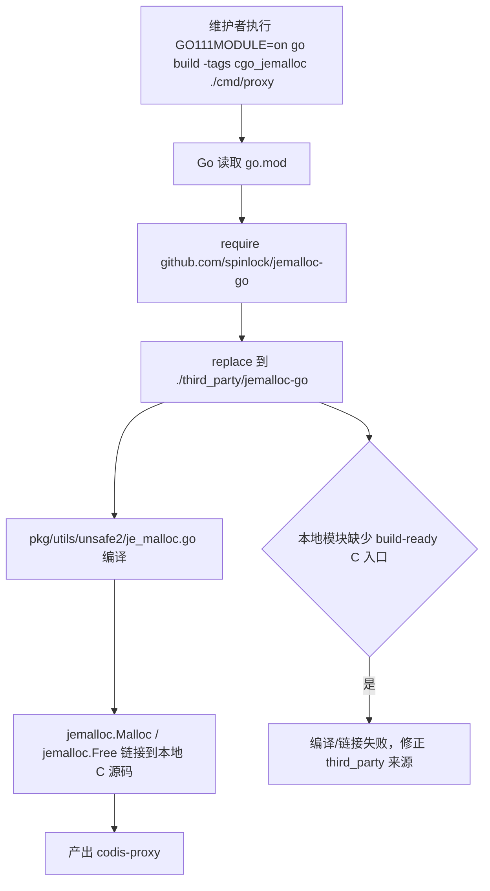

# jemalloc-module-build design

## 0. 术语约定

- **cgo_jemalloc**：`pkg/utils/unsafe2/je_malloc.go` 使用的 build tag。它只影响 offheap slice 的 malloc/free 来源，不等同于“所有 cgo 构建”。
- **jemalloc-go module source**：`github.com/spinlock/jemalloc-go` 这个 import path 的 Go modules 来源。roadmap 要求 `pkg/utils/unsafe2/je_malloc.go` 的 import path 默认不变。
- **build-ready jemalloc-go**：仓库内可被 `go build` 直接消费的 jemalloc-go 本地模块，必须包含 Go wrapper、头文件入口和 C 源码入口；不能依赖 Go 在 module cache 中执行 Makefile。
- **旧 vendor**：当前 `vendor/` 和 `Godeps/` 目录。它们可以作为迁移素材来源，但本 feature 不把它们作为 module mode 的依赖解析入口。

防冲突结论：代码和 CodeStable 文档中已有 `cgo_jemalloc`、`jemalloc-go`、`vendor`、`third_party` 相关叫法；本 design 沿用 roadmap 的命名，不新增平行术语。

## 1. 决策与约束

本 feature 要让维护者在仓库根目录执行：

```bash
GO111MODULE=on go build -tags cgo_jemalloc -o /tmp/codis-proxy-cgo-test ./cmd/proxy
```

时可以在 Go modules 模式下构建 proxy。服务对象是维护 Codis 构建体系的人；成功标准是 `cgo_jemalloc` 路径不再依赖 GOPATH 或旧 vendor 解析，同时 Redis/proxy 运行行为不变。

明确不做：

- 不处理 `Dockerfile`、`scripts/docker.sh`、`kubernetes/` 或部署路径。
- 不删除 `vendor/` 或 `Godeps/`，旧依赖清理留给 `legacy-vendor-retirement`。
- 不把 `Makefile` 改成完整 module mode 入口，`make gotest` / 单组件 build 的收口留给 `makefile-module-mode`。
- 不提升 `go.mod` 的 `go 1.13` 临时 directive，也不生成 `vendor/modules.txt`。
- 不改 proxy 路由、Redis 协议、offheap slice 的对外语义或内存限额逻辑。
- 不要求系统预装 jemalloc；构建来源必须跟随仓库或 Go modules 依赖定义。

复杂度档位偏离：

- **Compatibility = backward-compatible**：这是生产 proxy 的 allocator 构建路径，不能改变现有 build tag、import path 和运行语义。
- **Determinism = reproducible**：`go build` 不能依赖未跟踪的 symlink、手动执行过的 Makefile 或本地 vendor 状态。
- **Testability = verified**：必须用 `go build -tags cgo_jemalloc ./cmd/proxy` 和 `go test -tags cgo_jemalloc ./pkg/utils/unsafe2` 验证。

关键决策：

1. **采用仓库内 `third_party/jemalloc-go` + `go.mod replace`**。
   - 现状验证：当前直接构建失败为 `cannot find module providing package github.com/spinlock/jemalloc-go`；用 Godeps rev 下载到 module cache 后，模块只提供 `cgo_flags.go`，且 jemalloc C 源码入口依赖 Makefile 生成的 `je_*.c` / `jemalloc` / `VERSION`。module cache 是只读构建输入，不能作为需要预处理的源码目录。
   - 变化：把 build-ready 的 jemalloc-go 来源放进仓库内受控目录，并通过 `replace github.com/spinlock/jemalloc-go => ./third_party/jemalloc-go` 接入。
2. **保持 `pkg/utils/unsafe2/je_malloc.go` 的 import path 不变**。
   - roadmap 第 4.4 节把 `import "github.com/spinlock/jemalloc-go"` 作为硬约束；变更 import path 会扩大到运行代码语义，不作为首选方案。
3. **不引入 vendor mode**。
   - 当前 `go 1.13` 是为了规避旧 `vendor/` 自动接管；本 feature 继续走 module cache + local replace，不生成或维护 `vendor/modules.txt`。
4. **build-ready 文件必须是 tracked source**。
   - `go build` 过程中不能要求先运行 `make -C third_party/jemalloc-go` 生成未跟踪文件；否则 clean checkout 不可复现。

前置依赖：`go-module-compile-baseline` 已完成。没有需要先执行的结构性前置重构。

## 2. 名词与编排

### 2.1 名词层

现状：

- `pkg/utils/unsafe2/cgo_malloc.go` 在非 `cgo_jemalloc` 路径下用 `C.malloc` / `C.free`。
- `pkg/utils/unsafe2/je_malloc.go` 在 `cgo_jemalloc` 路径下导入 `github.com/spinlock/jemalloc-go`，并调用 `jemalloc.Malloc` / `jemalloc.Free`。
- `go.mod` 目前没有 `github.com/spinlock/jemalloc-go` 的 `require` 或 `replace`，所以 module mode 无法解析该 import。
- `vendor/github.com/spinlock/jemalloc-go` 含本仓库当前可用的 wrapper 和 jemalloc 4.4.0 源码，但根目录的 `je_*.c`、`jemalloc`、`VERSION` 是 Makefile 生成/链接的构建状态，不是适合 module mode 的长期入口。

变化：

- 新增本地 module source：`third_party/jemalloc-go`，作为 `github.com/spinlock/jemalloc-go` 的 build-ready 来源。
- 修改 Go module manifest，增加 `require` + `replace`：

```text
require github.com/spinlock/jemalloc-go v0.0.0-20161230074307-26719b2ee618
replace github.com/spinlock/jemalloc-go => ./third_party/jemalloc-go
```

- `third_party/jemalloc-go` 必须对外提供现有调用需要的 Go API：

```go
package jemalloc

func Malloc(size int) unsafe.Pointer
func Free(ptr unsafe.Pointer)
```

- `pkg/utils/unsafe2/je_malloc.go` 继续使用相同 import path 和 `cgo_jemalloc` build tag；如实现阶段证明必须调整 cgo flags，也只能在不改变 `cgo_malloc` / `cgo_free` 语义的范围内处理。

### 2.2 编排层



现状：

- 默认 `GO111MODULE=on go test ./cmd/... ./pkg/...` 已通过，但不会触发 `cgo_jemalloc`。
- `GO111MODULE=on go build -tags cgo_jemalloc -o /tmp/codis-proxy-cgo-test ./cmd/proxy` 当前停在 module 解析阶段。
- `Makefile` 的 `codis-deps` 仍会进入旧 `vendor/github.com/spinlock/jemalloc-go` 执行 Makefile，这是 GOPATH/vendor 时代的路径，完整 Makefile 收口不属于本 feature。

变化：

- module graph 能解析 `github.com/spinlock/jemalloc-go`，并且解析结果明确指向 `./third_party/jemalloc-go`。
- `cgo_jemalloc` 构建从“旧 vendor 预处理状态”切换为“本仓库 build-ready local replace module”。
- `go build -tags cgo_jemalloc ./cmd/proxy` 成为本 feature 的端到端验收入口；`Makefile` 后续再统一切到 module mode。

流程级约束：

- **错误语义**：依赖缺失、头文件缺失、C 符号未链接时直接让 `go build` 失败，不做静默 fallback 到 `C.malloc`。
- **幂等性**：重复执行验收命令不能生成或修改 tracked source；工作区不能因为构建出现新的 `je_*.c`、`jemalloc`、`VERSION` 或 `vendor/modules.txt`。
- **顺序约束**：先让 `pkg/utils/unsafe2` 的 `cgo_jemalloc` 包级测试通过，再验收 `cmd/proxy` 构建；否则 proxy 构建错误会掩盖 allocator 来源问题。
- **兼容性**：`MakeSlice` / `MakeOffheapSlice` / `FreeSlice` 的行为契约不变，`OffheapBytes` 统计不因 allocator 来源切换而变化。

### 2.3 挂载点清单

- `go.mod`：新增 `github.com/spinlock/jemalloc-go` 的 `require` / `replace`，这是 module mode 解析 `cgo_jemalloc` 的入口。
- `third_party/jemalloc-go`：新增本地 module source，作为 `github.com/spinlock/jemalloc-go` 的 build-ready 实现来源。
- `pkg/utils/unsafe2/je_malloc.go`：保留现有 `cgo_jemalloc` build tag 和 import path；删除该挂载点后，proxy 的 jemalloc 构建能力消失。

### 2.4 推进策略

1. **依赖来源骨架**：建立 build-ready 的本地 jemalloc-go module source。
   退出信号：`go list -m -json github.com/spinlock/jemalloc-go` 显示 `Replace.Dir` 指向 `third_party/jemalloc-go`，且不指向 `vendor/`。
2. **模块契约接通**：在 `go.mod` 中接入 `require` / `replace`，保持 `go 1.13` 临时 directive 不变。
   退出信号：`GO111MODULE=on go list -tags cgo_jemalloc -deps ./cmd/proxy` 不再停在找不到 `github.com/spinlock/jemalloc-go`。
3. **allocator 包验证**：让 `pkg/utils/unsafe2` 在 `cgo_jemalloc` tag 下完成编译测试。
   退出信号：`GO111MODULE=on go test -tags cgo_jemalloc ./pkg/utils/unsafe2` 通过。
4. **proxy 构建闭环**：用 module mode 构建 `codis-proxy`。
   退出信号：`GO111MODULE=on go build -tags cgo_jemalloc -o /tmp/codis-proxy-cgo-test ./cmd/proxy` 通过。
5. **范围回归**：确认默认构建标签的 module mode 测试仍成立，并核对范围守护。
   退出信号：`GO111MODULE=on go test ./cmd/... ./pkg/...` 通过，diff 不删除 `vendor/` / `Godeps/`，不生成 `vendor/modules.txt`。

### 2.5 结构健康度与微重构

##### 评估

- compound convention：已搜索 `doc_type=decision category=convention` 的“目录组织 / 命名 / 归属”，没有命中。
- 文件级 — `go.mod`：28 行，职责单一；本次只增加 jemalloc-go 的 module 来源契约。
- 文件级 — `pkg/utils/unsafe2/je_malloc.go`：20 行，职责单一；本次原则上只保留或微调 import / cgo 接入，不重写 unsafe2 语义。
- 文件级 — `Makefile`：63 行，仍承担旧 build-all 入口；本 feature 不做完整 Makefile module mode 收口。
- 目录级 — `pkg/utils/unsafe2`：8 个文件，总体职责集中在 unsafe slice / string / allocator；本次不新增同层文件。
- 目录级 — `third_party/`：当前不存在；新增一个第三方本地 module 用于替代旧 vendor 构建入口，不会加剧现有目录摊平。

##### 结论：不做前置微重构

原因：把 jemalloc-go 来源移到 `third_party/jemalloc-go` 是本 feature 的主体能力，不是“只搬不改行为”的前置整理。`pkg/utils/unsafe2` 文件规模和职责没有达到必须先拆文件的阈值；`Makefile` 的职责收敛已拆给后续 `makefile-module-mode`，这里不提前重构。

##### 超出范围的观察

- `Makefile` 的 `codis-deps` 仍固定进入旧 `vendor/github.com/spinlock/jemalloc-go`。这会在本 feature 后显得冗余，但 roadmap 已把完整构建入口迁移拆给 `makefile-module-mode`，本 feature 不阻塞。

## 3. 验收契约

关键场景：

- 触发：执行 `GO111MODULE=on go list -m -json github.com/spinlock/jemalloc-go`。期望：输出包含 `Replace.Dir`，路径在仓库内 `third_party/jemalloc-go`，不指向 `vendor/`。
- 触发：执行 `GO111MODULE=on go list -tags cgo_jemalloc -deps ./cmd/proxy`。期望：能解析完整依赖图，不再报找不到 `github.com/spinlock/jemalloc-go`。
- 触发：执行 `GO111MODULE=on go test -tags cgo_jemalloc ./pkg/utils/unsafe2`。期望：allocator 包测试通过，`MakeSlice` / `MakeOffheapSlice` / `FreeSlice` 行为不变。
- 触发：执行 `GO111MODULE=on go build -tags cgo_jemalloc -o /tmp/codis-proxy-cgo-test ./cmd/proxy`。期望：proxy 构建通过。
- 触发：重复执行上述构建命令后查看 `git status --short`。期望：构建过程不生成或修改 tracked source，也不出现新的未跟踪构建产物。
- 触发：执行 `GO111MODULE=on go test ./cmd/... ./pkg/...`。期望：默认构建标签下的 baseline 仍通过。

明确不做的反向核对项：

- Diff 不应修改 `Dockerfile`、`scripts/docker.sh`、`kubernetes/` 或部署脚本。
- Diff 不应删除 `vendor/` 或 `Godeps/`。
- Diff 不应生成 `vendor/modules.txt` 或把构建切到 vendor mode。
- Diff 不应提升 `go.mod` 的 `go 1.13` 临时 directive。
- Diff 不应把 `Makefile` 改造成完整 module mode 入口。
- Diff 不应改 proxy 路由、Redis 协议或 `pkg/utils/unsafe2` 的 offheap 统计语义。

## 4. 与项目级架构文档的关系

acceptance 阶段需要更新 `.codestable/architecture/ARCHITECTURE.md` 的构建层现状：

- `cgo_jemalloc` 不再是未完成项；module mode 下 proxy 的 jemalloc 构建路径已经有可复现入口。
- `github.com/spinlock/jemalloc-go` 由 `go.mod` 的 local replace 指向 `third_party/jemalloc-go`，不再依赖旧 vendor 解析。
- 仍需保留迁移过渡态说明：Makefile 完整 module mode、旧 `vendor/` / `Godeps/` 清理和 `go` directive 提升仍属于 roadmap 后续条目。

本 feature 不改变 Codis Proxy、Topom、models 或 Redis 协议架构，不需要回写 requirement。
