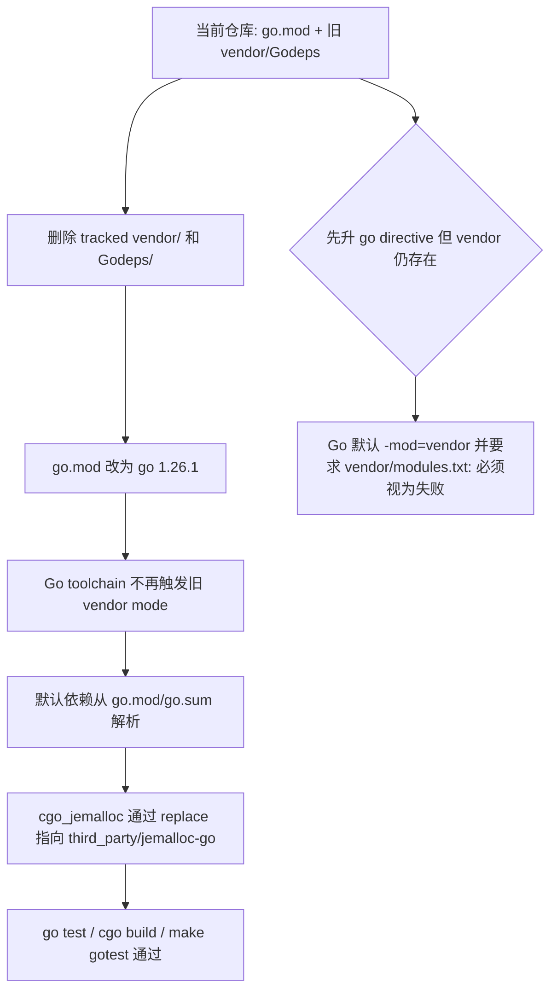

# legacy-vendor-retirement design

## 0. 术语约定

- **Legacy vendor source**：仓库根目录的 `vendor/` 与 `Godeps/`。它们来自 GOPATH/Godeps 时代，当前仍被 git 跟踪，但 Makefile 和 module mode 构建已不再依赖它们。
- **Module dependency source**：仓库根目录 `go.mod` / `go.sum`，以及 `go.mod` 中指向 `third_party/jemalloc-go` 的 `replace`。这是本 feature 后唯一受支持的 Go 依赖来源。
- **Vendor retirement**：从 tracked source 中移除 `vendor/` 和 `Godeps/`，不是生成 `vendor/modules.txt`，也不是把目录改名留在仓库里。
- **Final go directive**：`go.mod` 中从临时 `go 1.13` 回到当前本地工具链版本 `go 1.26.1`。`go 1.13` 只为旧 `vendor/` 存在时规避自动 vendor mode，不是长期最低版本承诺。
- **Migration evidence**：依赖迁移理由和旧版本来源保留在 `go.mod` / `go.sum`、历史 feature 文档、roadmap、compound learning 和 git history 中，不再通过源码级 vendor 副本保存。

防冲突结论：代码和 CodeStable 文档里已有 `vendor`、`Godeps`、`go.mod`、`go 1.13`、`third_party/jemalloc-go` 这些叫法。本 design 沿用既有术语，不新增平行概念。

## 1. 决策与约束

### 需求摘要

本 feature 要让 Go modules 迁移退出旧 GOPATH/Godeps 依赖目录：删除顶层 `vendor/` 与 `Godeps/`，把 `go.mod` 的临时 `go 1.13` 提升到 `go 1.26.1`，并证明默认 cmd/pkg 测试、`cgo_jemalloc` proxy 构建和 Makefile 测试入口仍然通过。

服务对象是维护 Codis 构建体系的人。成功标准是：仓库根目录不再存在旧 `vendor/` / `Godeps/`，Go toolchain 不再需要旧 vendor mode 规避，依赖解析只通过 `go.mod/go.sum` 和 `third_party/jemalloc-go` local replace 完成，Redis/proxy/topom 运行行为不变。

明确不做：

- 不处理 `Dockerfile`、`scripts/docker.sh`、`kubernetes/`、`ansible/` 或部署路径。
- 不更新 README 或用户文档；CodeStable attention 仅更新用户本轮明确要求的 Go modules 启动注意事项与 `go mod tidy` 命令陷阱，完整迁移说明仍由 roadmap 下一条 `module-migration-doc-notes` 收口。
- 不升级 Go 依赖版本，不运行以升级为目标的 `go get -u`，不把本 feature 变成依赖现代化。
- 不生成 `vendor/modules.txt`，不切回 vendor mode，也不新增 `go mod vendor` 输出。
- 不修改 `cmd/`、`pkg/`、`extern/` 中的运行逻辑。
- 不修改 `third_party/jemalloc-go` 的内容或 import path。
- 不保证旧 GOPATH + vendor 构建路径继续可用；本 roadmap 的目标是默认 Go modules 构建。

### 复杂度档位

按“项目内部构建能力”默认档位走，偏离如下：

- Compatibility = backward-compatible（偏离内部工具默认 active 的原因：对当前 module mode 和 Makefile 入口保持兼容；旧 GOPATH/vendor 路径退出是 roadmap 已确认范围）。
- Determinism = reproducible（原因：依赖来源必须完全由 `go.mod/go.sum` 和 tracked `third_party/jemalloc-go` 决定，不能再受本地 vendor 状态影响）。
- Testability = verified（原因：必须通过 `go test`、`cgo_jemalloc` build 和 `make gotest` 自证）。

### 关键决策

1. **删除旧目录，不做源码级归档目录**。
   - 依据：保留改名后的 vendor 源码会继续制造“依赖到底从哪里来”的维护成本，也会让后续 grep / 审计误判旧依赖仍有运行意义。
   - 替代方案：移动到 `doc/` 或 `archive/`。拒绝原因：这只是换位置保存过期第三方源码，仍然增加仓库体积和安全扫描噪音；真正需要追溯时用 git history、`go.mod/go.sum` 和 CodeStable 迁移文档即可。
   - 约束：如果未来确实需要 vendor mode，必须另起 feature 用 `go mod vendor` 生成带 `vendor/modules.txt` 的一致 vendor tree，而不是恢复旧 Godeps vendor。

2. **`go.mod` 回到长期契约 `go 1.26.1`**。
   - 依据：`go help build` 显示 `go.mod` 中 `go >= 1.14` 且存在顶层 `vendor` 时，Go 默认等同 `-mod=vendor`；本 feature 删除顶层 `vendor/` 后，临时 `go 1.13` 的原因消失。
   - 变化：删除临时 vendor-mode 注释，把 `go 1.13` 改为 `go 1.26.1`。
   - 维护约束：`toolchain go1.26.1` 与 `go 1.26.1` 表达同一个当前工具链约束，本 feature 倾向删除该冗余行，避免两个版本字段长期漂移。

3. **不重新求解依赖图**。
   - 依据：依赖版本已经在 `go-module-compile-baseline` 中按 Godeps baseline 和现代 Go 编译错误收敛；`jemalloc-module-build` 已把唯一特殊本地来源移到 `third_party/jemalloc-go`。
   - 变化：本 feature 不主动改 `require` 版本和 `replace` 关系；如果执行实现命令导致 `go.sum` 机械补充校验，只接受与当前验收命令直接相关的最小变化。

4. **保留 `third_party/jemalloc-go` 作为唯一仓库内第三方源码副本**。
   - 依据：这是 `cgo_jemalloc` 在 module mode 下的受控 local replace 来源，已经由前置 feature 验证；它不是旧 vendor 目录的一部分。
   - 约束：删除 `vendor/github.com/spinlock/jemalloc-go` 后，`go list -m -json github.com/spinlock/jemalloc-go` 必须仍指向 `third_party/jemalloc-go`。

### 前置依赖

- `go-module-compile-baseline`：done - 提供 `go.mod/go.sum` 和 clean checkout version metadata。
- `jemalloc-module-build`：done - 提供 `third_party/jemalloc-go` local replace。
- `makefile-module-mode`：done - Makefile 不再进入旧 vendor jemalloc 路径。

无额外结构性前置重构。

## 2. 名词与编排

### 2.1 名词层

#### Legacy vendor source

现状：

- `Godeps/Godeps.json` 127 行，记录 `github.com/CodisLabs/codis` 的 Go 1.8 / Godeps 依赖基线。
- `Godeps/Readme` 与 `Godeps/Godeps.json` 是旧工具链元数据。
- `vendor/` 约 5.8M，含 432 个文件、76 个目录；`git ls-files vendor Godeps` 显示当前有 402 个 tracked 路径。
- 顶层 `vendor/` 没有 `vendor/modules.txt`。当 `go.mod` 使用 `go >= 1.14` 时，它会让 Go 默认进入 vendor mode 并失败。
- Makefile 当前已不引用 `vendor/github.com/spinlock/jemalloc-go`，`go.mod` 也已通过 `replace` 指向 `third_party/jemalloc-go`。

变化：

- 删除 tracked `Godeps/` 和 `vendor/`。
- 不新增 `archive/`、`doc/vendor-archive/` 或任何源码级旧依赖副本。
- 不生成 `vendor/modules.txt`。
- 旧依赖信息的追溯路径变为 `go.mod/go.sum`、历史 feature 文档、compound learning 和 git history。

接口示例：

```text
输入：test ! -d vendor && test ! -d Godeps
输出：命令成功，仓库根目录没有旧 GOPATH/Godeps 依赖目录
来源：roadmap go-mod-migration 第 4.1 节，legacy-vendor-retirement 条目
```

#### Go module manifest

现状：

- `go.mod` 当前 31 行，模块名为 `github.com/CodisLabs/codis`。
- 文件开头仍有临时注释：

```text
// Temporary: keep go < 1.14 while legacy vendor/ has no vendor/modules.txt.
// Go 1.14+ defaults to -mod=vendor when a top-level vendor directory exists.
go 1.13

toolchain go1.26.1
```

- `require` 中包含从 Godeps 迁移来的依赖版本，以及为现代 Go 编译做过最小调整的 `github.com/coreos/etcd v3.3.27+incompatible`、`github.com/ugorji/go v1.2.14`。
- `replace github.com/spinlock/jemalloc-go => ./third_party/jemalloc-go` 是 `cgo_jemalloc` 的长期 module mode 来源。

变化：

- `go.mod` 开头改为长期契约：

```text
module github.com/CodisLabs/codis

go 1.26.1
```

- 删除临时 vendor-mode 注释和冗余 `toolchain go1.26.1` 行。
- 保留现有 `require` / `replace` 关系，不重新升级依赖。

接口示例：

```text
输入：GO111MODULE=on go list -m
输出：github.com/CodisLabs/codis

输入：grep -E "go 1\\.13|Temporary: keep go < 1\\.14|toolchain go1\\.26\\.1" go.mod
输出：无命中
来源：go-mod-migration roadmap 第 4.1 节长期契约
```

#### Jemalloc module source

现状：

- `pkg/utils/unsafe2/je_malloc.go` 在 `cgo_jemalloc` tag 下 import `github.com/spinlock/jemalloc-go`。
- `go.mod` 通过 `replace github.com/spinlock/jemalloc-go => ./third_party/jemalloc-go` 指向仓库内 build-ready 本地模块。
- `third_party/jemalloc-go` 当前是受控源码来源，不属于旧 `vendor/`。

变化：

- 删除旧 `vendor/github.com/spinlock/jemalloc-go` 后，`third_party/jemalloc-go` 仍保留。
- `go.mod` 的 `require` / `replace` 不变。

接口示例：

```text
输入：GO111MODULE=on go list -m -json github.com/spinlock/jemalloc-go
输出：Replace.Dir 指向仓库内 third_party/jemalloc-go，且不含 vendor 路径
来源：jemalloc-module-build design 与 roadmap 第 4.4 节
```

### 2.2 编排层



现状：

- 默认 `GO111MODULE=on go test ./cmd/... ./pkg/...`、`GO111MODULE=on go build -tags cgo_jemalloc ./cmd/proxy` 和 `make gotest` 已可用。
- 这些命令可用的前提之一是 `go.mod` 临时保持 `go 1.13`，避免顶层旧 `vendor/` 自动接管 module 解析。
- `vendor/` 和 `Godeps/` 现在只剩历史迁移素材身份，不再是构建入口。

变化：

- 编排顺序必须是先移除旧目录，再提升 `go.mod`。
- 旧目录移除后，`go.mod` 的 `go 1.13` 注释和过渡语义一起删除。
- 验证顺序从 module graph 到构建入口：先确认没有 vendor mode 残留，再跑默认测试、`cgo_jemalloc` 构建和 Makefile 测试。

流程级约束：

- **顺序约束**：不能在 `vendor/` 仍存在时把 `go.mod` 提升到 `go 1.26.1` 后运行验收命令；这会触发 Go 自动 vendor mode，错误方向不可用。
- **错误语义**：任何命令报 `vendor/modules.txt`、`-mod=vendor` 或从 `vendor/` 解析依赖，都视为本 feature 未完成，不通过生成 `vendor/modules.txt` 修补。
- **幂等性**：重复执行验收命令不能重新生成 `vendor/`、`Godeps/`、`vendor/modules.txt`，也不能修改 tracked source。
- **兼容性**：运行期行为不变；本 feature 只改变构建依赖来源。旧 GOPATH/vendor 构建路径被明确退休，不作为兼容目标。
- **可观测点**：`git status --short`、`go list -m -json github.com/spinlock/jemalloc-go`、`go test`、`go build -tags cgo_jemalloc` 和 `make gotest` 是主要验收证据。

### 2.3 挂载点清单

- `vendor/`：仓库根目录 - 删除旧 GOPATH vendor tree；恢复它会重新引入 Go 自动 vendor mode 风险。
- `Godeps/`：仓库根目录 - 删除旧 Godeps 元数据；恢复它会重新暗示 Godeps 是受支持依赖入口。
- `go.mod` 的 Go 版本声明：仓库根目录 - 从临时 `go 1.13` + `toolchain go1.26.1` 改为长期 `go 1.26.1`。

本 feature 不引入新的运行时挂入点。

### 2.4 推进策略

1. **旧依赖目录退休**：删除 tracked `vendor/` 与 `Godeps/`。
   - 退出信号：`test ! -d vendor && test ! -d Godeps` 成功，`git status --short` 显示这两个目录只作为预期删除。

2. **module manifest 收口**：把 `go.mod` 从临时 `go 1.13` 改为 `go 1.26.1`，移除 vendor 过渡注释和冗余 toolchain 行。
   - 退出信号：`go.mod` 无 `go 1.13`、`Temporary: keep go < 1.14`、`toolchain go1.26.1` 命中，`replace github.com/spinlock/jemalloc-go => ./third_party/jemalloc-go` 保留。

3. **module graph 验证**：确认依赖解析不走旧 vendor，jemalloc replace 仍正确。
   - 退出信号：`GO111MODULE=on go list -m -json github.com/spinlock/jemalloc-go` 的 `Replace.Dir` 指向 `third_party/jemalloc-go`，且没有 `vendor/modules.txt`。

4. **构建测试回归**：跑默认 cmd/pkg 测试、`cgo_jemalloc` proxy 构建和 Makefile 测试入口。
   - 退出信号：`GO111MODULE=on go test ./cmd/... ./pkg/...`、`GO111MODULE=on go build -tags cgo_jemalloc -o /tmp/codis-proxy-cgo-test ./cmd/proxy`、`make gotest` 均通过。

5. **范围守护**：确认没有顺手改运行代码、部署脚本、第三方本地 jemalloc 或依赖版本。
   - 退出信号：diff 仅包含 `vendor/`、`Godeps/` 删除、`go.mod` 收口，以及本 feature/roadmap 状态文件。

### 2.5 结构健康度与微重构

##### 评估

- compound convention：已搜索 `.codestable/compound` 中“vendor Godeps go.mod directory organization naming convention”，没有命中有效 convention。
- 文件级 - `go.mod`：31 行，职责单一；本次只修改 Go 版本声明区，不涉及依赖重组。
- 文件级 - `Godeps/Godeps.json`：127 行，旧 Godeps 元数据；本次整体删除，不在文件内做迁移性编辑。
- 目录级 - `vendor/`：432 个文件、约 5.8M，旧第三方源码树；本次整体删除，减少根目录依赖来源歧义。
- 目录级 - `Godeps/`：2 个 tracked 文件；本次整体删除。
- 目录级 - 仓库根目录：当前已有 `vendor/`、`Godeps/`、`third_party/` 同时存在，构建依赖来源容易被误读；本次删除旧两者，只保留 Go modules 标准入口和 `third_party/jemalloc-go` 这个明确 local replace。

##### 结论：不做前置微重构

原因：本 feature 的主体就是删除旧依赖目录并收口 `go.mod`，不是在已有源文件里追加复杂逻辑。没有要先“只搬不改行为”的文件拆分或目录重组；把旧 vendor 移到新归档目录反而会保留混淆源。

## 3. 验收契约

### 关键场景清单

- 触发：在仓库根目录执行 `test ! -d vendor && test ! -d Godeps`。期望：命令成功，旧依赖目录不存在。
- 触发：检查 `go.mod`。期望：存在 `go 1.26.1`；不存在 `go 1.13`、`Temporary: keep go < 1.14`、`toolchain go1.26.1`；`replace github.com/spinlock/jemalloc-go => ./third_party/jemalloc-go` 保留。
- 触发：执行 `GO111MODULE=on go list -m -json github.com/spinlock/jemalloc-go`。期望：`Replace.Dir` 指向仓库内 `third_party/jemalloc-go`，不含 `vendor`。
- 触发：执行 `GO111MODULE=on go test ./cmd/... ./pkg/...`。期望：cmd/pkg 默认构建标签下测试通过，不报 `vendor/modules.txt` 或 `-mod=vendor` 相关错误。
- 触发：执行 `GO111MODULE=on go build -tags cgo_jemalloc -o /tmp/codis-proxy-cgo-test ./cmd/proxy`。期望：proxy 的 jemalloc 构建路径仍通过。
- 触发：执行 `make gotest`。期望：Makefile 测试入口仍通过，不依赖旧 `vendor/` 或 `Godeps/`。
- 触发：重复执行验收命令后查看 `git status --short`。期望：不生成 `vendor/`、`Godeps/`、`vendor/modules.txt`，不修改 tracked source。

### 明确不做的反向核对项

- Diff 不应包含 `Dockerfile`、`scripts/docker.sh`、`kubernetes/`、`ansible/`。
- Diff 不应包含 README 或 `doc/` 用户文档更新；`.codestable/attention.md` 只允许包含用户本轮明确要求的 Go modules 启动注意事项与 `go mod tidy` 命令陷阱。
- Diff 不应包含 `cmd/`、`pkg/`、`extern/` 运行逻辑改动。
- Diff 不应修改 `third_party/jemalloc-go/`。
- Diff 不应修改现有 `require` 版本或新增依赖升级。
- Diff 不应生成 `vendor/modules.txt` 或新增 `go mod vendor` 输出。
- Diff 不应把 `replace github.com/spinlock/jemalloc-go => ./third_party/jemalloc-go` 删除或改向旧 vendor。

## 4. 与项目级架构文档的关系

acceptance 阶段需要更新 `.codestable/architecture/ARCHITECTURE.md` 的构建层现状：

- 删除“顶层旧 `vendor/` 仍存在，所以 `go.mod` 暂时使用 `go 1.13`”的过渡描述。
- 改为记录：旧 `vendor/` / `Godeps/` 已退休，`go.mod` 使用 `go 1.26.1`，Go 依赖来源为 `go.mod/go.sum` 和 `third_party/jemalloc-go` local replace。
- 已知约束中不再写“旧 vendor 清理仍由后续条目处理”；改为“module-migration-doc-notes 仍需更新注意事项和工程说明”。

本 feature 不改变 Codis Proxy、Topom、models、Redis 协议或配置格式，不需要回写 requirement。
