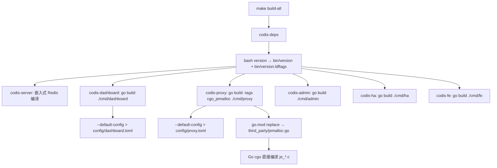

# makefile-module-mode design

## 0. 术语约定

- **GOPATH/vendor 时代参数**：指 `export GO15VENDOREXPERIMENT=1` 和 `make -C vendor/github.com/spinlock/jemalloc-go/`。这两个是旧 GOPATH vendor 构建路径的遗留，在 module mode 下不再需要。
- **Old jemalloc path**：`vendor/github.com/spinlock/jemalloc-go/`，含 Makefile 用于预处理 jemalloc C 源码和生成 `je_*.c` 符号链接。
- **New jemalloc path**：`third_party/jemalloc-go/`，build-ready 的本地 replace module，所有 C 源码直接 tracked，不需要 Makefile 预处理。已于 `jemalloc-module-build` 建立。
- **codis-deps**：Makefile 中负责生成构建前置产物的 target，当前产出 `bin/version`、`bin/version.ldflags` 并调用旧 jemalloc Makefile。
- **version injection**：通过 `bin/version.ldflags` 中的 `-ldflags -X` 向 Go 二进制注入真实 git/date 版本信息。该机制在 `go-module-compile-baseline` 已调整正确：`pkg/utils/version.go` 提供兜底默认值，`version` 脚本只写 `bin/` 不写源码。

防冲突结论：所有术语沿用 roadmap 和已有 feature design 的口径，无新增。

## 1. 决策与约束

### 需求摘要

本 feature 要让 `make gotest`、`make codis-dashboard`、`make codis-proxy` 等 Makefile 入口在 module mode 下工作，不再依赖 GOPATH 或旧 vendor 预处理。服务对象是维护 Codis 构建体系的人；成功标准是 `make gotest` 和 `make build-all` 在 module mode 下通过。

明确不做：

- 不处理 `Dockerfile`。
- 不删除 `vendor/` 或 `Godeps/`，留给 `legacy-vendor-retirement`。
- 不提升 `go.mod` 的 `go 1.13` 临时 directive。
- 不改 proxy/topom/Redis 运行行为或配置格式。
- 不改 `version` 脚本的行为（其输出目标已在 `go-module-compile-baseline` 修正）。
- 不改 `third_party/jemalloc-go` 的内容或结构。
- 不新增 `GO111MODULE=on` 显式导出——当前环境默认 module mode，移除旧 `GO15VENDOREXPERIMENT=1` 后环境自然生效；强制写入反而增加未来 Go 版本默认值变更时的维护成本。

### 复杂度档位

走"项目内部构建能力"默认档位，偏离如下：

- Compatibility = backward-compatible（偏离内部工具默认 active 的原因：Makefile target 名称和产出路径不变，只改内部实现方式）。
- Determinism = reproducible（原因：构建结果不再依赖本地 vendor 预处理状态，只依赖 go.mod/go.sum 和 tracked 源码）。
- Testability = verified（原因：必须用 `make gotest` 和 `make build-all` 自证）。

### 关键决策

1. **移除 `export GO15VENDOREXPERIMENT=1`**。
   - 依据：`GO15VENDOREXPERIMENT` 是 Go 1.5 vendor experiment 的过渡开关，Go 1.7+ 默认开启，module mode 下无意义。当前环境 `GO111MODULE=on` 已生效，保留此 export 既不必要也可能在特定 Go 版本产生意外交互。
   - 被拒方案：显式 `export GO111MODULE=on`。理由：环境已默认 on，写入 Makefile 反而引入"Makefile 要求特定 GO111MODULE 值"的隐性假设，在 Go 工具链默认值未来变更时成为多余的维护点。

2. **移除 `codis-deps` 中 `make -C vendor/github.com/spinlock/jemalloc-go/`**。
   - 依据：module mode 下 jemalloc-go 由 `go.mod replace` 指向 `third_party/jemalloc-go`，Go cgo 在构建时直接编译其中的 C 源码，不需要 Makefile 预处理。旧 vendor 路径的 Makefile 调用在 module mode 下是多余步骤，且该路径将来会被 `legacy-vendor-retirement` 清理。
   - 验证：`jemalloc-module-build` 已证实 `GO111MODULE=on go build -tags cgo_jemalloc ./cmd/proxy` 无需预处理即可通过。

3. **保留 `bash version` 在 `codis-deps` 中**。
   - 依据：`bin/version.ldflags` 是 `VERSION_LDFLAGS` 的数据来源，`VERSION_LDFLAGS` 被所有 Go 构建 target 和 `gotest`/`gobench` 使用。该依赖在 module mode 下仍然成立。
   - 在 `legacy-vendor-retirement` 阶段可考虑将 `VERSION_LDFLAGS` 从测试 target 中移除（测试不需要真实版本注入），但不属于本 feature 范围。

4. **`distclean` 中 jemalloc 路径跟随迁移**。
   - 依据：旧 `distclean` 调用 `make -C vendor/github.com/spinlock/jemalloc-go/ distclean`。但 `third_party/jemalloc-go` 没有 Makefile（build-ready，无需预处理），且 module mode 构建产物在 module cache 中不在仓库内。因此直接移除该行。
   - 被拒方案：改为 `make -C third_party/jemalloc-go/ distclean`。理由：该目录没有 Makefile，调用会失败。

### 前置依赖

- `go-module-compile-baseline`：done — 提供 go.mod/go.sum 和 version metadata 兜底。
- `jemalloc-module-build`：done — 提供 module mode 下的 jemalloc-go 来源。

无结构性前置重构需求。

## 2. 名词与编排

### 2.1 名词层

#### Makefile 构建变量与 target

现状（`Makefile:1-63`）：

- `export GO15VENDOREXPERIMENT=1`（L3）：全局导出旧 vendor experiment 开关。
- `VERSION_LDFLAGS = -ldflags "$$(cat bin/version.ldflags)"`（L5）：版本注入变量，所有 Go 命令共享。
- `codis-deps`（L9-L11）：`mkdir -p bin config && bash version` + `make -C vendor/github.com/spinlock/jemalloc-go/`。
- 各 `codis-*` target（L13-L28）：`codis-deps` → `go build $(VERSION_LDFLAGS) -o bin/... ./cmd/...`。
- `codis-proxy`（L17-L18）：额外带 `-tags "cgo_jemalloc"`。
- `gotest`（L53-L54）：`codis-deps` → `go test $(VERSION_LDFLAGS) ./cmd/... ./pkg/...`。
- `gobench`（L56-L57）：`codis-deps` → `go test $(VERSION_LDFLAGS) -gcflags -l -bench=. -v ./pkg/...`。
- `distclean`（L49-L51）：clean + `distclean` 嵌入式 Redis + `distclean` 旧 jemalloc vendor 目录。

变化：

- **删除** `export GO15VENDOREXPERIMENT=1`（L3）。
- **修改** `codis-deps`（L9-L11）：删除 `make -C vendor/github.com/spinlock/jemalloc-go/` 行，保留 `mkdir -p bin config && bash version`。
- **修改** `distclean`（L49-L51）：删除 `make -C vendor/github.com/spinlock/jemalloc-go/ distclean` 行。
- 所有其他 target 不变——`go build`/`go test` 命令在 module mode 下天然可用，无需添加 `GO111MODULE=on` 前缀。

接口示例：

```text
# 输入
make gotest

# 输出
go test -ldflags "$(cat bin/version.ldflags)" ./cmd/... ./pkg/...
# → 所有 cmd/pkg 包编译和测试通过
# 来源：Makefile:53-54，roadmap 第 4.2 节构建命令契约
```

```text
# 输入
make codis-proxy

# 输出
go build -tags "cgo_jemalloc" -ldflags "$(cat bin/version.ldflags)" -o bin/codis-proxy ./cmd/proxy
# → proxy 二进制产出，jemalloc-go 通过 go.mod replace 解析
# 来源：Makefile:17-18
```

### 2.2 编排层



现状：

- `build-all` 依赖 `codis-deps`（生成 version 文件 + 预处理 jemalloc），随后并行构建 6 个组件。
- `codis-deps` 的 jemalloc 步骤进入 `vendor/github.com/spinlock/jemalloc-go/` 执行 Makefile，该 Makefile 运行 `autogen.sh` 配置 jemalloc、创建 `je_*.c` / `jemalloc` / `VERSION` 符号链接。
- `go build` 在 GOPATH/vendor 模式下从 `vendor/` 解析 `github.com/spinlock/jemalloc-go`。

变化：

- `codis-deps` 不再进入旧 vendor jemalloc 目录。jemalloc 的编译完全由 Go module mode + cgo 在 `go build -tags cgo_jemalloc` 时自动处理，源码来自 `third_party/jemalloc-go`。
- 其他 target 编排拓扑不变：`codis-deps` → 各组件的 `go build` → config 刷新。
- `make gotest` / `make gobench` 同样不再触发 jemalloc 预处理。

流程级约束：

- **错误语义**：`bash version` 失败时 `bin/version.ldflags` 为空或不存在 → `go build` 缺少 `-ldflags` 参数中的值会导致 `-ldflags` 参数格式异常。实际上 `version` 脚本在 git 不可用时输出默认值，不会失败；如果 `bin/version.ldflags` 缺失，`cat` 会报错但 `VERSION_LDFLAGS` 的引号嵌套可能吞掉错误。→ 不在本 feature 改变 version 脚本的错误处理，但保留 `codis-deps` 对 version 脚本的依赖不变。
- **幂等性**：重复执行 `make` 不能生成或修改 tracked source。`bash version` 只写 `bin/`（gitignore 覆盖），`go build` 只写 `bin/`。本 feature 改动不引入新的幂等性风险。
- **并发**：`make -j` 下多个 go build 可能并发访问 module cache，但这由 Go toolchain 内部处理，不是 Makefile 层面的问题。
- **兼容性**：target 名称（`build-all`、`gotest`、`codis-proxy` 等）完全不变。产出路径（`bin/codis-*`、`config/*.toml`）不变。运行行为不变。

### 2.3 挂载点清单

- `Makefile` L3：删除 `export GO15VENDOREXPERIMENT=1`。
- `Makefile` L11：删除 `make -C vendor/github.com/spinlock/jemalloc-go/`。
- `Makefile` L51：删除 `make -C vendor/github.com/spinlock/jemalloc-go/ distclean`。

> 本 feature 不引入新挂入点，只删除旧 GOPATH/vendor 时代的构建挂载。三条删除都是"删了它 feature 就消失"的挂入——恢复任一条就等于回退到旧构建路径。

### 2.4 推进策略

1. **移除 GOPATH 环境变量**：删除 `export GO15VENDOREXPERIMENT=1`。
   - 退出信号：`make gotest` 在 module mode 下不再有 GOPATH 相关环境变量干扰。

2. **移除旧 jemalloc 预处理**：从 `codis-deps` 删除 `make -C vendor/github.com/spinlock/jemalloc-go/`。
   - 退出信号：`make codis-proxy` 的 `go build -tags cgo_jemalloc` 仍成功，jemalloc-go 由 module mode 解析。

3. **更新 distclean**：从 `distclean` 删除旧 jemalloc distclean 调用。
   - 退出信号：`make distclean` 不报错（不再尝试进入不存在的构建路径）。

4. **端到端验证**：跑 `make gotest` 和 `make build-all`。
   - 退出信号：两个命令均在 module mode 下成功完成。

5. **范围回归**：确认 vendor/、Godeps/、go.mod、third_party/jemalloc-go 未被顺手改动。
   - 退出信号：`git diff --stat` 仅包含 `Makefile`。

### 2.5 结构健康度与微重构

##### 评估

- compound convention：已检索 `.codestable/compound`，无命中。
- 文件级 — `Makefile`：64 行，职责集中在构建编排，不混杂业务逻辑。本次改动 3 处删除，逻辑独立，改动密度低。
- 目录级 — 仓库根目录：本次不改动文件归属，不新增文件。

##### 结论：不做微重构

原因：`Makefile` 行数适中（64 行），职责单一，改动量小（3 行删除）。不需要拆文件或重组目录。

## 3. 验收契约

### 关键场景清单

- 触发：在仓库根目录执行 `make gotest`。期望：cmd/pkg 编译测试通过，不再依赖 GOPATH 或旧 vendor 预处理。
- 触发：执行 `make codis-proxy`。期望：`go build -tags cgo_jemalloc` 通过，jemalloc-go 由 `go.mod replace` → `third_party/jemalloc-go` 解析，不进入 `vendor/github.com/spinlock/jemalloc-go/`。
- 触发：执行 `make codis-dashboard`。期望：`go build ./cmd/dashboard` 通过，产出 `bin/codis-dashboard` 并刷新 `config/dashboard.toml`。
- 触发：执行 `make build-all`。期望：所有 6 个组件成功构建，config 文件刷新。
- 触发：执行 `make distclean`。期望：不报错（不再尝试进入旧 vendor jemalloc 目录执行 distclean）。
- 触发：重复执行 `make build-all` 后 `git status`。期望：仅 `bin/` 和 `config/` 有未跟踪变更，无 tracked source 被修改。

### 明确不做的反向核对项

- Diff 不应包含 `Dockerfile`。
- Diff 不应包含 `go.mod`、`go.sum`。
- Diff 不应删除 `vendor/` 或 `Godeps/`。
- Diff 不应修改 `third_party/jemalloc-go/`。
- Diff 不应修改 `version` 脚本。
- Diff 不应修改 `pkg/`、`cmd/` 下的 Go 源码。
- Diff 不应添加 `GO111MODULE=on` 到 Makefile。

## 4. 与项目级架构文档的关系

本 feature 完成后，Makefile 不再携带 GOPATH/vendor 时代参数。acceptance 阶段应更新 `.codestable/architecture/ARCHITECTURE.md`：

- 构建层描述从"Makefile 通过 `GO15VENDOREXPERIMENT=1` 和 GOPATH/vendor 语义构建"更新为"Makefile 在 module mode 下构建，jemalloc 编译由 Go cgo 直接处理"。
- 已知约束中`go.mod` 临时 `go 1.13` 的说明保留（`legacy-vendor-retirement` 完成后才提升）。
- 本 feature 改动局限在 Makefile 构建入口，不影响 proxy/topom/models 架构描述。
