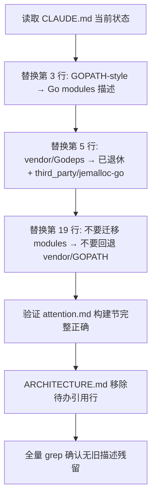

# module-migration-doc-notes design

## 0. 术语约定

- **项目注意事项（attention）**：`.codestable/attention.md`，CodeStable 子技能启动前必读的项目碎片知识。已在前面 feature 中更新，本次只做完整性验证。
- **工程说明（project instructions）**：仓库根目录 `CLAUDE.md`，git tracked，同时被人类开发者和 AI agent 读取。目前仍描述旧 GOPATH/vendor 时代编译方式。
- **架构文档更新**：`.codestable/architecture/ARCHITECTURE.md`，当前状态段（line 100-102）有“后续迁移收尾仍需由 `module-migration-doc-notes` 更新注意事项和工程说明”的待办引用，本次完成后移除。
- **用户教程**：`doc/tutorial_zh.md`、`doc/tutorial_en.md`，面向外部用户的编译/部署指南，含 GOPATH 路径。不在本次范围，列为观察项。

防冲突：沿用已有术语 `Go modules`、`go.mod`、`cgo_jemalloc`、`third_party/jemalloc-go`，不新增概念名。

## 1. 决策与约束

### 需求摘要

本 feature 是 go-mod-migration roadmap 的最后一步。前置四个子 feature 已完成 Go modules 构建迁移的全部工程动作（建立 go.mod/go.sum、适配 jemalloc、更新 Makefile、退役旧 vendor/Godeps）。本 feature 负责把迁移终点写入工程文档，确保后续 AI agent 和人类开发者不再读到过时的 GOPATH/vendor 构建描述。

成功标准：
- CLAUDE.md 不再描述本仓库为 GOPATH-style、不含 go.mod
- CLAUDE.md 不再将 vendor/、Godeps/ 列为活跃依赖来源
- ARCHITECTURE.md 不再有“待 module-migration-doc-notes 收口”字样
- attention.md 构建节持续完整正确（已由前序 feature 完成，不倒退）

明确不做：

- 不更新 `doc/tutorial_zh.md`、`doc/tutorial_en.md`、`README.md` 等用户教程。它们涉及用户编译/部署流程的全面改版，超出 roadmap “项目注意事项和相关工程说明” 范围。
- 不更新 `Dockerfile`、`deploy/`、`kubernetes/`、`ansible/`、`scripts/` 等运行部署路径。
- 不新增或修改 Go 源码、go.mod、go.sum、Makefile。
- 不新增仓库级 README 或 CONTRIBUTING。

### 复杂度档位

按“项目内部构建能力”默认档位走：

- Structure = functions：改动局限在 2-3 个文档文件的语句级替换，不需要新建模块或分层。
- Robustness = L1 快跑：无外部输入、无运行期错误路径；改错了一个句子重新改即可。
- Compatibility = backward-compatible：只改文档描述使其匹配当前构建现实，不破坏任何构建命令。

### 关键决策

1. **CLAUDE.md 从头改写构建相关段落，不写历史过渡**。
   - 依据：旧描述（GOPATH-style、no go.mod、vendor/Godeps 活跃）已是事实错误。文档读者需要知道当前状态，不需要知道“曾经是 GOPATH 项目，后来迁移了”——这些在 git history 和 roadmap 中可查。
   - 变化：第 3 行“older GOPATH-style Go repository; there is no `go.mod`”改为描述当前 Go modules 构建路径。第 5 行 vendor/Godeps 改为记录已退休。第 19 行“Do not modernize dependencies or convert to modules”改为“Do not restore old vendor/Godeps dependency paths”。
   - 约束：保留 CLAUDE.md 其余所有节（Coding Style、Testing、Commit Guidelines 等）不变。

2. **attention.md 只做验证，不重复写入**。
   - 依据：attention.md 的构建节已于前序 feature 正确更新（line 11：“本仓库已完成 Go modules 构建迁移”）。重复修改增加 git diff 噪音。
   - 变化：验证 line 11、line 9-14（编译与构建节）内容正确完整，如有偏差则修正。

3. **ARCHITECTURE.md 移除对本 feature 的待办引用**。
   - 依据：line 100-102 的“后续迁移收尾仍需由 `module-migration-doc-notes` 更新注意事项和工程说明”是本 roadmap 最后一条待办。本 feature 完成后该引用过时。
   - 变化：将 line 100-102 改为“Go modules 构建迁移已全部完成，编译契约和注意事项已落档”。
   - 约束：不修改 ARCHITECTURE.md 的其他内容，特别是 line 22-45 的构建层描述和 line 94-96 的代码锚点。

4. **不扩散到用户教程**。
   - 依据：`doc/tutorial_zh.md` 和 `doc/tutorial_en.md` 的 GOPATH 编译步骤需要与其对应的快速启动、HA 部署说明同步重写，涉及交叉验证编译路径、命令输出和截图，不是纯文档更新而是用户指南重编。roadmap 第 2 节“明确不做”虽未逐行列出 tutorial，但“项目注意事项和相关工程说明”语义不包含用户教程。
   - 记录为观察项，在 acceptance 阶段可提示用户后续走 `cs-guide` 处理。

### 前置依赖

- `go-module-compile-baseline`：done
- `jemalloc-module-build`：done
- `makefile-module-mode`：done
- `legacy-vendor-retirement`：done

无额外结构性前置重构。

## 2. 名词与编排

### 2.1 名词层

#### CLAUDE.md 构建描述

现状（`/CLAUDE.md:3-5`）：

```markdown
Codis is an older GOPATH-style Go repository; there is no `go.mod`. Keep the checkout
at `github.com/CodisLabs/codis` when using legacy Go tooling. … Third-party and
embedded Redis sources are kept in `vendor/`, `Godeps/`, and `extern/`.
```

现状（`/CLAUDE.md:19`）：

```markdown
Do not modernize dependencies or convert to modules unless that is the explicit task.
```

这些描述与当前仓库现实矛盾：`go.mod` / `go.sum` 存在且已在使用；`vendor/` / `Godeps/` 已被删除；`make` / `make gotest` / `go test` 都走 module mode。

变化：

- 第 3 行：改为描述当前 Go modules 构建路径，模块名为 `github.com/CodisLabs/codis`，go.mod 使用 `go 1.26.1`。
- 第 5 行：`vendor/` / `Godeps/` 改为已退休；“Third-party and embedded Redis sources are kept in `extern/`”，`cgo_jemalloc` 的 jemalloc-go 来源从 `go.mod replace` 指向 `third_party/jemalloc-go`。
- 第 19 行：改为“Do not restore old vendor/Godeps dependency paths or downgrade from Go modules to GOPATH builds unless that is the explicit task.”——语义从“别升级”翻转为“别回退”。

接口示例：

```text
输入：grep "older GOPATH-style\|no go\.mod\|kept in .vendor\|Godeps" CLAUDE.md
输出：无命中

输入：grep "go\.mod\|Go modules\|module mode\|third_party/jemalloc" CLAUDE.md
输出：命中当前构建描述
来源：go-mod-migration roadmap 第 4.1、4.2 节构建契约
```

#### attention.md 构建节

现状（`.codestable/attention.md:9-14`）：

```markdown
### 编译与构建

- 本仓库已完成 Go modules 构建迁移，`go.mod` / `go.sum` 是默认 Go 依赖入口；不要恢复旧 GOPATH/vendor 构建路径。
- 默认构建命令是 `make`；它会构建 Go 二进制、嵌入式 Redis、前端资源和默认配置。
- 不要顺手现代化 Go 依赖；依赖版本偏离必须有可复现的现代 Go 编译原因。
- `cgo_jemalloc` 的 module mode 来源现在走 `go.mod` 的 `replace github.com/spinlock/jemalloc-go => ./third_party/jemalloc-go`；后续相关修改应改 `third_party/jemalloc-go`，不是旧 `vendor/github.com/spinlock/jemalloc-go`。
```

已在 legacy-vendor-retirement 中正确更新。本 feature 只做验证：条目完整覆盖 modules 默认入口、Makefile、依赖版本策略、jemalloc 来源。

变化：无，除非验证发现偏差。

#### ARCHITECTURE.md 待办引用

现状（`.codestable/architecture/ARCHITECTURE.md:100-102`）：

```markdown
- 当前仓库已建立 Go modules 编译闭环：默认 cmd/pkg module mode 可编译测试，`cgo_jemalloc` proxy 也可通过 `third_party/jemalloc-go` 的本地 replace 模块在 module mode 下构建；`Makefile` 已完成 module mode 切换（`make gotest`、`make build-all` 均不再依赖 GOPATH/vendor 参数）；旧 `vendor/` / `Godeps/` 已退休。
- `go.mod` 使用当前本地工具链版本 `go 1.26.1`；后续迁移收尾仍需由 `module-migration-doc-notes` 更新注意事项和工程说明。
```

变化：

- 删除 line 102 的“后续迁移收尾仍需由 `module-migration-doc-notes` 更新注意事项和工程说明”。
- 替换为“Go modules 构建迁移全部完成，编译契约和注意事项已落档入 `CLAUDE.md` 和 `.codestable/attention.md`。”

### 2.2 编排层



现状：

- CLAUDE.md 有 3 处过时描述（lines 3, 5, 19），全部与当前仓库构建现实矛盾。
- attention.md 和 ARCHITECTURE.md 的 Go modules 描述已更新，但 ARCHITECTURE.md 有一条指向本 feature 的待办引用。
- 这四个 feature 含 acceptance 阶段的 ARCHITECTURE.md 回写，已将构建层现状和对本 feature 的引用同时写入。

变化：

- 顺序必须 CLAUDE.md 先行：这是唯一有事实错误的文件，改完它才能与其他文档形成一致。
- attention.md 验证次之：确认前序 feature 写入正确。
- ARCHITECTURE.md 最后：移除对本 feature 的待办引用，标记迁移收口完成。

流程级约束：

- **编辑原则**：使用精确字符串替换，不改动行号上下文以外的任何内容。不接受整段重写导致无意漂移。
- **错误语义**：任何 grep 仍命中“no go.mod”、“GOPATH-style repository”、“vendor/ Godeps/”活跃依赖描述都视为未完成。
- **幂等性**：重复执行不会在 CLAUDE.md 中累积历史描述层。
- **可观测点**：`grep` CLAUDE.md / attention.md / ARCHITECTURE.md 验证关键词存在/不存在，`git diff --stat` 确认改动仅触及目标文件。

### 2.3 挂载点清单

- `CLAUDE.md`：git tracked 项目指令文件，人类和 AI agent 的工程说明入口。删除过时 GOPATH/vendor 描述是本次 feature 存在的主要原因。
- `.codestable/architecture/ARCHITECTURE.md`：删除指向本 feature 的待办引用行，使架构文档不再包含 roadmap 内部流程状态。

attention.md 不列入挂载点：其内容已在前面 feature 中正确更新，本次只读不写。

### 2.4 推进策略

1. **CLAUDE.md 构建描述更新**：替换 line 3（仓库类型描述）、line 5（依赖来源）、line 19（迁移方向约束）。
   - 退出信号：`grep "older GOPATH-style\|no go\.mod" CLAUDE.md` 无命中；`grep "go\.mod\|Go modules" CLAUDE.md` 命中当前构建描述。

2. **attention.md 验证**：读取编译与构建节，逐条确认与当前仓库现实一致。
   - 退出信号：四条正确（modules 默认入口、make 构建、依赖版本策略、jemalloc 来源），无需修改；如有偏差则单条修正。

3. **ARCHITECTURE.md 待办移除**：将“后续迁移收尾仍需由 `module-migration-doc-notes` 更新注意事项和工程说明”替换为迁移完成声明。
   - 退出信号：`grep "module-migration-doc-notes" ARCHITECTURE.md` 无命中；构建层描述（lines 22-45）不变。

4. **范围守护**：确认没有改动 tutorial、README、Dockerfile、部署配置、Go 代码。
   - 退出信号：`git diff --stat` 仅含 `CLAUDE.md`、`ARCHITECTURE.md` 和目标 feature/roadmap 状态文件。

### 2.5 结构健康度与微重构

##### 评估

- compound convention：已搜索 `.codestable/compound` 中“documentation conventions CLAUDE.md readme structure”，没有命中有效 convention。
- 文件级 - CLAUDE.md：45 行，职责为项目指令入口。本次只替换过时构建描述，不改文件结构或职责分配。
- 文件级 - ARCHITECTURE.md：117 行，职责为系统架构地图。本次只替换一行待办引用，不改结构。
- 文件级 - attention.md：42 行，职责为项目碎片知识。本次只读验证。
- 目录级 - 无新目录创建，无文件搬迁。

##### 结论：不做前置微重构

原因：改动量极小（CLAUDE.md 3 处语句替换 + ARCHITECTURE.md 1 行替换）。所有文件职责单一、不偏胖。没有要先“只搬不改行为”的文件拆分或目录重组。

## 3. 验收契约

### 关键场景清单

- 触发：`grep "older GOPATH-style\|no go\.mod" CLAUDE.md`。期望：无命中。
- 触发：`grep "vendor/\|Godeps" CLAUDE.md` 且上下文为用户/维护者依赖来源描述。期望：仅描述为“已退休”，不作为活跃依赖入口。
- 触发：`grep "Do not restore old vendor/Godeps dependency paths\|Do not downgrade from Go modules" CLAUDE.md`。期望：命中，语义为“不要回退”。
- 触发：`grep "module-migration-doc-notes" .codestable/architecture/ARCHITECTURE.md`。期望：无命中。
- 触发：读取 `.codestable/attention.md` 编译与构建节。期望：四条完整正确（Go modules 默认入口、make 构建、依赖版本策略、jemalloc 来源）。
- 触发：`git diff --stat` 检查改动范围。期望：仅含 CLAUDE.md（3 处语句替换）、ARCHITECTURE.md（1 行替换）、本 feature 目录下 design/checklist 文件和 roadmap items.yaml。

### 明确不做的反向核对项

- Diff 不应包含 `doc/tutorial_zh.md`、`doc/tutorial_en.md`、`README.md`。
- Diff 不应包含 `Dockerfile`、`deploy/`、`kubernetes/`、`ansible/`、`scripts/`。
- Diff 不应包含 `cmd/`、`pkg/`、`extern/`、`third_party/`。
- Diff 不应包含 `go.mod`、`go.sum`、`Makefile`。
- Diff 不应新增文件到 `vendor/`、`Godeps/`。

## 4. 与项目级架构文档的关系

本 feature 完成后 ARCHITECTURE.md 的已知约束段将不再包含 roadmap 内部待办引用。本 feature 不引入新的架构概念，不需要在 ARCHITECTURE.md 中新增章节。

### 观察项（不在本次 scope）

- `doc/tutorial_zh.md`（lines 81-104）和 `doc/tutorial_en.md`（lines 57-78）仍描述 GOPATH + `$GOPATH/src/github.com/CodisLabs/codis` 编译方式。这些是面向终端用户的编译部署教程，按 roadmap 第 2 节边界不在本次范围。建议后续通过 `cs-guide` 任务更新——届时需同步验证快速启动、HA 部署和命令输出截图。
