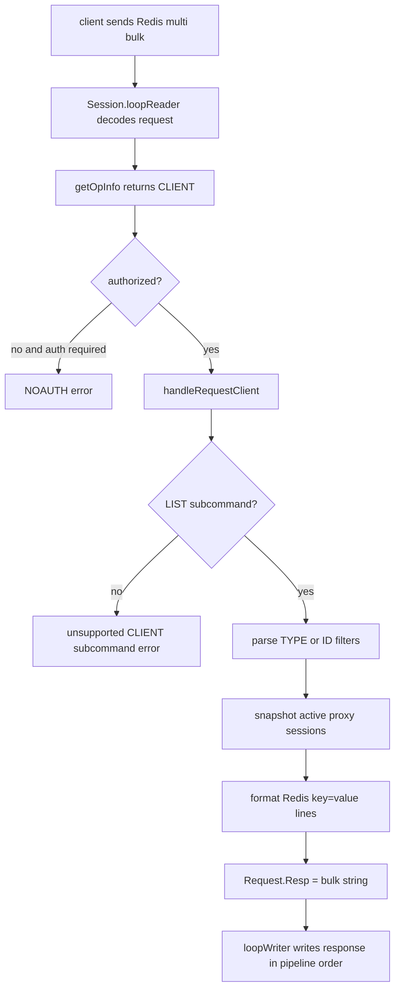

# proxy-client-list design

## 0. 术语约定

- **CLIENT LIST**：Redis connection group 下的 `CLIENT LIST` 子命令。Redis 8.6.3 的定义见 `extern/redis-8.6.3/src/commands/client-list.json`，实现入口是 `extern/redis-8.6.3/src/networking.c:4181` 的 `clientCommand`，列表行由 `catClientInfoString` 拼装。
- **Proxy client session**：连接到 Codis Proxy Redis 协议端口的客户端连接，对应 `pkg/proxy/session.go` 的 `Session`。它不是 proxy 到后端 Redis 的 backend connection。
- **Session registry**：本 feature 新增的 proxy 进程内活动 session 索引，用于给 `CLIENT LIST` 提供快照。现有代码只有 `sessions.total/alive` 计数，不能枚举连接。
- **Redis field subset**：Codis Proxy 能真实提供的 `CLIENT LIST` 字段集合。Redis 8.6.3 字段很多，包含 ACL、RESP3、tracking、pubsub、query buffer、output buffer、IO thread 等；Codis Proxy 当前没有这些完整状态，不做虚假的 full parity。

防冲突结论：`client` 在代码中同时指 Redis client、coordinator client、HTTP API client。本文统一用 `Proxy client session` 指 Redis 协议入口连接，用 `backend connection` 指 proxy 到 Redis Server 的连接，避免把 `CLIENT LIST` 误解成后端 Redis 的 `CLIENT LIST` 聚合。

## 1. 决策与约束

### 需求摘要

本 feature 要让业务或运维工具可以对 Codis Proxy 执行 `CLIENT LIST`，查看当前连接到这个 proxy 实例的客户端连接。成功标准是：已认证连接发送 `CLIENT LIST` 后，proxy 返回 RESP bulk string，内容为按行分隔的 `key=value` 客户端信息；不会把命令转发到后端 Redis，也不会因为 `CLIENT` 顶层命令仍被禁用而关闭连接。

假设：`CLIENT LIST` 遵循 Redis 的进程本地语义，只列出当前 proxy 进程的客户端连接。它不跨多个 proxy 聚合，也不列出后端 Redis Server 上看到的连接。

明确不做：

- 不支持 `CLIENT KILL`、`CLIENT SETNAME`、`CLIENT INFO`、`CLIENT ID`、`CLIENT TRACKING` 等其他 `CLIENT` 子命令。
- 不聚合 dashboard/topom 中所有 proxy 的连接列表。
- 不向后端 Redis Server 发送 `CLIENT LIST`，也不暴露 proxy 到后端 Redis 的连接池连接。
- 不实现 Redis 8.6.3 的所有字段；缺少真实状态来源的字段不伪造成有业务含义的数据。
- 不引入 RESP3 verbatim string；Codis 当前 Redis encoder 只有 RESP2 string/error/int/bulk/array，返回普通 bulk string。
- 不改变 `SessionAuth` 鉴权语义；`CLIENT LIST` 必须和其他非 `AUTH`/`QUIT` 命令一样先通过认证。

### 复杂度档位

按“对外 Redis 协议服务”默认档位走，偏离如下：

- Compatibility = backward-compatible（偏离默认 current-only 的原因：Redis 协议命令面向外部客户端，必须避免破坏现有 unsupported command 行为和认证语义）。
- Observability = logged（偏离默认 traced 的原因：本 feature 自身就是观测面，不引入 tracing；异常只走现有 session 错误和命令统计）。
- Testability = tested（原因：命令解析、字段格式、过滤参数和鉴权边界都可以用 proxy package 单测覆盖）。

### 关键决策

1. **在 proxy 本地实现 `CLIENT LIST`，不转发到后端 Redis**。
   - 依据：Redis 原生命令列的是当前 Redis 进程连接；Codis Proxy 对客户端扮演 Redis server，用户要看的应是 proxy 接入层连接，而不是某个随机 backend 的连接。
   - 被拒方案：随机选一个 slot/backend 转发 `CLIENT LIST`。这会返回后端看到的 proxy 连接池，而不是用户客户端，语义错误。

2. **只放开 `CLIENT LIST`，其他 `CLIENT` 子命令保持不支持**。
   - 依据：`pkg/proxy/mapper.go` 当前把整个 `CLIENT` 标为 `FlagNotAllow`，`doc/unsupported_cmds.md` 也列出 `CLIENT`。放开顶层命令后必须在 `Session.handleRequest` 中兜住所有子命令，避免 `CLIENT KILL` 等误入普通路由。
   - 约束：`CLIENT LIST` 参数错误返回 Redis 协议错误；未支持的 `CLIENT` 子命令返回明确“不支持/不允许”错误，不转发、不产生后端副作用。

3. **新增 session registry，而不是复用全局 session 计数**。
   - 依据：`pkg/proxy/stats.go` 只有 `sessions.total/alive` 计数，不能枚举远端地址、db、idle、last command。`Session` 已有 `CreateUnix`、`LastOpUnix`、`Ops`、`database`、`authorized` 等字段，是构造列表的真实来源。
   - 约束：registry 只保存活动 `Session` 指针；session 生命周期结束时必须注销，不能阻止连接回收。

4. **输出 Redis 兼容的 key=value 行，但字段是 Codis 可证明子集**。
   - 依据：Redis 8.6.3 `catClientInfoString` 输出 `id/addr/laddr/name/age/idle/flags/db/.../cmd/user/...` 等字段。客户端通常按 `key=value` 容错解析，字段随 Redis 版本演进。
   - Codis 首版字段建议：`id addr laddr name age idle flags db sub psub ssub multi qbuf qbuf-free obl oll omem events cmd user redir resp`，其中 pubsub/multi/buffer/tracking 相关值按 Codis 当前“不支持”语义填稳定零值或 `-1`；不输出 `tot-net-in/out`、`lib-name/ver`、`io-thread` 等没有真实来源的 Redis 8.x 字段。

## 2. 名词与编排

### 2.1 名词层

#### 命令表与本地命令契约

现状：

- `pkg/proxy/mapper.go` 的 `opTable` 将 `CLIENT` 标为 `FlagNotAllow`，`Session.handleRequest` 在任何本地处理前调用 `flag.IsNotAllowed()`，命中后返回 `command 'CLIENT' is not allowed`。
- `pkg/proxy/session.go` 的本地命令只覆盖 `QUIT`、`AUTH`、`SELECT`、`PING`、`INFO`、`MGET`、`MSET`、`DEL`、`EXISTS` 和 Codis slot 命令。未知命令默认进入 `Router.dispatch`。

变化：

- `CLIENT` 从“顶层禁用命令”变成“本地受控命令容器”。
- 新增本地契约：

```text
输入：CLIENT LIST
输出：bulk string，每行一个 proxy client session，行内字段为 key=value，以 \n 结尾
来源：extern/redis-8.6.3/src/networking.c clientCommand / catClientInfoString
```

```text
输入：CLIENT LIST TYPE normal
输出：等价 CLIENT LIST

输入：CLIENT LIST TYPE replica
输出：空 bulk string

输入：CLIENT LIST ID 1 2
输出：只返回 id 命中的 session，未命中的 id 被忽略
```

```text
输入：CLIENT KILL ...
输出：Redis error，表示该 CLIENT 子命令不支持；不得转发到 backend
```

#### Proxy client session 快照

现状：

- `Session` 记录 `Conn`、`Ops`、`CreateUnix`、`LastOpUnix`、`database`、`authorized` 和连接级 op stats。
- session 全局状态只有 `stats.go` 里的 `sessions.total/alive`，没有 session id 和可枚举集合。

变化：

- 每个 `Session` 需要有进程内唯一递增 `id`，用于输出 `id=` 并支持 `CLIENT LIST ID ...`。
- 新增 `ClientListEntry` 这类只读快照名词，采集时把 `Session` 的可读字段复制出来，格式化阶段不直接持有 registry 锁。
- 快照字段至少覆盖：id、remote addr、local addr、create time、last op time、ops、db、last command、authorized。
- `Session registry` 是活动 session 数量的权威来源；`stats.go` 中的 `sessions.total` 只保留累计连接数，`SessionsAlive()` 从 registry 读取当前活动数量，避免双轨追踪同一集合。

### 2.2 编排层



现状：

- `serveProxy` accept 后直接 `NewSession(c, config).Start(router)`。
- `Session.Start` 先递增 alive sessions 并做 max clients / router online 检查，然后启动 reader/writer goroutine；writer 退出时 `decrSessions()`。
- `Session.handleRequest` 在认证后分派本地命令，否则按 key 路由到 backend。

变化：

- session 生命周期通过 registry 控制活动集合：`Session.Start` 先递增累计连接数，再在 max clients 检查处尝试注册到 registry；router offline 时立即注销；writer goroutine 退出时注销。
- `incrSessions()` 只递增累计连接数；max clients 检查、`CLIENT LIST` 快照和 `SessionsAlive()` 统一以 registry 的活动集合为准。
- `Session.handleRequest` 在认证后增加 `CLIENT` 分支，且该分支必须在 `default -> d.dispatch(r)` 之前。
- `handleRequestClient` 只负责 `CLIENT LIST` 子命令解析、过滤和响应构造；其他 `CLIENT` 子命令不得进入 router。

流程级约束：

- **认证**：`CLIENT LIST` 和 `SELECT`、`INFO` 一样受 `SessionAuth` 保护；未认证时返回 `NOAUTH Authentication required`。
- **错误语义**：`CLIENT LIST` 参数错误返回 `ERR syntax error` 或同等 Redis 协议错误；未知 TYPE 返回 `ERR Unknown client type 'x'`；无效 ID 返回 `ERR Invalid client ID`。错误为普通 Redis error reply，不应让 proxy 崩溃。
- **并发**：registry snapshot 必须在短锁内复制活动 session 指针或快照；格式化字符串时不持锁，避免大量连接下阻塞 accept/close 路径。
- **顺序**：`CLIENT LIST` 仍走现有 request/response pipeline，必须保持请求响应顺序。
- **可观测性**：`CLIENT LIST` 本身计入现有 op stats；输出中的 `cmd` 对当前连接可显示 `CLIENT` 或 `CLIENT LIST`，对其他连接显示最近一次命令。

### 2.3 挂载点清单

- `pkg/proxy/mapper.go` command table：修改 `CLIENT` 的禁用状态，让它能进入本地命令分支。
- `pkg/proxy/session.go` request dispatch：新增 `CLIENT` 本地处理分支，阻止 `CLIENT` 容器命令落入 backend router。
- proxy session lifecycle：在 session 通过上线检查后注册、退出时注销，给 `CLIENT LIST` 提供活动连接集合。

### 2.4 推进策略

1. **命令入口骨架**：让 `CLIENT` 顶层命令进入本地分支，`CLIENT LIST` 先返回空 bulk string，其他子命令返回不支持错误。
   - 退出信号：`CLIENT LIST` 不再触发 `command 'CLIENT' is not allowed`，也不会转发到 backend。

2. **session registry**：建立进程内 session id、注册/注销和快照能力。
   - 退出信号：并发创建/关闭 session 后，registry 中活动数量与 `SessionsAlive()` 一致。

3. **CLIENT LIST 语义**：实现无参数、`TYPE`、`ID` 三类 Redis 8.6.3 兼容解析路径。
   - 退出信号：正常过滤、未知 TYPE、无效 ID、错误参数数量都有确定响应。

4. **字段格式化**：按 Redis key=value 行格式输出 Codis 可证明字段子集。
   - 退出信号：输出每行包含 `id/addr/laddr/age/idle/flags/db/cmd/user` 等核心字段，行尾以 `\n` 分隔，值不包含空格。

5. **文档与兼容边界**：更新 unsupported command 文档，把 `CLIENT` 调整为“仅 `CLIENT LIST` 支持，其余子命令不支持”。
   - 退出信号：`doc/unsupported_cmds.md` 不再宣称整个 `CLIENT` 都不可用。

6. **验证覆盖**：补齐 proxy package 单测和必要的端到端连接测试。
   - 退出信号：目标测试覆盖命令解析、鉴权、输出格式、过滤和 registry 生命周期。

### 2.5 结构健康度与微重构

##### 评估

- compound convention：已检索 `.codestable/compound`，无目录组织 / 命名 / 归属类 convention 命中。
- 文件级 — `pkg/proxy/session.go`：694 行，职责包含 session 生命周期、认证、本地命令处理、多 key 命令拆分、slot 命令处理和 op stats。本文件偏胖；本 feature 应只加入最小分派入口，主要逻辑落新文件。
- 文件级 — `pkg/proxy/mapper.go`：320 行，职责集中在命令属性表和 hash key 解析；本次只需改变 `CLIENT` 的命令属性，改动密度低。
- 文件级 — `pkg/proxy/stats.go`：约 200 行，已有 session 累计计数职责。本 feature 不在 stats.go 存放 registry 状态，只让 `SessionsAlive()` 读取 registry count，避免 `sessions.alive` 与 registry 双轨追踪同一集合。
- 目录级 — `pkg/proxy`：现有 18 个 Go 文件，包内长期采用扁平文件组织。本次预计新增一个 production 文件承载 `CLIENT LIST` registry/formatter，再新增对应测试文件；目录偏平但符合现有包风格。

##### 结论：不做前置微重构

原因：`session.go` 偏胖是真问题，但本 feature 可以通过“最小挂钩 + 新文件承载计算逻辑”控制风险；把 `Session` 大拆文件会超出“只搬不改行为”的微重构边界，并增加 Redis 协议路径回归风险。`pkg/proxy` 目录虽然文件数较多，但已有代码风格就是单 package 扁平组织，单独为了本 feature 重组目录收益不抵兼容风险。

##### 超出范围的观察

- `pkg/proxy/session.go` 已经混合连接生命周期、本地命令编排、多 key 合并和 slot 命令逻辑。后续如果继续增加本地 Redis 命令，建议单独走 `cs-refactor`，把本地命令处理拆成更清晰的文件边界。本 feature 不阻塞在该重构上。

## 3. 验收契约

### 关键场景清单

- 触发：已认证连接执行 `CLIENT LIST`。期望：返回 bulk string，至少包含当前连接一行，字段包含 `id= addr= laddr= age= idle= flags= db= cmd= user=`，且不访问 backend。
- 触发：未认证连接在 `SessionAuth` 非空时执行 `CLIENT LIST`。期望：返回 `NOAUTH Authentication required`。
- 触发：执行 `CLIENT LIST TYPE normal`。期望：返回当前 proxy 普通客户端连接列表。
- 触发：执行 `CLIENT LIST TYPE replica`、`master` 或 `pubsub`。期望：返回空 bulk string，因为 Codis Proxy 不把这些类型暴露为客户端会话。
- 触发：执行 `CLIENT LIST TYPE unknown`。期望：返回 Redis error，提示 unknown client type。
- 触发：执行 `CLIENT LIST ID <existing-id>`。期望：只返回该 id 对应连接；多个 ID 按存在的连接输出，不存在的 ID 忽略。
- 触发：执行 `CLIENT LIST ID not-number`。期望：返回 Redis error，提示 invalid client ID。
- 触发：执行 `CLIENT KILL ...` 或 `CLIENT SETNAME ...`。期望：返回不支持/不允许错误，不转发到 backend，不产生副作用。
- 触发：大量连接并发建立、关闭，同时执行 `CLIENT LIST`。期望：不 panic、不 data race，输出是某一时刻的活动 session 快照。
- 触发：执行 `go test ./pkg/proxy -run 'Test(ClientList|FormatClientList|ClientCommand|SessionRegistry)'`。期望：新增相关测试全部通过。

### 明确不做的反向核对项

- Diff 不应出现 dashboard/topom 聚合所有 proxy 连接的 API。
- Diff 不应出现向 backend Redis 发送 `CLIENT LIST` 的调用。
- Diff 不应实现 `CLIENT KILL`、`CLIENT SETNAME`、`CLIENT INFO`、`CLIENT ID` 等其他子命令的成功路径。
- Diff 不应引入 RESP3 encoder 类型或改变现有 RESP2 encoder 公共行为。
- 输出不应包含需要虚假填充的 Redis 8.x 字段，如真实网络累计字节、client library name/version、Redis IO thread id。

## 4. 与项目级架构文档的关系

本 feature 完成后，acceptance 阶段应更新 `.codestable/architecture/ARCHITECTURE.md`：

- 在 proxy 命令路由描述中补充：`Session.handleRequest` 支持本地 `CLIENT LIST`，其语义是当前 proxy 实例活动客户端连接快照。
- 在 proxy 内存状态中补充：proxy 维护活动 session registry，用于 `CLIENT LIST` 观测，不进入 coordinator，不跨 proxy 同步。
- 在已知约束中补充：Codis 只支持 `CLIENT LIST` 子命令，不支持整个 Redis `CLIENT` 命令族；`CLIENT LIST` 字段为 Codis 可证明子集，不承诺 Redis 8.6.3 full parity。
