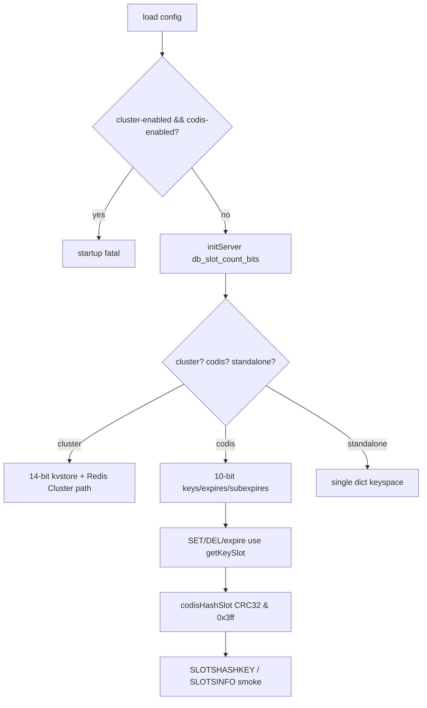

# redis8-codis-mode-foundation design

## 0. 术语约定

- **Codis mode**：Redis 8 内新增的 `codis-enabled yes` 运行模式；它让普通 standalone Redis 进程按 Codis 1024 slot 组织 keyspace，但不启用 Redis Cluster 协议。
- **Codis slot**：固定 1024 个 slot，slot id 为 `crc32(hash_tag_or_key) & 0x3ff`，必须和 Go proxy `pkg/proxy/mapper.go` 的 `Hash()` 行为一致。
- **Codis hash tag**：key 中第一对 `{...}` 内的内容；即使内容为空也作为 tag 参与 CRC32，这一点和 Redis Cluster 的空 tag 语义不同。
- **Codis kvstore**：`codis-enabled yes` 下 Redis 8 `redisDb.keys`、`redisDb.expires`、`redisDb.subexpires` 使用 10-bit `kvstore` / `estore` slot 分区，作为主 keyspace。
- **Foundation slot commands**：本阶段只提供 `SLOTSHASHKEY` 和 `SLOTSINFO` 两个只读观察命令，用于验证 slot 语义；迁移、扫描、删除、校验命令属于后续子 feature。

防冲突结论：本 feature 的 “Codis mode” 不是 Redis Cluster mode；`codis-enabled` 不产生 MOVED/ASK、不加入 cluster bus、不改变 `dbnum`。

## 1. 决策与约束

### 需求摘要

本 feature 要把 Redis 8 harness 推进到最小可运行 Codis 闭环：用 `codis-enabled yes` 启动 Redis 8 Codis Server 后，可以写入普通 key，key 按 Codis CRC32 规则进入 1024 slot 的 `kvstore`，并能通过 `SLOTSHASHKEY` / `SLOTSINFO` 在 Tcl smoke test 中观察到一致的 slot 结果。

明确不做：

- 不启用 Redis Cluster 协议，不产生 MOVED/ASK，不初始化 cluster state。
- 不把 `codis-enabled yes` 和 `cluster-enabled yes` 同时打开；启动期必须拒绝。
- 不改变 Redis standalone 多 DB 行为；`databases` 配置继续生效，`SELECT <db>` 继续可用。
- 不移植 `SLOTSSCAN`、`SLOTSDEL`、`SLOTSCHECK`、`SLOTSMGRT*`、`SLOTSRESTORE*`。
- 不引入 Redis 3 的 `hash_slots[1024]` 平行索引。
- 不改 Go proxy/topom/admin 代码，不切换默认 `codis-server` 构建目标。

### 复杂度档位

走“底层 Redis keyspace 行为变更”高兼容档位：

- Compatibility = strict backward-compatible：默认 `codis-enabled no` 行为必须保持 Redis 8 standalone 原状。
- Determinism = high：slot 计算必须和 Go proxy CRC32 hash tag 规则逐 key 一致。
- Testability = smoke + build：至少覆盖 Redis 8 构建、`codis-enabled` 启动、互斥配置失败、`SLOTSHASHKEY` / `SLOTSINFO` 语义。

### 关键决策

1. **用独立 `codis_enabled` 状态，不复用 `cluster_enabled`**。
   - 依据：roadmap 4.1 明确 Codis 不是 Redis Cluster 协议；复用 cluster 会触发 MOVED/ASK、cluster bus 和 dbnum=1 等不兼容行为。

2. **Codis mode 下 `kvstore` 主存储直接使用 1024 slot**。
   - 依据：roadmap 4.2 / 4.3 已确定方案 A；这避免恢复 Redis 3 的 parallel `hash_slots`。

3. **新增 `codisHashSlot()`，不修改 `keyHashSlot()` 的 Redis Cluster 语义**。
   - 依据：`keyHashSlot()` 是 cluster 热路径 static inline；Codis CRC32 和 Redis Cluster CRC16/16384 不能混在同一函数里。

4. **本阶段注册 `SLOTSHASHKEY` / `SLOTSINFO` 作为最小观察面**。
   - 依据：roadmap item 备注要求通过这两个命令验证 slot 语义；后续 `redis8-slot-basic-commands` 负责扩展为完整 slot command set。

### 前置依赖

- `redis8-patch-inventory-and-build-harness` 已完成，`make codis-server-redis8` 可构建 Redis 8 server 并链接 `slots.o` / `crc32.o`。

## 2. 名词与编排

### 2.1 名词层

#### Codis mode 配置

现状：

- `extern/redis-8.6.3/src/server.h` 只有 `server.cluster_enabled`。
- `extern/redis-8.6.3/src/config.c` 通过 `createBoolConfig("cluster-enabled", ...)` 注册 Redis Cluster 配置，并在 load 后将 cluster mode 的 `dbnum` 强制降为 1。

变化：

- `redisServer` 新增 `int codis_enabled`。
- `config.c` 新增 immutable bool config `codis-enabled`，默认 `no`。
- load config sanity 增加 `codis-enabled yes` 与 `cluster-enabled yes` 互斥检查。
- `codis-enabled yes` 不触发 `dbnum=1` 的 cluster 专属降级。

接口示例：

```text
输入：redis-server --codis-enabled yes --cluster-enabled no
输出：Redis 8 standalone 协议启动，server.codis_enabled=1，server.cluster_enabled=0

输入：redis-server --codis-enabled yes --cluster-enabled yes
输出：启动失败，提示 codis-enabled and cluster-enabled are mutually exclusive
```

#### Codis slot 计算

现状：

- `extern/redis-8.6.3/src/db.c:getKeySlot()` 在 `cluster_enabled=0` 时固定返回 0。
- `extern/redis-8.6.3/src/cluster.h:keyHashSlot()` 计算 Redis Cluster CRC16 16384 slot。
- `extern/redis-8.6.3/src/crc32.c` 已有 `crc32_checksum()`，但没有 Codis hash tag 包装函数。

变化：

- 新增 `CODIS_SLOT_MASK_BITS=10`、`CODIS_SLOTS=1024`、`CODIS_SLOT_MASK=0x3ff`。
- 新增 `codisHashSlot(const char *key, size_t keylen)`：抽取 Codis hash tag 后计算 `crc32_checksum() & CODIS_SLOT_MASK`。
- `calculateKeySlot()` / `getKeySlot()` 在 `codis_enabled=1` 时返回 `codisHashSlot()`；cluster mode 仍返回 `keyHashSlot()`；默认 standalone 仍返回 0。

接口示例：

```text
SLOTSHASHKEY alpha {tag}:a {tag}:b {}abc
-> [362, 899, 899, 0]
```

#### Codis kvstore

现状：

- `initServer()` / `initTempDb()` / `emptyDbAsync()` 只有 `cluster_enabled` 时才用 `CLUSTER_SLOT_MASK_BITS` 创建 `keys`、`expires`、`subexpires`。
- `server.pubsubshard_channels` 复用同一个 `slot_count_bits` 变量。

变化：

- DB keyspace 单独计算 `db_slot_count_bits`：cluster 用 14，Codis 用 10，standalone 用 0。
- `server.db[j].keys`、`expires`、`subexpires`、temp DB 和 async flush 后重建的 DB 使用 `db_slot_count_bits`。
- `pubsubshard_channels` 只在 Redis Cluster 下使用 14-bit slot；Codis mode 不把 sharded pubsub 误挂到 1024 Codis slot。
- `dbExpandGeneric()` 在 Codis mode 下按 `CODIS_SLOTS` 近似分摊扩容目标，避免把总 key 数扩到每个 slot dict。

接口示例：

```text
触发：codis-enabled yes 后 SET {tag}:a 1、SET {tag}:b 2
输出：SLOTSINFO 899 1 返回 [[899, 2]]
```

#### Foundation slot commands

现状：

- Redis 8 command metadata 没有 `SLOTSHASHKEY` / `SLOTSINFO`。
- Redis 8 `slots.c` 只有 build harness marker。

变化：

- `slots.c` 新增 `slotshashkeyCommand()` 和 `slotsinfoCommand()`。
- 新增 Redis 8 command JSON，重新生成 `commands.def`，命令 flags 为只读/快速观察面。
- `SLOTSINFO [start] [count]` 返回当前 DB 中非空 Codis slot 的 `[slot, key_count]` 列表，start/count 范围限定在 `0..1023`。

接口示例：

```text
SLOTSINFO [start] [count]
-> array<array<int,int>>，每项为 [slot_id, key_count]
```

### 2.2 编排层



现状：

- Redis 8 standalone 所有 key 都落在 `kvstore` dict 0。
- Redis Cluster mode 才有 14-bit slot-aware keyspace，同时带来 cluster-only 协议行为。
- Redis 8 Codis Server 当前只是可编译 stub，不能验证 1024 slot 语义。

变化：

- 配置层新增 `codis-enabled` 并在启动配置 sanity 阶段阻断和 cluster mode 的冲突。
- keyspace 初始化层把 Codis mode 分类为 `codis-or-cluster slot-aware`，但只作用于 DB key lifecycle。
- slot 计算层保持三分支：cluster CRC16、Codis CRC32、standalone 0。
- 命令层补两个只读观察命令，Tcl smoke test 以真实 Redis 8 server 进程验证闭环。

流程级约束：

- **错误语义**：配置互斥在启动期失败，不静默关闭任一方。
- **幂等性**：重复启动和重复写入同一组 key，`SLOTSHASHKEY` / `SLOTSINFO` 结果稳定。
- **兼容性**：`codis-enabled no` 下 keyspace、cluster config、默认构建目标不变。
- **扩展点**：后续 slot command feature 在现有 `slots.c` 上扩展命令，不需要再改 slot 计算基座。

### 2.3 挂载点清单

- `extern/redis-8.6.3/src/server.h`：新增 Codis slot 常量、`server.codis_enabled` 和 command/hash 函数声明。
- `extern/redis-8.6.3/src/config.c`：新增 `codis-enabled` 配置和启动互斥检查。
- `extern/redis-8.6.3/src/server.c`：初始化 CRC32 表，并让 DB keyspace 在 Codis mode 下使用 10-bit slot。
- `extern/redis-8.6.3/src/db.c`：`calculateKeySlot()` / `getKeySlot()` / temp DB / DB 扩容路径识别 Codis mode。
- `extern/redis-8.6.3/src/lazyfree.c`：`emptyDbAsync()` 在 Codis mode 下重建 10-bit DB keyspace，避免 `FLUSH* ASYNC` / blocking async flush 后退回 standalone 单 dict。
- `extern/redis-8.6.3/src/slots.c`：实现 `codisHashSlot()`、`SLOTSHASHKEY`、`SLOTSINFO`。
- `extern/redis-8.6.3/src/commands/slotshashkey.json`、`slotsinfo.json`、`commands.def`：注册最小只读观察命令。
- `extern/redis-8.6.3/tests/unit/codis.tcl` 及测试清单：新增 Redis 8 Codis mode smoke test。

### 2.4 推进策略

1. **配置基座**：新增 `codis_enabled` 状态、`codis-enabled` config 和 cluster 互斥检查。
   - 退出信号：`codis-enabled yes` 可启动，和 `cluster-enabled yes` 同开会失败。

2. **slot keyspace**：让 `initServer()` / `initTempDb()` / `emptyDbAsync()` / `getKeySlot()` / `calculateKeySlot()` 使用 Codis 10-bit slot。
   - 退出信号：Codis mode 写入 key 后 `kvstore` per-slot 计数不再集中在 slot 0。

3. **观察命令**：实现并注册 `SLOTSHASHKEY` / `SLOTSINFO`。
   - 退出信号：命令返回格式兼容 Redis 3 Codis 的只读观察面，且只覆盖当前 DB。

4. **Tcl smoke test**：新增 Redis 8 Codis mode 单测。
   - 退出信号：测试覆盖 CRC32 exact slot、hash tag 共享 slot、`SLOTSINFO` count、`SELECT` 后当前 DB 语义和互斥配置失败。

5. **构建与范围回归**：运行 Redis 8 构建和目标 Tcl 测试，核对未进入后续迁移/扫描/删除范围。
   - 退出信号：`make codis-server-redis8` 通过，目标 Tcl 测试通过，diff 不包含 Go 代码或迁移命令实现。

### 2.5 结构健康度与微重构

##### 评估

- compound convention：已检索 `.codestable/compound`，无目录组织 / 命名 / 归属相关命中。
- 文件级 — `server.h`：Redis 上游大型头文件，本次只新增少量状态和声明，符合现有全局 server 配置集中放置方式。
- 文件级 — `config.c`：上游 config registry 较大，但新增 bool config 和 sanity check 是现有模式，不重组。
- 文件级 — `server.c` / `db.c`：本次改动集中在初始化和 slot 计算分支，改动面小。
- 文件级 — `slots.c`：当前是 stub，本 feature 正好把 Codis slot 基座落在该文件；后续命令继续扩展同一文件。
- 目录级 — `extern/redis-8.6.3/src/commands/`：Redis 8 command JSON 目录本就是一命令一文件，新增两个 JSON 符合上游模式。
- 目录级 — `extern/redis-8.6.3/tests/unit/`：Redis unit Tcl 测试目录已有按主题拆分的 `.tcl`，新增 `codis.tcl` 不需要重组。

##### 结论：不做微重构

原因：本 feature 是 Redis 8 Codis mode 的最小基座，改动点必须贴近上游 Redis 初始化、配置和 command metadata。拆文件或重组目录会增加移植偏差，收益不抵风险。

## 3. 验收契约

### 关键场景清单

- 触发：执行 `make codis-server-redis8`。期望：Redis 8 构建通过并重新生成包含 `SLOTSHASHKEY` / `SLOTSINFO` 的 command table。
- 触发：以 `--codis-enabled yes` 启动 Redis 8。期望：server 可启动，`CONFIG GET codis-enabled` 返回 `yes`，`cluster-enabled` 仍为 `no`。
- 触发：同时指定 `--codis-enabled yes --cluster-enabled yes`。期望：启动失败并明确提示互斥。
- 触发：执行 `SLOTSHASHKEY alpha {tag}:a {tag}:b {}abc`。期望：返回 `[362, 899, 899, 0]`。
- 触发：在 DB 0 写入 `{tag}:a`、`{tag}:b` 后执行 `SLOTSINFO 899 1`。期望：返回 `[[899, 2]]`。
- 触发：`SELECT 1` 后写入 `{tag}:c` 并执行 `SLOTSINFO 899 1`。期望：只统计当前 DB，返回 `[[899, 1]]`。
- 触发：`FLUSHALL` / `FLUSHDB` 清空后继续写入 Codis tag key。期望：DB 仍保持 1024 slot keyspace，写入不崩溃，`SLOTSINFO` 仍按 Codis slot 统计。
- 触发：默认不启用 Codis mode 启动。期望：普通 Redis standalone 行为保持，`codis-enabled` 默认为 `no`。

### 明确不做的反向核对项

- Diff 不应修改 Go 源码。
- Diff 不应切换默认 `codis-server` / `build-all` 到 Redis 8。
- Diff 不应新增 `SLOTSSCAN`、`SLOTSDEL`、`SLOTSCHECK`、`SLOTSMGRT*`、`SLOTSRESTORE*` 实现。
- Diff 不应新增 Redis Cluster MOVED/ASK、cluster bus 或 cluster state 初始化路径。
- Diff 不应引入 Redis 3 `hash_slots[1024]` parallel index。

## 4. 与项目级架构文档的关系

acceptance 阶段需要回写 `.codestable/architecture/ARCHITECTURE.md`：Redis 8 harness 已从 stub 构建推进到 `codis-enabled` 最小运行模式，当前能验证 1024 slot keyspace 和 `SLOTSHASHKEY` / `SLOTSINFO` 观察面；完整 slot 命令和迁移协议仍在后续 roadmap item。
