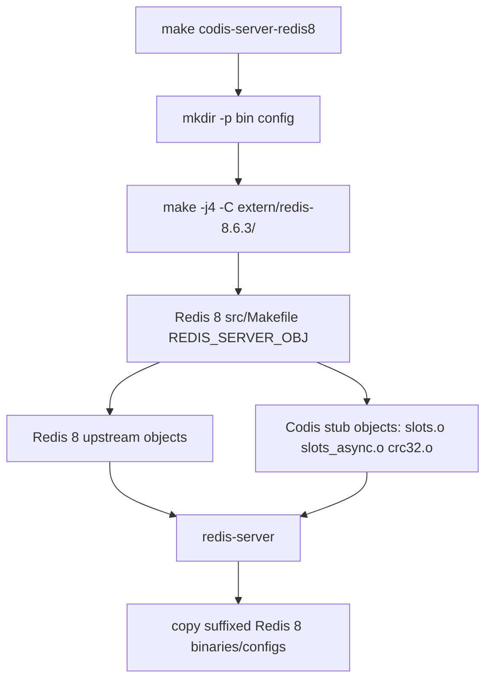

# redis8-patch-inventory-and-build-harness design

## 0. 术语约定

- **Redis 3 Codis patch**：当前仓库 `extern/redis-3.2.11/` 中已经落地的 Codis Server 补丁集合，包括 `slots.c`、`slots_async.c`、`crc32.c` 和对 Redis 原始文件的嵌入式修改。
- **Redis 8 source**：仓库 `extern/redis-8.6.3/`，本 roadmap 的目标底层 Redis 源码。
- **File-level migration matrix**：文件级移植对照表，逐项记录 Redis 3 被补丁改过的文件、修改点、Redis 8 对应位置/API、后续归属 feature 和风险。
- **Build harness**：最小构建挂载，不切换默认 `codis-server`，只提供独立 `codis-server-redis8` 目标，并让 Redis 8 server 链接 Codis 预留目标文件。
- **Stub Codis object**：Redis 8 下临时加入的 `slots.o`、`slots_async.o`、`crc32.o` 编译对象。除 `crc32` 基础函数外，不注册命令、不触发运行逻辑，后续 feature 会替换为真实实现。

防冲突结论：术语与 `redis8-upgrade` roadmap 保持一致；`Build harness` 明确不是正式默认构建切换，避免和后续 `redis8-build-config-packaging` 混淆。

## 1. 决策与约束

### 需求摘要

本 feature 要完成 Redis 8 升级的第一步：把当前 Redis 3 Codis patch 的移植面整理成文件级矩阵，并建立一个可编译的 Redis 8 Codis Server 最小目标。服务对象是后续各 Redis 8 移植 feature；成功标准是后续实现者能从矩阵知道每个 patch 挂点归属，并且能用 `make codis-server-redis8` 编译出带 Codis 预留对象的 Redis 8 二进制。

明确不做：

- 不切换默认 `make` / `make codis-server` 的 Redis 3 构建路径；若默认 Redis 3 冒烟暴露当前工具链下的纯构建兼容问题，只允许做最小兼容修复以完成冒烟验证。
- 不实现 `codis-enabled`，不修改 `getKeySlot()` / `calculateKeySlot()`，不启用 1024 slot `kvstore`。
- 不注册 `SLOTS*` 命令，不生成 Codis command JSON，不改 Redis 8 `commands.def`。
- 不移植真实 `slots.c` / `slots_async.c` 业务逻辑。
- 不改 Go proxy/topom/admin 代码。
- 不解决 Redis 8 RDB fragment、ACL/AUTH、pthread lazy release 等后续 feature 范围的问题。

### 复杂度档位

走“项目内部构建能力 + 规划交付物”默认档位，偏离如下：

- Compatibility = backward-compatible（默认 `codis-server` 仍指向 Redis 3；Redis 8 构建作为独立目标加入）。
- Determinism = reproducible（Redis 8 构建目标固定从 `extern/redis-8.6.3/` 取源码，产物使用独立后缀，避免覆盖 Redis 3 默认产物）。
- Testability = verified（至少验证 `make codis-server-redis8`；同时验证默认 `make codis-server` 不受影响）。

### 关键决策

1. **新增独立 `codis-server-redis8`，不改默认 `codis-server`**。
   - 依据：第一步只建立 harness，后续 `codis-mode-foundation` 尚未完成，直接切默认会破坏可用构建。
   - 被拒方案：让 `codis-server` 直接指向 Redis 8。理由：Redis 8 Codis 逻辑尚未可用，会让现有 `make` 的语义过早变化。

2. **Redis 8 先链接 stub Codis object，不注册命令**。
   - 依据：roadmap 明确本阶段“可编译”只要求 `slots.o` 等目标文件接入二进制，Codis 逻辑可以尚未触发。
   - 被拒方案：直接复制 Redis 3 `slots.c` / `slots_async.c` 到 Redis 8 并强行修编译。理由：真实移植依赖 `codis-enabled`、`kvstore` slot 契约和 tag index，本阶段硬冲会把后续 feature 的设计边界打乱。

3. **移植矩阵落在 feature 目录，作为后续 feature 的输入材料**。
   - 依据：这是升级路线中的调研/规划交付物，不是用户文档；落在 `.codestable/features/...` 可被后续 design/acceptance 引用。
   - 被拒方案：写到 `doc/`。理由：当前内容面向实现者，不是对外使用指南。

4. **暂不改 Redis 8 command metadata**。
   - 依据：命令注册属于 `redis8-codis-mode-foundation` 或后续 slot command feature。本阶段改变 JSON/`commands.def` 会让未实现命令暴露给客户端。

### 前置依赖

- `redis8-upgrade` roadmap 已 active。
- 本 roadmap item 无前置 feature 依赖。

## 2. 名词与编排

### 2.1 名词层

#### Redis 3 patch 修改面

现状：

- `extern/redis-3.2.11/src/slots.c`：882 行，承载同步迁移、`SLOTSINFO`、`SLOTSSCAN`、`SLOTSDEL`、`SLOTSRESTORE`、`SLOTSHASHKEY` 等命令。
- `extern/redis-3.2.11/src/slots_async.c`：1770 行，承载异步迁移、restore async、fence/cancel/status 和 lazy release worker。
- `extern/redis-3.2.11/src/crc32.c`：41 行，提供 Codis CRC32 hash。
- `extern/redis-3.2.11/src/server.h/server.c/db.c/networking.c/object.c/config.c/Makefile`：嵌入结构体字段、命令表、server 初始化、key 生命周期维护、client slotsmgrt 状态、共享对象和构建对象。

变化：

- **新增** file-level migration matrix，逐项列出上述修改面在 Redis 8 的对应位置、风险和后续 feature 归属。
- **不修改** Redis 3 源码。

接口示例：

```text
输入：查看 redis8 patch inventory
输出：每一行包含 Redis 3 文件/修改点、Redis 8 对应位置/API、风险、归属 feature、验证要点
来源：redis8-upgrade roadmap 第 3 节 patch-inventory-build 模块
```

#### Redis 8 build harness

现状：

- 根 `Makefile` 的 `codis-server` 目标只进入 `extern/redis-3.2.11/`，并复制 `redis-server` 为 `bin/codis-server`。
- `extern/redis-8.6.3/src/Makefile` 的 `REDIS_SERVER_OBJ` 不包含 Codis 的 `slots.o`、`slots_async.o`、`crc32.o`。
- `extern/redis-8.6.3/src/commands.def` 已存在，Redis 8 command metadata 由 `src/commands/*.json` 和 `utils/generate-command-code.py` 管理。

变化：

- **新增**根 Makefile 变量 `REDIS3_DIR` / `REDIS8_DIR`，避免重复硬编码路径。
- **新增**根 Makefile 目标 `codis-server-redis8`，编译 `extern/redis-8.6.3/` 并复制 suffixed Redis 8 产物到 `bin/` / `config/`。
- **修改**Redis 8 `src/Makefile`，把 `slots.o`、`slots_async.o`、`crc32.o` 加入 `REDIS_SERVER_OBJ`。
- **新增**Redis 8 stub source：`slots.c`、`slots_async.c`、`crc32.c`。其中 `slots.c` / `slots_async.c` 只放 marker 函数；`crc32.c` 保留 Codis CRC32 基础函数，供后续 hash feature 复用。
- **修改**`.gitignore`，解除 Redis 8 源码目录忽略，使 `extern/redis-8.6.3/` 与 Redis 3 一样作为仓库内源码被 `git status` 跟踪；`config/redis8.conf` / `config/sentinel8.conf` 作为 harness 生成物暂不纳入版本控制，正式配置模板留给后续 packaging。
- **兼容修复**Redis 3 `config.h` 的 macOS 10.6+ 检测，采用 Redis 6/8 已有的 `__MAC_OS_X_VERSION_MAX_ALLOWED >= 1060` 判断，避免当前 SDK 下默认冒烟误走 `stat64`。
- **兼容修复**Redis 3 `debug.c` 的 macOS 10.6+ / ARM64 mcontext 分支，避免 Apple Silicon 下旧 PowerPC/x86 字段导致编译失败。

接口示例：

```text
输入：make codis-server-redis8
输出：
  bin/codis-server-redis8
  bin/redis-cli-redis8
  bin/redis-benchmark-redis8
  bin/redis-sentinel-redis8
  config/redis8.conf
  config/sentinel8.conf
来源：根 Makefile codis-server-redis8
```

### 2.2 编排层



现状：

- 默认 `build-all` 依赖 `codis-server`，即 Redis 3 Codis Server。
- Redis 8 源码放在仓库中，但没有从根 Makefile 暴露独立 Codis Server 构建目标。
- Redis 8 server object 列表没有 Codis object，后续 feature 如果直接加逻辑，会先遇到构建挂载缺失。

变化：

- 新增 Redis 8 独立构建支线，不接入默认 `build-all`。
- Redis 8 `redis-server` 链接 Codis stub objects，形成后续 feature 可以逐步替换的对象边界。
- 移植矩阵作为实现流的前置文档，后续 feature 按归属列消费，不在本阶段扩大实现。

流程级约束：

- **错误语义**：`make codis-server-redis8` 失败即表示 build harness 不成立；不得用跳过 stub objects 的方式掩盖失败。
- **幂等性**：重复执行目标只刷新 `bin/*-redis8` 和 `config/redis8*.conf`，不修改 tracked generated source。
- **兼容性**：`make codis-server` 和 `make build-all` 的默认 Redis 3 语义保持不变。
- **扩展点**：后续 `redis8-codis-mode-foundation` 可以在现有 `slots.c` / `crc32.c` stub 基础上填入真实 hash/command 逻辑。
- **范围修正**：默认 Redis 3 冒烟中发现的 macOS `stat64` 与 ARM64 mcontext 编译问题只做平台检测/寄存器日志兜底，不触碰 Redis 3 Codis patch 逻辑。

### 2.3 挂载点清单

- 根 `Makefile`：新增 `codis-server-redis8` 目标和 `REDIS8_DIR` 路径变量。
- `extern/redis-8.6.3/src/Makefile`：`REDIS_SERVER_OBJ` 加入 `slots.o`、`slots_async.o`、`crc32.o`。
- `extern/redis-8.6.3/src/slots.c`：新增 Codis slot stub object。
- `extern/redis-8.6.3/src/slots_async.c`：新增 Codis async migration stub object。
- `extern/redis-8.6.3/src/crc32.c`：新增 Codis CRC32 object。
- `.gitignore`：不再忽略 `extern/redis-8.6.3/` 源码目录，避免后续 Redis 8 patch 改动被隐藏；继续忽略 Redis 8 suffixed config 生成物。
- `.codestable/features/2026-05-13-redis8-patch-inventory-and-build-harness/redis8-patch-migration-matrix.md`：新增移植矩阵交付物。
- `extern/redis-3.2.11/src/config.h`：同步 Redis 6/8 的 macOS 10.6+ fstat 检测，保障默认 Redis 3 构建冒烟可执行。
- `extern/redis-3.2.11/src/debug.c`：同步 macOS 10.6+ 检测宏并为 ARM64 寄存器日志提供编译兜底，保障默认 Redis 3 构建冒烟可执行。

### 2.4 推进策略

1. **规划交付物**：写 Redis 3 patch → Redis 8 文件级移植矩阵。
   - 退出信号：矩阵覆盖 roadmap review 中列出的 Redis 原始文件和 Codis 新增源文件，并标明后续归属 feature。

2. **构建入口**：在根 Makefile 增加 Redis 8 独立构建目标。
   - 退出信号：目标不改变默认 `codis-server`，且产物使用 `-redis8` 后缀避免覆盖默认 Redis 3 产物。

3. **Redis 8 object 挂载**：在 Redis 8 src Makefile 加入 Codis stub objects，并新增 stub source。
   - 退出信号：Redis 8 server link 命令实际依赖 `slots.o`、`slots_async.o`、`crc32.o`。

4. **构建验证**：运行 Redis 8 独立构建和 Redis 3 默认构建冒烟。
   - 退出信号：`make codis-server-redis8` 与 `make codis-server` 均通过。

5. **范围回归**：核对没有提前进入 codis mode、slot 命令、Go 组件适配范围。
   - 退出信号：diff 不包含 Redis 8 command JSON / `commands.def`、Go 源码、`getKeySlot()` 或 `codis-enabled` 实现。

### 2.5 结构健康度与微重构

##### 评估

- compound convention：已检索 `.codestable/compound`，无目录组织 / 命名 / 归属相关命中。
- 文件级 — 根 `Makefile`：约 60 行，职责集中在构建编排；本次新增一个并列 target 和路径变量，改动密度低。
- 文件级 — `extern/redis-8.6.3/src/Makefile`：Redis 上游大型构建脚本，本次只改 `REDIS_SERVER_OBJ` 一处，不做结构性调整。
- 文件级 — `extern/redis-3.2.11/src/config.h`：Redis 3 平台宏文件，本次只同步 Redis 6/8 已有 macOS 版本检测判断，改动密度低。
- 文件级 — `extern/redis-3.2.11/src/debug.c`：Redis 3 调试/崩溃报告文件较大，本次只修正 Apple 平台条件和 ARM64 寄存器日志兜底，属于构建兼容补丁，不做结构调整。
- 目录级 — `extern/redis-8.6.3/src/`：上游 Redis 源码目录本身是单层 C 源码布局；新增 3 个 Codis C 文件符合 Redis 3 Codis patch 的既有形态。
- 文件级 — `.gitignore`：本次解除 Redis 8 源码目录忽略，并忽略 Redis 8 suffixed config 生成物；不改变 Redis 6 参考源码忽略策略。
- 目录级 — feature 目录：新增 design、checklist、migration matrix 三个 workflow artifact，符合 CodeStable 目录约定。

##### 结论：不做微重构

原因：本 feature 是构建挂载与移植矩阵，不涉及大文件职责重划。Redis 8 `src/Makefile` 和 `src/` 单层布局属于上游源码组织，当前阶段不应重组。

## 3. 验收契约

### 关键场景清单

- 触发：打开 migration matrix。期望：能看到 `server.h`、`server.c`、`db.c`、`networking.c`、`object.c`、`config.c`、Redis 3 `src/Makefile`、`slots.c`、`slots_async.c`、`crc32.c` 对 Redis 8 的移植对照和后续归属。
- 触发：执行 `make codis-server-redis8`。期望：Redis 8 构建通过，产出 suffixed Redis 8 binaries/configs。
- 触发：检查 Redis 8 link 依赖。期望：`extern/redis-8.6.3/src/redis-server` 构建依赖中包含 `slots.o`、`slots_async.o`、`crc32.o`。
- 触发：执行 `make codis-server`。期望：默认 Redis 3 Codis Server 构建仍通过，`bin/codis-server` 仍来自 `extern/redis-3.2.11/`。
- 触发：grep Redis 8 command metadata。期望：本 feature 不新增 Codis command JSON，不修改 `commands.def`。
- 触发：grep `codis_enabled` / `getKeySlot` / Go proxy/topom。期望：本 feature 不提前实现 Codis 模式或 Go 适配。

### 明确不做的反向核对项

- Diff 不应切换 `build-all` 的默认 Redis Server 目标。
- Diff 不应修改 Go 源码。
- Diff 不应修改 Redis 8 `commands.def` 或新增 Redis 8 `src/commands/slots*.json`。
- Diff 不应修改 Redis 8 `db.c`、`server.c`、`server.h`、`config.c` 中的 `codis_enabled` / slot 初始化逻辑。
- Diff 不应把 Redis 3 `slots.c` / `slots_async.c` 真实逻辑直接复制进 Redis 8。

## 4. 与项目级架构文档的关系

本 feature 新增 Redis 8 Codis Server 的独立构建支线，但不改变系统运行架构和默认构建产物。acceptance 阶段应在 `.codestable/architecture/ARCHITECTURE.md` 的构建层补充一条：Redis 8 升级已存在独立 `codis-server-redis8` harness，默认 `codis-server` 仍是 Redis 3，正式切换要等后续 roadmap item。
