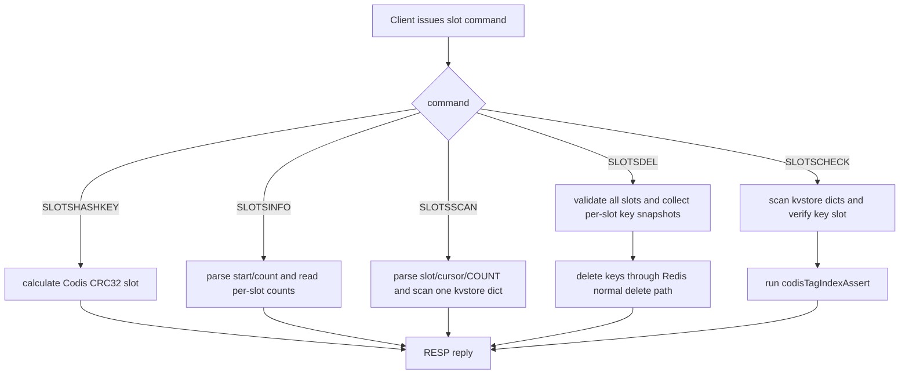

# redis8-slot-basic-commands design

## 0. 术语约定

- **基础 slot 命令**：本 feature 覆盖 `SLOTSHASHKEY`、`SLOTSINFO`、`SLOTSSCAN`、`SLOTSDEL`、`SLOTSCHECK`。其中 `SLOTSHASHKEY` / `SLOTSINFO` 在前置阶段已经存在，本阶段把它们作为兼容基线并补齐边界回归；新增命令是 `SLOTSSCAN`、`SLOTSDEL`、`SLOTSCHECK`。
- **当前 DB 语义**：slot 命令只操作执行客户端的 `c->db`，`SELECT <db>` 后命令必须落到被选中的 DB，不跨 DB 聚合。
- **per-slot kvstore dict**：Redis 8 Codis mode 下 `redisDb.keys` 的 1024 个 `kvstore` dict，是 slot keyspace 的唯一权威来源。命令不恢复 Redis 3 的 `hash_slots[1024]` 平行索引。
- **slot scan cursor**：`SLOTSSCAN` 使用 Redis 8 `kvstoreScan(..., onlydidx=slot, ...)` / 等价 per-slot scan，cursor 字符串格式沿用 Redis `SCAN` 的 unsigned cursor，不新增 Codis 私有 cursor 编码。
- **slot check**：Redis 8 下不再检查“主 dict vs hash_slots”双索引一致性，而是检查每个 per-slot dict 中的 key 是否仍 hash 到该 slot，并复用 `codisTagIndexAssert` 校验 tag index。

防冲突结论：本 feature 是 Redis 8 Codis Server 命令层移植，不是 Redis Cluster 命令实现；`slot` 仍固定是 Codis 1024 slot，不引入 Redis Cluster 16384 slot、MOVED/ASK 或 cluster bus 语义。

## 1. 决策与约束

### 需求摘要

本 feature 要让 Redis 8 Codis Server 在 `codis-enabled yes` 下具备 Codis 基础 slot 命令的完整可用面：查询 key 的 slot、统计 slot key 数、按 slot 增量扫描 key、清空指定 slot、检查 slot/tag 内部一致性。直接受益者是后续迁移协议、Go proxy/topom/admin 的兼容验证，以及运维调试命令。

成功标准：

- `SLOTSHASHKEY key [key ...]` 返回每个 key 的 Codis slot id，结果仍等价于 Go proxy 的 CRC32 hash tag 规则。
- `SLOTSINFO [start] [count]` 返回 `[[slot_id, key_count], ...]`，只包含当前 DB 范围内非空 slot，并保持 Go `SlotsInfo()` parser 兼容。
- `SLOTSSCAN slot cursor [COUNT n]` 返回 `[next_cursor, [key ...]]`，每个 key 都属于指定 Codis slot。
- `SLOTSDEL slot [slot ...]` 删除当前 DB 中指定 slot 的全部 key，返回 `[[slot_id, remaining_count], ...]`，返回项数量与输入 slot 数量一致。
- `SLOTSCHECK` 在 keyspace 与 tag index 一致时返回 `OK`，发现内部不一致时返回 Redis error reply。
- Redis Tcl 覆盖正常路径、边界值和错误路径；`make codis-server-redis8` 继续通过。

明确不做：

- 不移植 `SLOTSMGRT*`、`SLOTSRESTORE*`、异步迁移、RDB fragment restore 或迁移 socket 缓存。
- 不恢复 Redis 3 的 `hash_slots[1024]`、`hashSlotType` 或平行 slot index。
- 不修改 Go `pkg/` / `cmd/` 代码，不改变 proxy 对 `SLOTSINFO` / `SLOTSSCAN` 的路由策略。
- 不切换默认 `make` / `codis-server` 到 Redis 8，继续只要求 `make codis-server-redis8`。
- 不实现 Redis Cluster 协议，不改变 `keyHashSlot()` 的 CRC16/16384 语义。
- 不给 `SLOTSSCAN` 增加 Redis `SCAN` 的 `MATCH` / `TYPE` 扩展；沿用 Codis 文档中只支持 `COUNT` 的协议。

### 复杂度档位

走“对外 Redis 命令 / 生产兼容”默认档位，并有两处偏离：

- Testability = verified（偏离默认 tested）：slot 命令是后续迁移正确性的入口，除命令输出外还要用 `SLOTSCHECK` / `DEBUG CODIS-TAGINDEX-ASSERT` 验证内部不变量。
- Compatibility = cross-version（偏离默认 backward-compatible）：行为要对齐 Redis 3 Codis Server 的命令协议，同时适配 Redis 8 `kvstore` 内部结构。

### 关键决策

1. **`kvstore` 是所有基础 slot 命令的唯一 keyspace 来源**。
   - 依据：roadmap 4.3 和前置 feature 已把 `redisDb.keys` 组织成 1024-slot `kvstore`。恢复 `hash_slots` 会重新制造双写一致性风险。

2. **`SLOTSSCAN` 走 per-slot scan，不复用全 DB `SCAN` 再过滤**。
   - 依据：Redis 8 `kvstoreScan` 已支持 `onlydidx`；全 DB scan 过滤会扩大单次调用成本，也会让 cursor 语义和指定 slot 脱节。

3. **`SLOTSDEL` 通过 Redis 8 正常删除路径删除 key**。
   - 依据：删除必须触发 expire 清理、tag index 删除、module unlink、dirty 计数和 key modified 信号；不能只从 dict 里摘 key。

4. **`SLOTSCHECK` 改为校验 Redis 8 的真实不变量**。
   - 依据：Redis 8 没有主 dict + `hash_slots` 两份索引；检查重点变为 key 所在 `kvstore` dict 与 Codis hash 是否一致，以及 tag index 是否与 keyspace 一致。

5. **命令注册以 Redis 8 command JSON 为源，`commands.def` 只作为生成产物同步更新**。
   - 依据：Redis 8 命令表由 `src/commands/*.json` 经 `utils/generate-command-code.py` 生成；手写 `commands.def` 会偏离上游维护方式。

### 前置依赖

- `redis8-slot-index-and-tag-index-core` 已完成：Codis slot keyspace helper、`codisHashInfoForKey`、`codis_tagged_keys` 生命周期维护和 `DEBUG CODIS-TAGINDEX-ASSERT` 已落地。

## 2. 名词与编排

### 2.1 名词层

#### 基础 slot 命令注册

现状：

- `extern/redis-8.6.3/src/commands/slotshashkey.json` 和 `slotsinfo.json` 已注册 `SLOTSHASHKEY` / `SLOTSINFO`。
- `extern/redis-8.6.3/src/commands.def` 已包含这两个命令；`server.h` 已声明 `slotshashkeyCommand` / `slotsinfoCommand`。
- Redis 8 还没有 `SLOTSSCAN`、`SLOTSDEL`、`SLOTSCHECK` 的 command JSON、命令表条目和函数声明。

变化：

- 新增 `slotsscan.json`、`slotsdel.json`、`slotscheck.json`，并通过 Redis 8 生成器同步 `commands.def`。
- `SLOTSSCAN` / `SLOTSCHECK` 是 read 类命令；`SLOTSDEL` 是 write 类命令；这些命令参数是 slot id，不声明 key specs。
- 如发现 `SLOTSINFO` metadata 与 Redis 3 兼容边界不一致，本阶段只做协议校正，不改变返回 envelope。

接口示例：

```text
输入：COMMAND INFO SLOTSSCAN SLOTSDEL SLOTSCHECK
输出：三个命令均存在；SLOTSDEL 标记为 write；slot 参数不被当成 key spec
```

#### Codis slot 范围与 count 参数

现状：

- `extern/redis-8.6.3/src/slots.c:parseSlot()` 校验 slot 必须在 `0..1023`。
- `SLOTSINFO` 当前使用 `parseSlotCount()` 校验 count；Redis 3 只拒绝负数，并把超出范围的 count 截断到 slot 末尾。

变化：

- 所有带 slot 参数的命令复用同一套 slot 范围校验，错误使用 Redis error reply。
- `SLOTSINFO` / `SLOTSSCAN COUNT` 的 count 语义拆开：`SLOTSINFO count` 接受非负整数并截断；`SLOTSSCAN COUNT n` 只接受 `n >= 1`，否则返回 syntax error。

接口示例：

```text
输入：SLOTSINFO 1023 999999
输出：只扫描 1023 号 slot，不因 count 大于 1024 报错

输入：SLOTSSCAN 1024 0
输出：ERR invalid slot number
```

#### per-slot scan 结果

现状：

- Redis 8 `db.c:scanGenericCommand()` 通过 `kvstoreScan(c->db->keys, cursor, onlydidx, ...)` 支持按单个 dict scan。
- `extern/redis-3.2.11/src/slots.c:slotsscanCommand()` 返回 `[cursor, [key ...]]`，只支持 `COUNT`，不支持 `MATCH`。

变化：

- 新增 `SLOTSSCAN` 命令接口，使用当前 DB 的指定 slot dict 进行 scan。
- scan callback 从 Redis 8 `dictEntry` 中取 `kvobj` key SDS，返回 bulk key，不返回 value。
- 空 slot 或扫描结束返回 cursor `0` 和空 key 数组。

接口示例：

```text
输入：SLOTSSCAN 899 0 COUNT 10
输出：["<next_cursor>", ["{tag}:a", "{tag}:b", ...]]
约束：返回列表中的每个 key 执行 SLOTSHASHKEY 都得到 899
```

#### slot delete 结果

现状：

- Redis 3 `SLOTSDEL` 先扫描 `hash_slots[slot]`，逐个走 `dbDelete` / `signalModifiedKey` / `server.dirty++`，最后按输入 slot 返回剩余数量。
- Redis 8 `dbGenericDelete()` 已接入 `codisTagIndexDelete`，能维护 tag index 和 Redis 内部删除副作用。

变化：

- `SLOTSDEL` 先对每个输入 slot 做参数校验，再对对应 per-slot dict 安全迭代并收集 key 快照，逐个通过正常删除路径删除。
- 删除后按输入 slot 顺序返回剩余 key count；重复 slot 参数保留重复返回项。
- 删除只影响当前 DB；其他 DB 同 slot 不受影响。

接口示例：

```text
输入：SLOTSDEL 899 362
输出：[[899, 0], [362, 0]]

输入：SELECT 1; SLOTSDEL 899
输出：只删除 DB1 的 899 号 slot key，DB0 不变
```

#### slot consistency check

现状：

- Redis 3 `SLOTSCHECK` 校验 `hash_slots` 中的 key 能在主 dict 找到、主 dict key 能在对应 `hash_slots` 找到、`tagged_keys` 中的 key 能在主 dict 找到。
- Redis 8 已有 `codisTagIndexAssert(redisDb *db, sds *err)`，可扫描 `kvstore` 并校验 `codis_tagged_keys`。

变化：

- `SLOTSCHECK` 扫描当前 DB 的 1024-slot `kvstore`，确认每个 key 的 `codisHashInfoForKey(...).slot` 等于所在 dict index。
- `SLOTSCHECK` 复用 `codisTagIndexAssert` 校验 tag index；失败时返回 Redis error reply 并包含阶段和 key / 原因。
- 非 Codis mode 下返回 `codis mode is disabled`，不把 standalone 单 dict 当成 Codis slot keyspace。

接口示例：

```text
输入：SLOTSCHECK
输出：OK

输入：codis mode disabled 时执行 SLOTSCHECK
输出：ERR codis mode is disabled
```

### 2.2 编排层



现状：

- `SLOTSHASHKEY` 和 `SLOTSINFO` 已在 `extern/redis-8.6.3/src/slots.c` 中实现；`SLOTSINFO` 已通过 `codisSlotKeyCount` 从 `kvstore` 读 key count。
- Redis 8 key 删除、过期、flush、RDB rebuild 已维护 `codis_tagged_keys`，但没有可由用户执行的 `SLOTSCHECK`。
- Redis 8 command table 目前没有 `SLOTSSCAN` / `SLOTSDEL` / `SLOTSCHECK`。

变化：

- 命令入口统一先做 arity、Codis mode、slot/cursor/count 校验；`SLOTSHASHKEY` 作为纯 hash 计算命令继续允许在非 Codis mode 下运行。
- `SLOTSSCAN` 插入 read-only 分支：只访问当前 DB 的目标 slot dict，返回 scan cursor 和 key 列表。
- `SLOTSDEL` 插入 write 分支：先完成所有参数校验，再执行删除，避免前半部分 slot 已删除后才发现后半部分参数非法。
- `SLOTSCHECK` 插入 debug/check 分支：不修复数据，只报告第一处发现的不一致；tag index 检查失败直接返回错误。
- Tcl 覆盖围绕同一 `tests/unit/codis.tcl` 扩展，保持 Redis 8 Codis mode 的最小回归入口集中。

流程级约束：

- **错误语义**：参数错误、slot 越界、cursor 非法、Codis mode 未开启都返回 Redis error reply；不引入非标准 envelope。
- **原子性边界**：`SLOTSDEL` 对参数校验是全量前置；删除过程仍是 Redis 单线程逐 key 执行，不承诺跨大量 key 的事务回滚。
- **当前 DB**：所有 keyspace 命令使用 `c->db`；`SELECT` 后的 slot count/scan/delete/check 不跨 DB。
- **顺序约束**：`SLOTSDEL` 扫描时先收集 key 对象/副本，再删除，避免在 dict scan callback 中直接破坏迭代状态。
- **性能约束**：`SLOTSSCAN` 单次最多按 `COUNT * 10` 量级采样；`SLOTSDEL` / `SLOTSCHECK` 可以线性遍历目标 slot 或全 DB，不标记为 fast path。
- **兼容性**：`SLOTSINFO` / `SLOTSSCAN` 返回结构保持 Redis 3 Codis 文档格式；`SLOTSINFO` 保持 Go `redigo.Values` + `redigo.Ints` 可解析。
- **可观测点**：`SLOTSINFO` 观察 count，`SLOTSSCAN` 观察 key 列表，`SLOTSCHECK` 和 `DEBUG CODIS-TAGINDEX-ASSERT` 观察内部一致性。

### 2.3 挂载点清单

- Redis command registry：`extern/redis-8.6.3/src/commands/slotsscan.json` + generated `commands.def` — 新增 `SLOTSSCAN` 命令。
- Redis command registry：`extern/redis-8.6.3/src/commands/slotsdel.json` + generated `commands.def` — 新增 `SLOTSDEL` 命令。
- Redis command registry：`extern/redis-8.6.3/src/commands/slotscheck.json` + generated `commands.def` — 新增 `SLOTSCHECK` 命令。
- Redis command registry：`slotshashkey.json` / `slotsinfo.json` + generated `commands.def` — 保留并校正基础命令 metadata，确保完整基础命令集可由 `COMMAND INFO` 发现。

### 2.4 推进策略

1. **命令注册骨架**：补齐新增基础 slot 命令的 command JSON、命令表生成产物和函数声明，命令体先返回明确占位错误。
   - 退出信号：`make codis-server-redis8` 能编译，`COMMAND INFO` 可发现 `SLOTSSCAN` / `SLOTSDEL` / `SLOTSCHECK`。

2. **read-only 命令收口**：校正 `SLOTSHASHKEY` / `SLOTSINFO` 边界，并实现 `SLOTSSCAN` 的 slot/cursor/count 解析和 per-slot scan。
   - 退出信号：hash/tag、`SLOTSINFO` 范围截断、`SLOTSSCAN` 空 slot/非空 slot/COUNT 用例通过。

3. **write 命令删除路径**：实现 `SLOTSDEL` 的全量参数预校验、slot key 快照收集、正常删除路径调用和剩余 count 返回。
   - 退出信号：单 slot、多 slot、重复 slot、跨 DB 删除场景通过，删除后 tag assert 仍为 OK。

4. **一致性检查命令**：实现 `SLOTSCHECK` 的 per-slot hash 校验和 tag index 校验。
   - 退出信号：正常 keyspace 返回 OK；Codis mode disabled、错误 arity 和可构造的内部不一致场景返回 Redis error reply。

5. **Tcl 覆盖与协议回归**：扩展 `tests/unit/codis.tcl`，覆盖正常、边界、错误和当前 DB 语义。
   - 退出信号：`./runtest --single unit/codis` 通过，返回结构与 Redis 3 Codis 文档一致。

6. **范围守护与构建回归**：运行构建并 grep 禁止项。
   - 退出信号：`make codis-server-redis8` 通过；diff 不包含 `hash_slots`、迁移命令、Go 代码、Redis Cluster 协议行为或默认构建切换。

### 2.5 结构健康度与微重构

##### 评估

- compound convention：已检索 `.codestable/compound`，无目录组织 / 文件归属 / 命名约定相关命中；命中的是 `redis8-auxiliary-index-from-kvstore` learning，结论支持本 feature 继续以 `kvstore` 为权威，不恢复平行索引。
- 文件级 — `extern/redis-8.6.3/src/slots.c`：约 198 行，职责是 Codis slot/helper/基础命令；新增三个基础命令后仍属于同一命令族，优先继续放在该文件。
- 文件级 — `extern/redis-8.6.3/src/server.h`：约 4548 行，上游 Redis 集中声明文件；本次只加少量命令函数声明，拆分会偏离上游结构。
- 文件级 — `extern/redis-8.6.3/src/commands.def`：约 12065 行，是 Redis 8 生成产物；只能随 command JSON 机械更新，不做结构调整。
- 文件级 — `extern/redis-8.6.3/tests/unit/codis.tcl`：约 120 行，已集中覆盖 Redis 8 Codis mode；本次扩展同主题测试，不另建测试入口。
- 目录级 — `extern/redis-8.6.3/src/commands/`：上游约定是一命令一 JSON，同层文件多但不是项目摊平问题；新增 slot 命令 JSON 应遵守上游布局。
- 目录级 — `extern/redis-8.6.3/src/`：Redis 上游源码目录很大；本次不新增 C 文件，避免扩大 patch 维护面。

##### 结论：不做微重构

原因：本 feature 是小范围命令层移植，`slots.c` 仍是清晰的 Codis slot 命令承载点；`server.h`、`commands.def` 和 `commands/` 都是 Redis 上游既有布局。拆文件或重组目录不会降低本次风险，反而增加后续 Redis patch 对齐成本。

##### 超出范围的观察

- 后续 `redis8-sync-migration-and-rdb-fragments` 会显著扩展迁移逻辑。若迁移命令主体也直接塞进 `slots.c` 导致文件职责混入 socket/RDB/restore 状态机，建议在那个 feature 中评估是否把迁移协议主体拆到 Codis 专用迁移文件；本 feature 不提前做。

## 3. 验收契约

### 关键场景清单

- 触发：执行 `make codis-server-redis8`。期望：Redis 8 Codis Server 构建通过，command metadata 生成无错误。
- 触发：执行 `./runtest --single unit/codis`。期望：Codis mode、tag index、基础 slot 命令全部通过。
- 触发：`SLOTSHASHKEY alpha "{tag}:a" "{tag}:b" "{}abc"`。期望：返回 `{362 899 899 0}`，保持前置阶段行为。
- 触发：`SLOTSHASHKEY` 不带 key。期望：返回空 array，保持 Redis 3 arity 行为。
- 触发：当前 DB 写入多个 slot key 后执行 `SLOTSINFO 899 1` 和 `SLOTSINFO 1023 999999`。期望：返回 `[[slot, count]]` 格式，只包含非空 slot，超大 count 被截断而不是报错。
- 触发：DB0 和 DB1 分别写入相同 slot key 后切换 `SELECT` 执行 `SLOTSINFO` / `SLOTSSCAN`。期望：命令只观察当前 DB。
- 触发：`SLOTSSCAN <slot> 0 COUNT 2` 循环到 cursor `0`。期望：返回 `[cursor, [key...]]`，收集到的 key 全部 hash 到指定 slot。
- 触发：`SLOTSSCAN` 对空 slot 执行。期望：返回 cursor `0` 和空 key array。
- 触发：`SLOTSSCAN` 使用 slot `-1` / `1024`、非法 cursor、`COUNT 0`、未知选项 `MATCH`。期望：返回 Redis error reply，不崩溃。
- 触发：`SLOTSDEL 899 362` 删除两个 slot。期望：返回 `[[899, 0], [362, 0]]`，对应 slot key 被删除，其他 slot key 保留。
- 触发：`SLOTSDEL 899 899`。期望：返回两项结果，重复 slot 不报错，第二项看到删除后的剩余 count。
- 触发：在 DB1 执行 `SLOTSDEL 899`。期望：只删除 DB1 的 899 号 slot，DB0 同 slot key 保留。
- 触发：`SLOTSDEL` 后执行 `SLOTSCHECK` 和 `DEBUG CODIS-TAGINDEX-ASSERT`。期望：均返回 OK。
- 触发：正常 keyspace 下执行 `SLOTSCHECK`。期望：返回 OK。
- 触发：非 Codis mode 下执行 `SLOTSINFO` / `SLOTSSCAN` / `SLOTSDEL` / `SLOTSCHECK`。期望：返回 `codis mode is disabled` 类 Redis error reply；`SLOTSHASHKEY` 仍可做纯 hash 计算。
- 触发：`COMMAND INFO SLOTSSCAN SLOTSDEL SLOTSCHECK`。期望：三条命令存在，`SLOTSDEL` 是 write 命令，slot 参数不被声明为 key。

### 明确不做的反向核对项

- Diff 不应新增 `hash_slots` 字段、数组、`hashSlotType` 或 `dictCreate(&hashSlotType...)`。
- Diff 不应注册 `SLOTSMGRT*`、`SLOTSRESTORE*`、`SLOTSRESTORE-ASYNC*` 命令。
- Diff 不应修改 Go `pkg/` 或 `cmd/` 代码。
- Diff 不应切换默认 `make` / `codis-server` 到 Redis 8。
- Diff 不应修改 Redis Cluster `keyHashSlot()` 的 CRC16/16384 语义。
- `SLOTSSCAN` 不应接受 `MATCH` / `TYPE` 作为有效选项。

## 4. 与项目级架构文档的关系

acceptance 阶段需要回写 `.codestable/architecture/ARCHITECTURE.md`：Redis 8 Codis mode 已从内部 slot/tag keyspace core 推进到基础 slot 命令层，`SLOTSHASHKEY`、`SLOTSINFO`、`SLOTSSCAN`、`SLOTSDEL`、`SLOTSCHECK` 通过 1024-slot `kvstore` 暴露当前 DB 的 slot 查询、扫描、删除和一致性检查能力；迁移协议、RDB fragment restore、Go 组件适配和默认构建切换仍属于后续 roadmap item。
