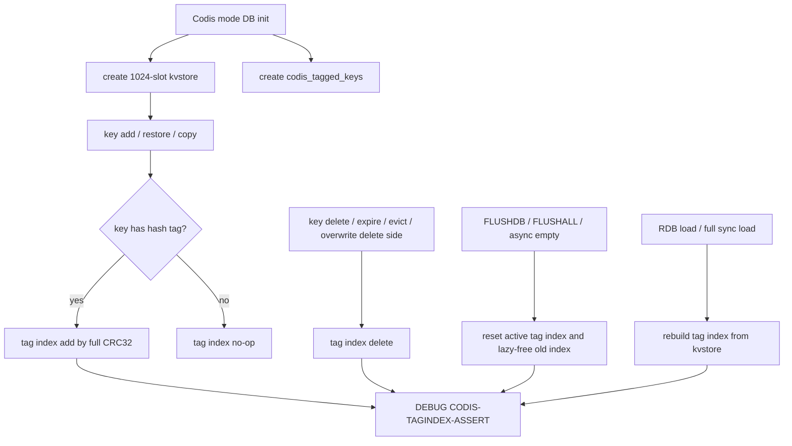

# redis8-slot-index-and-tag-index-core design

## 0. 术语约定

- **Codis slot keyspace core**：Redis 8 `codis-enabled yes` 下，以 `redisDb.keys` / `expires` 的 1024-slot `kvstore` 作为唯一 slot keyspace 权威来源，并提供后续 slot 命令可复用的 per-slot 访问/校验能力。
- **Codis tag index**：`redisDb.codis_tagged_keys`，仅服务 Codis tag migration。它记录带 `{...}` hash tag 的 key，按完整 CRC32 分组；slot id 仍是 `crc32 & 0x3ff`。
- **Tagged key**：key 中存在第一对 `{...}`，包括空 tag `{}`；该规则沿用 Codis CRC32 行为，不采用 Redis Cluster 对空 tag 的排除语义。
- **Full-load rebuild**：RDB 启动加载、replica 全量同步临时 DB 加载完成后，从 `kvstore` 主 keyspace 扫描重建 `codis_tagged_keys`，不把 tag index 持久化进 RDB。

防冲突结论：本 feature 不恢复 Redis 3 的 `hash_slots[1024]` 平行索引；`kvstore` 是 slot 维度主存储，`codis_tagged_keys` 只补足按 tag 批量迁移需要的辅助视图。

## 1. 决策与约束

### 需求摘要

本 feature 要把 Redis 8 Codis mode 从“能按 1024 slot 存 key、能做基础观察”推进到“key 生命周期具备后续 slot/migration 命令依赖的内部索引能力”：slot 维度继续由 `kvstore` 直接承载，tag 维度新增 `codis_tagged_keys` 并在增删、覆盖、过期、淘汰、flush、RDB/full sync load 后保持一致。

成功标准：

- Codis mode 下 `SLOTSINFO` 继续只从当前 DB 的 1024-slot `kvstore` 取 key count。
- 带 hash tag 的 key 在新增、删除、rename、move、copy、expire、evict、flush、RDB reload / replica full sync 后，tag index 与 `kvstore` 扫描结果一致。
- 不带 hash tag 的 key 不进入 tag index。
- 后续 `SLOTSMGRTTAGONE` / `SLOTSMGRTTAGSLOT` 可以按完整 CRC32 找到同一 tag 的 key 集合。

明确不做：

- 不新增 `dict *hash_slots[1024]` 或任何与 `kvstore` 平行的 slot key 索引。
- 不移植 `SLOTSSCAN`、`SLOTSDEL`、`SLOTSCHECK`、`SLOTSMGRT*`、`SLOTSRESTORE*` 业务命令。
- 不改变 `SLOTSHASHKEY` / `SLOTSINFO` 的 RESP 返回协议。
- 不改变 Go proxy/topom/admin，不切换默认 `codis-server` 构建目标。
- 不启用 Redis Cluster 协议，不引入 MOVED/ASK、cluster bus 或 cluster state。
- 不承诺 Redis 8 RDB/AOF 可降级回 Redis 3 Codis Server。

### 复杂度档位

走“底层 Redis key lifecycle”高兼容档位：

- Robustness = L3：tag index 是迁移命令的正确性前置，必须覆盖显式错误和边界生命周期。
- Performance = budgeted：每次 key 增删只允许做一次 hash/tag 解析和一次 skiplist 增删；full-load rebuild 是 O(N) 扫描。
- Testability = verified：内部 tag index 没有业务命令可直接观察，本 feature 允许新增测试专用 `DEBUG CODIS-TAGINDEX-ASSERT` 子命令做一致性断言；它不属于 Codis 对外业务协议。
- Compatibility = cross-version：默认 Redis 8 standalone 和 Redis Cluster 行为不变；Codis mode 保持 1024 slot 和多 DB。

### 关键决策

1. **slot index 继续只用 Redis 8 `kvstore`**。
   - 依据：roadmap 4.2 / 4.3 已明确“不维护 Redis 3 的 `hash_slots` 平行索引”。后续 slot scan/delete/check 应复用 per-slot `kvstore` API。

2. **tag index 只存带 hash tag 的 key，score 使用完整 CRC32**。
   - 依据：Redis 3 `tagged_keys` 用完整 CRC32 分组同一 tag；只用 1024 slot id 会把不同 tag 的 slot 碰撞混在一起。

3. **tag index 使用 helper 封装，不让生命周期调用点直接操作 skiplist**。
   - 依据：Redis 8 的 `zskiplist` 节点持有 embedded SDS，和 Redis 3 的 `robj*` skiplist 不同；集中封装能隔离内存所有权和删除语义。

4. **RDB / full sync 使用 full-load rebuild 作为权威修复点**。
   - 依据：RDB load 不持久化 tag index；replica 临时 DB 载入后也必须有完整 index，不能假设运行期增量 hook 自然补齐。

5. **测试用 DEBUG 断言，不提前暴露 slot/tag 业务命令**。
   - 依据：本阶段需要可验收的一致性证据，但 `SLOTSCHECK` 和迁移命令属于后续 roadmap item。

### 前置依赖

- `redis8-codis-mode-foundation` 已完成：`server.codis_enabled`、1024 slot `kvstore`、`codisHashSlot()`、`SLOTSHASHKEY` / `SLOTSINFO` 和 Tcl smoke test 已落地。

## 2. 名词与编排

### 2.1 名词层

#### Codis slot keyspace helper

现状：

- `extern/redis-8.6.3/src/db.c:getKeySlot()` / `calculateKeySlot()` 已在 Codis mode 下返回 `codisHashSlot()`。
- `extern/redis-8.6.3/src/slots.c:slotsinfoCommand()` 直接读取 `kvstoreDictSize(c->db->keys, slot)`。
- Redis 8 没有 Redis 3 的 `hash_slots[1024]`，这是预期现状。

变化：

- 新增内部 helper，把“slot 范围校验、当前 DB per-slot dict 访问、slot key count”集中到 Codis slot keyspace core。
- `SLOTSINFO` 继续使用这些 helper，但返回协议不变。
- 后续 `SLOTSSCAN` / `SLOTSDEL` / `SLOTSCHECK` 只需要挂到同一 helper，不重新发明 slot 索引。

接口示例：

```text
输入：codisSlotKeyCount(db0, 899)
输出：当前 DB 899 号 Codis slot 的 kvstore key count

输入：codisSlotKeyCount(db0, 1024)
输出：错误，slot 超出 0..1023
```

#### Codis tag hash 信息

现状：

- Redis 8 `codisHashSlot(key, keylen)` 只返回 `crc32(tag_or_key) & 0x3ff`。
- Redis 3 `slots_num()` 会同时给调用方完整 CRC32 和 `hastag`，用于维护 `tagged_keys`。

变化：

- 新增 tag/hash 解析 helper，返回 `slot`、完整 `crc32`、`has_tag` 三个结果。
- 空 tag `{}` 仍视为 `has_tag=1`，CRC32 输入为空串。
- 未带 tag 的 key 不进入 `codis_tagged_keys`，但仍按整 key 计算 slot。

接口示例：

```text
输入："{tag}:a"
输出：slot=899, crc32=<完整 CRC32>, has_tag=true

输入："alpha"
输出：slot=362, crc32=<完整 CRC32>, has_tag=false
```

#### Codis tag index

现状：

- `extern/redis-8.6.3/src/server.h:redisDb` 只有 `keys`、`expires`、`subexpires`、`stream_idmp_keys` 等状态，没有 tag index。
- Redis 3 `redisDb.tagged_keys` 是 zskiplist，`dbAdd()` 在 key 带 tag 时插入，`dbDelete()` 删除。

变化：

- `redisDb` 新增 `zskiplist *codis_tagged_keys`，仅 Codis mode 下初始化和维护。
- 节点 score 是完整 CRC32；节点元素是 key SDS 副本，由 skiplist 自己持有。
- helper 提供 add/delete/rebuild/assert，所有调用点只传 `redisDb*` 和 key SDS / robj。
- 非 Codis mode helper 直接 no-op，避免影响默认 Redis 8 standalone / cluster。

接口示例：

```text
触发：SET {tag}:a 1
结果：db->codis_tagged_keys 增加一个 score=crc32("tag")、element="{tag}:a" 的节点

触发：SET alpha 1
结果：slot keyspace 增加 alpha；tag index 不变
```

#### Full-load rebuild

现状：

- `extern/redis-8.6.3/src/rdb.c:rdbLoadRioWithLoadingCtx()` 通过 `dbAddRDBLoad()` 把 key 加进目标 `redisDb.keys`。
- `extern/redis-8.6.3/src/db.c:swapMainDbWithTempDb()` 会把 replica 临时 DB 的 `keys` / `expires` / `subexpires` 等结构换进主 DB。

变化：

- RDB load 成功后，对加载目标 DB array 执行 `codisTagIndexRebuild`，从 `kvstore` 扫描带 tag key 并重建 skiplist。
- replica full sync 使用 temp DB 时，重建发生在 temp DB 被作为新 keyspace 生效前后，但最终随 DB swap 一起进入 active DB。
- rebuild 先清空旧 index，再按 `kvstore` 扫描结果重建，重复执行结果稳定。

接口示例：

```text
触发：DEBUG RELOAD 后 DB 中有 {tag}:a / {tag}:b / alpha
结果：codis_tagged_keys 只包含 {tag}:a 和 {tag}:b，assert helper 返回 OK
```

### 2.2 编排层



现状：

- 普通 key 新增走 `dbAddInternal()`，RDB load 走 `dbAddRDBLoad()`，删除/过期/淘汰最终走 `dbGenericDelete()`。
- overwrite 走 `dbSetValue()`，key 名不变；rename/move/copy 的目标侧会重新 add，源/覆盖侧会 delete。
- `emptyDbStructure()` / `emptyDbAsync()` 会重建或清空 `keys`、`expires`、`subexpires`、`stream_idmp_keys`。

变化：

- DB 初始化、temp DB 初始化、async empty 重建路径同步创建/替换 `codis_tagged_keys`。
- key 新增侧在 `dbAddInternal()` 维护 tag index；覆盖同名 key 不改 index，但必须保持“一个 tagged key 只有一个 index 节点”的不变量。
- key 删除侧在 `dbGenericDelete()` 释放对象前移除 tag index；active expire 和 eviction 通过该路径自然覆盖。
- full-load 路径在 RDB load 成功后 rebuild，覆盖启动加载、AOF preamble RDB、replica full sync temp DB。
- 测试专用 DEBUG 断言扫描 `kvstore` 并和 `codis_tagged_keys` 对比，作为本阶段可观察验收面。

流程级约束：

- **错误语义**：Codis mode 未开启时，tag index helper no-op；测试 DEBUG 子命令返回明确的 codis mode disabled 或 OK no-op，不改变业务命令。
- **幂等性**：重复 rebuild 必须先 reset，再扫描重建；重复 delete 一个不存在的 tagged key 不应崩溃。
- **内存所有权**：tag index 节点持有 key SDS 副本，不持有 `robj*`，避免 Redis 8 `kvobj` reallocation / async free 破坏索引。
- **顺序约束**：删除 hook 必须发生在 key SDS 仍可读取时；async flush 必须先替换 active DB index，再把旧 index 交给 lazyfree 或同步释放。
- **兼容性**：Redis Cluster 的 `keyHashSlot()`、slot ownership、SFLUSH/cluster slot range 逻辑保持 cluster-only，不进入 Codis 1024 slot 语义。
- **可观测点**：`SLOTSINFO` 继续验证 slot count；`DEBUG CODIS-TAGINDEX-ASSERT` 验证 tag index 和 keyspace 一致。

### 2.3 挂载点清单

本 feature 不引入新的对外业务挂入点：不新增 Codis slot/migration command，不修改 Go parser，不新增配置项。

可卸载边界：

- 删除 `redisDb.codis_tagged_keys` 状态、Codis tag helper、lifecycle hook 和测试 DEBUG 子命令后，系统回到上一阶段 foundation 能力。
- 删除 slot keyspace helper 后，现有 `SLOTSINFO` 可退回直接读 `kvstoreDictSize`，但后续 slot command 不能复用本阶段抽出的核心能力。

### 2.4 推进策略

1. **tag/hash helper**：补齐能返回 slot、完整 CRC32、has_tag 的 Codis hash 信息接口。
   - 退出信号：`SLOTSHASHKEY` 结果不变，空 tag `{}` 和普通 key 的 helper 结果符合 foundation 测试。

2. **tag index 状态管理**：在 DB init/temp DB/empty/swap/lazyfree 路径接入 `codis_tagged_keys` 的创建、清空、交换和释放。
   - 退出信号：Codis mode 下空 DB、FLUSHDB、FLUSHALL、async flush 后 DEBUG tag assert 均为 OK。

3. **运行期 key 生命周期 hook**：在新增和删除主路径维护 tag index，并确认 overwrite 同名 key 不产生重复节点。
   - 退出信号：SET/DEL/UNLINK/RENAME/MOVE/COPY/overwrite/expire/evict 后 tag assert 均为 OK。

4. **full-load rebuild**：RDB load 和 replica full sync temp DB 载入完成后，从 `kvstore` 重建 tag index。
   - 退出信号：DEBUG RELOAD 或等价 RDB reload 后，tag assert 对带 tag / 不带 tag key 都通过。

5. **slot keyspace helper 收口**：把 `SLOTSINFO` 和后续命令需要的 per-slot count/dict 访问沉到 helper，保持 `kvstore` 是唯一 slot index。
   - 退出信号：`SLOTSINFO` 现有 Tcl 场景全部通过，diff 中没有新增 `hash_slots`。

6. **Tcl 覆盖与范围回归**：扩展 `tests/unit/codis.tcl`，覆盖 tag index 正常、边界、错误和 full-load 场景。
   - 退出信号：`./runtest --single unit/codis` 通过，且测试不依赖后续 `SLOTSSCAN` / `SLOTSDEL` / `SLOTSCHECK`。

7. **构建与反向核对**：运行 Redis 8 构建，grep 范围守护项。
   - 退出信号：`make codis-server-redis8` 通过，diff 不包含 Go 代码、默认构建切换、Redis Cluster 协议行为或 Redis 3 `hash_slots` 平行索引。

### 2.5 结构健康度与微重构

##### 评估

- compound convention：已检索 `.codestable/compound`，无目录组织 / 命名 / 归属相关命中。
- 文件级 — `extern/redis-8.6.3/src/server.h`：约 4523 行，上游大型头文件；本次只新增 `redisDb` 字段和少量 helper 声明，属于现有集中声明模式。
- 文件级 — `extern/redis-8.6.3/src/db.c`：约 3893 行，职责本来就是 key lifecycle；本次 hook 集中在 add/delete/empty/swap/load-adjacent 路径，不适合拆出行为重构。
- 文件级 — `extern/redis-8.6.3/src/slots.c`：约 68 行，是 Codis slot/helper 的当前承载点；新增 helper 和 DEBUG assert 后仍是单一 Codis slot-keyspace 职责。
- 文件级 — `extern/redis-8.6.3/src/rdb.c`：约 4496 行，上游加载流程集中在该文件；只挂 full-load rebuild 触发点，不重组。
- 文件级 — `extern/redis-8.6.3/src/lazyfree.c`：约 312 行；只需让 async DB free 带上旧 tag index，职责不混杂。
- 目录级 — `extern/redis-8.6.3/src/`：同层文件很多，但这是上游 Redis 源码布局；新增文件会扩大偏差，本次优先复用 `slots.c`。
- 目录级 — `extern/redis-8.6.3/tests/unit/`：已有 `codis.tcl`，继续扩展同一主题测试，不新增测试目录。

##### 结论：不做微重构

原因：改动必须贴近 Redis 8 上游 key lifecycle、RDB load 和 lazyfree 路径。拆分 `db.c` / `rdb.c` 或重组 `src/` 会显著增加后续 Redis patch 维护成本；本次只做小范围 hook 和 Codis helper 收口。

##### 超出范围的观察

- `extern/redis-8.6.3/src/db.c` 已经很大，但这是上游 Redis 的自然聚合。若后续 Codis helper 继续膨胀，应优先扩展 `slots.c` 或新增 Codis 专用文件，避免把迁移命令主体塞进 `db.c`。

## 3. 验收契约

### 关键场景清单

- 触发：执行 `make codis-server-redis8`。期望：Redis 8 Codis Server 构建通过。
- 触发：执行 `./runtest --single unit/codis`。期望：foundation 原有 Codis mode / `SLOTSHASHKEY` / `SLOTSINFO` 用例继续通过。
- 触发：Codis mode 下 `SET {tag}:a 1`、`SET {tag}:b 2`、`SET alpha 3` 后执行 `DEBUG CODIS-TAGINDEX-ASSERT`。期望：返回 OK，且 alpha 不被视为 tagged key。
- 触发：对同一个 `{tag}:a` 多次 `SET` 覆盖后执行 tag assert。期望：返回 OK，不出现重复 index 节点。
- 触发：`DEL` / `UNLINK` tagged key 后执行 tag assert。期望：已删除 key 不再出现在 tag index。
- 触发：给 tagged key 设置短 TTL，过期后触发访问或 active expire，再执行 tag assert。期望：过期 key 不再出现在 tag index。
- 触发：构造 maxmemory eviction 淘汰 tagged key 后执行 tag assert。期望：被淘汰 key 不再出现在 tag index。
- 触发：`RENAME` tagged key 到另一个 tagged key、`MOVE` tagged key 到其他 DB、`COPY ... REPLACE` 覆盖目标 key 后执行 tag assert。期望：源/目标 DB 的 tag index 都和各自 `kvstore` 一致。
- 触发：`FLUSHDB` / `FLUSHALL` / lazy user flush 后继续写入 tagged key，再执行 tag assert。期望：旧 key 不残留，新 key 可进入 tag index。
- 触发：`DEBUG RELOAD` 或等价 RDB reload 后执行 tag assert。期望：RDB 载入后的 tag index 由 `kvstore` 重建，和 keyspace 一致。
- 触发：`SLOTSINFO 899 1`。期望：返回格式和上一阶段一致，只反映当前 DB 的 slot key count，不读取 tag index。

### 明确不做的反向核对项

- Diff 不应新增 `hash_slots` 字段、数组或 `dictCreate(&hashSlotType...)` 路径。
- Diff 不应注册 `SLOTSSCAN`、`SLOTSDEL`、`SLOTSCHECK`、`SLOTSMGRT*`、`SLOTSRESTORE*` 业务命令。
- Diff 不应修改 Go `pkg/` 或 `cmd/` 代码。
- Diff 不应切换默认 `codis-server` / `make` 到 Redis 8。
- Diff 不应修改 Redis Cluster `keyHashSlot()` 的 CRC16/16384 语义。
- Diff 不应把 tag index 写入 RDB/AOF 持久化格式。

## 4. 与项目级架构文档的关系

acceptance 阶段需要回写 `.codestable/architecture/ARCHITECTURE.md`：Redis 8 Codis mode 已从 foundation 的 1024-slot `kvstore` 观察面推进到内部 slot/tag keyspace core，`kvstore` 是唯一 slot keyspace，`codis_tagged_keys` 是按完整 CRC32 维护的 tag migration 辅助索引；完整 slot 命令和迁移协议仍属于后续 roadmap item。
