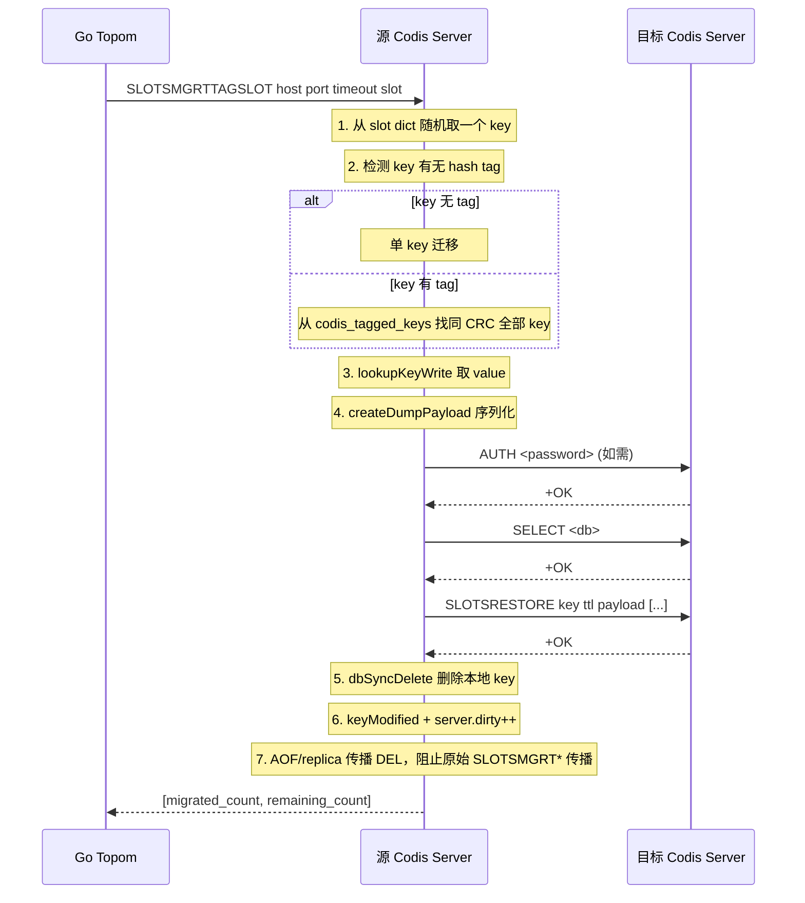

# redis8-sync-migration-and-rdb-fragments design

## 0. 术语约定

- **同步迁移（sync migration）**：在源 Codis Server 上执行，直接通过 TCP 连接目标 Codis Server，将 key 序列化为 RDB dump payload 后写入目标并等待应答，成功后本地删除 key。全程同步阻塞当前客户端。对应命令：`SLOTSMGRTSLOT`、`SLOTSMGRTONE`、`SLOTSMGRTTAGSLOT`、`SLOTSMGRTTAGONE`。
- **SLOTSRESTORE**：在目标 Codis Server 上执行，接收 RDB dump payload 并反序列化为 key-value 写入当前 DB。是同步迁移目标端唯一命令。
- **socket 缓存**：源 Codis Server 为迁移目标维护的长连接池，按 `host:port` 索引，缓存 AUTH / SELECT 状态。由 `serverCron` 定期清理空闲连接。
- **RDB fragment**：`SLOTSRESTORE` 接收的 payload 是 Redis RDB 格式的子集，包含可选 key metadata、object type byte、serialized value、RDB version 和 CRC64。与 `DUMP`/`RESTORE` 格式兼容，由 `createDumpPayload` 生成，由 `verifyDumpPayload` + `rdbLoadType` + `rdbResolveKeyType` + `rdbLoadObject` 消费，并通过 `KeyMetaSpec` / `dbAddInternal` 写入 Redis 8 的 metadata-aware keyspace。
- **异步迁移（async migration）**：使用 `slots_async.c` 的 batched iterator、chunked transfer、ACK 协议和 lazy release worker thread 的迁移流程。本 feature 不涉及。

防冲突结论：本 feature 的"同步迁移"指 Codis 的 `SLOTSMGRT*` 系列命令（非 Redis Cluster 的 `MIGRATE` 命令）；"slot" 固定是 Codis 1024 slot，不涉及 Redis Cluster 16384 slot。

## 1. 决策与约束

### 需求摘要

本 feature 将 Redis 3 Codis 的 5 个同步迁移命令和底层 socket 缓存基础设施移植到 Redis 8，并验证 Redis 8 RDB fragment encode/decode 与迁移协议的兼容性。受益者是 Codis topom/proxy 的 slot 迁移流程，要求迁移行为的 RESP 返回格式与现有 Go parser 完全兼容。

成功标准：

- `SLOTSMGRTSLOT host port timeout slot`：迁移 slot 中一个随机 key 到目标，返回 `[migrated_count, remaining_count]`
- `SLOTSMGRTONE host port timeout key`：迁移指定 key 到目标，返回 migrated_count（0 或 1）
- `SLOTSMGRTTAGSLOT host port timeout slot`：tag 感知版 slot 迁移，随机取一个 key，若该 key 有 hash tag 则一并迁移同 tag 全部 key
- `SLOTSMGRTTAGONE host port timeout key`：tag 感知版单 key 迁移，若该 key 有 hash tag 则一并迁移同 tag 全部 key
- `SLOTSRESTORE key ttlms serialized-value [key ttlms serialized-value ...]`：接收并写入多个 RDB dump payload
- 迁移 socket 缓存正常工作，空闲连接超时清理无泄漏
- `make codis-server-redis8` 编译通过；已有 codis.tcl 测试继续通过
- Redis 8 ↔ Redis 8 之间的 `SLOTSMGRT*` / `SLOTSRESTORE` 往返行为正确
- 成功迁移后，源端删除必须向 AOF/replica 传播为确定性的 `DEL key [key ...]`，不能传播原始 `SLOTSMGRT*` 命令
- 命令 metadata 必须符合 Redis 8 ACL/key-spec 语义：迁移命令归 `@dangerous`，`SLOTSRESTORE` 带 `DENYOOM` 和写 key specs

明确不做：

- 不移植 `slots_async.c` 全部内容（异步迁移、lazy release worker thread、batched iterator、ACK 协议）；归 `redis8-async-migration`
- 不移植 `SLOTSMGRT-EXEC-WRAPPER`（归异步迁移 feature）
- 不修改 Go `pkg/` / `cmd/` 代码
- 不切换默认 `make` / `codis-server` 到 Redis 8
- 不保证 Redis 3 ↔ Redis 8 跨版本 `SLOTSRESTORE` 双向兼容（作为灰度验证项，不在本 feature 工程实现范围）
- 不保证持久化 RDB/AOF 降级到 Redis 3

### 复杂度档位

走"对外 Redis 命令 / 生产兼容"默认档位，并有一处偏离：

- **改造已有代码 = 移植**：全部代码来自 Redis 3 `slots.c` 已有逻辑，按 Redis 8 API 适配，不引入新算法或新数据结构。偏离默认"新建"的原因：本 feature 本质是底层 Redis 代码移植，不是从零设计。

### 关键决策

1. **迁移代码放同一个 `slots.c` 文件**：Redis 3 将同步迁移命令写在 `slots.c`（与基础 slot 命令混在一起），异步迁移写在独立的 `slots_async.c`。Redis 8 目前 `slots.c`（364 行）只有基础 slot 命令和 tag index helper。本 feature 在同一个 `slots.c` 文件中追加同步迁移逻辑，后续 `redis8-async-migration` 新建 `slots_async.c`。

2. **socket 缓存复用 Redis 3 的 dict 方案，并补 Redis 8 上限约束**：Redis 3 用 socket cache dict 以 `host:port` sds 为 key 缓存 `slotsmgrt_sockfd` 结构体。Redis 8 字段命名为 `dict *slotsmgrt_cached_sockets`，仍然用 raw fd + syncWrite/syncReadLine 做同步 I/O（不走 connection 抽象层），保持简单和兼容。缓存设置最大条目数并按 `lasttime` 驱逐最旧连接，避免目标地址膨胀造成 fd 泄漏。

3. **`createDumpPayload` 适配新签名**：Redis 8 的 `createDumpPayload(rio *payload, robj *o, robj *key, int dbid, int skip_checksum)` 比 Redis 3 多了 key、dbid、skip_checksum 三个参数。同步迁移调用时传 `key, c->db->id, 0`（不跳过 checksum）。

4. **`SLOTSRESTORE` 命令的实现策略**：保持与 Redis 3 相同的 RESP 参数格式，但内部必须贴近 Redis 8 `RESTORE` 主路径：`verifyDumpPayload` → `KeyMetaSpec` 加 TTL → `rdbLoadType` → `rdbResolveKeyType` → `rdbLoadObject` → `dbAddInternal`。不能退回 Redis 3 的裸 `rdbLoadObjectType` + `dbAdd` 路径，否则会绕过 Redis 8 key metadata、hash field expire 和 stream IDMP 注册。

5. **slot key dict 访问改用 kvstore**：Redis 3 的 `c->db->hash_slots[slot]` 在 Redis 8 中改为 `kvstoreGetDict(c->db->keys, slot)`。

6. **key 删除路径与传播**：Redis 3 用 `dbDelete` + `signalModifiedKey` + `server.dirty++`，并通过改写 argv 传播 `DEL`。Redis 8 中改用 `dbSyncDelete`（同步删除，走 tag index cleanup hook）+ `keyModified(c, c->db, key, NULL, 1)` + `server.dirty++`；传播层使用 `alsoPropagate(... DEL ...)` + `preventCommandPropagation(c)`，只阻止原始 `SLOTSMGRT*` 传播，不改客户端入参和返回。

### 前置依赖

- `redis8-slot-basic-commands`（done）：基础 slot 命令、tag index、`codisHashInfoForKey`、`kvstore` slot 访问 helper 已就绪
- `redis8-codis-mode-foundation`（done）：1024 slot kvstore、codis_enabled 模式已就绪
- `redis8-slot-index-and-tag-index-core`（done）：tag index 生命周期维护（add/delete/rebuild）已就绪

## 2. 名词与编排

### 2.1 名词层

#### 2.1.1 迁移 socket 缓存

**现状**：Redis 8 `server.h` 中 `redisServer` 无迁移 socket 缓存字段，`client` 结构无 `slotsmgrt_flags`。

**变化**：

- `redisServer` 新增一个字段：`dict *slotsmgrt_cached_sockets`（key: `host:port` sds, value: `slotsmgrt_sockfd *`）
- 新增类型 `slotsmgrt_sockfd`（仅用于同步迁移 socket 缓存，不涉及 async client）

```c
// 来源：extern/redis-3.2.11/src/slots.c:148-153（适配 Redis 8）
typedef struct {
    int fd;
    int db;
    int authorized;
    time_t lasttime;
} slotsmgrt_sockfd;
```

- `redisServer` 不新增 `slotsmgrt_lazy_release`、`slotsmgrt_cached_clients` 字段（归 async migration）
- `client` 不新增 `slotsmgrt_flags`、`slotsmgrt_fenceq` 字段（归 async migration）

#### 2.1.2 迁移命令

**现状**：Redis 8 无任何 `SLOTSMGRT*` 或 `SLOTSRESTORE*` 命令注册。

**变化**：新增 5 个命令函数 + 5 个 command JSON 文件 + 1 个 socket 清理函数。

```c
// 核心迁移函数（slots.c 内部）
static slotsmgrt_sockfd *slotsmgrt_get_sockfd(client *c, sds host, int port, int timeout);
static void slotsmgrt_close_socket(sds host, int port);
void slotsmgrt_cleanup(void);                          // serverCron 调用
static int slotsmgrt(client *c, sds host, int port,    // 对目标执行 AUTH+SELECT+SLOTSRESTORE
                     slotsmgrt_sockfd *pfd, int db, int timeout,
                     robj *keys[], kvobj *vals[], int n);
static int slotsmgrtone_command(client *c, sds host, int port,
                                int timeout, robj *key); // 迁移单 key
static int slotsmgrttag_command(client *c, sds host, int port,
                                int timeout, robj *key); // tag 感知迁移

// 命令入口
void slotsmgrtslotCommand(client *c);    // SLOTSMGRTSLOT
void slotsmgrtoneCommand(client *c);     // SLOTSMGRTONE
void slotsmgrttagslotCommand(client *c); // SLOTSMGRTTAGSLOT
void slotsmgrttagoneCommand(client *c);  // SLOTSMGRTTAGONE
void slotsrestoreCommand(client *c);     // SLOTSRESTORE
```

**接口示例**：

```
SLOTSMGRTTAGONE host port timeout key
  输入: "127.0.0.1" "6380" "3000" "user:{tag1}:profile"
  输出: :1                    # migrated_count
  错误: -IOERR error or timeout...

SLOTSMGRTTAGSLOT host port timeout slot
  输入: "127.0.0.1" "6380" "3000" "42"
  输出: *2\r\n:3\r\n:0        # [migrated_count, remaining_count]
  错误: -IOERR error or timeout...

SLOTSRESTORE key1 10000 <payload1> key2 0 <payload2>
  输入: "mykey" "10000" "\x00\x05..." "otherkey" "0" "\x00\x03..."
  输出: +OK
  错误: -ERR dump payload version or checksum are wrong
```

来源：`extern/redis-3.2.11/src/slots.c:415-822`

#### 2.1.3 RDB fragment 函数适配

**现状**：Redis 8 的 `createDumpPayload`、`verifyDumpPayload`、`rdbLoadObject` 签名已变。

**变化**：调用处适配新签名。

```c
// createDumpPayload — Redis 3 → Redis 8 适配
// 旧: createDumpPayload(&pld, val);
// 新: createDumpPayload(&pld, val, key, c->db->id, 0);
//     ↑ 多传 key/dbid（module metadata）和 skip_checksum=0

// verifyDumpPayload — Redis 3 → Redis 8 适配
// 旧: verifyDumpPayload(val->ptr, sdslen(val->ptr))
// 新: verifyDumpPayload(val->ptr, sdslen(val->ptr), NULL)
//     ↑ 多传 rdbver_ptr=NULL（不需要版本号）

// rdbLoadObject — Redis 3 → Redis 8 metadata-aware 适配
// 旧: rdbLoadObjectType(&payload) + rdbLoadObject(type, &payload)
// 新: rdbLoadType(&payload)
//     rdbResolveKeyType(&payload, &type, c->db->id, &keymeta)
//     rdbLoadObject(type, &payload, key->ptr, c->db->id, &error)
//     dbAddInternal(c->db, key, &val, NULL, &keymeta)
//     ↑ 支持 RDB_OPCODE_KEY_META、TTL metadata、module metadata、HFE/stream IDMP 后置注册
```

来源：`extern/redis-8.6.3/src/cluster.c` 的 `restoreCommand` / `createDumpPayload`，`extern/redis-8.6.3/src/rdb.h` 的 `rdbLoadType` / `rdbResolveKeyType` / `rdbLoadObject`，`extern/redis-8.6.3/src/db.c` 的 `dbAddInternal`

### 2.2 编排层

#### 主流程图



#### 现状

Redis 8 的 `slots.c`（364 行）只包含基础 slot 命令（slothashkey、slotsinfo、slotsscan、slotsdel、slotscheck）和 tag index helper（codisTagIndexCreate/Free/Reset/Add/Delete/Rebuild/Assert）。无任何迁移逻辑。

Redis 3 的同步迁移编排是一个线性 RPC 流程：

1. 建立/复用目标连接（`slotsmgrt_get_sockfd`） — TCP connect + `AE_WRITABLE` wait
2. 如果需要，发送 AUTH + SELECT
3. 对每个待迁移 key：`lookupKeyWrite` → `createDumpPayload` → 拼 RESP `SLOTSRESTORE`
4. 同步写入目标连接（`syncWrite`）
5. 同步读取应答（`syncReadLine`）：校验 AUTH/SELECT/SLOTSRESTORE 三级响应
6. 本地删除已迁移的 key（`dbDelete` + `signalModifiedKey`）
7. 给迁移发起方返回 `[migrated_count, remaining_count]`

辅助流程：`serverCron` 每周期调用 `slotsmgrt_cleanup()` 清理超过 15 秒未使用的空闲连接。

#### 变化

编排不变，全部逻辑从 Redis 3 `slots.c` 搬过来，只做 API 适配（见 2.1.3）。具体适配点：

- **slot dict 访问**：`c->db->hash_slots[slot]` → `kvstoreGetDict(c->db->keys, slot)`
- **随机 key 选取**：`dictGetRandomKey(d)` 保持不变（操作的是具体 slot dict）
- **key 删除**：`dbDelete` + `signalModifiedKey` → `dbSyncDelete` + `keyModified(c, c->db, key, NULL, 1)`
- **SLOTSMGRTTAGONE 中的 tag key 查找**：`zslFirstInRange(c->db->tagged_keys, &range)` 保持不变，但 Redis 8 中字段名是 `codis_tagged_keys`
- **迁移命令的 DEL 传播技巧**：`slotsremove` 的 `rewrite=1` 路径在 `slotsmgrtone_command` 和 `slotsmgrttag_command` 中使用。Redis 8 实现不直接替换 `c->argv`，而是用 `alsoPropagate(c->db->id, ["DEL", key...], ...)` 传播确定性删除，再用 `preventCommandPropagation(c)` 阻止原始 `SLOTSMGRT*` 被 AOF/replica 重放。

#### 流程级约束

- **错误语义**：任何一步 I/O 失败（connect/write/read 超时或断开）→ 关闭该 socket 缓存条目 → 返回 `-IOERR` error reply → 不删除本地 key（即不丢数据）
- **幂等性**：`SLOTSRESTORE` 在目标端先 `dbDelete` 已有 key 再 `dbAdd`（覆盖语义），迁移重试不会残留脏数据
- **并发**：同步迁移阻塞当前客户端、持有 GIL，无并发问题。socket 缓存操作在 GIL 内，无需额外锁
- **顺序**：迁移过程中不处理其他客户端请求（GIL 保证）
- **扩展点**：`slotsmgrt_get_sockfd` 是 socket 获取的统一入口，后续 ACL/AUTH2 扩展在此增加授权逻辑
- **可观测点**：IO 错误和连接建立均有 `serverLog(LL_WARNING, ...)` 日志
- **命令安全元数据**：`SLOTSRESTORE` 标记 `WRITE|DENYOOM`、`@keyspace|@dangerous` 和 `OW|UPDATE` key specs；`SLOTSMGRTONE` / `SLOTSMGRTTAGONE` 标记显式 key 的 `RW|ACCESS|DELETE` key specs；slot 随机迁移命令无显式 key，但标记 `NONDETERMINISTIC_OUTPUT` 和 `@dangerous`
- **端口解析**：命令 JSON 中 `port` 标记为 integer；C 入口仍必须用 `getRangeLongFromObjectOrReply(..., 0, 65535, ...)` 显式解析，不能用 `atoi`

### 2.3 挂载点清单

- `extern/redis-8.6.3/src/server.h` — 新增 `slotsmgrt_sockfd` typedef 和 `redisServer.slotsmgrt_cached_sockets` 字段
- `extern/redis-8.6.3/src/server.c` 初始化 — `server.slotsmgrt_cached_sockets = dictCreate(...)` 和 `serverCron` 中的 `slotsmgrt_cleanup()` 调用
- `extern/redis-8.6.3/src/commands.def` — 注册 5 个新命令（通过 JSON → commands.def 生成）
- `extern/redis-8.6.3/src/commands/*.json` — 5 个新命令的 JSON 定义文件
- `extern/redis-8.6.3/src/Makefile`（或命令生成脚本）— 确保新 JSON 被 commands.def 生成流程覆盖

### 2.4 推进策略

1. **编排骨架**：在 `slots.c` 中加入空实现的 5 个命令函数 + socket 缓存初始化/清理，注册命令，编译通过
   退出信号：`make codis-server-redis8` 编译成功，命令表有 5 个新命令

2. **socket 缓存层**：实现 `slotsmgrt_get_sockfd` / `slotsmgrt_close_socket` / `slotsmgrt_cleanup`
   退出信号：写入 `SLOTSRESTORE` 骨架能建立连接并完成 AUTH/SELECT 往返

3. **计算节点：SLOTSRESTORE**：实现完整 `slotsrestoreCommand`（RDB 反序列化 + key 写入）
   退出信号：能通过 `redis-cli` 发送 `SLOTSRESTORE` 写入 key

4. **计算节点：slotsmgrt 内核**：实现 `slotsmgrt`（createDumpPayload + 写目标 + 读应答）
   退出信号：能通过 `redis-cli` 发送 `SLOTSMGRTONE` 迁移单个 key

5. **计算节点：tag 感知 + slot 随机**：实现 `slotsmgrttag_command` + `slotsmgrtslotCommand` + `slotsmgrttagslotCommand`
   退出信号：带 hash tag 的 key 能和同 tag key 一起迁移

6. **测试覆盖**：补齐 Tcl 测试覆盖正常路径、边界值（空 slot、不存在的 key、超时）和错误路径
   退出信号：所有验收场景都有可观察证据，已有 codis.tcl 无回归

### 2.5 结构健康度与微重构

#### 评估

- **文件级 — `extern/redis-8.6.3/src/slots.c`**：当前 364 行，职责是基础 slot 命令 + tag index helper。本 feature 预计新增约 400 行迁移逻辑（同步迁移 5 个命令 + socket 缓存），合并后约 750 行——仍在合理范围。文件职责为"Codis slot 命令与迁移"，迁移逻辑是 slot 命令的自然延伸。改动密度：4 处独立逻辑块（socket 缓存、slotsmgrt 内核、slotsrestore、4 个迁移命令入口），每块之间边界清晰。

- **文件级 — `extern/redis-8.6.3/src/server.h`**：当前约 4600 行，本 feature 需要新增 1 个 typedef（~8 行）和 1 个 redisServer 字段（1 行），改动量微不足道。

- **文件级 — `extern/redis-8.6.3/src/server.c`**：需要在 `initServer()` 中加 1 行 dict 初始化，在 `serverCron()` 中加 1 行 `slotsmgrt_cleanup()` 调用。改动量微不足道。

- **目录级 — `extern/redis-8.6.3/src/commands/`**：现有 500+ JSON 文件。需新增 5 个 JSON 文件，与已有 slot 命令 JSON 格式一致。不触发重组阈值。

#### 结论：不做微重构

文件尺寸、职责边界和改动密度均在健康范围内，无需拆文件或重组目录。

## 3. 验收契约

### 关键场景清单

**正常路径**：

1. `SLOTSMGRTONE` 单 key 迁移：源端 key 存在 → 源端 `SLOTSMGRTONE` 返回 `:1` → 源端 key 被删除 → 目标端 key 存在且 value 一致（含 TTL）
2. `SLOTSMGRTSLOT` 随机迁移：非空 slot → 返回 `[1, N-1]` → 源端 slot key count 减 1 → 目标端对应 key 存在
3. `SLOTSMGRTTAGONE` tag 迁移：key 含 `{tag}` 且 slot 内还有同 tag 的 n 个 key → 返回 `:n` → 源端同 tag 全部 key 消失 → 目标端全部恢复
4. `SLOTSMGRTTAGSLOT` tag slot 迁移：slot 中有 key → tag 感知随机迁移 → 返回 `[migrated, remaining]`
5. `SLOTSRESTORE` 单 key：`SLOTSRESTORE key 0 <valid_payload>` → `+OK` → key 可读、value 正确
6. `SLOTSRESTORE` 多 key：一次传 3 个 key → `+OK` → 3 个 key 均可读
7. 从空 slot 执行 `SLOTSMGRTSLOT` → 返回 `[0, 0]`
8. 对不存在的 key 执行 `SLOTSMGRTONE` → 返回 `:0`
9. socket 缓存复用：连续两次 `SLOTSMGRTONE` 到同一目标 → 不重新建立连接（通过日志观察）
10. 空闲 socket 超时清理：建立连接后等待 > 15 秒不发送命令 → serverCron 清理 → 下次迁移重新建立连接

**关键边界**：

11. key 带 TTL → 迁移后目标端 TTL 接近原值（允许传输延迟偏差）
12. key 类型为 string/list/hash/set/zset → 迁移后类型和值一致
13. `SELECT` 不同 DB 的迁移 → 操作只在当前 DB，不跨 DB 影响
14. `SLOTSRESTORE` 覆盖已有 key → 旧值被替换，新值生效
15. `SLOTSMGRTONE` 成功迁移 → replication stream 看到 `DEL key`，看不到可重放副作用的原始 `SLOTSMGRTONE`
16. `SLOTSRESTORE` 恢复 stream 类型 → stream entry 可读，Redis 8 stream metadata 注册不丢失

**关键错误路径**：

17. 目标不可达 → 返回 `-IOERR error or timeout connecting to the client`
18. 目标密码错误 → 返回 `-ERR error on slotsrestore, auth failed`
19. 无效 RDB payload → `SLOTSRESTORE` 返回 `-ERR dump payload version or checksum are wrong`
20. 错误的 ttl 值 → `SLOTSRESTORE` 返回 `-ERR invalid ttl value, must be >= 0`

### 明确不做的反向核对项

- 代码中不应出现对 `extern/redis-8.6.3/src/slots_async.c` 内容的引用（pthread、lazy release worker、batchedObjectIterator、CLIENT_SLOTSMGRT_ASYNC_*）
- 不应在 `redisServer` 中新增 `slotsmgrt_lazy_release`、`slotsmgrt_cached_clients` 字段
- 不应在 `client` 中新增 `slotsmgrt_flags`、`slotsmgrt_fenceq` 字段
- 不应出现 `SLOTSMGRT-EXEC-WRAPPER`、`SLOTSMGRT-ASYNC-FENCE`、`SLOTSMGRT-ASYNC-CANCEL`、`SLOTSMGRT-ASYNC-STATUS`、`SLOTSRESTORE-ASYNC*` 命令注册
- Go `pkg/` 代码不变

## 4. 与项目级架构文档的关系

本 feature 是 Redis 8 Codis Server 迁移能力的核心落地步骤。acceptance 后需回写：

- **名词** ← `slotsmgrt_sockfd` 类型和 `redisServer.slotsmgrt_cached_sockets` 字段，写入 ARCHITECTURE.md 第 5 节"代码锚点"
- **动词骨架** ← 迁移流程的 Redis 侧 RPC 模式（`SLOTSMGRTTAGONE` → socket 缓存 → `SLOTSRESTORE`），更新 ARCHITECTURE.md 第 2 节迁移描述
- **流程级约束** ← 同步迁移的 I/O 错误语义（不丢数据），更新 ARCHITECTURE.md 第 6 节"已知约束"

关联已有架构 doc：`ARCHITECTURE.md`（系统整体结构、代码锚点、迁移协议描述）
