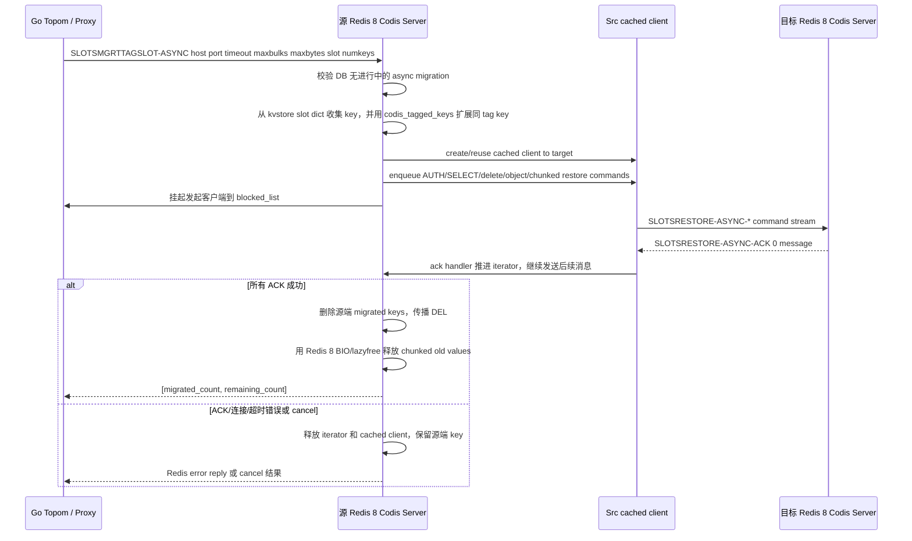

# redis8-async-migration design

## 0. 术语约定

- **异步迁移（async migration）**：源 Codis Server 建立一个连接到目标 Codis Server 的 cached client，把迁移数据作为 Redis 命令流写到目标。发起命令的客户端会被挂到 fence 队列，等目标端逐条 ACK 后再收到最终结果。
- **cached migration client**：源端内部创建的 `client`，fd 连接到目标 Redis。源端通过 `addReply*` 把 `SLOTSRESTORE-ASYNC*` 命令写入它的 output buffer，目标端回包再被源端解析成 `SLOTSRESTORE-ASYNC-ACK` 命令。
- **restore async**：目标端执行的 `SLOTSRESTORE-ASYNC` 子协议，包含 `delete`、`expire`、`string`、`object`、`list`、`hash`、`dict`、`zset` 等子命令，并用 `SLOTSRESTORE-ASYNC-ACK errno message` 回源端。
- **fence**：`SLOTSMGRT-ASYNC-FENCE` 等待当前 DB 的异步迁移完成。它不是分布式锁，只是源 Redis 进程内的迁移完成屏障。
- **exec wrapper**：`SLOTSMGRT-EXEC-WRAPPER hashkey command ...` 在 key 正被异步迁移时阻止写命令，避免 proxy 半异步迁移期间把写入打到正在搬走的 key 上。
- **lazy release**：旧 Redis 3 `slots_async.c` 用自建 pthread 延迟释放 chunked 迁移中的大对象。Redis 8 已有 `BIO_LAZY_FREE` / lazyfree，本 feature 不再新增平行 pthread。

防冲突结论：本 feature 的 async 只指 Codis `SLOTSMGRT*-ASYNC` / `SLOTSRESTORE-ASYNC*` 协议，不是 Redis Cluster 的 `CLUSTER MIGRATION`，不改变 Redis Cluster 16384 slot，也不接入 cluster bus。

## 1. 决策与约束

### 需求摘要

本 feature 把 Redis 3 Codis 的异步迁移协议移植到 Redis 8 Codis Server。它接在已完成的 Redis 8 Codis mode、基础 slot 命令、tag index、同步迁移和 `SLOTSRESTORE` 之后，目标是让 Redis 8 支线具备现有 topom/proxy 可调用的半异步迁移能力。

成功标准：

- `SLOTSMGRTSLOT-ASYNC host port timeout maxbulks maxbytes slot numkeys`：异步迁移 slot 中一批 key，最终返回 `[migrated_count, remaining_count]`
- `SLOTSMGRTTAGSLOT-ASYNC host port timeout maxbulks maxbytes slot numkeys`：tag 感知版 slot 异步迁移，最终返回 `[migrated_count, remaining_count]`
- `SLOTSMGRTONE-ASYNC host port timeout maxbulks maxbytes key [key ...]`：异步迁移显式 key 列表，最终返回 migrated_count
- `SLOTSMGRTTAGONE-ASYNC host port timeout maxbulks maxbytes key [key ...]`：tag 感知版显式 key 异步迁移
- `SLOTSMGRTONE-ASYNC-DUMP timeout maxbulks key [key ...]` / `SLOTSMGRTTAGONE-ASYNC-DUMP ...`：只生成 restore async 命令流，不连接目标
- `SLOTSMGRT-ASYNC-FENCE`、`SLOTSMGRT-ASYNC-CANCEL`、`SLOTSMGRT-ASYNC-STATUS`：等待、取消、观测当前 DB 的异步迁移状态
- `SLOTSMGRT-EXEC-WRAPPER hashkey command [arg ...]`：key 正在迁移时阻止写命令；未迁移时执行包装命令
- `SLOTSRESTORE-ASYNC` / `SLOTSRESTORE-ASYNC-AUTH` / `SLOTSRESTORE-ASYNC-AUTH2` / `SLOTSRESTORE-ASYNC-SELECT` / `SLOTSRESTORE-ASYNC-ACK`：目标端 restore async 子协议、ACL 认证、DB 选择和 ACK 闭环
- 任一网络、ACK、AUTH、SELECT 或 restore 错误都不能删除源端 key；成功完成后源端删除传播为确定性的 `DEL`
- `make codis-server-redis8` 编译通过；Redis Tcl 覆盖正常、边界、错误和取消路径

明确不做：

- 不修改 Go `pkg/` / `cmd/` 代码，不调整 topom/proxy 的迁移状态机
- 不切换默认 `make` / `codis-server` 到 Redis 8
- 不实现 Redis Cluster 协议，不新增 MOVED/ASK、cluster bus 或 Redis Cluster slot 状态
- 不恢复 Redis 3 的 `hash_slots[1024]` 平行索引
- 不承诺 Redis 3 ↔ Redis 8 的异步迁移协议跨版本互通；灰度跨版本验证留给 cutover
- 不给 stream、module、Redis 8 HFE 等新能力设计 chunked 子协议；这些类型默认走 `object` RDB payload 路径，不能用旧 `hash/list/zset` chunked 协议静默丢 metadata
- 不新增自建 lazy release pthread，也不新增 `redisServer.slotsmgrt_lazy_release`

### 复杂度档位

走“对外 Redis 命令 / 生产兼容 / 异步状态机”高兼容档位：

- Robustness = L3：所有外部命令参数、ACK 错误、连接关闭、超时和取消路径都要有明确处理。
- Performance = budgeted：`maxbulks` / `maxbytes` 控制单轮发送量，避免 cached client output buffer 无界增长。
- Testability = verified：除命令输出外，必须覆盖源端 key 保留/删除、fence、cancel、status、ACK 错误和 DEL propagation。
- Compatibility = cross-version：命令名、参数顺序、返回结构对齐 Redis 3 Codis 协议，同时适配 Redis 8 `kvstore` / `kvobj` / ACL / lazyfree。
- Concurrency = single-threaded state machine + Redis BIO：迁移状态在 Redis 主线程内推进；释放大对象复用 Redis 8 BIO，不引入新的线程模型。

### 关键决策

1. **继续使用 `slots_async.c` 承载异步迁移**。
   - 依据：Redis 3 async 协议本来就是独立文件；Redis 8 build harness 已链接 `slots_async.o`。把 async 塞回 `slots.c` 会让同步迁移和异步状态机混在一起，后续 patch 对齐更差。

2. **按 DB 维护 cached migration client**。
   - 依据：旧协议的 fence/cancel/status 都是当前 DB 语义；`SELECT` 后迁移必须隔离。Redis 8 中保留 `redisServer.slotsmgrt_cached_clients[dbid]`，每个 DB 同时最多一个异步迁移。

3. **slot 来源只用 Redis 8 `kvstore`，tag 扩展只用 `codis_tagged_keys`**。
   - 依据：roadmap 4.2/4.3 和 compound learning 已明确不恢复 `hash_slots`。slot 迁移从 `kvstoreGetDict(c->db->keys, slot)` / `kvstoreScan(..., onlydidx=slot, ...)` 取 key，tag-aware 迁移用 `codisHashInfoForKey` + `redisDb.codis_tagged_keys` 找同完整 CRC32 的 key。

4. **restore async 的写入路径必须是 Redis 8 metadata-safe**。
   - 依据：同步 `SLOTSRESTORE` 已走 `verifyDumpPayload`、`rdbLoadType`、`rdbResolveKeyType`、`rdbLoadObject`、`dbAddInternal`。异步 `object` 路径必须复用同等语义；`string/list/hash/dict/zset` chunked 子命令也不能绕过 keyModified、dirty、expire、subexpires、stream IDMP 和 slot alloc accounting。

5. **旧 chunked 协议只覆盖能安全拆分的 legacy 类型**。
   - 依据：Redis 8 增加 stream、listpack-ex hash field expire、module metadata 等状态。旧 `hash/list/zset/dict` 子协议无法表达这些 metadata。遇到无法安全 chunk 的对象，走 `object` RDB payload；如果 payload 触发输出 buffer 风险，返回错误并保留源端 key，而不是迁移一个丢 metadata 的半成品。

6. **lazy release 改接 Redis 8 BIO/lazyfree**。
   - 依据：Redis 8 已有 `lazyfreeFreeObject`、`bioCreateLazyFreeJob` 和 lazyfree pending stats。新增 Codis 专用 pthread 会绕开 Redis 8 的资源统计和调度，还会和 jemalloc thread cache 竞争。实现层需要一个很小的 helper 把可异步释放的大对象交给 `BIO_LAZY_FREE`，而不是新增 `slotsmgrt_lazy_release` worker。

7. **AUTH 保持现有 `AUTH password` 兼容，同时补 `AUTH2 username password` 目标端入口**。
   - 依据：Redis 8 有 ACL。现有 Codis 配置只提供密码，源端仍默认发送 `SLOTSRESTORE-ASYNC-AUTH password`；目标端增加 `SLOTSRESTORE-ASYNC-AUTH2` 是为了支持 Redis 8 ACL 语义和 roadmap 4.6 契约。选择非 default 用户的配置/Go 适配不在本 feature 内。

8. **命令注册以 Redis 8 command JSON 为源**。
   - 依据：Redis 8 `commands.def` 是生成产物。新增 async 命令必须一命令一 JSON，并通过 `generate-command-code.py` 生成 `commands.def`。

### 前置依赖

- `redis8-slot-basic-commands` 已完成：`kvstore` per-slot scan/delete/check 和 `codisTagIndexAssert` 可用。
- `redis8-sync-migration-and-rdb-fragments` 已完成：同步迁移、`SLOTSRESTORE`、Redis 8 RDB fragment 和 `slotsmgrt_sockfd` socket 缓存已可参考。
- `redis8-slot-index-and-tag-index-core` 已完成：`codisHashInfoForKey` 和 `redisDb.codis_tagged_keys` 生命周期已就绪。

## 2. 名词与编排

### 2.1 名词层

#### async migration 状态

现状：

- `extern/redis-8.6.3/src/slots_async.c` 只有 4 行 build harness marker。
- `extern/redis-8.6.3/src/server.h` 已有同步迁移的 `slotsmgrt_sockfd` 和 `redisServer.slotsmgrt_cached_sockets`，但没有 async cached client、client fence 字段或 async 命令声明。
- `extern/redis-8.6.3/src/networking.c` 没有 async migration client 生命周期 hook。

变化：

```c
typedef struct slotsmgrtAsyncClient {
    client *c;                  /* 连接到目标 Redis 的 cached client */
    int used;                   /* 是否已经发送 AUTH/SELECT 前导命令 */
    sds host;
    int port;
    long long timeout;
    long long lastuse;
    long sending_msgs;          /* 等待 ACK 的消息数 */
    batchedObjectIterator *batched_iter;
    list *blocked_list;         /* 等待迁移完成的发起方/fence 客户端 */
} slotsmgrtAsyncClient;

/* redisServer */
slotsmgrtAsyncClient *slotsmgrt_cached_clients;

/* client */
long slotsmgrt_flags;
list *slotsmgrt_fenceq;
```

约束：

- `slotsmgrt_cached_clients` 长度等于 `server.dbnum`。
- `CLIENT_SLOTSMGRT_ASYNC_CACHED_CLIENT` 只标记内部 cached client；`CLIENT_SLOTSMGRT_ASYNC_NORMAL_CLIENT` 只标记被 fence 队列挂起的普通客户端。
- `client` 释放时必须先从 async 状态机 unlink，避免队列保存悬空指针。
- 不新增 `slotsmgrt_lazy_release` 字段。

#### batched object iterator

现状：

- Redis 3 `batchedObjectIterator` 依赖 `dict *hash_slot`、`redisDb.tagged_keys`、`robj *val` 和旧对象编码。
- Redis 8 当前 slot 主存储是 `kvstore`，`lookupKeyWrite` 返回 `kvobj *`，tag index 名为 `codis_tagged_keys`。

变化：

- iterator 的 key 收集从 `hash_slot` 改为 `kvstore` per-slot dict。
- tag-aware 扩展从 `codis_tagged_keys` 取完整 CRC32 相同的 tagged key。
- value 引用以 Redis 8 `kvobj` / `robj` 当前 API 为准，必须在生成命令和迁移完成删除之间保持引用安全。
- `estimate_msgs` 继续按对象拆分估算，但对 Redis 8 metadata 不可拆分对象返回 1，并走 `object` payload。

接口示例：

```text
输入：slot=899, numkeys=100, usetag=true
输出：iterator 中包含 899 号 slot 的若干 key；若 key 带 {tag}，同 CRC32 tag key 一并进入 iterator
约束：不扫描全 DB 后过滤，不读取 hash_slots
```

#### async 命令接口

现状：

- Redis 8 已注册同步 `SLOTSMGRT*` 和 `SLOTSRESTORE`，没有任何 `*-ASYNC` command JSON。
- Redis 3 command table 中 async 命令位于 `server.c` 静态数组，不能直接照搬到 Redis 8。

变化：

新增命令注册和命令函数：

```text
SLOTSMGRTSLOT-ASYNC host port timeout maxbulks maxbytes slot numkeys
-> [migrated_count, remaining_count]   # 完成时回复发起客户端

SLOTSMGRTONE-ASYNC host port timeout maxbulks maxbytes key [key ...]
-> migrated_count

SLOTSMGRT-ASYNC-FENCE
-> OK 或等待当前 DB 迁移完成后返回 OK

SLOTSMGRT-ASYNC-CANCEL
-> 0|1

SLOTSMGRT-ASYNC-STATUS
-> null 或 key/value 数组形式的状态快照

SLOTSMGRT-EXEC-WRAPPER hashkey command [arg ...]
-> [0, error] key 不存在
-> [1, error] key 正在迁移且命令为写
-> [2, <wrapped command reply>] 正常执行

SLOTSRESTORE-ASYNC <subcmd> ...
-> ["SLOTSRESTORE-ASYNC-ACK", errno, message]
```

`SLOTSRESTORE-ASYNC-AUTH2 username password` 作为 Redis 8 目标端新增入口；源端是否发送 AUTH2 取决于后续是否有配置提供 username。

#### lazy release

现状：

- Redis 3 在 `slots_async.c` 内创建 `lazyReleaseWorker` pthread，迁移完成后把 chunked 大对象放进这个私有队列。
- Redis 8 已有 `BIO_LAZY_FREE` 和 lazyfree stats；`emptyDbDataAsync`、`dbAsyncDelete` 等路径都使用它。

变化：

- 删除 Redis 3 私有 worker 的移植计划。
- 新增或复用一个 Redis 8 内部 helper，把可安全异步释放的对象提交到 `BIO_LAZY_FREE`。
- async 迁移完成后释放 `chunked_vals` 时，遵守 Redis 8 refcount 和 lazyfree free-effort 规则；不能让后台线程访问已经被主线程释放的 `kvobj` key 指针。

### 2.2 编排层



#### 现状

- Redis 8 同步迁移已实现 `SLOTSMGRT* -> AUTH/SELECT -> SLOTSRESTORE -> dbSyncDelete -> DEL propagation`，但这条路径阻塞当前客户端。
- Redis 8 `slots_async.c` 尚无真实逻辑，`serverCron` 只清理同步迁移 socket cache。
- Redis 8 的 output buffer、ACL、client free 和 lazyfree 路径均比 Redis 3 更复杂，不能机械复制旧 hook。

#### 变化

- 源端 async 命令先做 arity、codis mode、port、timeout、maxbulks、maxbytes、slot/numkeys 校验。
- 当前 DB 已有 async migration 时，新迁移命令返回 `the specified DB is being migrated`；`FENCE` 可以等待，`CANCEL` 可以中断。
- cached client 创建后先进入目标 DB；首次使用时按需发送 `SLOTSRESTORE-ASYNC-AUTH` / `AUTH2` 和 `SLOTSRESTORE-ASYNC-SELECT`。
- iterator 逐步把 key 转为 restore async 命令流；`maxbytes` 按 cached client output buffer 使用量限流。
- 目标端每个子命令只返回 ACK，不返回普通 `OK`；ACK 错误会关闭连接并让源端保留 key。
- 只有全部 ACK 成功后，源端才批量删除 `removed_keys`，传播 `DEL key ...`，并阻止原始 async command 被 AOF/replica 重放。
- `SLOTSMGRT-EXEC-WRAPPER` 只在 key 命中当前 DB async iterator 且被包装命令是写命令时阻断；读命令保持可执行。

#### 流程级约束

- **错误语义**：connect、write、read、AUTH、SELECT、restore 子命令、ACK、timeout、client close 任一失败，当前批次都视为未完成；源端 key 不删除。
- **幂等性**：发送对象内容前先发送 `SLOTSRESTORE-ASYNC delete key`。失败后重试可以清理目标端半写入数据。
- **当前 DB**：async client、fence、cancel、status 均按 `c->db->id` 隔离；`SELECT` 后迁移只作用于当前 DB。
- **并发**：同一 DB 同时只允许一个 async migration；不同 DB 可以各自持有 cached client。
- **输出 buffer**：cached migration client 不应被普通客户端 output buffer limit 误杀，但单轮发送必须受 `maxbytes` 和 normal client limit 上限约束。
- **ACL**：`AUTH password` 保持默认用户兼容；`AUTH2 username password` 只提供 Redis 8 ACL 入口，不隐式新增 Go 配置。
- **可观测点**：连接创建/释放、ACK 错误、timeout、cancel、status 关键字段必须有日志或命令输出可定位。
- **数据安全**：chunked 子协议不能丢 Redis 8 metadata；无法安全拆分的对象必须走 `object` payload 或失败保源。

### 2.3 挂载点清单

- `extern/redis-8.6.3/src/slots_async.c`：从 build marker 扩展为 async migration、restore async、ACK、fence/cancel/status 和 exec wrapper 的承载文件。
- `extern/redis-8.6.3/src/server.h`：新增 async client typedef、client flags/fence 字段、`redisServer.slotsmgrt_cached_clients` 字段和 async 命令声明。
- `extern/redis-8.6.3/src/server.c`：初始化 per-DB async client 状态，`serverCron` 清理 timeout async client，shutdown 路径释放 async client。
- `extern/redis-8.6.3/src/networking.c`：`createClient` 初始化 async 字段，`freeClient` unlink async 状态，output buffer limit 跳过 cached migration client。
- `extern/redis-8.6.3/src/commands/*.json` + generated `commands.def`：注册全部 `SLOTSMGRT*-ASYNC`、`SLOTSRESTORE-ASYNC*`、`SLOTSMGRT-EXEC-WRAPPER` 命令。
- Redis 8 lazyfree/BIO helper：仅在现有 API 无法直接提交对象释放时新增极小 helper，不新增 Codis 私有线程。
- `extern/redis-8.6.3/tests/unit/codis_async_migration.tcl`：新增 async migration 专用 Tcl 回归入口，避免把长状态机场景塞进已有同步测试文件。

### 2.4 推进策略

1. **命令与状态骨架**：注册 async command JSON、生成 `commands.def`，补 `server.h` 声明和 per-DB async client 状态，命令体先返回明确占位错误。
   退出信号：`make codis-server-redis8` 编译通过，`COMMAND INFO` 能发现全部 async 命令。

2. **cached client 生命周期**：实现 create/reuse/release、client unlink、serverCron timeout、fence/cancel/status 基础状态机。
   退出信号：手动创建目标连接后 `STATUS` 能看到 host/port/lastuse，`CANCEL` 能释放状态，client close 不崩溃。

3. **源端 iterator 与命令流生成**：实现 explicit key、slot scan、tag-aware 扩展、dump-only 命令、`maxbulks` / `maxbytes` 限流和 Redis 8 `kvobj` 引用安全。
   退出信号：`SLOTSMGRTONE-ASYNC-DUMP` / `SLOTSMGRTTAGONE-ASYNC-DUMP` 生成可被目标端执行的 restore async 命令流，slot/tag 收集不出现 `hash_slots`。

4. **目标端 restore async 与 AUTH/SELECT/ACK**：实现 `SLOTSRESTORE-ASYNC` 子命令、`AUTH`、`AUTH2`、`SELECT` 和 ACK 错误语义，写入路径保持 Redis 8 metadata-safe。
   退出信号：目标端执行 string/object/list/hash/dict/zset restore async 后返回 ACK 0，TTL 和类型正确；错误 payload 返回 ACK 非 0 并关闭连接。

5. **完成收口：删除源端 key、DEL 传播、BIO lazy release、exec wrapper**：所有 ACK 成功后删除源端 key并传播 `DEL`；chunked old values 交给 Redis 8 lazyfree；`SLOTSMGRT-EXEC-WRAPPER` 按 key migration 状态阻断写命令。
   退出信号：异步迁移完整往返成功，replication stream 只看到 `DEL`，写 wrapper 在迁移中返回 being migrated，读命令可执行。

6. **Tcl 覆盖与范围回归**：新增 async migration Tcl 测试，覆盖正常、边界、错误、取消、timeout、auth、SELECT、large object chunk 和反向 grep。
   退出信号：`make codis-server-redis8`、`./runtest --single unit/codis_async_migration`、既有 `unit/codis_migration` / `unit/codis_slotsrestore` / `unit/codis` 均通过。

### 2.5 结构健康度与微重构

#### 评估

- compound convention：已检索 `.codestable/compound`，无“目录组织 / 文件归属 / 命名约定”类 convention 命中；命中 `redis8-auxiliary-index-from-kvstore` learning，结论支持本 feature 继续以 `kvstore` 为 slot 权威，不恢复平行索引。
- 文件级，`extern/redis-8.6.3/src/slots_async.c`：当前只有 4 行 stub。Redis 3 对应文件 1770 行，职责清晰集中在 async migration。把真实逻辑落回此文件符合 patch matrix 和 Redis 8 harness 的既定承载点。
- 文件级，`extern/redis-8.6.3/src/slots.c`：当前约 900 行，已承载基础 slot 命令和同步迁移。本 feature 不继续向其中塞 async 状态机，只在必要时复用 helper。
- 文件级，`server.h` / `server.c` / `networking.c`：需要少量状态字段和生命周期 hook；这些是 async client 能被 Redis event loop 正确管理的必要挂点，不适合绕开。
- 目录级，`extern/redis-8.6.3/src/commands/`：上游约定是一命令一 JSON。新增多个 async command JSON 属于遵守上游布局，不是目录摊平问题。
- 目录级，`extern/redis-8.6.3/tests/unit/`：已有 `codis.tcl`、`codis_migration.tcl`、`codis_slotsrestore.tcl`。async 状态机场景较长，新建 `codis_async_migration.tcl` 比继续扩展同步测试更清晰。

#### 结论：不做前置微重构

本 feature 不需要先拆文件或重组目录。`slots_async.c` 虽然会变大，但它本身就是隔离 async migration 的目标模块；提前拆成多个 C 文件会增加 Redis patch 维护成本和 Makefile/符号暴露面。只要求实现时按文件内 section 分块，并把可复用的小 helper 控制在 Redis 8 现有模块边界内。

#### 超出范围的观察

如果实现后 `slots_async.c` 超过 Redis 3 原文件规模且出现三类以上互不相关的 helper 堆积，可以在 feature 完成后另走 `cs-refactor` 做“只搬不改行为”的文件拆分；这不作为本 feature 前置。

## 3. 验收契约

### 关键场景清单

正常路径：

1. 触发 `COMMAND INFO SLOTSMGRTSLOT-ASYNC ... SLOTSRESTORE-ASYNC-ACK`，期望所有 async 命令可发现，命令 metadata 与 arity/key spec/ACL 分类匹配。
2. 触发 `SLOTSMGRTONE-ASYNC dst timeout maxbulks maxbytes key`，期望最终返回 `:1`，源端 key 删除，目标端 key 值和 TTL 正确。
3. 触发 `SLOTSMGRTSLOT-ASYNC` 迁移非空 slot，期望返回 `[migrated_count, remaining_count]`，只迁移当前 DB 的目标 slot key。
4. 触发 `SLOTSMGRTTAGONE-ASYNC` / `SLOTSMGRTTAGSLOT-ASYNC`，期望同 `{tag}` 的 key 一并迁移，非 tag key 只迁移自身。
5. 触发 dump-only 命令，期望输出可执行的 `SLOTSRESTORE-ASYNC*` 命令流，不修改源端 keyspace。
6. 目标端执行 `SLOTSRESTORE-ASYNC string/object/list/hash/dict/zset`，期望返回 ACK 0，类型和值可读，TTL 正确。
7. 源端需要密码时首次迁移，期望发送 `SLOTSRESTORE-ASYNC-AUTH`；目标端 ACL 用户场景执行 `SLOTSRESTORE-ASYNC-AUTH2` 能返回 ACK 0。
8. 源端当前 DB 非 0 时迁移，期望目标端收到 `SLOTSRESTORE-ASYNC-SELECT db`，写入同一 DB。
9. 迁移进行中执行 `SLOTSMGRT-ASYNC-FENCE`，期望等待完成后返回 OK。
10. 迁移进行中执行 `SLOTSMGRT-ASYNC-STATUS`，期望返回 host、port、timeout、sending_msgs、blocked_clients、batched_iterator 等字段。
11. 迁移进行中执行 `SLOTSMGRT-EXEC-WRAPPER key SET key v`，期望返回 being migrated；包装读命令或无关 key 不被误挡。
12. 迁移大 list/hash/set/zset，期望命令流被 `maxbulks` / `maxbytes` 分片，目标端最终值完整。

关键边界：

13. 空 slot 执行 async slot 迁移，期望返回 `[0, 0]`。
14. 不存在 key 执行 async one 迁移，期望返回 `:0`，不创建目标 key。
15. `SELECT 1` 后迁移，期望 DB0 同名 key 不受影响。
16. stream 或带 Redis 8 metadata 的对象走 `object` payload，期望不丢 metadata；如果不能安全发送，返回错误并保留源端 key。
17. `maxbulks=0` / `maxbytes=0` 使用兼容默认值；非法负数或越界 port/slot 返回 Redis error reply。
18. cached migration client idle timeout 后被 serverCron 清理，`STATUS` 返回 null 或无 active migration。

关键错误路径：

19. 目标不可达，期望 async 命令返回连接错误，源端 key 保留。
20. 目标 AUTH/SELECT 失败，期望 ACK 错误或迁移错误，源端 key 保留。
21. `SLOTSRESTORE-ASYNC object` 收到坏 payload，期望 ACK 非 0，连接关闭，源端 key 保留。
22. 目标端中途断开或 ACK 丢失，期望源端 timeout 后释放 async client，blocked client 收到错误，源端 key 保留。
23. 迁移进行中执行 `SLOTSMGRT-ASYNC-CANCEL`，期望返回 1，blocked client 被唤醒并报 canceled，源端 key 保留。
24. 同一 DB 已有迁移时再次发起 async migration，期望返回 `the specified DB is being migrated`。
25. 所有 ACK 成功后，replication stream 期望只看到 `DEL key ...`，看不到原始 `SLOTSMGRT*-ASYNC`。

### 明确不做的反向核对项

- Diff 不应新增 `hash_slots`、`HASH_SLOTS_SIZE`、`hashSlotType` 或 `dictCreate(&hashSlotType...)`。
- Diff 不应新增 `redisServer.slotsmgrt_lazy_release` 或自建 `pthread_create` lazy release worker。
- Diff 不应修改 Go `pkg/` / `cmd/` 代码。
- Diff 不应切换默认 `make` / `codis-server` 到 Redis 8。
- Diff 不应修改 Redis Cluster `keyHashSlot()` 的 CRC16/16384 语义。
- Diff 不应把 `commands.def` 当唯一来源手写，必须有对应 command JSON。

## 4. 与项目级架构文档的关系

acceptance 阶段需要回写：

- `.codestable/architecture/ARCHITECTURE.md`：Redis 8 支线从同步迁移推进到异步迁移，补入 `slots_async.c`、cached migration client、fence/cancel/status、restore async ACK 和 BIO lazy release 的现状描述。
- `.codestable/requirements/redis-cluster-service.md`：实现进展补一条 Redis 8 async migration 已具备，但仍不改变业务客户端协议、不切换默认 Redis 3 构建。
- `.codestable/roadmap/redis8-upgrade/redis8-upgrade-items.yaml`：验收完成后把 `redis8-async-migration` 从 `in-progress` 改为 `done`。
