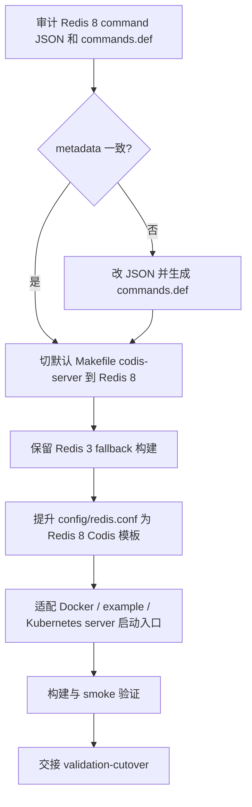

# redis8-build-config-packaging design

## 0. 术语约定

- **正式 Redis 8 Codis Server 构建**：`make` / `make build-all` / `make codis-server` 产出的默认 `bin/codis-server` 来自 `extern/redis-8.6.3/`，而不是继续停留在独立 `bin/codis-server-redis8` 支线。
- **Redis 3 fallback 构建**：为实现阶段和后续 cutover 保留的显式回退目标，产物使用独立名称，不占用默认 `bin/codis-server`。
- **Codis Server 配置模板**：仓库 tracked 的 `config/redis.conf` / `config/sentinel.conf`，以及 packaging 入口启动 server 时实际使用的配置。Redis 8 默认 server 配置必须显式启用 `codis-enabled yes`。
- **Command metadata 收口**：Redis 8 的 `src/commands/*.json` 是命令注册源，`commands.def` 是生成产物；本 feature 做最终一致性审计和必要 metadata 修正，不新增命令语义。
- **发布包装入口**：当前仓库里会把默认 `codis-server` 放进可运行环境的入口，包括 `Dockerfile`、`scripts/docker.sh`、`kubernetes/codis-server.yaml` 和 `example/server.py`。

防冲突结论：本 feature 的重点是默认构建与包装切换，不是 `redis8-validation-cutover`。它要让发布物默认带 Redis 8 Codis Server，但不承诺完成端到端灰度、性能基线或跨版本迁移演练。

## 1. 决策与约束

### 需求摘要

本 feature 要把前面已经完成的 Redis 8 Codis Server 支线收口成正式构建与发布包装入口。服务对象是后续 cutover 验证、日常构建和部署包装；成功标准是默认 `codis-server` 产物来自 Redis 8、默认配置启动即进入 Codis mode、命令 metadata 与 JSON 生成源一致，并且现有示例 / Docker / Kubernetes 入口不会在 Redis 8 下以 `codis-enabled no` 启动出不可用 server。

明确不做：

- 不新增 Redis 命令、不改 slot 计算、不改迁移协议实现，不触碰 Redis Cluster `MOVED` / `ASK` / cluster bus 语义。
- 不修改 Go proxy/topom/admin 的生产协议适配，不扩大 proxy 业务命令 allow-list。
- 不做 Redis 3 到 Redis 8 的数据迁移演练、性能基线、灰度步骤和回滚操作手册；这些归 `redis8-validation-cutover`。
- 不升级 Go 依赖，不执行全量 `go mod tidy`，不恢复 GOPATH/vendor 构建。
- 不删除 Redis 3 源码和显式 fallback 构建能力；默认构建切换不等于把回退路径从仓库中移除。
- 不承诺 Redis 8 生成的持久化 RDB/AOF 可降级回 Redis 3。

### 复杂度档位

走“生产构建 / 发布包装”档位，偏离默认如下：

- Robustness = L3：构建失败、command metadata 生成不一致、默认配置未启用 Codis mode 都必须失败或在验收中阻断，不能静默回落到 Redis 3。
- Compatibility = cross-version：默认产物切到 Redis 8，同时保留显式 Redis 3 fallback 构建，供后续 cutover 和回滚验证使用。
- Determinism = reproducible：重复执行 `make codis-server` / `make build-all` 后，tracked 配置和 generated metadata 应稳定，不产生无关脏 diff。
- Testability = verified：至少覆盖默认构建、fallback 构建、Redis 8 Codis mode 启动、command metadata 发现和包装入口静态 / smoke 验证。
- Security = validated：配置模板不默认注入真实密码；需要关闭 `protected-mode` 或绑定外部地址的示例必须在入口处显式表达，不能把不安全默认混进通用 tracked 模板。

### 关键决策

1. **默认 `codis-server` 切到 Redis 8，Redis 3 改为显式 fallback**。
   - 依据：roadmap 已完成 Codis mode、slot 命令、同步/异步迁移和 Go 兼容验证；继续把 Redis 8 留在 suffixed harness 会让 cutover 验证无法覆盖真实发布物。
   - 被拒方案：继续保留默认 Redis 3，只新增更多 `*-redis8` 包装。理由：这会把正式切换推给 cutover，导致 cutover 同时承担构建切换和运行验证两类风险。

2. **默认配置启用 `codis-enabled yes`，但不启用 Redis Cluster**。
   - 依据：Redis 8 standalone 默认 `codis-enabled no` 时 slot 命令会返回禁用错误；Codis 发布物若不显式启用 Codis mode，对 proxy/topom 来说不可用。
   - 被拒方案：要求所有部署入口手工加 `--codis-enabled yes`。理由：入口分散，容易遗漏；正式模板应表达默认 Codis Server 语义。

3. **命令表以 JSON 为源，`commands.def` 只做生成同步和审计**。
   - 依据：Redis 8 上游命令表由 `src/commands/*.json` 经生成器生成，历史 feature 已按这个模式添加 Codis 命令。
   - 被拒方案：直接手改 `commands.def` 修 packaging 问题。理由：生成产物会在下一次构建或上游同步中漂移。

4. **包装入口只做让默认发布物可启动的最小适配**。
   - 依据：Docker / Kubernetes / example 的目标是在新默认二进制下不误启 `codis-enabled no`。拓扑演练、Dashboard 联动、性能压测留给 cutover。
   - 被拒方案：在本 feature 中全面改造 Kubernetes API 版本、部署模板体系或灰度流程。理由：那是部署现代化 / cutover 规划，不是 Redis 8 packaging 的必要条件。

### 前置依赖

- `redis8-async-migration` 已完成：Redis 8 Codis Server 具备异步迁移、restore async、fence/cancel/status 和 exec wrapper。
- `redis8-go-component-adapters` 已完成：Go proxy/topom/admin 对 Redis 8 Codis Server 的关键协议兼容面已验证。

## 2. 名词与编排

### 2.1 名词层

#### 默认 server 构建产物

现状：

- 根 `Makefile` 的 `build-all` 依赖 `codis-server`，而 `codis-server` 仍从 `extern/redis-3.2.11/` 复制 `redis-server` 到 `bin/codis-server`。
- Redis 8 只通过 `codis-server-redis8` 独立目标产出 `bin/codis-server-redis8`、`bin/redis-cli-redis8`、`bin/redis-benchmark-redis8` 和 `bin/redis-sentinel-redis8`。
- 架构文档和前序 acceptance 都把“默认构建仍是 Redis 3”列为后续 packaging 的未完成边界。

变化：

- **修改**默认 `codis-server` 构建，使 `bin/codis-server` 来自 `extern/redis-8.6.3/src/redis-server`。
- **保留**显式 Redis 3 fallback 构建目标，产物使用独立后缀，避免覆盖默认 Redis 8 发布物。
- **保留或改造**`codis-server-redis8` 作为兼容 alias 时，必须避免和默认产物语义冲突；实现阶段可选择让它调用默认 Redis 8 构建或继续产出 suffixed 调试二进制。

接口示例：

```text
输入：make codis-server
输出：bin/codis-server --version 显示 Redis server v=8.6.3
来源：根 Makefile codis-server

输入：make codis-server-redis3
输出：bin/codis-server-redis3 --version 显示 Redis server v=3.2.11
来源：根 Makefile fallback target
```

#### Codis Server 配置模板

现状：

- `config/redis.conf` / `config/sentinel.conf` 是 tracked 默认配置，来自 Redis 3 源码模板。
- `config/redis8.conf` / `config/sentinel8.conf` 是 ignored harness 生成物，来自 Redis 8 上游模板；`redis8.conf` 当前不包含 `codis-enabled yes`。
- Redis 8 `config.c` 已注册 immutable `codis-enabled`，并在启动期拒绝与 `cluster-enabled` 同时开启。

变化：

- **修改**`config/redis.conf` 为 Redis 8 Codis Server 默认配置模板，显式包含 `codis-enabled yes`，保留 `databases 16` 多 DB 语义，不设置 `cluster-enabled yes`。
- **修改**`config/sentinel.conf` 为 Redis 8 对应 Sentinel 模板或确认现有模板兼容 Redis 8。
- **调整**Makefile 配置刷新逻辑，使默认 `make codis-server` 刷新 tracked 默认配置时是稳定输出；`config/redis8.conf` / `sentinel8.conf` 不再作为正式模板入口。
- **适配**启动入口：凡是直接执行 `codis-server` 且不传 `config/redis.conf` 的脚本，需要显式传配置或显式追加 `--codis-enabled yes`。

接口示例：

```text
输入：bin/codis-server config/redis.conf --port 0
输出：CONFIG GET codis-enabled 返回 yes，CONFIG GET cluster-enabled 返回 no
来源：config/redis.conf + Redis 8 config.c
```

默认值差异与兼容性评估：

- `daemonize`：Redis 3 tracked 模板为 `yes`，Redis 8 上游模板为 `no`。本 feature 接受 Redis 8 默认值，原因是 Docker / Kubernetes / systemd 前台运行更符合现代包装入口；裸金属部署需要 daemon 模式时继续在私有配置中覆盖。
- `save`：Redis 3 默认 `900 1` / `300 10` / `60 10000`，Redis 8 默认 `3600 1` / `300 100` / `60 10000`。这是持久化触发阈值变化，属于 Redis 8 行为面，cutover 验证必须覆盖 RDB 生成节奏；本 feature 不在 packaging 层回退旧阈值。
- `logfile`：Redis 3 tracked 模板默认写 `/tmp/redis_6379.log`，Redis 8 默认 `""` 输出到 stdout。容器入口会显式传 `--logfile`；通用模板保留 Redis 8 默认，避免把本地 `/tmp` 路径写死进正式模板。
- `pidfile`：Redis 3 tracked 模板默认 `/tmp/redis_6379.pid`，Redis 8 默认 `/var/run/redis_6379.pid`。在 `daemonize no` 下影响有限；需要 pidfile 的裸金属部署应在私有配置中指定。
- `bind`：Redis 3 tracked 模板默认 `127.0.0.1`，Redis 8 上游模板为 `127.0.0.1 -::1`。通用模板不扩大到 `0.0.0.0`；Docker server 入口需要外部可达时由脚本显式传 `--bind 0.0.0.0 --protected-mode no`。
- `repl-diskless-sync`：Redis 3 默认 `no`，Redis 8 默认 `yes`。这是复制路径的行为变化，保留 Redis 8 默认并交给 Redis 8 cutover / failover 验证覆盖，不在 packaging 层伪装成 Redis 3。
- `slave-*` / `slaveof`：Redis 8 模板使用 `replica-*` 命名，示例入口也使用 `replicaof`。Redis 3 fallback 只承诺通过 suffixed 二进制保留，不承诺所有 Redis 8 配置模板或示例反向兼容 Redis 3。
- `sentinel protected-mode`：Redis 8 Sentinel 模板显式 `protected-mode no`。本 feature 保留该上游默认，但在生成的 `config/sentinel.conf` 头部补充 Codis 包装说明：容器 / Kubernetes 依赖网络层隔离，裸金属部署必须自行限制暴露面或覆盖配置。

#### Command metadata

现状：

- Redis 8 `extern/redis-8.6.3/src/commands/*.json` 已包含 Codis 基础 slot、同步迁移、异步迁移、restore async 和 exec wrapper 命令。
- `extern/redis-8.6.3/src/commands.def` 是生成产物，并已包含 Codis 命令 `MAKE_CMD` 条目。
- Go 组件兼容验证以真实 RESP 为准，但 packaging 需要确保 `COMMAND INFO`、arity、flags、ACL 分类和 key spec 不明显偏离实际命令语义。

变化：

- **新增**最终 metadata 审计：列出全部 Codis 命令 JSON 与 `COMMAND INFO` 可发现性，校验 arity、write/read flags、dangerous/keyspace ACL、key spec 和 reply schema 的基本一致性。
- **修改**仅限 metadata 不一致项，且必须先改 JSON 再重新生成 `commands.def`。
- **不新增**命令函数和协议行为；如果审计发现真实命令返回和 roadmap 契约冲突，停下回对应 server feature，不在 packaging 中偷偷改协议。

接口示例：

```text
输入：COMMAND INFO SLOTSINFO SLOTSMGRTTAGSLOT SLOTSMGRTTAGSLOT-ASYNC SLOTSRESTORE-ASYNC
输出：命令均可发现；读写 flags、arity、ACL 分类与各命令用途匹配
来源：extern/redis-8.6.3/src/commands/*.json -> commands.def
```

#### 发布包装入口

现状：

- `Dockerfile` 仍使用 `golang:1.8`，与当前 module mode / `go.mod` 的 `go 1.26.1` 构建入口不匹配。
- `scripts/docker.sh server` 直接执行 `codis-server --logfile ...`，不传 `config/redis.conf`，Redis 8 默认会以 `codis-enabled no` 启动。
- `kubernetes/codis-server.yaml` 使用 `codis-server $(CODIS_PATH)/config/redis.conf ...`，切换 tracked `config/redis.conf` 后可继承 Codis mode。
- `example/server.py` 动态写临时 Redis 配置，但未写 `codis-enabled yes`。

变化：

- **修改**Docker 构建环境，使 `make build-all` 在 module mode 下可执行，不再依赖 Go 1.8。
- **修改**Docker server 启动脚本，使容器里启动的是 Redis 8 Codis mode。
- **修改**示例 server 临时配置，写入 `codis-enabled yes`。
- **核对**Kubernetes server manifest 通过 tracked `config/redis.conf` 启动 Redis 8 Codis mode；如实现发现命令行覆盖会影响 Redis 8，做最小修正。

接口示例：

```text
输入：scripts/docker.sh server
输出：容器内 codis-server 以 codis-enabled yes 启动
来源：scripts/docker.sh + Dockerfile + config/redis.conf
```

### 2.2 编排层



现状：

- 当前编排是“双轨构建”：默认 Redis 3 轨道用于发布物，Redis 8 轨道通过 suffixed target 做开发验证。
- 配置模板也是“双轨”：tracked Redis 3 默认配置和 ignored Redis 8 harness 配置并存。
- 包装入口大多假设 `codis-server` 这个名字就是可用的 Codis Server；在 Redis 8 下如果不配 `codis-enabled yes`，这个假设不成立。

变化：

- 编排从“双轨默认 Redis 3”变为“默认 Redis 8 + 显式 Redis 3 fallback”。
- 配置模板从 Redis 3 默认模板变为 Redis 8 Codis mode 默认模板。
- 包装入口统一围绕默认 `bin/codis-server`，不要求用户知道 `codis-server-redis8` 这个开发期后缀。

流程级约束：

- **错误语义**：默认 `make codis-server` 不能在 Redis 8 构建失败时静默回落 Redis 3；metadata 生成失败也不能提交手写 `commands.def`。
- **幂等性**：重复执行 `make codis-server`、`make build-all` 和 metadata 生成后，只应产生预期的 `bin/` 产物和稳定配置，不应让 tracked 源码持续抖动。
- **兼容性**：`bin/codis-server` 名称保持不变，给现有 proxy/topom/admin 和部署入口最小迁移成本；Redis 3 通过显式 fallback 目标保留。
- **顺序约束**：先做 command metadata 审计，再切默认构建；否则默认构建可能把未收口的 metadata 带入发布物。
- **安全性**：通用 `config/redis.conf` 不写真实密码，不默认扩大监听面；示例或容器为了可运行需要 `protected-mode no` 时，必须在对应入口显式出现。
- **可观测点**：验收必须能通过 `--version`、`CONFIG GET codis-enabled`、`COMMAND INFO` 和至少一个 slot smoke 命令观察到 Redis 8 Codis Server 发布物。

### 2.3 挂载点清单

- 根 `Makefile`：默认 `codis-server` / `build-all` 的 Redis Server 构建入口 — 修改为 Redis 8；新增或保留 Redis 3 fallback target。
- Codis Server 默认配置：`config/redis.conf` / `config/sentinel.conf` — 修改为 Redis 8 正式模板，`redis.conf` 显式启用 `codis-enabled yes`。
- Redis command registry：`extern/redis-8.6.3/src/commands/*.json` + generated `commands.def` — 审计并修正 Codis 命令 metadata。
- Docker packaging：`Dockerfile` + `scripts/docker.sh` — 修改为 module-capable 构建环境和 Redis 8 Codis mode server 启动入口。
- Local / Kubernetes packaging：`example/server.py` + `kubernetes/codis-server.yaml` — 确保默认 `codis-server` 启动时进入 Codis mode。

### 2.4 推进策略

1. **metadata 审计骨架**：列出全部 Codis command JSON 和对应 `COMMAND INFO` 验证点。
   - 退出信号：每个 Codis 命令都有 JSON 源，`commands.def` 可由生成器同步，审计能指出是否需要 metadata 修正。

2. **默认构建切换**：把 `make codis-server` / `make build-all` 的默认 server 产物切到 Redis 8，并保留 Redis 3 fallback。
   - 退出信号：`bin/codis-server --version` 是 Redis 8.6.3，fallback 目标仍能构建 Redis 3.2.11。

3. **配置模板提升**：将 tracked 默认 Redis 配置提升为 Redis 8 Codis Server 模板。
   - 退出信号：用 `config/redis.conf` 启动后 `codis-enabled=yes`、`cluster-enabled=no`，`CONFIG REWRITE` 不丢 Codis 自定义配置。

4. **包装入口适配**：更新 Dockerfile、docker server 脚本、example server 临时配置和 Kubernetes server manifest 的必要启动参数。
   - 退出信号：所有入口都使用默认 `codis-server`，且不会以 `codis-enabled no` 启动 Redis 8。

5. **构建与 smoke 验证**：跑默认构建、Redis 8 Tcl smoke、Go 组件兼容测试或目标包回归。
   - 退出信号：`make build-all` / `make codis-server` / Redis 8 Codis smoke 通过；Go 侧未出现生产 adapter 回归。

6. **范围回归与交接**：核对未混入 cutover、迁移协议、Go 依赖升级和 proxy 命令面变更。
   - 退出信号：diff 只包含 packaging / config / metadata 必要范围，validation-cutover 能接收正式发布物继续端到端验证。

### 2.5 结构健康度与微重构

##### 评估

- compound convention：已检索 `.codestable/compound` 的 convention 类沉淀，未命中目录组织 / 文件归属 / 命名约定。
- 文件级 — 根 `Makefile`：约 73 行，职责集中在构建编排；本次会调整并列 target 和默认依赖，改动密度可控。
- 文件级 — `config/redis.conf`：约 1052 行，是 Redis 配置模板；虽然文件较长，但属于上游配置格式，重组没有收益。
- 文件级 — `extern/redis-8.6.3/src/commands.def`：约 12663 行，是生成产物；只能由 JSON 机械生成，不做结构调整。
- 目录级 — `extern/redis-8.6.3/src/commands/`：Redis 8 上游模式是一命令一 JSON；现有 Codis 命令已遵循该模式，本次不引入新的分组规则。
- 文件级 — `Dockerfile`：约 14 行，职责单一；更新基础镜像 / 构建命令不需要拆分。
- 文件级 — `scripts/docker.sh`：约 76 行，按组件分支启动容器；server 分支小范围改动即可。
- 文件级 — `kubernetes/codis-server.yaml`：约 78 行，单一 StatefulSet manifest；本次只核对 server 启动命令，不做部署体系重构。
- 文件级 — `example/server.py`：约 53 行，单一示例 server launcher；加入 `codis-enabled yes` 不需要抽新模块。

##### 结论：不做微重构

原因：本 feature 是构建 / 配置 / 包装入口收口，改动对象要么是小型编排文件，要么是上游格式或生成产物。拆文件或重组目录不会降低本次风险，反而会扩大 cutover 前的审查面。

##### 超出范围的观察

- `kubernetes/codis-server.yaml` 使用较旧的 Kubernetes API 版本。它可能值得后续部署现代化处理，但这属于 Kubernetes packaging/refactor，不阻塞 Redis 8 默认 server 切换。

## 3. 验收契约

### 关键场景清单

- 触发：执行 `make codis-server`。期望：`bin/codis-server` 来自 Redis 8，`./bin/codis-server --version` 显示 `Redis server v=8.6.3`。
- 触发：执行 Redis 3 fallback 构建目标。期望：能产出独立 Redis 3 fallback 二进制，且不会覆盖 `bin/codis-server`。
- 触发：执行 `make build-all`。期望：默认完整构建包含 Redis 8 `bin/codis-server`、Go 二进制和默认配置刷新。
- 触发：用 `config/redis.conf` 启动 `bin/codis-server`。期望：`CONFIG GET codis-enabled` 返回 `yes`，`CONFIG GET cluster-enabled` 返回 `no`，`SLOTSHASHKEY` / `SLOTSINFO` 可用。
- 触发：执行 `CONFIG REWRITE`。期望：重写后的配置仍保留 `codis-enabled yes`。
- 触发：`COMMAND INFO` 查询全部 Codis slot / migration / restore / async 命令。期望：命令都可发现，arity、flags、ACL 分类、key spec 与命令用途匹配。
- 触发：重新生成 `commands.def`。期望：`commands.def` 与 JSON 生成源一致，不能出现只手写 generated file 的 diff。
- 触发：检查 `Dockerfile`。期望：Docker 构建环境支持当前 Go modules 构建，不再使用 Go 1.8 作为默认构建镜像。
- 触发：检查 `scripts/docker.sh server`、`example/server.py`、`kubernetes/codis-server.yaml`。期望：这些入口启动默认 `codis-server` 时都会进入 Redis 8 Codis mode。
- 触发：运行 Redis 8 Codis smoke。期望：写入 key 后 `SLOTSHASHKEY` / `SLOTSINFO` 返回 0..1023 slot 语义，基础 `unit/codis` 类测试可作为证据。

### 明确不做的反向核对项

- Diff 不应修改 Redis Cluster `MOVED` / `ASK` / cluster bus 语义，不能把 `cluster-enabled yes` 当作 Codis mode 前提。
- Diff 不应新增 Redis 命令实现或改变 `SLOTSMGRT*` / `SLOTSRESTORE*` 返回协议。
- Diff 不应修改 Go proxy/topom/admin 生产协议适配或 proxy `mapper.go` allow-list。
- Diff 不应修改 `go.mod` / `go.sum`，不应新增 `vendor/`、`Godeps/` 或 `vendor/modules.txt`。
- Diff 不应删除 `extern/redis-3.2.11/` 或移除 Redis 3 fallback 构建能力。
- 验收报告不应把端到端灰度、性能基线、Redis 3 ↔ Redis 8 数据迁移兼容结论写成本 feature 已完成。

## 4. 与项目级架构文档的关系

acceptance 阶段需要回写 `.codestable/architecture/ARCHITECTURE.md`：

- 在构建层把“Redis 8 仍是独立 harness”更新为“默认 `codis-server` 已来自 Redis 8，Redis 3 通过显式 fallback 保留”。
- 在数据与状态 / 已知约束中保留 `codis-enabled yes` 是默认 Codis Server 配置，仍不启用 Redis Cluster 协议。
- 在代码锚点中补充 Redis 8 默认配置模板、Docker / Kubernetes / example 包装入口的现状。

requirement `redis-cluster-service` 需要在 acceptance 阶段补充实现进展：Redis 8 Codis Server 已进入正式默认构建与包装入口，但灰度 cutover、性能基线和回滚策略仍属后续 `redis8-validation-cutover`。
