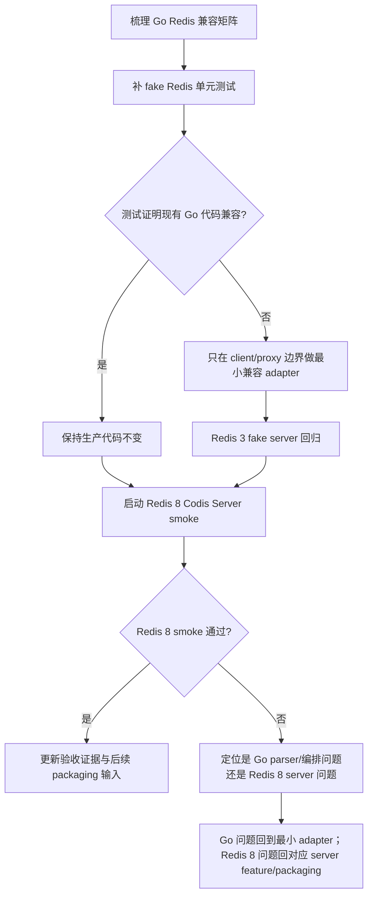

# redis8-go-component-adapters design

## 0. 术语约定

- **Go component adapters**：本 feature 指 Go 侧 `pkg/utils/redis`、`pkg/topom`、`pkg/proxy`、`cmd/admin` 和 `cmd/ha` 对 Redis 8 Codis Server 的兼容验证与必要小适配；不是 Go modules 迁移，也不是 Redis 8 默认打包切换。
- **兼容矩阵**：把 Go 侧依赖的 Redis 命令和文本字段列成可验证场景，包括 `INFO`、`CONFIG`、`AUTH`、`SELECT`、`SLAVEOF` / `REPLICAOF`、`CLIENT KILL TYPE normal`、`SLOTSINFO`、`SLOTSMGRT*`、`SLOTSMGRT*-ASYNC`、`SLOTSMGRT-EXEC-WRAPPER`。
- **Redis 8 Codis Server**：仓库内 `extern/redis-8.6.3/` 构建出的 `bin/codis-server-redis8`，运行时使用 `codis-enabled yes`，不启用 Redis Cluster 协议。
- **复制控制命令**：现有 Go 代码发送 `SLAVEOF host port` 或 `SLAVEOF NO ONE`；Redis 8 源码中 `SLAVEOF` 是 `REPLICAOF` 的 deprecated alias，二者最终进入 `replicaofCommand`。
- **default-user AUTH**：现有配置只有 `ProductAuth` / `SessionAuth` 密码，没有 ACL username。Redis 8 default user 下的 `AUTH <password>` 是本 feature 的兼容目标；非 default ACL 用户配置不在本 feature 内新增。

防冲突结论：本 feature 的目标是让现有 Go 组件继续驱动 Redis 8 Codis Server；不是扩大 proxy 支持的 Redis 命令集合，不是实现 Redis Cluster client 协议，也不是把默认 `make` / `codis-server` 切到 Redis 8。

## 1. 决策与约束

### 需求摘要

本 feature 验证并适配 Go proxy/topom/admin 与 Redis 8 Codis Server 的关键交互。真正目标是降低后续 packaging / cutover 风险：在不改变 Codis 对外 1024 slot、topom 状态机和 proxy 命令边界的前提下，确认 Go 组件依赖的 Redis 3 Codis 协议假设在 Redis 8 支线上仍成立。

成功标准：

- `pkg/utils/redis.Client.Info()` / `InfoKeySpace()` / `InfoFull()` 能解析 Redis 8 `INFO` / `INFO keyspace`，包括 `loading`、`master_host`、`master_port`、`master_link_status`，并继续生成 Go 侧使用的 `master_addr`。
- `Client.SetMaster()` 的 `MULTI`、`CONFIG SET masterauth`、`SLAVEOF`、`CONFIG REWRITE`、`CLIENT KILL TYPE normal` 流程在 Redis 8 上可用；若真实 Redis 8 拒绝 `SLAVEOF`，实现层只加兼容 fallback，不能破坏 Redis 3。
- `Client.SlotsInfo()`、`MigrateSlot()`、`MigrateSlotAsync()` 对 Redis 8 实际 RESP 返回格式保持严格解析：`SLOTSINFO` 是 `[[slot_id, key_count], ...]`，slot 迁移返回 `[migrated_count, remaining_count]`。
- proxy 后端连接的 `AUTH`、`SELECT`、keepalive `INFO` 解析在 Redis 8 上可用；`SLOTSINFO <addr>` 和 `SLOTSSCAN slot cursor [COUNT n]` 的 proxy 编排不因 Redis 8 返回格式变化失效。
- 半异步迁移期间，proxy 对 `SLOTSMGRT-EXEC-WRAPPER` 的 `[code, reply]` 解析继续兼容 Redis 8：`0` 表示 key 不存在/已迁走并重试目标，`1` 表示 key 正在迁移且写被阻断，`2` 表示包装命令正常返回。
- `cmd/admin` / `cmd/ha` 基于 dashboard stats 展示 group/server 状态时，Redis 8 INFO 字段不会让 master/replica 状态误判。
- 相关 Go 包测试通过；Redis 8 真实进程 smoke 覆盖 `AUTH`、`SELECT`、`INFO`、`SLOTSINFO`、同步迁移、异步迁移和 replication control。

明确不做：

- 不切换默认 `make` / `make codis-server` 到 Redis 8；正式构建、配置模板、命令 metadata 和打包切换归 `redis8-build-config-packaging`。
- 不升级 Go 依赖，不重写 redigo 封装，不做 Go modules 现代化。
- 不修改 Redis Cluster 协议，不引入 MOVED/ASK、cluster bus 或 16384 slot。
- 不扩大 proxy 对业务客户端开放的命令集合；`CONFIG`、`SLAVEOF`、迁移命令、`CLIENT KILL` 等仍不允许业务客户端经 proxy 直接调用。
- 不重构 topom/proxy 的 slot action 状态机、backend pipeline 或 session dispatch 架构。
- 不承诺 Redis 3 ↔ Redis 8 的 RDB fragment 双向迁移兼容，也不做系统级灰度 / 性能基线；这些归 cutover。
- 不新增非 default ACL 用户配置；只验证现有 `AUTH <password>` default-user 路径和 Redis 8 restore async AUTH/AUTH2 命令可用面。

### 复杂度档位

走“对外 Redis 协议 / 生产兼容”高兼容档位：

- Robustness = L3：所有 Redis error reply、RESP 类型不匹配、INFO 字段缺失和连接失败都必须有明确错误，不做静默降级。
- Compatibility = cross-version：同一套 Go 代码必须继续兼容 Redis 3 Codis Server，并兼容 Redis 8 Codis Server。
- Testability = verified：除单元 fake server 外，必须有 Redis 8 真实进程 smoke 验证关键协议。
- Security = validated：AUTH 行为只验证现有密码模型；不绕过 Redis 8 ACL，也不在日志/错误中泄露密码。

### 关键决策

1. **以真实 RESP 为 Go 适配源，不以 command JSON 文档字段为源**。
   - 依据：Go 组件不调用 `COMMAND INFO` 决策协议；它解析的是命令实际返回。若 Redis 8 command metadata 的 `reply_schema` 与真实 RESP 不一致，只有真实 RESP 影响本 feature，metadata 修正归 packaging 前的命令表收口。

2. **优先保留 `SLAVEOF`，必要时才加 `REPLICAOF` fallback**。
   - 依据：现有 Redis 3 Codis Server 只需要 `SLAVEOF` 兼容面；Redis 8 本地源码中 `SLAVEOF` 已注册为 `replicaofCommand` 的 deprecated alias。直接把 Go 代码改成只发 `REPLICAOF` 会增加 Redis 3 回归风险。

3. **保持 parser 严格，不把 Redis 返回“容错化”成任意结构**。
   - 依据：`MigrateSlot()`、`MigrateSlotAsync()`、`SlotsInfo()` 的返回结构是 Go 侧迁移状态机的输入。宽松解析会把 Redis 8 server regression 延迟到运行期才暴露。

4. **兼容验证先落到 Go 测试，再做必要生产代码改动**。
   - 依据：roadmap 的表述是“验证并必要时适配”。如果 fake server 和真实 Redis 8 smoke 都证明现有代码兼容，implementation 可以只新增测试和验证脚本，不应为“升级”制造无行为变化的代码 churn。

5. **AUTH 只覆盖现有 default-user 密码模型**。
   - 依据：Codis 当前 Go 配置没有 Redis ACL username 字段。Redis 8 `SLOTSRESTORE-ASYNC-AUTH2` 可作为 server 能力被 smoke 验证，但 Go 侧不新增 username 配置，避免把配置模型改动塞进兼容验证 feature。

6. **proxy 命令边界不随 Redis 8 放宽**。
   - 依据：`pkg/proxy/mapper.go` 明确把 `CONFIG`、`SLAVEOF`、迁移命令和多数危险命令标成 `FlagNotAllow`。Redis 8 支线存在这些命令不意味着业务客户端可以经 proxy 调用它们。

### 前置依赖

- `redis8-slot-basic-commands` 已完成：`SLOTSINFO` / `SLOTSSCAN` 等基础命令在 Redis 8 Codis mode 可用。
- `redis8-sync-migration-and-rdb-fragments` 已完成：`SLOTSMGRTTAGSLOT` / `SLOTSRESTORE` 真实协议可供 Go topom 验证。
- `redis8-async-migration` 已完成：`SLOTSMGRTTAGSLOT-ASYNC`、`SLOTSMGRT-EXEC-WRAPPER`、restore async AUTH/SELECT/ACK 可供 proxy/topom 验证。

## 2. 名词与编排

### 2.1 名词层

#### Go Redis client 兼容面

现状：

- `pkg/utils/redis/client.go` 是 topom/admin/HA 访问 Redis Server 的主要封装，包含 `Info()`、`InfoKeySpace()`、`InfoFull()`、`SetMaster()`、`MigrateSlot()`、`MigrateSlotAsync()`、`SlotsInfo()`、连接池和 `redigo` 连接创建。
- `InfoFull()` 解析 `master_host` / `master_port` 并合成 `master_addr`，再执行 `CONFIG GET maxmemory`。
- `SetMaster()` 发送 `MULTI`、`CONFIG SET masterauth`、`SLAVEOF`、`CONFIG REWRITE`、`CLIENT KILL TYPE normal`、`EXEC`，并逐项检查事务返回错误。
- `MigrateSlot()` 和 `MigrateSlotAsync()` 都要求迁移命令返回 2 个整数。

变化：

- 新增或补强兼容测试矩阵，覆盖 Redis 8 风格 INFO 文本、CONFIG 返回、SLAVEOF alias、CLIENT KILL TYPE normal、同步/异步迁移返回格式。
- 只有当 Redis 8 真实 smoke 证明现有命令不可用时，才在 `Client.SetMaster()` 内做最小兼容 fallback；对外方法签名不变。
- `SlotsInfo()` / `MigrateSlot()` / `MigrateSlotAsync()` 继续严格要求数组结构，不为 Redis 8 增加宽松 envelope。

接口示例：

```text
输入：INFO 返回 master_host:127.0.0.1、master_port:6380、master_link_status:up
输出：InfoFull()["master_addr"] == "127.0.0.1:6380"

输入：SLOTSMGRTTAGSLOT-ASYNC host port timeout maxbulks maxbytes slot numkeys
输出：MigrateSlotAsync() 解析 [migrated_count, remaining_count]，返回 remaining_count

输入：Redis 8 接受 SLAVEOF 127.0.0.1 6380
输出：SetMaster() 保持现有命令序列，不改为 REPLICAOF-only
```

来源：`pkg/utils/redis/client.go` 的 `InfoFull`、`SetMaster`、`MigrateSlot`、`MigrateSlotAsync`、`SlotsInfo`。

#### Topom/admin/HA 状态消费面

现状：

- `pkg/topom/topom_stats.go` 通过 `s.stats.redisp.InfoFull(addr)` 刷新 group server stats。
- `pkg/topom/topom_slots.go` 在 slot action migrating 阶段选择 `MigrateSlot()` 或 `MigrateSlotAsync()`，并用 `InfoKeySpace()` 寻找下一个非空 DB。
- `pkg/topom/topom_api.go` 的 `GroupAddServer` 用 `SlotsInfo()` 做 Redis Server 可用性 gate；`InfoServer` 返回 `InfoFull()`。
- `cmd/ha/main.go` 和 `cmd/admin/dashboard.go` 使用 `master_addr` / `master_link_status` 判断或展示 master/replica 状态。

变化：

- 将 Redis 8 INFO 字段和迁移返回格式纳入 topom fake server 与真实 Redis 8 smoke，确保 dashboard/admin/HA 不误判。
- 对 topom 状态机不做结构变更；如需要适配，只限定在 Redis client 返回解析或 fake server 测试数据。

接口示例：

```text
触发：Topom slot action migrating，method=semi-async，当前 DB 有目标 slot key
期望：MigrateSlotAsync() 返回 remaining_count；remaining_count 为 0 时 Topom 再用 INFO keyspace 查找下一 DB
```

来源：`pkg/topom/topom_slots.go`、`pkg/topom/topom_stats.go`、`cmd/ha/main.go`、`cmd/admin/dashboard.go`。

#### Proxy Redis 8 后端协议面

现状：

- `pkg/proxy/backend.go` 建立后端连接后发送 `AUTH <password>` 和 `SELECT <db>`；keepalive 在 `stateDataStale` 下发送 `INFO` 并读取 `master_link_status`、`loading`。
- `pkg/proxy/session.go` 本地处理 `AUTH`、`SELECT`、`INFO`、`CLIENT`、`SLOTSINFO`、`SLOTSSCAN` 等命令；`SLOTSINFO <addr>` 会被改写成后端 `SLOTSINFO` 并按地址 dispatch，`SLOTSSCAN slot cursor ...` 会按 slot dispatch。
- `pkg/proxy/forward.go` 的半异步迁移通过 `SLOTSMGRT-EXEC-WRAPPER hashkey command ...` 读 `[code, reply]`。
- `pkg/proxy/mapper.go` 已把 Redis/Codis 危险命令标记为 `FlagNotAllow`，业务客户端不能直接调用。

变化：

- 为后端 `AUTH` / `SELECT` / keepalive INFO、`SLOTSINFO` 地址转发、`SLOTSSCAN` slot 转发、`SLOTSMGRT-EXEC-WRAPPER` 返回码解析补齐 Redis 8 兼容测试。
- 不改变 proxy 的业务命令允许表；如果 Redis 8 新增命令名，本 feature 不把它们加入 allow list。

接口示例：

```text
输入：Redis 8 后端 INFO 返回 loading:1
输出：BackendConn keepalive 不把 stale backend 标成 connected

输入：SLOTSMGRT-EXEC-WRAPPER 返回 [2, <wrapped reply>]
输出：proxy 把 wrapped reply 写回原请求，不重试迁移源或目标
```

来源：`pkg/proxy/backend.go`、`pkg/proxy/session.go`、`pkg/proxy/forward.go`、`pkg/proxy/mapper.go`。

#### Redis 8 restore async AUTH 能力

现状：

- Go 侧不直接发送 `SLOTSRESTORE-ASYNC-AUTH` / `AUTH2`；这些命令由 Redis 8 async migration 源端内部 cached client 发给目标端。
- Redis 8 C 侧已注册 `SLOTSRESTORE-ASYNC-AUTH` 和 `SLOTSRESTORE-ASYNC-AUTH2`。

变化：

- 真实 Redis 8 smoke 覆盖现有 `ProductAuth` 密码下的同步/异步迁移，间接验证 restore async AUTH 路径。
- 可用独立 smoke 覆盖 `SLOTSRESTORE-ASYNC-AUTH2 username password` 命令存在并按 Redis error/ACK 语义返回；Go 配置不新增 username。

接口示例：

```text
输入：Redis 8 目标端设置 requirepass，源端执行 SLOTSMGRTTAGSLOT-ASYNC
输出：迁移成功或返回 Redis error；不得因 AUTH 子协议导致源端 key 静默删除
```

来源：`extern/redis-8.6.3/src/slots_async.c` 的 restore async AUTH/ACK，Go 侧通过 `pkg/utils/redis.Client.MigrateSlotAsync()` 触发。

### 2.2 编排层



#### 现状

Go 组件目前按 Redis 3 Codis Server 的协议假设工作：topom 直接调用 `SLOTSMGRTTAGSLOT` / `SLOTSMGRTTAGSLOT-ASYNC`，proxy 半异步路径依赖 `SLOTSMGRT-EXEC-WRAPPER`，admin/HA 依赖 INFO 字段判断复制状态。已有测试里 `pkg/topom/topom_stats_test.go` 的 fake server 只覆盖了旧命令形态，没有 Redis 8-specific smoke。

Redis 8 本地源码已经具备 Go 组件依赖的大部分兼容信号：`SLAVEOF` command JSON 仍存在并进入 `replicaofCommand`，`INFO` 仍输出 `master_host` / `master_port` / `master_link_status`，`SLOTSINFO` 返回 `[[slot,count], ...]`，async slot 迁移完成时对发起客户端返回 `[migrated_count, remaining_count]`。

#### 变化

- 先把 roadmap 4.7 的 7 项兼容清单转成测试矩阵，并明确每项是 fake server 可测、真实 Redis 8 smoke 可测，还是仅作为 packaging handoff。
- 扩展 fake Redis 行为，使 Go parser 和 topom/proxy 编排在不依赖外部 Redis 进程时能快速回归。
- 用 Redis 8 Codis Server 真实进程跑一组 smoke：单节点 INFO/AUTH/SELECT/SLOTSINFO，双节点 sync migration，双节点 async migration，replication control / CONFIG REWRITE。
- 如果失败发生在 Go 解析或命令选择边界，做最小 adapter；如果失败发生在 Redis 8 server 实际返回不符合 roadmap 契约，停下并回对应 Redis 8 server feature 或 packaging，不在 Go 侧吞掉不兼容协议。

#### 流程级约束

- **错误语义**：RESP 类型不匹配、事务子命令 error、INFO 必需字段缺失、AUTH 失败、SELECT 失败都返回错误；不能让 topom 继续推进 slot action。
- **兼容性**：新增适配不能让 Redis 3 fake server 和现有 Go tests 失败；`SLAVEOF` 兼容优先于 `REPLICAOF` 直改。
- **安全性**：测试和日志不能输出明文密码；AUTH2 只验证命令行为，不新增持久配置项。
- **当前 DB**：proxy backend `SELECT`、topom `Client.Select()`、sync/async migration 和 `SLOTSINFO` 都必须按当前 DB 工作。
- **可观测性**：真实 Redis 8 smoke 的失败需要区分 Go parser/编排问题、Redis 8 server 协议问题和环境启动问题，避免把 server bug 伪装成 Go 兼容层。
- **命令边界**：Redis 8 server 支持某命令不等于 proxy 对业务客户端开放该命令；`mapper.go` 的禁止策略默认保持不变。

### 2.3 挂载点清单

本 feature 不引入新的运行时挂入点：不新增配置 key、HTTP endpoint、Redis 命令、定时任务、coordinator schema 或 proxy allow-list 条目。

可卸载边界：

- 删除本 feature 新增的兼容测试 / smoke 入口后，运行时系统不应出现新开关或新 API 残留。
- 如果实现阶段因为 Redis 8 差异增加了小 adapter，删除该 adapter 后只会回到当前 Redis 3-only 假设，不应影响其他不相关模块。

### 2.4 推进策略

1. **兼容矩阵**：把 roadmap 4.7 的命令和字段清单转成 Go 侧场景表。
   退出信号：每个场景标明 fake test、Redis 8 smoke 或 packaging handoff 的验证方式。
2. **Redis client parser 骨架**：用 fake Redis 覆盖 INFO、CONFIG、SetMaster、SlotsInfo、sync/async migration 返回。
   退出信号：不启动真实 Redis 时，`pkg/utils/redis` 和 `pkg/topom` 相关 parser/编排测试能证明现有或适配后的协议形状。
3. **Proxy 后端与半异步转发**：覆盖 AUTH/SELECT/INFO keepalive、`SLOTSINFO` / `SLOTSSCAN` dispatch、`SLOTSMGRT-EXEC-WRAPPER` 返回码。
   退出信号：`pkg/proxy` 测试能验证 Redis 8 目标 RESP 不破坏 proxy 请求编排。
4. **必要小适配**：只处理前两步暴露出的 Go 侧不兼容；不碰状态机重构和命令边界扩张。
   退出信号：Redis 3 fake server 回归和新增 Redis 8 fake cases 同时通过。
5. **Redis 8 真实 smoke**：用 `bin/codis-server-redis8` 启动 codis-enabled 实例，验证 AUTH、SELECT、INFO、SLOTSINFO、sync/async migration、replication control。
   退出信号：smoke 输出能证明 Go 组件实际驱动 Redis 8 Codis Server；失败时能归类到 Go、Redis server 或环境。
6. **范围回归与交接**：核对未切换默认构建、未升级依赖、未扩大 proxy 命令面，并记录 packaging/cutover 后续输入。
   退出信号：验收清单全部有证据，roadmap 后续条目能接收剩余 packaging / cutover 风险。

### 2.5 结构健康度与微重构

##### 评估前 compound convention 检索

已执行：

```bash
python3 .codestable/tools/search-yaml.py --dir .codestable/compound --filter doc_type=decision --filter category=convention --query "目录组织 OR 命名 OR 归属"
```

结果：没有命中已有 convention。

##### 评估

- 文件级 — `pkg/utils/redis/client.go`：503 行，承担 Redis client、连接池、INFO/CONFIG/迁移命令封装。文件偏长，但本 feature 只会触碰少数现有 public method 或新增测试；先拆文件会扩大兼容面风险。
- 文件级 — `pkg/topom/topom_slots.go`：715 行，承载 slot action 状态机和迁移 executor。该文件偏长，但本 feature 不改变状态机拓扑，预期只通过测试覆盖迁移命令返回和 `InfoKeySpace()` 后续 DB 选择。
- 文件级 — `pkg/proxy/session.go`：743 行，承载 session 本地命令与 dispatch。该文件偏长，但 Redis 8 适配点集中在 `SLOTSINFO` / `SLOTSSCAN` 现有分支的验证，不值得先做拆文件。
- 文件级 — `pkg/proxy/backend.go`：522 行，承载后端连接、AUTH、SELECT、pipeline 和 keepalive。该文件刚过阈值，但兼容点集中在 AUTH/SELECT/INFO 行为验证。
- 文件级 — `pkg/proxy/forward.go`：230 行，职责集中在迁移期转发，结构健康；`SLOTSMGRT-EXEC-WRAPPER` parser 可以直接测试。
- 目录级 — `pkg/utils/redis/`：2 个文件，不存在摊平问题。
- 目录级 — `pkg/topom/`：20 个同层文件含测试，但已按 topom 子职责拆分；本 feature 预期复用现有测试文件，不新增两个以上同层文件。
- 目录级 — `pkg/proxy/`：19 个同层文件含测试，已有 backend/session/forward/mapper 等清晰分工；本 feature 预期复用现有测试文件，不新增生产文件。

##### 结论：不做微重构

本次不做微重构，原因：目标是兼容验证和必要小适配，预期改动小且需要严格保持 Redis 3 行为。对偏长文件做“只搬不改行为”的拆分收益不抵回归风险，也会把 feature 从兼容验证扩大成结构调整。

##### 超出范围的观察

- `pkg/topom/topom_slots.go` 与 `pkg/proxy/session.go` 都已偏长，未来如果继续增加非测试逻辑，建议单独走 `cs-refactor` 评估按 slot action executor / session local command 拆分；本 feature 不阻塞。

## 3. 验收契约

### 关键场景清单

- `INFO` 返回 Redis 8 standalone 字段、`CONFIG GET maxmemory` 返回正常数组 → `InfoFull()` 返回 map，包含 `maxmemory`，不伪造 `master_addr`。
- `INFO` 返回 `master_host`、`master_port`、`master_link_status:up|down` → `InfoFull()` 合成 `master_addr`，admin/HA 的 group status 能按预期展示或判定。
- Redis 8 返回 `loading:1` 或 `master_link_status:down` → proxy backend keepalive 不把 stale backend 标成 connected。
- Redis 8 default user 设置密码 → `NewClient()` / proxy backend `AUTH <password>` 成功；错误密码返回错误且不泄露密码。
- `SELECT <db>` 后执行 `SLOTSINFO`、sync migration、async migration → 操作只作用于当前 DB，Go 侧 `Client.Database` 与 backend 连接 DB 状态不漂移。
- `SLOTSINFO` 返回 `[[slot_id,key_count], ...]` → `SlotsInfo()` 解析为 `map[int]int`；返回项不是两个整数时必须报错。
- `SLOTSMGRTTAGSLOT` 返回 `[migrated_count, remaining_count]` → `MigrateSlot()` 返回 `remaining_count`；Redis error reply 必须向 topom 返回错误。
- `SLOTSMGRTTAGSLOT-ASYNC` 完成后返回 `[migrated_count, remaining_count]` → `MigrateSlotAsync()` 返回 `remaining_count`；restore async AUTH/ACK 错误不能被吞。
- `SLOTSMGRT-EXEC-WRAPPER` 返回 `[0, err]`、`[1, err]`、`[2, reply]` → proxy 分别执行重试目标、等待/阻断写、返回 wrapped reply 的现有语义。
- `SLOTSINFO <addr>` 经 proxy 进入指定后端，后端收到的是无额外 addr 参数的 `SLOTSINFO`；`SLOTSSCAN slot cursor COUNT n` 按 slot 后端转发。
- `Client.SetMaster("host:port")` 在 Redis 8 上完成 `CONFIG SET masterauth`、复制控制命令、`CONFIG REWRITE`、`CLIENT KILL TYPE normal`；`Client.SetMaster("NO:ONE")` 保持 promote 语义。
- Redis 8 `CONFIG REWRITE` 后自定义 `codis-enabled` 等 Redis 8 Codis 配置不丢失；若发现丢失，归 Redis 8 config/packaging 问题而不是 Go parser 容错。

### 明确不做的反向核对项

- 默认 `make` / `make codis-server` 不应切换到 Redis 8；本 feature 不应修改默认构建目标。
- `go.mod` / `go.sum` 不应因本 feature 做依赖升级或 `go mod tidy` 扫全仓。
- `pkg/proxy/mapper.go` 不应把 `CONFIG`、`SLAVEOF`、`SLOTSMGRT*`、`SLOTSRESTORE*`、`CLIENT KILL` 放开给业务客户端。
- 不应新增 Redis Cluster `MOVED` / `ASK` / `CLUSTER` 协议分支。
- 不应新增 ACL username 配置项或要求用户从 `AUTH <password>` 迁移到 `AUTH <username> <password>`。
- 不应把 Redis 8 command metadata / packaging 修正混入 Go compatibility 代码；仅在验收记录中交接后续项。

## 4. 与项目级架构文档的关系

acceptance 阶段需要更新 `.codestable/architecture/ARCHITECTURE.md`：

- 把 Redis 8 支线状态从“Go 组件适配等待后续条目”推进为“Go proxy/topom/admin 已通过 Redis 8 Codis Server 兼容验证/必要适配”。
- 在结构与交互中补充 Go 侧对 Redis 8 Codis Server 的兼容边界：`SLAVEOF` alias / `REPLICAOF` fallback 策略、INFO 字段、AUTH default-user、SELECT 当前 DB、SLOTSINFO 和迁移返回格式。
- 在已知约束中保留默认 Redis 3 构建尚未切换、packaging/cutover 仍待后续 item 的边界。

需求文档 `.codestable/requirements/redis-cluster-service.md` 的实现进展也应在 acceptance 阶段补一条：Redis 8 支线已完成 Go 组件兼容验证，但正式默认构建和 cutover 仍未完成。
