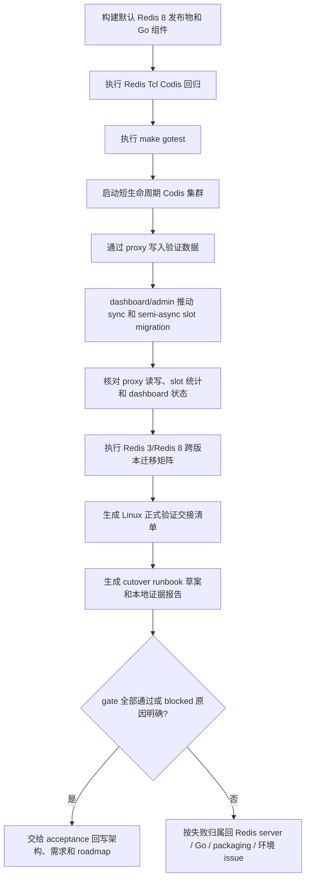

# redis8-validation-cutover design

## 0. 术语约定

- **Redis 8 local validation gate**：把前序 Redis 8 Codis Server 的 Redis Tcl、Go 测试、真实 Codis 集群联调和跨版本迁移观察串成一组可重复执行的本地 Mac 非性能验收门槛。
- **端到端 Codis 集群演练**：用默认 `bin/codis-server` 启动 Redis 8 Codis Server，联动 `codis-dashboard` / topom、`codis-proxy` 和 `codis-admin`，通过 proxy 写读数据并经 dashboard/admin 推动 slot migration。
- **跨版本迁移矩阵**：直接验证 Redis 3 fallback 与 Redis 8 Codis Server 之间 `SLOTSMGRT*` / `SLOTSRESTORE` RDB fragment 方向性兼容。矩阵只判断“成功 / 失败且可观测 / 失败但源端保留”，不把结果扩大成持久化 RDB/AOF 降级承诺。
- **Linux 正式验证交接清单**：列出必须在远程 Linux 上执行的正式端到端验证、性能基线、Docker/部署包装检查和最终 cutover 证据项。本 feature 只生成交接清单，不在 Mac 上跑性能相关验证。
- **灰度与回滚草案**：面向后续 Linux 验证的步骤草案，说明 preflight、canary、扩容迁移、全量切换和回退边界。这里不实际操作生产环境，不给出最终上线结论。

防冲突结论：本 feature 的目标是在本地 Mac 上跑通非性能验证和验证编排，不是继续移植 Redis 命令，也不是再改 Go proxy/topom 生产协议适配。默认 `codis-server` 已经是 Redis 8；正式 Linux 验证、性能基线和最终 cutover 结论归后续 `redis8-linux-validation-cutover`。

## 1. 决策与约束

### 需求摘要

本 feature 要把 Redis 8 升级 roadmap 当前步骤收窄为可在本地 Mac 执行的非性能验证 gate。成功标准是：

- Redis 8 Codis Server 的核心 Tcl 回归、Go 回归和默认构建验证形成一组明确命令。
- 至少一套本地端到端 Codis 集群演练覆盖 proxy、topom/dashboard、admin、Redis 8 server、slot assign、slot migration、proxy 写读和状态查询。
- Redis 3 fallback 与 Redis 8 的跨版本 fragment 迁移方向性有记录，失败方向必须失败得可观测且不静默删源。
- 产出 Linux 正式验证交接清单，明确哪些验证、性能基线和部署包装检查必须后移到远程 Linux。
- 灰度与回滚草案明确哪些阶段可直接回退、哪些阶段只能依赖备份或已验证的反向迁移，不能承诺 Redis 8 RDB/AOF 降级回 Redis 3。

明确不做：

- 不新增 Redis 命令、不改变 slot hash、tag index、同步/异步迁移协议或 Redis Cluster `MOVED` / `ASK` / cluster bus 语义。
- 不修改 Go proxy/topom/admin 生产协议适配，不扩大 proxy `mapper.go` 对业务客户端开放的命令集合。
- 不切换或删除 Redis 3 fallback 构建目标，不删除 `extern/redis-3.2.11/`。
- 不升级 Go 依赖，不执行全量 `go mod tidy`，不恢复 GOPATH/vendor 构建。
- 不现代化 Docker / Kubernetes 部署体系；Docker daemon 不可用时只做静态验证并在证据中说明。
- 不在本地 Mac 做性能相关验证，不产出 direct/proxy/fallback `redis-benchmark` 基线，不给出正式 cutover 通过结论。
- 不直接改生产环境、不写真实地址、真实密码或线上 cutover 结果。
- 不保证 Redis 8 持久化 RDB/AOF 可被 Redis 3 读取。

### 复杂度档位

走“本地升级验证 / 运维 cutover 草案”档位，偏离默认如下：

- Robustness = L3：验证 runner 必须清理临时进程、端口和数据目录；失败要能区分构建失败、server 协议失败、Go 编排失败、环境失败。
- Compatibility = cross-version：必须显式覆盖 Redis 8 ↔ Redis 8 和 Redis 3 ↔ Redis 8 的边界，不能把前者成功外推成后者成功。
- Determinism = reproducible：端到端演练使用临时目录、固定端口分配策略或可配置端口，重复运行不污染 tracked config。
- Performance = out-of-scope-local：本地 Mac 不做性能相关验证，只记录后续 Linux 必跑项。
- Testability = verified：Redis Tcl、Go tests、真实进程 smoke/e2e、跨版本观察和 Linux 交接清单都要有证据产物。
- Security = validated：测试密码只用临时 fixture，报告不得泄露真实凭据。

### 关键决策

1. **validation-cutover 产出验证 gate 和 runbook，不再引入新协议**。
   - 依据：roadmap 前序条目已完成 Codis mode、slot 命令、同步/异步迁移、Go 兼容和默认 packaging；这一步的风险在系统组合和运维边界。
   - 被拒方案：在 cutover 阶段继续修改 Redis 8 server 行为。理由：发现 server bug 应回对应 feature/issue 修复，不应在验证层偷偷绕过。

2. **端到端演练优先使用 filesystem coordinator 的短生命周期本地集群**。
   - 依据：`example/setup.py` 已能组织 server/sentinel/dashboard/proxy/admin，但它是无限 demo 流程；cutover gate 需要可结束、可清理、可重复的验证。
   - 被拒方案：依赖外部 Zookeeper/Etcd 或真实 Kubernetes。理由：会把环境依赖变成验证阻塞，且不是 Redis 8 server cutover 的必要前提。

3. **性能基线后移到远程 Linux，不在本地 Mac 上做**。
   - 依据：Mac 的 fork/RDB、复制、网络栈和 `redis-benchmark` 数字不能作为 Redis 8 cutover 的正式性能证据。
   - 被拒方案：先在 Mac 上跑一组 benchmark 写成本 feature 通过依据。理由：这会制造误导性基线，正式结论仍要在 Linux 重跑。

4. **回滚边界以数据来源是否仍可回退为准，而不是以二进制 fallback 是否存在为准**。
   - 依据：`codis-server-redis3` 只保证 Redis 3 可构建；Redis 8 写入后的 RDB/AOF 不保证 Redis 3 可读。
   - 被拒方案：把“换回 Redis 3 二进制”写成通用回滚方案。理由：数据文件和迁移方向不兼容时会造成误导。

5. **跨版本 fragment 兼容作为灰度前置观察项，不作为默认承诺**。
   - 依据：roadmap 已明确 Redis 3 ↔ Redis 8 `SLOTSRESTORE` RDB fragment 兼容性需要单独验证，且不能和持久化文件降级混为一谈。

### 前置依赖

- `redis8-build-config-packaging` 已完成：默认 `make` / `make codis-server` 产物来自 Redis 8，Redis 3 fallback 目标保留。
- `redis8-go-component-adapters` 已完成：Go proxy/topom/admin 关键 Redis 8 协议兼容面已验证。
- `redis8-async-migration`、`redis8-sync-migration-and-rdb-fragments`、`redis8-slot-basic-commands` 已完成：server 侧 slot 与迁移能力可供系统级验证。

## 2. 名词与编排

### 2.1 名词层

#### Local validation gate

现状：

- Redis 8 相关验证分散在前序 feature acceptance、Redis 8 Tcl tests、Go tests 和少量 smoke 文档中。
- 常规入口是 `make gotest`，Redis 8 server 回归需要单独进入 `extern/redis-8.6.3/` 执行 `./runtest --single unit/codis*`。
- packaging acceptance 已证明默认构建和配置可启动，但没有把它们与 dashboard/proxy/admin 集群流程串成一个最终 gate。

变化：

- 新增一组 Redis 8 local validation gate 定义，至少包含：
  - 默认构建：`make build-all` 或等价的 `make codis-server` + Go 二进制构建。
  - Go 回归：`make gotest`。
  - Redis Tcl：`unit/codis`、`unit/codis_migration`、`unit/codis_slotsrestore`、`unit/codis_async_migration`。
  - 真实 Codis 集群端到端演练。
  - 跨版本迁移矩阵。
  - Linux 正式验证交接清单。
- 每一项输出 pass/fail/blocked 和证据位置；blocked 必须说明是环境缺失还是功能失败。

接口示例：

```text
输入：执行 Redis 8 local validation gate
输出：一份本地 Mac 证据报告，列出 build / Go / Tcl / e2e / cross-version / Linux handoff / runbook 草案的结果
来源：Makefile、extern/redis-8.6.3/tests、cmd/pkg Go tests、cutover validation runner
```

#### 端到端 Codis 集群演练

现状：

- `example/setup.py` 可以启动 4 组 Redis、sentinel、FE、dashboard、proxy，并用 `codis-admin` 创建 group、添加 server、分配 slot 和 sentinel，但它面向手工 demo，最后进入无限循环。
- `cmd/admin/main.go` 支持 `--create-group`、`--group-add`、`--slots-assign`、`--slot-action --create-range`、`--slot-action --interval`、`--rebalance`、`--proxy-status`、`--group-status` 等 dashboard 操作。
- topom slot action 根据 `migration_method` 选择 `sync` 或 `semi-async`，默认配置是 `semi-async`。

变化：

- 引入短生命周期端到端演练：启动临时 filesystem coordinator、dashboard、至少一个 proxy、至少两个 Redis 8 group master，必要时加 replica/sentinel 观察但不把 HA failover 作为必选门槛。
- 通过 `codis-admin` 或 dashboard API 完成 group、server、proxy、slot assign，再通过 proxy 写入多种 key（普通 key、hash tag key、多个 DB）。
- 对一个小 slot range 分别覆盖 `semi-async` 和 `sync` 迁移路径；如果实现成本要求拆两轮运行，则两轮共享同一验证语义。
- 迁移前后用 proxy 读回数据，用 Redis server 的 `SLOTSINFO` / `SLOTSCHECK` 辅助核对源/目标 slot 状态，用 dashboard/admin stats 观察 action 清空。

接口示例：

```text
触发：在临时集群中把 slot N 从 group 1 迁到 group 2
期望：proxy 迁移前后读到同一批 key；dashboard slot action 最终归零；源端目标 slot 不再持有迁走 key，目标端持有对应 key
来源：codis-dashboard/topom、codis-admin、codis-proxy、Redis 8 SLOTSINFO/SLOTSCHECK
```

#### 跨版本迁移矩阵

现状：

- Redis 8 ↔ Redis 8 同步/异步迁移已经有 Tcl 与 smoke 证据。
- Redis 3 fallback 构建已保留，但 Redis 3 ↔ Redis 8 `SLOTSRESTORE` RDB fragment 双向兼容仍是 roadmap 明确的未决边界。

变化：

- 使用 Redis 3 fallback 与默认 Redis 8 Codis Server 做方向性验证：
  - Redis 3 source → Redis 8 target。
  - Redis 8 source → Redis 3 target。
  - 如果 Redis 3 命令面缺少 async 子协议，则记录“不适用 / unsupported”，不伪造通过。
- 每个方向至少覆盖 string、hash/list/zset 中的代表性值和 hash tag key；实现阶段可以按风险选择更多 encoding。
- 成功时校验目标值、TTL 和源端删除语义；失败时必须校验错误可观测且源端 key 保留。

接口示例：

```text
输入：Redis 8 source 对 Redis 3 target 执行 SLOTSMGRTTAGSLOT
输出：成功并校验数据，或返回明确 Redis error；失败时源端 key 仍存在
来源：bin/codis-server、bin/codis-server-redis3、SLOTSMGRT* / SLOTSRESTORE
```

#### Linux 正式验证交接清单

现状：

- `doc/benchmark.md` 记录的是历史硬件、旧 Go 和旧 Redis 时代的性能数据。
- Redis 8 Codis mode 新增 1024 slot `kvstore`、tag index 维护、同步/异步迁移路径，尚无当前分支的 Linux 基线报告。
- 本地 Mac 可以验证 runner 和协议正确性，但不适合承载正式性能、fork/RDB、复制和网络栈结论。

变化：

- 本 feature 只输出 Linux 正式验证交接清单，列出后续 `redis8-linux-validation-cutover` 必须执行的项目：
  - OS、CPU、Go version、Redis 版本、commit、构建命令、核心配置。
  - direct Redis 8、Codis proxy + Redis 8、Redis 3 fallback 对照 benchmark。
  - Redis Tcl + Go + e2e 在 Linux 上复跑。
  - fork/RDB、replication、migration 期间读写、Docker/部署包装检查。
- 当前 Mac 阶段不运行 `redis-benchmark`，也不生成 throughput/latency 结论。
- 交接清单必须明确“正式 cutover gate 以后续 Linux 结果为准”。

接口示例：

```text
输入：完成本地 Mac validation gate
输出：Linux handoff 清单，列出要在远程 Linux 跑的 benchmark / e2e / Docker 检查命令和证据字段
来源：本 feature 证据报告、roadmap 新条目 redis8-linux-validation-cutover
```

#### 灰度与回滚草案

现状：

- `doc/tutorial_zh.md` 说明旧版 Codis 部署和 slot 管理，但没有 Redis 8 cutover 专用步骤。
- packaging acceptance 记录了 Redis 8 默认配置相对 Redis 3 的 `daemonize`、`save`、`logfile`、`pidfile`、`bind`、`repl-diskless-sync` 等行为变化。

变化：

- 新增 cutover runbook 草案，至少包含：
  - preflight：备份、构建验证、配置 diff、跨版本矩阵、容量和监控确认。
  - canary：新建 Redis 8 group，迁移少量 slot，验证 proxy 读写和 dashboard 状态。
  - ramp-up：扩大 slot 范围或按 group 分批迁移，设置观察窗口。
  - full cutover：全量 slot 落到 Redis 8 group 后的收尾检查。
  - rollback：按阶段说明可直接回退、需反向迁移、需从备份恢复的条件。
- runbook 草案明确禁止直接改 coordinator 元数据；所有拓扑变化经 dashboard/topom。
- 最终 runbook 的性能门槛和正式通过结论以后续 Linux 验证为准。

接口示例：

```text
触发：canary 期间发现 Redis 8 group 异常
期望：若旧 Redis 3 group 仍持有权威数据，则通过 dashboard 把 canary slots 迁回；若 Redis 8 已成为唯一写入源，则只能走已验证反向迁移或备份恢复
来源：cutover runbook 草案、跨版本迁移矩阵、dashboard/topom slot action
```

### 2.2 编排层



现状：

- 验证路径是分散的：Redis server Tcl 测试证明局部能力，Go fake/smoke 证明组件兼容，packaging smoke 证明默认构建可启动。
- 还没有一个主流程把“发布物 → Codis 集群 → 数据迁移 → Linux 正式验证交接 → 运维 runbook 草案”串起来。

变化：

- 编排从分散验证变为顺序 gate。前一层失败时不继续做后续 cutover 结论，避免用 e2e 成功掩盖底层回归。
- e2e 集群演练不直接依赖外部 coordinator；使用临时 filesystem root，进程全部由 runner 创建和清理。
- 跨版本矩阵与 Linux handoff 都是证据输入：它们可以产生“unsupported / blocked”，但必须清楚说明，不得写成通过。
- 最终产物是一份本地 Mac 可复核证据报告、一份 Linux 正式验证交接清单和一份 cutover runbook 草案，acceptance 再据此回写 architecture/requirement/roadmap。

流程级约束：

- **错误语义**：任一 Redis error、dashboard API error、proxy 读写错误、slot action 超时都要标记 gate 失败或 blocked；不能吞掉继续生成“通过”结论。
- **幂等性**：重复执行必须使用隔离临时目录和可清理进程；清理失败要在报告中列为风险。
- **顺序**：先 build/Tcl/Go，再 e2e，再跨版本矩阵，再 Linux handoff 和 runbook 草案；本地不跑性能验证。
- **并发与迁移中读写**：e2e 至少验证迁移前后 proxy 读写一致；迁移中性能压测后移到 Linux 阶段。
- **回滚边界**：只把已验证方向写入可操作回滚；未验证或失败方向必须标为不能依赖。
- **安全性**：临时密码、端口、目录可出现在报告；真实生产凭据不得进入仓库。
- **可观测点**：报告必须包含命令、退出码、关键输出摘要、日志路径或临时目录说明。

### 2.3 挂载点清单

- Redis 8 local validation gate：新增或定义一个可重复执行的本地验证入口；删除它后本地 cutover smoke 消失，不影响运行时协议。
- 端到端演练 runner：负责临时进程编排、dashboard/admin 操作、proxy 数据校验和清理；删除它后只失去系统级验证能力。
- 跨版本迁移矩阵证据：记录 Redis 3 ↔ Redis 8 fragment 方向性结果；删除它后 runbook 不能声称跨版本回滚边界已验证。
- Linux 正式验证交接清单：记录远程 Linux 必跑验证、性能基线和部署包装检查；删除它后后续正式验证缺少输入。
- 灰度与回滚 runbook 草案：面向运维的 cutover 文档草案；删除它后功能代码不变，但后续 Linux 验证缺少回滚边界输入。
- 现有 Redis Tcl / Go test 入口：作为 gate 输入被引用；本 feature 不把它们改造成新协议。

### 2.4 推进策略

1. **验证矩阵骨架**：把 build、Tcl、Go、e2e、cross-version、Linux handoff、runbook 草案分成明确 gate 项。
   - 退出信号：每个 gate 项都有触发命令、预期结果、失败归属和证据位置。

2. **端到端集群 runner**：搭建短生命周期 Redis 8 Codis 集群，完成 group/proxy/slot 初始化和 proxy 写读校验。
   - 退出信号：临时集群可启动、可经 admin/dashboard 建模，proxy 可读写通过默认 Redis 8 server。

3. **slot migration 演练**：在 e2e runner 中覆盖 `semi-async` 和 `sync` slot migration。
   - 退出信号：迁移后 proxy 读回数据一致，slot action 归零，源/目标 slot 统计符合预期。

4. **跨版本迁移矩阵**：用 Redis 3 fallback 与 Redis 8 执行方向性 fragment 迁移验证。
   - 退出信号：每个方向记录 success / observable failure / unsupported；失败方向证明源端 key 未静默删除。

5. **Linux 正式验证交接清单**：整理远程 Linux 必跑的正式 e2e、性能基线、Docker/部署包装和 fork/RDB/复制检查。
   - 退出信号：报告包含 Linux 待执行命令、环境字段、证据字段和“本地 Mac 不产出性能结论”的说明。

6. **cutover runbook 草案与证据收口**：把灰度、回滚和本地 gate 结果整理成当前交付。
   - 退出信号：runbook 草案覆盖 preflight/canary/ramp/full/rollback，证据报告能支撑 acceptance 回写并交接 Linux 阶段。

### 2.5 结构健康度与微重构

##### 评估前 compound convention 检索

已执行：

```bash
python3 .codestable/tools/search-yaml.py --dir .codestable/compound --filter doc_type=decision --filter category=convention --query "目录组织 OR 文件归属 OR 命名约定 OR 测试脚本"
```

结果：没有命中已有 convention。

##### 评估

- 文件级 — `example/setup.py`：76 行，能启动完整 demo，但以无限循环结束，职责是“手工体验环境”。不适合作为 cutover gate 主入口直接改成短生命周期测试。
- 文件级 — `example/server.py` / `example/proxy.py` / `example/dashboard.py`：分别 54/71/63 行，职责单一，可作为 runner 参考或小范围复用，不需要拆分。
- 文件级 — `example/utils.py`：61 行，封装进程启动和 PATH；足够小，但 `command.split()` 对复杂参数有限制。实现阶段若需要更健壮 runner，优先新建验证入口，不强行改通用 demo helper。
- 文件级 — `admin/*.sh`：旧式运维脚本，职责是 daemon start/stop；本 feature 不应把 cutover gate 塞进这些脚本。
- 文件级 — `scripts/docker.sh`：77 行，Docker 包装入口；Docker/Kubernetes 现代化不在本 feature 范围内。
- 文件级 — `doc/benchmark.md`：128 行，记录历史 benchmark。当前 Mac 阶段不更新性能文档；Linux 阶段拿到正式基线后再判断是否需要走 `cs-guide` 更新对外文档。
- 目录级 — `scripts/`：当前脚本少，不拥挤；如果实现选择沉淀可复用 validation runner，放这里可接受。
- 目录级 — `.codestable/features/2026-05-17-redis8-validation-cutover/`：适合存放本 feature 的矩阵、Linux handoff、runbook 草案和 evidence。

##### 结论：不做微重构

本次不做微重构。原因：主要工作是新增验证编排和证据文档，现有 demo/admin/scripts 文件没有必须“只搬不改行为”才能继续的结构阻塞。实现阶段如果发现 `example/setup.py` 无法安全复用，应新建短生命周期 runner，而不是把 demo 脚本重写成测试框架。

##### 超出范围的观察

- `example/` 里的进程 helper 对命令参数和日志管理较简化，未来如果要长期维护系统级测试框架，可以单独走 `cs-refactor` 或新 roadmap 建立正式 integration test harness。本 feature 只要求本地 Mac 非性能验证闭环。

## 3. 验收契约

### 关键场景清单

- 触发：执行默认构建 gate。期望：`make build-all` 或拆分等价命令通过，`bin/codis-server --version` 显示 Redis 8.6.3，Go 二进制可用。
- 触发：执行 Redis 8 Tcl Codis suite。期望：`unit/codis`、`unit/codis_migration`、`unit/codis_slotsrestore`、`unit/codis_async_migration` 通过；失败时不能继续声明 cutover gate 通过。
- 触发：执行 Go 回归。期望：`make gotest` 通过，尤其覆盖 `pkg/utils/redis`、`pkg/proxy`、`pkg/topom` 的 Redis 8 兼容测试。
- 触发：启动端到端 Redis 8 Codis 集群。期望：dashboard、proxy、admin、Redis 8 server 均启动；admin 能创建 group、添加 server、创建/上线 proxy、分配 slots。
- 触发：经 proxy 写入普通 key、hash tag key 和非 0 DB key。期望：迁移前后读回值一致，`SLOTSHASHKEY` / `SLOTSINFO` 与 1024 slot 语义一致。
- 触发：通过 dashboard/admin 对小范围 slot 执行 `semi-async` migration。期望：slot action 最终清空，proxy 读写一致，源/目标 slot 统计符合迁移结果。
- 触发：通过 dashboard/admin 对小范围 slot 执行 `sync` migration。期望：结果与 `semi-async` 同样可观测；若 runner 将 sync 拆成独立小集群，报告需说明。
- 触发：查询 dashboard/admin status。期望：proxy online、group/server 状态和 slot ownership 与迁移结果一致。
- 触发：执行 Redis 3 → Redis 8 跨版本 fragment 迁移。期望：成功并校验数据，或失败得可观测且源端 key 保留；结果写入矩阵。
- 触发：执行 Redis 8 → Redis 3 跨版本 fragment 迁移。期望：成功并校验数据，或失败得可观测且源端 key 保留；结果写入矩阵，不能假设可作为 rollback。
- 触发：生成 Linux 正式验证交接清单。期望：报告列出远程 Linux 必跑的 direct/proxy/fallback benchmark、正式 e2e、Docker/部署包装检查、fork/RDB/复制验证和证据字段；本地 Mac 不执行性能验证。
- 触发：编写 cutover runbook 草案。期望：覆盖 preflight、canary、ramp-up、full cutover、rollback、backup、监控观察点和 Redis 8 RDB/AOF 不保证降级的边界，并标明正式结论以后续 Linux 验证为准。
- 触发：runner 退出或失败。期望：临时进程、端口、rootfs、配置和数据目录清理；清理失败在报告中列为风险。

### 明确不做的反向核对项

- Diff 不应新增 Redis 命令、修改 Redis Cluster 协议或改变 `SLOTSMGRT*` / `SLOTSRESTORE*` 返回协议。
- Diff 不应修改 Go proxy/topom/admin 生产协议适配或 proxy `mapper.go` allow-list。
- Diff 不应修改 `go.mod` / `go.sum`，不应新增 `vendor/`、`Godeps/` 或 `vendor/modules.txt`。
- Diff 不应删除 Redis 3 fallback 构建目标或 `extern/redis-3.2.11/`。
- 验收报告不应把跨版本 fragment 某一方向成功扩大为 Redis 8 持久化 RDB/AOF 可降级。
- 验收报告不应包含本地 Mac 性能基线，也不应把 Mac 结果写成生产上线 SLA。
- runbook 不应要求直接修改 coordinator 元数据绕过 dashboard/topom。
- Docker daemon 不可用时，不应声称已经运行 `docker build`；只能记录静态检查或 blocked。

## 4. 与项目级架构文档的关系

acceptance 阶段需要回写 `.codestable/architecture/ARCHITECTURE.md`：

- 把 Redis 8 roadmap 状态推进为“本地 Mac 非性能 validation-cutover 已完成/或列明 blocked 项”，同时保留 Linux 正式验证和性能基线仍待 `redis8-linux-validation-cutover`。
- 在已知约束中写清跨版本 fragment 矩阵结论和 Redis 8 RDB/AOF 不保证降级边界。
- 在运行与验证说明中补充 Redis 8 local validation gate 的证据入口，而不是把测试 runner 写成生产组件。

`requirements/redis-cluster-service.md` acceptance 阶段需要补充实现进展：Redis 8 默认发布物已经完成本地 Mac 非性能验证和 Linux 正式验证交接；性能基线、Linux 正式 cutover gate 和最终灰度/回滚证据仍待后续 `redis8-linux-validation-cutover`。
