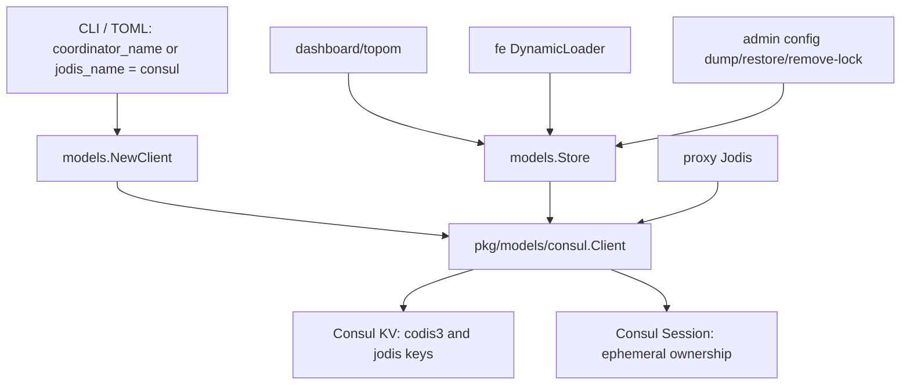

# Consul coordinator SDK upgrade design

## 0. 术语约定

- **Consul Go API**：HashiCorp 当前公开 Go client 模块 `github.com/hashicorp/consul/api`。当前本地 Consul 源码在 `/Users/liyiming/gitcode/consul`，`main` 位于 `744998d099`，本地 tag 包含 Consul `v2.0.0-rc2` 与稳定版 `v1.22.7`；`api` 子模块最新 tag 为 `api/v1.34.2`，`sdk` 子模块最新 tag 为 `sdk/v0.18.1`。本 feature 以 `github.com/hashicorp/consul/api` 为外部 client 依赖入口，不引入 Consul server 主模块，也不直接依赖偏内部用途的 `github.com/hashicorp/consul/sdk`。
- **Consul coordinator client**：新增的 `models.Client` 实现，职责与现有 `pkg/models/zk`、`pkg/models/etcd`、`pkg/models/fs` 同层，用 Consul KV + Session 提供 Codis 元数据读写、目录列表、watch 和 ephemeral 节点语义。
- **Jodis registry**：proxy 启动时把自身地址注册到 `/jodis/{product}/proxy-{token}` 的发现机制，现状由 `pkg/proxy/jodis.go` 通过 `models.Client.CreateEphemeral` 实现。Consul 支持后，Jodis 可使用 `jodis_name = "consul"`。
- **最新 Consul**：生产目标按当前官方稳定版 Consul `1.22.7` 校验；本地 `main` / `v2.0.0-rc2` 源码只用于提前发现 API 兼容风险，不把 RC 行为写成生产承诺。

防冲突结论：当前仓库没有现存 Consul SDK 依赖或调用点；`rg "consul|hashicorp"` 只命中前端第三方包文本。因此用户说的“升级当前项目的 consul sdk”在本仓库实际应落成“新增 Consul coordinator/Jodis 后端并接入最新 Consul Go API”，不是替换已有 Consul 调用。

## 1. 决策与约束

### 需求摘要

目标：让 Codis 可选择 Consul 作为 coordinator 存储和 Jodis 注册后端，依赖入口使用最新 `github.com/hashicorp/consul/api`，调用方式与当前 Consul SDK 保持兼容。

服务对象：使用 Consul 管理基础设施、希望 Codis 元数据和 proxy 发现不再依赖 Zookeeper / Etcd 的运维方。

成功标准：

- `models.NewClient("consul", ...)` 可创建 Consul client，并满足 `models.Client` 的读写、列表、watch、ephemeral 注册语义。
- dashboard / proxy / admin / fe 的 coordinator 参数或配置可选择 `consul`，且旧 `zookeeper` / `etcd` / `filesystem` 行为不变。
- Go module 依赖最小化引入 `github.com/hashicorp/consul/api`，不引入 Consul server 主模块的重依赖。
- 能用本地 `/Users/liyiming/gitcode/consul` 编译出的 Consul server 或已安装 Consul 启动本地 agent，跑通 Codis 对 Consul KV 的最小集成验证。

明确不做：

- 不把默认 coordinator 从 `filesystem`、`zookeeper` 或 `etcd` 改成 `consul`。
- 不迁移已有 Zookeeper / Etcd / filesystem 元数据到 Consul。
- 不引入 Consul service catalog / health check / service mesh 能力；本 feature 只使用 KV 与 Session。
- 不修改 Redis proxy 路由、slot 迁移、Redis 8 Codis Server 协议或业务命令 allow-list。
- 不把 Consul `v2.0.0-rc*` 作为生产依赖目标；RC/main 只作为前向兼容验证输入。

### 复杂度档位

- Robustness = L3（偏离内部工具默认 L2 的原因：coordinator 是 Codis 拓扑状态权威存储，网络失败、会话丢失和外部配置错误必须有明确语义）。
- Structure = modules（偏离 functions 的原因：新增第三方后端应与 `pkg/models/zk` / `etcd` / `fs` 同级隔离，避免把 Consul 细节塞进 `pkg/models/client.go`）。
- Compatibility = backward-compatible（偏离 current-only 的原因：现有 coordinator、配置、CLI、部署入口不能破坏）。
- Testability = tested（偏离 testable 的原因：`models.Client` 语义涉及临时节点和 watch，必须有单元 fake 或本地 Consul 集成验证）。
- Security = validated（偏离 trusted 的原因：Consul 地址、token/auth、TLS 配置来自外部配置，至少要校验格式并避免把 token 打进日志）。

### 关键决策

1. **依赖模块只接 `github.com/hashicorp/consul/api`，不接 `github.com/hashicorp/consul` 主模块。**
   - 依据：本地 Consul 源码中 `api/go.mod` 是独立模块，当前为 `github.com/hashicorp/consul/api`，依赖图显著小于主模块。Codis 只需要 HTTP API client，不需要嵌入 Consul agent。
2. **新增 `pkg/models/consul` 包实现 `models.Client`。**
   - 依据：现有 coordinator 后端按实现隔离在 `pkg/models/{zk,etcd,fs}`，`pkg/models/client.go` 只做工厂路由。继续这个形状可以保持调用方无感。
3. **路径语义保持 Codis 现有 slash path，对 Consul KV 内部做 key normalize。**
   - 现状 Codis store 使用 `/codis3/{product}/...` 和 `/jodis/{product}/...`。
   - Consul `KV.Put` 对前导 `/` 返回 invalid key，`KV.Get/Delete` 会 trim prefix。Consul client 内部应把外部 path 规范化为无前导 `/` 的 KV key，List 返回时再恢复为 Codis path。
4. **ephemeral 节点用 Consul Session + KV Acquire 实现，不直接用普通 KV Put。**
   - 依据：Jodis 依赖 `CreateEphemeral` 返回的 signal 判断注册失效并重试；Consul KV 本身没有 TTL key，Session 才能表达临时所有权。Session 使用 `Behavior: delete`，过期时删除关联 KV，接近 Zookeeper ephemeral node 语义。
5. **watch 用 KV blocking query 实现，按目录 prefix 监听 `LastIndex`。**
   - 依据：Consul Go API 通过 `QueryOptions.WaitIndex` / `WaitTime` 支持 blocking query；当前 `WatchInOrder` 只需要返回初始有序子节点并在变化时关闭 channel，适合用 `KV.Keys(prefix, "/", opts)` 循环等待变化。

## 2. 名词与编排

### 2.1 名词层

#### 现状

- `models.Client`：接口定义在 `pkg/models/client.go`，包含 `Create`、`Update`、`Delete`、`Read`、`List`、`WatchInOrder`、`CreateEphemeral`、`CreateEphemeralInOrder`。
- `models.NewClient`：同文件中按 `"zk"|"zookeeper"`、`"etcd"`、`"fs"|"filesystem"` 返回不同实现。
- Zookeeper / Etcd / filesystem 后端：分别在 `pkg/models/zk/zkclient.go`、`pkg/models/etcd/etcdclient.go`、`pkg/models/fs/fsclient.go`。
- coordinator 路径：`pkg/models/store.go` 定义 `/codis3` 与 `/jodis` 命名空间，调用方按 slash path 读写。
- Jodis：`pkg/proxy/jodis.go` 用 `CreateEphemeral` 注册 proxy 节点，signal 关闭后重新注册。
- CLI/config：dashboard、proxy、admin、fe 的参数当前只承认 zookeeper / etcd / filesystem；proxy 的 `jodis_name` 注释只写 zookeeper / etcd。

#### 变化

- 新增 `pkg/models/consul` 包，提供 `consulclient.Client`，实现 `models.Client`。
- `models.NewClient` 增加 `"consul"` 分支。
- Consul client 新增内部名词：
  - `key(path string) string`：把 Codis path 转为 Consul KV key，拒绝空路径和根路径写入。
  - `path(key string) string`：把 Consul key 转回 Codis slash path。
  - `sessionRecord`：记录 ephemeral path 对应的 Consul session id、renew stop channel 和 signal channel，供 `Delete` / `Close` 清理。
- 配置/CLI 增加 Consul 挂载：
  - `coordinator_name = "consul"` + `coordinator_addr = "127.0.0.1:8500"`。
  - `jodis_name = "consul"` + `jodis_addr = "127.0.0.1:8500"`。
  - `coordinator_auth` / `jodis_auth` 作为 Consul ACL token 使用；不复用 `user:password` 语义。

接口示例：

```go
// 来源：pkg/models/client.go NewClient
client, err := models.NewClient("consul", "127.0.0.1:8500", "CONSUL_HTTP_TOKEN", 20*time.Second)
// 期望：返回实现 models.Client 的 Consul client；addr 缺 scheme 时默认 http，auth 非空时写入 api.Config.Token。
```

```go
// 来源：pkg/models/consul 新增 Client.Create
err := client.Create("/codis3/codis-demo/topom", topomJSON)
// 期望：内部写入 Consul KV key "codis3/codis-demo/topom"；key 已存在时返回“已存在”错误，不覆盖。
```

```go
// 来源：pkg/models/consul 新增 Client.CreateEphemeral
signal, err := client.CreateEphemeral("/jodis/codis-demo/proxy-token", proxyJSON)
// 期望：创建 Consul Session，Acquire 对应 KV；续约失败、session 失效或 Close/Delete 后 signal 关闭。
```

### 2.2 编排层



#### 现状

- dashboard/topom、admin、fe 都通过 `models.NewClient` 获得 coordinator client，再由 `models.Store` 读写 `/codis3/{product}`。
- proxy 有两条路径：通过 dashboard 上线，或通过 coordinator 发现 topom；Jodis 注册也复用 `models.NewClient`。
- `WatchInOrder` 和 `CreateEphemeralInOrder` 当前接口存在，但生产调用只直接命中 Jodis 的 `CreateEphemeral`；`WatchInOrder` 仍是 models 抽象契约，不能因为当前调用少就做成假实现。

#### 变化

- 工厂层：`models.NewClient` 识别 `"consul"`，构造 Consul API client。
- KV 编排：
  - `Create`：用 Consul `KV.CAS` 且 `ModifyIndex=0` 达到 create-if-absent。
  - `Update`：用 `KV.Put` upsert，保持现有 Store 更新语义。
  - `Delete`：默认删除单 key；对目录型删除只在明确需要时评估 `DeleteTree`，避免误删大范围 prefix。
  - `Read`：用 `KV.Get`；key 不存在且 `must=false` 返回 nil。
  - `List`：用 `KV.Keys(prefix+"/", "/", nil)` 列直接子节点，返回 slash path 并排序。
- Watch 编排：
  - 初始 `List` 时记录 Consul `QueryMeta.LastIndex`。
  - 后台 goroutine 使用 `QueryOptions{WaitIndex: lastIndex, WaitTime: timeout}` 做 blocking query。
  - 发现 `LastIndex` 前进或子节点集合变化时关闭 signal；遇到 Close 或 Consul 错误也关闭 signal，让上层按既有重试逻辑处理。
- Ephemeral 编排：
  - 创建 Session：`SessionEntry{Name, TTL, Behavior: api.SessionBehaviorDelete, LockDelay: 0}`。
  - Acquire KV：`KV.Acquire(&api.KVPair{Key, Value, Session: sessionID}, writeOpts)`。
  - 续约：后台调用 `Session.RenewPeriodic(ttl, sessionID, writeOpts, doneCh)`；续约结束或错误时关闭 signal。
  - 清理：`Delete(path)` / `Close()` 先关闭 renew，再 `Session.Destroy`，再删除 KV。

#### 流程级约束

- 错误语义：Consul 网络错误、ACL 拒绝、KV CAS 失败必须向上返回；Jodis 允许上层重试，dashboard/topom 获取 client 失败必须启动失败。
- 幂等性：`Delete` 对不存在 key 不报错；`Close` 可重复调用；ephemeral 清理可重复调用。
- 顺序约束：`CreateEphemeral` 必须先 session 后 acquire；acquire 失败必须 destroy session，避免泄漏。
- 兼容性：旧 coordinator 名称、旧配置文件和旧 CLI 参数保持可用；新增 Consul 参数不改变默认值。
- 安全：Consul token 不写入结构化日志；`auth` 只在 client config 中作为 token 使用。

### 2.3 挂载点清单

- `models.NewClient`：`pkg/models/client.go` — 新增 `"consul"` coordinator 名称注册。
- Consul 后端包：`pkg/models/consul` — 新增 `models.Client` 实现，是本 feature 的核心可卸载点。
- Dashboard coordinator 入口：`cmd/dashboard/main.go` 与 `pkg/topom/config.go` / `config/dashboard.toml` — 新增 `--consul` 或 `coordinator_name = "consul"` 说明。
- Proxy coordinator / Jodis 入口：`cmd/proxy/main.go`、`pkg/proxy/config.go`、`config/proxy.toml` — 新增 `--consul` 与 `jodis_name = "consul"` 说明。
- Admin / FE coordinator 入口：`cmd/admin`、`cmd/fe/main.go` — 新增 Consul 参数以支持 dump/restore/dashboard-list。

### 2.4 推进策略

1. 编排骨架：新增 Consul client 包和 `models.NewClient("consul")` 分支，先用 stub 或最小 KV 操作接通编译。
   退出信号：`go test ./pkg/models/...` 可编译，旧 coordinator 分支无 diff 行为。
2. KV 计算节点：实现 path normalize、Create/Update/Delete/Read/List。
   退出信号：单元测试覆盖前导 slash、create-if-absent、missing read/list 和排序。
3. Session/ephemeral 节点：实现 CreateEphemeral、CreateEphemeralInOrder、Close/Delete 清理和续约 signal。
   退出信号：测试覆盖 acquire 失败清理、Close 幂等、signal 关闭。
4. Watch 节点：实现 WatchInOrder 的初始列表 + blocking query 变化通知。
   退出信号：测试或本地 Consul 集成验证能观察到新增/删除子节点后 signal 关闭。
5. CLI/config 挂载：dashboard/proxy/admin/fe 增加 Consul 参数，默认配置注释补充 Consul。
   退出信号：`--default-config` 输出包含 Consul 说明，旧参数解析测试/编译不受影响。
6. 本地 Consul 验证：按本地源码构建 Consul 或复用本地 Consul binary，启动 dev agent 后跑最小 dashboard/proxy/Jodis KV 验证。
   退出信号：Consul KV 中能看到 `/codis3` 元数据和 `/jodis` proxy 注册，关闭 proxy 后 ephemeral 节点消失或 signal 触发重试。
7. 全量回归：运行项目 Go 测试入口。
   退出信号：`make gotest` 通过；如 Consul 本地构建产生临时产物，在收尾说明清理路径。

### 2.5 结构健康度与微重构

##### 评估

- 文件级 — `pkg/models/client.go`：小文件，职责是 coordinator 工厂路由；本次只增加一个分支，不需要拆分。
- 文件级 — `cmd/dashboard/main.go`、`cmd/proxy/main.go`、`cmd/admin/admin.go`、`cmd/fe/main.go`：这些入口已经按 coordinator 分支解析 CLI，本次每处只追加 Consul 分支；存在重复模式，但跨入口统一抽象会改变 CLI 组织方式，超出“只搬不改行为”。
- 文件级 — `pkg/proxy/config.go`、`pkg/topom/config.go`：配置结构未膨胀，本次主要改注释和默认模板。
- 目录级 — `pkg/models/`：现有后端包为 `zk`、`etcd`、`fs`，新增 `consul` 符合同级目录模式；未达到需要重组目录的阈值。
- 目录级 — `cmd/`：不新增入口目录，只改现有命令。

##### 结论：不做微重构

原因：新增 Consul 后端能按现有 coordinator 后端模式落入 `pkg/models/consul`，其他入口都是小范围挂载。虽然 CLI coordinator 参数解析存在重复，但抽公共解析会涉及多个命令入口行为边界，不属于本 feature 必须的安全微重构。

##### 超出范围的观察

- `cmd/dashboard`、`cmd/proxy`、`cmd/admin`、`cmd/fe` 的 coordinator 参数解析重复。建议后续如继续扩 coordinator 类型，可单独走 `cs-refactor` 抽公共解析；本 feature 不把这个作为前置依赖。

## 3. 验收契约

关键场景清单：

- 触发：`models.NewClient("consul", "127.0.0.1:8500", "", timeout)`。期望：返回可用 client；`"zk"` / `"zookeeper"` / `"etcd"` / `"fs"` / `"filesystem"` 旧分支仍可用。
- 触发：对 Consul client 执行 `Create("/codis3/p/topom", data)` 两次。期望：第一次成功，第二次返回已存在错误，已有值不被覆盖。
- 触发：执行 `Update` 后 `Read`。期望：读回的 bytes 与写入一致；`Read(missing, false)` 返回 nil；`Read(missing, true)` 返回错误。
- 触发：在同一 prefix 下写入多个 key 后 `List(prefix, false)`。期望：返回直接子节点 slash path，排序稳定，不返回孙节点为普通文件。
- 触发：`CreateEphemeral("/jodis/p/proxy-x", data)` 后关闭 client 或删除 path。期望：Consul session 被销毁，KV 节点被删除，返回 signal 关闭。
- 触发：`WatchInOrder("/jodis/p")` 后新增或删除 proxy key。期望：初始列表正确，变化后 watch channel 关闭。
- 触发：dashboard 配置 `coordinator_name = "consul"` 并连接本地 Consul dev agent。期望：topom 元数据写入 Consul KV 的 `codis3/{product}` 前缀。
- 触发：proxy 配置 `jodis_name = "consul"`。期望：proxy 注册写入 Consul KV 的 `jodis/{product}` 前缀，关闭 proxy 后注册节点消失或被 session 清理。
- 触发：运行 `make gotest`。期望：现有 cmd/pkg 测试通过；不需要 Docker daemon。

明确不做的反向核对项：

- `go.mod` 不应引入 `github.com/hashicorp/consul` 主模块作为 Codis 依赖。
- 默认 `config/dashboard.toml` 仍使用 `coordinator_name = "filesystem"`。
- 不应修改 `pkg/proxy/mapper.go`、Redis slot 迁移逻辑或 Redis 8 `extern/redis-8.6.3` 源码。
- 不应出现 Consul catalog、health check、service mesh API 调用。

## 4. 与项目级架构文档的关系

acceptance 阶段需要更新 `.codestable/architecture/ARCHITECTURE.md`：

- 在术语或结构交互中补充 Coordinator / Store 现在支持 Consul KV + Session 后端。
- 在代码锚点补充 `pkg/models/consul`。
- 在已知约束中说明 Consul 后端只覆盖 KV / Session 语义，不代表使用 Consul service catalog 或 mesh。

需求文档 `.codestable/requirements/redis-cluster-service.md` 可在验收阶段补充一条实现进展：外部 coordinator 从 filesystem/Zookeeper/Etcd 扩展为可选 Consul，但默认和迁移边界不变。
