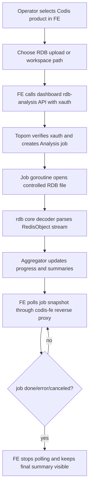

# rdb-analysis-dashboard design

## 0. 术语约定

- **RDB analysis**：本 feature 指基于 `github.com/hdt3213/rdb` 解析 RDB 文件，输出内存概览、按类型/DB 聚合、big keys、hot keys、prefix 聚合和 flamegraph 数据。它不是 Redis 在线命令兼容，也不是迁移链路里的 `SLOTSRESTORE` RDB fragment。
- **Analysis job**：dashboard 进程内的单次 RDB 分析任务。任务有 id、输入来源、参数、进度、状态、错误和最新结果快照。
- **Live view**：浏览器页面发起任务后轮询 dashboard API，持续刷新进度和部分聚合结果。这里的“实时”不是 Redis keyspace 变更实时订阅，而是 RDB 文件解析过程中的实时进度展示。
- **Input source**：RDB 文件进入 dashboard 的方式。首版支持浏览器上传 RDB 文件，以及分析 dashboard 主机上受限目录内的 RDB 文件。
- **Remote snapshot acquisition**：由 dashboard 直接对某个 Redis Server 执行 `BGSAVE`、取回远端文件或实现 replication stream 获取 RDB。该能力首版不做。

防冲突结论：Codis 已有 `Stats`/`InfoFull` 用于在线 Redis 指标，本文的 `RDB analysis` 只读 RDB 文件并生成离线内存分析视图，不替代现有实时 stats。

## 1. 决策与约束

### 需求摘要

本 feature 要把 `/Users/liyiming/gitcode/rdb` 对应的 `github.com/hdt3213/rdb` 分析能力接入 Codis 浏览器页面。运维者可以在 Codis FE 选中一个 product 后上传 RDB 文件或选择 dashboard 允许目录内的 RDB 文件，启动分析任务，并在页面上看到解析进度、总 key/size、DB/type 分布、top big keys、top hot keys、prefix 聚合和 flamegraph 数据。

成功标准：

- FE 页面有 RDB Analysis 区域，能启动任务、查看 running/done/error/canceled 状态，并在任务运行中刷新已解析对象数、已读字节、总内存估算和 top 列表。
- dashboard API 负责接收输入、创建任务、读取任务快照、取消任务和清理任务；所有 RDB analysis API 都走现有 `xauth` 鉴权。
- 分析过程不阻塞 `RefreshRedisStats`、slot migration、proxy sync 等 topom 主流程；同一 dashboard 的并发分析任务数量受配置限制。
- `rdb` 依赖只接入 Go 后端；浏览器不直接解析大 RDB 文件，不把完整 key/value JSON 常驻前端内存。
- feature 可以被拔掉：删除 API 路由、analysis job manager、FE 区域和 Go module 依赖后，Codis 原有 dashboard/proxy/server 行为不变。

假设：

- 首版使用 `github.com/hdt3213/rdb` v1.3.2 对应的本地 clone `v1.3.2-0-g7ebe18a`。实现时 `go.mod` 应依赖正式 module 版本；如必须使用本地未发布改动，只在开发环境临时使用 `replace`，不要把 `/Users/liyiming/gitcode/rdb` 这类绝对路径提交进仓库。
- 首版的输入是“已有 RDB 文件”。如果产品目标是“点击某个 Codis Server 后自动生成并抓取 RDB”，那是另一个更大的数据采集 feature，需要先设计远端文件获取、权限和生产风险。

明确不做：

- 不在 proxy 业务请求路径中解析 RDB，不改 proxy 命令 allow-list，不向业务客户端暴露新 Redis 命令。
- 不让浏览器直接解析 RDB 文件；浏览器只负责上传、发起任务、轮询和展示。
- 不自动对后端 Redis 执行 `BGSAVE`/`SAVE`，不读取 Redis Server 机器上的任意文件，不实现 replication stream RDB 抓取。
- 不把分析结果写入 coordinator；任务状态只属于当前 dashboard 进程，dashboard 重启后任务消失。
- 不生成完整 JSON/AOF 转换结果供前端展示；这类输出可能非常大，不适合放进 dashboard 页面首版。
- 不复用 `rdb` 的 `flamegraph` 独立 web server。Codis 需要返回 flamegraph JSON 数据，由现有 FE 页面渲染或后续补专用渲染器。
- 不修改 Redis 8 Codis Server 的 RDB 格式或持久化逻辑。

### 复杂度档位

走“运维观测 + 大文件后台任务”档位：

- Compatibility = backward-compatible：默认不开启远端采集，不改变现有 dashboard/FE/proxy 行为。
- Robustness = bounded：需要限制上传大小、任务并发、结果保留数量和内存中 top 列表规模。
- Security = validated：文件路径输入必须限制在配置目录内，API 继续使用 `xauth`，错误信息不能回显任意主机路径细节。
- Observability = logged：任务开始、完成、取消、失败、输入大小和耗时进入 dashboard 日志；不引入新 metrics 系统。
- Testability = tested：后端用 `rdb` cases 覆盖聚合和 API 状态机，前端用轻量手工/静态验证覆盖按钮状态和轮询。

### 关键决策

1. **分析任务放在 dashboard/topom，不放在 `codis-fe` 或 proxy**。
   - 依据：`cmd/fe` 当前只提供静态资源和按 product reverse proxy 到 dashboard，见 `cmd/fe/main.go:146` 到 `cmd/fe/main.go:167`；dashboard 已承载所有管理 API，见 `pkg/topom/topom_api.go:72` 到 `pkg/topom/topom_api.go:123`。
   - 被拒方案：把分析后端放在 `codis-fe`。这会让 FE 进程开始持有业务级任务状态，同时绕过 dashboard 的 product/xauth 管理边界。

2. **用 dashboard API + FE 轮询实现 live view，不引入 WebSocket/SSE**。
   - 依据：现有 `dashboard-fe.js` 已通过 `$http.get` 定时刷新 stats，见 `cmd/fe/assets/dashboard-fe.js:730` 到 `cmd/fe/assets/dashboard-fe.js:743`。轮询足够表达“解析进度”和 top 列表变化，改动低。
   - 被拒方案：新增 WebSocket。收益有限，会引入连接生命周期、reverse proxy 和浏览器兼容复杂度。

3. **直接使用 `rdb/core` 和 `rdb/model` 做流式聚合，而不是调用 CLI 或文件输出 helper**。
   - 依据：`/Users/liyiming/gitcode/rdb/cmd.go` 是 `package main`，根命令只适合编译 CLI；`helper.MemoryProfile` 等函数以输入路径和输出文件为核心，最终写 CSV，不暴露实时进度，见 `/Users/liyiming/gitcode/rdb/helper/memory.go:15` 到 `/Users/liyiming/gitcode/rdb/helper/memory.go:73`。
   - 变化：Codis 新增自己的 analysis aggregator，使用 `parser.NewDecoder` / `core.NewDecoder` 解析 `model.RedisObject`，按对象更新 job snapshot。

4. **首版只支持受控文件输入，不自动抓远端 Redis 快照**。
   - 依据：Codis dashboard 目前能通过 Redis 协议拿 `INFO`/`CONFIG`/slot 命令，但没有跨机器读取 Redis `dir/dbfilename` 文件的通道。`BGSAVE` 只会把文件写在 Redis Server 本机，dashboard 不一定同机，也不应该任意读远端文件。
   - 后续如果要做自动采集，应单独设计“replication stream 抓取 RDB”或“agent/对象存储上传”路径。

5. **分析结果保留摘要和 top N，不保留完整 key 列表**。
   - 依据：大 RDB 可能有千万级 key，完整结果会拖垮 dashboard 内存和浏览器。首版只保留聚合和 top N，N 由请求参数/配置限制。

## 2. 名词与编排

### 2.1 名词层

#### RDB analysis job

现状：

- `Topom` 维护 topology、stats、HA、slot action 等状态，结构见 `pkg/topom/topom.go`。没有通用后台任务 registry。
- dashboard API 主要是同步请求/响应；stats 刷新虽有 goroutine，但只把结果放进 `s.stats`。

变化：

- 新增 `RDBAnalysisManager`，挂在 `Topom` 内存态下，负责 job id 分配、并发限流、任务生命周期、结果快照和过期清理。
- 新增 `RDBAnalysisJob`，状态为 `queued/running/done/error/canceled`，字段包含：

```text
id, created_at, updated_at, status, source, options,
file_size, bytes_read, objects_read, db_count, total_size,
type_summary[], db_summary[], top_big_keys[], top_hot_keys[],
prefix_summary[], flamegraph, error
```

- `source` 只记录安全摘要，例如 `upload:dump.rdb` 或 `workspace:daily/dump.rdb`，不向前端暴露 dashboard 本地绝对路径。

#### RDB analysis options

现状：

- `rdb` CLI 支持 `memory/json/aof/bigkey/hotkey/prefix/flamegraph`，以及 `-n`、`-regex`、`-expire`、`-size`、`-prefix-sep`、`-max-depth` 等参数，见 `/Users/liyiming/gitcode/rdb/cmd.go:12` 到 `/Users/liyiming/gitcode/rdb/cmd.go:57`。

变化：

- 首版 UI/API 暴露保守参数：

```text
top_n: bigkey/hotkey/prefix 返回条数，上限由配置控制
prefix_separators: prefix/flamegraph 的 key 分隔符，默认 ":"
max_depth: prefix/flamegraph 最大层级，0 表示默认
regex: 可选 key 过滤
include_expired: 是否包含已过期 key，默认 false
```

- `json` / `aof` / 完整 memory CSV 不进入首版 API。需要导出 CSV 时另开 download/export 任务，不混进 live dashboard。

#### Dashboard API 契约

现状：

- `/api/topom` 下已有 `stats`、`slots`、`proxy`、`group`、`sentinels` 等路由，写操作使用 `xauth`，见 `pkg/topom/topom_api.go:72` 到 `pkg/topom/topom_api.go:123`。
- `ApiClient` 已为 dashboard HTTP API 提供 Go 调用封装，见 `pkg/topom/topom_api.go:758` 到 `pkg/topom/topom_api.go:810`。

变化：

- 新增一组 `rdb-analysis` 路由：

```text
POST /api/topom/rdb-analysis/upload/:xauth
  multipart: file + options
  -> {id}

PUT /api/topom/rdb-analysis/start/:xauth
  json: {path, options}
  -> {id}

GET /api/topom/rdb-analysis/:xauth/:id
  -> RDBAnalysisJob snapshot

PUT /api/topom/rdb-analysis/cancel/:xauth/:id
  -> "OK"

PUT /api/topom/rdb-analysis/remove/:xauth/:id
  -> "OK"
```

- `GET` 是否要求 `xauth`：建议要求。RDB key 名可能包含业务信息，不能复用 `/topom/stats` 这类无鉴权读接口。

#### FE 展示模型

现状：

- FE 是 AngularJS 单页，核心逻辑集中在 `cmd/fe/assets/dashboard-fe.js`，主页面集中在 `cmd/fe/assets/index.html`。选中 product 后通过 `concatUrl(..., codis_name)` 加 `?forward=` 让 `codis-fe` 反向代理到对应 dashboard。

变化：

- 新增 RDB Analysis 页面区域或 tab，复用现有 product 选择和 `xauth` 生成逻辑。
- FE state 至少包含 `rdb_current_job`、`rdb_options`、`rdb_upload_file`、`rdb_poll_timer`、`rdb_flame_rows`；首版只展示当前任务，不维护历史 job 列表。
- 任务运行时每 1-2 秒拉取 job snapshot；切换 product 或任务结束时停止旧轮询。

### 2.2 编排层



现状：

- 浏览器只能看到 dashboard stats、proxy、group、slots、sentinel 状态。Redis 内存聚合只来自 `INFO keyspace` 和 `used_memory`，无法回答“哪些 key/prefix/type 占内存”。
- `rdb` 已能逐对象解析 RDB 并估算对象大小；`parser.NewDecoder` 暴露的是解码入口，`model.RedisObject` 暴露 `GetDBIndex/GetKey/GetType/GetSize/GetElemCount/GetEncoding/GetExpiration`，见 `/Users/liyiming/gitcode/rdb/parser/portal.go:28` 到 `/Users/liyiming/gitcode/rdb/parser/portal.go:51`。

变化：

- dashboard 初始化时创建 `RDBAnalysisManager`，并在 Close 时取消运行中的任务。
- API 收到上传文件后先落入配置目录下的临时文件，再创建 job；本地 path 模式必须通过 `filepath.Clean` 和前缀检查限制在配置目录。
- job goroutine 用带 cancel 的 reader 解析 RDB。每解析一个 object 就更新对象计数、总 size、DB/type 聚合、top N big keys、LFU hot keys、prefix 聚合和 flamegraph tree；每隔固定对象数或时间刷新 `updated_at`。
- FE 按 job snapshot 渲染表格、进度条、错误提示和 flamegraph 数据。flamegraph 渲染首版可以先展示树形/表格；如果接入 D3 flamegraph，应把相关 JS/CSS 作为 FE 静态资源，不启动 `rdb/d3flame.Web` 独立服务。

流程级约束：

- **鉴权**：创建、取消、删除、读取 job 都要求 `xauth`。分析结果可能包含 key 名，不能走无鉴权 `/topom` 读接口。
- **路径安全**：本地 path 只能指向 `rdb_analysis_workspace` 下的文件；响应只显示相对路径或原始文件名。
- **资源边界**：配置项限制 `max_upload_size`、`max_concurrent_jobs`、`max_jobs_retained`、`max_top_n`；超过限制返回普通 API error，不 panic。
- **取消语义**：取消只保证停止后续解析和释放文件句柄；已经上传的临时文件按清理策略删除。
- **并发**：job snapshot 用短锁复制；解析和聚合不能持有 topom 全局 `s.mu`。
- **错误语义**：非 RDB 文件、RDB version 不支持、io error、参数非法都进入 job `error` 状态，并在 API 返回中给出可读错误。
- **可观测性**：任务开始/结束/失败/取消记录 product、job id、source 摘要、文件大小、耗时和对象数。

### 2.3 挂载点清单

- `pkg/topom/topom_api.go` route registry：新增 `/api/topom/rdb-analysis/...` 路由。删除该挂载点后浏览器/API 无法访问 RDB 分析能力。
- `pkg/topom` 新增 RDB analysis manager/aggregator：承载任务状态、解析和聚合。删除该挂载点后 API 没有后端计算能力。
- `pkg/topom/config.go` 与 `config/dashboard.toml`：新增 analysis workspace、上传大小、并发、保留任务数等配置。删除该挂载点后无法安全限制文件输入和资源使用。
- `cmd/fe/assets/index.html`、`cmd/fe/assets/dashboard-fe.js`、必要 CSS/JS 静态资源：新增浏览器入口、任务操作和结果展示。删除该挂载点后能力仍可通过 API 使用，但 FE 不可见。
- `go.mod` / `go.sum`：新增 `github.com/hdt3213/rdb` 依赖。删除该挂载点后后端无法编译分析器。

不列为挂载点：

- `cmd/fe/main.go`：现有 reverse proxy 已能转发 `?forward=` 的 API 请求，首版不需要改。
- `pkg/proxy`：RDB analysis 不在业务 Redis 协议路径上，不需要改。
- `extern/redis-8.6.3`：首版只读已有 RDB 文件，不改 Redis 持久化格式。

### 2.4 推进策略

1. **后端 API 骨架**：在 dashboard 下接入 `rdb-analysis` 路由和 job 状态机，先用 fake job 返回 queued/running/done。
   - 退出信号：FE 或 `curl` 可创建 job、查询 job、取消 job，`xauth` 错误会被拒绝。

2. **RDB 流式解析与聚合**：使用 `rdb/core`、`rdb/model` 解析本地测试 RDB，生成 progress、summary 和 top N。
   - 退出信号：用 `/Users/liyiming/gitcode/rdb/cases/memory.rdb` 或同类 fixture 可得到稳定的 key count、type summary、big key 列表。

3. **安全输入与配置**：接入上传/受控 path 输入、workspace、大小限制、并发限制和任务清理。
   - 退出信号：非法路径、超大文件、超过并发都返回明确 API error；合法上传能启动任务。

4. **FE 静态结构**：在现有 dashboard 页面加入 RDB Analysis 区域，能选择输入、设置参数、显示任务状态。
   - 退出信号：选中 product 后页面出现分析入口；未选 product 或参数非法时按钮禁用。

5. **FE 轮询与展示**：接通任务创建、轮询、取消、错误展示和结果表格/图形。
   - 退出信号：运行中任务能周期性刷新 progress，完成后停止轮询并展示最终结果。

6. **依赖与文档收口**：最小更新 `go.mod/go.sum`、dashboard 默认配置和用户说明。
   - 退出信号：不含本机绝对 `replace`；配置模板说明默认限制；文档说明首版不自动抓远端 Redis RDB。

7. **验证覆盖**：补齐后端单测、API 状态机测试和 FE 手工验收路径。
   - 退出信号：`go test ./pkg/topom -run RDBAnalysis` 与 `make gotest` 可通过；本地 FE 能完成一次小 RDB 上传分析。

### 2.5 结构健康度与微重构

##### 评估

- compound convention：已检索 `.codestable/compound`，无目录组织 / 文件归属 / 命名约定类命中。
- 文件级 — `pkg/topom/topom_api.go`：约 1006 行，已经偏胖，路由、handler 和 `ApiClient` 都在同一文件。本 feature 只在 route registry 加少量路由，handler 方法放新文件，避免继续膨胀。
- 文件级 — `pkg/topom/topom.go`：约 467 行，`Topom` struct 已承载多个子系统状态。本 feature 只新增一个 analysis manager 字段和初始化/关闭钩子，不把任务逻辑写进该文件。
- 文件级 — `pkg/topom/config.go`：约 163 行，配置职责集中；新增少量配置字段和默认模板是自然扩展。
- 文件级 — `cmd/fe/assets/dashboard-fe.js`：约 1303 行，偏胖，集中所有 AngularJS controller 逻辑。本 feature 应新增 `rdb-analysis.js` 并在 `index.html` 引入，只在主 controller 暴露最小挂接状态。
- 文件级 — `cmd/fe/assets/index.html`：约 774 行，已经偏胖但页面结构目前集中在单文件。首版只能加一个清晰 section；把全站页面拆模板超出本 feature。
- 目录级 — `pkg/topom`：约 20 个 Go 文件，已有按 topom 子领域拆文件的风格；新增 `topom_rdb_analysis.go`、`topom_rdb_analysis_api.go`、`topom_rdb_analysis_test.go` 符合当前风格。
- 目录级 — `cmd/fe/assets`：应用自有源文件只有 `index.html`、`dashboard-fe.js`、`css/main.css`，可以新增一个自有 JS 文件承载 RDB analysis 逻辑；不移动 `node_modules`。

##### 结论：不做前置微重构

本次不做单独“只搬不改行为”的微重构。原因：FE 和 `topom_api.go` 的偏胖是真问题，但可以通过新文件承载新逻辑，把既有大文件改动限制在挂载点；拆现有 Angular controller 或 dashboard API 文件会牵动大量行为，收益不抵首版接入风险。

##### 超出范围的观察

- `cmd/fe/assets/dashboard-fe.js` 已经混合 stats、proxy、group、sentinel、slot action 和交互弹窗。后续继续加页面时，建议单独走 `cs-refactor` 把 FE controller 拆成按功能分文件的结构。
- `pkg/topom/topom_api.go` 同时承担路由、handler 和 Go API client。后续如果 API 继续扩展，建议单独整理 API handler 与 client 文件边界。

## 3. 验收契约

### 关键场景清单

- 触发：在 FE 选中 product，上传一个小 RDB 文件并点击开始分析。期望：创建 job 成功，页面显示 running，进度持续变化，完成后展示 total size、key count、type summary、big keys。
- 触发：使用 dashboard workspace 内的合法相对路径启动分析。期望：任务成功读取文件；API 响应不暴露绝对路径。
- 触发：传入 workspace 外路径，例如 `../../etc/passwd`。期望：API 返回错误，不创建 job，不读取文件。
- 触发：上传超过 `max_upload_size` 的文件。期望：API 返回错误，临时文件不保留或被清理。
- 触发：并发创建超过 `max_concurrent_jobs` 的任务。期望：超出的请求返回明确错误，已有任务不受影响。
- 触发：上传非 RDB 文件。期望：job 进入 `error` 状态，错误说明类似 `file is not a RDB file`，dashboard 不 panic。
- 触发：运行中点击取消。期望：job 进入 `canceled`，文件句柄释放，FE 停止轮询或显示已取消。
- 触发：分析包含 LFU 信息的 RDB。期望：hot key 表返回按 freq 降序的条目；无 LFU 信息时 hot key 表为空并显示正常状态。
- 触发：prefix separator 设置为 `:`，max depth 设置为 2。期望：prefix summary 只返回受 depth 限制的 top prefix。
- 触发：切换 Codis product。期望：旧 product 的 RDB job 轮询停止，新 product 不复用旧 job 结果。
- 触发：`go test ./pkg/topom -run RDBAnalysis`。期望：job 状态机、路径校验、聚合器、取消路径测试通过。
- 触发：`make gotest`。期望：现有 cmd/pkg 测试不因新增依赖和配置字段失败。

### 明确不做的反向核对项

- Diff 不应修改 `pkg/proxy` 的命令处理、router、backend 或 Redis 协议 mapper。
- Diff 不应在 `cmd/fe` 中实现后端分析任务；`cmd/fe` 仍只负责静态资源和 reverse proxy。
- Diff 不应向 coordinator 写入 RDB analysis job 或结果。
- Diff 不应提交指向 `/Users/liyiming/gitcode/rdb` 的绝对路径 `replace`。
- Diff 不应自动执行 `BGSAVE`、`SAVE`、`CONFIG GET dir` 后读取远端文件，或实现 Redis replication stream 抓取。
- Diff 不应把完整 JSON/AOF/全量 key 列表返回给浏览器作为首版行为。

## 4. 与项目级架构文档的关系

本 feature 完成并验收后，acceptance 阶段应更新 `.codestable/architecture/ARCHITECTURE.md`：

- 在 FE/dashboard 交互中补充：Codis FE 可通过 dashboard API 启动 RDB analysis job 并轮询结果。
- 在 dashboard/topom 内存状态中补充：topom 持有进程内 RDB analysis manager，任务不进入 coordinator，dashboard 重启后任务消失。
- 在已知约束中补充：RDB analysis 首版只分析已有 RDB 文件，不自动从远端 Redis Server 生成或拉取 RDB；分析结果可能包含 key 名，需要 `xauth`。
