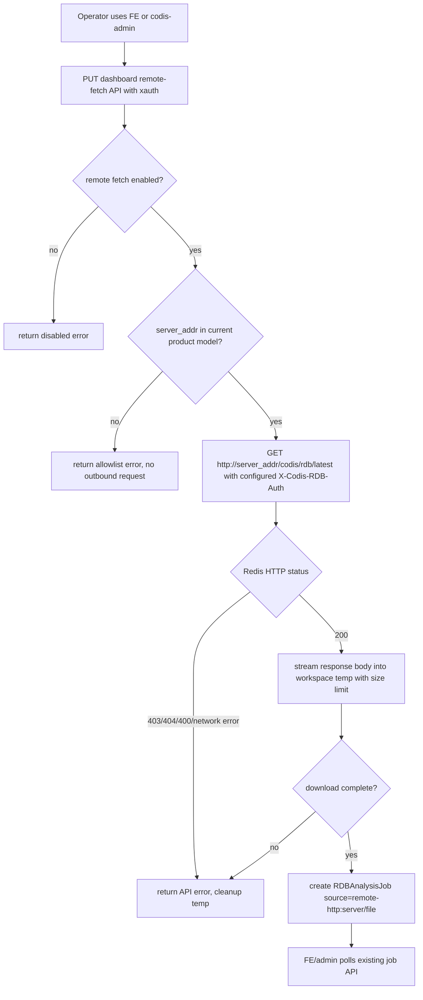

# rdb-remote-transfer-analysis design

## 0. 术语约定

- **Remote RDB fetch analysis**：本 feature 指 dashboard/topom 收到用户请求后，从当前 product 内某个 Redis 8 Codis Server 的 `GET /codis/rdb/latest` 拉取已有 RDB 文件，落入 dashboard 受控临时文件，再复用现有 RDB Analysis job 解析。它是“dashboard 拉取远端 Redis RDB 后分析”，不是远端机器主动上传。
- **RDB HTTP export**：已由 `2026-06-01-redis8-rdb-http-export` 实现的 Redis 8 Codis Server 能力。它默认关闭，开启后只接受精确 `GET /codis/rdb/latest` 和 `X-Codis-RDB-Auth` header，返回当前 `server.rdb_filename` 对应的已有本机 RDB 文件。实现锚点在 `extern/redis-8.6.3/src/codis_rdb_export.c`。
- **Remote fetch request**：dashboard RDB Analysis 新增的一次性拉取请求。请求携带目标 `server_addr` 和 `RDBAnalysisOptions`；Redis export auth 来自 dashboard 持久化配置，不从请求体传入。
- **Product server allowlist**：目标 `server_addr` 必须精确匹配当前 topom model 中的 group server 地址。它不是任意 URL 拉取器，避免把 dashboard API 扩成 SSRF 通道。
- **Remote source**：远端拉取成功后写入 `RDBAnalysisJob.Source` 的安全摘要，例如 `remote-http:10.0.0.12:6379/dump.rdb`。它不包含 export auth、URL query 或 dashboard 本地临时路径。
- **RDB Analysis job id**：`RDBAnalysisJob.ID` 的外部可见标识。所有新创建的 RDB Analysis job id 都必须由 `github.com/google/uuid` 的 `uuid.NewV7()` 生成 UUID v7 字符串；不得使用 `uuid.NewString()`，因为它默认生成随机 UUID v4。

防冲突结论：本方案只保留 dashboard pull Redis 8 RDB HTTP export 这一条路径，不再包含 tus push、远端 Go uploader 或断点续传设计。

## 1. 决策与约束

### 需求摘要

现有 RDB Analysis 只能分析浏览器上传到 dashboard 的文件，或 dashboard 本机 `rdb_analysis_workspace` 下的文件。Redis 8 Codis Server 现在已经能通过默认关闭的 RDB HTTP export 暴露本机当前 `dbfilename` 的已有 RDB。用户希望把这两个能力接起来：值班人员在 dashboard/FE 或 `codis-admin` 指定一个当前 product 内的 Redis server 后，dashboard 自动拉取该 server 当前 RDB 并启动现有 RDB Analysis。

成功标准：

- dashboard 可通过配置开启 remote fetch API；开启后，合法 `xauth` 请求能从当前 product 内的 Redis 8 server 拉取 `GET /codis/rdb/latest`，下载完成后返回现有 `RDBAnalysisJob` id，且该 id 为 UUID v7。
- 拉取过程按流式 copy 写入 dashboard 受控临时文件，不把完整 RDB 常驻内存；大小限制复用 `rdb_analysis_max_upload_size`。
- 拉取成功后 job 的 `source` 是安全摘要，分析结果、取消、删除和轮询都复用现有 `RDBAnalysisJob` API。
- 错误 `xauth`、未开启 remote fetch、目标 server 不属于当前 product、错误 export auth、Redis export 404、超限文件、下载中断都返回明确错误，并清理未完成临时文件。
- FE 提供轻量入口触发 remote fetch；remote fetch 失败时错误要在 RDB Analysis 页面内可见，不只依赖浏览器 alert；`codis-admin` 提供自动化入口触发同一 dashboard API 并打印 job id。
- 现有 browser multipart upload、workspace path、job get/cancel/remove 行为保持兼容。

假设：

- 目标 Redis Server 是 Redis 8 Codis Server，并已按 `2026-06-01-redis8-rdb-http-export` 开启 `codis-rdb-export-enabled yes` 与非空 `codis-rdb-export-auth`。
- dashboard 网络上能访问当前 product 内 Redis server 的 Redis 端口。首版按普通 `http://server_addr/codis/rdb/latest` 设计；TLS 终止、反向代理和证书管理属于部署层或后续功能。
- 首版假设同一 dashboard product 内的目标 Redis Server 共享同一个 RDB export auth；该密钥写在 dashboard 本地配置中，不进入 coordinator。
- Redis export 只返回已经存在的当前 `dbfilename` RDB。需要强制生成快照时，由用户在 Redis 运维流程中先完成 `BGSAVE`/备份生成，本 feature 不编排。

明确不做：

- 不使用 tusd、不新增 tus endpoint、不实现断点续传、Range request 或 resume state。
- 不让远端机器上的 Go client 读取任意本地路径后主动上传到 dashboard。
- 不使用 `scp`、`rsync`、SSH、NFS 或共享目录作为传输通道。
- 不执行或触发 `SAVE`、`BGSAVE`、replication stream RDB 抓取，也不调用 Redis 侧 RDB save 函数。
- 不允许请求传任意 URL、任意路径、query auth 或跨 product server；目标必须是当前 topom model 中的 server addr。
- 不允许请求体、URL、FE local storage 或 `codis-admin` flag 临时传 export auth；export auth 只来自 dashboard 持久化配置。
- 不把 export auth 写入 coordinator、analysis job、API response、FE 页面状态或日志。
- 不修改 proxy 业务请求路径，不新增 Redis 命令，不修改已实现的 Redis 8 RDB HTTP export C 代码。

### 复杂度档位

走“受控运维大文件拉取 + 后台分析任务”档位，偏离默认项如下：

- Robustness = L3：输入来自 dashboard API 和远端 Redis HTTP response，必须校验 xauth、server allowlist、status code、Content-Length、大小上限、临时文件清理和取消路径。
- Security = validated：remote fetch 是 dashboard 发起的出站请求，必须禁止任意 URL、禁止 redirect 泄漏 auth、禁止密钥出现在 URL/API/job source/日志。
- Performance = streaming：RDB 可能很大，下载只允许流式写临时文件，不能整体读入内存。
- Compatibility = additive：只新增 remote fetch 入口；关闭或不用该入口时，现有 RDB Analysis、proxy、Redis 协议和 HTTP export 行为不变。
- Observability = logged：记录 server addr、source 摘要、content length、下载耗时、job id 和错误类型；日志不打印 export auth。

### 关键决策

1. **只使用 dashboard pull 对接 Redis 8 RDB HTTP export**。
   - 依据：已实现的 `RDB HTTP export` 是 Redis server 端固定 GET 下载口，首版没有 Range/断点续传，也不支持远端主动 push。继续保留第二套传输协议会和已落地能力重叠。
   - 变化：dashboard 在 RDB Analysis API 内新增 remote fetch 分支，通过 Go 标准库 HTTP client 拉取 Redis export response body。

2. **目标只允许当前 product 的 group server addr，不接受任意 URL**。
   - 依据：dashboard/topom 已持有当前 product 的拓扑模型，RDB Analysis 也按 product/xauth 隔离。让用户传任意 URL 会把管理 API 变成内网 SSRF 工具。
   - 变化：API 请求只传 `server_addr`，handler 在发起 HTTP 前遍历当前 topom model groups 做精确匹配；不匹配直接拒绝，且不发出网络请求。

3. **export auth 使用 dashboard 持久化配置，不走每次请求**。
   - 依据：用户已确认希望密钥配置持久化；remote fetch 是 dashboard 代表当前 product 发起的运维动作，不应让 FE/API/CLI 每次携带密钥并扩大泄漏面。
   - 变化：dashboard 配置新增 `rdb_analysis_remote_fetch_auth`，开启 remote fetch 时必须非空；API body 不包含 export auth，FE 和 `codis-admin` 都不接收该密钥。

4. **下载完整后再创建 analysis job，不新增 transfer job 状态机**。
   - 依据：现有 `StartUpload` 已是“HTTP request 完成上传后创建 job”的语义；RDB parser 只读取完整文件。新增独立 transfer manager 会扩大状态、轮询 API 和清理逻辑。
   - 变化：remote fetch API 在 handler 生命周期内下载到临时文件，成功后调用 manager 的受控 reader/file 入口创建 job；下载失败时不创建 job。
   - 取舍：下载阶段 FE 只能看到 request pending，看不到 job 进度；真正的解析进度仍由现有 job 轮询展示。若以后要展示下载进度，再单独设计 remote transfer 状态机。

5. **FE 和 `codis-admin` 都只是同一 API 的薄入口**。
   - 依据：FE 面向值班人员手工操作，`codis-admin` 面向自动化脚本；两者不应各自实现下载/上传路径。
   - 变化：两端都调用 dashboard remote fetch API，由 dashboard 负责 product 校验、HTTP export 拉取、大小限制和 job 衔接。

## 2. 名词与编排

### 2.1 名词层

#### RDB analysis remote fetch config

现状：

- dashboard 只有 RDB Analysis 基础配置：`rdb_analysis_workspace`、`rdb_analysis_max_upload_size`、`rdb_analysis_max_concurrent_jobs`、`rdb_analysis_max_jobs_retained` 和 `rdb_analysis_max_top_n`，字段在 `pkg/topom/config.go` 的 `Config`。

变化：

- 新增 dashboard 配置，默认关闭 remote fetch：

```text
rdb_analysis_remote_fetch_enabled = false
rdb_analysis_remote_fetch_auth = ""
rdb_analysis_remote_fetch_timeout = "30m"
rdb_analysis_remote_fetch_max_concurrent = 1
```

- `rdb_analysis_remote_fetch_enabled=false` 时，新 API 返回 disabled 类错误，不影响 upload/workspace。
- `rdb_analysis_remote_fetch_auth` 是 dashboard 本地持久化的 Redis export auth；开启 remote fetch 时必须非空，`Config` JSON/API 输出中隐藏该字段。
- `rdb_analysis_remote_fetch_timeout` 约束单次从 Redis HTTP export 拉取 response body 的最长时间。
- `rdb_analysis_remote_fetch_max_concurrent` 约束 dashboard 同时进行的 remote fetch 数；RDB 解析 job 并发仍由 `rdb_analysis_max_concurrent_jobs` 控制。
- 文件大小上限复用 `rdb_analysis_max_upload_size`，避免新建一套大小口径。

#### Remote fetch API contract

现状：

- RDB Analysis dashboard API 只有 `upload/start/get/cancel/remove`，路由在 `pkg/topom/topom_api.go`，handler 和 `ApiClient` 在 `pkg/topom/topom_rdb_analysis_api.go`。

变化：

- 新增 JSON API：

```text
PUT /api/topom/rdb-analysis/remote-fetch/:xauth

{
  "server_addr": "10.0.0.12:6379",
  "options": {
    "top_n": 20,
    "prefix_separators": [":"],
    "max_depth": 3,
    "regex": "",
    "include_expired": false
  }
}

-> {"id": "018f2d7a-9f32-7b6a-9b40-4f7a6b4c2d1e"}
```

- `server_addr` 必须精确匹配当前 topom model 的 group server 地址。
- 请求体不携带 export auth；handler 从 dashboard 配置读取 `rdb_analysis_remote_fetch_auth` 并生成发往 Redis server 的 `X-Codis-RDB-Auth` header。
- API 返回的是现有 `RDBAnalysisStartResponse`，保持 FE 和 admin 后续轮询路径一致。
- 返回的 `id` 必须是 `uuid.NewV7()` 生成的 UUID v7 字符串；不允许用 `uuid.NewString()` 代替。

#### Remote HTTP export client

现状：

- Redis 8 RDB HTTP export 已实现固定接口：`GET /codis/rdb/latest` + `X-Codis-RDB-Auth`，成功响应含 `Content-Length`、`Content-Disposition`、`X-Codis-RDB-Mtime` 和 RDB bytes。
- dashboard 当前没有访问 Redis HTTP export 的 Go client；Go 侧访问 Redis server 主要走 RESP client，不适合承载 HTTP response body。

变化：

- 新增 dashboard 内部 remote fetch client，使用 Go 标准库 `net/http`：

```text
GET http://{server_addr}/codis/rdb/latest
X-Codis-RDB-Auth: <configured rdb_analysis_remote_fetch_auth>
```

- client 不跟随 redirect，避免把 `X-Codis-RDB-Auth` 泄漏到其他 host。
- HTTP `200` 才进入文件 copy；`403`、`404`、`400` 和网络错误映射成 dashboard API error。
- 如果 `Content-Length` 存在且大于 `rdb_analysis_max_upload_size`，下载前拒绝；如果不存在，copy 时用 `LimitedReader` 执行同样上限。
- 文件名优先来自 `Content-Disposition` 的 basename，缺失时使用 `dump.rdb`；source 摘要使用 server addr 和安全 basename。

#### RDBAnalysisManager remote input

现状：

- `RDBAnalysisManager.StartWorkspace` 只允许读取 `rdb_analysis_workspace` 内路径。
- `RDBAnalysisManager.StartUpload` 接收 multipart reader，写入 `workspace/uploads/rdb-analysis-*.rdb`，再调用内部 `startJob(source, path, fileSize, cleanup, options)`。
- `RDBAnalysisJob` 状态和结果字段已经能表达解析进度、错误、source、取消和清理。
- `RDBAnalysisJob.ID` 当前由 manager 内部生成；本 feature 要求新 job id 使用 UUID v7，方便外部系统拿到按时间有序、全局唯一的 job 标识。

变化：

- 增加一个受控 reader/file 入口，语义是“把外部 reader 复制成 dashboard 受控临时 RDB，再创建 job”：

```text
source: remote-http:{server_addr}/{filename}
reader: Redis HTTP export response body
cleanup: true
```

- 该入口复用 upload 的大小限制、临时文件清理和 `startJob`，但 source 不再写成 `upload:<filename>`。
- 下载阶段未完成前不创建 job；创建 job 后，所有 get/cancel/remove/prune 仍走现有 `RDBAnalysisJob` 生命周期。
- `startJob` 统一使用 `github.com/google/uuid v1.5.0+` 的 `uuid.NewV7()` 生成 `RDBAnalysisJob.ID`；测试可用 `uuid.Parse(id).Version()==7` 验证。

#### codis-admin remote analysis command

现状：

- `codis-admin --dashboard=ADDR` 已通过 `newTopomClient` 读取 dashboard model 并设置 `xauth`，命令分发集中在 `cmd/admin/main.go` 和 `cmd/admin/dashboard.go`。
- `topom.ApiClient` 已封装 `StartRDBAnalysis`、`GetRDBAnalysis`、`CancelRDBAnalysis` 和 `RemoveRDBAnalysis`。

变化：

- 新增 CLI 入口：

```text
codis-admin --dashboard=ADDR --rdb-analysis-remote-fetch \
  --server=10.0.0.12:6379 \
  [--topn=N] [--prefix-sep=:] [--max-depth=N] [--regex=REGEX] [--include-expired]
```

- 命令调用 dashboard remote fetch API，成功后打印 analysis job id；可选后续轮询现有 job snapshot 到终态。
- CLI 不接收 Redis export auth；该密钥只由 dashboard 配置提供。

#### FE remote analysis controls

现状：

- `cmd/fe/assets/rdb-analysis.js` 只支持 file upload 和 workspace path 两个启动入口。
- `cmd/fe/assets/index.html` 的 RDB Analysis 区域已经展示 job id、status、source、progress、summary、top keys 和 flamegraph。

变化：

- 在 RDB Analysis 区域新增 Remote 入口：选择或输入当前 product 中的 server addr、点击 Remote 后调用 remote fetch API。
- 触发成功后复用现有 `startPolling(jobID)`；展示、取消、清理不新增一套模型。
- FE 不出现 export auth 输入框，也不保存该密钥；remote fetch 失败时把 dashboard 返回的错误写入页面内的 `rdb_error` 可见区域。

### 2.2 编排层



现状：

- dashboard RDB Analysis API 进入 handler 后直接校验 `xauth`，upload/workspace 完整拿到本地文件后调用 `RDBAnalysisManager.startJob`。
- Redis 8 RDB HTTP export 在 Redis parser 前识别精确 HTTP GET，认证成功后按 fd streaming 返回当前 `dbfilename` 文件；它不生成快照，也不属于 dashboard API。

变化：

- dashboard API 增加 remote fetch 分支。handler 顺序固定为：校验 `xauth` -> 校验 remote fetch 配置和持久化 auth -> 校验 `server_addr` 属于当前 product -> 发起 Redis HTTP GET -> 下载到受控临时文件 -> 创建 analysis job。
- 出站 HTTP client 使用请求 context；FE/admin 取消 request 时，dashboard 停止下载并删除未完成临时文件。
- 下载完成后才创建 job。若下载完成时 analysis 并发已满，删除临时文件并返回并发错误，不留下不可见文件。
- 成功创建 job 后，FE/admin 只依赖现有 `GET /api/topom/rdb-analysis/:xauth/:id` 轮询解析进度。

流程级约束：

- **鉴权顺序**：dashboard `xauth` 失败时不做 server allowlist，不读取 remote fetch auth 配置，不发出 HTTP 请求。
- **目标约束**：`server_addr` 必须精确匹配当前 product group server；不接受 scheme、path、query、IP 段通配或 redirect。
- **密钥处理**：export auth 只从 dashboard 持久化配置读取，并只放在发往 Redis 的 header；不得写 URL、请求体、API response、日志、job source、error message、FE storage 或 coordinator。
- **下载语义**：不支持断点续传；失败重试会重新拉取一次当前 Redis `dbfilename`。
- **完成语义**：只有 remote HTTP body 完整写入 dashboard 临时文件后才创建 analysis job；不解析半文件。
- **Job ID 语义**：创建 analysis job 时统一生成 UUID v7；不得使用自增数字、`uuid.NewString()` 或其他 UUID v4 入口。
- **资源边界**：remote fetch 并发、HTTP timeout、size limit、临时文件清理由 dashboard 控制；analysis 并发仍由现有 manager 控制。
- **错误语义**：Redis export `403` 表示 export auth 错误或缺失；`404` 表示 export disabled 或无有效 RDB；dashboard 只返回可读摘要，不回显远端 body 中可能包含的路径细节。
- **FE 错误展示**：remote fetch 的 API error 要写入页面内错误区域，用户无需打开控制台或依赖浏览器 alert 才能看到失败原因。
- **可观测性**：记录 product、server addr、source 摘要、content length、download bytes、duration、job id 和错误类型；不打印 export auth。
- **兼容性**：upload/workspace/start/get/cancel/remove API 不变；Redis HTTP export C 代码不变；proxy 业务请求不变。

### 2.3 挂载点清单

- `pkg/topom/config.go` 与 `config/dashboard.toml`：新增 `rdb_analysis_remote_fetch_*` 配置开关和边界。删除后 remote fetch 无法启用或限制。
- `pkg/topom/topom_api.go` / `pkg/topom/topom_rdb_analysis_api.go`：新增 `/api/topom/rdb-analysis/remote-fetch/:xauth` dashboard API。删除后 FE/admin 没有统一触发入口。
- `pkg/topom.ApiClient`：新增 remote fetch client method，供 `codis-admin` 和测试复用。删除后 CLI 自动化入口不能稳定调用该能力。
- `cmd/admin/main.go` / `cmd/admin/dashboard.go`：新增 `--rdb-analysis-remote-fetch` 命令入口。删除后自动化脚本不能通过 Codis 官方 CLI 触发远端拉取分析。
- `cmd/fe/assets/rdb-analysis.js` / `cmd/fe/assets/index.html`：新增 Remote 表单和触发按钮。删除后值班人员仍可用 CLI/API，但 FE 没有远端分析入口。
- `go.mod` / `go.sum`：新增 `github.com/google/uuid v1.5.0+`，用于 `RDBAnalysisJob.ID` 的 UUID v7 生成。删除后 job id 无法满足 UUID v7 约束。

不列为挂载点：

- `extern/redis-8.6.3/src/codis_rdb_export.c`：这是已实现的上游依赖，本 feature 只调用它，不修改它。
- `pkg/proxy`：remote fetch analysis 不进入业务 Redis 协议转发路径。
- `pkg/models` / coordinator schema：remote fetch 不新增持久化元数据。

### 2.4 推进策略

1. **配置与 API 骨架**：增加 remote fetch 配置、持久化 auth 校验、请求/响应类型、route、`ApiClient` 方法和 server allowlist stub。
   - 退出信号：remote fetch 默认关闭；开启但 auth 为空时配置校验失败；错误 `xauth` 被拒；不属于当前 product 的 server addr 被拒且无出站 HTTP。

2. **remote HTTP 下载节点**：实现 Redis export GET、禁止 redirect、status code 映射、timeout、size limit、临时文件 copy 和 cleanup。
   - 退出信号：fake HTTP export `200` 可落临时文件；`403/404/400`、超限、超时和 client cancel 都返回明确错误并清理临时文件。

3. **analysis job 衔接**：把完整下载文件以 `remote-http:<server>/<filename>` source 交给现有 manager，复用 job get/cancel/remove/prune。
   - 退出信号：成功 remote fetch 返回 job id；轮询现有 API 能看到 running/done/error；删除 job 会删除 remote 临时文件。

4. **codis-admin 入口**：新增 CLI 参数、options 解析和 job id 输出。
   - 退出信号：`codis-admin --dashboard ... --rdb-analysis-remote-fetch` 能触发 dashboard API；CLI 不接收或打印 Redis export auth。

5. **FE Remote 入口**：新增 server addr 选择/输入、按钮状态、页面内错误展示和复用现有轮询。
   - 退出信号：FE 能从当前 product server 触发 remote fetch；成功后展示同一 job；失败时在 RDB Analysis 页面显示 dashboard 错误；FE 无 export auth 输入或存储。

6. **验证覆盖**：补 dashboard API/fake export 单测、admin 参数测试和 FE 静态交互检查。
   - 退出信号：`go test ./pkg/topom -run RDB.*Remote`、`go test ./cmd/admin -run RDB.*Remote`、`make gotest` 通过。

7. **job id UUID v7 补充约束**：`RDBAnalysisManager.startJob` 改为使用 `github.com/google/uuid` 的 `uuid.NewV7()` 生成 job id，并补测试防止回退到自增数字或 `uuid.NewString()`。
   - 退出信号：workspace/upload/remote fetch 创建的 job id 可解析为 UUID version 7；代码检索不到 `uuid.NewString()` 作为 job id 生成入口；`go test ./pkg/topom -run RDBAnalysis` 通过。

8. **review hardening**：收紧 remote fetch 内部边界、补下载阶段日志、补错误 `xauth`、invalid `server_addr` 和 remote fetch 并发上限测试。
   - 退出信号：manager 不再暴露接受裸 `serverAddr` 的 `StartRemoteFetch`；下载日志覆盖 start/status/bytes/duration/job id 且不打印 auth；`go test ./pkg/topom -run RDB.*Remote` 通过。

### 2.5 结构健康度与微重构

##### 评估

- compound convention：已检索 `.codestable/compound`，无 `doc_type=decision` 且 `category=convention` 的目录组织 / 命名 / 归属类命中。
- 文件级 - `pkg/topom/topom_rdb_analysis.go`：824 行，已偏胖，包含 job、manager、parser、aggregator 和 helper。本 feature 不应把 HTTP fetch 逻辑塞入该文件；只允许增加很薄的受控 reader 入口或复用 helper。
- 文件级 - `pkg/topom/topom_rdb_analysis_api.go`：165 行，职责是 RDB Analysis API handler 和 `ApiClient`。新增一个 remote fetch handler 属于自然扩展，但远端 HTTP client 和 copy 逻辑应放新文件。
- 文件级 - `pkg/topom/topom_api.go`：1044 行，route registry 已偏胖；只新增一条 route，不在这里写业务逻辑。
- 文件级 - `pkg/topom/config.go`：188 行，配置集中定义；新增 remote fetch 配置和隐藏 auth 字段是自然扩展。
- 文件级 - `cmd/admin/main.go`：86 行但 usage 已很长；新增命令行形态不可避免，执行逻辑不放这里。
- 文件级 - `cmd/admin/dashboard.go`：812 行，dashboard 命令分发偏胖；只挂接新 handler，remote fetch 命令实现放新文件。
- 文件级 - `cmd/fe/assets/rdb-analysis.js`：224 行，是 RDB Analysis 前端专属逻辑，新增 Remote 入口属于自然扩展。
- 文件级 - `cmd/fe/assets/index.html`：948 行，整页较大；本次只在既有 RDB Analysis 区域增加一组紧凑控件，不做页面拆分。
- 目录级 - `pkg/topom`：已有按子领域拆文件风格；新增 `topom_rdb_analysis_remote_fetch.go` 和对应测试符合现状。
- 目录级 - `cmd/admin`：当前文件少，但 `dashboard.go` 已胖；新增 `rdb_analysis_remote_fetch.go` 比继续扩张 `dashboard.go` 更清晰。

##### 结论：不做前置微重构

本次不做独立微重构，原因是主要逻辑可以落在新增文件中，既有胖文件只承担薄 route、配置或 dispatch 挂载。拆 `topom_api.go`、`topom_rdb_analysis.go`、`cmd/admin/dashboard.go` 或 `cmd/fe/assets/index.html` 的收益存在，但会超出“只搬不改行为”的安全边界，建议后续若继续扩展 RDB 运维工具再单独走 `cs-refactor`。

## 3. 验收契约

- 输入：dashboard 默认配置 `rdb_analysis_remote_fetch_enabled=false`。触发：调用 remote fetch API。期望：返回 disabled 类错误；现有 upload/workspace API 仍可启动 RDB Analysis。
- 输入：`rdb_analysis_remote_fetch_enabled=true` 但 `rdb_analysis_remote_fetch_auth=""`。触发：加载 dashboard 配置。期望：配置校验失败并给出明确错误。
- 输入：错误 dashboard `xauth`。触发：调用 remote fetch API。期望：请求被拒，不校验 server、不发起 Redis HTTP 请求、不读取或记录 export auth。
- 输入：开启 remote fetch，但 `server_addr` 不属于当前 product model group servers。触发：调用 API。期望：返回 allowlist 错误，无出站 HTTP 请求。
- 输入：开启 remote fetch，但 dashboard 配置的 export auth 与目标 Redis 不匹配。触发：Redis 返回 `403`。期望：dashboard 返回可读错误，不创建 analysis job，不保留临时文件，不打印 auth。
- 输入：目标 Redis 未开启 export 或没有有效当前 `dbfilename` RDB。触发：Redis 返回 `404`。期望：dashboard 返回可读错误，不创建 job，不触发 `SAVE`/`BGSAVE`。
- 输入：目标 Redis export 返回 `200`、`Content-Length` 合法、body 为有效 RDB。触发：remote fetch API。期望：返回 job id；job source 为 `remote-http:<server>/<filename>`；轮询现有 job API 最终可见 `done` 或 parser error。
- 输入：任意成功创建 RDB Analysis job 的入口，包括 workspace、browser upload 和 remote fetch。触发：读取返回的 job id。期望：job id 可被 `github.com/google/uuid` 解析且 `Version()==7`；代码不使用 `uuid.NewString()` 生成 job id。
- 输入：同一 RDB 分别通过 browser upload 和 remote fetch 进入分析。触发：使用相同 `RDBAnalysisOptions`。期望：summary、DB/type/prefix/top key 结果一致。
- 输入：Redis response `Content-Length` 大于 `rdb_analysis_max_upload_size`。触发：remote fetch。期望：下载前拒绝，不创建 job。
- 输入：Redis response 没有 `Content-Length` 但实际 body 超过上限。触发：remote fetch。期望：copy 到上限后失败，删除临时文件。
- 输入：Redis export 返回 HTTP redirect。触发：remote fetch。期望：dashboard 不跟随 redirect，不向新地址发送 `X-Codis-RDB-Auth`。
- 输入：FE/admin 请求在下载中取消或超时。触发：request context canceled 或 timeout。期望：dashboard 停止下载，关闭 response body，删除临时文件。
- 输入：同时超过 `rdb_analysis_remote_fetch_max_concurrent` 的 remote fetch。触发：并发请求。期望：超出的请求被拒，已有下载不受影响。
- 输入：下载完成但 analysis 并发已满。触发：创建 job。期望：返回并发错误，删除下载临时文件。
- 输入：`codis-admin --rdb-analysis-remote-fetch`。触发：命令执行。期望：成功时打印 job id；命令不需要也不接受 Redis export auth 参数。
- 输入：FE Remote 表单触发失败，例如 Redis 返回 `403` / `404` 或 dashboard 超时。期望：RDB Analysis 页面内显示可读错误，用户不需要打开控制台或只依赖 alert。
- 输入：FE Remote 表单触发成功后切换 product 或 reset。期望：停止旧轮询或清空本地输入，FE 没有 export auth 状态可残留。
- 输入：代码检索。期望：本 feature diff 不新增 tusd 依赖、不新增 `/tus` route、不修改 `extern/redis-8.6.3/src/codis_rdb_export.c`、不修改 proxy 路由、不新增 coordinator schema。
- 输入：`go test ./pkg/topom -run RDB.*Remote`、`go test ./cmd/admin -run RDB.*Remote`、`make gotest`。期望：全部通过。

## 4. 与项目级架构文档的关系

- architecture：实现验收后更新 `.codestable/architecture/ARCHITECTURE.md`，补充 `Remote RDB fetch analysis`，说明它连接 dashboard RDB Analysis 与 Redis 8 RDB HTTP export，目标只允许当前 product server，export auth 来自 dashboard 持久化配置，不是任意 URL 拉取器，也不支持 resume/BGSAVE。
- requirement：实现验收后更新 `.codestable/requirements/redis-cluster-service.md`，把“值班人员可从当前 product 的 Redis 8 server 拉取已有 RDB 并在 dashboard 分析”补入用户故事、解决方式和边界。
- guide：实现后建议补运维指南，给出 Redis export 配置、dashboard remote fetch 持久化 auth 配置、FE 操作、`codis-admin` 示例、网络/TLS/密钥轮换注意事项，以及“不支持断点续传/不生成快照”的限制。
- checklist：本 draft 经整体 review 并改为 `approved` 后，再生成 `rdb-remote-transfer-analysis-checklist.yaml`；当前不生成 checklist。

## 5. Review 提示

请重点确认：

1. 已按反馈完全去除 tus push/resume 路线，只保留 dashboard pull Redis 8 HTTP export。
2. 已按反馈固定 `server_addr` 只允许当前 product model 中的 Redis server。
3. 已按反馈改为 dashboard 持久化配置 `rdb_analysis_remote_fetch_auth`，不再每次请求临时传入。
4. 已按反馈保留“下载完整后才创建 analysis job、不展示实时下载进度”，并要求 remote fetch 错误在 FE 页面内返回给用户。
5. 已确认：首版按一个 `rdb_analysis_remote_fetch_auth` 覆盖当前 dashboard product 内所有目标 Redis Server；不同 server 不配置独立密钥。
