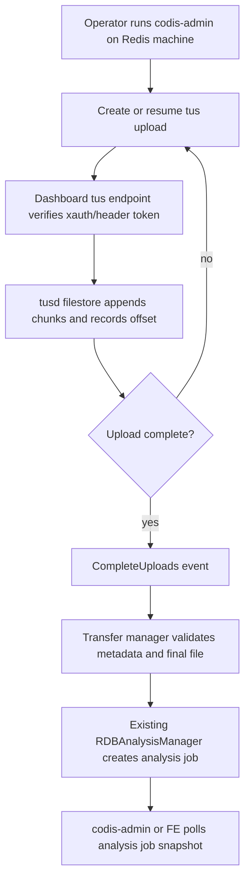

# rdb-remote-transfer-analysis design

## 0. 术语约定

- **Remote RDB transfer**：本 feature 指远端机器上的 Go 上传端通过 HTTP tus 协议把本地 RDB 文件传到 Codis Dashboard 所在机器。它解决跨机器文件传输，不等价于远程命令执行。
- **tusd endpoint**：dashboard/topom 进程内嵌的 `github.com/tus/tusd/v2` handler。它不是独立 `tusd` 二进制，也不要求部署额外系统服务。
- **Transfer upload**：一次 tus 上传会话，有 upload id、offset、length、metadata、状态和可选 analysis job id。上传完成前它不是 RDB analysis job。
- **Remote upload client**：运行在 RDB 文件所在机器上的 Go 入口。首版放在 `codis-admin`，读取本地文件并按 tus 协议创建/续传/完成 upload。
- **Resume state**：上传端本地保存的 upload URL/id、文件路径、文件大小和 mtime 摘要，用于进程重启或网络中断后通过 `HEAD` 查询 offset 并继续 `PATCH`。

防冲突结论：已有 `2026-05-19-rdb-analysis-dashboard` 明确把 `Remote snapshot acquisition` 和远端 RDB 抓取列为首版不做。本 feature 是已验收能力的增量，不改写原 design，也不改变已有 multipart upload / workspace path 行为。

## 1. 决策与约束

### 需求摘要

现有 RDB Analysis 只能分析浏览器上传到 dashboard 的文件，或 dashboard 本机 `rdb_analysis_workspace` 下的文件。用户希望 Redis Server 与 dashboard 不在同一台机器时，不再依赖 `scp` / `rsync` / SSH 账号配置，而是完全通过 Go 实现跨机器 RDB 文件传输，并利用 tus 协议的断点续传能力。

成功标准：

- dashboard 可按配置开启 tus upload endpoint，接收远端上传的大 RDB 文件；上传完成后自动创建现有 `RDBAnalysisJob`。
- 远端机器可运行 Go 实现的 `codis-admin` 上传入口，把本地 RDB 文件传到 dashboard；网络中断后再次运行可从已确认 offset 继续上传。
- tus 上传和后续 analysis 都走 dashboard 现有 product 边界；未授权请求不能创建、续传、查询或删除 upload。
- 上传完成前不会启动 RDB 解析；完成后 analysis job 的 source 只暴露安全摘要，例如 `remote:server-a/dump.rdb`，不暴露上传端绝对路径。
- 现有 FE 上传、workspace path、analysis job 查询/取消/删除保持兼容；不要求已有用户修改配置才能继续使用旧能力。

假设：

- 远端机器上能运行 Codis 提供的 Go 二进制或等价静态构建产物；dashboard 不负责登录远端机器、发现文件路径或执行命令。
- 首版先传输“已经存在的 RDB 文件”。如果需要一键对 Redis 执行 `BGSAVE` 并定位 `dir/dbfilename`，那是远端采集编排能力，后续单独设计。
- 依赖使用 `github.com/tus/tusd/v2`。已通过 Context7 和 `go list -m -versions github.com/tus/tusd/v2` 查证：tusd 支持作为 Go 包嵌入现有服务，当前可用稳定版本到 `v2.9.2`；实现阶段按 Go 编译结果选定最小可用版本并写入 `go.mod/go.sum`。
- tus upload client 首版可以用 Go 标准库按 tus core protocol 实现最小 `POST` / `HEAD` / `PATCH` / resume，不强依赖第三方 Go client。

明确不做：

- 不使用 `scp`、`rsync`、SSH、系统账号、NFS 或共享目录作为传输通道。
- 不把独立 `tusd` 进程作为运行依赖；必须嵌入 dashboard/topom。
- 不让 dashboard 主动登录远端 Redis Server 机器，不读取远端机器任意路径。
- 不自动执行 `BGSAVE` / `SAVE`，不实现 replication stream RDB 抓取。
- 不把 tus upload 状态写入 coordinator；dashboard 重启后未完成 upload 是否可恢复只以 tusd filestore 和本地 resume state 能力为准，Codis 不承诺跨 dashboard 实例迁移会话。
- 不改变 proxy 业务请求路径，不向业务 Redis 客户端暴露任何传输或分析命令。
- 不把 RDB 文件明文传输安全说成已解决；TLS、内网 ACL、反向代理认证和审计属于部署约束，首版只提供 Codis 应用层鉴权入口。

### 复杂度档位

走“运维大文件传输 + 后台分析任务”档位：

- Compatibility = additive：新增 tus endpoint、transfer 状态和 `codis-admin` 上传入口；旧 multipart upload/workspace path/API 不删不改。
- Robustness = resumable：服务端保存 offset，客户端保存 resume state，重试前先 `HEAD` 校验 offset。
- Security = guarded：tus endpoint 不能复用无鉴权读路由；RDB 内容可能包含业务 key/value，默认建议关闭或仅绑定内网，开启后所有 tus 请求必须通过 dashboard 鉴权。
- Resource = bounded：上传大小、并发 upload、保留 upload、chunk 大小、完成后文件清理都受配置约束。
- Observability = logged：创建 upload、续传完成、分析启动、失败和清理记录 product、upload id、source 摘要、size、offset、耗时。

### 关键决策

1. **tusd server 嵌入 dashboard/topom，不独立部署**。
   - 依据：现有 RDB Analysis manager 已挂在 `Topom` 内存态，负责 workspace/upload 输入、job registry 和解析，见 `pkg/topom/topom_rdb_analysis.go:146` 到 `pkg/topom/topom_rdb_analysis.go:188`。
   - 变化：在同一 dashboard API server 内挂载 tus handler，完成事件直接衔接现有 analysis manager。
   - 被拒方案：运行独立 `tusd` 进程再让 dashboard 扫目录。这会新增部署单元、端口、鉴权和生命周期，偏离“完全基于 Go 集成到 Codis”的目标。

2. **远端传输入口放在 `codis-admin`，而不是 FE 或 Redis Server**。
   - 依据：FE 只能读取浏览器本机文件，不能读取 Redis Server 机器上的 `/data/dump.rdb`；Redis Server 是 C 进程，不适合作为 Go tus client 承载点。`codis-admin` 已是运维命令入口，`cmd/admin/main.go:22` 到 `cmd/admin/main.go:54` 已围绕 dashboard 提供管理命令。
   - 变化：新增 `codis-admin --dashboard=ADDR --rdb-transfer --file=PATH ...` 类入口，在远端机器本地读取 RDB 文件并上传。

3. **tus endpoint 使用 header 鉴权，不把 `xauth` 放进 upload URL path**。
   - 依据：现有 dashboard API 把 `xauth` 放在 path，路由见 `pkg/topom/topom_api.go:72` 到 `pkg/topom/topom_api.go:86`；tus 创建后返回的 resource URL 需要被后续 `HEAD` / `PATCH` 复用，动态 path token 会让 handler mount 和 resume state 复杂化。
   - 变化：tus endpoint 要求 `X-Codis-XAuth: <xauth>`，或等价 `Authorization` header。现有 path 形式 `xauth` API 不变。

4. **Transfer upload 与 Analysis job 分离，上传完成后才创建 job**。
   - 依据：现有 `StartUpload` 是一次性 multipart 接收后立即 `startJob`，见 `pkg/topom/topom_rdb_analysis.go:210` 到 `pkg/topom/topom_rdb_analysis.go:235`；tus 上传可能持续很久，中途文件不完整，不能被 parser 读取。
   - 变化：新增 `RDBTransferManager` 或在 `RDBAnalysisManager` 内增加 transfer 子状态：`created/uploading/completed/analyzing/error/removed`，完成事件再把最终文件交给 `startJob`。

5. **服务端使用 tusd `filestore` + `filelocker`，不把 upload chunk 常驻内存**。
   - 依据：tusd 官方用法支持 `filestore.New`、`filelocker.New`、`NewStoreComposer` 和 `handler.NewHandler` 嵌入 Go 服务；完成通知可由应用 goroutine 接收。
   - 变化：upload 文件落在 `rdb_analysis_workspace/tus/` 下，metadata 落在 tusd 自己的 info 文件中，Codis 只维护必要的 transfer 索引和完成后 job 映射。

## 2. 名词与编排

### 2.1 名词层

#### RDB transfer config

现状：

- dashboard 只有 RDB analysis 配置：workspace、multipart 最大上传大小、并发 job、保留 job 和 top N，见 `pkg/topom/config.go:43` 到 `pkg/topom/config.go:48`。

变化：

- 新增 transfer/tus 配置，默认不影响旧功能：

```text
rdb_analysis_tus_enabled: 是否开启 tus 远端上传入口，默认 false
rdb_analysis_tus_base_path: tus endpoint path，默认 /api/topom/rdb-analysis/tus/
rdb_analysis_tus_max_size: 单个 tus upload 最大大小，默认复用 rdb_analysis_max_upload_size
rdb_analysis_tus_max_concurrent_uploads: 同时 uploading 数，默认 1
rdb_analysis_tus_chunk_size_hint: codis-admin 默认 chunk 大小提示
rdb_analysis_tus_retention: 已完成/失败 upload 文件保留时间或数量
rdb_analysis_transfer_token: 可选附加 token；为空时只校验 xauth
```

#### RDB transfer upload

现状：

- `RDBAnalysisJob` 直接表达解析任务，状态是 `queued/running/done/error/canceled`，字段见 `pkg/topom/topom_rdb_analysis.go:75` 到 `pkg/topom/topom_rdb_analysis.go:95`。
- `StartUpload` 只处理 multipart 表单，完成 HTTP request 后文件已完整。

变化：

- 新增 `RDBTransferUpload`，字段至少包含：

```text
id, created_at, updated_at, status, source,
filename, size, offset, metadata,
analysis_options, analysis_job_id, error
```

- `source` 只使用 metadata 中的安全摘要，例如 `remote:10.0.0.12/dump.rdb`，不回显上传端绝对路径。
- `analysis_options` 复用现有 `RDBAnalysisOptions`，由 tus metadata 或创建请求传入，完成后交给现有 analysis manager。

#### tus API 契约

现状：

- RDB Analysis API 只包括 `upload/start/get/cancel/remove`，见 `pkg/topom/topom_rdb_analysis_api.go:32` 到 `pkg/topom/topom_rdb_analysis_api.go:120`。

变化：

- 新增 tus endpoint，遵守 tus core protocol：

```text
POST /api/topom/rdb-analysis/tus/
HEAD /api/topom/rdb-analysis/tus/{upload_id}
PATCH /api/topom/rdb-analysis/tus/{upload_id}
DELETE /api/topom/rdb-analysis/tus/{upload_id}
```

- 所有 tus 请求要求 header：

```text
Tus-Resumable: 1.0.0
X-Codis-XAuth: <dashboard xauth>
X-Codis-Transfer-Token: <optional token>
```

- `Upload-Metadata` 至少带 `filename`，可带 `source` 和 `options`；metadata value 按 tus 规范使用 base64。
- 新增 Codis JSON API 用于查询 upload 到 analysis job 的映射：

```text
GET /api/topom/rdb-analysis/transfer/:xauth/:upload_id
  -> RDBTransferUpload snapshot

PUT /api/topom/rdb-analysis/transfer/remove/:xauth/:upload_id
  -> "OK"
```

#### Remote upload client

现状：

- `codis-admin` 通过 `topom.ApiClient` 调 dashboard API，`newTopomClient` 会读取 `/api/topom/model` 并设置 `xauth`，见 `cmd/admin/dashboard.go:90` 到 `cmd/admin/dashboard.go:108`。
- `topom.ApiClient` 当前只封装 JSON API，URL 编码入口在 `pkg/topom/topom_api.go:765` 到 `pkg/topom/topom_api.go:780`。

变化：

- `codis-admin` 增加远端上传命令，最小用户入口：

```text
codis-admin --dashboard=ADDR --rdb-transfer --file=/path/dump.rdb \
  [--topn=N] [--prefix-sep=:] [--max-depth=N] [--regex=REGEX] [--include-expired] \
  [--resume-state=/path/state.json] [--source=server-a]
```

- 上传端逻辑：
  - 首次运行：`POST` 创建 tus upload，写入 resume state。
  - 中断恢复：读取 resume state，`HEAD` 查询服务端 offset，校验本地文件 size/mtime 摘要，按 offset 继续 `PATCH`。
  - 完成后：轮询 transfer snapshot，拿到 `analysis_job_id`，可选择继续轮询现有 analysis job 到终态。

#### FE 展示模型

现状：

- FE 只展示当前页面启动的 job，`rdb-analysis.js` 可创建 multipart upload/workspace job 并轮询 job snapshot，见 `cmd/fe/assets/rdb-analysis.js:145` 到 `cmd/fe/assets/rdb-analysis.js:186`。

变化：

- 首版 FE 不承担远端文件读取和 tus 上传，但需要能查看远端上传触发的分析结果。
- 增加“按 job id 加载”或“最近 RDB jobs”中的一种轻量入口，能把 `codis-admin` 打印的 `analysis_job_id` 接入当前页面轮询。
- 不引入 `tus-js-client`，避免把“完全基于 Go 的远端传输”扩大成浏览器 tus 上传改造。

### 2.2 编排层



现状：

- dashboard API server 当前统一设置 JSON Content-Type，见 `pkg/topom/topom_api.go:51` 到 `pkg/topom/topom_api.go:53`。tus endpoint 需要返回 tus protocol headers，不能被 JSON-only 假设限制。
- analysis parser 只读取完整文件，`runJob` 打开 `job.path` 后用 `parser.NewDecoder(file)` 解析，见 `pkg/topom/topom_rdb_analysis.go:440` 到 `pkg/topom/topom_rdb_analysis.go:480`。

变化：

- dashboard 初始化时，如果 `rdb_analysis_tus_enabled=true`，创建 tus store composer、file store、file locker 和 handler；关闭 dashboard 时停止 transfer manager 并清理可删除文件。
- tus handler 挂在 `/api/topom/rdb-analysis/tus/`，该 path 的响应头由 tusd 控制；通用 JSON middleware 对 tus path 跳过或不覆盖协议关键头。
- wrapper handler 在进入 tusd 前校验 `X-Codis-XAuth` 和可选 `X-Codis-Transfer-Token`，并限制 method、metadata 长度、upload length 和并发 upload。
- tusd 完成事件到达后，transfer manager 读取 `event.Upload.ID/Size/MetaData`，找到 filestore 中完整文件，调用现有 manager 的“从受控上传文件启动分析”入口；该入口可以复用 `startJob`，但 source/cleanup 语义要区分 `remote`。
- `codis-admin` 上传端将 chunk 作为流式 reader 发送，不把 RDB 整体读入内存；每个 chunk 成功后使用响应的 `Upload-Offset` 更新本地 resume state。

流程级约束：

- **鉴权**：tus 所有 method 都要鉴权。创建、续传、查询 offset、删除 upload 都不能绕过 xauth。
- **断点续传**：客户端恢复前必须 `HEAD` 服务端 offset；本地文件 size/mtime 不匹配时拒绝复用旧 upload id。
- **完成语义**：只有 tusd 标记 upload 完整并发出完成事件后才创建 analysis job。
- **并发与大小**：upload 并发与 analysis 并发分开限制；upload 完成后创建 analysis job 时仍受 `RDBAnalysisManager` 的 job 并发限制。
- **清理**：取消/删除 transfer 时释放 tus 文件和 metadata；analysis 已启动的 remote 文件按配置在 job remove/prune 后清理。
- **错误语义**：鉴权失败返回 403 或现有 API error；offset 不匹配按 tus protocol 返回冲突；metadata/options 非法时拒绝创建或把 transfer 标为 error，不 panic。
- **可观测性**：记录 upload id、source 摘要、size、offset、analysis job id 和耗时；日志不打印本地绝对路径和 transfer token。
- **传输安全**：Codis 只提供应用层鉴权；生产环境必须通过内网绑定、TLS 终止或反向代理控制明文风险，文档要明确。

### 2.3 挂载点清单

- `pkg/topom/topom_api.go` route registry / middleware：挂入 tus handler 和 transfer JSON API。删除后远端上传入口消失。
- `pkg/topom` 新增 transfer manager / tus integration 文件：承载 tusd handler、完成事件、upload snapshot、cleanup 和 analysis job 衔接。删除后 dashboard 不能接收断点续传文件。
- `pkg/topom/config.go` 与 `config/dashboard.toml`：新增 tus/transfer 配置。删除后无法控制开启、大小、并发、token 和清理策略。
- `cmd/admin/main.go`、`cmd/admin/dashboard.go` 及新增上传 client 文件：新增远端 Go 上传端。删除后仍可用 tus protocol 自行上传，但 Codis 不再提供官方 Go 入口。
- `pkg/topom/topom_rdb_analysis_api.go` / `ApiClient`：新增 transfer 查询和必要的 upload/job 衔接 API。删除后 CLI/FE 无法拿到 upload 到 job 的映射。
- `cmd/fe/assets/rdb-analysis.js` / `index.html`：新增按 job id 或最近 job 查看远端分析结果的入口。删除后远端上传仍可完成，但浏览器不便查看该 job。
- `go.mod` / `go.sum`：新增 `github.com/tus/tusd/v2` 依赖。删除后无法编译嵌入式 tus server。

不列为挂载点：

- `pkg/proxy`：远端 RDB transfer 不进入业务 Redis 协议路径。
- `extern/redis-8.6.3`：首版不让 Redis Server 自己生成或上传 RDB。
- `cmd/fe/main.go`：如果 FE 只通过现有 reverse proxy 访问 dashboard JSON API，首版无需改静态服务和转发逻辑。

### 2.4 推进策略

1. **dashboard tus endpoint 骨架**：配置开关、tusd handler、header 鉴权和 filestore/filelocker 初始化先接通。
   - 退出信号：未开启时 endpoint 不可用；开启后错误 xauth 被拒绝，正确 xauth 可创建 tus upload。

2. **transfer 状态与完成事件**：记录 upload snapshot，处理 tus 完成事件并把完整文件交给 analysis manager。
   - 退出信号：小 RDB tus 上传完成后能产生 `analysis_job_id`，现有 `GetRDBAnalysis` 可查到 running/done。

3. **Go 上传客户端**：在 `codis-admin` 增加 `--rdb-transfer`，实现 create/resume/chunk PATCH/resume state。
   - 退出信号：上传中断后再次运行从服务端 offset 继续；完成后打印 upload id 和 analysis job id。

4. **资源边界与清理**：补齐大小、并发、metadata、retention、remove/cancel 和错误语义。
   - 退出信号：超限 upload、并发超限、offset 冲突、非法 metadata 都返回明确错误；删除 transfer 会清理服务端临时文件。

5. **FE 查看远端结果**：增加按 job id 加载或最近 job 列表，复用现有 job snapshot 轮询和展示。
   - 退出信号：把 CLI 输出的 job id 输入 FE 后可看到同一份分析结果。

6. **依赖、配置与文档收口**：最小更新 `go.mod/go.sum`、dashboard 默认配置和使用说明。
   - 退出信号：不引入独立 tusd 进程；文档说明首版不自动 BGSAVE、不提供 SSH/rsync、生产需 TLS/内网。

7. **验证覆盖**：后端单测、httptest tus 上传、CLI resume 测试和 FE 静态验证。
   - 退出信号：`go test ./pkg/topom -run RDB.*Transfer`、`go test ./cmd/admin -run RDB.*Transfer`、`make gotest` 通过。

### 2.5 结构健康度与微重构

##### 评估

- compound convention：已检索 `.codestable/compound`，无目录组织 / 文件归属 / 命名约定类命中。
- 文件级 — `pkg/topom/topom_rdb_analysis.go`：824 行，已经偏胖，包含 job、manager、parser、aggregator 和 helper。本 feature 不应继续把 tus/transfer 大段逻辑塞入该文件，只保留极薄的衔接方法。
- 文件级 — `pkg/topom/topom_rdb_analysis_api.go`：165 行，目前仍健康；可增加 transfer JSON API handler，但 tus handler 本身应放新文件。
- 文件级 — `pkg/topom/topom_api.go`：1013 行，route registry 已偏胖；只新增最小 route/middleware 分支，不在这里写业务逻辑。
- 文件级 — `cmd/admin/main.go`：86 行 usage 很长但只是入口；新增命令行参数不可避免，上传实现应放 `cmd/admin/rdb_transfer.go`。
- 文件级 — `cmd/admin/dashboard.go`：812 行，已偏胖，不能继续塞上传协议细节；只在 dispatch 中挂接新 handler。
- 文件级 — `cmd/fe/assets/rdb-analysis.js`：224 行，是 RDB Analysis 前端专属文件，新增 job id 加载属于自然扩展。
- 目录级 — `pkg/topom`：已有按子领域拆文件风格；新增 `topom_rdb_transfer.go`、`topom_rdb_transfer_api.go`、`topom_rdb_transfer_test.go` 符合现状。
- 目录级 — `cmd/admin`：只有 `admin.go`、`dashboard.go`、`main.go`、`proxy.go`，新增 RDB transfer 文件比继续扩张 `dashboard.go` 更清晰。

##### 结论：不做前置微重构

本次不做独立微重构，原因是可通过新增文件承载新能力，并只在既有胖文件中加入薄挂载点。`pkg/topom/topom_rdb_analysis.go` 和 `cmd/admin/dashboard.go` 的拆分收益存在，但超出“只搬不改行为”的安全边界，后续如果继续扩展 RDB 运维工具，建议单独走 `cs-refactor`。

## 3. 验收契约

- 输入：dashboard 默认配置未开启 tus。触发：请求 `/api/topom/rdb-analysis/tus/`。期望：返回明确 disabled/not found，不影响旧 multipart upload 和 workspace path。
- 输入：开启 tus，使用错误 `X-Codis-XAuth` 创建 upload。期望：请求被拒绝，不产生 upload 文件和 transfer snapshot。
- 输入：开启 tus，`codis-admin --rdb-transfer --file sample.rdb` 上传小 RDB。期望：上传完成，返回 upload id 和 analysis job id，job 最终 `done` 且 summary 与现有 multipart 上传同文件结果一致。
- 输入：上传过程中断后保留 resume state，再次运行同一命令。期望：客户端先 `HEAD` 获取 offset，从 offset 继续 `PATCH`，不会重新上传已确认字节。
- 输入：本地文件大小或 mtime 与 resume state 不一致。期望：客户端拒绝复用旧 upload，提示用户重新创建或指定新的 resume state。
- 输入：超过 `rdb_analysis_tus_max_size` 的文件。期望：创建或上传阶段失败，dashboard 不启动 analysis job。
- 输入：同时超过 `rdb_analysis_tus_max_concurrent_uploads` 的上传。期望：新的 upload 被拒绝，已有上传不受影响。
- 输入：tus upload 完成但 analysis job 并发已满。期望：transfer 进入可观察的等待/错误状态，不丢失已完成文件；错误信息可读。
- 输入：非法 RDB 文件通过 tus 完整上传。期望：upload 状态 completed，analysis job 进入 `error`，dashboard 不 panic。
- 输入：CLI 输出的 analysis job id 被粘贴到 FE。期望：FE 能加载并轮询该 job，展示与现有 RDB Analysis 一致的结果/错误。
- 输入：删除 transfer 或 job prune 触发清理。期望：受控目录中的 tus 临时文件和 metadata 被删除，不影响其他 upload/job。
- 输入：`go test ./pkg/topom -run RDB.*Transfer`、`go test ./cmd/admin -run RDB.*Transfer`、`make gotest`。期望：全部通过。

## 4. 架构与文档回写计划

- architecture：实现验收后更新 `.codestable/architecture/ARCHITECTURE.md`，补充 `Remote RDB transfer` 术语、dashboard tus endpoint、transfer manager、codis-admin 上传端和“不自动 BGSAVE/不使用 SSH”的边界。
- requirement：实现验收后更新 `.codestable/requirements/redis-cluster-service.md`，把“远端机器通过 Go 断点续传上传 RDB 到 dashboard 分析”补入值班人员用户故事、解决方式和边界。
- guide：实现后建议补一份用户指南或现有 RDB Analysis 文档段落，给出 dashboard 配置、`codis-admin --rdb-transfer` 命令、resume state 和生产 TLS/内网要求。
- checklist：本 draft 经 review 并改为 `approved` 后，再生成 `rdb-remote-transfer-analysis-checklist.yaml`；当前不生成 checklist。

## 5. Review 提示

请重点确认三件事：

1. 首版远端上传端放在 `codis-admin` 是否符合你的实际运维路径。
2. 是否接受“首版不自动 BGSAVE，只传已有 RDB 文件”的边界。
3. tus endpoint 默认关闭、开启后通过 header xauth + 可选 transfer token 鉴权，这个安全/易用性取舍是否合适。
