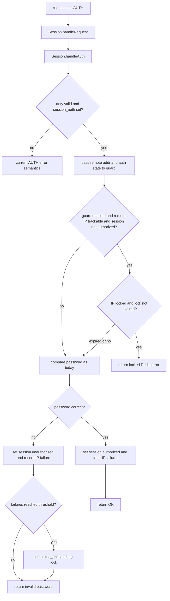

# proxy-auth-bruteforce design

## 0. 术语约定

- **Session AUTH**：客户端连接 Codis Proxy 后执行的 Redis `AUTH <password>`。它使用 `session_auth` 校验客户端密码，不等同于 `product_auth`；现有入口在 `pkg/proxy/session.go:342`。
- **Auth brute-force guard**：本 feature 新增的 proxy 进程内防暴力破解运行态，按客户端 IP 记录 session AUTH 失败次数和锁定截止时间。
- **Client IP**：从客户端连接的 remote address 中提取的 IP 字符串。TCP 连接用 `net.SplitHostPort` 后规范化 IPv4/IPv6；Unix socket 没有 IP，不进入本 feature 保护范围。
- **Locked IP**：失败次数达到配置阈值后，在锁定截止时间前不能继续对未认证 session 执行 `AUTH` 的客户端 IP。
- **已建立会话不受影响**：锁定只阻止后续未认证 session 的 `AUTH` 校验，不主动关闭已有连接，不让已经认证的 session 变成 `NOAUTH`，也不改变它们的普通命令路由。

防冲突结论：本文的锁定是 Codis Proxy 本地、面向 `session_auth` 的 Redis 协议认证保护，不是后端 Redis Server 的 `requirepass` / ACL，不是 dashboard/topom 的 `xauth`，也不是 coordinator/Jodis 认证。

## 1. 决策与约束

### 需求摘要

目标是在 Codis Proxy 上为 `session_auth` 增加默认关闭的防暴力破解机制。成功标准是：开启配置后，同一个客户端 IP 连续输错 `AUTH` 密码达到配置阈值会被临时锁定；锁定期间该 IP 的新未认证连接即使提交正确密码也不能继续认证；锁定超过配置时长后自动解除，此后可重新认证；该 IP 已经创建并完成认证的会话继续按现有路由处理。

假设：

- `session_auth_bruteforce_max_failures = N` 表示最多允许连续失败 `N` 次；第 `N` 次失败会写入锁定状态，后续未认证 session 的 `AUTH` 返回 locked error。若要严格按“超过 N 次”理解为第 `N+1` 次才锁，可以在 review 时改阈值语义。
- “累计”按同一个 proxy 进程内、同一个客户端 IP 的当前失败周期理解；成功 `AUTH`、锁定到期或记录过期会清零失败计数。不做跨 proxy 或重启后的累计。
- Codis Proxy 前面如果有四层代理、NAT 或负载均衡，proxy 能看到的 remote IP 可能是代理/NAT 地址；本 feature 首版不解析 `X-Forwarded-For`、Proxy Protocol 或客户端自报身份。

明确不做：

- 不改变 `product_auth`、dashboard/topom `xauth`、coordinator/Jodis auth 或后端 Redis `AUTH` 行为。
- 不实现跨 proxy 的全局失败计数，不把锁定状态写入 coordinator，也不在 proxy 重启后保留锁定。
- 不主动关闭、踢出或降级该 IP 已经存在的已认证 session。
- 不给普通 Redis 命令做限流；保护范围只覆盖 `AUTH` 认证尝试。
- 不新增 dashboard/FE 管理页、IP 解锁 API、allowlist/denylist/CIDR 配置或审计报表。
- 不支持 Redis ACL username 维度，也不改变现有 `AUTH <password>` 单密码模型。
- 不承诺抵御分布式低频撞库；IP 维度锁定主要缓解单 IP 高频尝试。

### 复杂度档位

按“对外 Redis 协议服务的安全开关”默认档位走，偏离如下：

- Compatibility = backward-compatible（默认关闭时必须保持现有 `AUTH` 错误语义和普通请求行为）。
- Security = validated（新增逻辑在外部输入边界上做 IP 提取、阈值校验和锁定判断；不按 hardened 威胁模型承诺分布式防护）。
- Concurrency = thread-safe（多个 session goroutine 会并发读写同一个 IP 的失败记录）。
- Performance = budgeted（`AUTH` 热点路径上只能做 O(1) map 操作，不能影响已认证普通命令）。
- Observability = logged + lightweight stats（锁定/自动解锁写日志，并在 proxy stats 中暴露聚合计数；不输出完整 IP 列表）。
- Testability = tested（配置校验、阈值、锁定、解锁、成功清零和已认证 session 不受影响都可以用 proxy package 测试覆盖）。

### 关键决策

1. **保护挂在 proxy 的 session auth 路径，而不是后端 Redis 或 router 层。**
   - 依据：现有客户端认证由 `Session.handleAuth` 比较 `config.SessionAuth`，未认证命令在 `Session.handleRequest` 返回 `NOAUTH`，见 `pkg/proxy/session.go:266` 到 `pkg/proxy/session.go:354`。
   - 约束：锁定判断只围绕 `AUTH`，不进入 `Router.dispatch`，不影响 slot 路由、backend 连接池或迁移逻辑。

2. **新增默认关闭的配置组，沿用现有 duration 字符串风格。**
   - 建议配置：

```toml
# Enable IP-based brute-force protection for session AUTH. Disabled by default.
session_auth_bruteforce_enabled = false
session_auth_bruteforce_max_failures = 5
session_auth_bruteforce_lock_duration = "60s"
```

   - `enabled=false` 时完全绕过 guard。
   - `max_failures` 启用时必须大于 0。
   - `lock_duration` 启用时必须大于 0。
   - `session_auth=""` 时没有客户端认证要求，guard 处于 no-op；不在 `LoadFromFile` 阶段强制要求 `session_auth` 非空，避免破坏 `--session_auth` 命令行覆盖配置文件的现有用法。

3. **按客户端 IP 维护进程内失败记录，锁定到期按时间自动失效。**
   - 失败记录结构包含 `failures`、`last_failure_at`、`locked_until`。
   - `AUTH` 密码错误时累加失败次数；达到阈值写入 `locked_until = now + lock_duration`。
   - `AUTH` 成功时删除该 IP 的失败记录。
   - 每次 `AUTH` 检查先判断锁定是否已过期；过期即删除记录并允许重新认证，满足“锁定超过若干秒后自动解锁”的可观察语义。
   - 为避免大量一次性 IP 失败导致 map 长期增长，未锁定失败记录在 `lock_duration` 内无新失败后也允许被清理；插入新 IP 前做摊销清理，状态表使用内部 tracked IP 上限，超过上限时优先淘汰最旧的未锁定记录。若全部记录都处于锁定期，则拒绝新增 tracking，不影响当前 `AUTH` 错误响应和已认证普通命令。

4. **锁定只拦截未认证 session 的 AUTH 校验。**
   - 未认证 session 来自 locked IP：`AUTH` 返回 Redis error，例如 `ERR too many invalid AUTH attempts, try again later`，不比较密码，也不增加失败次数。
   - 已认证 session：继续执行普通命令，不因同 IP 后续被锁而变成 `NOAUTH`。
   - 已认证 session 如果主动再次发送错误 `AUTH`，仍按现有 Redis AUTH 命令语义处理；它不会被后台强制断开，但一旦该 session 自己变为未认证，后续 `AUTH` 会受 IP 锁定约束。

5. **只暴露聚合观测，不在 stats 中泄露 IP 列表。**
   - 锁定、到期解锁、IP 解析失败写日志；日志中可包含 IP，但不包含密码。
   - proxy stats 可新增条件字段 `session_auth_bruteforce`，只在启用或已有非零统计时出现，包含 `enabled/tracked_ips/locked_ips/failures/locks/unlocks`。
   - InfluxDB/StatsD 首版不新增指标字段，避免扩大外部指标契约。

## 2. 名词与编排

### 2.1 名词层

#### 配置契约

现状：

- `pkg/proxy/config.go` 的 `Config` 包含 `SessionAuth string`，默认配置 `config/proxy.toml` 只说明客户端需要先执行 `AUTH <PASSWORD>`。
- `Config.Validate()` 只校验已有 proxy/backend/session/hot key/metrics 等配置，不存在 auth 失败阈值或锁定时长。

变化：

新增默认关闭配置：

```toml
session_auth_bruteforce_enabled = false
session_auth_bruteforce_max_failures = 5
session_auth_bruteforce_lock_duration = "60s"
```

配置语义：

- `session_auth_bruteforce_enabled=false`：保持当前行为，`AUTH` 错误只返回 `ERR invalid password`。
- `session_auth_bruteforce_enabled=true` 且 `session_auth != ""`：按客户端 IP 记录错误密码次数并执行锁定。
- `session_auth_bruteforce_enabled=true` 且 `session_auth == ""`：没有 session auth 保护目标，guard no-op；客户端 `AUTH` 仍按现状返回 `ERR Client sent AUTH, but no password is set`。
- `session_auth_bruteforce_max_failures <= 0` 或 `session_auth_bruteforce_lock_duration <= 0` 在启用时配置校验失败。

#### Auth brute-force guard

现状：

- `Session` 只保存单连接级的 `authorized bool`，没有跨连接的认证失败状态。
- `Proxy` 持有 listener、router、Jodis、HA 和 stats 等进程级运行态，但没有 auth 安全状态。

变化：

新增 proxy 进程内运行态：

```text
AuthBruteforceGuard:
  enabled: bool
  max_failures: int
  lock_duration: duration
  records: map[ip]AuthFailureRecord
  stats: failures, locks, unlocks

AuthFailureRecord:
  failures: int
  last_failure_at: time
  locked_until: time
```

行为接口：

```text
BeforeAuth(remote_addr, authorized, now) -> locked?
RecordAuthFailure(remote_addr, authorized, now) -> locked_now?
RecordAuthSuccess(remote_addr)
Stats() -> aggregate snapshot
```

记录只保存在当前 proxy 进程内；proxy 重启后清空。

#### Redis AUTH 响应契约

现状：

- `AUTH` 参数数量不等于 2 时返回 `ERR wrong number of arguments for 'AUTH' command`。
- `session_auth=""` 时返回 `ERR Client sent AUTH, but no password is set`。
- 密码错误时 `setAuthorized(false)` 并返回 `ERR invalid password`。
- 密码正确时 `setAuthorized(true)` 并返回 `OK`。

变化：

新增 locked error 分支：

```text
输入：AUTH correct-password
前置：SessionAuth 非空，guard enabled，client IP still locked，session 未认证
输出：ERR too many invalid AUTH attempts, try again later
副作用：不比较密码，不增加失败次数，不关闭连接
```

密码错误分支新增副作用：

```text
输入：AUTH wrong-password
前置：SessionAuth 非空，guard enabled，client IP not locked
输出：ERR invalid password
副作用：IP failure count +1；达到阈值则写 locked_until
```

密码正确分支新增副作用：

```text
输入：AUTH correct-password
前置：SessionAuth 非空，guard enabled，client IP not locked
输出：OK
副作用：删除该 IP 的失败记录
```

### 2.2 编排层



现状：

- `Proxy.serveProxy` accept 后调用 `NewSession(c, s.config).Start(s.router)`，所有 session 共享同一份 config 和 router。
- `Session.handleRequest` 对 `AUTH` 做认证前本地处理，随后未认证请求才返回 `NOAUTH`。
- `loopWriter` 保证响应仍按 pipeline 请求顺序写回。

变化：

- `Proxy.New` 根据 config 创建一个 `AuthBruteforceGuard`，作为 proxy 进程级运行态。
- `NewSession` 或等价 session 初始化路径拿到 guard 引用；测试里未传 guard 时等价于 disabled。
- `Session.handleAuth` 保留现有参数校验和 no-password 错误优先级；只有在需要比较 `session_auth` 时进入 guard。
- IP 提取失败或连接不是 TCP/IP 时，guard 跳过并按当前 AUTH 行为处理，同时记录 debug/warn 级日志，避免 Unix socket 场景被误锁。
- 锁定和解锁只影响后续 AUTH 响应，不触发连接关闭，不绕过 `RequestChan`。

流程级约束：

- **错误语义**：默认关闭时错误文本不变；启用后只有 locked IP 的未认证 `AUTH` 新增 locked error。
- **并发**：guard map 由 mutex 保护；更新记录时不持有 session 锁；普通已认证命令不访问 guard。
- **顺序**：AUTH 响应仍经现有 request pipeline 输出，不直接写 socket。
- **自动解锁**：`locked_until <= now` 后下一次 AUTH 检查自动删除锁定记录并允许密码校验；stats/logs 记录 unlock。
- **资源边界**：guard 只保存出现过 AUTH 失败的 IP；成功认证、锁定到期或记录过期时清理。
- **容量上限**：guard 的 records map 使用内部固定 tracked IP 上限；插入新 IP 前会清理过期记录，仍满时淘汰最旧未锁定记录，全部锁定时拒绝新增 tracking。
- **兼容性**：`session_auth_bruteforce_enabled=false`、`session_auth=""`、无法提取 IP 三种情况都不改变现有业务命令行为。
- **安全性**：日志和 stats 不包含提交的密码；stats 不列出完整 IP 明细。

### 2.3 挂载点清单

- `pkg/proxy/config.go` / `config/proxy.toml`：新增 session auth 防暴力破解配置项、默认值和校验。
- proxy runtime lifecycle：创建并持有 `AuthBruteforceGuard`，让新 session 共享同一个进程级 guard。
- `pkg/proxy/session.go` AUTH 本地命令处理：在密码比较前后挂入 locked check、failure record 和 success reset。
- `pkg/proxy/proxy.go` stats JSON：新增可选聚合快照，不暴露密码或完整 IP 列表。
- 用户文档：补充配置说明、锁定语义、NAT/多 proxy 边界和已有会话不受影响的说明。

### 2.4 推进策略

1. **配置与空 guard 骨架**：接入默认关闭配置、校验和 disabled/no-op guard。
   - 退出信号：默认配置加载成功；`session_auth_bruteforce_enabled=false` 时 AUTH 成功/失败行为与现状一致。

2. **IP 提取与失败记录**：实现 TCP remote address 到客户端 IP 的规范化，以及 thread-safe 失败计数记录。
   - 退出信号：IPv4/IPv6 remote address 能归一到 IP；无法提取 IP 时回退现有 AUTH 行为；并发记录无 data race。

3. **锁定与成功清零编排**：在 `Session.handleAuth` 中接入锁定检查、失败达到阈值锁定、成功认证清零。
   - 退出信号：同一 IP 连续输错达到阈值后被锁；锁定期间正确密码也返回 locked error；成功认证会清掉此前失败计数。

4. **自动解锁与记录清理**：基于 `locked_until` 和记录过期规则清理锁定/未锁定失败记录。
   - 退出信号：锁定时长过去后同一 IP 可以重新认证；长期无新失败的记录不会无限保留。

5. **stats、日志与文档边界**：补齐 proxy stats 聚合字段、锁定/解锁日志和用户配置说明。
   - 退出信号：stats 可看到 enabled、tracked_ips、locked_ips、failures、locks、unlocks；文档明确 proxy-local、NAT、多 proxy 和已有会话边界。

6. **验证覆盖**：补齐 proxy package 单测和必要的集成式 session 测试。
   - 退出信号：默认关闭、阈值锁定、自动解锁、成功清零、不同 IP 隔离、已认证 session 不受影响和 stats 场景都有可重复测试证据。

### 2.5 结构健康度与微重构

##### 评估

- compound convention：已检索 `.codestable/compound`，无目录组织 / 命名 / 归属类 convention 命中。
- 文件级 — `pkg/proxy/session.go`：756 行，职责包含 session 生命周期、认证、本地命令分发、多 key 命令和 op stats，已经偏胖。本 feature 只应在 `handleAuth` 保留最小 hook，计数/锁定逻辑落新文件。
- 文件级 — `pkg/proxy/proxy.go`：638 行，职责包含 proxy model、listener、router、Jodis、HA、stats 和 lifecycle；本次只挂载 guard owner 和 stats snapshot，不把 auth 算法塞进该文件。
- 文件级 — `pkg/proxy/config.go`：369 行，集中承载 TOML 默认配置、Config 字段和 Validate；新增一组配置项符合当前组织方式。
- 目录级 — `pkg/proxy`：当前已有 `client_list.go`、`hot_key_cache.go`、`cluster_nodes.go` 这类按局部能力拆出的文件；新增 `auth_bruteforce.go` / `auth_bruteforce_test.go` 符合现有扁平 package 风格。

##### 结论：不做前置微重构

原因：`session.go` 和 `proxy.go` 偏胖是真问题，但本 feature 可以通过“最小认证 hook + 新文件承载 guard 状态和算法”控制风险。拆分 session lifecycle 或 proxy stats 会触碰 Redis 协议主路径和管理 API，超出本 feature 的安全微重构边界。

##### 超出范围的观察

- 如果后续继续增加 session 本地安全策略，建议单独走 `cs-refactor` 把认证相关本地命令处理从 `session.go` 中拆出；本 feature 不阻塞在该重构上。

## 3. 验收契约

### 关键场景清单

- 触发：默认配置或 `session_auth_bruteforce_enabled=false` 下，客户端执行错误 `AUTH`。期望：返回现有 `ERR invalid password`，不会生成 locked error。
- 触发：启用 guard、`session_auth="secret"`、`max_failures=3`，同一 IP 连续执行 3 次 `AUTH wrong`。期望：三次都返回 `ERR invalid password`；第三次后该 IP 进入 locked 状态。
- 触发：上述 IP 锁定期间，新未认证连接执行 `AUTH secret`。期望：返回 `ERR too many invalid AUTH attempts, try again later` 或等价 locked error，不设置 session authorized。
- 触发：锁定时长超过 `session_auth_bruteforce_lock_duration` 后，同一 IP 执行 `AUTH secret`。期望：返回 `OK`，该 IP 锁定被自动解除。
- 触发：同一 IP 先执行若干次错误 `AUTH` 但未达阈值，随后执行正确 `AUTH`。期望：返回 `OK` 并清零失败计数；之后重新累计。
- 触发：IP A 达到锁定阈值，IP B 执行正确 `AUTH`。期望：IP B 不受影响。
- 触发：大量不同 IP 触发错误 `AUTH`，数量超过 guard 内部 tracked IP 上限。期望：`tracked_ips` 不超过上限；过期记录会在后续新 IP 插入前被清理；必要时淘汰最旧未锁定记录。
- 触发：某 IP 已有一个已认证 session 正在执行 `CLIENT LIST`、`GET` 或其他普通命令，同时该 IP 的新连接因错误 `AUTH` 被锁定。期望：已有已认证 session 不被关闭、不变成 `NOAUTH`，普通命令仍按现有路径处理。
- 触发：`session_auth=""` 但 guard 配置启用，客户端执行 `AUTH anything`。期望：仍返回 `ERR Client sent AUTH, but no password is set`，不记录 auth failure。
- 触发：`AUTH` 参数数量错误。期望：仍返回 `ERR wrong number of arguments for 'AUTH' command`，不记录 auth failure。
- 触发：Unix socket 或无法解析 remote IP 的连接执行 `AUTH`。期望：不触发 IP 锁定，按现有 AUTH 语义处理并记录日志。
- 触发：读取 proxy `/api/proxy/stats`。期望：启用或已有统计时包含 `session_auth_bruteforce` 聚合字段，但不包含密码和完整 IP 列表。
- 触发：执行目标测试 `go test ./pkg/proxy -run 'TestAuthBruteforce|TestSessionAuthBruteforce|TestProxyAuthBruteforce'`。期望：新增 proxy 测试全部通过。

### 明确不做的反向核对项

- Diff 不应修改 `product_auth`、dashboard/topom `xauth` 或 coordinator/Jodis auth 校验路径。
- Diff 不应把锁定状态写入 coordinator、models.Store 或 Jodis。
- Diff 不应新增跨 proxy RPC、pubsub 或广播来同步失败计数。
- Diff 不应主动关闭已有已认证 session，或在 IP 锁定后让普通命令返回 `NOAUTH`。
- Diff 不应新增 dashboard/FE 管理页面、手动解锁 API、allowlist/denylist/CIDR 配置。
- Diff 不应引入 Redis ACL username 语义或改变当前 `AUTH <password>` 契约。
- Diff 不应在日志或 stats 中输出客户端提交的密码。

## 4. 与项目级架构文档的关系

acceptance 阶段应更新 `.codestable/architecture/ARCHITECTURE.md`：

- 在 proxy 内存状态中补充：proxy 可持有默认关闭的 auth brute-force guard，状态只存在于单 proxy 进程内，不进入 coordinator。
- 在命令路由描述中补充：`Session.handleRequest` 对 `AUTH` 先走本地 session auth 逻辑，启用 guard 后按客户端 IP 做临时锁定；普通已认证命令不访问 guard。
- 在已知约束中补充：该能力不跨 proxy 同步，不持久化，NAT/四层代理可能导致多个客户端共享锁定维度。

acceptance 阶段可视实现范围更新用户文档：

- `config/proxy.toml` 默认配置注释说明三个新配置项。
- `doc/tutorial_zh.md` 或新增 proxy auth 安全文档说明配置示例、锁定阈值、自动解锁和边界。
