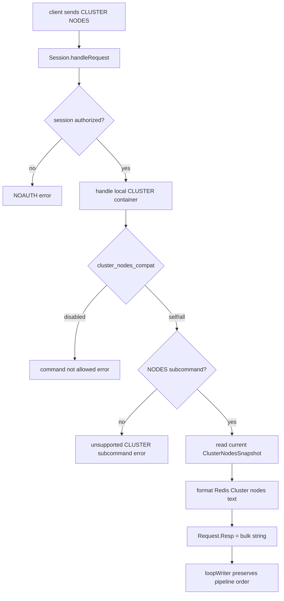

# proxy-cluster-nodes-compat design

## 0. 术语约定

- **CLUSTER NODES**：Redis Cluster `CLUSTER` 容器下的 `NODES` 子命令。Redis 8 源码中 `clusterCommand` 调用 `clusterGenNodesDescription` 生成文本行，格式是 `<id> <ip:port@bus-port[,hostname]> <flags> <master> <ping> <pong> <epoch> <link> <slot> ...`，见 `extern/redis-8.6.3/src/cluster.c:1027` 和 `extern/redis-8.6.3/src/cluster_legacy.c:5523`。
- **Redis Cluster 逻辑 slot**：Redis Cluster 标准的 `0-16383` slot 范围，只用于本 feature 的伪装输出。
- **Codis slot**：Codis 内部真实路由 slot，固定 `1024` 个，见 `pkg/models/slots.go:13`。它不是 Redis Cluster 的 `16384` slot。
- **Cluster nodes compat**：本 feature 新增的 proxy 本地兼容层，只回答 `CLUSTER NODES`。它不是完整 Redis Cluster 协议实现。
- **Proxy node source**：`CLUSTER NODES` 的节点来源。首版有 `disabled`、`self`、`all` 三种模式；`all` 模式从后端 coordinator/Jodis 存储轮询 proxy 注册信息。
- **Fake cluster node id**：为了符合 Redis Cluster 文本格式，从 `product_name`、proxy token 和 proxy address 计算出的 40 位十六进制 id。它只用于 SDK 解析和节点稳定排序，不参与 Codis 路由。

防冲突结论：本文中的 Redis Cluster slot 和 node id 都是面向客户端 SDK 的兼容输出，不改变 Codis 内部 `1024` slot 路由、dashboard/topom 拓扑、后端 Redis Server 模式，也不启用 Redis cluster bus。

## 1. 决策与约束

### 需求摘要

目标是让配置为 cluster mode 的部分 Redis SDK 能连接 Codis Proxy，并通过 `CLUSTER NODES` 拿到可解析的节点清单。成功标准是：开启兼容配置后，已认证客户端执行 `CLUSTER NODES` 返回 RESP bulk string，文本行符合 Redis Cluster 节点清单格式；`self` 模式只返回当前 proxy 且覆盖 `0-16383`；`all` 模式从后端存储轮询所有在线 proxy，并把 `0-16383` 均分给这些 proxy。proxy 之间不通信，普通业务命令仍由任意 proxy 按 Codis 真实 slot 路由到后端 Redis。

假设：

- 目标 SDK 的 cluster bootstrap 只依赖 `CLUSTER NODES` 获得节点地址；如果 SDK 还强制调用 `CLUSTER SLOTS`、`CLUSTER INFO`、`CLUSTER KEYSLOT` 或依赖 `MOVED` / `ASK`，本 feature 不能保证兼容。
- 对客户端来说，清单中的每个节点都是等价的 Codis Proxy；伪造的 Redis Cluster slot 分配只用于让 SDK 做连接选择，不表示真实数据所有权。
- `all` 模式沿用现有 Jodis proxy 注册作为节点发现来源，因为它已经是 Codis 面向客户端发现 proxy 的机制，见 `pkg/proxy/jodis.go` 和 `doc/tutorial_zh.md:477`。

明确不做：

- 不实现完整 Redis Cluster 协议，不支持 `MOVED` / `ASK`、cluster bus、gossip、failover 或 Redis Cluster 配置文件。
- 不支持 `CLUSTER SLOTS`、`CLUSTER INFO`、`CLUSTER KEYSLOT`、`CLUSTER SHARDS` 等其他 `CLUSTER` 子命令。
- 不把 Codis `1024` slot 改成 Redis Cluster `16384` slot；后端真实路由继续按 Codis hash 和 dashboard 下发的 slot mapping 执行。
- 不让 proxy 之间互相 RPC、探活或广播节点状态。
- 不读取 Consul service catalog、health check 或 service mesh；Consul 仍只通过 `models.Client` 的 KV/Session 语义参与 Jodis/coordinator 存储。
- 不新增 dashboard/FE 管理页面，不改变 dashboard/topom 的 proxy 元数据 schema。
- 不保证所有 cluster-mode SDK 都可用；只对 `CLUSTER NODES` 这个启动查询提供有限兼容。

### 复杂度档位

按“对外 Redis 协议服务”默认档位走，偏离如下：

- Compatibility = backward-compatible（偏离默认 current-only 的原因：`CLUSTER` 当前是禁用命令，默认配置必须保持现有行为）。
- Observability = logged（偏离默认 traced 的原因：本 feature 只新增本地兼容输出和后台轮询，首版通过日志暴露轮询失败，不新增 metrics 契约）。
- Testability = tested（原因：命令解析、输出格式、slot 均分、配置校验和存储轮询都可以用 proxy/models package 测试覆盖）。
- Concurrency = thread-safe（原因：后台轮询会异步更新节点快照，命令路径只能读取原子快照，不能阻塞在 coordinator IO 上）。

### 关键决策

1. **默认禁用，通过单个模式配置开启 `CLUSTER NODES`。**
   - 新配置建议为 `cluster_nodes_compat = "disabled"`，允许值是 `disabled`、`self`、`all`。
   - `disabled` 保持现有兼容边界；`self` 不依赖后端存储；`all` 需要有效的 Jodis/coordinator 配置。
   - 被拒方案：默认返回当前 proxy。这样会改变所有现有 `CLUSTER` 调用的行为，违反 backward-compatible。

2. **只把 `CLUSTER` 顶层命令变成本地受控容器，首版只放开 `NODES`。**
   - 依据：`pkg/proxy/mapper.go` 当前将 `CLUSTER` 标为 `FlagNotAllow`；为了拦截 `CLUSTER NODES`，需要允许它进入 `Session.handleRequest` 的本地分支。
   - 约束：配置禁用时返回与当前“不允许”一致的错误语义；非 `NODES` 子命令必须返回明确 unsupported error，不能落入 backend router。

3. **`all` 模式复用 Jodis 注册路径轮询 proxy 列表。**
   - 现有 Jodis 注册内容已包含 `addr`、`admin`、`start`、`token`、`state`，见 `pkg/proxy/jodis.go:25`。
   - `all` 模式打开独立 `models.Client` 轮询 `/jodis/{product}`；`jodis_compatible=true` 时轮询 `/zk/codis/db_{product}/proxy`。
   - 配置校验：`cluster_nodes_compat="all"` 时必须配置 `jodis_name` 和 `jodis_addr`；`jodis_timeout`、`jodis_auth`、`jodis_compatible` 沿用既有字段。
   - 被拒方案：从 `/codis3/{product}/proxy` 读取 dashboard store。proxy 启动配置里没有通用 `coordinator_name/addr/auth` 字段，强行新增会和 Jodis 发现机制重复；首版优先复用现有 proxy discovery。

4. **`CLUSTER NODES` 输出 Redis Cluster 格式，但语义标注为 fake。**
   - 每个 proxy 输出一行：`<node-id> <host:port@bus-port> <flags> - 0 0 0 connected <slot-range>...`。
   - 当前 proxy 行包含 `myself,master`，其他 proxy 行包含 `master`。
   - `node-id` 用 SHA1 生成 40 位十六进制；Redis Cluster 文本格式要求 40 字节 node id，而 Codis proxy token 目前是 32 位 MD5，不能直接复用。
   - `bus-port` 不开启真实监听；当 proxy address 是 TCP `host:port` 且 port 可解析时填 `port+10000`，否则填 `0`。SDK 一般只用客户端端口建业务连接，bus port 只是格式字段。

5. **`all` 模式按稳定排序均分 `0-16383`，不表达真实数据归属。**
   - 节点排序按 `node-id` 或 `token + addr` 稳定排序，保证同一组 proxy 在各实例上生成一致清单。
   - 均分策略：`base = 16384 / N`，`remainder = 16384 % N`，前 `remainder` 个节点多分 1 个 slot；N=3 时输出 `0-5461`、`5462-10922`、`10923-16383`。
   - coordinator 读取失败时保留上一份成功快照并记录日志；如果尚无成功快照，至少返回当前 proxy 的 `0-16383`，避免命令路径因存储短暂故障阻塞或失败。

## 2. 名词与编排

### 2.1 名词层

#### 命令契约

现状：

- `pkg/proxy/mapper.go` 将 `CLUSTER` 标为 `FlagNotAllow`。
- `Session.handleRequest` 在认证后只处理 `CLIENT`、`GET`、`MGET`、`SLOTSINFO`、`SLOTSSCAN`、`SLOTSMAPPING` 等本地/特殊命令，未处理 `CLUSTER`，见 `pkg/proxy/session.go:266`。
- `doc/unsupported_cmds.md` 目前没有说明 `CLUSTER NODES` 的有限支持。

变化：

- `CLUSTER` 从“顶层禁用命令”变成“本地受控命令容器”。
- 新增契约：

```text
输入：CLUSTER NODES
配置：cluster_nodes_compat = "self"
输出：bulk string，一行当前 proxy，slot range 为 0-16383
```

```text
输入：CLUSTER NODES
配置：cluster_nodes_compat = "all"
输出：bulk string，多行 proxy node，slot range 均分并完整覆盖 0-16383
```

```text
输入：CLUSTER SLOTS 或 CLUSTER INFO
输出：Redis error，表示该 CLUSTER 子命令不支持；不得转发到 backend
```

#### 配置契约

现状：

- `pkg/proxy/config.go` 的 `Config` 只包含 proxy 地址、Jodis、认证、backend/session、hot key cache 和 metrics 配置。
- `config/proxy.toml` 默认不启用 Jodis，也没有 cluster compatibility 配置。

变化：

新增默认关闭配置：

```toml
# Enable limited CLUSTER NODES compatibility for cluster-mode SDK bootstrap.
# Allowed values: "disabled", "self", "all".
cluster_nodes_compat = "disabled"

# Poll interval used when cluster_nodes_compat = "all".
cluster_nodes_refresh_period = "30s"
```

配置语义：

- `disabled`：保持当前行为，`CLUSTER` 不可用。
- `self`：只使用当前 proxy model，不访问后端存储。
- `all`：使用 `jodis_name/jodis_addr/jodis_auth/jodis_timeout/jodis_compatible` 创建 `models.Client`，轮询 Jodis 路径。
- `cluster_nodes_refresh_period` 必须大于 0；只在 `all` 模式生效。

#### 节点快照

现状：

- `Proxy` 持有当前 `models.Proxy`，其中有 `Token`、`ProxyAddr`、`AdminAddr`、`ProductName` 等字段。
- `Jodis` 只负责当前 proxy 的 ephemeral 注册和续约，不提供给命令路径读取所有 proxy 的快照。

变化：

新增 proxy 内部只读快照概念：

```text
ClusterNodesSnapshot:
  nodes: []ClusterNode
  generated_at: unix nano
  source: self | jodis
  last_error: string, only for logs/debug

ClusterNode:
  id: 40 hex fake node id
  token: codis proxy token
  addr: proxy_addr exposed to clients
  is_self: bool
  slot_start, slot_end: Redis Cluster logical slot range
```

快照是命令路径的唯一读取对象；后台轮询只做原子替换，不让 `CLUSTER NODES` 等待 coordinator IO。

### 2.2 编排层



现状：

- 客户端请求由 `Session.loopReader` 解码后交给 `handleRequest`；响应仍经 `RequestChan` 和 `loopWriter` 保序写回。
- proxy 上线后 `Proxy.Start` 启动 router 和 Jodis 注册，见 `pkg/proxy/proxy.go:160`。
- `Jodis.Start` 通过 `CreateEphemeral` 维护当前 proxy 的 `/jodis` 节点，见 `pkg/proxy/jodis.go:101`。

变化：

- `Proxy` 或 `Router` 初始化时创建 cluster nodes provider；`self` 模式直接生成当前 proxy 快照。
- `all` 模式在 `Proxy.Start` 后启动后台轮询：
  1. 创建独立 `models.Client`。
  2. 按兼容模式选择 Jodis prefix。
  3. `List(prefix)` 后逐个 `Read(path)`，解析 JSON 中的 `addr/token/state`。
  4. 过滤空 addr、非 online、解析失败的条目；按 token 和 addr 做确定性去重，当前 proxy 优先保留；确保当前 proxy 在结果中。
  5. 稳定排序并均分 `0-16383`。
  6. 原子替换快照；失败时记录日志并保留上一份快照。
- `Session.handleRequest` 增加 `CLUSTER` 本地分支，且必须位于 default backend dispatch 之前。

流程级约束：

- **认证**：`CLUSTER NODES` 和 `CLIENT LIST` 一样受 `SessionAuth` 保护；未认证时返回 `NOAUTH Authentication required`。
- **错误语义**：配置禁用时保持不允许语义；参数数量错误返回 Redis error；未知 `CLUSTER` 子命令返回 unsupported error，不关闭 proxy，不访问 backend。
- **并发**：命令路径只读快照，不持有 coordinator client 锁；后台轮询不能阻塞 session reader/writer。
- **顺序**：响应仍通过现有 request pipeline 输出，不能绕过 `loopWriter`。
- **确定性**：同一份 proxy 列表在不同 proxy 上生成同样排序和 slot range；当前 proxy 只影响 `myself` flag。
- **存储故障**：coordinator/Jodis 短暂不可用不影响已有业务命令；`CLUSTER NODES` 使用上一份成功快照或 self fallback。
- **可观测性**：轮询失败、解析异常、快照节点数变化写日志；首版不新增 metrics 字段。

### 2.3 挂载点清单

- `pkg/proxy/config.go` / `config/proxy.toml`：新增 `cluster_nodes_compat` 和 `cluster_nodes_refresh_period` 配置项与校验。
- `pkg/proxy/mapper.go` command table：修改 `CLUSTER` 的禁用状态，让它进入本地命令分支。
- `pkg/proxy/session.go` request dispatch：新增 `CLUSTER` 本地处理分支，阻止其他 `CLUSTER` 子命令落入 backend router。
- proxy runtime lifecycle：在 proxy 启动/关闭时启动和停止 cluster nodes provider 的后台轮询。

### 2.4 推进策略

1. **配置与命令入口骨架**：接入默认关闭配置，放开 `CLUSTER` 进入本地分支，`disabled` 保持不允许，`self/all` 下只有 `NODES` 有成功路径。
   - 退出信号：默认配置下 `CLUSTER NODES` 仍不可用；`self` 模式可返回 stub 节点文本；其他 `CLUSTER` 子命令不会转发到 backend。

2. **节点格式化与 self 模式**：实现 fake node id、address/bus-port 格式、`myself,master` flags 和 `0-16383` 输出。
   - 退出信号：单 proxy 输出符合 Redis Cluster `CLUSTER NODES` 文本字段数量和 slot range 要求。

3. **all 模式存储轮询**：复用 Jodis/coordinator 配置读取 proxy 注册列表，解析 online proxy，生成原子快照。
   - 退出信号：模拟多个 Jodis 节点时，快照包含所有 online proxy，删除/新增节点后一个 refresh period 内更新。

4. **slot 均分与容错**：按稳定排序均分 `0-16383`，处理空列表、坏 JSON、存储失败和地址异常。
   - 退出信号：任意 N>0 的节点列表都无 gap/overlap 覆盖 `0-16383`；存储失败保留 last good snapshot。

5. **文档与兼容边界**：更新 unsupported command / proxy 配置说明，明确 `CLUSTER NODES` 是有限兼容。
   - 退出信号：文档不再把整个 `CLUSTER` 命令笼统描述为只能失败，同时明确其他 `CLUSTER` 子命令仍不支持。

6. **验证覆盖**：补齐 proxy package 单测和必要的 models/Jodis 轮询测试。
   - 退出信号：配置校验、命令解析、输出格式、slot 均分、轮询刷新和故障 fallback 都有可重复测试证据。

### 2.5 结构健康度与微重构

##### 评估

- compound convention：已按 `doc_type=decision category=convention` 检索“目录组织 / 命名 / 归属”，无命中。
- 文件级 — `pkg/proxy/session.go`：751 行，职责包含 session 生命周期、认证、本地命令分发、多 key 命令和 slot 命令处理；文件偏胖。本 feature 应只加最小 `CLUSTER` 分支，主要逻辑落新文件。
- 文件级 — `pkg/proxy/mapper.go`：320 行，职责集中在命令属性表和 hash key 解析；本次只调整 `CLUSTER` 属性，改动密度低。
- 文件级 — `pkg/proxy/config.go`：342 行，已有 TOML 默认值、Config 结构和 Validate 集中在一个文件；新增两个配置项符合当前组织方式。
- 文件级 — `pkg/proxy/proxy.go`：633 行，职责包含 proxy model、listener、router、Jodis、stats 和 lifecycle；本次只应挂接 provider 启停，不把轮询实现塞进该文件。
- 目录级 — `pkg/proxy`：当前 16 个 production Go 文件、23 个 Go 文件总计，长期采用单 package 扁平组织；本次预计新增 `cluster_nodes.go` 和对应测试文件，符合既有 `client_list.go` / `hot_key_cache.go` 的局部能力文件风格。

##### 结论：不做前置微重构

原因：`session.go` 和 `proxy.go` 偏胖是真问题，但本 feature 可以通过“最小挂钩 + 新文件承载命令/快照/轮询逻辑”控制风险。拆分 session lifecycle 或 proxy lifecycle 会超出“只搬不改行为”的微重构边界，并增加 Redis 协议路径回归风险。`pkg/proxy` 目录偏平但属于当前包风格，本次新增 1 个能力文件不值得先重组目录。

##### 超出范围的观察

- `pkg/proxy/session.go` 后续如果继续增加本地 Redis 命令，建议单独走 `cs-refactor`，把本地命令容器处理拆出更清晰的文件边界。本 feature 不以该重构为前置。

## 3. 验收契约

### 关键场景清单

- 触发：默认配置执行 `CLUSTER NODES`。期望：行为仍表现为不允许/禁用，不返回伪装节点清单。
- 触发：`cluster_nodes_compat="self"` 且已认证连接执行 `CLUSTER NODES`。期望：返回 bulk string，仅一行当前 proxy；node id 为 40 位十六进制；flags 含 `myself,master`；slot range 为 `0-16383`。
- 触发：`cluster_nodes_compat="self"` 执行 `CLUSTER SLOTS`。期望：返回 unsupported Redis error，不访问 backend。
- 触发：`SessionAuth` 非空且未认证连接执行 `CLUSTER NODES`。期望：返回 `NOAUTH Authentication required`。
- 触发：`cluster_nodes_compat="all"` 但缺少 `jodis_name` 或 `jodis_addr`。期望：proxy 配置校验失败，错误指向 cluster nodes all mode 需要 Jodis/coordinator 配置。
- 触发：`all` 模式下 Jodis 路径存在 3 个 online proxy。期望：`CLUSTER NODES` 返回 3 行，slot ranges 分别完整覆盖 `0-16383` 且无重叠，例如 `0-5461`、`5462-10922`、`10923-16383`。
- 触发：`all` 模式下新增或删除一个 Jodis proxy 节点。期望：一个 refresh period 后 `CLUSTER NODES` 输出反映新列表；命令路径不直接访问其他 proxy。
- 触发：`all` 模式轮询期间 coordinator 临时不可用。期望：日志记录失败，命令继续返回上一份成功快照；若尚无快照则返回 self fallback。
- 触发：Jodis 中存在坏 JSON、空 addr、非 online state 的条目。期望：这些条目被跳过，不影响其他正常 proxy 输出。
- 触发：Jodis 中存在重复 token 或重复 addr 的 online 条目。期望：输出前先规范化成唯一 proxy 节点集合；当前 proxy 优先保留，非 self 冲突按确定性排序保留一个，并记录 warning。
- 触发：执行目标测试 `go test ./pkg/proxy -run 'Test(ClusterNodes|FormatClusterNodes|ClusterNodesDiscovery)'`。期望：新增 proxy 测试全部通过。

### 明确不做的反向核对项

- Diff 不应新增 `MOVED`、`ASK`、cluster bus、Redis Cluster failover/gossip 相关实现。
- Diff 不应实现 `CLUSTER SLOTS`、`CLUSTER INFO`、`CLUSTER KEYSLOT`、`CLUSTER SHARDS` 等其他 `CLUSTER` 子命令的成功路径。
- Diff 不应修改 `pkg/models/slots.go` 的 `MaxSlotNum = 1024` 或把 Codis 真实路由改成 `16384` slot。
- Diff 不应出现 proxy 到 proxy 的 HTTP/RPC 调用来生成节点清单。
- Diff 不应读取 Consul service catalog 或 health check API；Consul 只通过 `models.Client` 的 KV/Session 语义参与。
- Diff 不应新增 dashboard/FE 管理页面或 coordinator schema 迁移。

## 4. 与项目级架构文档的关系

- `requirements/redis-cluster-service.md` acceptance 阶段需要补充：Codis Proxy 可选提供 `CLUSTER NODES` 有限兼容，用于部分 cluster-mode SDK bootstrap；默认关闭，不等于完整 Redis Cluster 协议。
- `architecture/ARCHITECTURE.md` acceptance 阶段需要补充 proxy 命令边界：`Session.handleRequest` 本地处理 `CLUSTER NODES`，节点清单来自 self 或 Jodis/coordinator 轮询快照，Redis Cluster `0-16383` slot 只是客户端兼容输出，Codis 内部仍是 `1024` slot。
- `doc/unsupported_cmds.md` 或相关用户文档需要同步说明：`CLUSTER` 命令族只支持配置开启后的 `CLUSTER NODES`，其他子命令仍不支持。
