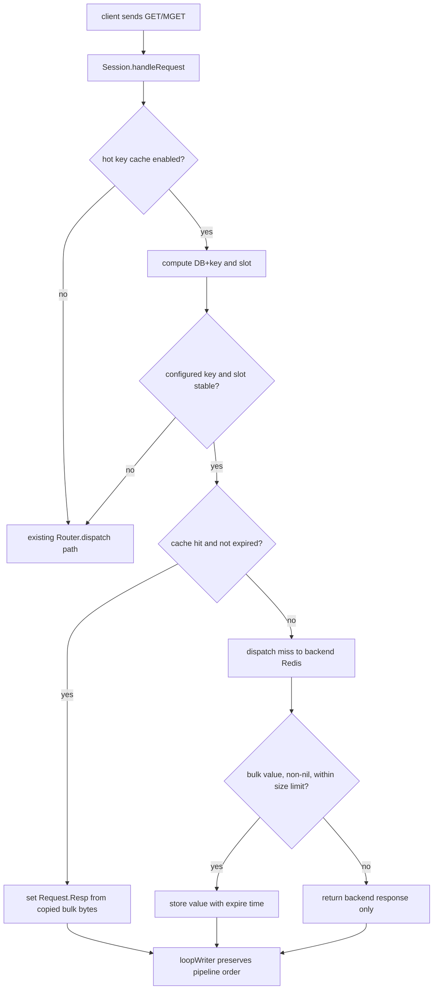
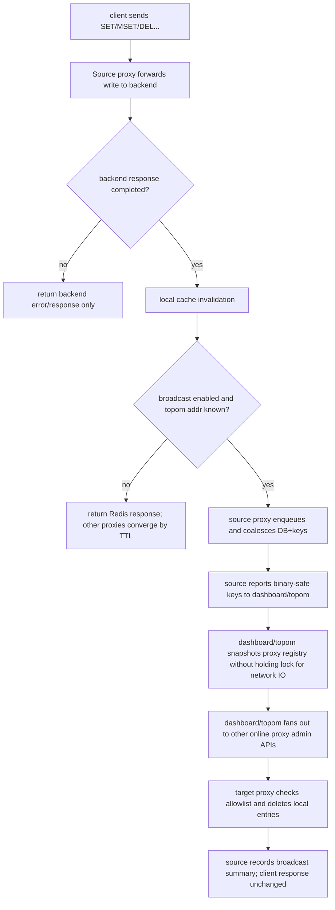

# proxy-hot-key-cache design

## 0. 术语约定

- **Hot key cache**：本 feature 指 Codis Proxy 进程内的短 TTL 读缓存，用来让已配置的高频 string key 的 `GET` / `MGET` 命中时直接由 proxy 返回，不访问后端 Redis。
- **Hot key**：首版不是自动识别出来的 key，而是运维在 proxy 配置中显式声明的 exact key。这样可以先把一致性和资源边界收住。
- **Cacheable string read**：首版只包含 `GET key` 和 `MGET key [key ...]`。`GETRANGE`、`STRLEN`、`GETBIT` 等 string 读命令不进入首版缓存命中路径。
- **Local bounded stale**：每个 proxy 实例独立缓存。写请求经过同一个 proxy 时会做本地失效；未启用广播、广播失败或直连后端 Redis 的写入仍靠 cache TTL 收敛。
- **Hot key cache invalidation broadcast**：二期新增的写后失效通知链路。源 proxy 检测到 hot key 写请求后通知 dashboard/topom 管理面，dashboard/topom 再调用其余 online proxy 的 admin HTTP API，让目标 proxy 检查并删除本地 DB+key cache entry。这里的“刷新”按失效后下次读回源刷新理解，不主动让所有 proxy 向后端 Redis 预取新值。
- **Admin component**：本文中的 admin 指 dashboard/topom 的 HTTP 管理面和 proxy 自身的 admin HTTP API，不指 `cmd/admin` 的 `codis-admin` 命令行工具。

防冲突结论：代码里已有 `topom.cache` 和 Redis 迁移 socket / client cache。本文统一用 `Hot key cache` 指 `pkg/proxy` 内的业务读缓存，不指 dashboard/topom 元数据缓存，也不指 Redis Server 迁移连接缓存。

## 1. 决策与约束

### 需求摘要

目标是让业务在不改 Redis 客户端的前提下，通过 Codis Proxy 缓解少量 string 热 key 对后端 Redis 的读放大。成功标准是：启用配置并声明 hot key 后，同一 proxy 内第一次 `GET` / `MGET` miss 仍访问后端，后续 TTL 内命中直接返回 Redis bulk value；相关写命令经过该 proxy 后，本地缓存被失效；启用写后广播时，源 proxy 通知 dashboard/topom，由 dashboard/topom 通知其余 online proxy 删除同一 DB+key 的本地 cache；未开启配置时现有行为完全不变。

假设：

- 用户接受这是一个默认关闭、显式配置、短 TTL 的弱一致缓存；跨 proxy 广播是 best-effort 缩短陈旧窗口，不升级为强一致承诺。
- `strin 类型`按 `string 类型`理解；首版只缓存 Redis string value 的完整 bulk bytes。
- hot key 来源先走 proxy 本地配置，不走 dashboard 动态下发，也不做自动热点探测。
- 源 proxy 只有在通过 dashboard/coordinator 上线并能得到 dashboard/topom admin 地址时才执行广播；`--fillslots` 离线模式不参与跨 proxy 广播。

明确不做：

- 不自动识别热 key，不维护 per-key QPS 排行，不接入 RDB Analysis 的 hot key 结果。
- 不支持 hash/list/set/zset/stream/module value 缓存。
- 不缓存 `GETRANGE`、`GETBIT`、`STRLEN`、`TTL`、`PTTL` 等派生读结果。
- 不缓存 nil bulk、Redis error 或非 bulk 响应。
- 不做 proxy 之间的直接通信，不引入 pubsub、gossip 或 coordinator 持久化广播队列。
- 不主动把新 value 写穿到其他 proxy cache；远端 proxy 只删除本地条目，下次 `GET` / `MGET` miss 后从后端 Redis 重新读取。
- 不保证跨 proxy 强一致；dashboard/topom 不可用、目标 proxy admin API 超时或部分广播失败时，仍按 `hot_key_cache_ttl` 收敛。
- 不支持通配符、prefix 或正则匹配 hot key；首版只支持 exact key。
- 不新增 dashboard/FE 管理页面或 coordinator 元数据 schema。

### 复杂度档位

按“对外 Redis 协议服务”默认档位走，偏离如下：

- Compatibility = backward-compatible（偏离默认 current-only 的原因：proxy 是 Redis 协议入口，默认关闭时必须零行为变化）。
- Performance = budgeted（原因：缓存逻辑在每次 `GET` / `MGET` 热路径上，必须有明确 entries、value size、TTL 和锁粒度边界）。
- Observability = instrumented（偏离默认 traced 的原因：缓存命中率、miss、失效、淘汰和广播成功/失败需要可见，才能判断是否值得开启）。
- Consistency = bounded-stale + best-effort invalidation broadcast（偏离默认强一致直通语义的原因：跨 proxy 通知依赖 dashboard/topom 和目标 proxy admin API，不能把 SET 结果绑定到所有 proxy 都成功失效）。
- Testability = tested（原因：读命中、本地写失效、跨 proxy 通知、TTL、关闭开关和 slot 迁移边界都可用 proxy/topom package 测试覆盖）。

### 关键决策

1. **首版采用配置式 exact key，而不是自动热点探测**。
   - 依据：当前 proxy stats 只按命令聚合，不按 key 聚合；在高 QPS 路径上新增 per-key 计数和自动晋升会引入明显资源与误判风险。
   - 被拒方案：proxy 自动统计所有 key 并按阈值晋升缓存。该方案需要采样、淘汰、跨 DB 隔离和可观测性设计，已经超出“先只支持 string 类型”的首版范围。

2. **缓存归属在 proxy/router 层，后端 Redis 仍是唯一权威数据源**。
   - 依据：proxy 已掌握 DB、命令、slot 和迁移状态；把 cache 放在 router 可同时服务请求路径和 slot 变更失效。
   - 约束：cache 只保存 value 副本和过期时间，不写 coordinator，不改变 dashboard/topom 拓扑语义。

3. **只缓存完整 string 读结果，写请求只做失效不做写穿填充**。
   - 依据：`SET` 带 `NX/XX/GET/EX/PX/KEEPTTL` 等选项时，仅从请求参数推导最终值和 TTL 容易出错；保守失效能避免把未确认写入放进缓存。
   - 约束：成功或失败的写请求都可以触发本地失效；这会牺牲少量 hit rate，但不会返回比“保留旧缓存”更危险的值。

4. **一致性模型明确为短 TTL + 本 proxy 写失效 + dashboard/topom best-effort 广播**。
   - 依据：Codis 集群允许多 proxy 承载流量，dashboard/topom 已经负责拓扑和 proxy 管理面 fan-out；让 proxy 之间直接通信会新增一套平行控制面。
   - 约束：广播只能缩短跨 proxy 陈旧窗口，不能让客户端 `SET` 依赖所有 proxy 都响应成功；开启后用户仍应把 TTL 设置为可接受的最大陈旧窗口。

5. **slot 迁移或 slot 映射变化时绕过/失效缓存**。
   - 依据：现有 `forwardSync` / `forwardSemiAsync` 会在迁移 slot 上通过 Redis 迁移命令或 exec wrapper 保证请求语义。缓存命中如果绕过这条路径，会干扰 lazy migration 和迁移写保护。
   - 约束：命中判断必须能看到 slot 状态；slot 被 `FillSlot` 更新时，关联缓存条目需要失效。

6. **广播由 dashboard/topom 协调，不使用 `codis-admin` CLI 或 proxy mesh**。
   - 依据：现有 `Topom.resyncSlotMappings` 已经通过 dashboard/topom 并发调用所有 proxy admin API；复用这个方向能保留“dashboard 是控制面”的系统边界。
   - 约束：源 proxy 只上报写后失效事件；dashboard/topom 只向已注册 online proxy fan-out；目标 proxy 只做本地检查和删除，不把通知继续转发给其他 proxy。

## 2. 名词与编排

### 2.1 名词层

#### proxy 配置契约

现状：

- `pkg/proxy/config.go` 的 `Config` 承载 proxy 本地 TOML 配置，`DefaultConfig` 同步生成 `config/proxy.toml`。
- 当前没有业务 key 级缓存配置；`proxy_max_offheap_size` 和 `proxy_heap_placeholder` 只约束内存/GC，不表达 Redis value 缓存。

变化：

- 新增一组默认关闭的配置项：

```toml
# Enable local short-TTL cache for configured string hot keys.
hot_key_cache_enabled = false
hot_key_cache_ttl = "1s"
hot_key_cache_max_entries = 1024
hot_key_cache_max_value_size = "64kb"
hot_key_cache_keys = []
hot_key_cache_broadcast_enabled = false
hot_key_cache_broadcast_timeout = "100ms"
hot_key_cache_broadcast_queue_size = 1024
```

- 配置语义：
  - `hot_key_cache_enabled=false` 时，proxy 不创建有效缓存路径，行为与当前版本一致。
  - `hot_key_cache_ttl` 是本 proxy 允许返回旧值的最大窗口，启用时必须大于 0。
  - `hot_key_cache_max_entries` 控制本 proxy 最多缓存多少个 DB+key 条目。
  - `hot_key_cache_max_value_size` 控制单个 string value 最大缓存大小；超过时直通返回但不缓存。
  - `hot_key_cache_keys` 是 exact key 列表；cache 运行时以 `database + raw key bytes` 做条目 key。
  - `hot_key_cache_broadcast_enabled=false` 时，只保留一期本 proxy 写后失效行为；设为 true 时，proxy 在具备 dashboard/topom admin 地址后尝试上报写后失效事件。
  - `hot_key_cache_broadcast_timeout` 控制源 proxy 上报 dashboard/topom、dashboard/topom fan-out 到目标 proxy admin API 的单次 HTTP 超时预算；超时不能让 Redis 写请求失败。
  - `hot_key_cache_broadcast_queue_size` 控制 source proxy 内部异步广播队列；队列满时丢弃本次广播事件并计数，不能阻塞 Redis 写请求。

#### HotKeyCache 运行态

现状：

- `Router` 只持有 slot 路由状态、后端连接池和 proxy 配置，见 `pkg/proxy/router.go` 的 `Router`。
- `Request` 保存 `Multi`、`OpStr`、`OpFlag`、`Database`、`Resp` 和 `Coalesce`，见 `pkg/proxy/request.go`。

变化：

- 新增 `HotKeyCache` 这类 proxy 内部运行态：

```text
Cache key: database + raw Redis key bytes
Cache value: copied bulk bytes + slot id + expire unix nano
Stats: hits, misses, stores, invalidations, evictions, entries
```

- `Router` 维护每个 slot 的本地版本号，`HotKeyCache` 维护全局失效版本号。读 miss 时记录 slot 版本和 cache 失效版本，后端响应回来准备写 cache 前再次核对；如果期间 `FillSlot` 更新过该 slot，或任何写失效已经发生，则放弃写 cache，避免旧请求在失效后回填旧值。
- 二期新增写后广播统计和本地远端失效入口：

```text
Broadcast event: source proxy token + database + binary-safe Redis key bytes
Remote invalidation: target proxy checks configured key and deletes DB+key entry if present
Stats: broadcast attempts, broadcast failures, broadcast dropped, broadcast coalesced, remote invalidations
```

- 广播事件不携带 value，不要求目标 proxy 配置了相同 key 才算错误。目标 proxy 收到事件后只在本地 cache enabled 且 key configured 时删除条目；未启用 cache、未配置 key、条目不存在都视为幂等成功。

- 新增只读快照，用于 proxy stats：

```text
输入：Proxy.Stats(StatsRuntime 或 StatsFull)
输出：hot_key_cache.enabled/entries/hits/misses/stores/invalidations/evictions
来源：pkg/proxy/proxy.go Stats
```

#### dashboard/topom 广播契约

现状：

- `cmd/proxy/main.go` 支持通过 `--dashboard` 或 coordinator 自动发现 dashboard/topom admin 地址并上线；上线后 dashboard/topom 在 store 中维护 online proxy 模型。
- `pkg/topom/topom_proxy.go` 已通过 `newProxyClient(p).FillSlots(...)` 并发调用所有 proxy admin API，下发 slot 变更。
- `pkg/proxy/proxy_api.go` 提供 proxy admin API，并用 `xauth` 保护 `/api/proxy/*` 的写操作。

变化：

- 新增 source proxy 到 dashboard/topom 的写后失效上报 API：

```text
PUT /api/topom/hot-key-cache/invalidate/:xauth
body: { "source_proxy_token": "...", "database": 0, "keys_base64": ["aG90", "aG90Mg=="], "timeout_millis": 100 }
```

- 新增 dashboard/topom 到目标 proxy 的本地失效 API：

```text
PUT /api/proxy/hot-key-cache/invalidate/:xauth
body: { "database": 0, "keys_base64": ["aG90", "aG90Mg=="] }
```

- `keys_base64` 承载 Redis key 原始字节，避免把 Redis binary-safe key 当成 JSON UTF-8 string 改写。
- dashboard/topom 收到事件后读取当前 proxy registry，对除 `source_proxy_token` 外的 online proxy 并发 fan-out；目标 proxy 使用自身配置检查 key 是否属于 hot key cache allowlist，并删除本地 DB+key cache entry。
- dashboard/topom 返回 fan-out 摘要给源 proxy，至少包含目标数量和失败数量；源 proxy 记录失败统计和日志，但不改变客户端写命令的 Redis 响应。

#### cacheable command 契约

现状：

- `Session.handleRequest` 先处理本地命令，再把普通命令交给 `Router.dispatch`。
- `MGET` / `MSET` / `DEL` / `EXISTS` 已在 `pkg/proxy/session.go` 中被拆成单 key subrequest 后合并响应。
- `mapper.go` 标记 `GET` / `MGET` 为 read-only，`SET` / `MSET` / `DEL` / `EXPIRE` 等写命令带 `FlagWrite`。

变化：

- `GET key`：
  - key 不在 allowlist、cache 关闭、slot 迁移中、cache miss 或 entry expired：走现有 `Router.dispatch`。
  - backend 返回 bulk bytes 且 value 非 nil、大小不超过限制：写入 cache。
  - cache hit：直接设置 `Request.Resp = redis.NewBulkBytes(copiedValue)`，不访问 backend。

- `MGET key [key ...]`：
  - 对每个 key 独立判断缓存命中。
  - 命中的 key 直接填入数组位置；miss 的 key 沿用现有 subrequest 转发；最终保持原始 key 顺序 coalesce。
  - 只缓存 backend 返回的非 nil bulk value；nil 或错误不缓存。

- 写失效：
  - `SET`、`SETEX`、`PSETEX`、`SETNX`、`GETSET`、`APPEND`、`INCR*`、`DECR*`、`SETBIT`、`SETRANGE`、`EXPIRE*`、`PEXPIRE*`、`PERSIST`、`DEL`、`MSET` 等命中 hot key 的写请求触发本地失效。
  - `EVAL` / `EVALSHA` / 未知 `FlagMayWrite` 这类难以完整枚举 key 副作用的命令，在 cache 开启时对当前 DB 执行保守清理，避免脚本改了 hot key 但缓存仍保留。
  - 能精确枚举 key 的写请求在本地失效后可生成广播事件；`EVAL` / `EVALSHA` / 未知 `FlagMayWrite` 的当前 DB 保守清理不做跨 proxy 全 DB 广播，避免一次脚本写入放大成全局清 cache。

### 2.2 编排层





现状：

- `Session.loopReader` 解码请求并调用 `handleRequest`；`loopWriter` 等待 `Request.Batch` 和 `Coalesce` 后按顺序写回。
- `Router.dispatch` 用 hash key 计算 slot，再调用 `Slot.forward`；slot 迁移时由 forward method 处理迁移或 wrapper。
- `Router.FillSlot` 更新 slot backend/migrate/replicaGroups 和 forward method。
- dashboard/topom 已经持有 proxy registry，并能通过 `proxy.ApiClient` 调用各 proxy admin API 做 `FillSlots`、`Start`、`SetSentinels` 等控制面操作。
- proxy 进程当前不在 request path 中持有 dashboard/topom client；`cmd/proxy/main.go` 只在上线流程中短暂创建 topom API client。

变化：

- `Session.handleRequest` 在认证和命令解析后，把 `GET` / `MGET` 交给 cache-aware 分支；关闭或不适用时回落到当前路径。
- cache lookup 由 router/cache 协作完成：先用同一套 `Hash(key) % MaxSlotNum` 定位 slot，再判断 slot 是否稳定。slot 有 `migrate.bc`、locked 或 backend 未就绪时，不使用缓存。
- miss 后仍走现有 dispatch/coalesce 模型；写 cache 是 response coalesce 阶段的副作用，不能打乱 pipeline 顺序。
- `Router.FillSlot` 更新某个 slot 时，同步推进 slot 版本并失效该 slot 的本地缓存条目；更新前发出的 miss 请求如果稍后返回，只能在 slot 版本未变化时写入 cache。
- `Proxy.Stats` 读取 cache snapshot；开启 hot key cache 或已有非零统计时，HTTP stats/model API 和 JSON metrics report 带出 `hot_key_cache` 字段。默认关闭且无统计时省略该新增字段，降低严格 JSON 消费者的兼容风险；InfluxDB/StatsD 首版不新增字段，避免扩大外部指标契约。
- proxy 上线成功后记录 dashboard/topom admin 地址；如果通过 coordinator 上线，则使用当次发现到的 `models.Topom.AdminAddr`。`--fillslots` 模式没有 dashboard/topom 地址，广播保持关闭退化。
- 写请求的后端响应完成后，source proxy 先按一期逻辑做本地失效，再把可枚举的 DB+keys 放入有界异步队列；短窗口内相同 DB+key 合并，队列满时丢弃事件并计数，不修改客户端响应。
- dashboard/topom 收到事件后，锁内只校验 source 和复制当前 proxy registry 快照；锁外复用 `proxy.ApiClient` 并发通知其余 online proxy。请求体中的 timeout 会被归一化到保守上下限，失败按目标 proxy 聚合，不重试、不写 coordinator。
- 目标 proxy 收到远端失效请求后，只做本地检查和删除；它不访问后端 Redis，不向 dashboard/topom 回报 value，不再向其他 proxy 转发。

流程级约束：

- **错误语义**：cache 内部错误不能让请求失败；最多退化为直通 backend。backend Redis 的 error 原样返回，不缓存。
- **广播错误语义**：写命令是否成功只由后端 Redis 响应决定。source proxy 上报 dashboard/topom 失败、dashboard/topom 部分 fan-out 失败、目标 proxy 返回 not found/未配置 key，都不能把成功写命令改成失败。
- **并发**：cache 必须 thread-safe；命中路径不能持有 slot 写锁；value 需要复制后存储，避免响应 buffer 复用带来的并发风险。
- **顺序**：GET/MGET 的响应仍经 `RequestChan` 和 `loopWriter` 输出，不能绕过现有 pipeline 顺序。
- **顺序**：本地失效必须发生在写请求后端响应完成后；远端广播只能进入有界异步队列，不能让 Redis 写响应等待 dashboard/topom 或其他 proxy。
- **一致性**：同 proxy 写请求对本地 cache 失效；启用广播且路径可用时，其余 proxy 尽快失效同一 DB+key；广播失败、proxy 离线或直连后端写入仍只保证在 `hot_key_cache_ttl` 后收敛。
- **迁移**：slot 迁移中不读 cache；slot mapping 变化失效对应 slot，确保请求继续经过现有 migration wrapper。
- **资源边界**：cache 必须同时受 entries、value size、TTL 约束；淘汰策略首版用 LRU 或等价近似 LRU。
- **可观测性**：hits/misses/stores/invalidations/evictions/entries 以及广播 attempts/failures/dropped/coalesced/remote_invalidations 至少在 proxy stats JSON 或 dashboard/topom 日志中可见。

### 2.3 挂载点清单

- `pkg/proxy/config.go` / `config/proxy.toml`：新增默认关闭的 hot key cache 配置项和校验。
- `pkg/proxy/session.go` request dispatch：新增 `GET` / `MGET` cache-aware 分支，关闭或不适用时保持现有路径。
- `pkg/proxy/router.go` slot 变更流程：slot 更新时触发对应 cache 失效，并提供 cache lookup/store 需要的 slot 稳定性判断。
- `pkg/proxy/proxy.go` stats JSON：新增 hot key cache snapshot，让运维能看到命中率和资源占用。
- `pkg/proxy/proxy_api.go`：新增目标 proxy 接收 dashboard/topom 远端 hot key cache 失效的 admin API。
- `pkg/topom/topom_api.go` / `pkg/topom/topom_proxy.go`：新增 dashboard/topom 接收 source proxy 事件并 fan-out 到其余 proxy 的 admin API 编排。
- `cmd/proxy/main.go` 或 proxy 运行态上线回调：在通过 dashboard/coordinator 上线成功时，把 dashboard/topom admin 地址交给 proxy 的广播 reporter；`--fillslots` 模式不设置。
- `pkg/utils/rpc/api.go`：为广播链路提供不改变默认 RPC 行为的可选 timeout 调用入口。

### 2.4 推进策略

1. **配置与空缓存骨架**：接入默认关闭的配置、校验和 `HotKeyCache` 空实现。
   - 退出信号：默认配置加载成功；关闭时 GET/MGET 行为和现状一致。

2. **GET 命中/miss 编排**：在 request path 接入单 key cache lookup、store 和直通回退。
   - 退出信号：配置 hot key 后，第一次 GET 访问 backend，第二次 TTL 内 GET 不访问 backend 且响应相同。

3. **MGET 局部命中编排**：按 key 拆分命中/miss，复用现有 coalesce 保持顺序。
   - 退出信号：MGET 混合命中和 miss 时返回数组顺序正确，backend 只收到 miss key。

4. **写失效与保守清理**：覆盖 string 写、TTL 写、多 key 写和脚本/未知 may-write 的本地失效策略。
   - 退出信号：同 proxy 写入 hot key 后，下一次 GET 必须访问 backend 并返回新值或后端当前结果。

5. **slot 变更与迁移边界**：在 slot migrating/locked 时绕过 cache，`FillSlot` 后失效对应 slot。
   - 退出信号：迁移状态下 GET 不从旧 cache 返回；slot 映射更新后旧条目不可命中。

6. **stats 与文档边界**：补齐 proxy stats、配置注释和命令兼容说明。
   - 退出信号：stats JSON 能看到 cache enabled、entries、hits、misses、invalidations、evictions；文档明确弱一致边界。

7. **验证覆盖**：补齐 proxy package 单测和必要的 fake backend 计数测试。
   - 退出信号：关闭开关、GET/MGET、TTL、写失效、迁移绕过、stats 场景都有可观察证据。

8. **二期配置与上线地址接入**：新增广播开关、timeout 和 proxy 持有 dashboard/topom admin 地址的运行态入口。
   - 退出信号：默认关闭时行为与一期一致；通过 dashboard/coordinator 上线的 proxy 能拿到 topom admin 地址；`--fillslots` 模式广播不可用但不报错。

9. **proxy 本地远端失效 API**：让目标 proxy admin API 接收 DB+keys 并执行幂等本地删除。
   - 退出信号：目标 proxy 收到 remote invalidation 后，仅当本地已缓存该 DB+key 时删除 entry；未启用 cache、未配置 key、entry 不存在均返回成功。

10. **dashboard/topom fan-out 编排**：新增 source proxy 上报 API，由 dashboard/topom 排除 source 后通知其余 online proxy。
   - 退出信号：两个以上 proxy 注册时，source 上报一个 hot key 写事件后，其余 proxy 的同 DB+key cache 被删除；某个目标 proxy 失败时返回摘要和日志，不影响其他 proxy。

11. **写后广播触发与统计**：把可枚举 key 的写后本地失效事件接入 source proxy 有界合并 reporter，并补齐广播 attempts/failures/dropped/coalesced/remote invalidations 统计。
   - 退出信号：`SET` / `MSET` / `DEL` / `EXPIRE` / `PERSIST` 等写命令成功响应后进入异步广播队列；后端写失败、broadcast disabled、topom 地址未知、队列满、脚本/未知 may-write 不影响 Redis 写响应。

12. **跨 proxy 验证覆盖与文档边界**：补齐 proxy/topom 单测或集成式 fake admin API 测试，并更新用户文档。
   - 退出信号：本地失效、远端失效、dashboard fan-out、失败降级、默认关闭和 `--fillslots` 退化场景都有可观察证据；文档明确 admin 指 dashboard/topom 管理面而不是 `codis-admin` CLI。

### 2.5 结构健康度与微重构

##### 评估

- compound convention：已检索 `.codestable/compound`，无目录组织 / 命名 / 归属类 convention 命中。
- 文件级 — `pkg/proxy/session.go`：743 行，职责包含 session 生命周期、认证、本地命令处理、多 key 命令拆分、slot 命令和 op stats，已经偏胖。本 feature 不应把缓存计算和 LRU 逻辑继续塞进该文件。
- 文件级 — `pkg/proxy/router.go`：276 行，职责集中在 slot 路由、后端连接池、slot fill 和 master switch。本 feature 需要轻量接入 cache owner 和 slot 失效，改动密度可控。
- 文件级 — `pkg/proxy/config.go`：308 行，职责集中在 TOML 默认配置、字段和校验。本 feature 新增一组配置项，符合该文件职责。
- 文件级 — `pkg/proxy/proxy.go`：628 行，职责偏多但 stats 类型和 `Stats()` 已在此处。本 feature 只增加 stats 字段和 snapshot 赋值，不承载 cache 算法。
- 文件级 — `pkg/proxy/proxy_api.go`：已有 proxy 管理 API 路由和 `ApiClient`，新增一个 hot key cache invalidation API 符合它的 admin API 职责；具体 payload/handler 不应塞进 request path。
- 文件级 — `pkg/topom/topom_proxy.go`：已有 proxy registry fan-out 编排，例如 `resyncSlotMappings`；新增 hot key cache invalidation fan-out 符合“dashboard/topom 调 proxy admin API”的职责。
- 文件级 — `cmd/proxy/main.go`：上线流程已经知道 dashboard/topom admin 地址，但不应承载广播算法；只适合把地址注入 proxy 运行态。
- 目录级 — `pkg/proxy`：已有 21 个 Go 文件，包内长期采用扁平文件组织。本次预计新增 `hot_key_cache.go` / `hot_key_cache_test.go`，符合现有按主题拆文件的风格。
- 目录级 — `pkg/topom`：已有 proxy 管理、slot 管理、RDB analysis 等按主题拆文件的扁平风格；如果 fan-out 逻辑超过轻量 handler，二期可新增 `topom_hot_key_cache.go` / `topom_hot_key_cache_test.go`，避免继续拉长 `topom_api.go`。

##### 结论：不做前置微重构

原因：`session.go`、`proxy.go` 和 `topom_api.go` 偏胖是真问题，但本次可以通过“最小分派入口 + cache/broadcast 主题文件承载算法和 payload”控制风险。把 proxy request path、dashboard API 路由或 topom proxy 管理整体拆文件会触碰 Redis 协议主路径和管理 API，超出本 feature 的安全微重构边界。

##### 超出范围的观察

- `pkg/proxy/session.go` 同时承载本地命令、跨 slot 多 key 拆分和响应合并。后续如果继续增加 proxy 本地 Redis 命令，建议单独走 `cs-refactor` 拆分本地命令处理；本 feature 不阻塞在该重构上。
- `pkg/topom/topom_api.go` 路由已经较集中。后续如果 dashboard/topom 管理 API 继续增加独立业务域，建议单独走 `cs-refactor` 把 API route registration 和主题 handler 拆开；本 feature 不阻塞在该重构上。

## 3. 验收契约

### 关键场景清单

- 触发：默认配置下执行 GET/MGET。期望：响应和现状一致，proxy stats 中 cache disabled 或 entries 为 0，backend 收到完整请求。
- 触发：启用 cache 且 `hot_key_cache_keys=["hot"]`，连续两次 `GET hot`。期望：第一次访问 backend 并 store，第二次 TTL 内由 proxy 返回同一 bulk value，backend 计数不增加。
- 触发：`GET cold`，其中 `cold` 不在 allowlist。期望：每次都访问 backend，不进入 cache stats hit。
- 触发：backend 对 `GET hot` 返回 nil bulk、error 或 value 超过 `hot_key_cache_max_value_size`。期望：proxy 返回原响应但不 store。
- 触发：`MGET hot cold hot2`，其中 `hot` 命中、`hot2` miss、`cold` 不可缓存。期望：返回数组顺序与请求一致，backend 只收到 miss/不可缓存 key 对应请求。
- 触发：同一 proxy 上对 hot key 执行 `SET` / `MSET` / `DEL` / `EXPIRE` / `PERSIST` 之一后再 `GET`。期望：旧 cache 不命中，下一次读访问 backend。
- 触发：cache entry 超过 `hot_key_cache_ttl` 后再次 `GET`。期望：过期条目不命中，backend 重新被访问。
- 触发：cache entries 超过 `hot_key_cache_max_entries`。期望：发生淘汰，stats evictions 增加，entries 不超过上限。
- 触发：slot 正处于 migrating/locked 或 `FillSlot` 更新后读取 hot key。期望：不从旧 cache 返回；请求走现有 router/forward 路径。
- 触发：开启 cache 后执行 `EVAL` / 未知 may-write 命令。期望：当前 DB 的本地 cache 被保守清理，命令仍按现有路由规则处理。
- 触发：读取 proxy `/api/proxy/stats`。期望：返回 JSON 包含 hot key cache enabled、entries、hits、misses、stores、invalidations、evictions。
- 触发：执行 `go test ./pkg/proxy -run 'TestHotKeyCache|TestSessionHotKeyCache|TestRouterHotKeyCache'`。期望：新增目标测试通过。
- 触发：默认 `hot_key_cache_broadcast_enabled=false`，同一集群两个 proxy 分别缓存同一 hot key，proxy A 执行 `SET hot ...`。期望：proxy A 本地失效；proxy B 仍按一期 TTL 收敛；无 dashboard/topom broadcast 调用。
- 触发：开启广播，proxy A 和 proxy B 都 online 到同一 dashboard/topom，二者均缓存 DB0 的 `hot`，proxy A 执行成功 `SET hot ...`。期望：proxy A 写后本地失效并上报 dashboard/topom；dashboard/topom 排除 proxy A 后通知 proxy B；proxy B 删除 DB0+`hot`，下一次 `GET hot` 访问 backend。
- 触发：hot key 含非 UTF-8 字节，例如 `0xff 68 6f 74`。期望：source proxy、dashboard/topom 和目标 proxy 通过 `keys_base64` 保留原始 key bytes，目标 proxy 删除同一个 DB+raw key entry。
- 触发：proxy A 执行 `MSET hot v hot2 v2 cold v3`，其中 `hot` / `hot2` 是配置 hot key。期望：广播 payload 只包含可枚举的 hot key DB+key；目标 proxy 幂等删除对应本地 entries。
- 触发：proxy A 执行后端返回错误的 `SET hot ...` 或 request dispatch 失败。期望：不触发本地失效广播，客户端仍收到原后端错误。
- 触发：短时间重复写同一 DB+key 或广播队列满。期望：重复 key 被合并并计入 coalesced；队列满时事件被丢弃并计入 dropped；客户端写响应不受影响。
- 触发：dashboard/topom 不可达、某个目标 proxy admin API timeout 或返回错误。期望：source proxy/client 写响应不被改成失败；失败被计入广播失败统计或日志；其他可达 proxy 仍被通知。
- 触发：target proxy 收到 remote invalidation，但本地 cache disabled、key 不在 allowlist 或 entry 不存在。期望：API 返回成功，stats 不出现错误计数。
- 触发：proxy 以 `--fillslots` 模式启动并开启 hot key cache。期望：本地 cache 行为仍可用，广播 reporter 因无 dashboard/topom 地址保持 disabled/不可用，不影响写请求。
- 触发：读取 proxy `/api/proxy/stats` 或 dashboard/topom fan-out 摘要。期望：能看到 broadcast attempts/failures/dropped/coalesced/remote invalidations 的可观测证据。
- 触发：执行目标测试。期望：`go test ./pkg/proxy -run TestHotKeyCache -count=1` 和覆盖 topom fan-out 的目标测试通过。

### 明确不做的反向核对项

- Diff 不应出现 dashboard/FE hot key cache 管理页面。
- Diff 不应出现 coordinator schema 或 models.Store 中的 hot key cache 元数据。
- Diff 不应出现自动 per-key QPS 统计和热点晋升逻辑。
- Diff 不应让 hash/list/set/zset/stream/module value 被缓存。
- Diff 不应给 `GETRANGE`、`GETBIT`、`STRLEN` 等派生读命令增加 cache hit 成功路径。
- Diff 不应新增 proxy-to-proxy 直接通信、pubsub、gossip 或 coordinator 持久化广播队列。
- Diff 不应让 dashboard/topom 主动拉取或保存 Redis value；广播 payload 只允许 source proxy token、database、binary-safe keys 和 timeout 这类失效元数据。
- Diff 不应让 `codis-admin` CLI 成为运行时广播链路的一环。
- 默认 `hot_key_cache_enabled=false` 时，GET/MGET 的 backend 请求数量和响应应与现状一致。

## 4. 与项目级架构文档的关系

acceptance 阶段应更新 `.codestable/architecture/ARCHITECTURE.md`：

- 在 proxy 内存状态中补充：proxy/router 可持有默认关闭的 hot key cache，cache 只保存在单 proxy 进程内，不进入 coordinator。
- 在命令路由描述中补充：`GET` / `MGET` 对配置的 string hot key 可在 proxy 本地短 TTL 命中；其他命令仍走现有 router/forward。
- 在 dashboard/topom 控制面描述中补充：启用广播后，source proxy 可向 dashboard/topom 上报写后失效事件，dashboard/topom fan-out 到其他 online proxy 的 admin API；该链路不经过 `codis-admin` CLI。
- 在已知约束中补充：hot key cache 是 opt-in bounded stale 能力，同 proxy 写入本地失效，跨 proxy 写入可通过 dashboard/topom best-effort 广播缩短陈旧窗口；广播失败、proxy 离线或直连后端写入仍靠 TTL 收敛；slot 迁移中绕过缓存。
