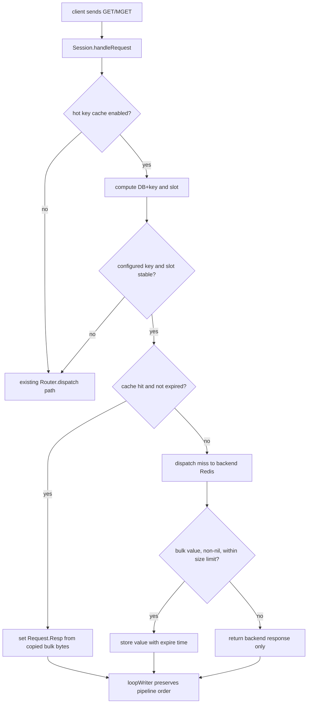

# proxy-hot-key-cache design

## 0. 术语约定

- **Hot key cache**：本 feature 指 Codis Proxy 进程内的短 TTL 读缓存，用来让已配置的高频 string key 的 `GET` / `MGET` 命中时直接由 proxy 返回，不访问后端 Redis。
- **Hot key**：首版不是自动识别出来的 key，而是运维在 proxy 配置中显式声明的 exact key。这样可以先把一致性和资源边界收住。
- **Cacheable string read**：首版只包含 `GET key` 和 `MGET key [key ...]`。`GETRANGE`、`STRLEN`、`GETBIT` 等 string 读命令不进入首版缓存命中路径。
- **Local bounded stale**：每个 proxy 实例独立缓存。写请求经过同一个 proxy 时会做本地失效；其他 proxy 或直连后端 Redis 的写入只能靠 cache TTL 收敛。

防冲突结论：代码里已有 `topom.cache` 和 Redis 迁移 socket / client cache。本文统一用 `Hot key cache` 指 `pkg/proxy` 内的业务读缓存，不指 dashboard/topom 元数据缓存，也不指 Redis Server 迁移连接缓存。

## 1. 决策与约束

### 需求摘要

目标是让业务在不改 Redis 客户端的前提下，通过 Codis Proxy 缓解少量 string 热 key 对后端 Redis 的读放大。成功标准是：启用配置并声明 hot key 后，同一 proxy 内第一次 `GET` / `MGET` miss 仍访问后端，后续 TTL 内命中直接返回 Redis bulk value；相关写命令经过该 proxy 后，本地缓存被失效；未开启配置时现有行为完全不变。

假设：

- 用户接受这是一个默认关闭、显式配置、短 TTL 的弱一致缓存，不要求跨 proxy 强一致。
- `strin 类型`按 `string 类型`理解；首版只缓存 Redis string value 的完整 bulk bytes。
- hot key 来源先走 proxy 本地配置，不走 dashboard 动态下发，也不做自动热点探测。

明确不做：

- 不自动识别热 key，不维护 per-key QPS 排行，不接入 RDB Analysis 的 hot key 结果。
- 不支持 hash/list/set/zset/stream/module value 缓存。
- 不缓存 `GETRANGE`、`GETBIT`、`STRLEN`、`TTL`、`PTTL` 等派生读结果。
- 不缓存 nil bulk、Redis error 或非 bulk 响应。
- 不做跨 proxy 失效广播，不保证另一个 proxy 写入后本 proxy 立即失效。
- 不支持通配符、prefix 或正则匹配 hot key；首版只支持 exact key。
- 不新增 dashboard/FE 管理页面或 coordinator 元数据 schema。

### 复杂度档位

按“对外 Redis 协议服务”默认档位走，偏离如下：

- Compatibility = backward-compatible（偏离默认 current-only 的原因：proxy 是 Redis 协议入口，默认关闭时必须零行为变化）。
- Performance = budgeted（原因：缓存逻辑在每次 `GET` / `MGET` 热路径上，必须有明确 entries、value size、TTL 和锁粒度边界）。
- Observability = instrumented（偏离默认 traced 的原因：缓存命中率、miss、失效和淘汰需要进 proxy stats，才能判断是否值得开启）。
- Consistency = bounded-stale（偏离默认强一致直通语义的原因：proxy 本地缓存天然无法感知其他 proxy 或直连后端写入）。
- Testability = tested（原因：读命中、写失效、TTL、关闭开关和 slot 迁移边界都可用 proxy package 测试覆盖）。

### 关键决策

1. **首版采用配置式 exact key，而不是自动热点探测**。
   - 依据：当前 proxy stats 只按命令聚合，不按 key 聚合；在高 QPS 路径上新增 per-key 计数和自动晋升会引入明显资源与误判风险。
   - 被拒方案：proxy 自动统计所有 key 并按阈值晋升缓存。该方案需要采样、淘汰、跨 DB 隔离和可观测性设计，已经超出“先只支持 string 类型”的首版范围。

2. **缓存归属在 proxy/router 层，后端 Redis 仍是唯一权威数据源**。
   - 依据：proxy 已掌握 DB、命令、slot 和迁移状态；把 cache 放在 router 可同时服务请求路径和 slot 变更失效。
   - 约束：cache 只保存 value 副本和过期时间，不写 coordinator，不改变 dashboard/topom 拓扑语义。

3. **只缓存完整 string 读结果，写请求只做失效不做写穿填充**。
   - 依据：`SET` 带 `NX/XX/GET/EX/PX/KEEPTTL` 等选项时，仅从请求参数推导最终值和 TTL 容易出错；保守失效能避免把未确认写入放进缓存。
   - 约束：成功或失败的写请求都可以触发本地失效；这会牺牲少量 hit rate，但不会返回比“保留旧缓存”更危险的值。

4. **一致性模型明确为短 TTL + 本 proxy 写失效**。
   - 依据：Codis 集群允许多 proxy 承载流量，当前没有跨 proxy 的业务 key 失效通道。强行承诺强一致会误导用户。
   - 约束：配置文档和验收必须证明默认关闭；开启后用户应把 TTL 设置为可接受的最大陈旧窗口。

5. **slot 迁移或 slot 映射变化时绕过/失效缓存**。
   - 依据：现有 `forwardSync` / `forwardSemiAsync` 会在迁移 slot 上通过 Redis 迁移命令或 exec wrapper 保证请求语义。缓存命中如果绕过这条路径，会干扰 lazy migration 和迁移写保护。
   - 约束：命中判断必须能看到 slot 状态；slot 被 `FillSlot` 更新时，关联缓存条目需要失效。

## 2. 名词与编排

### 2.1 名词层

#### proxy 配置契约

现状：

- `pkg/proxy/config.go` 的 `Config` 承载 proxy 本地 TOML 配置，`DefaultConfig` 同步生成 `config/proxy.toml`。
- 当前没有业务 key 级缓存配置；`proxy_max_offheap_size` 和 `proxy_heap_placeholder` 只约束内存/GC，不表达 Redis value 缓存。

变化：

- 新增一组默认关闭的配置项：

```toml
# Enable local short-TTL cache for configured string hot keys.
hot_key_cache_enabled = false
hot_key_cache_ttl = "1s"
hot_key_cache_max_entries = 1024
hot_key_cache_max_value_size = "64kb"
hot_key_cache_keys = []
```

- 配置语义：
  - `hot_key_cache_enabled=false` 时，proxy 不创建有效缓存路径，行为与当前版本一致。
  - `hot_key_cache_ttl` 是本 proxy 允许返回旧值的最大窗口，启用时必须大于 0。
  - `hot_key_cache_max_entries` 控制本 proxy 最多缓存多少个 DB+key 条目。
  - `hot_key_cache_max_value_size` 控制单个 string value 最大缓存大小；超过时直通返回但不缓存。
  - `hot_key_cache_keys` 是 exact key 列表；cache 运行时以 `database + raw key bytes` 做条目 key。

#### HotKeyCache 运行态

现状：

- `Router` 只持有 slot 路由状态、后端连接池和 proxy 配置，见 `pkg/proxy/router.go` 的 `Router`。
- `Request` 保存 `Multi`、`OpStr`、`OpFlag`、`Database`、`Resp` 和 `Coalesce`，见 `pkg/proxy/request.go`。

变化：

- 新增 `HotKeyCache` 这类 proxy 内部运行态：

```text
Cache key: database + raw Redis key bytes
Cache value: copied bulk bytes + slot id + expire unix nano
Stats: hits, misses, stores, invalidations, evictions, entries
```

- `Router` 维护每个 slot 的本地版本号，`HotKeyCache` 维护全局失效版本号。读 miss 时记录 slot 版本和 cache 失效版本，后端响应回来准备写 cache 前再次核对；如果期间 `FillSlot` 更新过该 slot，或任何写失效已经发生，则放弃写 cache，避免旧请求在失效后回填旧值。

- 新增只读快照，用于 proxy stats：

```text
输入：Proxy.Stats(StatsRuntime 或 StatsFull)
输出：hot_key_cache.enabled/entries/hits/misses/stores/invalidations/evictions
来源：pkg/proxy/proxy.go Stats
```

#### cacheable command 契约

现状：

- `Session.handleRequest` 先处理本地命令，再把普通命令交给 `Router.dispatch`。
- `MGET` / `MSET` / `DEL` / `EXISTS` 已在 `pkg/proxy/session.go` 中被拆成单 key subrequest 后合并响应。
- `mapper.go` 标记 `GET` / `MGET` 为 read-only，`SET` / `MSET` / `DEL` / `EXPIRE` 等写命令带 `FlagWrite`。

变化：

- `GET key`：
  - key 不在 allowlist、cache 关闭、slot 迁移中、cache miss 或 entry expired：走现有 `Router.dispatch`。
  - backend 返回 bulk bytes 且 value 非 nil、大小不超过限制：写入 cache。
  - cache hit：直接设置 `Request.Resp = redis.NewBulkBytes(copiedValue)`，不访问 backend。

- `MGET key [key ...]`：
  - 对每个 key 独立判断缓存命中。
  - 命中的 key 直接填入数组位置；miss 的 key 沿用现有 subrequest 转发；最终保持原始 key 顺序 coalesce。
  - 只缓存 backend 返回的非 nil bulk value；nil 或错误不缓存。

- 写失效：
  - `SET`、`SETEX`、`PSETEX`、`SETNX`、`GETSET`、`APPEND`、`INCR*`、`DECR*`、`SETBIT`、`SETRANGE`、`EXPIRE*`、`PEXPIRE*`、`PERSIST`、`DEL`、`MSET` 等命中 hot key 的写请求触发本地失效。
  - `EVAL` / `EVALSHA` / 未知 `FlagMayWrite` 这类难以完整枚举 key 副作用的命令，在 cache 开启时对当前 DB 执行保守清理，避免脚本改了 hot key 但缓存仍保留。

### 2.2 编排层



现状：

- `Session.loopReader` 解码请求并调用 `handleRequest`；`loopWriter` 等待 `Request.Batch` 和 `Coalesce` 后按顺序写回。
- `Router.dispatch` 用 hash key 计算 slot，再调用 `Slot.forward`；slot 迁移时由 forward method 处理迁移或 wrapper。
- `Router.FillSlot` 更新 slot backend/migrate/replicaGroups 和 forward method。

变化：

- `Session.handleRequest` 在认证和命令解析后，把 `GET` / `MGET` 交给 cache-aware 分支；关闭或不适用时回落到当前路径。
- cache lookup 由 router/cache 协作完成：先用同一套 `Hash(key) % MaxSlotNum` 定位 slot，再判断 slot 是否稳定。slot 有 `migrate.bc`、locked 或 backend 未就绪时，不使用缓存。
- miss 后仍走现有 dispatch/coalesce 模型；写 cache 是 response coalesce 阶段的副作用，不能打乱 pipeline 顺序。
- `Router.FillSlot` 更新某个 slot 时，同步推进 slot 版本并失效该 slot 的本地缓存条目；更新前发出的 miss 请求如果稍后返回，只能在 slot 版本未变化时写入 cache。
- `Proxy.Stats` 读取 cache snapshot；开启 hot key cache 或已有非零统计时，HTTP stats/model API 和 JSON metrics report 带出 `hot_key_cache` 字段。默认关闭且无统计时省略该新增字段，降低严格 JSON 消费者的兼容风险；InfluxDB/StatsD 首版不新增字段，避免扩大外部指标契约。

流程级约束：

- **错误语义**：cache 内部错误不能让请求失败；最多退化为直通 backend。backend Redis 的 error 原样返回，不缓存。
- **并发**：cache 必须 thread-safe；命中路径不能持有 slot 写锁；value 需要复制后存储，避免响应 buffer 复用带来的并发风险。
- **顺序**：GET/MGET 的响应仍经 `RequestChan` 和 `loopWriter` 输出，不能绕过现有 pipeline 顺序。
- **一致性**：同 proxy 写请求对本地 cache 失效；跨 proxy/直连后端写入只保证在 `hot_key_cache_ttl` 后收敛。
- **迁移**：slot 迁移中不读 cache；slot mapping 变化失效对应 slot，确保请求继续经过现有 migration wrapper。
- **资源边界**：cache 必须同时受 entries、value size、TTL 约束；淘汰策略首版用 LRU 或等价近似 LRU。
- **可观测性**：hits/misses/stores/invalidations/evictions/entries 至少在 proxy stats JSON 可见。

### 2.3 挂载点清单

- `pkg/proxy/config.go` / `config/proxy.toml`：新增默认关闭的 hot key cache 配置项和校验。
- `pkg/proxy/session.go` request dispatch：新增 `GET` / `MGET` cache-aware 分支，关闭或不适用时保持现有路径。
- `pkg/proxy/router.go` slot 变更流程：slot 更新时触发对应 cache 失效，并提供 cache lookup/store 需要的 slot 稳定性判断。
- `pkg/proxy/proxy.go` stats JSON：新增 hot key cache snapshot，让运维能看到命中率和资源占用。

### 2.4 推进策略

1. **配置与空缓存骨架**：接入默认关闭的配置、校验和 `HotKeyCache` 空实现。
   - 退出信号：默认配置加载成功；关闭时 GET/MGET 行为和现状一致。

2. **GET 命中/miss 编排**：在 request path 接入单 key cache lookup、store 和直通回退。
   - 退出信号：配置 hot key 后，第一次 GET 访问 backend，第二次 TTL 内 GET 不访问 backend 且响应相同。

3. **MGET 局部命中编排**：按 key 拆分命中/miss，复用现有 coalesce 保持顺序。
   - 退出信号：MGET 混合命中和 miss 时返回数组顺序正确，backend 只收到 miss key。

4. **写失效与保守清理**：覆盖 string 写、TTL 写、多 key 写和脚本/未知 may-write 的本地失效策略。
   - 退出信号：同 proxy 写入 hot key 后，下一次 GET 必须访问 backend 并返回新值或后端当前结果。

5. **slot 变更与迁移边界**：在 slot migrating/locked 时绕过 cache，`FillSlot` 后失效对应 slot。
   - 退出信号：迁移状态下 GET 不从旧 cache 返回；slot 映射更新后旧条目不可命中。

6. **stats 与文档边界**：补齐 proxy stats、配置注释和命令兼容说明。
   - 退出信号：stats JSON 能看到 cache enabled、entries、hits、misses、invalidations、evictions；文档明确弱一致边界。

7. **验证覆盖**：补齐 proxy package 单测和必要的 fake backend 计数测试。
   - 退出信号：关闭开关、GET/MGET、TTL、写失效、迁移绕过、stats 场景都有可观察证据。

### 2.5 结构健康度与微重构

##### 评估

- compound convention：已检索 `.codestable/compound`，无目录组织 / 命名 / 归属类 convention 命中。
- 文件级 — `pkg/proxy/session.go`：743 行，职责包含 session 生命周期、认证、本地命令处理、多 key 命令拆分、slot 命令和 op stats，已经偏胖。本 feature 不应把缓存计算和 LRU 逻辑继续塞进该文件。
- 文件级 — `pkg/proxy/router.go`：276 行，职责集中在 slot 路由、后端连接池、slot fill 和 master switch。本 feature 需要轻量接入 cache owner 和 slot 失效，改动密度可控。
- 文件级 — `pkg/proxy/config.go`：308 行，职责集中在 TOML 默认配置、字段和校验。本 feature 新增一组配置项，符合该文件职责。
- 文件级 — `pkg/proxy/proxy.go`：628 行，职责偏多但 stats 类型和 `Stats()` 已在此处。本 feature 只增加 stats 字段和 snapshot 赋值，不承载 cache 算法。
- 目录级 — `pkg/proxy`：已有 21 个 Go 文件，包内长期采用扁平文件组织。本次预计新增 `hot_key_cache.go` / `hot_key_cache_test.go`，符合现有按主题拆文件的风格。

##### 结论：不做前置微重构

原因：`session.go` 和 `proxy.go` 偏胖是真问题，但可以通过“最小分派入口 + 新文件承载 cache 状态和算法”控制风险。把 session/router/proxy stats 大拆文件会触碰 Redis 协议主路径和管理 API，超出本 feature 的安全微重构边界。

##### 超出范围的观察

- `pkg/proxy/session.go` 同时承载本地命令、跨 slot 多 key 拆分和响应合并。后续如果继续增加 proxy 本地 Redis 命令，建议单独走 `cs-refactor` 拆分本地命令处理；本 feature 不阻塞在该重构上。

## 3. 验收契约

### 关键场景清单

- 触发：默认配置下执行 GET/MGET。期望：响应和现状一致，proxy stats 中 cache disabled 或 entries 为 0，backend 收到完整请求。
- 触发：启用 cache 且 `hot_key_cache_keys=["hot"]`，连续两次 `GET hot`。期望：第一次访问 backend 并 store，第二次 TTL 内由 proxy 返回同一 bulk value，backend 计数不增加。
- 触发：`GET cold`，其中 `cold` 不在 allowlist。期望：每次都访问 backend，不进入 cache stats hit。
- 触发：backend 对 `GET hot` 返回 nil bulk、error 或 value 超过 `hot_key_cache_max_value_size`。期望：proxy 返回原响应但不 store。
- 触发：`MGET hot cold hot2`，其中 `hot` 命中、`hot2` miss、`cold` 不可缓存。期望：返回数组顺序与请求一致，backend 只收到 miss/不可缓存 key 对应请求。
- 触发：同一 proxy 上对 hot key 执行 `SET` / `MSET` / `DEL` / `EXPIRE` / `PERSIST` 之一后再 `GET`。期望：旧 cache 不命中，下一次读访问 backend。
- 触发：cache entry 超过 `hot_key_cache_ttl` 后再次 `GET`。期望：过期条目不命中，backend 重新被访问。
- 触发：cache entries 超过 `hot_key_cache_max_entries`。期望：发生淘汰，stats evictions 增加，entries 不超过上限。
- 触发：slot 正处于 migrating/locked 或 `FillSlot` 更新后读取 hot key。期望：不从旧 cache 返回；请求走现有 router/forward 路径。
- 触发：开启 cache 后执行 `EVAL` / 未知 may-write 命令。期望：当前 DB 的本地 cache 被保守清理，命令仍按现有路由规则处理。
- 触发：读取 proxy `/api/proxy/stats`。期望：返回 JSON 包含 hot key cache enabled、entries、hits、misses、stores、invalidations、evictions。
- 触发：执行 `go test ./pkg/proxy -run 'TestHotKeyCache|TestSessionHotKeyCache|TestRouterHotKeyCache'`。期望：新增目标测试通过。

### 明确不做的反向核对项

- Diff 不应出现 dashboard/FE hot key cache 管理页面。
- Diff 不应出现 coordinator schema 或 models.Store 中的 hot key cache 元数据。
- Diff 不应出现自动 per-key QPS 统计和热点晋升逻辑。
- Diff 不应让 hash/list/set/zset/stream/module value 被缓存。
- Diff 不应给 `GETRANGE`、`GETBIT`、`STRLEN` 等派生读命令增加 cache hit 成功路径。
- Diff 不应新增跨 proxy 失效广播或 pubsub 依赖。
- 默认 `hot_key_cache_enabled=false` 时，GET/MGET 的 backend 请求数量和响应应与现状一致。

## 4. 与项目级架构文档的关系

acceptance 阶段应更新 `.codestable/architecture/ARCHITECTURE.md`：

- 在 proxy 内存状态中补充：proxy/router 可持有默认关闭的 hot key cache，cache 只保存在单 proxy 进程内，不进入 coordinator。
- 在命令路由描述中补充：`GET` / `MGET` 对配置的 string hot key 可在 proxy 本地短 TTL 命中；其他命令仍走现有 router/forward。
- 在已知约束中补充：hot key cache 是 opt-in bounded stale 能力，同 proxy 写入本地失效，跨 proxy 或直连后端写入只能靠 TTL 收敛；slot 迁移中绕过缓存。
