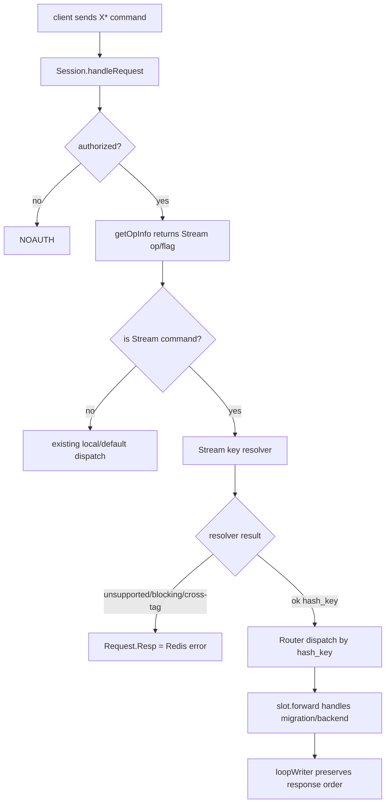

# proxy-stream-commands design

## 0. 术语约定

- **Redis Stream**：Redis 5 起新增的数据结构，Redis 8.6.3 中对象类型为 `OBJ_STREAM`，命令族包括 `XADD`、`XREAD`、`XGROUP`、`XINFO` 等；Redis 3.2.11 没有该对象类型。
- **Stream command support**：本文只指 `codis-proxy` 对 Stream 命令的命令属性、key 提取、slot 路由和拒绝策略。它不表示 Redis 3 backend 能执行 Stream，也不表示支持 Redis Stack 模块。
- **Stream key resolver**：proxy 内部用于从 Stream 命令中解析 stream key / hash key 的逻辑。它需要覆盖普通 `X* key ...`、`XGROUP <subcmd> key ...`、`XINFO <subcmd> key ...` 和 `XREAD ... STREAMS key [key ...] id [id ...]`。
- **Blocking stream read**：带 `BLOCK` 选项的 `XREAD` / `XREADGROUP`。它和已禁用的 `BLPOP` / `BRPOP` 同属会长期占用后端连接和 proxy pipeline 的阻塞语义。
- **Multi-stream request**：一次 `XREAD` / `XREADGROUP` 带多个 stream key。Codis 不能跨 slot 保持单条 Redis 命令语义；即使多个 key 落同一 slot，迁移期间也需要同一 hash tag 才能保持 key group 一起迁移。

防冲突结论：本文的 Stream 支持是 proxy 命令路由能力，不改变 Codis 1024 slot 模型，不启用 Redis Cluster，不扩展 Vector Set / JSON / Bloom 等其他 Redis 8 数据结构，也不导入完整 Redis command JSON 作为运行时依赖。

## 1. 决策与约束

### 需求摘要

目标是让业务客户端经 Codis Proxy 使用 Redis 8 backend 的 Stream 单 key能力时不再依赖未知命令 fallback，并修复 `XGROUP` / `XINFO` 等 key 不在第 1 参数导致的错误路由。成功标准是：proxy 显式识别 Stream 命令的读写属性和 key 位置；安全的单 stream 命令路由到正确 Codis slot；`XGROUP` / `XINFO` 按 subcommand 的 stream key 路由；非阻塞 `XREAD` / `XREADGROUP` 只在所有 stream key 属于同一 hash tag 时放行；阻塞或跨 hash tag multi-stream 请求返回明确 Redis error，不再被错误转发到某个随机/错误 slot。

假设：

- 部署目标是 Redis 8 Codis Server；如果后端仍是 Redis 3，proxy 可以正确路由请求，但后端会返回自身的 unknown command error，本 feature 不做 Stream emulation。
- 用户优先需要“安全且可解释的 Stream 子集”，而不是一次性支持所有 Redis 8 新命令和所有多 key 变体。
- 业务可以通过 hash tag 把多 stream 请求中的多个 key 放进同一迁移单元；不使用 hash tag 的 multi-stream 请求不应被 proxy 静默转发。

明确不做：

- 不支持带 `BLOCK` 的 `XREAD` / `XREADGROUP`；不新增阻塞命令调度、后端连接隔离或长轮询资源预算。
- 不做跨 slot / 跨 hash tag 的 multi-stream 拆分、并发转发和响应合并。
- 不把 Vector Set、Hash field expiration、JSON / Bloom / TimeSeries / Search 等其他 Redis 8 能力纳入本 feature。
- 不动态读取 Redis `COMMAND` / command JSON 来生成 proxy 命令表；本 feature 只补 Stream 命令所需的受控 metadata。
- 不改变 `EVAL` / `EVALSHA`、transaction、pub/sub、Redis Cluster、Codis migration 命令等既有禁止策略。
- 不新增配置开关、dashboard/FE 管理页、coordinator schema 或 proxy admin API。

### 复杂度档位

按“对外 Redis 协议服务”默认档位走，偏离如下：

- Robustness = L3：所有外部命令参数都来自客户端，Stream key resolver 必须对缺参、`STREAMS` 参数不成对、未知 subcommand、跨 hash tag、`BLOCK` 等情况返回明确 Redis error。
- Compatibility = backward-compatible：已有非 Stream 命令行为不变；未知命令 fallback 不被全局改掉；Redis 3 backend 仍由后端返回 unknown command。
- Testability = tested：命令属性、key 解析、拒绝策略、slot dispatch 和热 key cache 失效边界都应有 proxy package 测试覆盖。
- Performance = reasonable：Stream 解析只扫描当前命令参数，不引入全局 command metadata 加载或每请求 JSON 解析。

### 关键决策

1. **显式补 Stream metadata，不把未知命令 fallback 当支持。**
   - 现状的 fallback 会把未知命令标成 `FlagMayWrite` 并默认取第 1 参数作为 key。`XADD key ...` 可能碰巧正确，但 `XGROUP CREATE key ...` 会把 `CREATE` 当 key。
   - 本 feature 增加受控 Stream 命令属性和 key resolver，让 Stream 支持成为可测试契约。

2. **单 stream 命令优先完整支持。**
   - `XADD`、`XLEN`、`XRANGE`、`XREVRANGE`、`XDEL`、`XTRIM`、`XACK`、`XPENDING`、`XCLAIM`、`XAUTOCLAIM` 等命令都只有一个 stream key，且 key 位置稳定。
   - 这些命令按 Redis 8 metadata 设置读写属性；只读命令可走 replica，写命令走 master 并参与 hot key cache 失效。

3. **容器命令按 subcommand 解析，不把 subcommand 当 key。**
   - `XGROUP CREATE/SETID/DESTROY/CREATECONSUMER/DELCONSUMER` 的 key 在第 2 参数。
   - `XINFO STREAM/GROUPS/CONSUMERS` 的 key 在第 2 参数。
   - `XGROUP HELP` / `XINFO HELP` 没有 key，首版返回 unsupported error，不为静态 help 文本挑随机后端。

4. **`XREAD` / `XREADGROUP` 只支持非阻塞、安全 multi-key 形态。**
   - 不带 `BLOCK` 且只有一个 stream key：按该 key 路由。
   - 不带 `BLOCK` 且多个 stream key：只有所有 key 解析出的 hash key 完全一致时放行，原命令转发到该 hash key 所在 slot。
   - 带 `BLOCK`：返回 unsupported error，避免引入阻塞连接语义。
   - 多个 stream key 但 hash key 不一致：返回 cross-slot 风格 Redis error，不拆分、不合并。

5. **保持 Codis 既有 hash tag 约束，不只检查 slot id。**
   - 只检查 `Hash(key) % 1024` 相同不足以覆盖迁移期安全性；同 slot 但不同 hash tag 的 key 可能不会在迁移时被同一 `SLOTSMGRTTAGONE` 批次迁走。
   - Multi-stream 放行条件使用“hash tag / key 原文形成的 hash key 一致”，与既有半支持多 key 命令文档中的 hash tag 要求一致。

6. **不扩大危险命令面。**
   - Stream 支持不会放开 `MULTI`、`EXEC`、`EVAL`、`SCRIPT`、pub/sub、Redis Cluster 或 Codis 内部迁移命令。
   - Redis 8 其他新命令继续走现有策略；需要全量命令同步时另起 feature。

## 2. 名词与编排

### 2.1 名词层

#### proxy 命令属性

现状：

- `pkg/proxy/mapper.go` 的 `opTable` 是手写命令表，保存 `OpInfo{Name, Flag}`。
- `getOpInfo` 命中表时返回已知 flags；未命中时返回 upper-case 命令名和 `FlagMayWrite`。
- `OpFlag.IsReadOnly()` 和 `IsMasterOnly()` 决定 replica 读、master 路由和 hot key cache 失效策略。

变化：

- Stream 命令进入显式 metadata，不再依赖未知命令 fallback。
- Stream 只读命令标记为 read-only；会更新 stream 或 consumer group 状态的命令标记为 `FlagWrite`。
- `XREADGROUP` 即使 key spec 是 `RO ACCESS`，Redis 8 command flag 是 `WRITE`，因为它会改变 consumer group/Pending Entries List；proxy 按写命令处理。

接口示例：

```text
输入：xadd mystream * f v
输出：opstr=XADD, flag=FlagWrite, stream key=mystream

输入：xrange mystream - +
输出：opstr=XRANGE, flag=0, stream key=mystream

输入：xreadgroup group g c streams mystream >
输出：opstr=XREADGROUP, flag=FlagWrite, stream key=mystream
```

来源：`pkg/proxy/mapper.go` 的 `getOpInfo` / `OpFlag`；Redis 8 metadata 来源是 `extern/redis-8.6.3/src/commands/x*.json`。

#### Stream key resolver

现状：

- `Router.dispatch` 调用 `getHashKey(r.Multi, r.OpStr)`，然后用 `Hash(hkey) % MaxSlotNum` 找 slot。
- `getHashKey` 只有 `ZINTERSTORE`、`ZUNIONSTORE`、`EVAL`、`EVALSHA` 四个特殊位置，其余命令统一取第 1 参数。
- `Session.handleRequest` 已对 `MGET` / `MSET` / `DEL` / `EXISTS` 这种特殊多 key 命令做本地拆分或聚合。

变化：

- 新增 Stream key resolver 作为 `Router.dispatch` 前的受控分支，返回：

```text
StreamRoute:
  hash_key: []byte       # 代表性原始 stream key，用于 Codis slot.forward 和迁移包装
  keys: [][]byte         # 解析到的 stream key 列表，用于写后失效和数量核对
```

- Resolver 支持三类 key 位置：
  - `X* key ...`：第 1 参数是 stream key。
  - `XGROUP <subcmd> key ...` / `XINFO <subcmd> key ...`：第 2 参数是 stream key。
  - `XREAD` / `XREADGROUP`：从 `STREAMS` 关键字后解析 key 列表，key 数必须等于后续 id 数。
- 读写属性不由 `StreamRoute` 冗余返回，仍以 `getOpInfo` / `OpFlag` 为准。
- Multi-stream 比较使用各 key 的 hash tag / key 原文，放行后用第一个原始 stream key 作为代表性 `hash_key` 转发；这样 `Hash(hash_key)` 仍按 tag 计算 slot，迁移期 `SLOTSMGRTTAGONE` 也能以原始 key 找到同 tag key group。

接口示例：

```text
输入：XGROUP CREATE mystream group-1 0
输出：hash_key=mystream，而不是 CREATE

输入：XINFO GROUPS mystream
输出：hash_key=mystream

输入：XREAD STREAMS {u1}:a {u1}:b 0-0 0-0
输出：hash_key={u1}:a，keys=[{u1}:a,{u1}:b]；用于一致性比较的 hash tag 为 u1

输入：XREAD STREAMS a b 0-0 0-0
输出：Redis error，原因是 multi-stream keys do not share the same hash tag
```

#### 支持与拒绝矩阵

现状：

- `doc/unsupported_cmds.md` 没有 Stream 命令分组。
- Redis 8 server 支持 Stream 命令，但 proxy 不知道命令 key spec；部分命令会错路由，部分命令会以未知 `MayWrite` 语义转发。

变化：

| 命令形态 | 首版策略 |
|---|---|
| `XADD` / `XDEL` / `XTRIM` / `XACK` / `XCLAIM` / `XAUTOCLAIM` / `XPENDING` / `XLEN` / `XRANGE` / `XREVRANGE` 等单 key Stream 命令 | 支持，按第 1 参数路由 |
| `XGROUP CREATE/SETID/DESTROY/CREATECONSUMER/DELCONSUMER` | 支持，按第 2 参数路由 |
| `XINFO STREAM/GROUPS/CONSUMERS` | 支持，按第 2 参数路由 |
| `XREAD` / `XREADGROUP` 不带 `BLOCK`，单 stream key | 支持 |
| `XREAD` / `XREADGROUP` 不带 `BLOCK`，多个 stream key 且 hash key 一致 | 支持，原命令转发到该 hash key 所在 slot |
| `XREAD` / `XREADGROUP` 带 `BLOCK` | 拒绝，返回 unsupported error |
| `XREAD` / `XREADGROUP` 多个 stream key 但 hash key 不一致 | 拒绝，返回 cross-slot 风格 error |
| `XGROUP HELP` / `XINFO HELP` 或未知 Stream subcommand | 拒绝，返回 unsupported error |

### 2.2 编排层



现状：

- `Session.handleRequest` 认证后按命令分支处理本地命令和多 key special cases，其余命令进入 `Router.dispatch`。
- `Router.dispatch` 只有一个 `hkey`，slot 迁移期间 `forwardSync` / `forwardSemiAsync` 也依赖这个 `hkey` 执行 `SLOTSMGRTTAGONE` 或 `SLOTSMGRT-EXEC-WRAPPER`。
- 未知命令进入 default dispatch，使用第 1 参数作为 hash key。

变化：

- 在 default dispatch 前增加 Stream dispatch 分支；它只对显式 Stream 命令生效。
- Stream dispatch 先做语法和安全检查，不满足约束时直接设置 Redis error response。
- Stream resolver 成功后仍复用现有 `slot.forward`、后端连接池、pipeline 写回和迁移包装逻辑，不新建旁路。
- `XREAD` / `XREADGROUP` 的 multi-stream 支持不拆分请求；只有 hash key 一致时整条命令发到一个后端。

流程级约束：

- **认证**：Stream 命令和普通业务命令一样受 `session_auth` 保护；未认证时返回现有 `NOAUTH Authentication required`。
- **错误语义**：参数不足、`STREAMS` 缺失、key/id 数量不匹配、未知 subcommand、`BLOCK`、跨 hash tag 都返回 Redis error，不关闭连接。
- **迁移安全**：所有放行的 multi-stream 请求必须共享同一 hash key，使迁移期 `hkey` 能代表整条命令涉及的 key group。
- **读写路由**：只读 Stream 命令可按现有 replica 规则走 replica；写命令和 `XREADGROUP` 必须走 master。
- **hot key cache**：Stream 写命令按解析到的 stream key 触发现有写后失效；不为 Stream value 新增缓存能力。
- **兼容性**：非 Stream 命令的 `getHashKey` 和未知命令 fallback 不因本 feature 改变。
- **可观测性**：首版不新增 metrics；Stream 命令仍进入现有 per-command op stats。

### 2.3 挂载点清单

- proxy command metadata：新增 Stream 命令的 `OpInfo` / Stream 命令识别入口，使 `getOpInfo` 不再把 Stream 当未知命令。
- proxy request dispatch：新增 Stream dispatch 分支，负责调用 Stream key resolver 并在拒绝场景设置 Redis error。
- proxy hash key routing：新增 Stream 专用 hash key 解析，不改变其他命令的 `getHashKey` 行为。
- `doc/unsupported_cmds.md`：新增 Stream 命令支持边界，特别说明 `BLOCK` 和跨 hash tag multi-stream 不支持。

### 2.4 推进策略

1. **Stream metadata 骨架**：把 Stream 命令纳入显式命令属性，并建立 Stream 命令识别入口。
   退出信号：`getOpInfo` 对 Stream 命令返回稳定 upper-case opstr 和正确读写 flag；非 Stream 未知命令仍保持 `FlagMayWrite` fallback。

2. **单 key 与容器命令 resolver**：实现 `X* key ...`、`XGROUP <subcmd> key ...`、`XINFO <subcmd> key ...` 的 key 提取和错误返回。
   退出信号：`XGROUP CREATE mystream ...` 和 `XINFO GROUPS mystream` 都按 `mystream` 路由；未知/无 key subcommand 不转发后端。

3. **`XREAD` / `XREADGROUP` 安全解析**：解析 `STREAMS` 段，拒绝 `BLOCK`，校验 key/id 数量和 multi-stream hash key 一致性。
   退出信号：单 stream 非阻塞请求可路由；带 `BLOCK` 或跨 hash tag multi-stream 请求返回 Redis error；同 hash tag multi-stream 请求整条转发。

4. **接入现有转发语义**：让 Stream dispatch 复用 `slot.forward`、迁移包装、replica/master 选择和 hot key cache 失效计划。
   退出信号：Stream 读命令保持 read-only 路由语义，Stream 写命令保持 master-only 和写后失效语义；迁移 slot 上使用解析出的 hash key。

5. **文档与测试覆盖**：补齐 mapper/session/router 相关单测和 unsupported command 文档。
   退出信号：关键验收场景都有可重复测试或文档证据，目标包测试通过。

### 2.5 结构健康度与微重构

##### 评估

- compound convention：已按 `doc_type=decision category=convention` 检索“目录组织 / 命名 / 归属”，无命中。
- 文件级 — `pkg/proxy/mapper.go`：320 行，职责集中在命令表、命令大小写规范化和 hash key 解析；本次会增加 Stream metadata 入口，不能把复杂 `XREAD` 解析塞进这里。
- 文件级 — `pkg/proxy/session.go`：785 行，职责包含 session 生命周期、认证、本地命令、多 key 命令、slot 命令和默认 dispatch；文件偏胖。本次只应增加最小 Stream 分支。
- 文件级 — `pkg/proxy/router.go`：294 行，职责集中在 slot 路由和 slot 状态；本次只需要复用现有 dispatch，不应改路由拓扑。
- 目录级 — `pkg/proxy`：已有多个按能力拆分的单 package 文件，例如 `cluster_nodes.go`、`client_list.go`、`hot_key_cache.go`；本次新增一个 Stream 命令能力文件符合现有组织方式，不需要重组目录。

##### 结论：不做前置微重构

原因：`session.go` 偏胖是真问题，但本 feature 可以通过“最小分支 + 新的 Stream 命令能力文件”控制改动密度。拆分 session lifecycle 或重组 `pkg/proxy` 目录会超出“只搬不改行为”的安全微重构边界，并增加 Redis 协议路径回归风险。

##### 超出范围的观察

- `pkg/proxy/mapper.go` 的手写命令表已经落后 Redis 8 全量命令面。后续若要系统性支持 Redis 8 新命令，应另起“Redis 8 command metadata sync” feature，而不是继续把所有命令挤进本次 Stream feature。

## 3. 验收契约

### 关键场景清单

- 输入 `XADD mystream * f v` → proxy 按 `mystream` 计算 Codis slot，写请求发往 master；后端响应原样返回。
- 输入 `XLEN mystream` / `XRANGE mystream - +` → proxy 识别为 read-only Stream 命令，按 `mystream` 路由，不触发 `FlagMayWrite` 的 DB 级保守失效。
- 输入 `XGROUP CREATE mystream group-1 0` → proxy 按第 2 参数 `mystream` 路由，而不是按 `CREATE` 路由。
- 输入 `XINFO GROUPS mystream` / `XINFO CONSUMERS mystream group-1` → proxy 按第 2 参数 `mystream` 路由。
- 输入 `XREAD STREAMS mystream 0-0` → proxy 解析 `STREAMS` 段，按 `mystream` 路由。
- 输入 `XREADGROUP GROUP group-1 consumer-1 STREAMS mystream >` → proxy 解析 `STREAMS` 段，按 `mystream` 路由，并按写命令走 master。
- 输入 `XREAD STREAMS {u1}:a {u1}:b 0-0 0-0` → proxy 识别两个 stream key 共享 hash key `u1`，整条命令转发到该 hash key 所在 slot。
- 输入 `XREAD STREAMS a b 0-0 0-0` → proxy 返回 cross-slot 风格 Redis error，不转发到后端。
- 输入 `XREAD BLOCK 1000 STREAMS mystream 0-0` 或 `XREADGROUP GROUP g c BLOCK 1000 STREAMS mystream >` → proxy 返回 unsupported blocking Stream error，不转发到后端。
- 输入 `XGROUP HELP` / `XINFO HELP` / `XGROUP UNKNOWN mystream` → proxy 返回 unsupported Stream subcommand error，不转发到后端。
- 后端是 Redis 3 时输入 `XADD mystream * f v` → proxy 仍正确路由；后端返回 unknown command error，proxy 不伪造成功响应。
- 现有非 Stream 命令如 `GET`、`MGET`、`CLUSTER NODES`、未知 `FOO key` → 行为与本 feature 前一致。

### 明确不做的反向核对项

- 代码中不应新增 `BUILD_WITH_MODULES`、RedisJSON、RedisBloom、RedisTimeSeries、RediSearch 或 Vector Set 的 proxy 支持逻辑。
- 代码中不应新增 Stream 相关配置项、dashboard/FE 页面、coordinator schema 或 proxy admin API。
- `XREAD` / `XREADGROUP` 带 `BLOCK` 的测试必须证明请求没有到达后端。
- 跨 hash tag multi-stream 的测试必须证明请求没有到达后端。
- 不应改动 `EVAL` / `EVALSHA`、transactions、pub/sub、Codis migration 命令的 allow/deny 策略。

## 4. 与项目级架构文档的关系

本 feature 会让 architecture 中“proxy 业务客户端命令边界由 `pkg/proxy/mapper.go` 控制”的描述需要补充：Redis 8 Stream 命令已从未知 fallback 变成显式受控子集，支持单 key和同 hash tag 非阻塞 multi-stream，拒绝 blocking 和跨 hash tag 请求。

acceptance 阶段应同步检查：

- `.codestable/architecture/ARCHITECTURE.md` 的 proxy 命令路由段是否需要增加 Stream 命令边界。
- `doc/unsupported_cmds.md` 是否已明确 Stream 支持/拒绝矩阵，避免用户误以为所有 Redis 8 Stream 语义都完整支持。
- `.codestable/requirements/redis-cluster-service.md` 是否需要在实现进展中记录 Redis 8 Stream 命令支持子集。
