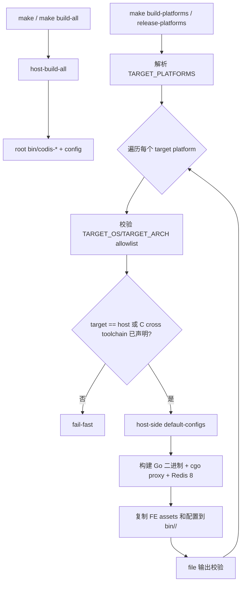

# multi-platform-build design

## 0. 术语约定

- **Host platform**：执行构建命令的机器平台。本地证据是 `go env` 返回 `GOHOSTOS=darwin`、`GOHOSTARCH=arm64`。
- **Target platform**：用户希望产出二进制的平台，用 `TARGET_OS` / `TARGET_ARCH` 表达，例如 `linux/amd64`、`linux/arm64`、`darwin/arm64`。
- **Build matrix**：显式发布构建的平台清单，用 `TARGET_PLATFORMS` 表达，首版默认值为 `darwin/arm64 linux/amd64 linux/arm64`。
- **Host build**：`make` / `make build-all` 的兼容入口，继续生成当前机器平台的根 `bin/codis-*` 产物和默认配置。
- **Platform artifact**：某个 target platform 的完整产物，输出到 `bin/${TARGET_OS}-${TARGET_ARCH}/`，例如 `bin/linux-amd64/`。
- **Full platform build**：构建 Go 二进制、默认 `cgo_jemalloc` proxy、Redis 8 Codis Server、FE assets 和默认配置副本。
- **No-redis platform build**：只构建 Go 入口和 FE assets，不构建 Redis Server / Redis helper。它不等于纯 Go；当前 proxy 即使关闭 `cgo_jemalloc` 仍会走 `import "C"` 路径。

防冲突结论：本 feature 的重点是构建编排和产物隔离，不改变 Codis 运行协议、Redis 8 语义或部署模板。本次不管任何 Docker 相关内容。

## 1. 决策与约束

### 需求摘要

本 feature 要新增“显式一次构建多平台完整产物”的能力，所有平台产物都放在 `bin/<os>-<arch>/` 下，使用者按目录选择对应平台版本。最新 review 决策修正了默认入口：`make` / `make build-all` 是公共 userspace 契约，必须继续执行 host build；多平台矩阵必须通过显式 `make build-platforms` 或 `make release-platforms` 触发。

成功标准：

- `make` / `make build-all` 继续生成 root `bin/codis-*` host 产物，不因为默认矩阵缺少 Linux C/cgo cross toolchain 而失败。
- `make build-platforms` 默认按 `TARGET_PLATFORMS` 构建 `darwin/arm64 linux/amd64 linux/arm64`，平台目录彼此隔离。
- 任何会写入 `bin/<os>-<arch>/` 的 target 都必须先校验 target platform 和 C/cgo 条件，不能绕过 guard。
- 非 host full platform build 在 Redis/cgo 工具链不满足时 fail-fast，不静默产出混合平台或错误平台产物。

明确不做：

- 不承诺默认构建在缺少目标平台 C/cgo 工具链时“降级成功”；显式矩阵 full build 缺条件时应该失败并说明原因。
- 不承诺在没有目标平台 C toolchain 的情况下，从 Mac arm64 一步完整交叉构建 Linux Redis Server 和 `cgo_jemalloc` proxy。
- 不修改 Redis 8 源码的构建系统来实现通用 C cross compile。
- 不新增、不修改、不验证任何 Docker 相关内容，包括 Dockerfile、docker 脚本、buildx 和多架构镜像。
- 不新增 CI workflow 或 release tarball 上传。
- 不改 `config/*.toml` 的配置语义，不改 proxy/topom/admin/FE 运行逻辑。
- 不执行全量 `go mod tidy`，不恢复 GOPATH/vendor 构建。

### 复杂度档位

走“发布构建能力”档位，偏离项如下：

- Compatibility = preserve-userspace：默认 `make` 和 `make build-all` 继续保持 host build 语义；多平台发布能力走显式 target。
- Determinism = reproducible：矩阵、平台目录名和产物集合必须稳定，不能把 darwin/arm64 与 linux/amd64 混进同一个目录。
- Robustness = fail-fast：矩阵中的某个平台涉及 Redis/cgo 但缺少目标 C toolchain 时必须提前失败，不能继续复制 host Redis 产物假冒 target 产物。
- Testability = observable：验收必须能通过输出路径、`file` 输出或平台目录内容确认产物平台。

### 关键决策

1. **保留 `make` / `make build-all` 为 host build，新增显式 `make build-platforms` / `make release-platforms` 做矩阵。**
   - 依据：默认 build 命令是公共 CLI。把裸 `make` 改成普通环境默认失败会破坏文档、部署脚本和本地开发 userspace。
   - 被拒方案：裸 `make` 默认构建矩阵。理由：缺少 Linux cross C toolchain 的普通 Mac arm64 环境会直接失败，兼容性代价过高。

2. **平台产物放在 `bin/<os>-<arch>/` 子目录，而不是全部平铺在 `bin/` 根目录。**
   - 依据：完整产物不只有单个二进制，还包含 Redis helper、FE assets 和配置副本；使用者按目录选择平台更清楚。

3. **Full platform build 首版只支持 native full build 或显式配置过 C cross toolchain 的高级路径。**
   - 依据：Redis 8 `src/Makefile` 使用 host `uname` 判断 OS / arch；`codis-proxy` 默认带 `-tags cgo_jemalloc`。仅设置 Go 的 `GOOS/GOARCH` 不能保证 Redis 和 cgo 目标链接正确。

4. **不把 C cross compile 设计成 Go cross compile 那种默认能力。**
   - 判断：C 可以交叉编译，但需要目标平台 compiler、sysroot、libc、linker、依赖库和正确构建变量；不是像纯 Go 那样设置 `GOOS=linux GOARCH=amd64` 就稳定完成。
   - 设计结论：Mac arm64 -> Linux x86_64 full build 必须显式声明 C/cgo cross toolchain，否则 fail-fast。

5. **安全 invariant 放在产物写入 target 上。**
   - 依据：Makefile target 没有真正私有。`build-platform-artifact` 这种直接写 `bin/<platform>/` 的 target 不能假设调用方已经先跑 guard。
   - 约束：`TARGET_OS` / `TARGET_ARCH` 必须经过 allowlist 校验后才能进入 `rm -rf $(TARGET_DIR)`。

6. **No-redis platform build 不能命名为 Go-only。**
   - 依据：当前 `pkg/utils/unsafe2/cgo_malloc.go` 在非 `cgo_jemalloc` 路径仍然 `import "C"`。`CGO_ENABLED=0` 会排除这类文件，proxy 并不是可承诺的纯 Go cross build。
   - 维护约束：如果保留 proxy，仍按 cgo 构建语义处理；如果后续要纯 Go proxy，需要另起设计提供 `!cgo` 实现。

7. **默认配置生成必须由 host 可执行程序完成，platform build 不执行 target 二进制。**
   - 依据：交叉构建出的 Linux 二进制不能假定可在 Mac host 上执行。
   - 变化方向：拆出 host-side `default-configs`；platform build 只复制配置，不运行 target dashboard/proxy。

## 2. 名词与编排

### 2.1 名词层

#### Target platform

现状：

- 根 `Makefile` 的默认入口是 host build；Go 二进制构建继承当前 shell / Go toolchain 默认平台。
- Redis 8 构建通过 `make -j4 -C $(REDIS8_DIR)/` 进入上游 Makefile，默认按 host 构建。

变化：

- 新增 `TARGET_PLATFORMS` 矩阵概念，供显式 `build-platforms` / `release-platforms` 使用。
- 新增单个平台构建参数 `TARGET_OS` / `TARGET_ARCH`。
- 新增 platform label，例如 `linux-amd64`、`linux-arm64`、`darwin-arm64`，作为输出目录和日志中的平台标识。
- 新增 allowlist 校验：首版 target OS 只接受 `darwin` / `linux`，target arch 只接受 `amd64` / `arm64`。

接口示例：

```text
输入：make
输出：按 host platform 构建根 bin/codis-*，兼容旧文档和脚本

输入：make build-platforms
输出：按 TARGET_PLATFORMS 默认矩阵尝试构建 bin/darwin-arm64/、bin/linux-amd64/、bin/linux-arm64/

输入：make build-platforms TARGET_PLATFORMS="darwin/arm64"
输出：只构建 bin/darwin-arm64/
```

#### Platform output

现状：

- Go 二进制、Redis 二进制、FE assets 都写入根 `bin/`。
- `codis-server` 会刷新根 `config/redis.conf` / `config/sentinel.conf`。
- `codis-dashboard` / `codis-proxy` 会通过运行刚构建出的 host 二进制刷新根 `config/dashboard.toml` / `config/proxy.toml`。

变化：

- 显式矩阵构建输出到 `bin/${TARGET_OS}-${TARGET_ARCH}/`。
- 根 `bin/` 继续作为默认 host build 输出，保护旧 userspace。
- 平台目录内包含该平台二进制、Redis helper、FE assets 和配置副本。
- `clean` 继续删除整个 `bin/`，不需要新增跨平台清理入口。

#### Proxy allocator mode

现状：

- 默认 `codis-proxy` 使用 `go build -tags "cgo_jemalloc"`。
- 非 `cgo_jemalloc` 的 `pkg/utils/unsafe2/cgo_malloc.go` 仍然使用 cgo。

变化：

- 默认 host build 和 full platform build 继续使用 `cgo_jemalloc`。
- No-redis platform build 允许通过 `PROXY_JEMALLOC=0` 切换非 jemalloc proxy，但它仍不是纯 Go promise，不能替代 full platform build 的生产语义。

#### Config generation

现状：

- 默认配置来自刚构建的 dashboard/proxy host 二进制执行结果。
- 跨平台时 target 二进制不能假定可在 host 上执行。

变化：

- 拆出 host-side `default-configs`：用 host 可执行的 dashboard/proxy 生成默认配置。
- platform build 依赖 `default-configs` 的输出并复制配置，不运行 target dashboard/proxy。

## 2.2 编排层



现状：

- 构建流程是单一 host 流程：构建哪个平台完全由当前机器和环境变量隐式决定。
- Go 构建、Redis 构建、默认配置生成都绑定到 `bin/` 和 `config/`。

变化：

- 默认入口仍是 host workflow。
- 显式平台构建变成 matrix workflow：解析 `TARGET_PLATFORMS`，逐个平台做 full platform build。
- 每个写平台目录的 target 自己先做 platform allowlist 和 Redis/cgo guard。
- 默认配置生成从“target binary side effect”改为“host-side reusable step”。

流程级约束：

- **错误语义**：显式矩阵里任一 full platform build 的 C/cgo 条件不满足时，矩阵构建整体失败；错误必须给出 target、host、缺失条件。
- **兼容性**：`make` / `make build-all` 的 root `bin/` host 输出保持可用；多平台目录是新增显式发布入口。
- **幂等性**：重复执行同一矩阵只覆盖对应平台目录，不影响未列入矩阵的平台目录。
- **顺序约束**：任何 `rm -rf bin/<platform>` 前必须先校验 platform；跨平台流程不得执行 target dashboard/proxy。
- **可观测点**：平台目录名、构建日志和 `file` 输出能证明产物平台。

### 2.3 挂载点清单

- 根 `Makefile` 的兼容默认入口：删掉后旧 `make` userspace 会被破坏。
- 根 `Makefile` 的显式 matrix build 入口：删掉后无法一次构建平台矩阵。
- Platform 变量契约：`TARGET_PLATFORMS` / `TARGET_OS` / `TARGET_ARCH` / platform label / platform output dir。
- Host-side config generation：删掉后 cross build 会重新尝试运行 target 二进制生成配置。
- 产物写入 guard：删掉后 `build-platform-artifact` 可被直接调用并绕过 fail-fast。
- No-redis platform build：删掉后无法低成本验证非 Redis 的平台构建边界。

### 2.4 推进策略

1. **默认入口兼容回归**：恢复 `make` / `make build-all` host build 语义。
   - 退出信号：`make -n build-all` 不再进入默认 Linux 矩阵 guard。

2. **显式矩阵骨架**：引入 `build-platforms` / `release-platforms`、`TARGET_PLATFORMS`、platform label 和平台输出目录。
   - 退出信号：`make -n build-platforms TARGET_PLATFORMS="darwin/arm64"` 只展开 `bin/darwin-arm64`。

3. **Host-side 默认配置生成**：拆出可复用配置生成步骤，避免跨平台流程执行 target 二进制。
   - 退出信号：platform build 复制配置；不会执行 `bin/linux-amd64/codis-dashboard --default-config`。

4. **C/cgo guard 与平台变量校验**：在任何产物目录写入前检测 allowlist、host、target 和显式 cross toolchain 条件。
   - 退出信号：直接调用 `build-platform-artifact TARGET_OS=linux TARGET_ARCH=amd64` 也会 fail-fast，不复制 host Redis。

5. **Full platform build 节点**：将 dashboard、proxy、admin、ha、fe、Redis 8 和 helper 构建到对应平台目录。
   - 退出信号：host platform 能生成完整平台目录；默认 proxy 仍使用 `cgo_jemalloc`。

6. **No-redis platform build 与产物检查**：提供非 Redis 平台构建入口，补齐 `file` 输出校验和范围守护。
   - 退出信号：target 名称不再声称 Go-only；diff 不触碰 Docker 或运行期逻辑。

### 2.5 结构健康度与微重构

##### 评估

- 文件级 — 根 `Makefile`：平台变量、guard 和构建 target 属于自然延伸；如果后续 shell 逻辑继续膨胀，应拆到 `scripts/`。
- 文件级 — Redis 8 `src/Makefile`：上游大型 Makefile，平台检测由上游维护；本 feature 不修改它来做通用 cross compile。
- 目录级 — `bin/`：本来就是生成物目录，新增 `bin/${platform}/` 子目录符合产物隔离。

##### 结论：本次不做前置微重构

原因：当前构建入口仍可用 Makefile 表达；本次只修默认入口、guard 位置、平台输出和命名，不引入独立脚本。

## 3. 验收契约

### 关键场景清单

- 触发：在当前 Mac arm64 host 上执行 `make` 或 `make build-all`。期望：继续生成根 `bin/codis-*` host 产物和默认配置，不因默认 Linux target 缺 cross C toolchain 而失败。
- 触发：执行 `make build-platforms`，但未声明 Linux 目标 C cross toolchain。期望：命令在构建 Linux Redis/cgo 前 fail-fast，错误信息包含 host platform、target platform、缺失条件和建议处理方式。
- 触发：执行 `make build-platforms TARGET_PLATFORMS="darwin/arm64"`。期望：只构建 `bin/darwin-arm64/`。
- 触发：直接执行 `make build-platform-artifact TARGET_OS=linux TARGET_ARCH=amd64` 且未配置 cross toolchain。期望：在 `rm -rf bin/linux-amd64` 和 Redis copy 前 fail-fast。
- 触发：执行非法平台输入，例如 `make build-platform-artifact TARGET_OS=linux/../../tmp TARGET_ARCH=amd64`。期望：allowlist 校验失败，不进入产物目录删除。
- 触发：执行 `make build-no-redis-platform TARGET_OS=darwin TARGET_ARCH=arm64`。期望：生成 `bin/darwin-arm64-no-redis/`，不构建 Redis Server；日志不声称 Go-only。
- 触发：full platform build `codis-proxy`。期望：仍使用 `cgo_jemalloc`；No-redis target 的 allocator 选择不影响默认 host build 或 full platform build。

### 明确不做的反向核对项

- Diff 不应修改 Redis 8 `extern/redis-8.6.3/src/Makefile` 来做通用 C cross compile。
- Diff 不应把不同平台产物平铺混放到同一个根 `bin/` 文件名空间。
- Diff 不应让默认 `make` 在普通 host 环境因为默认矩阵缺少 cross toolchain 而失败。
- Diff 不应默认关闭 `codis-proxy` 的 `cgo_jemalloc`。
- Diff 不应新增或修改任何 Docker 相关文件、CI workflow、release 上传或镜像发布逻辑。
- Diff 不应修改 proxy/topom/admin/Redis 运行期行为。
- Diff 不应执行全量 `go mod tidy` 或引入 GOPATH/vendor 回退。

## 4. 与项目级架构文档的关系

本 feature 改的是构建层能力，不改变 Codis 运行时架构。acceptance 阶段应核对是否更新 `.codestable/architecture/ARCHITECTURE.md` 的构建层描述：

- 补充“`make` / `make build-all` 是 host-compatible build，显式 `build-platforms` / `release-platforms` 使用 `TARGET_PLATFORMS` 生成 `bin/${TARGET_OS}-${TARGET_ARCH}/`”。
- 补充“no-redis platform build 与 full platform build 的边界是 Redis/cgo 完整产物需要 native target runner 或显式 C cross toolchain”。
- 不应把架构文档改写成“Codis 已支持从任意 host 完整交叉构建任意平台”。

## 5. 待 review 的关键假设

- 显式矩阵默认值先定为 `darwin/arm64 linux/amd64 linux/arm64`；若还要 `darwin/amd64`，需要明确加入 `TARGET_PLATFORMS` 默认值。
- `make` 默认保留 host build 是 Never break userspace 的约束，高于“裸 make 默认矩阵”的原始表述。
