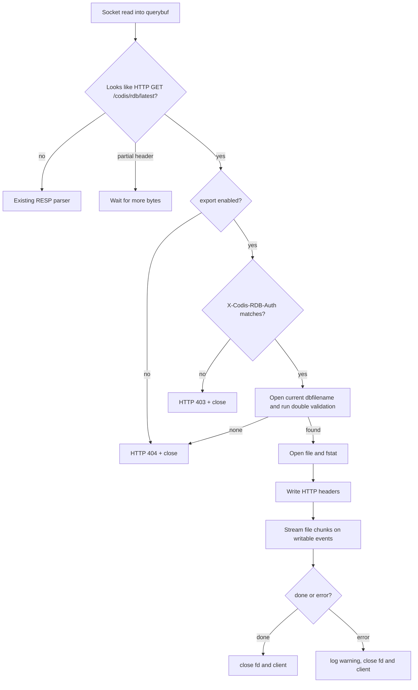

# redis8-rdb-http-export design

## 0. 术语约定

- **RDB HTTP export**：本 feature 指 `codis-server` 进程在收到特定 HTTP `GET` 请求时，把本机 `dbfilename` 对应的最新已完成 RDB 文件作为 HTTP response body 传出。它不是 Redis 命令，也不是 dashboard/topom API。
- **最新 RDB 文件**：请求到达时，Redis 当前 `dir` 下 basename 等于当前 `server.rdb_filename` 的普通文件。Redis 持久化保存通过临时文件 rename 到 `dbfilename`，因此该路径代表最新完成的持久化 RDB；其他 `.rdb` 备份副本即使 mtime 更新，也不属于本接口候选。
- **双重校验**：导出前同时校验文件身份和文件内容。文件身份校验要求 basename 等于 `server.rdb_filename`、`lstat` 为普通文件、`open` 后 `fstat` 与 `lstat` 的 device/inode/mode 一致；文件内容校验要求文件头符合 RDB `REDIS` magic。
- **认证密钥**：独立于 Redis `AUTH` / ACL 的 HTTP header 密钥。Redis 协议认证成功不等于能下载 RDB。
- **已存在文件**：请求处理只允许打开和读取已经落盘的候选 RDB 文件，不允许调用 `SAVE`、`BGSAVE`、`rdbSave*` 或 replication stream 生成新 RDB。

防冲突结论：已有 `rdb-analysis-dashboard` 分析 dashboard 受控目录中的 RDB，`rdb-remote-transfer-analysis` draft 设计的是远端 Go 上传端把 RDB 传到 dashboard。本 feature 是相反方向：让 Redis 8 `codis-server` 提供本机 RDB 下载口，服务于外部拉取已有备份文件，不自动分析、不上传 dashboard、不生成快照。

## 1. 决策与约束

### 需求摘要

用户需要一个 Redis 8 patch：运维侧能通过 HTTP 从 `codis-server` 拉取本机 `dbfilename` 对应的最新完成 RDB 备份文件。接口必须默认关闭；开启后必须携带配置的认证密钥；接口只能读取已有 RDB 文件，不能因为一次请求触发 Redis 执行 `SAVE` 或 `BGSAVE`。

成功标准：

- 默认配置下，HTTP RDB export 不可用，Redis 协议行为不变。
- 配置 `codis-rdb-export-enabled yes` 且配置非空 `codis-rdb-export-auth` 后，请求：

```text
GET /codis/rdb/latest HTTP/1.1
X-Codis-RDB-Auth: <secret>
```

返回 `200 OK`、`Content-Length`、`Content-Disposition`，body 等于请求开始时选中的本机 RDB 文件内容。
- 密钥错误或缺失时返回 `403`，且不扫描/打开 RDB 文件。
- 没有符合条件的已存在 RDB 文件时返回 `404`，不执行 `SAVE` / `BGSAVE`。
- 传输大文件时不把完整 RDB 读入内存；连接完成或中断后释放 fd 和状态。
- Redis 正常 RESP 请求、Codis slot/迁移命令、RDB save/load、replication 行为保持兼容。

假设：

- 首版复用 Redis 现有 TCP/TLS 监听端口承载这个 HTTP `GET`。用户只要求两个配置项，没有给独立 HTTP 端口、bind、TLS、限速或并发配置。
- 生产暴露面由部署侧控制：该接口默认关闭；开启后仍应只在可信内网、TLS 终止或访问控制后使用。RDB 可能包含业务 key/value，应用层密钥不能替代网络隔离。

明确不做：

- 不执行 `SAVE`、`BGSAVE`、`LASTSAVE` 编排或 replication stream RDB 抓取。
- 不允许客户端指定文件路径、DB、slot、key pattern 或任意目录。
- 不实现断点续传、Range request、压缩、加密、限速、并发下载配额或文件清理策略。
- 不新增 Redis 命令、command JSON、proxy allow-list、dashboard/FE 页面、coordinator schema 或 Go 侧 API。
- 不把 RDB 文件转发到 dashboard RDB Analysis；外部系统拿到文件后如何处理不属于本 feature。

### 复杂度档位

走“默认关闭的运维文件导出 + Redis 进程热路径保护”档位：

- Compatibility = additive：关闭时不改变任何 Redis 协议路径；开启后只拦截精确 HTTP request。
- Security = guarded：非空密钥、header 鉴权、无路径参数、只读 `dir` 下与 `dbfilename` 匹配且通过双重校验的 RDB 文件。
- Resource = streaming：按 chunk 从 fd 写 socket，不把 RDB 放进 reply buffer。
- Maintenance = small patch：新增 Codis 专用导出文件，避免把大段逻辑塞进 Redis 上游 `networking.c`。

### 关键决策

1. **复用现有 Redis 监听端口，不新增独立 HTTP server**
   依据：需求只给两个配置项。新增独立 HTTP port 会立即需要 port、bind、TLS、protected-mode、maxclients 等配置面，范围变大。实现上在 `readQueryFromClient` 读入 query buffer 后、进入 RESP inline/multibulk 解析前，识别精确 HTTP request。

2. **只接受精确 `GET /codis/rdb/latest` + header 密钥**
   依据：Redis 已有 `POST` / `Host:` cross protocol security guard。这里不能泛化成“Redis 端口支持 HTTP”，只为一个 opt-in 导出口开最小例外。其他 HTTP request 不进入文件传输逻辑。

3. **密钥不放 URL path/query，使用 `X-Codis-RDB-Auth` header**
   依据：RDB 下载 URL 可能出现在 shell history、代理日志或监控日志中。header 仍可能被记录，但比 query string 更少泄漏。实现时比较长度一致后复用 Redis ACL 的 `time_independent_strcmp` 思路做常量时间比较。

4. **配置项使用 Redis config 框架，默认关闭且 auth 为空**
   新增配置：

```text
codis-rdb-export-enabled no
codis-rdb-export-auth ""
```

   `codis-rdb-export-enabled` 和 `codis-rdb-export-auth` 首版均按 immutable 处理，避免运行期一半开启一半换密钥造成边界不清；`auth` 标记为 sensitive，按 Redis 现有机制避免 `CONFIG SET` 参数进入 slowlog/monitor 等日志面。配置读取权限仍遵循 Redis `CONFIG GET` 的既有安全模型，不能把 `CONFIG GET` 暴露给低权限调用方。启动校验要求：enabled 为 yes 时 auth 必须非空。

5. **只导出当前 `dbfilename`，并做双重校验**
   依据：用户要求匹配 `dbfilename` 的最新 RDB 文件。`dbfilename` 已由 Redis 配置限制为 basename，普通 `SAVE` / `BGSAVE` 成功后会原子 rename 到该文件；因此该路径就是 Redis 当前最新完成的持久化 RDB。实现不扫描其他 `.rdb` 备份副本，避免把运维手工复制文件或旧备份误当作导出目标。候选必须同时通过文件身份校验（basename、普通文件、非 symlink、`lstat`/`fstat` 一致）和文件内容校验（RDB magic）。

6. **文件传输走专用 streaming 状态，不复用 Redis reply buffer**
   依据：RDB 可能很大，不能 `addReplyBulkCBuffer` 或一次性读入内存。成功鉴权并打开文件后，切换连接到导出写流程：先写 HTTP headers，再按固定 chunk 读 fd 并 `connWrite`，遇到 EAGAIN 等待下一次 writable，完成后关闭连接。

## 2. 名词与编排

### 2.1 名词层

#### RDB export config

现状：

- Redis 8 Codis Server 已有 `codis-enabled` 配置，定义在 `extern/redis-8.6.3/src/config.c`，运行态字段在 `redisServer.codis_enabled`。
- `dbfilename` 和 `dir` 分别控制 RDB 文件名和 Redis 进程工作目录；`dir` 通过 `chdir` 生效，`CONFIG REWRITE` 会写绝对路径。

变化：

- `redisServer` 新增：

```c
int codis_rdb_export_enabled;
char *codis_rdb_export_auth;
```

- `config.c` 新增两个标准配置，默认关闭，`auth` 为空且 sensitive。启动后如果 `enabled=yes` 但 `auth` 为空，配置加载失败并给出明确错误。
- `extern/redis-8.6.3/redis.conf` 和生成后的 `config/redis.conf` 增加注释和默认值，说明该接口只下载已有 RDB，不会生成快照。

#### HTTP request 契约

现状：

- Redis `readQueryFromClient` 读取 socket 到 `client.querybuf` 后交给 `processInputBuffer` 解析 RESP inline/multibulk。
- `processCommand` 对 `POST` / `Host:` 有 cross protocol security warning，普通 HTTP `GET /... HTTP/1.1` 目前会被当作 inline Redis 命令尝试解析。

变化：

- 新增一个极薄检测点：在 `processInputBuffer(c)` 前调用 Codis helper。
- helper 只处理完整请求头，最大 header 长度固定为 8KB；未读完整时等待更多数据，超限返回 `400` 并关闭。
- 只接受：

```text
GET /codis/rdb/latest HTTP/1.0
GET /codis/rdb/latest HTTP/1.1
```

- 成功响应示例：

```text
HTTP/1.1 200 OK
Content-Type: application/octet-stream
Content-Length: 123456
Content-Disposition: attachment; filename="dump.rdb"
X-Codis-RDB-Mtime: 1717060000
Connection: close

<rdb bytes>
```

- 错误响应：精确 export request 内的错误返回 `403 Forbidden`、`404 Not Found`、`400 Bad Request`，均 `Connection: close`，body 为短文本，不包含绝对路径和密钥。非精确 `GET /codis/rdb/latest HTTP/1.0|1.1` 的 HTTP-like 请求不进入 export helper，保留 Redis 既有 RESP / cross-protocol security 处理。

#### RDB candidate

现状：

- 普通持久化保存会先写 `temp-<pid>.rdb`，再 rename 到 `server.rdb_filename`。
- replica 全量同步也会使用 `temp-<unixtime>.<pid>.rdb` 等临时文件，完成后 rename 到 `server.rdb_filename`。

变化：

- 新增 `codisRdbExportOpenDbfilename()`：
  - 请求开始时 snapshot 当前 `server.rdb_filename`。
  - 拒绝空文件名、包含路径分隔符的文件名，以及不以 `.rdb` 结尾的异常配置值。
  - 在当前 Redis `dir` 下对该 basename 执行 `lstat`；只接受普通文件，拒绝 symlink、目录、device 和其他文件类型。
  - `open` 后立即 `fstat`，要求 device、inode、mode 与 `lstat` 一致，降低 TOCTOU 风险。
  - 读取前 5 字节，必须是 RDB `REDIS` magic；失败则关闭 fd 并返回 `404`。
- 通过校验后以已打开 fd 的大小作为 `Content-Length`。文件在传输期间被删除或 rename 不影响本次 fd 读取；文件被覆盖或截断导致读错误时中断连接并记录 warning。

#### Streaming state

现状：

- Redis client reply 主要走 `client.buf` / reply list，适合 RESP response，不适合直接塞入大 RDB 文件。

变化：

- 新增 `codis_rdb_export_state`，由 Codis helper 挂到 client 或连接相关状态，包含：

```text
fd, filename, filesize, mtime, offset,
header buffer/header offset,
transfer status
```

- 进入 export 后，该连接不再解析 Redis 命令；写完或出错后清理 state、关闭 fd、关闭 client。

### 2.2 编排层



现状：

- Redis Server 没有 HTTP 文件导出入口。已有 RDB 生成入口集中在 `rdb.c` 的 `rdbSave` / `rdbSaveBackground`，命令入口是 `saveCommand` / `bgsaveCommand`。
- RDB Analysis 在 dashboard/topom，不在 `extern/redis-8.6.3`。

变化：

- `readQueryFromClient` 读完 query buffer 后，先把 client 交给 `codisRdbExportTryHandle(c)`。
- 如果该 hook 运行在 Redis IO thread 中，只允许做完整 export request 的形态识别；命中后通过 IO thread 的 pending-client 机制把 client 交回主线程。认证、读取 `server.rdb_filename`、打开文件、安装 write handler 和 streaming state 都只在主线程执行。
- helper 返回三态：
  - `NOT_HTTP`：继续原有 Redis 解析。
  - `WAIT_MORE`：本次不进入 Redis parser，等待 header 完整。
  - `HANDLED`：已交回主线程或已接管连接，后续不在当前读流程进入 Redis parser。
- handler 顺序固定为：先校验开关和认证，再打开并双重校验当前 `dbfilename`。错误认证不泄漏“是否存在 RDB”。
- 传输只读文件 fd，不调用任何 save/bgsave 相关函数。

流程级约束：

- **安全**：关闭时不导出；开启时 auth 不能为空；错误 auth 不扫描文件；响应不包含绝对路径。
- **幂等性**：GET 不改变 Redis 数据、dirty、lastsave、saveparams、AOF 或 replication 状态。
- **并发**：多个下载连接可各自持有 fd；不共享 mutable 状态。资源边界首版依赖 Redis `maxclients` 和 OS fd 限制。
- **顺序**：进入 HTTP export 的连接不再回到 RESP parser，防止同一连接混用 HTTP 和 Redis pipeline。
- **可观测性**：成功开始、通过认证后的 candidate 404、读错误和客户端中断记录简短日志；日志只包含安全文件名、大小、remote addr 和错误原因，不打印 auth。
- **兼容性**：只有精确 HTTP request 被截获；普通 RESP multibulk、Redis inline `GET key`、Codis slot/migration 命令不受影响。

### 2.3 挂载点清单

- `extern/redis-8.6.3/src/config.c` / `server.h`：新增两个配置项和运行态字段。删除后接口无法开启或认证。
- `extern/redis-8.6.3/src/codis_rdb_export.c`（新）：承载 HTTP 解析、auth 校验、`dbfilename` 双重校验和 streaming 状态。删除后导出能力消失。
- `extern/redis-8.6.3/src/networking.c`：在 Redis parser 前增加薄调用点。删除后 HTTP request 仍会按 Redis inline command 处理，导出能力不可达。
- `.gitignore` / `extern/redis-8.6.3/Makefile` / `extern/redis-8.6.3/src/Makefile`：解除 Redis Makefile 的 ignore，并在可审查的 Redis `src/Makefile` 中把新 object 纳入 `REDIS_SERVER_OBJ`。删除后干净工作区无法稳定构建或无法链接新 helper。
- `extern/redis-8.6.3/redis.conf`、`config/redis.conf` 和生成逻辑：暴露默认关闭配置与注释。删除后能力仍可能编译存在，但运维没有稳定配置入口。
- `extern/redis-8.6.3/tests/unit/codis_rdb_export.tcl`（新）：覆盖开关、认证、已有文件、无文件、不触发 save/bgsave 和 Redis 协议兼容。

不列为挂载点：

- `extern/redis-8.6.3/src/commands/*.json`：本 feature 不新增 Redis 命令。
- `pkg/proxy` / `pkg/topom` / `cmd/fe` / `cmd/admin`：首版只做 Redis 8 server patch，不改 Go 侧编排。

### 2.4 推进策略

1. **配置与骨架**：加入两个配置字段、启动校验、新 helper stub 和 Makefile object。
   - 退出信号：`make codis-server` 编译通过；`CONFIG GET codis-rdb-export-*` 能看到默认关闭配置；auth 配置被标记为 sensitive；enabled yes + empty auth 启动失败。

2. **HTTP 精确拦截**：在 parser 前接入 `GET /codis/rdb/latest` 的完整 header 检测、错误响应和连接关闭。
   - 退出信号：关闭时返回 404；错误/缺失 auth 返回 403；普通 Redis `PING`、RESP `GET key` 和 inline `GET key` 仍正常。

3. **RDB candidate 选择**：实现当前 `dbfilename` 的 snapshot、文件身份校验和 RDB magic 校验。
   - 退出信号：只导出 basename 等于 `server.rdb_filename` 的普通 RDB 文件；其他 `.rdb` 即使更新、不匹配 dbfilename、symlink、非 RDB 内容和非普通文件都不会被传输。

4. **文件 streaming**：实现 header + chunked fd streaming，传输后清理状态。
   - 退出信号：下载 body 与目标 RDB 文件 byte-for-byte 一致；大文件不会进入 Redis reply buffer；客户端中断释放 fd。

5. **配置模板与文档收口**：补 Redis config 注释和默认 `config/redis.conf` 生成/检查。
   - 退出信号：`make codis-server` 刷新的配置仍包含 `codis-enabled yes`，并包含两个新配置的默认关闭说明。

6. **Redis Tcl 回归**：新增或扩展 Codis Tcl 测试覆盖成功、错误和不生成快照。
   - 退出信号：`cd extern/redis-8.6.3 && ./runtest --single unit/codis_rdb_export` 通过；必要时再跑 Codis 相关 Tcl suite。

### 2.5 结构健康度与微重构

##### 评估

- compound convention：已检索 `.codestable/compound`，无目录组织 / 文件归属 / 命名约定类 convention 命中。
- 文件级 — `extern/redis-8.6.3/src/networking.c`：约 5779 行，Redis 上游网络热路径已经很大；本 feature 只允许加入一个薄 hook，不能在这里写 HTTP parser、文件扫描或 streaming。
- 文件级 — `extern/redis-8.6.3/src/config.c`：约 3800 行，标准配置集中在这里；新增两项是自然扩展，不拆文件。
- 文件级 — `extern/redis-8.6.3/src/server.h`：约 4604 行，Redis 全局结构集中定义；新增两个字段不可避免。
- 文件级 — `extern/redis-8.6.3/src/rdb.c`：约 4501 行，本 feature 不应修改 RDB save/load 主流程，避免误触生成快照语义。
- 目录级 — `extern/redis-8.6.3/src`：Redis 上游是平铺 C 文件组织；新增一个 Codis 专用 `codis_rdb_export.c` 比继续扩张 `networking.c` 更可维护，也符合已有 `slots.c` / `slots_async.c` 承载 Codis patch 的方式。

##### 结论：不做前置微重构

本次不做独立微重构，原因是可通过新增专用 C 文件承载主要逻辑，只在 Redis 上游胖文件里加最小字段和 hook。拆 `networking.c`、`config.c` 或 `server.h` 不符合 Redis 上游源码组织，维护成本高于收益。

## 3. 验收契约

- 输入：默认配置。触发：HTTP `GET /codis/rdb/latest`。期望：不返回 RDB；Redis `PING`、`SET/GET`、Codis slot 命令仍正常。
- 输入：`codis-rdb-export-enabled yes` 且 `codis-rdb-export-auth ""`。触发：启动 Redis。期望：启动失败并提示 auth 不能为空。
- 输入：enabled yes + auth 正确，但 Redis 当前 `dbfilename` 文件不存在或不是有效 RDB。触发：HTTP GET。期望：`404`，且 `lastsave` 不变化，没有后台 child。
- 输入：enabled yes + auth 错误，`dir` 下有 RDB。触发：HTTP GET。期望：`403`，不返回文件内容，不在日志打印提交的密钥。
- 输入：enabled yes + auth 正确，当前 `dbfilename` 为 `dump.rdb` 且文件存在。触发：HTTP GET。期望：`200`，`Content-Length` 等于 `dump.rdb` 文件大小，body 与该文件完全一致。
- 输入：`dir` 下同时有 `dump.rdb`、mtime 更新的 `new.rdb`、`temp-123.rdb`、`fake.rdb` 和 symlink。触发：HTTP GET。期望：只选择 `dump.rdb`；其他 `.rdb`、temp、fake、symlink 不会被传输。
- 输入：`dump.rdb` 在 `lstat` 后、`open` 前被替换成 symlink 或其他文件。触发：HTTP GET。期望：`lstat`/`fstat` 双重校验失败，返回短错误或关闭连接，不传输替换后的文件。
- 输入：请求期间另一个进程删除或 rename 选中的 RDB。触发：HTTP GET 已打开 fd 后继续传输。期望：本次按已打开 fd 尽力完成；若读失败则关闭连接并释放 fd。
- 输入：普通 RESP `GET /codis/rdb/latest` 或 inline `GET /codis/rdb/latest`，但不是 HTTP request line。期望：按 Redis 命令处理，不进入 HTTP export。
- 输入：HTTP POST、错误 path、超大 header。期望：不导出 RDB，返回短错误或保留 Redis 既有安全拒绝语义。
- 输入：`SAVE` / `BGSAVE` 相关符号扫描和运行观测。期望：export helper 不调用 `rdbSave`、`rdbSaveBackground`、`saveCommand`、`bgsaveCommand`；一次下载不改变 `lastsave` / `rdb_child_type`。
- 输入：`make codis-server`、Redis export Tcl 测试、既有 Codis Tcl 测试。期望：全部通过。

## 4. 架构与文档回写计划

- architecture：实现验收后更新 `.codestable/architecture/ARCHITECTURE.md`，补充 Redis 8 Codis Server 的 RDB HTTP export 术语、配置、网络 hook 和“只传已有 RDB、不生成快照”的边界。
- requirement：实现验收后更新 `.codestable/requirements/redis-cluster-service.md`，把“值班人员可从 Redis Server 拉取本机已有 RDB 备份文件”补入用户故事和边界。
- guide：实现后建议补运维说明，给出配置、curl 示例、内网/TLS 要求、密钥轮换需重启和不支持 Range/断点续传的限制。
- checklist：本设计已确认并生成 `redis8-rdb-http-export-checklist.yaml`，实现阶段按 checklist 推进。

## 5. Review 提示

已确认：

1. 首版复用 Redis 现有监听端口，不新增独立 HTTP 端口。
2. 接口路径固定为 `GET /codis/rdb/latest`，认证只走 `X-Codis-RDB-Auth` header。
3. “最新 RDB 文件”限定为当前 `server.rdb_filename` 对应的最新完成 RDB，并通过文件身份 + RDB magic 双重校验。
4. 两个配置项首版都是 immutable，需要重启生效。
