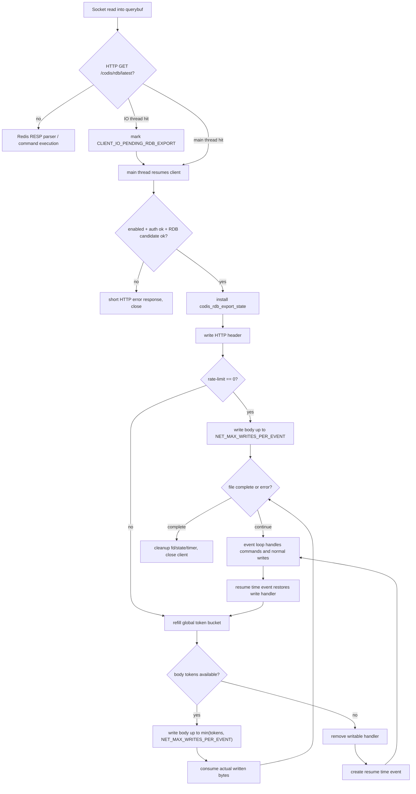

# redis8-rdb-http-export-rate-limit design

## 0. 术语约定

- **RDB HTTP export**：已验收 feature `2026-06-01-redis8-rdb-http-export` 中的固定路径下载能力，即 Redis 8 Codis Server 在现有 Redis 端口上处理 `GET /codis/rdb/latest`，认证后把当前 `server.rdb_filename` 对应的已有 RDB 文件流式返回。
- **RDB export 全局限速**：本 feature 指单个 Redis Server 进程内所有 RDB HTTP export 连接共享同一个 body 传输速率上限。这里的“全局”只限定在 RDB HTTP export 子系统内，不是 Redis Server 全局网络限速，也不会让普通 Redis 读写命令匹配 token bucket。
- **低优先级写出**：Redis 内核没有对不同 client fd 配置“命令优先、导出次之”的硬优先级队列。本 feature 的低优先级是协作式的：RDB export 每次只写有限 body 字节，额度不足时移除 writable handler，通过 time event 延后恢复，让主事件循环先处理普通命令读写、IO thread 回主线程队列和 Redis 自身 beforeSleep 任务。
- **body 限速**：限速只约束成功导出时的 RDB body 字节。HTTP header 与错误响应体很小，不参与限速，避免认证失败、404、400 这类短响应被无意义拖慢。
- **原始命令执行线程模型**：Redis 普通命令仍按原有模型处理：IO thread 只做网络读写/解析辅助和移交，命令解析后的实际执行仍在 Redis 主线程完成。本 feature 不能让普通命令经过 RDB export token bucket，不能把普通命令执行迁到其他线程，也不能改变 Redis 主线程执行命令的顺序语义。
- **兼容默认值**：`codis-rdb-export-rate-limit 0` 表示不限速，保持 `2026-06-01-redis8-rdb-http-export` 的传输行为。

防冲突结论：本 feature 是 `2026-06-01-redis8-rdb-http-export` 的增量保护能力，不改变导出路径、认证 header、候选 RDB 文件选择规则，也不触发 `SAVE` / `BGSAVE`。它只改变成功 body 传输的调度和速率。

## 1. 决策与约束

### 需求摘要

用户需要给 Redis 8 RDB HTTP export 增加可配置限速，防止 dashboard 或外部运维系统拉取大 RDB 时，导出写出回调长期占用 Redis 主线程，影响普通客户端命令执行。同时需要确认 Redis 内核里如何“降低这个功能优先级、优先执行命令”。

成功标准：

- 默认配置下，RDB HTTP export 行为与已验收版本一致：未开启 export 时不可用；开启 export 但 rate limit 为 `0` 时不额外限速。
- 配置正数 `codis-rdb-export-rate-limit` 后，所有活跃 RDB export 连接共享该 Redis Server 进程级 body 带宽预算。
- 限速生效时，RDB export 不在一个 writable callback 里连续写大文件；每次写出 body 后主动让出 Redis 主线程。
- 大 RDB 下载期间，其他 Redis 客户端的普通命令仍由 Redis 主线程按既有模型执行，不能因为 export 连接 socket 一直可写而被长期饿死。
- 普通 Redis 命令的解析、执行和 reply 写出不检查、不消耗 RDB export token bucket；普通大 value 返回仍走 Redis 既有 `writeToClient` 与 `NET_MAX_WRITES_PER_EVENT` 行为。
- 限速和低优先级设计不得改变原始命令执行线程模型：普通命令的 IO thread 移交规则、主线程执行规则、普通 reply 写出路径和 Redis command 调度语义保持不变。
- 配置能通过 Redis config 框架暴露，支持 `CONFIG GET`；是否支持 `CONFIG SET` 需要明确。
- 不改 HTTP API，不新增 Redis 命令，不改 proxy/dashboard/coordinator 协议。

假设：

- 当前 RDB export 的 auth、文件打开、streaming state 安装和 body 写出都在 Redis 主线程执行；IO thread 只做 socket read 和移交。这是 `2026-06-01` feature 的既有安全边界。
- 用户关心的是主线程命令延迟和总写出资源，不是多个下载客户端之间的严格公平分配。
- 生产侧仍应使用网络隔离、外层鉴权和合理的 dashboard 拉取策略；本 feature 只降低单 Redis 进程内 RDB body 写出对主线程的冲击。

明确不做：

- 不把 RDB HTTP export 搬到 Redis IO thread、BIO thread 或新 worker thread 中执行。Redis command 执行仍是主线程，跨线程持有 client/connection/file streaming state 风险高，且 IO thread 不是命令执行代理。
- 不修改 `aeProcessEvents` 为全局优先级调度器。Redis 上游事件循环按 poll/epoll 返回的 ready fd 逐个触发，并没有 per-client priority API；改这里会影响所有网络连接和模块。
- 不改变普通 Redis 命令的线程归属、执行顺序和 reply 写出路径；RDB export 的限速与暂停恢复只能在 `codis_rdb_export.c` 的 export client body streaming 内部实现。
- 不实现 per-client 公平调度、并发下载配额、队列排队、Range、断点续传、压缩、加密、独立 HTTP 端口或 dashboard 侧新 UI。
- 不限制 403/404/400 等短错误响应。
- 不对普通 Redis command / reply 做全局限速；如果未来需要限制所有客户端网络出口，那是另一个功能，风险和语义都不同。

### 复杂度档位

走“主线程热路径协作式让出 + 进程级带宽预算”档位：

- Compatibility = additive：新增配置默认 `0`，保持原行为。
- Scheduler = cooperative：不改 Redis 事件循环核心，只让 export 写回调少做事、可暂停、可延后恢复。
- Resource = export-global cap：所有 RDB export 连接共享一个 server 级 token bucket，保护主线程中由 RDB export 产生的总写出工作量。
- Maintenance = local patch：主要改 `codis_rdb_export.c`、`server.h`、`config.c` 和配置模板，不扩张 proxy/dashboard。

### 关键决策

1. **新增 `codis-rdb-export-rate-limit`，语义为全局 body bytes/sec**

   默认值：

```text
codis-rdb-export-rate-limit 0
```

   含义：

- `0`：不限速，保持旧版本行为。
- `>0`：单个 Redis Server 进程内所有 RDB export 连接共享该 body 速率上限，单位为 bytes/sec。配置解析优先复用 Redis memory/size 配置能力，使运维可用 `1mb`、`64kb` 这类 Redis 已有单位写法；如果实现阶段发现当前 config helper 不适合，退回纯整数 bytes/sec，但文档和测试要固定最终语义。

   决策：这个配置应支持 `CONFIG SET`，因为它是运行期运维保护旋钮，不涉及开启导出口或替换密钥的安全边界。active download 在下一次 body 写出或恢复 timer 时读取最新值。`CONFIG REWRITE` 按 Redis 既有机制持久化。

2. **使用 RDB export server 级 token bucket，不做 per-client-only 限速**

   只做 per-client 限速会留下明显缺口：N 个 dashboard/运维下载连接会把主线程 body 写出总量放大到 N 倍。用户目标是保护 Redis 主线程命令执行，因此限速对象应是 Redis Server 进程级总预算。

   这个预算只被 RDB export body 写出路径读取和消耗。普通 Redis 客户端进入 `processInputBuffer`、`processCommand`、`writeToClient` 时不查这个 bucket，也不会因为 export 限速配置而被限速。

   token bucket 设计：

- `rate_limit == 0` 时跳过 bucket。
- `rate_limit > 0` 时按 Redis monotonic time 补充 token。
- bucket burst cap 不使用“一整秒 rate”作为容量，而限制为最多一个写出切片，建议 `min(rate_limit, NET_MAX_WRITES_PER_EVENT)`。这样 export 空闲一段时间后不会一次性攒出一秒大突发。
- 每次 body 实际 `connWrite` 成功多少字节，就从 bucket 扣多少字节。
- header 与错误响应不扣 token。

3. **低优先级不靠修改 Redis command 执行，而靠 export 自己暂停 writable handler**

   Redis 8 现有网络写出已有类似保护：普通 client reply 在 `writeToClient` 中超过 `NET_MAX_WRITES_PER_EVENT` 后会中断本次写出，注释明确目的就是在单线程 server 中让其他 client 也能被服务。当前 RDB export 也已经用这个常量作为单回调上限，但大 RDB 在 socket 长期 writable 时仍会频繁进入 export write handler。

   本 feature 在正数限速下进一步处理：

- body token 不足时，对 export 连接执行 `connSetWriteHandler(c->conn, NULL)`，从 AE writable 监听里摘掉。
- 计算下一次可发送一个切片的延迟，注册 `aeCreateTimeEvent(server.el, delay_ms, codisRdbExportResumeTimeProc, c, NULL)`。
- time event 到期后只恢复这个 export 连接的 write handler，不直接在 time event 里发送文件。
- 真正发送仍发生在下一次 writable callback 中；这样普通命令读事件、普通 reply 写事件、IO thread 回主线程处理、`beforeSleep` 任务都有机会先运行。

   结论：这里不是 Redis 内核硬优先级，而是避免 RDB export 连接因为“永远可写”而每轮都占用主线程。对用户目标而言，这是低风险、局部、可维护的优先级降低方案。

4. **不把文件 body 放入 Redis reply buffer，也不使用 `sendfile`**

   继续保留 `2026-06-01` 的专用 streaming state。原因：

- reply buffer 会把大 RDB 推入 Redis 客户端输出缓存和内存管理路径，违背 streaming 初衷。
- `sendfile` 对 TLS/抽象 connection 不通用，也绕过 Redis `connWrite` 统计与错误处理，不适合作为首选。
- 当前 `connWrite` 路径能兼容普通 TCP 和 Redis connection abstraction。

5. **active download 清理必须同时清理 throttle timer**

   RDB export client 可能因为传输完成、client 断开、短读、Redis close async 等路径结束。只要状态里挂了 resume time event，cleanup 必须删除 timer 或把状态标记为无效，避免 time event 回调访问已释放 client/state。

## 2. 名词与编排

### 2.1 名词层

#### RDB export throttle config

现状：

- `redisServer` 已有 `codis_rdb_export_enabled` 和 `codis_rdb_export_auth`。
- `codis-rdb-export-enabled` / `codis-rdb-export-auth` 均为 immutable；开启 export 需要重启。
- 现有 RDB body 写出只受 `NET_MAX_WRITES_PER_EVENT` 单回调上限约束，没有可配置总速率。
- 代码锚点：`extern/redis-8.6.3/src/server.h` 定义 server 字段和 `NET_MAX_WRITES_PER_EVENT`；`extern/redis-8.6.3/src/config.c` 注册 `codis-rdb-export-*` 配置；`extern/redis-8.6.3/src/codis_rdb_export.c` 执行 body 写出。

变化：

- `redisServer` 新增：

```c
size_t codis_rdb_export_rate_limit;       /* bytes/sec, 0 means unlimited */
long long codis_rdb_export_rate_tokens;   /* available body bytes */
mstime_t codis_rdb_export_rate_last_ms;   /* last token refill time */
```

- `config.c` 新增 `codis-rdb-export-rate-limit`：
  - 默认 `0`。
  - 非 sensitive。
  - 支持 `CONFIG GET`。
  - 建议支持 `CONFIG SET`，active download 读取最新值。
  - 允许 `CONFIG REWRITE`。

#### Throttled streaming state

现状：

- `client.codis_rdb_export_state` 持有 `fd`、`filename`、`header`、body buffer、offset 等状态。
- cleanup 负责关闭 fd、释放 sds、释放 state，并把 client state 清空。
- 代码锚点：`extern/redis-8.6.3/src/codis_rdb_export.c` 的 `codisRdbExportState`、`codisRdbExportWriteHandler`、`codisRdbExportCleanupClient`。

变化：

- `codisRdbExportState` 新增：

```text
resume_time_event_id
throttle_paused
```

- 初始 `resume_time_event_id = AE_DELETED_EVENT_ID` 或等价哨兵值。
- 暂停时移除 writable handler 并创建 resume time event。
- 恢复时清空 timer id，重新设置 writable handler。
- cleanup 时如果 timer id 有效，调用 `aeDeleteTimeEvent(server.el, id)`。

#### Token bucket helper

现状：

- Redis 8 `aeProcessEvents` 会按 poll/epoll 返回的 ready fd 触发 readable/writable callback；同一 fd 默认先 readable 后 writable，但没有给不同 client 设置业务优先级的接口。
- 普通 Redis reply 在 `extern/redis-8.6.3/src/networking.c` 的 `writeToClient` 中使用 `NET_MAX_WRITES_PER_EVENT` 做单回调写出上限。

变化：

新增 helper 只在主线程调用：

```text
codisRdbExportRefillRateLimit(now)
codisRdbExportBodyAllowance()
codisRdbExportConsumeBodyBytes(n)
codisRdbExportPauseUntilBudget(c, state)
codisRdbExportResumeTimeProc(...)
```

约束：

- helper 不访问 proxy/dashboard/coordinator。
- helper 不执行 Redis command，也不触碰 keyspace。
- helper 只用于成功 body 传输，不影响错误响应。
- helper 只由 `codis_rdb_export.c` 的 body streaming 路径调用，不进入普通 Redis command 解析和普通 reply 写出路径。
- 所有 token 与 timer 状态都在 Redis 主线程读写，避免 atomic/lock。

### 2.2 编排图



### 2.3 挂载点

- `extern/redis-8.6.3/src/server.h`
  - 新增 `redisServer` 限速配置和 token bucket 字段。
  - 如需要，新增 `codisRdbExportWake...` 原型。

- `extern/redis-8.6.3/src/config.c`
  - 注册 `codis-rdb-export-rate-limit`。
  - 配置类型优先复用 Redis size/memory parser。
  - 默认值 `0`，`CONFIG SET` 可改，`CONFIG REWRITE` 可写。

- `extern/redis-8.6.3/src/codis_rdb_export.c`
  - 在 `codisRdbExportState` 中加入 timer/paused 状态。
  - 在 body 写出路径加入 token bucket 计算、扣减和暂停恢复。
  - cleanup 同步删除 pending resume time event。
  - 不改 HTTP path/auth/RDB candidate 逻辑。

- `extern/redis-8.6.3/redis.conf`
  - 增加配置说明和默认值。

- `config/redis.conf`
  - 同步默认配置模板。

- `extern/redis-8.6.3/tests/unit/codis_rdb_export.tcl`
  - 覆盖配置默认值、`CONFIG SET`、限速 body 传输和下载中普通命令响应。

不应改动：

- `pkg/proxy`、`pkg/topom`、`cmd/*`：本 feature 不改变 Go 侧协议。
- Redis command table / command JSON：本 feature 不新增 Redis 命令。
- `ae.c`：本 feature 不改事件循环核心调度。
- `iothread.c`：现有 IO thread handoff 规则继续成立，除非实现阶段发现需要增加注释或断言。

### 2.4 推进策略

1. **配置与状态**
   - 新增 `codis-rdb-export-rate-limit` 和 server token bucket 字段。
   - 默认 `0`，确认 `CONFIG GET codis-rdb-export-rate-limit` 返回默认值。
   - 退出信号：`make codis-server` 通过；Redis 配置加载和 rewrite 行为符合预期。

2. **body 限速 helper**
   - 在 `codis_rdb_export.c` 内实现主线程 token bucket。
   - `rate_limit == 0` 直接走旧写出路径。
   - `rate_limit > 0` 时限制单次 body write allowance。
   - 退出信号：小 RDB 在不限速时仍一次性传输；限速时 body 传输耗时有可观察下限。

3. **低优先级暂停恢复**
   - token 不足时移除 writable handler。
   - 创建 resume time event，time event 只恢复 write handler。
   - cleanup 删除 timer。
   - 退出信号：大 RDB 限速下载期间，另一个 Redis client 的 `PING` / `GET` 能及时返回。

4. **测试与回归**
   - 扩展 `unit/codis_rdb_export`。
   - 覆盖 enabled/auth 原有测试，避免限速改动破坏默认关闭、认证、404、HTTP 精确拦截和 IO thread handoff。
   - 退出信号：`cd extern/redis-8.6.3 && ./runtest --single unit/codis_rdb_export` 通过；必要时补跑 `./runtest --single unit/protocol`。

### 2.5 结构健康度与微重构

健康度判断：

- 已按 CodeStable compound 搜索 `codis_rdb_export`、Redis 8 RDB HTTP export、Redis event loop、`NET_MAX_WRITES_PER_EVENT`、目录归属和命名 convention，未命中需要遵守或冲突的既有 convention。
- 当前 RDB export 主逻辑集中在 `codis_rdb_export.c`，这是正确边界。限速也应留在同一文件内，避免把策略塞到 `networking.c` 或 `ae.c`。
- `networking.c` 的现有挂载点只负责在 RESP parser 前调用 helper，不应继续扩张。
- `iothread.c` 的现有规则已经把 RDB export 强制交回主线程，不需要改成“IO thread 负责导出”。IO thread 更像 Redis 网络读写辅助，不是 codis proxy，也不是 command executor。

允许的微重构：

- 把现有 body 写出循环中的“写 header”和“写 body”分成两个小 helper，便于只对 body 套限速。
- 把 `codisRdbExportWriteOrDefer` 改成能区分 `EAGAIN/defer` 与 fatal error 的返回值，避免限速逻辑和 socket backpressure 逻辑混在一起。
- cleanup 中集中处理 fd、sds、timer，确保所有退出路径一致。

不建议的重构：

- 不把 RDB export 改造成 Redis reply buffer response。
- 不引入跨线程队列传递 file chunks。
- 不修改 Redis `ae` ready event 排序。

## 3. 验收契约

### 功能契约

- 默认配置：
  - `CONFIG GET codis-rdb-export-rate-limit` 返回 `0`。
  - 既有 `codis-rdb-export-enabled no` 行为不变。

- 不限速：
  - `codis-rdb-export-rate-limit 0` 时，成功导出的 HTTP header、`Content-Length`、body 内容与 `2026-06-01` feature 一致。

- 正数限速：
  - 设置 `codis-rdb-export-rate-limit <N>` 后，成功导出的 body 传输按 server 级预算推进。
  - 单个 Redis Server 进程内多个 export 连接共享总预算；不承诺连接间严格公平。
  - HTTP 错误响应不被限速。
  - 普通 Redis 命令和普通 Redis reply 不被该配置限速，也不消耗该配置的 token。

- 运行期调整：
  - `CONFIG SET codis-rdb-export-rate-limit <N>` 对后续 body 写出生效。
  - `CONFIG SET codis-rdb-export-rate-limit 0` 恢复不限速语义。

### 线程与优先级契约

- 本 feature 的第一线程约束：限速与低优先级实现不能影响 Redis 原始命令执行线程模型。普通命令仍由 Redis 主线程执行；IO thread 仍只承担 Redis 既有网络读写/解析辅助职责；普通命令不会进入 RDB export token bucket。
- IO thread 仍只做 HTTP export 命中后的移交，不执行 auth、open、streaming 和限速状态变更。
- Redis command 仍由主线程执行。本 feature 不改变 Redis 单线程命令执行模型。
- 低优先级的实现方式必须是 RDB export 写回调主动让出：
  - 单次 body 写出不超过 `NET_MAX_WRITES_PER_EVENT`。
  - 限速 token 不足时移除 export writable handler。
  - time event 到期后恢复 writable handler，而不是直接写文件。
- 不允许为了本 feature 修改 `aeProcessEvents` 的全局事件调度语义。

### 兼容契约

- HTTP path、method、auth header、RDB candidate 校验、`SAVE` / `BGSAVE` 禁止规则不变。
- RESP `GET /codis/rdb/latest` 这类普通 Redis 请求仍不进入 HTTP export。
- `codis-rdb-export-enabled` 与 `codis-rdb-export-auth` 的 immutable/sensitive 语义不变。
- 不新增 proxy/dashboard/coordinator API。

### 测试建议

- 配置测试：
  - 默认 `CONFIG GET codis-rdb-export-rate-limit`。
  - `CONFIG SET codis-rdb-export-rate-limit 0`、正数、非法值。
  - `CONFIG REWRITE` 如当前 Redis test 环境允许。

- 限速测试：
  - 构造大于一个写出切片的 RDB 文件。
  - 配置较低但不拖慢 suite 太多的 rate，例如让 body 下载至少跨越两个 resume timer。
  - 断言 body 完整，`Content-Length` 不变，耗时有宽松下限。不要断言精确吞吐。

- 主线程优先测试：
  - 打开一个 throttled RDB download。
  - 在第二个 Redis client 上发送 `PING` 或 `SET/GET`。
  - 断言普通命令在合理短时间内返回，且 export 最终仍完成。

- 回归测试：
  - 原有 auth missing/wrong、404、HTTP method/path guard、IO thread handoff 测试继续通过。

## 4. 架构与文档回写

待实现验收后需要回写：

- `.codestable/requirements/redis-cluster-service.md`
  - 将当前边界中的“RDB HTTP export 不支持限速”改为“支持可配置全局 body 限速，默认不限速；不支持 per-client 公平、并发配额、Range、压缩、加密”。
  - 在实现进展中补充本 feature。

- `.codestable/architecture/ARCHITECTURE.md`
  - RDB HTTP export runtime flow 增加 throttle state、token bucket、resume time event。
  - 更新已知约束：streaming 仍在主线程，但正数限速时会自暂停，降低对普通命令处理的影响。

- `.codestable/features/2026-06-01-redis8-rdb-http-export/redis8-rdb-http-export-acceptance.md`
  - 不修改已验收结论；如需要，只在新 feature 验收报告里引用它作为基线。

- Redis 配置注释：
  - `extern/redis-8.6.3/redis.conf`
  - `config/redis.conf`

## 5. Review 提示

请重点确认这几个决策：

1. `codis-rdb-export-rate-limit` 是否按“server 级全局 body bytes/sec”实现，而不是 per-client。
2. 该配置是否允许 `CONFIG SET` 运行期调整。当前建议允许，因为它是运维限流旋钮。
3. 低优先级是否接受“协作式暂停 writable handler + timer 恢复”，而不是改 Redis `ae` 为硬优先级调度。
4. 是否需要额外增加并发下载上限。如果需要，应作为另一个配置进入本 feature；当前 draft 为保持范围小，先不做。

checklist：本设计已确认并生成 `redis8-rdb-http-export-rate-limit-checklist.yaml`，实现阶段按 checklist 推进。
