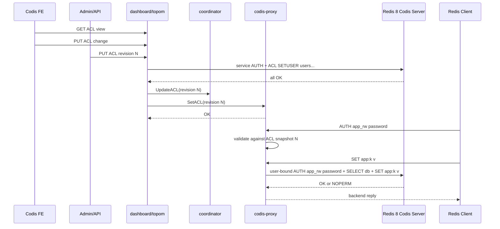

# codis-acl design

## 0. 术语约定

- **Codis ACL**：由 dashboard/topom 作为源头管理、存入 coordinator、同步到 proxy 和 Redis 8 Codis Server 的 ACL 规则集合。它复用 Redis ACL 用户/规则语义，但不是让每个 codis-server 各自成为独立配置源。
- **Client ACL identity**：客户端通过 `AUTH [username] password` 成功后绑定在 `Session` 上的用户名、认证版本和短期内存凭据。旧 `AUTH password` 视为 `default` 用户。
- **Backend service identity**：proxy/topom/codis-server 内部使用的服务账号，用于 `INFO`、slot 迁移、`ACL SETUSER`、`ACL DRYRUN`、`SLOTSMGRT*` 等内部动作。它不同于业务客户端账号。
- **User-bound backend connection**：稳定 slot 上普通客户端命令转发时，proxy 按 `backend addr + db + user + credential version` 建立的后端连接，让 Redis 8 backend 在执行命令时按该用户 ACL 判断权限。
- **ACL revision**：Codis ACL 的单调版本号。proxy 和 codis-server 只在同一 revision 同步完成后切换，避免同一用户在不同 slot 上看到不同 ACL。
- **ACL DRYRUN gate**：proxy 在执行本地命令或 Codis 内部包装命令前，用 Redis 8 `ACL DRYRUN username command args...` 向目标 backend 模拟检查原始客户端命令权限。
- **ACL FE editor**：Codis FE 中面向运维的 ACL 配置页面。它只调用 dashboard/topom ACL API，不直接连 proxy 或 codis-server，也不保存/回显明文密码。

防冲突结论：本文的 ACL 不是现有 `session_auth` 单密码模型，不是 `product_auth` / `xauth` 管理面认证，也不是 Redis Cluster ACL。`session_auth` 作为旧配置保留；启用 Codis ACL 后，客户端认证路径切到多账号 ACL。

## 1. 决策与约束

### 需求摘要

目标是让业务客户端继续连接 `codis-proxy`，但可以用 Redis 8 风格多账号认证：`AUTH password` 或 `AUTH username password`。认证成功后，普通 key 命令仍由 proxy 按 key 计算 slot 并转发到对应 Redis 8 Codis Server；权限判断要符合 Redis ACL 用户规则，并由 dashboard/topom 统一下发到所有 backend 和 proxy。

成功标准：

- 运维可通过 dashboard/topom API 设置一组 ACL 用户规则，并同步到所有 online Redis 8 Codis Server 和 online proxy。
- 运维可通过 Codis FE 查看当前 ACL revision、同步状态和用户列表，并新增/编辑/禁用/删除 ACL 用户。
- 客户端用正确账号密码连接任意 proxy 后可访问允许的命令/key；错误账号、错误密码、禁用用户返回 Redis 风格认证错误。
- 同一 ACL 用户访问不同 slot 的行为一致；不因 slot 属于不同 group 而出现权限差异。
- Codis 内部迁移、HA、stats 和管理命令仍使用服务账号，不要求业务用户拥有 `SLOTSMGRT*` / `ACL` / `CONFIG` 等危险权限。
- 旧配置默认不变：未启用 `codis_acl_enabled` 时，`session_auth` 和 `product_auth` 语义保持当前行为。

假设：

- 首版面向 Redis 8 Codis Server；Redis 3 fallback 不支持 ACL，只能在 `codis_acl_enabled=false` 下使用。
- ACL 规则由 Codis 管理后，用户不再直接登录单个 Redis Server 执行 `ACL SETUSER` 做持久配置；直改 backend ACL 会被下一次 topom 同步覆盖。
- 首版支持 RESP2 下的 `AUTH [username] password`；`HELLO 3` / RESP3 完整协议切换不在本 feature 内。可以兼容 `HELLO 2 AUTH username password`，但不承诺 RESP3 reply parity。

明确不做：

- 不实现 Redis Cluster 协议、`MOVED` / `ASK` 或 Redis Cluster ACL 语义。
- 不允许普通 Redis 客户端通过 proxy 执行 `ACL SETUSER` 管理 Codis ACL；ACL 管理入口只走 dashboard/topom/admin 管理面。
- 不把业务用户权限扩大到 Codis 内部命令；业务用户不需要也不应拥有 `SLOTSMGRT*`、`SLOTSRESTORE*`、`ACL SETUSER`、`CONFIG` 等内部权限。
- 不支持 Redis module / Redis Stack 命令的完整 ACL key-spec；proxy 当前不完整支持的命令不会因为 ACL 开启而变成支持。
- 不实现 Pub/Sub channel ACL；当前 proxy 已拒绝 `SUBSCRIBE`/`PSUBSCRIBE` 等阻塞订阅命令。
- 不承诺 ACL 修改后完全复刻 Redis 对既有连接的所有细节；Codis 为保证跨 proxy/slot 一致性，会按 revision 让旧会话重新认证。
- 不实现 ACL rule 的可视化 DSL builder；FE 首版提供结构化字段 + raw rule tokens 输入，避免把 Redis ACL 规则编辑器做成另一套解释器。
- 不在 FE、dashboard API 响应、stats 或日志中回显客户端明文密码。

### 复杂度档位

- Compatibility = backward-compatible（ACL 默认关闭，旧 `session_auth` / `product_auth` 不变）。
- Security = hardened（认证、授权、密码 hash、日志脱敏、内部服务账号和业务账号隔离都在外部输入边界上）。
- Concurrency = distributed-consistent（ACL revision 要跨 topom、多个 proxy、多个 Redis Server 收敛）。
- Performance = budgeted（稳定 slot 普通命令不能每次多一次授权 roundtrip；只在本地命令和迁移包装命令走 `ACL DRYRUN`）。
- Observability = operational（ACL revision、同步状态、proxy 当前 revision、失败同步原因要可查）。
- UX = utilitarian（FE 页面是运维表单和状态表，不做复杂 ACL rule 设计器）。
- Testability = e2e（需要 fake Redis 单测 + Redis 8 smoke 覆盖认证、授权、迁移和 revision 切换）。

### 关键决策

1. **Codis ACL 由 dashboard/topom 统一管理，不让单个 codis-server 成为配置源。**
   - 原因：Codis 按 slot 分片，同一用户规则必须跨所有 group 完全一致；单点 Redis ACL 配置会导致同一用户访问不同 slot 行为不一致。
   - 变化：新增 `models.ACL` 元数据和 `/codis3/{product}/acl` 存储路径，topom 在锁内维护期望 ACL revision。

2. **普通稳定 slot 命令使用 user-bound backend connection，让 backend 执行时按 Redis ACL 判断。**
   - 原因：这最接近 Redis 原生 ACL，避免在 Go proxy 中重新实现完整 ACL DSL 和 key pattern 判断。
   - 代价：后端连接池需要把用户身份纳入 key，并在内存中短期持有客户端认证凭据用于重连；ACL revision 切换时必须关闭旧用户连接。

3. **Codis 内部命令始终使用 backend service identity。**
   - 原因：迁移期间 proxy 会发 `SLOTSMGRTTAGONE` / `SLOTSMGRT-EXEC-WRAPPER`，topom 会执行迁移、stats、复制控制；如果让业务用户执行这些命令，等于把内部运维权限暴露给业务账号。
   - 约束：内部动作执行前若代表某条客户端命令产生用户可见结果，先对原始客户端命令做 `ACL DRYRUN`，再用服务账号执行包装命令。

4. **客户端认证由 proxy 使用 Codis ACL snapshot 校验，后端 ACL 用于执行期和直连保护。**
   - 原因：`AUTH` 没有 key，proxy 没有天然目标 slot；随便挑一个 backend 做认证会把认证可用性绑到单个 Redis 进程，且在 ACL 未完全同步时产生不确定结果。
   - 安全口径：proxy 只保存密码 hash 到 coordinator；客户端发来的明文密码只保存在当前 session/后端连接需要的内存路径，不写日志、不进入 coordinator、不进 stats。

5. **ACL revision 切换采用 fail-closed。**
   - topom 先把新 ACL 应用到所有目标 Redis Server；全部成功后写 coordinator revision，再推给所有 online proxy。
   - proxy 收到新 revision 后关闭旧 user-bound backend connection，已有 ACL 会话标记为 stale；下一条非 `AUTH` 命令返回 `NOAUTH Authentication required`，客户端重新认证后进入新 revision。
   - 若任一 Redis Server 同步失败，proxy 继续使用旧 revision，不启用半同步 ACL。

6. **首版用 Redis ACL 规则子集承载 Codis 可路由命令。**
   - 支持用户启用/禁用、SHA-256 password hash、命令 allow/deny、命令 category、key pattern、read/write key pattern。
   - 明确不承诺 selectors、channel pattern、module command、RESP3 map reply parity。
   - 对 proxy 不支持的命令，ACL 允许也不会放行；proxy unsupported command 边界优先。

7. **FE 只做 dashboard/topom 的受控编辑面，不成为 ACL 状态源。**
   - FE 加载的是 dashboard/topom 返回的 redacted view；提交的是用户操作意图。
   - 新密码可以从 FE 表单提交到 dashboard/topom，由 dashboard/topom 转成 hash 后写入 coordinator；API 响应不返回明文。
   - FE 不能直接调用 proxy admin API 或 Redis ACL 命令，避免绕过 topom revision gate。

## 2. 名词与编排

### 2.1 名词层

#### ACL 模型

现状：

- `models.Store` 目前有 slot、group、proxy、sentinel 路径，见 `pkg/models/store.go:37` 到 `pkg/models/store.go:59`；没有 ACL 路径或 ACL 模型。
- topom 通过 `models.NewStore` 持有 product 级元数据，见 `pkg/topom/topom.go:110`。

变化：

新增 Codis ACL 模型：

```text
ACL:
  revision: int64
  enabled: bool
  users: []ACLUser
  updated_at: string

ACLUser:
  name: string
  enabled: bool
  password_hashes: []string   # Redis ACL SHA-256 hex hash，不保存明文
  rules: []string             # Redis ACL rule tokens，不含明文 >password
```

新增 Store 契约：

```text
ACLPath(product) -> /codis3/{product}/acl
LoadACL(must) -> *ACL
UpdateACL(acl) -> error
```

接口示例：

```text
输入：ACL{revision: 12, enabled: true, users: [app_ro: on #hash ~app:* +@read]}
输出：coordinator 保存同一 revision；topom 可把它渲染成 Redis `ACL SETUSER app_ro reset on #hash ~app:* +@read`
错误：用户缺少 password hash 且非 nopass -> 配置校验失败
```

#### FE ACL view model

现状：

- Codis FE 是 `cmd/fe/assets/index.html` + `cmd/fe/assets/dashboard-fe.js` 的 AngularJS 单页应用；现有页面直接在 `MainCodisCtrl` 中维护 proxy、group、sentinel、RDB Analysis 等表格和表单。
- FE 目前没有 ACL 面板，也没有调用 `/api/topom/acl` 的逻辑。

变化：

新增 FE 展示模型，与 coordinator 内部模型分开：

```text
ACLView:
  revision: int64
  enabled: bool
  sync_status: string
  users: []ACLUserView

ACLUserView:
  name: string
  enabled: bool
  password_count: int
  rules: []string
  last_error: string
```

FE 编辑态：

```text
ACLUserEdit:
  name: string
  enabled: bool
  new_password: string        # 仅表单内短暂存在，提交后清空
  rules_text: string          # 每行一个 Redis ACL rule token 或空白分隔
```

接口示例：

```text
GET /api/topom/acl/{xauth}
  -> ACLView，不包含明文密码，不包含完整 password_hashes

PUT /api/topom/acl/{xauth}
  <- {enabled, users:[{name, enabled, new_password?, rules:[]}]}
  -> {revision, sync_status}

错误：规则校验失败 -> FE 显示 dashboard/topom 返回的错误，不本地猜测修复
```

#### Proxy ACL snapshot 与会话身份

现状：

- `Session` 只保存 `authorized bool`，`AUTH` 只比较 `Config.SessionAuth`，见 `pkg/proxy/session.go:352` 到 `pkg/proxy/session.go:380`。
- `Proxy` 已有进程级 guard 用于 `session_auth` 防暴力破解，见 `pkg/proxy/proxy.go:72`。

变化：

新增 proxy 进程内 ACL runtime：

```text
ACLSnapshot:
  revision: int64
  enabled: bool
  users_by_name: map[string]ACLUser

SessionACLIdentity:
  username: string
  credential_hash: string
  password: []byte       # 只在内存中用于 user-bound backend AUTH
  revision: int64
  stale: bool
```

认证语义：

```text
AUTH password
  -> username = "default"
AUTH username password
  -> username = username

成功：SessionACLIdentity 写入 session，返回 OK
失败：返回 Redis authentication error，不改变旧身份
revision stale：下一条非 AUTH 命令返回 NOAUTH，要求重新 AUTH
```

#### 后端认证身份

现状：

- proxy 后端连接建连后只发 `AUTH <product_auth>`，见 `pkg/proxy/backend.go:168` 到 `pkg/proxy/backend.go:191`。
- topom Redis client 也只支持 `ProductAuth` 单密码，见 `pkg/topom/topom.go:94` 和 `pkg/utils/redis/client.go:39` 到 `pkg/utils/redis/client.go:44`。

变化：

新增结构化 Redis auth identity：

```text
RedisAuthIdentity:
  username: string
  password: string
```

配置语义：

```toml
backend_auth_username = ""
backend_auth_password = ""
```

- 两者为空：继续兼容 `product_auth`，发送旧 `AUTH <product_auth>`。
- 只配置 password：发送旧 `AUTH <password>`，用于 default user。
- 同时配置 username/password：发送 `AUTH <username> <password>`。
- 只配置 username：配置校验失败。

该身份用于 topom 管理 Redis、proxy service pool、`ACL SETUSER`、`ACL DRYRUN`、slot 迁移和 Redis 8 Codis Server server-to-server migration auth。

#### User-bound backend pool

现状：

- proxy 后端连接池按 `addr` 复用 `sharedBackendConn`，见 `pkg/proxy/backend.go:489` 到 `pkg/proxy/backend.go:520`。
- `sharedBackendConn` 内部按 DB 和 parallel 维度建 `BackendConn`，没有用户身份维度。

变化：

后端池扩展为两类：

```text
service pool:
  key = addr + db + service identity
  用于内部动作和无客户端身份的管理路径

user pool:
  key = addr + db + username + credential_hash + acl_revision
  用于普通稳定 slot 客户端命令
```

稳定 slot 普通命令通过 user pool 进入后端，让 Redis 执行期 ACL 判断命令和 key 权限。迁移预处理、迁移包装、本地 proxy 命令和 topom 运维动作使用 service pool。

#### Redis 8 Codis Server 迁移认证

现状：

- Redis 8 同步迁移目标认证仍基于 `server.requirepass` 发送旧 `AUTH <password>`，见 `extern/redis-8.6.3/src/slots.c:519` 到 `extern/redis-8.6.3/src/slots.c:523`。
- 异步迁移已有 `SLOTSRESTORE-ASYNC-AUTH2` 命令，但 prelude 当前仍只发 `SLOTSRESTORE-ASYNC-AUTH <requirepass>`，见 `extern/redis-8.6.3/src/slots_async.c:418` 到 `extern/redis-8.6.3/src/slots_async.c:421` 和 `extern/redis-8.6.3/src/slots_async.c:903` 到 `extern/redis-8.6.3/src/slots_async.c:905`。

变化：

Redis 8 Codis Server 增加 Codis migration auth 配置：

```text
codis-migration-auth-user
codis-migration-auth-pass
```

迁移源连接目标时：

- username 为空且 password 非空：发送旧 `AUTH <password>` 或 `SLOTSRESTORE-ASYNC-AUTH <password>`。
- username/password 均非空：发送 `AUTH <user> <pass>` 或 `SLOTSRESTORE-ASYNC-AUTH2 <user> <pass>`。
- 均为空：不认证，保持兼容。

### 2.2 编排层



现状：

- topom 初始化 proxy 时只下发 slots、start、sentinels，见 `pkg/topom/topom_proxy.go:126` 到 `pkg/topom/topom_proxy.go:139`。
- proxy admin API 已有 `FillSlots` / `SetSentinels` 等 xauth 保护入口，见 `pkg/proxy/proxy_api.go:71` 到 `pkg/proxy/proxy_api.go:85`。
- topom group/server 管理路径直接用 `ProductAuth` 连接 Redis 并检查 `SLOTSINFO`，见 `pkg/topom/topom_api.go:399` 到 `pkg/topom/topom_api.go:405`。

变化：

1. ACL 管理流程：
   - FE 或 Admin/API 提交 ACL 模型；FE 提交的是 redacted view + 新密码意图，dashboard/topom 负责 hash 和校验。
   - topom 校验模型：用户名格式、hash 格式、规则子集、default user 规则、service user 不可被业务覆盖。
   - topom 用 backend service identity 连接所有目标 Redis Server，执行 `ACL SETUSER <user> reset ...`；必要时删除被移除用户。
   - 全部 Redis 成功后写 coordinator ACL revision。
   - topom 向所有 online proxy 下发 `SetACL(revision, users)`。
   - proxy 接收后安装 snapshot，关闭旧 user-bound backend connection，标记旧 session stale。

2. FE 配置流程：
   - `MainCodisCtrl` 在选中 product 后加载 ACL view。
   - ACL 面板展示 revision、enabled、sync status、用户表、每个用户的 enabled、password count、rules。
   - 新增/编辑用户时，FE 只做基础输入校验：用户名非空、rule token 非空、危险服务用户不可编辑。
   - 提交前复用现有 `alertAction` 确认；提交成功后重新 GET ACL view。
   - 提交失败时保留编辑态并展示 dashboard/topom 返回的错误；新密码字段不写入 `$scope.acl_model` 的持久 view。

3. 客户端认证流程：
   - ACL 未启用：完全走现有 `session_auth`。
   - ACL 启用：`AUTH password` 映射到 `default`，`AUTH username password` 映射到指定用户。
   - proxy 用本地 snapshot 的 SHA-256 hash 校验密码；成功后 session 保存 identity 和 revision。
   - `AUTH` 失败仍进入现有 brute-force guard 计数，但 guard 的统计维度扩展为 username 可选字段只做聚合，不在 stats 暴露密码或 IP 列表。

4. 普通命令转发流程：
   - `Session.handleRequest` 解析命令、检查是否已认证且 revision 未 stale。
   - proxy 仍按现有 key 解析和 slot 计算路由。
   - 稳定 slot 普通命令走 user-bound backend connection，由 Redis 8 backend 实际执行 ACL 检查。
   - Hot key cache 命中前必须先经过 ACL 检查；若命令会本地返回，不允许绕过授权直接回缓存。

5. 迁移和本地命令流程：
   - `forwardSync` 的 `SLOTSMGRTTAGONE`、`forwardSemiAsync` 的 `SLOTSMGRT-EXEC-WRAPPER` 使用 service pool。
   - 包装执行原始客户端命令前，proxy 用目标/源 backend 执行 `ACL DRYRUN username original-command original-args...`；返回 OK 才执行服务账号包装命令。
   - `CLIENT LIST`、`CLUSTER NODES`、`SLOTSMAPPING`、`INFO` 等 proxy 本地命令使用 `ACL DRYRUN` 校验同名 Redis/Codis 命令；proxy 不支持的 `ACL SETUSER` 等管理命令仍拒绝。

6. Redis server-to-server migration：
   - Redis 8 Codis Server 同步/异步迁移使用 `codis-migration-auth-*` 对目标认证。
   - topom 在 ACL 同步时确保 service user 具备 `SLOTSRESTORE*`、`SLOTSMGRT*`、`ACL DRYRUN`、`INFO`、`SELECT`、`PING`、`CONFIG` 等 Codis 内部需要的权限。

流程级约束：

- **一致性**：proxy 只接受完成 Redis Server 同步后的 ACL revision；失败时继续使用旧 revision。
- **错误语义**：认证失败返回 Redis authentication error；权限失败透传 backend `NOPERM` 或返回同等 `NOPERM`；ACL 未同步完成时管理 API 返回明确错误。
- **并发**：ACL snapshot 用 copy-on-write 安装；安装新 revision 时关闭旧 user pools，不阻塞已完成响应写回。
- **密钥处理**：明文密码只来自客户端 AUTH 和服务配置；不进入 coordinator、日志、stats、API 响应。session close 或 stale 后清空引用。
- **FE 密钥处理**：FE 表单中的 `new_password` 只在编辑态存在；提交成功、取消编辑或切换 product 后清空；API 响应不回显明文。
- **回滚**：重新提交旧 ACL revision 内容作为新 revision；proxy 不做本地手工回滚。
- **可观测**：topom stats 暴露 ACL revision/sync state；proxy stats 暴露当前 revision、stale sessions 数、user backend pool 数、ACL auth failures 聚合。

### 2.3 挂载点清单

- Coordinator 元数据：新增 `/codis3/{product}/acl` — 存储 Codis ACL desired state 和 revision。
- Dashboard/topom API：新增 `/api/topom/acl/:xauth` 管理入口 — 创建、更新、查看、删除用户规则并触发同步。
- Codis FE 页面：在 `cmd/fe/assets/index.html` 新增 ACL 配置面板并加载 `cmd/fe/assets/acl.js`，在独立 JS 中实现 ACL view/edit/submit 逻辑 — 运维通过 FE 管理 ACL。
- Proxy admin API：新增 `/api/proxy/acl/:xauth` — topom 下发 ACL snapshot / revision。
- Proxy 配置：新增 `codis_acl_enabled`、`backend_auth_username`、`backend_auth_password` — 开启多账号 ACL 和内部服务账号。
- Redis 8 Codis Server 配置：新增 `codis-migration-auth-user`、`codis-migration-auth-pass` — 支撑关闭 default user 后的 server-to-server slot migration。
- codis-admin CLI：新增 ACL 管理命令 — 作为 FE 之外的脚本化/应急操作入口。

### 2.4 推进策略

1. 微重构：先按第 2.5 节把 proxy session auth、本地命令 ACL wire、topom ACL API 和 FE ACL controller 承载点拆出独立文件。
   退出信号：编译通过，现有 `session_auth` 行为测试保持不变。
2. 名词骨架：加入 `models.ACL`、Store 路径、配置字段和结构化 Redis auth identity。
   退出信号：ACL 模型可 encode/decode，旧配置默认值不变。
3. 控制面：实现 topom ACL API、codis-admin ACL 命令、FE ACL 页面和 Redis Server `ACL SETUSER` 同步编排。
   退出信号：提交一份 ACL 后，所有 fake Redis/Redis 8 节点收到期望 `ACL SETUSER`。
4. Proxy 认证：实现 `AUTH [username] password`、ACL snapshot 安装、revision stale 和 brute-force guard 接入。
   退出信号：客户端能按多账号认证成功/失败，ACL 未启用时旧语义不变。
5. 后端执行：拆分 service pool 与 user-bound pool，普通稳定命令走用户身份，内部命令走服务身份。
   退出信号：允许用户的命令由 backend 返回成功，未授权命令返回 `NOPERM`，迁移包装不要求业务用户有内部权限。
6. Redis 8 migration auth：补齐 Redis 8 Codis Server 同步/异步迁移的 username/password 认证配置。
   退出信号：关闭 default user、只保留 service user 时，Redis 8 ↔ Redis 8 slot migration 成功。
7. 验收覆盖：补齐正常、边界、失败、revision 切换和回滚场景。
   退出信号：目标 proxy/topom package 测试和 Redis 8 ACL smoke 通过。

### 2.5 结构健康度与微重构

##### 评估

- 文件级 — `pkg/proxy/session.go`：788 行，已混合认证、请求分发、本地命令和多 key 聚合；本 feature 会新增 `AUTH [username] password`、ACL revision stale、`ACL WHOAMI`/`HELLO` 局部分支，继续堆在主文件会扩大职责。
- 文件级 — `pkg/proxy/backend.go`：522 行，承担 backend conn、shared pool、db 选择和认证；本 feature 会引入 service/user 两套池和结构化 auth，直接追加会让连接身份边界不清。
- 文件级 — `pkg/topom/topom_api.go`：1045 行，已有大量管理 API 路由和 handler；ACL 管理若继续写入同文件会加剧 API 文件膨胀。
- 文件级 — `cmd/fe/assets/dashboard-fe.js`：1307 行，已有 proxy/group/slots/sentinel/RDB 多组控制逻辑；ACL 编辑逻辑若继续堆在同一 controller 主体，会扩大前端文件膨胀。
- 文件级 — `cmd/fe/assets/index.html`：963 行，已有多个运维面板；ACL 面板需要新增表格和表单，但当前 FE 是单页静态资源，首版仍可按现有分区风格追加一个 ACL 面板。
- 文件级 — `pkg/models/store.go`：263 行，职责集中在路径和 Store helper；新增 ACL path/helper 属于现有职责延伸。
- 目录级 — `pkg/proxy`：当前同层 30 个文件，已有按能力拆文件的模式（如 `auth_bruteforce.go`、`hot_key_cache.go`、`cluster_nodes.go`）；本 feature 继续新增 `acl_*.go` 符合现有扁平 Go package 风格。
- 目录级 — `pkg/topom`：当前同层 27 个文件，已有 `topom_*` 能力文件模式；新增 `topom_acl.go` / `topom_acl_api.go` 符合现有风格。
- 目录级 — `pkg/models`：当前同层 11 个文件，按模型拆分；新增 `acl.go` 符合现有风格。
- 目录级 — `cmd/fe/assets`：现有前端资源是少量大文件，历史功能直接在 `index.html` 和 `dashboard-fe.js` 中追加；本 feature 若新建独立 JS 文件，需要同步 `index.html` script 加载，属于稳定可维护方向。

##### 结论：微重构（拆文件）

##### 方案

- 搬什么：把 `Session.handleAuth` 及其直接辅助逻辑从 `session.go` 搬到 `session_auth.go`；把新 ACL runtime 放到独立 `acl.go` / `acl_auth.go`；把 FE ACL 逻辑放到独立静态 JS，不继续塞进 `dashboard-fe.js` 主体。
- 搬到哪：`pkg/proxy/session_auth.go`、`pkg/proxy/acl.go`、`pkg/proxy/acl_backend.go`；topom 新增 `pkg/topom/topom_acl.go`、`pkg/topom/topom_acl_api.go`；models 新增 `pkg/models/acl.go`；FE 新增 `cmd/fe/assets/acl.js` 并由 `index.html` 加载。
- 行为不变怎么验证：搬出 `handleAuth` 后先跑现有 `pkg/proxy` auth 相关测试；在功能代码进入前，旧 `AUTH <password>` 行为和错误文本不变。
- 步骤序列：
  1. 只移动现有 `handleAuth` / `remoteAddr` 相关方法到 `session_auth.go`，不改逻辑。
  2. 跑目标 proxy 测试确认行为不变。
  3. 在 `index.html` 中新增 `acl.js` script 引用但先保持空模块/空函数，确认 FE 页面仍能加载。
  4. 再新增 ACL runtime、topom ACL API 和 FE ACL 页面逻辑。

##### 建议沉淀的 convention

- 是否稳定模式：稳定模式。
- 规则一句话：新增 FE 功能的较大 controller 逻辑优先放独立 `cmd/fe/assets/{feature}.js`，`dashboard-fe.js` 只保留共享入口和既有逻辑。
- 适用范围：`cmd/fe/assets`。
  → 建议 implement 跑通后走 `cs-decide` 归档为 `category: convention`。

##### 超出范围的观察

- `pkg/proxy/session.go` 的本地命令分发长期偏胖，`INFO`、`MGET/MSET/DEL/EXISTS`、slot introspection 可进一步按命令族拆文件；这属于后续 `cs-refactor`，不阻塞本 feature。
- `cmd/fe/assets/index.html` 已接近 1000 行，长期应该拆模板或迁移前端结构；这超出本 feature，首版只按现有 FE 架构追加 ACL 面板。

## 3. 验收契约

### 关键场景清单

- ACL 默认关闭：使用旧 `session_auth` 配置启动 proxy，`AUTH <password>`、错误密码、未认证命令的返回与当前行为一致。
- ACL 用户创建：通过 topom/admin 提交 `app_ro on #hash ~app:* +@read`，所有 online Redis 8 server 收到等价 `ACL SETUSER`，所有 online proxy 安装同一 revision。
- FE 加载：打开 Codis FE 选中 product 后，ACL 面板展示当前 enabled、revision、sync status 和用户列表。
- FE 新增用户：在 ACL 面板新增 `app_ro`、输入新密码和 rules 后提交，dashboard/topom 返回新 revision，页面刷新后显示用户、enabled 状态、password count 和 rules。
- FE 编辑用户：禁用某个用户或修改 rules 后提交成功，页面显示新 revision；该用户后续认证/访问行为按新 rules 生效。
- FE 错误展示：提交非法用户名、空 rules 或服务用户覆盖时，页面展示 dashboard/topom 错误并保留可编辑表单。
- 客户端认证成功：客户端 `AUTH app_ro correct-password` 后返回 `OK`，`ACL WHOAMI` 返回 `app_ro`。
- 客户端认证失败：未知用户、禁用用户、错误密码返回 Redis authentication error，不写入 session identity。
- 旧密码形式兼容：客户端 `AUTH password` 按 `default` 用户校验；default 未配置时返回认证失败。
- 稳定 slot 允许命令：`app_ro` 对 `GET app:k` 成功，访问不同 slot 中符合 `app:*` 的 key 行为一致。
- 稳定 slot 禁止命令：`app_ro` 对 `SET app:k v` 返回 `NOPERM` 或同等权限错误。
- key pattern 禁止：`app_ro` 对 `GET other:k` 返回 `NOPERM`，即使 key 所在 slot 后端不同也一致。
- Hot key cache：缓存命中前仍做 ACL 判断；无权限用户不能从 proxy 本地 cache 读到 value。
- 迁移中命令：slot migrating 时，允许用户执行被 ACL 允许的原始命令成功；业务用户不需要 `SLOTSMGRT-EXEC-WRAPPER` 权限。
- 内部迁移认证：关闭 default user、只保留 backend service user 时，Redis 8 ↔ Redis 8 同步和半异步迁移成功。
- 本地 proxy 命令授权：允许 `CLIENT LIST` 的用户能拿到 proxy 本地 client list；未允许用户得到 `NOPERM`。
- ACL revision 切换：提交新 revision 后旧 user-bound backend connection 被关闭，旧已认证 session 下一条非 `AUTH` 命令返回 `NOAUTH` 并要求重新认证。
- ACL 同步失败：任一 Redis Server `ACL SETUSER` 失败时，topom API 返回错误，proxy 继续使用旧 revision。
- Proxy 重启/上线：新 proxy reinit 时先收到当前 ACL snapshot，再开始接收客户端 ACL 认证。

### 明确不做的反向核对项

- 普通客户端通过 proxy 执行 `ACL SETUSER` 不应成功。
- ACL 开启不应让 `SUBSCRIBE`、`PSUBSCRIBE`、`MONITOR`、`CONFIG` 等当前 proxy unsupported/dangerous 命令绕过原有拒绝边界。
- coordinator 中不应存储客户端明文密码。
- proxy stats/API/FE 响应不应包含客户端明文密码。
- FE 页面不应直接调用 proxy admin ACL API 或 Redis server ACL 命令。
- Redis 3 fallback 不应被要求通过 ACL smoke。

## 4. 与项目级架构文档的关系

acceptance 阶段需要回写 `.codestable/architecture/ARCHITECTURE.md`：

- 在术语区新增 **Codis ACL**、**Client ACL identity**、**Backend service identity**。
- 在 proxy 结构与交互中补充 `AUTH [username] password`、ACL snapshot、user-bound backend pool、service pool 和 ACL revision stale 约束。
- 在 dashboard/topom 结构与交互中补充 `/codis3/{product}/acl`、`ACL SETUSER` 同步、proxy `SetACL` 下发。
- 在 FE 段落补充 ACL 配置页面：FE 只调用 dashboard/topom ACL API，展示 redacted ACL view，不作为 ACL 状态源。
- 在 Redis 8 Codis Server 段落补充 migration auth username/password 和关闭 default user 后的迁移约束。
- 在已知约束中说明：Codis ACL 管理会覆盖直改 backend ACL；ACL 不扩大 proxy unsupported command 边界；Redis 3 fallback 不支持 ACL。

相关输入：

- `.codestable/compound/2026-06-03-explore-codis-proxy-redis8-acl.md`
- Redis ACL 官方文档：https://redis.io/docs/latest/operate/oss_and_stack/management/security/acl/
- Redis AUTH 官方文档：https://redis.io/docs/latest/commands/auth/
- Redis ACL DRYRUN 官方文档：https://redis.io/docs/latest/commands/acl-dryrun/
