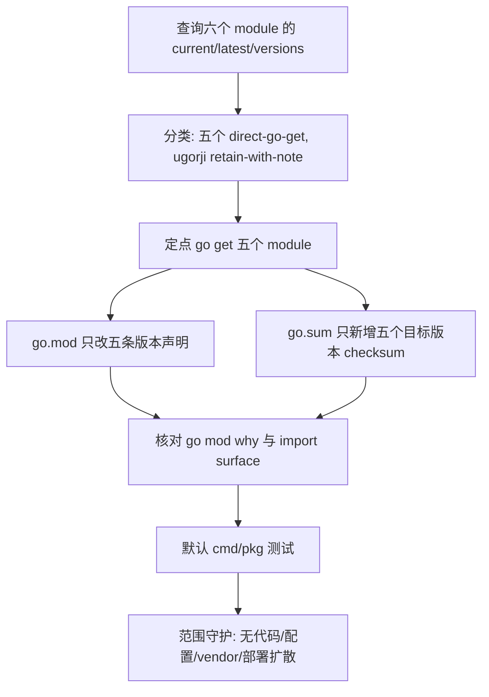

# dep-config-cli-utility-stack design

## 0. 术语约定

- **Config / CLI / utility stack**：本 feature 覆盖的六个 Go module：`github.com/BurntSushi/toml`、`github.com/docopt/docopt-go`、`github.com/google/uuid`、`github.com/emirpasic/gods`、`github.com/oxtoacart/bpool`、`github.com/ugorji/go`。它不是重写配置系统、CLI 参数模型、slot 调度或 RDB Analysis。
- **Target module version**：按 roadmap 第 4.1 节用 `GOPROXY=https://proxy.golang.org,direct go list -m ...` 查询到的 `@latest`。本次查询结果是 `toml v1.6.0`、`docopt-go v0.0.0-20180111231733-ee0de3bc6815`、`uuid v1.6.0`、`gods v1.18.1`、`bpool v0.0.0-20190530202638-03653db5a59c`、`ugorji/go v1.2.14`。
- **retain-with-note**：`@latest` 等于当前版本，或当前 module 不被默认构建路径触达时，本 feature 不为了“整理干净”而删除或重写 `go.mod`。`github.com/ugorji/go` 本次走这个策略。
- **Minimal module diff**：只让目标 module 的版本声明和 `go.sum` 对应 checksum 变化；不借机全量 `go mod tidy`，不重排依赖块。

防冲突结论：代码和 CodeStable 文档里已有 `Go module manifest`、`go.mod/go.sum`、`vendor/Godeps`、`Minimal module diff` 等叫法。本 design 沿用既有术语，不新增平行概念。

## 1. 决策与约束

### 需求摘要

本 feature 要把 `go.mod` 中配置解析、CLI 参数解析、UUID、slot action 排序辅助和 Martini render 间接 buffer pool 相关 module 升级到当前可解析版本，并明确 `github.com/ugorji/go` 当前不升级。服务对象是维护 Codis 构建和依赖安全的人。

成功标准是：`go.mod/go.sum` 只出现本组 module 的最小机械变化，Go 代码行为不变，默认 `go test ./cmd/... ./pkg/...` 通过，配置默认值、CLI 参数解析、slot action 流程和 RDB Analysis job id 行为不出现可观察回归。

明确不做：

- 不修改 `pkg/proxy/config.go` 或 `pkg/topom/config.go` 的配置结构、TOML tag、默认配置文本或输出格式。
- 不修改 `cmd/admin`、`cmd/dashboard`、`cmd/fe`、`cmd/ha`、`cmd/proxy` 的 usage 文本、参数名、参数默认值或分发逻辑。
- 不修改 `pkg/topom/topom_slots.go` 的 slot action 编排、排序规则或迁移语义。
- 不修改 RDB Analysis job id 生成逻辑，不替换 `uuid.NewV7`。
- 不升级 Martini web stack 本体：`github.com/go-martini/martini`、`github.com/martini-contrib/binding`、`github.com/martini-contrib/gzip`、`github.com/martini-contrib/render`、`github.com/codegangsta/inject` 留给 `dep-dashboard-martini-stack`。
- 不删除 `github.com/ugorji/go` direct require，不用本条做依赖清理或全量 `go mod tidy`。
- 不升级 Go toolchain，不改变 `go 1.26.1` module directive。
- 不修改 `third_party/jemalloc-go`、`extern/redis-8.6.3/`、Docker、部署脚本、前端资源或配置模板。

### 复杂度档位

按“项目内部依赖维护”默认档位走，偏离如下：

- Compatibility = backward-compatible：依赖版本升级不能改变 Codis 配置、CLI、proxy/topom/coordinator 或 Redis 协议的外部行为。
- Determinism = reproducible：版本目标和 checksum 必须来自 Go module query 与 `go.mod/go.sum`，不能依赖本地 module cache 状态。
- Testability = verified：本组触达多个入口包和 topom，必须用默认 cmd/pkg 测试覆盖。

### 关键决策

1. **五个 module 采用 `@latest`，`ugorji/go` 保留当前版本**。
   - 依据：2026-06-04 查询 `go list -m -json <module>@latest`，五个可升级 module 分别解析为 `toml v1.6.0`、`docopt-go v0.0.0-20180111231733-ee0de3bc6815`、`uuid v1.6.0`、`gods v1.18.1`、`bpool v0.0.0-20190530202638-03653db5a59c`。`github.com/ugorji/go @latest` 仍为 `v1.2.14`。
   - 约束：如果 implement 阶段查询结果变化，必须记录实际命令结果；不能猜测上游版本。

2. **`docopt-go` 与 `bpool` 目标是 pseudo version，但仍可作为本条目标版本**。
   - 依据：`go list -m -versions -json` 对 `github.com/docopt/docopt-go` 和 `github.com/oxtoacart/bpool` 没有返回 tagged version 列表，`@latest` 只能解析到 pseudo version。roadmap 已要求没有 tagged release 时写出最新 `@latest` pseudo，并由 feature-design 决定保留还是升级。
   - 取舍：二者都在默认构建路径中被触达，临时 worktree 试跑显示定点升级后 `go test ./cmd/... ./pkg/...` 通过，所以本条升级它们。

3. **同一 diff 中定点升级五个 module，不把 `ugorji/go` 放进升级命令**。
   - 命令形态：`GOPROXY=https://proxy.golang.org,direct go get github.com/BurntSushi/toml@v1.6.0 github.com/docopt/docopt-go@v0.0.0-20180111231733-ee0de3bc6815 github.com/google/uuid@v1.6.0 github.com/emirpasic/gods@v1.18.1 github.com/oxtoacart/bpool@v0.0.0-20190530202638-03653db5a59c`。
   - 依据：临时 detached worktree 试跑只改变 `go.mod` 五行并向 `go.sum` 新增 10 条 checksum，不新增 require，不修改 replace。

4. **不删除当前不被主 module 需要的 `github.com/ugorji/go`**。
   - 依据：`go mod why -m github.com/ugorji/go` 返回 `(main module does not need module github.com/ugorji/go)`，但本 roadmap 明确禁止用无目标全量 `go mod tidy` 收口依赖图。
   - 取舍：本条只记录“当前版本等于 latest 且默认构建不触达”，保留 direct require。删除它属于依赖 manifest 清理，不属于本次低风险升级闭环。

5. **不修改调用代码来适配新版 API，除非 implement 重新验证失败**。
   - 依据：现有调用面使用的是稳定入口：`toml.Decode` / `DecodeFile` / `NewEncoder`、`docopt.Parse`、`redblacktree`、`uuid.NewV7` / `uuid.Parse`。临时 worktree 定点升级后默认测试通过。
   - 约束：如果 implement 阶段出现 API 不兼容，应暂停回到 design/roadmap 讨论保留版本或扩大范围，不能在实现中顺手重写配置或 CLI 行为。

### 前置依赖

roadmap 条目 `dep-config-cli-utility-stack` 没有 `depends_on`，当前 `status: planned`。本 design 启动后将 roadmap item 改为 `in-progress`，并写入 feature 目录名。

## 2. 名词与编排

### 2.1 名词层

#### module_set

现状：

| module | scope | current | latest query | current source | reachability |
|---|---:|---|---|---|---|
| `github.com/BurntSushi/toml` | direct | `v0.2.1-0.20160717150709-99064174e013` | `v1.6.0` | `go.mod:6` | `pkg/proxy/config.go:9`, `pkg/topom/config.go:9` |
| `github.com/docopt/docopt-go` | direct | `v0.0.0-20160216232012-784ddc588536` | `v0.0.0-20180111231733-ee0de3bc6815` | `go.mod:8` | `cmd/*/main.go` CLI parsing |
| `github.com/google/uuid` | direct | `v1.5.0` | `v1.6.0` | `go.mod:12` | `pkg/topom/topom_rdb_analysis.go:21` |
| `github.com/emirpasic/gods` | direct | `v1.9.0` | `v1.18.1` | `go.mod:9` | `pkg/topom/topom_slots.go:10` |
| `github.com/oxtoacart/bpool` | direct | `v0.0.0-20150712133111-4e1c5567d7c2` | `v0.0.0-20190530202638-03653db5a59c` | `go.mod:19` | `cmd/fe -> martini-contrib/render -> bpool` |
| `github.com/ugorji/go` | direct | `v1.2.14` | `v1.2.14` | `go.mod:22` | `go mod why`: main module does not need it |

变化：

```text
feature_slug: dep-config-cli-utility-stack
module_set:
  - module_path: github.com/BurntSushi/toml
    current_version: v0.2.1-0.20160717150709-99064174e013
    target_version: v1.6.0
    scope: direct
    replace_path: null
    upgrade_mode: direct-go-get
  - module_path: github.com/docopt/docopt-go
    current_version: v0.0.0-20160216232012-784ddc588536
    target_version: v0.0.0-20180111231733-ee0de3bc6815
    scope: direct
    replace_path: null
    upgrade_mode: direct-go-get
  - module_path: github.com/google/uuid
    current_version: v1.5.0
    target_version: v1.6.0
    scope: direct
    replace_path: null
    upgrade_mode: direct-go-get
  - module_path: github.com/emirpasic/gods
    current_version: v1.9.0
    target_version: v1.18.1
    scope: direct
    replace_path: null
    upgrade_mode: direct-go-get
  - module_path: github.com/oxtoacart/bpool
    current_version: v0.0.0-20150712133111-4e1c5567d7c2
    target_version: v0.0.0-20190530202638-03653db5a59c
    scope: direct
    replace_path: null
    upgrade_mode: direct-go-get
  - module_path: github.com/ugorji/go
    current_version: v1.2.14
    target_version: v1.2.14
    scope: direct
    replace_path: null
    upgrade_mode: retain-with-note
```

接口示例：

```diff
-	github.com/BurntSushi/toml v0.2.1-0.20160717150709-99064174e013
+	github.com/BurntSushi/toml v1.6.0
-	github.com/docopt/docopt-go v0.0.0-20160216232012-784ddc588536
+	github.com/docopt/docopt-go v0.0.0-20180111231733-ee0de3bc6815
-	github.com/emirpasic/gods v1.9.0
+	github.com/emirpasic/gods v1.18.1
-	github.com/google/uuid v1.5.0
+	github.com/google/uuid v1.6.0
-	github.com/oxtoacart/bpool v0.0.0-20150712133111-4e1c5567d7c2
+	github.com/oxtoacart/bpool v0.0.0-20190530202638-03653db5a59c
 	github.com/ugorji/go v1.2.14
```

来源：`go-dependency-upgrade` roadmap 第 4.2 节合并子 feature 升级契约，以及 2026-06-04 实际 `go list` 查询。

#### checksum lockfile

现状：

- `go.sum` 已包含五个待升级 module 的当前版本 checksum。
- `github.com/ugorji/go` 当前只需要保留已有 `v1.2.14` 的 `go.mod` checksum，不新增目标版本 checksum。

变化：

- 新增 10 条目标版本 checksum：

```text
github.com/BurntSushi/toml v1.6.0 h1:dRaEfpa2VI55EwlIW72hMRHdWouJeRF7TPYhI+AUQjk=
github.com/BurntSushi/toml v1.6.0/go.mod h1:ukJfTF/6rtPPRCnwkur4qwRxa8vTRFBF0uk2lLoLwho=
github.com/docopt/docopt-go v0.0.0-20180111231733-ee0de3bc6815 h1:bWDMxwH3px2JBh6AyO7hdCn/PkvCZXii8TGj7sbtEbQ=
github.com/docopt/docopt-go v0.0.0-20180111231733-ee0de3bc6815/go.mod h1:WwZ+bS3ebgob9U8Nd0kOddGdZWjyMGR8Wziv+TBNwSE=
github.com/emirpasic/gods v1.18.1 h1:FXtiHYKDGKCW2KzwZKx0iC0PQmdlorYgdFG9jPXJ1Bc=
github.com/emirpasic/gods v1.18.1/go.mod h1:8tpGGwCnJ5H4r6BWwaV6OrWmMoPhUl5jm/FMNAnJvWQ=
github.com/google/uuid v1.6.0 h1:NIvaJDMOsjHA8n1jAhLSgzrAzy1Hgr+hNrb57e+94F0=
github.com/google/uuid v1.6.0/go.mod h1:TIyPZe4MgqvfeYDBFedMoGGpEw/LqOeaOT+nhxU+yHo=
github.com/oxtoacart/bpool v0.0.0-20190530202638-03653db5a59c h1:rp5dCmg/yLR3mgFuSOe4oEnDDmGLROTvMragMUXpTQw=
github.com/oxtoacart/bpool v0.0.0-20190530202638-03653db5a59c/go.mod h1:X07ZCGwUbLaax7L0S3Tw4hpejzu63ZrrQiUe6W0hcy0=
```

来源：临时 detached worktree 中执行定点 `go get` 后的 `go.sum` diff。

#### import surface

现状：

- `github.com/BurntSushi/toml` 只在 proxy/topom 配置里使用：`toml.Decode`、`toml.DecodeFile`、`toml.NewEncoder`。
- `github.com/docopt/docopt-go` 在五个 CLI 入口使用 `docopt.Parse`：admin、dashboard、fe、ha、proxy。
- `github.com/emirpasic/gods/trees/redblacktree` 只在 `pkg/topom/topom_slots.go` 中用于 slot action 相关排序。
- `github.com/google/uuid` 用于 RDB Analysis job id 生成和 UUID v7 测试断言。
- `github.com/oxtoacart/bpool` 不是本仓库直接 import，而是 `cmd/fe -> github.com/martini-contrib/render -> github.com/oxtoacart/bpool` 的依赖链。
- `github.com/ugorji/go` 当前不被主 module 需要。

变化：

- import surface 不变。
- `bpool` 只升级 direct pin，不升级 `martini-contrib/render`。
- `ugorji/go` 保留当前 direct require，不做删除。

### 2.2 编排层



现状：

- roadmap 把本条归入 `low-risk-runtime-stacks`，目标是配置、CLI、UUID、通用数据结构和 codec 相关 module 的升级或确认。
- `go.mod` 当前已有这六个 direct require；其中 `github.com/ugorji/go` 当前版本已经等于 `@latest`，且 `go mod why -m` 显示默认构建不需要它。
- 临时 worktree 试跑定点升级五个 module 后，`go.mod` 只变五行，`go.sum` 只新增 10 行，`go test ./cmd/... ./pkg/...` 通过。

变化：

- implement 阶段先重新查询版本，再按 `direct-go-get` / `retain-with-note` 分类执行。
- 验证顺序从 module manifest 到构建：先核对 `go.mod/go.sum` diff，再核对 import surface 和 module graph，最后跑默认测试。
- 如果默认测试失败，先判断是依赖 API 不兼容、测试环境问题还是已有代码问题；不得用全量 `go mod tidy`、Martini stack 升级或业务代码重写掩盖失败。

流程级约束：

- **顺序约束**：版本查询 -> 升级策略分类 -> 定点升级 -> diff 守护 -> 默认测试；不能先全量整理依赖图。
- **错误语义**：配置解析、CLI 解析、slot action 或 RDB Analysis 相关测试失败即视为本 feature 未完成；若错误来自上游 API 不兼容，必须回到 design/roadmap 讨论是否保留版本。
- **幂等性**：重复执行定点 `go get` 和验收命令不应继续改动 `go.mod/go.sum`，也不生成 `vendor/`、`Godeps/`、`vendor/modules.txt`。
- **兼容性**：运行代码 import、配置格式、CLI 参数、Redis 协议、proxy/topom/coordinator 行为保持不变。
- **可观测点**：`go list -m -u -json`、`go list -m -versions -json`、`go.mod` diff、`go.sum` diff、`go mod why -m`、`go test ./cmd/... ./pkg/...`、`git status --short`。

### 2.3 挂载点清单

- `go.mod` 中五个 upgraded direct require：删除或回退后，config/CLI/utility stack 的版本升级消失。
- `go.mod` 中 `github.com/ugorji/go v1.2.14` direct require：删除后，本 feature 的“确认并保留”决策消失，并把本条扩大成依赖清理。
- `go.sum` 中五个目标版本 checksum：删除后 clean checkout 不能用 lockfile 证明目标版本内容。
- 默认 cmd/pkg 测试 gate：删除该验收点后，本条无法证明配置、CLI、slot action、RDB Analysis 和 FE render 链路在升级后仍可编译测试。

### 2.4 推进策略

1. **版本调查复核**：重新执行 `go list -m -u -json`、`go list -m -json @latest`、`go list -m -versions -json` 覆盖六个 module。
   - 退出信号：五个升级目标与 design 一致；`ugorji/go` 仍为 `v1.2.14`。如变化则记录实际结果并暂停确认。

2. **依赖触达和策略分类**：执行 `go mod why -m` 并复核 import surface。
   - 退出信号：`toml`、`docopt-go`、`uuid`、`gods`、`bpool` 被默认构建路径触达；`ugorji/go` 仍不被主 module 需要，走 `retain-with-note`。

3. **module manifest 定点升级**：执行五个 module 的定点 `go get`。
   - 退出信号：`go.mod` 只把 `toml`、`docopt-go`、`uuid`、`gods`、`bpool` 改到目标版本；`ugorji/go v1.2.14`、`go 1.26.1` 和 `jemalloc-go` replace 保留。

4. **checksum 与依赖图收口**：核对 `go.sum` 和 module graph。
   - 退出信号：`go.sum` 只新增五个目标版本的 checksum；没有无关 module 大量 churn；`bpool` 仍来自 `martini-contrib/render` 链路。

5. **默认构建测试闭环**：运行默认 cmd/pkg 测试。
   - 退出信号：`go test ./cmd/... ./pkg/...` 通过，不报 module version、vendor mode 或 API 不兼容错误。

6. **范围守护与临时产物清理**：核对最终 diff 和仓库状态。
   - 退出信号：diff 仅包含 `go.mod`、`go.sum`、本 feature spec 和 roadmap item 状态；不出现 vendor/Godeps、配置模板、部署脚本、前端资源或仓库内临时构建产物。

### 2.5 结构健康度与微重构

##### 评估

- compound convention：已用 `.codestable/tools/search-yaml.py` 搜索 `go module dependency upgrade go.mod go.sum dependency version module` 与 `目录组织 文件归属 命名约定 go.mod dependency module`，无匹配文档。
- 文件级 - `go.mod`：58 行，职责单一；本次只改五个 module 版本并保留一个 module 版本，不需要重排 require block。
- 文件级 - `go.sum`：已有历史 checksum，Go toolchain 会追加目标版本校验；不手工清理旧 checksum，避免把最小升级扩大成全量整理。
- 文件级 - `pkg/proxy/config.go`、`pkg/topom/config.go`：配置结构和 encode/decode 逻辑健康；依赖升级不需要改 TOML tag 或默认配置文本。
- 文件级 - `cmd/*/main.go`：CLI 入口分散在各命令目录中，当前只是 `docopt.Parse` 调用；依赖升级不要求统一 CLI 框架。
- 文件级 - `pkg/topom/topom_slots.go`、`pkg/topom/topom_rdb_analysis.go`：只是升级支撑库版本，不追加业务逻辑。
- 目录级 - 仓库根目录：`go.mod/go.sum` 已是既有标准入口，本次不新增根目录文件。
- 目录级 - `cmd/` 与 `pkg/`：本 feature 不新增文件，不改变目录组织。

##### 结论：不做前置微重构

原因：本 feature 是依赖 manifest 的定点版本升级，不是在胖文件里追加逻辑，也不新增目录结构。把 CLI 框架统一、清理 unused direct require 或重写配置序列化都属于独立重构/清理，不是升级这组 module 的前置条件。

##### 超出范围的观察

- `github.com/ugorji/go` 当前不被默认构建路径需要。后续如果要减少 direct require 噪音，可以另起依赖清理任务，但不应混进本次依赖升级。

## 3. 验收契约

### 关键场景清单

- 触发：执行 `GOPROXY=https://proxy.golang.org,direct go list -m -json github.com/BurntSushi/toml@latest`。期望：返回 `v1.6.0`。
- 触发：执行 `GOPROXY=https://proxy.golang.org,direct go list -m -json github.com/docopt/docopt-go@latest`。期望：返回 `v0.0.0-20180111231733-ee0de3bc6815`；`go list -m -versions` 无 tagged release 列表。
- 触发：执行 `GOPROXY=https://proxy.golang.org,direct go list -m -json github.com/google/uuid@latest`。期望：返回 `v1.6.0`。
- 触发：执行 `GOPROXY=https://proxy.golang.org,direct go list -m -json github.com/emirpasic/gods@latest`。期望：返回 `v1.18.1`。
- 触发：执行 `GOPROXY=https://proxy.golang.org,direct go list -m -json github.com/oxtoacart/bpool@latest`。期望：返回 `v0.0.0-20190530202638-03653db5a59c`；`go list -m -versions` 无 tagged release 列表。
- 触发：执行 `GOPROXY=https://proxy.golang.org,direct go list -m -json github.com/ugorji/go@latest`。期望：返回 `v1.2.14`，不产生升级 diff。
- 触发：执行定点 `go get` 后检查 `go.mod`。期望：五个升级 module 到目标版本；`github.com/ugorji/go v1.2.14`、`go 1.26.1` 和 `replace github.com/spinlock/jemalloc-go => ./third_party/jemalloc-go` 不变。
- 触发：检查 `go.sum` diff。期望：新增五个目标版本的 module/content checksum；不出现无关 module 大量 churn。
- 触发：执行 `go mod why -m github.com/oxtoacart/bpool`。期望：仍可追溯到 `cmd/fe -> martini-contrib/render -> bpool`。
- 触发：执行 `go mod why -m github.com/ugorji/go`。期望：仍显示 main module 不需要该 module；本 feature 不删除它。
- 触发：执行 `go test ./cmd/... ./pkg/...`。期望：默认 cmd/pkg 测试通过。
- 触发：重复执行验收命令后查看 `git status --short`。期望：不生成 `vendor/`、`Godeps/`、`vendor/modules.txt`，不修改 tracked source 之外的预期文件。

### 明确不做的反向核对项

- Diff 不应包含 `cmd/` usage 文本、CLI 参数名、参数默认值或分发逻辑改动。
- Diff 不应包含 `pkg/proxy/config.go`、`pkg/topom/config.go` 的配置结构、TOML tag、默认配置文本或输出格式改动。
- Diff 不应修改 slot action、RDB Analysis job id、Redis 协议、proxy/topom/coordinator 行为。
- Diff 不应升级 Martini web stack 本体、Redis client、coordinator、RDB parser、metrics 或其他 roadmap 子 feature 覆盖的 module。
- Diff 不应删除 `github.com/ugorji/go` direct require。
- Diff 不应修改 `third_party/jemalloc-go`、`extern/redis-8.6.3`、Docker、部署脚本、前端资源或配置模板。
- Diff 不应生成 `vendor/modules.txt` 或新增 vendor/Godeps 目录。
- Diff 不应改变 `go 1.26.1` module directive。

## 4. 与项目级文档的关系

本 feature 不新增运行期能力，不改变 `redis-cluster-service` 或 `platform-release-artifacts` 的用户故事；它维护的是既有 Go modules 构建入口和依赖版本。acceptance 阶段应回写 roadmap item 为 `done`，但默认不需要更新 `.codestable/architecture/ARCHITECTURE.md` 或 requirement 文档，除非实现阶段发现依赖升级迫使配置、CLI 或构建契约发生结构变化。
