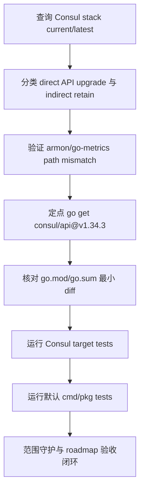

# dep-coordinator-consul-stack design

## 0. 术语约定

- **Consul coordinator stack**：本 feature 覆盖的 Go module 组：`github.com/hashicorp/consul/api` 以及 roadmap 列出的 Consul/HashiCorp 相关 indirect 依赖链；代码使用面是 `pkg/models/consul` 对 `github.com/hashicorp/consul/api` 的直接 import。
- **Consul API direct module**：`github.com/hashicorp/consul/api`。它是本仓库生产代码直接 import 的唯一 Consul module，不是 `github.com/hashicorp/consul` server 主模块，也不是 `github.com/hashicorp/consul/sdk`。
- **Parent-driven indirect**：indirect module 不单独追 `@latest`，而是随父 direct module `github.com/hashicorp/consul/api` 的 `go.mod` 自然收敛。父模块未要求更新时，本 feature 默认保留。
- **Path-mismatch retain**：`github.com/armon/go-metrics@v0.5.4` 的 `.mod` 声明路径是 `github.com/hashicorp/go-metrics`，不能作为旧 path 同路径升级目标。
- **Minimal module diff**：只让 `go.mod` 的 `github.com/hashicorp/consul/api` 版本声明和 `go.sum` 的目标版本 checksum 变化；不运行无目标全量 `go mod tidy`，不重排依赖块。

防冲突结论：代码和 CodeStable 文档中已有 `Consul Go API`、`Coordinator / Store`、`Go module manifest`、`Minimal module diff` 等术语。本 design 沿用既有叫法，并明确本条不引入 Consul server 主模块，也不迁移到 `github.com/hashicorp/go-metrics`。

## 1. 决策与约束

### 需求摘要

本 feature 要把 `go.mod` 中 direct `github.com/hashicorp/consul/api` 从 `v1.34.2` 升级到 `v1.34.3`，并逐个确认 roadmap 覆盖的 Consul/HashiCorp indirect 依赖链是否需要跟随升级。结论是：只升级 direct Consul API；其余 indirect 保留当前版本，因为 `consul/api v1.34.3` 自身仍要求当前 indirect 版本，强行升级会超出 parent-driven 策略，其中 `github.com/armon/go-metrics@v0.5.4` 还存在 module path mismatch。

服务对象是维护 Codis Consul coordinator/Jodis 后端和 Go modules 构建入口的人。成功标准是：`go.mod/go.sum` 只出现 Consul API 的最小机械变化；Consul KV、Session、blocking query 和 coordinator/Jodis 编译面不出现可观察回归；`go test ./pkg/models/consul ./pkg/models ./cmd/dashboard ./cmd/proxy ./cmd/admin ./cmd/fe` 与 `go test ./cmd/... ./pkg/...` 通过。

明确不做：

- 不引入 `github.com/hashicorp/consul` server 主模块。
- 不引入 `github.com/hashicorp/go-metrics`，不把 `github.com/armon/go-metrics` 迁移到新 module path。
- 不强行把 indirect module 升到其独立 `@latest`，除非 `consul/api@v1.34.3` 自然要求。
- 不修改 `pkg/models/consul` 源码、`models.Client`、`models.NewClient`、dashboard/proxy/admin/fe coordinator 参数或配置语义。
- 不改变 Consul KV key 转换、`Create` CAS、`List` prefix、`WatchInOrder` blocking query、Session/KV Acquire、Session renew 或 auth token 语义。
- 不修改 Zookeeper、Etcd、filesystem coordinator 后端。
- 不升级 Redis client、Martini、RDB parser、metrics 上报、jemalloc 或其他 roadmap 子 feature module。
- 不升级 Go toolchain，不改变 `go 1.26.1` module directive。
- 不运行无目标全量 `go mod tidy`，不生成 `vendor/`、`Godeps/` 或 `vendor/modules.txt`。
- 不修改 `extern/redis-8.6.3/`、Docker、部署脚本、前端资源或配置模板。

### 复杂度档位

按“项目内部依赖维护”默认档位走，偏离如下：

- Compatibility = backward-compatible：Consul coordinator 的 KV、Session、watch、auth token 和 `models.Client` 调用方不能变化。
- Dependency policy = parent-driven：indirect module 独立 `@latest` 不等于必须升级；以 `consul/api@v1.34.3` 的 module graph 和 target tests 为准。
- Determinism = reproducible：目标版本和 checksum 必须来自 `GOPROXY=https://proxy.golang.org,direct go list -m ...` 与定点 `go get`，不能依赖本地 cache。
- Testability = verified：本组直接挂在 `pkg/models/consul` 和 coordinator 参数入口，必须覆盖目标包测试和默认 cmd/pkg 测试。

### 关键决策

1. **只对 `github.com/hashicorp/consul/api` 执行 direct-go-get**。
   - 依据：2026-06-04 查询 `go list -m -u -json github.com/hashicorp/consul/api`，当前 `v1.34.2`，Update 为 `v1.34.3`。
   - 临时 detached worktree 试跑 `go get github.com/hashicorp/consul/api@v1.34.3` 后，diff 仅包含 `go.mod` 一行和 `go.sum` 两条 checksum；target test 与默认 cmd/pkg test 均通过。

2. **roadmap 覆盖的 indirect module 逐个确认，但不强行独立升级**。
   - 依据：`github.com/hashicorp/consul/api@v1.34.3.mod` 仍要求 `mapstructure/v2 v2.4.0`、`go-hclog v1.5.0`、`serf v0.10.1`、`golang.org/x/exp v0.0.0-20260218203240-3dfff04db8fa` 等当前版本；独立追 `@latest` 不是 parent-driven 收敛。
   - 取舍：本仓库注意事项要求不要顺手现代化 Go 依赖；roadmap 本条覆盖这些 module 是为了确认边界，不等价于无条件提升所有 indirect。

3. **`github.com/armon/go-metrics` 保留旧 path 当前版本**。
   - 依据：临时试跑 `go get github.com/armon/go-metrics@v0.5.4` 失败，错误为 module declares its path as `github.com/hashicorp/go-metrics` but was required as `github.com/armon/go-metrics`。`/Users/liyiming/go/pkg/mod/cache/download/github.com/armon/go-metrics/@v/v0.5.4.mod` 也显示 `module github.com/hashicorp/go-metrics`。
   - 取舍：迁移到 `github.com/hashicorp/go-metrics` 会改变 module identity；本条不做。

4. **不升级 `github.com/hashicorp/serf` 到 `v0.10.2`**。
   - 依据：`serf v0.10.2` 的 module graph 会引入 `github.com/hashicorp/go-metrics v0.5.4` 以及额外 checksum；`consul/api@v1.34.3` 仍要求 `serf v0.10.1`。
   - 取舍：Serf 独立升级应作为另一个明确依赖迁移决策处理，不混入 Consul API patch 升级。

5. **不通过全量 `go mod tidy` 收口**。
   - 依据：项目注意事项明确禁止无目标全量 tidy；Consul API-only 试跑已经给出最小 diff。

### 前置依赖

roadmap 条目 `dep-coordinator-consul-stack` 依赖 `dep-network-core-stack`，当前已为 `done`。本 design 启动后将 roadmap item 改为 `in-progress`，并写入 feature 目录名。

## 2. 名词与编排

### 2.1 名词层

#### module_set

| module | scope | current | latest query | target | mode |
|---|---:|---|---|---|---|
| `github.com/hashicorp/consul/api` | direct | `v1.34.2` | `v1.34.3` | `v1.34.3` | direct-go-get |
| `github.com/armon/go-metrics` | indirect | `v0.4.1` | `v0.5.4` path mismatch | `v0.4.1` | retain-with-note |
| `github.com/fatih/color` | indirect | `v1.16.0` | `v1.19.0` | `v1.16.0` | parent-driven retain |
| `github.com/go-viper/mapstructure/v2` | indirect | `v2.4.0` | `v2.5.0` | `v2.4.0` | parent-driven retain |
| `github.com/hashicorp/errwrap` | indirect | `v1.1.0` | same | `v1.1.0` | retain-with-note |
| `github.com/hashicorp/go-cleanhttp` | indirect | `v0.5.2` | same | `v0.5.2` | retain-with-note |
| `github.com/hashicorp/go-hclog` | indirect | `v1.5.0` | `v1.6.3` | `v1.5.0` | parent-driven retain |
| `github.com/hashicorp/go-immutable-radix` | indirect | `v1.3.1` | same | `v1.3.1` | retain-with-note |
| `github.com/hashicorp/go-multierror` | indirect | `v1.1.1` | same | `v1.1.1` | retain-with-note |
| `github.com/hashicorp/go-rootcerts` | indirect | `v1.0.2` | same | `v1.0.2` | retain-with-note |
| `github.com/hashicorp/golang-lru` | indirect | `v0.5.4` | `v1.0.2` | `v0.5.4` | parent-driven retain |
| `github.com/hashicorp/serf` | indirect | `v0.10.1` | `v0.10.2` | `v0.10.1` | parent-driven retain |
| `github.com/mattn/go-colorable` | indirect | `v0.1.13` | `v0.1.15` | `v0.1.13` | parent-driven retain |
| `github.com/mattn/go-isatty` | indirect | `v0.0.20` | `v0.0.22` | `v0.0.20` | parent-driven retain |
| `github.com/mitchellh/go-homedir` | indirect | `v1.1.0` | same | `v1.1.0` | retain-with-note |
| `golang.org/x/exp` | indirect | `v0.0.0-20260218203240-3dfff04db8fa` | `v0.0.0-20260603202125-055de637280b` | `v0.0.0-20260218203240-3dfff04db8fa` | parent-driven retain |

#### 现状

- `pkg/models/consul/consulclient.go` 直接 import `github.com/hashicorp/consul/api`，并用 KV、Session 和 blocking query 实现 `models.Client`。
- `pkg/models/client.go` 在 `NewClient` 中通过 `"consul"` 分支返回 `consulclient.New(addrlist, auth, timeout)`。
- `go.mod` direct require `github.com/hashicorp/consul/api v1.34.2`，并显式保留一组被 module graph 触达的 indirect。

#### 变化

- `go.mod` 中 `github.com/hashicorp/consul/api` 升级到 `v1.34.3`。
- `go.sum` 新增 `github.com/hashicorp/consul/api v1.34.3` content 和 go.mod checksum。
- 其余 roadmap 覆盖 module 保持当前版本并在验收中记录原因。
- 不引入 `github.com/hashicorp/consul` 主模块或 `github.com/hashicorp/go-metrics`。

示例：

```diff
- github.com/hashicorp/consul/api v1.34.2
+ github.com/hashicorp/consul/api v1.34.3
```

### 2.2 编排层



#### 现状

- 当前 Consul coordinator 只依赖 `github.com/hashicorp/consul/api`，调用方只依赖 `models.Client` 抽象。
- `go list -m -u -json` 显示 direct Consul API 有 patch 更新，多个 indirect 有独立更新。
- 临时 detached worktree 证明 API-only 升级是最小可通过路径；强行升级 `armon/go-metrics` 失败，强行升级 `serf` 会引入新 module path。

#### 变化

- implement 阶段重新查询版本后执行定点 `go get github.com/hashicorp/consul/api@v1.34.3`。
- target test gate 覆盖 `go test ./pkg/models/consul ./pkg/models ./cmd/dashboard ./cmd/proxy ./cmd/admin ./cmd/fe`。
- 默认 test gate 覆盖 `go test ./cmd/... ./pkg/...`。

流程级约束：

- **错误语义**：任何 test 失败先判断是 Consul API 兼容、module graph 还是既有环境问题；不得用全量 tidy、引入 Consul 主模块或改 coordinator 语义掩盖。
- **幂等性**：重复执行定点 `go get` 和验收命令不应继续改动 `go.mod/go.sum`，也不生成 vendor/Godeps。
- **兼容性**：Consul KV、Session、blocking query、auth token、Jodis ephemeral 和 `models.Client` 方法语义不变。
- **可观测点**：`go list`、`go mod why`、`go list -deps`、`git diff -- go.mod go.sum`、target test、默认 test、`git status`。

### 2.3 挂载点

- `go.mod` 中 `github.com/hashicorp/consul/api` direct require：删除或回退后，Consul API patch 升级消失。
- `go.sum` 中目标 Consul API checksum：删除后 clean checkout 解析目标版本的 lockfile 证据消失。
- `pkg/models/consul/consulclient.go` 的 `github.com/hashicorp/consul/api` import：这是本 feature 证明升级覆盖 Consul coordinator 使用面的代码挂载点。
- target test gate：证明 Consul coordinator/Jodis 相关编译面仍可通过。
- roadmap item：记录本合并子 feature 完成，不让后续重复推进同一组 module。

拔除方式：回退 `go.mod` Consul API 版本并删除目标 checksum 后，依赖升级在系统视角消失；再移除本 feature spec/acceptance 和 roadmap done 状态即可回到升级前规划状态。

### 2.4 推进策略

1. **版本调查复核**：重新执行 `go list -m -u -json`、`go list -m -json @latest` 覆盖 module_set。
   - 退出信号：Consul API 目标仍是 `v1.34.3`；indirect 版本分类与 design 一致；`armon/go-metrics` path mismatch 仍可复核。
2. **依赖触达和策略分类**：执行 `go mod why -m` 与 `go list -deps ./cmd/... ./pkg/...`。
   - 退出信号：Consul stack 经 `pkg/models/consul -> github.com/hashicorp/consul/api` 被默认 cmd/pkg 路径触达；`github.com/hashicorp/go-metrics` 不在 API-only graph。
3. **module manifest 定点升级**：执行 `GOPROXY=https://proxy.golang.org,direct go get github.com/hashicorp/consul/api@v1.34.3`。
   - 退出信号：`go.mod` 只把 `github.com/hashicorp/consul/api` 改到目标版本；`go 1.26.1` 和 `jemalloc-go` replace 保留。
4. **checksum 与依赖图收口**：核对 `go.sum`、module graph 和导入路径。
   - 退出信号：`go.sum` 只新增 Consul API 目标版本 content/go.mod checksum；没有无关 module churn；不引入 Consul server 主模块或 `hashicorp/go-metrics`。
5. **Consul target 测试**：运行 `go test ./pkg/models/consul ./pkg/models ./cmd/dashboard ./cmd/proxy ./cmd/admin ./cmd/fe`。
   - 退出信号：Consul client 包、models 工厂和使用 coordinator/Jodis 参数的 cmd 入口均编译测试通过。
6. **默认构建测试闭环**：运行 `go test ./cmd/... ./pkg/...`。
   - 退出信号：默认 cmd/pkg 测试通过，不报 module version、vendor mode 或 API 不兼容错误。
7. **范围守护与临时产物清理**：核对最终 diff、vendor/Godeps 和 roadmap 文档状态。
   - 退出信号：diff 仅包含 `go.mod`、`go.sum`、本 feature spec 和 roadmap 状态；无 Go 源码、配置、部署、extern、vendor/Godeps 或无关 module churn。

### 2.5 结构健康度与微重构

compound 检索：本次不命中与 Consul dependency upgrade 直接冲突的 compound decision；沿用 `.codestable/attention.md` 中“不要全量 go mod tidy”和“不顺手现代化 Go 依赖”的项目约束。

文件级：

- `go.mod`：职责单一，本次只改一条 direct require，不需要重排 require block。
- `pkg/models/consul/consulclient.go`：职责集中在 Consul `models.Client` 实现；本次不新增函数或分支，不需要拆文件。
- `pkg/models/client.go`：只做 coordinator 工厂分发；本次不改。

目录级：

- `pkg/models/consul/` 当前结构稳定，本次不新增文件。
- 仓库根目录的 `go.mod/go.sum` 是既有标准入口，本次不新增根目录文件。

结论：本次不做微重构。原因：本 feature 是依赖 manifest 定点升级和 indirect 边界确认，不在代码中追加逻辑；拆分 Consul client、改变 Session/Watch 抽象或重组 coordinator 目录都会扩大为行为/架构改造。

## 3. 验收契约

关键场景：

- **S1**：执行 `go list -m -u -json github.com/hashicorp/consul/api`。期望：当前 `v1.34.2`，Update 为 `v1.34.3`。
- **S2**：执行 `go list -m -json github.com/hashicorp/consul/api@latest`。期望：`@latest` 等于 `v1.34.3`。
- **S3**：复核 `github.com/armon/go-metrics@v0.5.4.mod`。期望：module path mismatch 被记录，本 feature 不迁移。
- **S4**：执行 `go mod why -m` 覆盖 Consul stack 关键 module。期望：`consul/api` 和 retained indirect 可追溯到 `pkg/models/consul`；`github.com/hashicorp/go-metrics` 不被 API-only graph 需要。
- **S5**：执行 `go list -deps ./cmd/... ./pkg/...` 并 grep Consul stack。期望：默认 cmd/pkg 仍触达 `github.com/hashicorp/consul/api` 和当前 retained indirect。
- **S6**：定点 `go get` 后检查 `go.mod`。期望：只有 `github.com/hashicorp/consul/api` 改到目标版本；`go 1.26.1` 和 `replace github.com/spinlock/jemalloc-go => ./third_party/jemalloc-go` 不变。
- **S7**：检查 `go.sum` diff。期望：只新增 Consul API 目标版本 content/go.mod checksum；不出现额外 module 大量 churn。
- **S8**：运行 `go test ./pkg/models/consul ./pkg/models ./cmd/dashboard ./cmd/proxy ./cmd/admin ./cmd/fe`。期望：通过。
- **S9**：运行 `go test ./cmd/... ./pkg/...`。期望：通过。
- **S10**：重复验收后查看 `git status --short --untracked-files=all`。期望：不生成 `vendor/`、`Godeps/`、`vendor/modules.txt` 或仓库内临时构建产物。

反向核对项：

- Diff 不应引入 `github.com/hashicorp/consul` server 主模块、`github.com/hashicorp/consul/sdk` direct require 或 `github.com/hashicorp/go-metrics`。
- Diff 不应修改 `pkg/models/consul` 源码、`models.Client`、`models.NewClient`、dashboard/proxy/admin/fe coordinator 参数、配置模板或文档中的 coordinator 语义。
- Diff 不应修改 Zookeeper、Etcd、filesystem coordinator 后端。
- Diff 不应升级 Redis client、Martini、RDB parser、metrics 上报、jemalloc 或其他 roadmap 子 feature module。
- Diff 不应运行全量 tidy 造成无关 module churn。

## 4. 与项目级架构文档的关系

本 feature 不新增运行期能力，不改变 `Coordinator / Store` 抽象、Consul 后端语义、Go module manifest 契约或 requirement 用户故事。acceptance 阶段应回写 roadmap item 为 `done`。默认不需要更新 `.codestable/architecture/ARCHITECTURE.md` 或 requirement 文档，除非实现阶段发现 Consul API 升级迫使 coordinator API、构建契约或注意事项发生结构变化。
