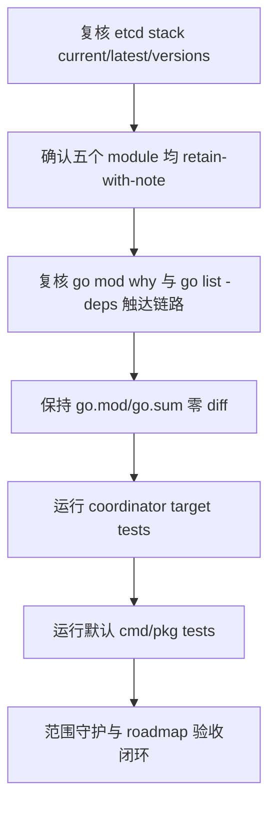

# dep-coordinator-etcd-stack design

## 0. 术语约定

- **Etcd coordinator stack**：本 feature 覆盖的 Go module 组：`github.com/coreos/etcd`、`github.com/coreos/go-semver`、`github.com/json-iterator/go`、`github.com/modern-go/concurrent`、`github.com/modern-go/reflect2`，以及本仓库 `pkg/models/etcd` 对 `github.com/coreos/etcd/client` 的直接使用。
- **旧 etcd client path**：`github.com/coreos/etcd/client`。它是当前代码的 import path，不等同于现代 `go.etcd.io/etcd/*` module path。
- **retain-with-note**：`@latest` 等于当前版本时，记录当前已是 Go 工具解析出的最新版本，不为了“有动作”而改 `go.mod/go.sum`。
- **Zero module diff**：本 feature 的正确 manifest 结果是 `go.mod/go.sum` 无依赖版本变化；如果出现 diff，必须先解释来源，不能用全量 `go mod tidy` 收口。

防冲突结论：代码和 CodeStable 文档中已有 `Coordinator / Store`、`Go module manifest`、`retain-with-note`、`vendor/Godeps` 等术语。本 design 沿用既有叫法，并明确 `Etcd coordinator stack` 只指旧 `github.com/coreos/etcd/client` 栈，不指 Consul/Zookeeper 后端或现代 etcd module path 迁移。

## 1. 决策与约束

### 需求摘要

本 feature 要确认 `go.mod` 中旧 `github.com/coreos/etcd` client 栈是否存在同路径可行升级。2026-06-04 复核结果是：五个覆盖 module 的 `@latest` 均等于当前版本，因此本条不做依赖版本变更，改为把“保留当前同路径最新版本”的决策和验证证据落档。

服务对象是维护 Codis coordinator 后端和 Go modules 构建入口的人。成功标准是：`go.mod/go.sum` 不出现 etcd stack 版本 churn；`pkg/models/etcd` 继续通过旧 `github.com/coreos/etcd/client` 编译；coordinator 相关目标包测试与默认 `go test ./cmd/... ./pkg/...` 通过；roadmap 明确现代 etcd path 迁移不属于本条。

明确不做：

- 不迁移 `github.com/coreos/etcd/client` 到 `go.etcd.io/etcd/*`。
- 不修改 `pkg/models.Client` 接口、`models.NewClient("etcd", ...)` 分支、dashboard/proxy/admin/fe coordinator 参数或配置语义。
- 不改 Etcd coordinator 的 `Mkdir`、`Create`、`Update`、`Delete`、`Read`、`List`、`WatchInOrder`、ephemeral 节点和 auth 解析行为。
- 不修改 Zookeeper、filesystem、Consul coordinator 后端。
- 不升级 Redis client、Martini、Zookeeper、Consul、RDB analysis、metrics、jemalloc 或其他 roadmap 子 feature 覆盖的 module。
- 不升级 Go toolchain，不改变 `go 1.26.1` module directive。
- 不运行无目标全量 `go mod tidy`，不生成 `vendor/`、`Godeps/` 或 `vendor/modules.txt`。
- 不修改 `extern/redis-8.6.3/`、Docker、部署脚本、前端资源或配置模板。

### 复杂度档位

按“项目内部依赖维护”默认档位走，偏离如下：

- Compatibility = backward-compatible：etcd coordinator 的外部配置、auth 格式、watch/ephemeral 语义和 `models.Client` 调用方不能变化。
- Determinism = reproducible：保留或升级判断必须来自 `GOPROXY=https://proxy.golang.org,direct go list -m ...`，不能凭本地 module cache。
- Testability = verified：coordinator 相关依赖必须至少覆盖 `pkg/models/etcd`、`pkg/models` 和使用 coordinator 参数的 cmd 入口编译测试，再跑默认 cmd/pkg 测试。

### 关键决策

1. **五个 module 全部 `retain-with-note`，不改 `go.mod/go.sum`**。
   - 依据：2026-06-04 执行 `go list -m -u -json` 和 `go list -m -json <module>@latest`，`github.com/coreos/etcd v3.3.27+incompatible`、`github.com/coreos/go-semver v0.3.1`、`github.com/json-iterator/go v1.1.12`、`github.com/modern-go/concurrent v0.0.0-20180306012644-bacd9c7ef1dd`、`github.com/modern-go/reflect2 v1.0.2` 均无 `Update` 且 `@latest` 等于当前版本。
   - 取舍：没有目标版本时强行 `go get` 只会制造无意义 churn；本条的实际产出是保留决策、验证证据和 roadmap 状态闭环。

2. **不迁移到现代 etcd module path**。
   - 依据：roadmap 第 2 节和第 7 节已明确现代 etcd client 是 coordinator 后端迁移，不是同路径版本升级；当前代码直接 import `github.com/coreos/etcd/client` 于 `pkg/models/etcd/etcdclient.go:13`。
   - 取舍：现代 path 迁移会改变 module identity、API、错误类型、watch/lease 语义和可能的 etcd server 兼容边界，应另起 roadmap/feature。

3. **保留 `github.com/coreos/etcd v3.3.27+incompatible` 的历史编译理由**。
   - 依据：`.codestable/compound/2026-05-12-learning-go-mod-legacy-vendor-pitfalls.md` 记录旧 `etcd v3.0.17+incompatible` 搭配现代 `ugorji/go` 会因 generated codec helper 编译失败；当前 `v3.3.27+incompatible` 是为了保留旧 client import path 同时兼容现代 Go module 编译。
   - 取舍：本 feature 不回退、不降级，也不把历史编译绕过策略当作可清理对象。

4. **目标验证覆盖 coordinator 编译面，而不是只看 module query**。
   - 依据：`go mod why -m` 显示五个 module 均经 `pkg/models/etcd -> github.com/coreos/etcd/client` 被默认 cmd/pkg 路径触达；`go list -deps ./cmd/... ./pkg/...` 也命中这些 module。
   - 取舍：即使 manifest 零 diff，也必须证明旧 etcd client 栈仍在默认构建路径中可解析、可编译。

5. **不通过全量 `go mod tidy` 收口**。
   - 依据：项目注意事项和历史 learning 均记录全量 tidy 会扫描超出当前验收范围的 build tags 和依赖测试链路。

### 前置依赖

roadmap 条目 `dep-coordinator-etcd-stack` 没有 `depends_on`，启动前状态为 `planned`。本 design 启动后将 roadmap item 改为 `in-progress`，并写入 feature 目录名。

## 2. 名词与编排

### 2.1 名词层

#### module_set

| module | scope | current | latest query | current source | reachability |
|---|---:|---|---|---|---|
| `github.com/coreos/etcd` | direct | `v3.3.27+incompatible` | same | `go.mod:7` | `pkg/models/etcd` direct import |
| `github.com/coreos/go-semver` | indirect | `v0.3.1` | same | `go.mod:34` | `github.com/coreos/etcd/version` |
| `github.com/json-iterator/go` | indirect | `v1.1.12` | same | `go.mod:45` | `github.com/coreos/etcd/client` |
| `github.com/modern-go/concurrent` | indirect | `v0.0.0-20180306012644-bacd9c7ef1dd` | same | `go.mod:50` | `json-iterator/go` |
| `github.com/modern-go/reflect2` | indirect | `v1.0.2` | same | `go.mod:51` | `github.com/coreos/etcd/client` / `json-iterator/go` |

```text
module_set:
  - module_path: github.com/coreos/etcd
    current_version: v3.3.27+incompatible
    target_version: v3.3.27+incompatible
    scope: direct
    replace_path: null
    upgrade_mode: retain-with-note
  - module_path: github.com/coreos/go-semver
    current_version: v0.3.1
    target_version: v0.3.1
    scope: indirect
    replace_path: null
    upgrade_mode: retain-with-note
  - module_path: github.com/json-iterator/go
    current_version: v1.1.12
    target_version: v1.1.12
    scope: indirect
    replace_path: null
    upgrade_mode: retain-with-note
  - module_path: github.com/modern-go/concurrent
    current_version: v0.0.0-20180306012644-bacd9c7ef1dd
    target_version: v0.0.0-20180306012644-bacd9c7ef1dd
    scope: indirect
    replace_path: null
    upgrade_mode: retain-with-note
  - module_path: github.com/modern-go/reflect2
    current_version: v1.0.2
    target_version: v1.0.2
    scope: indirect
    replace_path: null
    upgrade_mode: retain-with-note
```

#### 现状

- `pkg/models/etcd/etcdclient.go` 直接 import `github.com/coreos/etcd/client`，并把它封装成 `models.Client` 所需的 CRUD、watch 和 ephemeral 节点方法。
- `pkg/models/client.go` 在 `NewClient` 中通过 `"etcd"` 分支返回 `etcdclient.New(addrlist, auth, timeout)`。
- `go.mod` direct require `github.com/coreos/etcd v3.3.27+incompatible`，并显式保留四个被默认构建路径触达的 indirect module。

#### 变化

- `module_set` 全部记录为 `retain-with-note`，`go.mod/go.sum` 不做版本变更。
- 验收证据从“升级 diff”变成“版本查询、触达链路、target test、默认 test、零 diff 守护”。
- 现代 etcd path 迁移继续保留在 roadmap 观察项，不进入本 feature。

示例：

```text
输入：go list -m -json github.com/coreos/etcd@latest
输出：Version = v3.3.27+incompatible
期望处理：go.mod 保持 github.com/coreos/etcd v3.3.27+incompatible，不执行 path 迁移
```

### 2.2 编排层



#### 现状

- 当前 etcd coordinator 使用旧 `github.com/coreos/etcd/client` API；调用方只依赖 `models.Client` 抽象。
- `go list -m -u -json` 显示本组 module 没有同路径更新目标。
- 历史 learning 已记录 `etcd v3.3.27+incompatible` 不是随意现代化，而是为 modern Go 编译保留旧 client import path 的最小可编译版本。

#### 变化

- implement 阶段先重新查询版本，若 `@latest` 仍等于当前版本，则不运行升级型 `go get`，只做保留确认。
- target test gate 覆盖 `go test ./pkg/models/etcd ./pkg/models ./cmd/dashboard ./cmd/proxy ./cmd/admin ./cmd/fe`。
- 默认 test gate 覆盖 `go test ./cmd/... ./pkg/...`。
- 如果未来查询结果发生变化，先回到 design 更新 `module_set` 和风险判断，不在 implement 中临时决定升级。

流程级约束：

- **错误语义**：任何 test 失败先判断是旧 etcd client API、module graph 还是既有环境问题；不得用全量 tidy、path 迁移或改 coordinator 语义掩盖。
- **幂等性**：重复执行版本查询、target test 和默认 test 后，`go.mod/go.sum` 应保持零 diff，不生成 vendor/Godeps。
- **兼容性**：dashboard/proxy/admin/fe 的 `--etcd`、`--etcd-auth`、config coordinator 字段和 `models.Client` 方法语义不变。
- **可观测点**：`go list`、`go mod why`、`go list -deps`、target test、默认 test、`git diff -- go.mod go.sum`、`git status`。

### 2.3 挂载点

- `go.mod` 中 `github.com/coreos/etcd` direct require：删除或改动后，旧 etcd coordinator module identity 消失。
- `go.mod` 中 `github.com/coreos/go-semver`、`github.com/json-iterator/go`、`github.com/modern-go/concurrent`、`github.com/modern-go/reflect2` indirect require：删除或改动后，本 feature 对 etcd client 依赖链的显式保留边界消失。
- `pkg/models/etcd/etcdclient.go` 的 `github.com/coreos/etcd/client` import：这是本 feature 证明旧 client path 保留的代码挂载点。
- target test gate：证明 coordinator 相关编译面仍可通过。
- roadmap item：记录本合并子 feature 完成，不让后续重复推进同一组 module。

拔除方式：若要撤销本 feature 的系统视角影响，应移除本 feature spec/acceptance 和 roadmap done 状态；由于本条不改依赖版本，`go.mod/go.sum` 无需回退。

### 2.4 推进策略

1. **版本调查复核**：重新执行 `go list -m -u -json`、`go list -m -json @latest`、`go list -m -versions -json` 覆盖五个 module。
   - 退出信号：五个 module 的 `@latest` 仍等于当前版本；`github.com/modern-go/concurrent` 无 tagged `Versions` 列表但 `@latest` 为当前 pseudo version。
2. **依赖触达和策略分类**：执行 `go mod why -m` 与 `go list -deps ./cmd/... ./pkg/...`。
   - 退出信号：五个 module 均经 `pkg/models/etcd -> github.com/coreos/etcd/client` 或其子依赖触达；策略均为 `retain-with-note`。
3. **module manifest 保留确认**：不执行升级型 `go get`，核对 `git diff -- go.mod go.sum`。
   - 退出信号：`go.mod/go.sum` 对本 feature 保持零 diff，`go 1.26.1` 和 `jemalloc-go` replace 保留。
4. **coordinator target 测试**：运行 `go test ./pkg/models/etcd ./pkg/models ./cmd/dashboard ./cmd/proxy ./cmd/admin ./cmd/fe`。
   - 退出信号：etcd client 包、models 工厂和使用 coordinator 参数的 cmd 入口均编译测试通过。
5. **默认构建测试闭环**：运行 `go test ./cmd/... ./pkg/...`。
   - 退出信号：默认 cmd/pkg 测试通过，不报 module version、vendor mode 或 API 不兼容错误。
6. **范围守护与临时产物清理**：核对最终 diff、vendor/Godeps 和 roadmap 文档状态。
   - 退出信号：diff 仅包含本 feature spec 和 roadmap 状态；无 Go 源码、配置、部署、extern、vendor/Godeps 或无关 module churn。

### 2.5 结构健康度与微重构

compound 检索：

- `.codestable/tools/search-yaml.py --dir .codestable/compound --query "etcd coordinator dependency go module go.mod go.sum"` 无直接匹配；`rg` 命中 `.codestable/compound/2026-05-12-learning-go-mod-legacy-vendor-pitfalls.md`，其中 etcd 历史编译坑已纳入关键决策。
- `.codestable/tools/search-yaml.py --dir .codestable/compound --query "目录组织 文件归属 命名约定 go.mod dependency module coordinator"` 无匹配文档。

文件级：

- `go.mod`：职责单一，当前只需要确认五个 module 保留，不需要重排 require block。
- `pkg/models/etcd/etcdclient.go`：已有 340 行左右，职责集中在 etcd `models.Client` 实现；本次不新增函数或分支，不需要拆文件。
- `pkg/models/client.go`：只做 coordinator 工厂分发；本次不改。

目录级：

- `pkg/models/etcd/` 当前只有 `etcdclient.go`，没有新文件落点压力。
- 仓库根目录的 `go.mod/go.sum` 是既有标准入口，本次不新增根目录文件。

结论：本次不做微重构。原因：本 feature 是依赖栈保留确认和验证闭环，不在代码中追加逻辑；拆分 `etcdclient.go`、迁移现代 etcd API 或重组 coordinator 目录都会扩大为行为/架构改造，不是当前依赖升级条目的前置条件。

## 3. 验收契约

关键场景：

- **S1**：执行 `go list -m -u -json` 覆盖五个 module。期望：均无 `Update` 字段，当前版本等于 roadmap 版本矩阵记录。
- **S2**：执行 `go list -m -json <module>@latest` 覆盖五个 module。期望：`@latest` 均等于当前版本，全部策略为 `retain-with-note`。
- **S3**：执行 `go list -m -versions -json` 覆盖五个 module。期望：`etcd` 最新 tagged 同路径版本为 `v3.3.27+incompatible`，`go-semver` 为 `v0.3.1`，`json-iterator/go` 为 `v1.1.12`，`reflect2` 为 `v1.0.2`；`modern-go/concurrent` 无 tagged versions 但当前 pseudo 是 `@latest`。
- **S4**：执行 `go mod why -m` 覆盖五个 module。期望：均可追溯到 `pkg/models/etcd` 和 `github.com/coreos/etcd/client` 依赖链。
- **S5**：执行 `go list -deps ./cmd/... ./pkg/...` 并 grep etcd stack。期望：默认 cmd/pkg 仍触达五个 module。
- **S6**：检查 `git diff -- go.mod go.sum`。期望：零 diff；不修改 `go 1.26.1` 和 `replace github.com/spinlock/jemalloc-go => ./third_party/jemalloc-go`。
- **S7**：运行 `go test ./pkg/models/etcd ./pkg/models ./cmd/dashboard ./cmd/proxy ./cmd/admin ./cmd/fe`。期望：通过。
- **S8**：运行 `go test ./cmd/... ./pkg/...`。期望：通过。
- **S9**：重复验收后查看 `git status --short --untracked-files=all`。期望：不生成 `vendor/`、`Godeps/`、`vendor/modules.txt` 或仓库内临时构建产物。

反向核对项：

- Diff 不应迁移到 `go.etcd.io/etcd/*` 或修改 `pkg/models/etcd` 源码。
- Diff 不应修改 `models.Client`、`models.NewClient`、dashboard/proxy/admin/fe coordinator 参数、配置模板或文档中的默认 coordinator 语义。
- Diff 不应升级 Zookeeper、Consul、Redis client、RDB parser、metrics、jemalloc 或其他 roadmap 子 feature module。
- Diff 不应运行全量 tidy 造成无关 module churn。
- Diff 不应修改 `go 1.26.1` module directive、`third_party/jemalloc-go` replace、`extern/redis-8.6.3/`、Docker、部署脚本或前端资源。

## 4. 与项目级架构文档的关系

本 feature 不新增运行期能力，不改变 `Coordinator / Store` 抽象、Etcd 后端语义、Go module manifest 契约或 requirement 用户故事。acceptance 阶段应回写 roadmap item 为 `done`。默认不需要更新 `.codestable/architecture/ARCHITECTURE.md` 或 requirement 文档，除非实现阶段发现 etcd 保留确认迫使 coordinator API、构建契约或注意事项发生结构变化。
