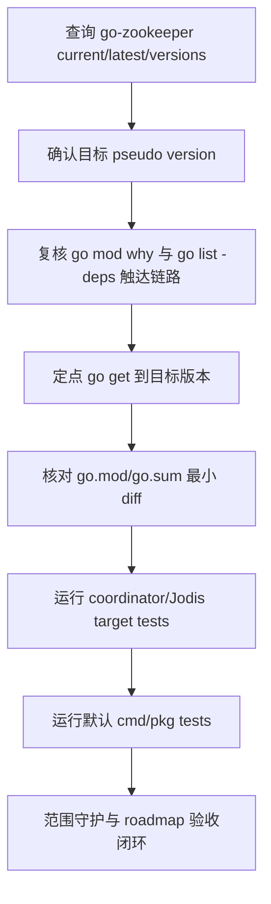

# dep-coordinator-zookeeper-stack design

## 0. 术语约定

- **Zookeeper coordinator stack**：本 feature 覆盖的 Go module `github.com/samuel/go-zookeeper`，以及本仓库 `pkg/models/zk` 对 `github.com/samuel/go-zookeeper/zk` 的直接使用。它不是 etcd、filesystem 或 Consul coordinator 后端。
- **Target pseudo version**：按 roadmap 第 4.1 节用 Go module query 查询到的 `@latest` pseudo version。本次目标是 `github.com/samuel/go-zookeeper v0.0.0-20201211165307-7117e9ea2414`。
- **Minimal module diff**：只让 `go.mod` 的 go-zookeeper 版本声明和 `go.sum` 的目标版本 checksum 变化；不运行无目标全量 `go mod tidy`，不重排依赖块。

防冲突结论：代码和 CodeStable 文档中已有 `Coordinator / Store`、`Jodis`、`Go module manifest`、`Minimal module diff`、`vendor/Godeps` 等术语。本 design 沿用既有叫法，并明确 `Zookeeper coordinator stack` 只指 `pkg/models/zk` 的 Go client 依赖，不指 coordinator 抽象本身或其他后端。

## 1. 决策与约束

### 需求摘要

本 feature 要把 `go.mod` 中 `github.com/samuel/go-zookeeper` 从 `v0.0.0-20161028232340-1d7be4effb13` 升级到 Go 工具解析出的 `@latest` pseudo version `v0.0.0-20201211165307-7117e9ea2414`，并验证 Zookeeper coordinator/Jodis 使用面仍可编译测试。

服务对象是维护 Codis coordinator 后端、Jodis proxy 发现和 Go modules 构建入口的人。成功标准是：`go.mod/go.sum` 只出现 go-zookeeper 的最小机械变化；`pkg/models/zk` 继续通过 `github.com/samuel/go-zookeeper/zk` 编译；coordinator 相关目标测试与默认 `go test ./cmd/... ./pkg/...` 通过。

明确不做：

- 不修改 `pkg/models.Client` 接口、`models.NewClient("zk"|"zookeeper", ...)` 分支、dashboard/proxy/admin/fe coordinator 参数或配置语义。
- 不改 Zookeeper coordinator 的 `Mkdir`、`Create`、`Update`、`Delete`、`Read`、`List`、`WatchInOrder`、ephemeral 节点、sequence 节点、digest auth 或 reconnect 逻辑。
- 不修改 etcd、filesystem、Consul coordinator 后端。
- 不把默认 coordinator 改成 Zookeeper，也不新增 Zookeeper 数据迁移、部署脚本或服务启动入口。
- 不升级 Redis client、Martini、etcd、Consul、RDB analysis、metrics、jemalloc 或其他 roadmap 子 feature 覆盖的 module。
- 不升级 Go toolchain，不改变 `go 1.26.1` module directive。
- 不运行无目标全量 `go mod tidy`，不生成 `vendor/`、`Godeps/` 或 `vendor/modules.txt`。
- 不修改 `extern/redis-8.6.3/`、Docker、部署脚本、前端资源或配置模板。

### 复杂度档位

按“项目内部依赖维护”默认档位走，偏离如下：

- Compatibility = backward-compatible：Zookeeper coordinator 的外部配置、auth 格式、watch/ephemeral/sequence 节点语义和 `models.Client` 调用方不能变化。
- Determinism = reproducible：目标版本和 checksum 必须来自 `GOPROXY=https://proxy.golang.org,direct go list -m ...` 与定点 `go get`，不能依赖本地 cache。
- Testability = verified：本组直接挂在 `pkg/models/zk` 和 coordinator 参数入口，必须覆盖目标包测试和默认 cmd/pkg 测试。

### 关键决策

1. **升级到旧 module path 的 `@latest` pseudo version**。
   - 依据：2026-06-04 执行 `go list -m -u -json github.com/samuel/go-zookeeper`，当前为 `v0.0.0-20161028232340-1d7be4effb13`，Update 为 `v0.0.0-20201211165307-7117e9ea2414`。
   - 命令形态：`GOPROXY=https://proxy.golang.org,direct go get github.com/samuel/go-zookeeper@v0.0.0-20201211165307-7117e9ea2414`。

2. **目标是 pseudo version，不声称存在 tagged release**。
   - 依据：`go list -m -versions -json github.com/samuel/go-zookeeper` 没有返回 `Versions` 列表；`@latest` 可解析到 2020-12-11 的 pseudo version。
   - 取舍：design、checklist 和 acceptance 均以 pseudo version 作为目标，不写“升级到 release”。

3. **不改 Zookeeper coordinator 代码语义**。
   - 依据：`pkg/models/zk/zkclient.go` 只依赖 `zk.Connect`、`SetLogger`、`AddAuth`、`Exists`、`Create`、`GetW`、`Set`、`Delete`、`Children`、`ChildrenW`、`ErrNoNode`、`ErrNodeExists`、`ErrNotEmpty`、ACL helper 和 flag 常量；临时 detached worktree 试跑定点升级后 target test 和默认 cmd/pkg 测试均通过。
   - 取舍：如运行期发现 watch/ACL/ephemeral 语义变化，应回到 design 分析，不在本 feature 中顺手重写 Zookeeper client。

4. **验收覆盖 Jodis/coordinator 编译面**。
   - 依据：`go mod why -m github.com/samuel/go-zookeeper` 追溯到 `pkg/models/zk -> github.com/samuel/go-zookeeper/zk`；`go list -deps ./cmd/... ./pkg/...` 命中同一 import path。dashboard/proxy/admin/fe 都能通过 coordinator 参数进入该抽象或读取 Jodis 配置。

5. **不通过全量 `go mod tidy` 收口**。
   - 依据：项目注意事项明确禁止无目标全量 tidy；临时 detached worktree 试跑定点 `go get` 只改变 `go.mod` 一行，并向 `go.sum` 新增 2 条目标 checksum。

### 前置依赖

roadmap 条目 `dep-coordinator-zookeeper-stack` 没有 `depends_on`，启动前状态为 `planned`。本 design 启动后将 roadmap item 改为 `in-progress`，并写入 feature 目录名。

## 2. 名词与编排

### 2.1 名词层

#### module_set

| module | scope | current | latest query | current source | reachability |
|---|---:|---|---|---|---|
| `github.com/samuel/go-zookeeper` | direct | `v0.0.0-20161028232340-1d7be4effb13` | `v0.0.0-20201211165307-7117e9ea2414` | `go.mod:20` | `pkg/models/zk` direct import |

```text
module_set:
  - module_path: github.com/samuel/go-zookeeper
    current_version: v0.0.0-20161028232340-1d7be4effb13
    target_version: v0.0.0-20201211165307-7117e9ea2414
    scope: direct
    replace_path: null
    upgrade_mode: direct-go-get
```

#### 现状

- `pkg/models/zk/zkclient.go` 直接 import `github.com/samuel/go-zookeeper/zk`，并把它封装成 `models.Client` 所需的 CRUD、watch 和 ephemeral/sequence 节点方法。
- `pkg/models/client.go` 在 `NewClient` 中通过 `"zk"` / `"zookeeper"` 分支返回 `zkclient.New(addrlist, auth, timeout)`。
- `go.mod` direct require `github.com/samuel/go-zookeeper v0.0.0-20161028232340-1d7be4effb13`。
- `go.sum` 已包含当前版本 content 和 go.mod checksum。

#### 变化

- `go.mod` 中 `github.com/samuel/go-zookeeper` 升级到 `v0.0.0-20201211165307-7117e9ea2414`。
- `go.sum` 新增目标 pseudo version content 和 go.mod checksum。
- `pkg/models/zk`、`models.Client`、cmd 参数、配置和文档语义不变。

示例：

```diff
- github.com/samuel/go-zookeeper v0.0.0-20161028232340-1d7be4effb13
+ github.com/samuel/go-zookeeper v0.0.0-20201211165307-7117e9ea2414
```

### 2.2 编排层



#### 现状

- 当前 Zookeeper coordinator 使用 `github.com/samuel/go-zookeeper/zk` API；调用方只依赖 `models.Client` 抽象。
- `go list -m -u -json` 显示存在同路径 pseudo version 更新目标。
- 临时 detached worktree 试跑定点升级后，diff 仅包含 `go.mod` 一行和 `go.sum` 两条 checksum；target test 和默认 test 通过。

#### 变化

- implement 阶段重新查询版本后执行定点 `go get`。
- target test gate 覆盖 `go test ./pkg/models/zk ./pkg/models ./cmd/dashboard ./cmd/proxy ./cmd/admin ./cmd/fe`。
- 默认 test gate 覆盖 `go test ./cmd/... ./pkg/...`。

流程级约束：

- **错误语义**：任何 test 失败先判断是 go-zookeeper API/行为不兼容、module graph 还是既有环境问题；不得用全量 tidy 或改 coordinator 语义掩盖。
- **幂等性**：重复执行定点 `go get` 和验收命令不应继续改动 `go.mod/go.sum`，也不生成 vendor/Godeps。
- **兼容性**：dashboard/proxy/admin/fe 的 `--zookeeper`、`--zookeeper-auth`、config coordinator 字段、Jodis 字段和 `models.Client` 方法语义不变。
- **可观测点**：`go list`、`go mod why`、`go list -deps`、`git diff -- go.mod go.sum`、target test、默认 test、`git status`。

### 2.3 挂载点

- `go.mod` 中 `github.com/samuel/go-zookeeper` direct require：删除或回退后，Zookeeper coordinator stack 的实际升级消失。
- `go.sum` 中目标 pseudo version checksum：删除后 clean checkout 解析目标版本的 lockfile 证据消失。
- `pkg/models/zk/zkclient.go` 的 `github.com/samuel/go-zookeeper/zk` import：这是本 feature 证明升级覆盖 Zookeeper client 使用面的代码挂载点。
- target test gate：证明 coordinator/Jodis 相关编译面仍可通过。
- roadmap item：记录本合并子 feature 完成，不让后续重复推进同一 module。

拔除方式：回退 `go.mod` go-zookeeper 版本并删除目标 checksum 后，依赖升级在系统视角消失；再移除本 feature spec/acceptance 和 roadmap done 状态即可回到升级前规划状态。

### 2.4 推进策略

1. **版本调查复核**：重新执行 `go list -m -u -json`、`go list -m -json @latest`、`go list -m -versions -json`。
   - 退出信号：目标仍是 `v0.0.0-20201211165307-7117e9ea2414`；versions 查询没有 tagged release 列表。
2. **依赖触达和策略分类**：执行 `go mod why -m` 与 `go list -deps ./cmd/... ./pkg/...`。
   - 退出信号：go-zookeeper 经 `pkg/models/zk -> github.com/samuel/go-zookeeper/zk` 被默认 cmd/pkg 路径触达。
3. **module manifest 定点升级**：执行 `GOPROXY=https://proxy.golang.org,direct go get github.com/samuel/go-zookeeper@v0.0.0-20201211165307-7117e9ea2414`。
   - 退出信号：`go.mod` 只把 go-zookeeper 改到目标版本；`go 1.26.1` 和 `jemalloc-go` replace 保留。
4. **checksum 与依赖图收口**：核对 `go.sum`、module graph 和导入路径。
   - 退出信号：`go.sum` 只新增目标 pseudo version content/go.mod checksum；没有无关 module churn；import path 未迁移。
5. **coordinator target 测试**：运行 `go test ./pkg/models/zk ./pkg/models ./cmd/dashboard ./cmd/proxy ./cmd/admin ./cmd/fe`。
   - 退出信号：Zookeeper client 包、models 工厂和使用 coordinator/Jodis 参数的 cmd 入口均编译测试通过。
6. **默认构建测试闭环**：运行 `go test ./cmd/... ./pkg/...`。
   - 退出信号：默认 cmd/pkg 测试通过，不报 module version、vendor mode 或 API 不兼容错误。
7. **范围守护与临时产物清理**：核对最终 diff、vendor/Godeps 和 roadmap 文档状态。
   - 退出信号：diff 仅包含 `go.mod`、`go.sum`、本 feature spec 和 roadmap 状态；无 Go 源码、配置、部署、extern、vendor/Godeps 或无关 module churn。

### 2.5 结构健康度与微重构

compound 检索：

- `.codestable/tools/search-yaml.py --dir .codestable/compound --query "zookeeper go-zookeeper coordinator dependency go module"` 无匹配文档。
- `.codestable/tools/search-yaml.py --dir .codestable/compound --query "目录组织 文件归属 命名约定 go.mod dependency module zookeeper"` 无匹配文档。

文件级：

- `go.mod`：职责单一，本次只改一条 direct require，不需要重排 require block。
- `pkg/models/zk/zkclient.go`：约 420 行，职责集中在 Zookeeper `models.Client` 实现；本次不新增函数或分支，不需要拆文件。
- `pkg/models/client.go`：只做 coordinator 工厂分发；本次不改。

目录级：

- `pkg/models/zk/` 当前只有 `zkclient.go`，没有新文件落点压力。
- 仓库根目录的 `go.mod/go.sum` 是既有标准入口，本次不新增根目录文件。

结论：本次不做微重构。原因：本 feature 是依赖 manifest 定点升级，不在代码中追加逻辑；拆分 `zkclient.go`、重写 reconnect/watch 逻辑或重组 coordinator 目录都会扩大为行为/架构改造，不是当前依赖升级条目的前置条件。

## 3. 验收契约

关键场景：

- **S1**：执行 `go list -m -u -json github.com/samuel/go-zookeeper`。期望：当前版本为 `v0.0.0-20161028232340-1d7be4effb13`，Update 目标为 `v0.0.0-20201211165307-7117e9ea2414`。
- **S2**：执行 `go list -m -json github.com/samuel/go-zookeeper@latest`。期望：`@latest` 等于目标 pseudo version。
- **S3**：执行 `go list -m -versions -json github.com/samuel/go-zookeeper`。期望：不声称 tagged release；目标来自 `@latest` pseudo version。
- **S4**：执行 `go mod why -m github.com/samuel/go-zookeeper`。期望：可追溯到 `pkg/models/zk -> github.com/samuel/go-zookeeper/zk`。
- **S5**：执行 `go list -deps ./cmd/... ./pkg/...` 并 grep go-zookeeper。期望：默认 cmd/pkg 仍触达 `github.com/samuel/go-zookeeper/zk`。
- **S6**：定点 `go get` 后检查 `go.mod`。期望：只有 `github.com/samuel/go-zookeeper` 改到目标版本；`go 1.26.1` 和 `replace github.com/spinlock/jemalloc-go => ./third_party/jemalloc-go` 不变。
- **S7**：检查 `go.sum` diff。期望：只新增目标 pseudo version content/go.mod checksum；不出现无关 module 大量 churn。
- **S8**：运行 `go test ./pkg/models/zk ./pkg/models ./cmd/dashboard ./cmd/proxy ./cmd/admin ./cmd/fe`。期望：通过。
- **S9**：运行 `go test ./cmd/... ./pkg/...`。期望：通过。
- **S10**：重复验收后查看 `git status --short --untracked-files=all`。期望：不生成 `vendor/`、`Godeps/`、`vendor/modules.txt` 或仓库内临时构建产物。

反向核对项：

- Diff 不应修改 `pkg/models/zk` 源码、`models.Client`、`models.NewClient`、dashboard/proxy/admin/fe coordinator 参数、配置模板或文档中的 coordinator 语义。
- Diff 不应修改 etcd、filesystem、Consul coordinator 后端。
- Diff 不应升级 Redis client、Martini、etcd、Consul、RDB parser、metrics、jemalloc 或其他 roadmap 子 feature module。
- Diff 不应运行全量 tidy 造成无关 module churn。
- Diff 不应修改 `go 1.26.1` module directive、`third_party/jemalloc-go` replace、`extern/redis-8.6.3/`、Docker、部署脚本或前端资源。

## 4. 与项目级架构文档的关系

本 feature 不新增运行期能力，不改变 `Coordinator / Store` 抽象、Zookeeper 后端语义、Go module manifest 契约或 requirement 用户故事。acceptance 阶段应回写 roadmap item 为 `done`。默认不需要更新 `.codestable/architecture/ARCHITECTURE.md` 或 requirement 文档，除非实现阶段发现 go-zookeeper 升级迫使 coordinator API、构建契约或注意事项发生结构变化。
