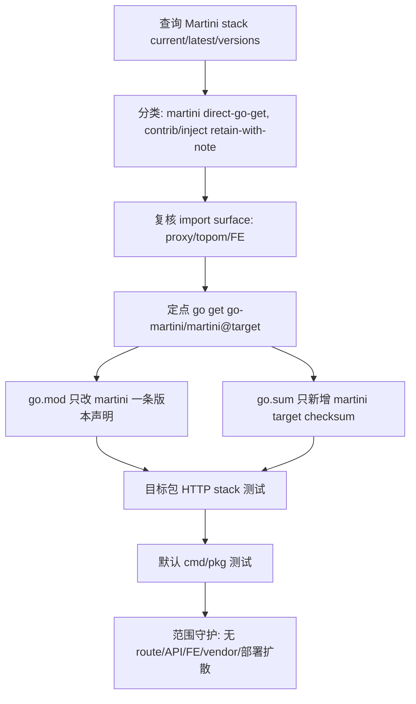

# dep-dashboard-martini-stack design

## 0. 术语约定

- **Martini web stack**：本 feature 覆盖的 Go module 组：`github.com/go-martini/martini`、`github.com/martini-contrib/binding`、`github.com/martini-contrib/gzip`、`github.com/martini-contrib/render`、`github.com/codegangsta/inject`。它不是 FE 的 Angular/Bootstrap 静态资源，也不是把 HTTP 框架替换成标准库或其他 router。
- **Dashboard / proxy admin API Martini handler**：`pkg/topom/topom_api.go` 和 `pkg/proxy/proxy_api.go` 中由 Martini 组装的管理 HTTP API，包含 `render.Renderer()`、`gzip.All()`、`binding.Json(...)`、xauth 路由参数和 API route group。
- **FE Martini handler**：`cmd/fe/main.go` 中负责静态资源、`/list` 和 dashboard reverse proxy 的 Martini handler。它不等同于 `cmd/fe/assets/` 下的前端 JS 代码。
- **retain-with-note**：`@latest` 等于当前版本时，记录当前已是最新可解析 pseudo version，不为了“有动作”而改 `go.mod/go.sum`。
- **Minimal module diff**：只让目标 module 的版本声明和 `go.sum` 对应 checksum 变化；不运行无目标全量 `go mod tidy`，不重排依赖块。

防冲突结论：代码和 CodeStable 文档中已有 `Codis Dashboard / Topom`、`Codis FE`、`Codis Proxy`、`Go module manifest` 等术语。本 design 沿用既有叫法，并把 roadmap 中“dashboard/FE middleware”的覆盖面补全为 dashboard/topom API、proxy admin API 和 FE reverse proxy 三处 Martini 使用面。

## 1. 决策与约束

### 需求摘要

本 feature 要把 `github.com/go-martini/martini` 从当前 pseudo version 升级到 Go 工具解析出的最新 pseudo version，并确认 `binding`、`gzip`、`render`、`inject` 当前已经等于 `@latest`，不产生无意义 churn。服务对象是维护 Codis dashboard/proxy 管理面、FE 入口和依赖安全的人。

成功标准是：`go.mod/go.sum` 只出现 Martini stack 的最小机械变化；dashboard/topom API、proxy admin API 和 FE reverse proxy 的路由、JSON binding、gzip middleware、render redirect/static 行为不出现可观察回归；`go test ./pkg/proxy ./pkg/topom ./cmd/fe` 与 `go test ./cmd/... ./pkg/...` 通过。

明确不做：

- 不替换 Martini 框架，不迁移到 `net/http` router、Gin、Chi、Echo 或其他 web framework。
- 不修改 dashboard/topom API、proxy admin API 或 FE `/list` / reverse proxy 的 route path、method、xauth 参数、返回 JSON 结构或状态码语义。
- 不修改 `binding.Json(...)` 绑定的 request 类型、ACL / hot key cache / slot assign 请求体结构或错误包装。
- 不修改 `gzip.All()` 的挂载顺序、`Content-Type: application/json; charset=utf-8` middleware 或 `render.Renderer()` 的使用方式。
- 不修改 FE 静态资源、Angular 代码、dashboard reverse proxy 目标选择、dashboard list loader 或 coordinator 语义。
- 不升级 `github.com/oxtoacart/bpool`；它已由 `dep-config-cli-utility-stack` 升级并作为 `render` 依赖被验证。
- 不升级 Redis client、coordinator、RDB parser、metrics、jemalloc 或其他 roadmap 子 feature 覆盖的 module。
- 不升级 Go toolchain，不改变 `go 1.26.1` module directive。
- 不修改 `third_party/jemalloc-go`、`extern/redis-8.6.3/`、Docker、部署脚本、配置模板或生成 `vendor/` / `Godeps/`。

### 复杂度档位

按“项目内部依赖维护”默认档位走，偏离如下：

- Compatibility = backward-compatible：依赖升级不能改变管理 HTTP API、FE 入口、Redis/proxy/topom 运行语义或配置格式。
- Determinism = reproducible：版本目标和 checksum 必须来自 Go module query 与 `go.mod/go.sum`，不能依赖本地 module cache 状态。
- Testability = verified：本组直接挂在 dashboard/topom、proxy admin API 和 FE 入口，必须覆盖目标包测试和默认 cmd/pkg 测试。

### 关键决策

1. **只升级 `github.com/go-martini/martini` 到 `@latest` pseudo version**。
   - 依据：2026-06-04 执行 `go list -m -u -json github.com/go-martini/martini`，当前为 `v0.0.0-20160908070901-fe605b5cd210`，Update 为 `v0.0.0-20170121215854-22fa46961aab`。`go list -m -versions -json ...@latest` 没有返回 tagged `Versions` 列表，因此目标是最新可解析 pseudo version，不是正式 tagged release。
   - 命令形态：`GOPROXY=https://proxy.golang.org,direct go get github.com/go-martini/martini@v0.0.0-20170121215854-22fa46961aab`。

2. **`binding`、`gzip`、`render`、`inject` 走 `retain-with-note`**。
   - 依据：2026-06-04 查询 `@latest`，四者分别仍为当前版本：`binding v0.0.0-20160701174519-05d3e151b6cf`、`gzip v0.0.0-20151124214156-6c035326b43f`、`render v0.0.0-20150707142108-ec18f8345a11`、`inject v0.0.0-20150114235600-33e0aa1cb7c0`。
   - 取舍：这四个 module 不产生升级 diff；仍列入 `module_set`，因为它们是本 stack 的依赖边界和验收对象。

3. **保留 Martini 框架，不做 web stack replacement**。
   - 依据：roadmap 的本条是同路径依赖升级/确认。替换框架会改变 route 注册、middleware 执行顺序、参数注入和 handler 签名，属于新的架构迁移，不是本条依赖升级。
   - 观察：roadmap 已指出 Martini stack 多年无 tagged release；如果维护目标升级为安全/长期维护性，应另起 roadmap/feature 评估框架替换。

4. **验收覆盖 proxy admin API，虽然 roadmap 摘要只点名 dashboard/FE**。
   - 依据：`pkg/proxy/proxy_api.go` 与 `pkg/topom/topom_api.go` 使用同一组 Martini middleware 和 `binding.Json(...)`。只验证 dashboard/FE 会漏掉 proxy 的 `FillSlots`、`SetSentinels`、ACL 和 hot key cache invalidation API 编译/绑定面。

5. **不通过全量 `go mod tidy` 收口**。
   - 依据：项目注意事项明确禁止无目标全量 tidy；临时 detached worktree 试跑定点 `go get` 只改变 `go.mod` 一行，并向 `go.sum` 新增 2 条目标 Martini checksum。

### 前置依赖

roadmap 条目 `dep-dashboard-martini-stack` 没有 `depends_on`，启动前状态为 `planned`。本 design 启动后将 roadmap item 改为 `in-progress`，并写入 feature 目录名。

## 2. 名词与编排

### 2.1 名词层

#### module_set

现状：

| module | scope | current | latest query | current source | reachability |
|---|---:|---|---|---|---|
| `github.com/go-martini/martini` | direct | `v0.0.0-20160908070901-fe605b5cd210` | `v0.0.0-20170121215854-22fa46961aab` | `go.mod:11` | `cmd/fe`, `pkg/proxy`, `pkg/topom` |
| `github.com/martini-contrib/binding` | direct | `v0.0.0-20160701174519-05d3e151b6cf` | same | `go.mod:16` | `pkg/proxy`, `pkg/topom` |
| `github.com/martini-contrib/gzip` | direct | `v0.0.0-20151124214156-6c035326b43f` | same | `go.mod:17` | `pkg/proxy`, `pkg/topom` |
| `github.com/martini-contrib/render` | direct | `v0.0.0-20150707142108-ec18f8345a11` | same | `go.mod:18` | `cmd/fe`, `pkg/proxy`, `pkg/topom` |
| `github.com/codegangsta/inject` | indirect | `v0.0.0-20150114235600-33e0aa1cb7c0` | same | `go.mod:33` | `martini` indirect dependency |

变化：

```text
feature_slug: dep-dashboard-martini-stack
module_set:
  - module_path: github.com/go-martini/martini
    current_version: v0.0.0-20160908070901-fe605b5cd210
    target_version: v0.0.0-20170121215854-22fa46961aab
    scope: direct
    replace_path: null
    upgrade_mode: direct-go-get
  - module_path: github.com/martini-contrib/binding
    current_version: v0.0.0-20160701174519-05d3e151b6cf
    target_version: v0.0.0-20160701174519-05d3e151b6cf
    scope: direct
    replace_path: null
    upgrade_mode: retain-with-note
  - module_path: github.com/martini-contrib/gzip
    current_version: v0.0.0-20151124214156-6c035326b43f
    target_version: v0.0.0-20151124214156-6c035326b43f
    scope: direct
    replace_path: null
    upgrade_mode: retain-with-note
  - module_path: github.com/martini-contrib/render
    current_version: v0.0.0-20150707142108-ec18f8345a11
    target_version: v0.0.0-20150707142108-ec18f8345a11
    scope: direct
    replace_path: null
    upgrade_mode: retain-with-note
  - module_path: github.com/codegangsta/inject
    current_version: v0.0.0-20150114235600-33e0aa1cb7c0
    target_version: v0.0.0-20150114235600-33e0aa1cb7c0
    scope: indirect
    replace_path: null
    upgrade_mode: retain-with-note
```

接口示例：

```diff
-	github.com/go-martini/martini v0.0.0-20160908070901-fe605b5cd210
+	github.com/go-martini/martini v0.0.0-20170121215854-22fa46961aab
 	github.com/martini-contrib/binding v0.0.0-20160701174519-05d3e151b6cf
 	github.com/martini-contrib/gzip v0.0.0-20151124214156-6c035326b43f
 	github.com/martini-contrib/render v0.0.0-20150707142108-ec18f8345a11
 	github.com/codegangsta/inject v0.0.0-20150114235600-33e0aa1cb7c0 // indirect
```

来源：`go-dependency-upgrade` roadmap 第 4.2 节合并子 feature 升级契约，以及 2026-06-04 实际 `go list` 查询。

#### checksum lockfile

现状：

- `go.sum` 已包含 `github.com/go-martini/martini v0.0.0-20160908070901-fe605b5cd210` 的 content checksum 和 `go.mod` checksum。
- `binding`、`gzip`、`render`、`inject` 当前 checksum 已是目标版本 checksum。

变化：

- 新增 2 条 Martini 目标版本 checksum：

```text
github.com/go-martini/martini v0.0.0-20170121215854-22fa46961aab h1:xveKWz2iaueeTaUgdetzel+U7exyigDYBryyVfV/rZk=
github.com/go-martini/martini v0.0.0-20170121215854-22fa46961aab/go.mod h1:/P9AEU963A2AYjv4d1V5eVL1CQbEJq6aCNHDDjibzu8=
```

来源：临时 detached worktree 中执行定点 `go get` 后的 `go.sum` diff。

#### import surface

现状：

- `pkg/proxy/proxy_api.go:15` 到 `pkg/proxy/proxy_api.go:18` 直接 import Martini stack；`pkg/proxy/proxy_api.go:30` 到 `pkg/proxy/proxy_api.go:90` 组装 proxy admin API middleware、route group、`binding.Json(...)` 和 route handler。
- `pkg/topom/topom_api.go:15` 到 `pkg/topom/topom_api.go:18` 直接 import Martini stack；`pkg/topom/topom_api.go:32` 到 `pkg/topom/topom_api.go:140` 组装 dashboard/topom API middleware、route group、RDB Analysis / ACL / hot key cache / slots binding。
- `pkg/topom/topom_rdb_analysis_api.go:10` 使用 `martini.Params` 获取 route 参数。
- `cmd/fe/main.go:23` 到 `cmd/fe/main.go:24` 直接 import `martini` 和 `render`；`cmd/fe/main.go:148` 到 `cmd/fe/main.go:170` 组装 FE 静态资源、`/list` 和 dashboard reverse proxy。
- `github.com/codegangsta/inject` 不被本仓库直接 import，而是 `cmd/fe -> github.com/go-martini/martini -> github.com/codegangsta/inject` 的间接链路。
- `github.com/oxtoacart/bpool` 是 `render` 的依赖链，已在前置 `dep-config-cli-utility-stack` 升级到当前 `@latest` pseudo version。

变化：

- import surface 不变。
- handler 签名、middleware 顺序、route group、xauth 参数注入、JSON binding 类型和 FE reverse proxy 逻辑不变。
- 只改变 `martini` module 版本；其余四个本组 module 保持当前版本。

### 2.2 编排层



现状：

- roadmap 把本条归入 `service-integration-stacks`，目标是升级或确认 Martini web stack，验证 dashboard/FE middleware、binding、gzip 和 render 行为。
- 代码实际覆盖面有三处：proxy admin API、dashboard/topom API、FE reverse proxy。
- 临时 detached worktree 试跑定点 Martini 升级后，`go.mod` 只变一行，`go.sum` 只新增 2 行；`go test ./pkg/proxy ./pkg/topom ./cmd/fe` 和 `go test ./cmd/... ./pkg/...` 均通过。

变化：

- implement 阶段先重新查询版本，再按 `direct-go-get` / `retain-with-note` 分类执行。
- 验证顺序从 module manifest 到 HTTP stack package，再到默认 cmd/pkg 测试。
- 如果目标包测试失败，先判断是 Martini API/注入行为不兼容、测试环境问题还是既有代码问题；不得通过替换框架、重写 route 或全量 `go mod tidy` 掩盖失败。

流程级约束：

- **顺序约束**：版本查询 -> 策略分类 -> import surface 复核 -> 定点升级 -> diff 守护 -> target 测试 -> 默认测试。
- **错误语义**：proxy/topom/FE 编译或测试失败即视为本 feature 未完成；若错误来自 Martini API 或 `inject` 语义不兼容，必须回到 design/roadmap 讨论保留版本或另起框架迁移。
- **幂等性**：重复执行定点 `go get` 和验收命令不应继续改动 `go.mod/go.sum`，也不生成 `vendor/`、`Godeps/`、`vendor/modules.txt`。
- **兼容性**：HTTP route、method、xauth path 参数、JSON request/response、gzip middleware、render redirect/static、FE reverse proxy、Redis/proxy/topom/coordinator 行为保持不变。
- **可观测点**：`go list -m -u -json`、`go list -m -versions -json`、`go.mod` diff、`go.sum` diff、`go mod why -m`、`go list -deps ./cmd/... ./pkg/...`、`go test ./pkg/proxy ./pkg/topom ./cmd/fe`、`go test ./cmd/... ./pkg/...`、`git status --short`。

### 2.3 挂载点清单

- `go.mod` 中 `github.com/go-martini/martini` direct require：删除或回退后，Martini web stack 的实际升级消失。
- `go.mod` 中 `binding`、`gzip`、`render` direct require 与 `inject` indirect require：删除或改动后，本 feature 的“确认并保留”边界消失。
- `go.sum` 中 `go-martini/martini v0.0.0-20170121215854-22fa46961aab` checksum：删除后 clean checkout 不能用 lockfile 证明目标版本内容。
- `pkg/proxy ./pkg/topom ./cmd/fe` target test gate：删除后，本条无法证明 proxy/topom/FE 三处 Martini 使用面仍可编译测试。
- 默认 cmd/pkg test gate：删除后，本条无法证明升级后 dashboard/proxy/admin/ha/fe 和 shared packages 的默认闭环。

### 2.4 推进策略

1. **版本调查复核**：重新执行 `go list -m -u -json`、`go list -m -json @latest`、`go list -m -versions -json` 覆盖五个 module。
   - 退出信号：`martini` 目标仍是 `v0.0.0-20170121215854-22fa46961aab`；其余四个 module 仍等于当前版本；如变化则记录实际结果并暂停确认。

2. **依赖触达和策略分类**：执行 `go mod why -m` 与 `go list -deps ./cmd/... ./pkg/...`，复核 direct import surface。
   - 退出信号：proxy/topom/FE 三处仍触达 Martini stack；`inject` 仍只经 `martini` 间接触达；`bpool` 仍只经 `render` 间接触达且不纳入本条升级。

3. **module manifest 定点升级**：执行 `GOPROXY=https://proxy.golang.org,direct go get github.com/go-martini/martini@v0.0.0-20170121215854-22fa46961aab`。
   - 退出信号：`go.mod` 只把 `github.com/go-martini/martini` 改到目标版本；`binding`、`gzip`、`render`、`inject`、`go 1.26.1` 和 `jemalloc-go` replace 保留。

4. **checksum 与依赖图收口**：核对 `go.sum`、module graph 和导入路径。
   - 退出信号：`go.sum` 只新增 Martini 目标版本的 content/go.mod checksum；没有无关 module churn；import path 未迁移。

5. **HTTP stack target 测试**：运行 `go test ./pkg/proxy ./pkg/topom ./cmd/fe`。
   - 退出信号：proxy admin API、dashboard/topom API 和 FE Martini 使用面通过编译测试，不报 middleware、binding、render、gzip 或 route 参数注入错误。

6. **默认构建测试闭环**：运行默认 cmd/pkg 测试。
   - 退出信号：`go test ./cmd/... ./pkg/...` 通过，不报 module version、vendor mode 或 API 不兼容错误。

7. **范围守护与临时产物清理**：核对最终 diff 和仓库状态。
   - 退出信号：diff 仅包含 `go.mod`、`go.sum`、本 feature spec 和 roadmap item 状态；不出现 route/API/FE 静态资源、vendor/Godeps、配置模板、部署脚本或仓库内临时构建产物。

### 2.5 结构健康度与微重构

##### 评估

- compound convention：已用 `.codestable/tools/search-yaml.py` 搜索 `目录组织 OR 命名 OR 归属` 和 `martini dashboard proxy api dependency go.mod go.sum`，无匹配文档。
- 文件级 - `go.mod`：58 行，职责单一；本次只改一条 direct require，不需要重排 require block。
- 文件级 - `go.sum`：278 行，作为 checksum lockfile 接受 Go toolchain 追加目标版本校验；不手工清理旧 checksum，避免把最小升级扩大成全量整理。
- 文件级 - `pkg/topom/topom_api.go`：1087 行，API route 和 handler 集中，文件偏长；但本次不新增 route 或 handler，只验证依赖升级，拆分不是前置条件。
- 文件级 - `pkg/proxy/proxy_api.go`：401 行，职责集中在 proxy admin API；本次不新增 route 或 handler，不需要拆分。
- 文件级 - `cmd/fe/main.go`：304 行，混合 CLI、loader、HTTP server 启动；本次不新增逻辑，不需要拆分。
- 文件级 - `pkg/topom/topom_rdb_analysis_api.go`：只使用 `martini.Params` 作为 route 参数入口；本次不新增 RDB Analysis handler。
- 目录级 - 仓库根目录：`go.mod/go.sum` 已是既有标准入口，本次不新增根目录文件。
- 目录级 - `pkg/topom`、`pkg/proxy`、`cmd/fe`：本次不新增源码文件，只验证现有 import surface。

##### 结论：不做前置微重构

原因：本 feature 是依赖 manifest 的定点版本升级/确认，不是在胖文件里追加 HTTP API，也不新增目录结构。拆分 `topom_api.go` 或重组 FE main 流程不会降低本次依赖升级风险，反而会把行为不变的 module 升级扩大成结构改造。

##### 超出范围的观察

- `pkg/topom/topom_api.go` 已经偏长，后续如果继续新增 dashboard API，建议先走 `cs-refactor` 评估 route 注册与 handler 职责拆分。
- Martini stack 多年无 tagged release。若目标是长期维护性或安全响应能力，应另起 roadmap 评估 web framework replacement，本 feature 不处理。

## 3. 验收契约

### 关键场景清单

- 触发：执行 `GOPROXY=https://proxy.golang.org,direct go list -m -u -json github.com/go-martini/martini`。期望：当前版本为 `v0.0.0-20160908070901-fe605b5cd210`，Update 为 `v0.0.0-20170121215854-22fa46961aab`。
- 触发：执行 `GOPROXY=https://proxy.golang.org,direct go list -m -versions -json github.com/go-martini/martini@latest`。期望：确认没有 tagged `Versions` 列表，本条目标是 pseudo version。
- 触发：分别查询 `binding`、`gzip`、`render`、`inject @latest`。期望：四者均等于当前版本，处理策略为 `retain-with-note`。
- 触发：执行 `go mod why -m` 覆盖五个 module。期望：`martini` / `render` 可追溯到 `cmd/fe`，`binding` / `gzip` 可追溯到 `pkg/proxy` 或 `pkg/topom`，`inject` 可追溯到 `martini`。
- 触发：执行 `go list -deps ./cmd/... ./pkg/... | rg "github.com/(go-martini/martini|martini-contrib/(binding|gzip|render)|codegangsta/inject)"`。期望：默认 cmd/pkg 仍触达五个 module。
- 触发：执行定点 `go get` 后检查 `go.mod`。期望：只有 `github.com/go-martini/martini` 改为目标版本；`binding`、`gzip`、`render`、`inject`、`go 1.26.1` 和 `replace github.com/spinlock/jemalloc-go => ./third_party/jemalloc-go` 不变。
- 触发：检查 `go.sum` diff。期望：只新增 Martini 目标版本的 content/go.mod checksum；不出现无关 module 大量 churn。
- 触发：执行 `go test ./pkg/proxy ./pkg/topom ./cmd/fe`。期望：proxy admin API、dashboard/topom API 和 FE Martini 使用面通过编译测试。
- 触发：执行 `go test ./cmd/... ./pkg/...`。期望：默认 cmd/pkg 测试通过。
- 触发：重复执行验收命令后查看 `git status --short`。期望：不生成 `vendor/`、`Godeps/`、`vendor/modules.txt`，不修改 tracked source 之外的预期文件。

### 明确不做的反向核对项

- Diff 不应包含 route path、HTTP method、xauth 参数名、handler 签名、API JSON 结构或状态码语义改动。
- Diff 不应修改 `binding.Json(...)` 绑定类型、ACL / hot key cache / slot assign 请求结构或错误包装。
- Diff 不应修改 `gzip.All()`、`render.Renderer()`、JSON `Content-Type` middleware 或 Martini static/reverse proxy 逻辑。
- Diff 不应修改 `cmd/fe/assets/`、dashboard list loader、coordinator、proxy/topom 运行逻辑或 Redis 协议。
- Diff 不应升级 `github.com/oxtoacart/bpool`、Redis client、coordinator、RDB parser、metrics、jemalloc 或其他 roadmap 子 feature 覆盖的 module。
- Diff 不应替换 Martini 框架或迁移 import path。
- Diff 不应修改 `go 1.26.1` module directive、`third_party/jemalloc-go` replace、`extern/redis-8.6.3/`、Docker、部署脚本或配置模板。
- Diff 不应生成 `vendor/`、`Godeps/` 或 `vendor/modules.txt`。

## 4. 与项目级文档的关系

本 feature 不新增运行期能力，不改变 `redis-cluster-service` 或 `platform-release-artifacts` 的用户故事；它维护的是既有 dashboard/topom、proxy admin API 和 FE HTTP stack 的 Go module 版本。acceptance 阶段应回写 roadmap item 为 `done`。默认不需要更新 `.codestable/architecture/ARCHITECTURE.md` 或 requirement 文档，除非实现阶段发现 Martini 升级迫使 HTTP API 契约或构建契约发生结构变化。
