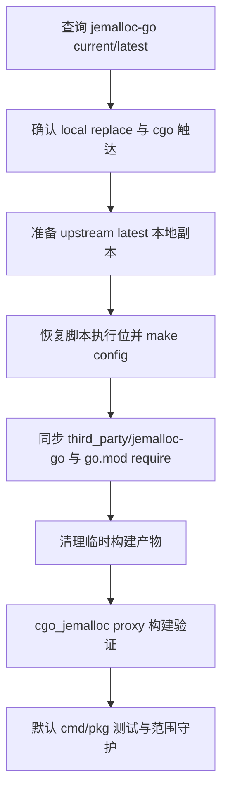

# dep-jemalloc-stack design

## 0. 术语约定

- **Jemalloc stack**：本 feature 覆盖的 Go module：`github.com/spinlock/jemalloc-go`。
- **local replace**：`go.mod` 中 `replace github.com/spinlock/jemalloc-go => ./third_party/jemalloc-go`，实际 cgo 构建使用仓库内源码，而不是 module cache。
- **upstream latest**：2026-06-04 查询到的 `github.com/spinlock/jemalloc-go@v0.0.0-20201010032256-e81523fb8524`。
- **generated relink surface**：upstream latest 通过 `make config` 生成的顶层 `jemalloc` / `je_*.c` / `VERSION` symlink 和 jemalloc generated headers，是 `go build -tags cgo_jemalloc ./cmd/proxy` 可直接通过的必要入口。
- **cgo_jemalloc behavior unchanged**：只更新 jemalloc-go module 和本地 replace 源码，不修改 Codis allocator 调用点、proxy 构建标签、Makefile 构建目标或运行期配置。

防冲突结论：架构文档和 `.codestable/attention.md` 已使用 `cgo_jemalloc`、`third_party/jemalloc-go`、`local replace` 等叫法。本 design 沿用这些术语，不新增 allocator 行为概念。

## 1. 决策与约束

### 需求摘要

本 feature 要完成 roadmap 中最后一项 native build stack 依赖升级。2026-06-04 查询结果显示：`github.com/spinlock/jemalloc-go` 当前 require 为 `v0.0.0-20161230074307-26719b2ee618`，`@latest` 为 `v0.0.0-20201010032256-e81523fb8524`。由于该 module 被本地 replace，单纯修改 `go.mod` require 不足以改变实际构建源码，必须同步评估并更新 `third_party/jemalloc-go`。

服务对象是维护 Codis `cgo_jemalloc` 构建路径的人。成功标准是：`go.mod` require 升级到 upstream latest；`third_party/jemalloc-go` 同步到 upstream latest 并保留 local module `go.mod`；`pkg/utils/unsafe2` 的 allocator 调用点不变；`go build -tags cgo_jemalloc ./cmd/proxy` 和默认 cmd/pkg 测试通过；不恢复 vendor/Godeps，不运行全量 `go mod tidy`。

明确不做：

- 不修改 `pkg/utils/unsafe2/je_malloc.go` 或 `cgo_malloc.go` 的 allocator 调用语义。
- 不改变 `cgo_jemalloc` build tag、Makefile proxy 构建目标、默认配置或运行期行为。
- 不引入新的 allocator abstraction，不改 Redis/proxy 内存管理策略。
- 不恢复旧 `vendor/` / `Godeps/`，不编辑旧 vendor 路径。
- 不升级 Go toolchain，不改变 `go 1.26.1` module directive。
- 不运行无目标全量 `go mod tidy`。
- 不修改 `extern/redis-8.6.3/`、Docker、部署脚本、前端资源或配置模板。

### 复杂度档位

按“native build 依赖升级”档位走，偏离如下：

- Compatibility = build-compatible：Codis Go 调用面必须保持 `jemalloc.Malloc` / `Free` 兼容。
- Dependency policy = direct-go-get plus local-replace-sync：require 版本和实际 replace 源码必须同步。
- Generated source policy = required generated surface only：允许提交 cgo build 必需的 generated headers/symlink；不提交临时 object、`.sym`、`config.log` 等一次性构建产物。
- Testability = cgo verified：必须跑 `go build -tags cgo_jemalloc ./cmd/proxy`，并用默认 cmd/pkg 测试证明普通构建不受影响。

### 关键决策

1. **升级 `github.com/spinlock/jemalloc-go` require 到 `v0.0.0-20201010032256-e81523fb8524`**。
   - 依据：`go list -m -u -json github.com/spinlock/jemalloc-go` 显示 Update 为该 pseudo version；`go list -m -json github.com/spinlock/jemalloc-go@latest` 确认 `@latest` 等于该版本。

2. **同步 `third_party/jemalloc-go`，而不是只改 `go.mod`**。
   - 依据：`go.mod` replace 指向本地目录，`go list -m all` 显示实际 Dir 为 `./third_party/jemalloc-go`。如果只改 require，真实 cgo 编译仍使用旧本地源码。

3. **采用 upstream latest 的 `jemalloc-5.2.1` source layout，并保留 Codis local replace 的 `go.mod`**。
   - 依据：upstream latest 不自带仓库内 `go.mod` 文件，Go proxy 只提供 synthesized `.mod`；本地 replace 目录必须有 `module github.com/spinlock/jemalloc-go`。
   - 兼容：保留 `go 1.13` 作为 local replace 的保守 directive，不改变 Codis 根 module 的 Go toolchain 约束。

4. **同步时显式恢复脚本执行位并运行 `make config`**。
   - 依据：module cache 拷贝出的 upstream latest 脚本权限不适合直接运行；恢复 `*.sh` 执行位并重新 `make config` 后，临时 workspace 指向 upstream latest 的 `go build -tags cgo_jemalloc ./cmd/proxy` 已通过。

### 前置依赖

roadmap 条目 `dep-jemalloc-stack` 依赖 `dep-network-core-stack`，该条已完成。本 feature 启动时将 roadmap item 改为 `in-progress`，并写入 feature 目录名。

## 2. 名词与编排

### 2.1 名词层

#### module_set

| module | scope | current | latest query | target | replace_path | mode |
|---|---:|---|---|---|---|---|
| `github.com/spinlock/jemalloc-go` | direct | `v0.0.0-20161230074307-26719b2ee618` | `v0.0.0-20201010032256-e81523fb8524` | `v0.0.0-20201010032256-e81523fb8524` | `./third_party/jemalloc-go` | direct-go-get + local-replace-sync |

#### 现状

- `go.mod` direct require 指向 2016 pseudo version，并 replace 到 `./third_party/jemalloc-go`。
- `third_party/jemalloc-go` 是本地 module，包含 `go.mod`、`jemalloc.go`、平铺的 `je_*.c`、`jemalloc/` headers 和 `legacy/` 目录。
- `pkg/utils/unsafe2/je_malloc.go` 在 `cgo_jemalloc` build tag 下 import `github.com/spinlock/jemalloc-go`，只调用 `Malloc` / `Free`。
- `go build -tags cgo_jemalloc ./cmd/proxy` 当前可通过。

#### 变化

- `go.mod` 中 `github.com/spinlock/jemalloc-go` 升级到 upstream latest pseudo version。
- `third_party/jemalloc-go` 同步为 upstream latest 布局：Go wrapper、`jemalloc-5.2.1/` source、顶层 generated relink symlink 和 local module `go.mod`。
- `pkg/utils/unsafe2` 不变化，Codis allocator 调用面不变化。
- `go.sum` 只接受目标 module 版本相关 checksum 的最小变化。

示例：

```diff
- github.com/spinlock/jemalloc-go v0.0.0-20161230074307-26719b2ee618
+ github.com/spinlock/jemalloc-go v0.0.0-20201010032256-e81523fb8524
```

### 2.2 编排层



#### 现状

- 默认 cmd/pkg 包图不触发 `github.com/spinlock/jemalloc-go`；`go list -deps -tags cgo_jemalloc ./cmd/proxy` 会触达该 module 和 `pkg/utils/unsafe2`。
- `go mod why -m github.com/spinlock/jemalloc-go` 证明依赖来自 `pkg/utils/unsafe2`。
- 当前本地 replace 构建通过，但 require 与 upstream latest 不一致。

#### 变化

- implement 阶段先复核版本与触达，再执行定点 `go get github.com/spinlock/jemalloc-go@v0.0.0-20201010032256-e81523fb8524`。
- 同步 `third_party/jemalloc-go` 时使用已经验证过的 upstream latest 副本，补 local `go.mod`，执行 `make config`，保留 generated relink surface，删除 object / `.sym` / `config.log` 等一次性产物。
- 验证 `go build -tags cgo_jemalloc ./cmd/proxy`、`go test ./pkg/utils/unsafe2 ./cmd/proxy`、`go test ./cmd/... ./pkg/...`。

流程级约束：

- **错误语义**：若 cgo build 失败，先判断是 generated surface 缺失、脚本权限、jemalloc API 变化还是 Codis 调用面问题；不得通过修改 Codis allocator 语义绕过。
- **幂等性**：重复执行 `go get`、`make config` 和 build 不应产生额外非预期 diff。
- **兼容性**：`cgo_malloc` / `cgo_free` 调用语义、build tag、Makefile 目标和默认非 jemalloc 构建不变。
- **可观测点**：`go list`、`go mod why`、`go list -deps -tags cgo_jemalloc`、`diff -qr`、`git diff -- go.mod go.sum third_party/jemalloc-go`、target build/tests、默认 tests、`git status`。

### 2.3 挂载点

- `go.mod` 中 `github.com/spinlock/jemalloc-go` direct require：删除或回退后版本升级消失。
- `go.mod` 中 `replace github.com/spinlock/jemalloc-go => ./third_party/jemalloc-go`：证明实际构建源来自本地 replace。
- `third_party/jemalloc-go` local module contents：实际 cgo source、headers 和 generated relink surface。
- `pkg/utils/unsafe2/je_malloc.go` 的 import surface：证明 Codis 使用 `jemalloc.Malloc` / `Free` 的调用面保持不变。
- `cgo_jemalloc` build gate：证明 native build stack 在当前平台仍可编译。
- roadmap item：记录本合并子 feature 完成，不让后续重复推进同一 module。

拔除方式：回退 `go.mod` 中 jemalloc-go require，并把 `third_party/jemalloc-go` 恢复到旧本地 replace 内容后，依赖升级在系统视角消失；再移除本 feature spec/acceptance 和 roadmap done 状态即可回到升级前规划状态。

### 2.4 推进策略

1. **版本调查复核**：重新执行 `go list -m -u -json`、`go list -m -json @latest` 覆盖 jemalloc-go。
   - 退出信号：目标仍为 `v0.0.0-20201010032256-e81523fb8524`。
2. **local replace 与触达分类**：执行 `go mod why -m`、`go list -m all` 与 `go list -deps -tags cgo_jemalloc ./cmd/proxy`。
   - 退出信号：jemalloc-go 只在 `cgo_jemalloc` proxy 构建路径下经 `pkg/utils/unsafe2` 触达，实际 Dir 为 `./third_party/jemalloc-go`。
3. **module require 定点升级**：执行 `GOPROXY=https://proxy.golang.org,direct go get github.com/spinlock/jemalloc-go@v0.0.0-20201010032256-e81523fb8524`。
   - 退出信号：`go.mod` direct require 升级；replace、Go directive 和其他 direct module 保留。
4. **local replace 源码同步**：把 verified upstream latest 副本同步到 `third_party/jemalloc-go`，保留 local `go.mod` 和 generated relink surface。
   - 退出信号：本地目录包含 `jemalloc-5.2.1/`、顶层 `jemalloc` / `VERSION` / `je_*.c` relink 入口，且不包含 `.o`、`.sym`、`config.log` 等临时产物。
5. **native build target 验证**：运行 `go test ./pkg/utils/unsafe2 ./cmd/proxy` 与 `go build -tags cgo_jemalloc ./cmd/proxy`。
   - 退出信号：allocator 包、proxy cmd 和 cgo_jemalloc proxy 构建通过；构建生成的根目录 `proxy` 临时二进制已清理。
6. **默认构建测试闭环**：运行 `go test ./cmd/... ./pkg/...`。
   - 退出信号：默认 cmd/pkg 测试通过，不报 module replace、vendor mode 或 jemalloc 相关错误。
7. **范围守护与临时产物清理**：核对最终 diff、vendor/Godeps、third_party 临时产物和 roadmap 文档状态。
   - 退出信号：diff 仅包含 `go.mod`、`go.sum`、`third_party/jemalloc-go`、本 feature spec 和 roadmap 状态；无 Codis Go 源码行为改动、extern、vendor/Godeps 或方案外 module churn。

### 2.5 结构健康度与微重构

compound 检索：`jemalloc` 命中 Go modules 旧 vendor pitfall learning 和 Redis 8 线程模型 explore，未命中与本次 local replace 同步冲突的 decision。沿用 `.codestable/attention.md` 中“jemalloc 修改应改 `third_party/jemalloc-go`，不是旧 vendor”和“不要全量 `go mod tidy`”的项目约束。

文件级：

- `go.mod`：本次只修改 jemalloc-go direct require，保留 replace 和 Go directive。
- `third_party/jemalloc-go`：这是本次主要变更对象。目录本身是第三方源码 local replace，不做 Codis 风格重构；同步 upstream latest 布局比手工拼接更低风险。
- `pkg/utils/unsafe2/je_malloc.go`：职责单一，只桥接 `jemalloc.Malloc` / `Free`，本次不改。

目录级：

- `third_party/` 是既有第三方源码位置，本次不新增平行目录。
- feature spec 落在 `.codestable/features/2026-06-04-dep-jemalloc-stack/`，符合 CodeStable 命名规则。

结论：本次不做微重构。原因：这是第三方 local replace 同步和 module manifest 升级；拆分或重写 allocator 包会把依赖升级扩大为行为改造。

## 3. 验收契约

关键场景：

- **S1**：执行 `go list -m -u -json github.com/spinlock/jemalloc-go`。期望：当前旧 pseudo version，Update 为 `v0.0.0-20201010032256-e81523fb8524`。
- **S2**：执行 `go list -m -json github.com/spinlock/jemalloc-go@latest`。期望：`@latest` 等于 `v0.0.0-20201010032256-e81523fb8524`。
- **S3**：执行 `go mod why -m github.com/spinlock/jemalloc-go`。期望：依赖链路来自 `github.com/CodisLabs/codis/pkg/utils/unsafe2`。
- **S4**：执行 `go list -deps -tags cgo_jemalloc ./cmd/proxy`。期望：触达 `github.com/spinlock/jemalloc-go` 和 `pkg/utils/unsafe2`。
- **S5**：定点 `go get` 后检查 `go.mod`。期望：jemalloc-go require 升级到 latest pseudo；replace、`go 1.26.1` 和其他 direct module 不变。
- **S6**：检查 `third_party/jemalloc-go`。期望：包含 upstream latest `jemalloc-5.2.1`、Go wrapper、local `go.mod`、顶层 relink symlink；不包含 `.o`、`.sym`、`config.log` 等临时产物。
- **S7**：运行 `go test ./pkg/utils/unsafe2 ./cmd/proxy`。期望：通过。
- **S8**：运行 `go build -tags cgo_jemalloc ./cmd/proxy`。期望：通过；根目录生成的 `proxy` 临时二进制已清理。
- **S9**：运行 `go test ./cmd/... ./pkg/...`。期望：通过。
- **S10**：重复验收后查看 `git status --short --untracked-files=all`。期望：不生成 `vendor/`、`Godeps/`、`vendor/modules.txt` 或仓库内临时构建产物。

反向核对项：

- Diff 不应修改 `pkg/utils/unsafe2/je_malloc.go`、`cgo_malloc.go` 或 Codis allocator 调用语义。
- Diff 不应修改 Makefile build tag、proxy 配置、dashboard/topom/proxy 运行期逻辑。
- Diff 不应升级 RDB parser、coordinator、Redis client、Martini、metrics 或其他 roadmap 子 feature module。
- Diff 不应修改 `extern/redis-8.6.3/`、Docker、部署脚本、前端资源或配置模板。
- Diff 不应新增 `vendor/`、`Godeps/` 或恢复 GOPATH/vendor 构建路径。

## 4. 架构归并计划

- `.codestable/architecture/ARCHITECTURE.md`：预计不更新。理由：架构文档已经记录 `third_party/jemalloc-go` 是 `cgo_jemalloc` local replace 模块；本次只把该模块同步到 upstream latest，不改变系统级能力或交互。
- `.codestable/attention.md`：预计不更新。理由：已有注意事项已覆盖“jemalloc 修改应改 `third_party/jemalloc-go`”和“不要全量 go mod tidy”；本次未新增通用项目陷阱。
- requirement：`null`。本 feature 是依赖维护 / 技术债，不新增用户可感能力。
