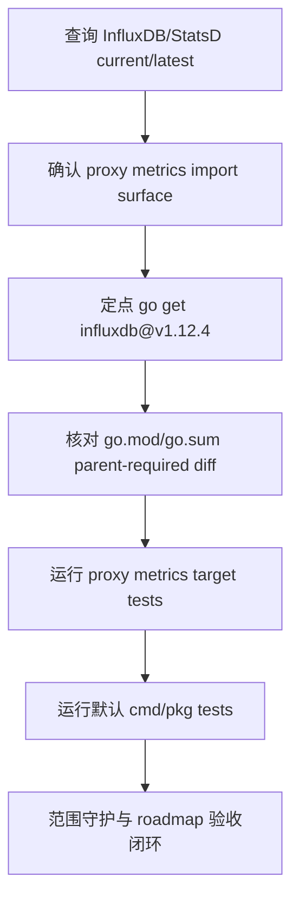

# dep-metrics-stack design

## 0. 术语约定

- **Metrics stack**：本 feature 覆盖的 Go module 组：`github.com/influxdata/influxdb` 和 `gopkg.in/alexcesaro/statsd.v2`。
- **InfluxDB metrics client module**：`github.com/influxdata/influxdb`。仓库实际 import `github.com/influxdata/influxdb/client/v2`，只用于 proxy 的 InfluxDB metrics reporter。
- **StatsD metrics client module**：`gopkg.in/alexcesaro/statsd.v2`。仓库实际 import `gopkg.in/alexcesaro/statsd.v2`，只用于 proxy 的 StatsD metrics reporter。
- **Parent-required indirect churn**：升级 direct InfluxDB module 后，Go toolchain 因 `influxdb@v1.12.4` 的 module graph 新增的 indirect require/checksum；这些是 direct module 的父依赖结果，不等同于顺手升级其他 roadmap module。
- **Metrics behavior unchanged**：只变 Go module 版本，不修改 proxy metrics JSON/InfluxDB/StatsD 上报频率、配置字段、measurement、tag、field 或错误日志语义。

防冲突结论：架构文档已有 `metrics reporter`、`InfluxDB`、`StatsD`、`proxy stats` 等术语。本 design 沿用既有叫法，不新增 metrics 字段或可观测接口。

## 1. 决策与约束

### 需求摘要

本 feature 要升级或确认 proxy metrics 上报依赖。2026-06-04 查询结果显示：`github.com/influxdata/influxdb` 当前 `v1.1.1-0.20170109231301-8c2cfd14af25`，`@latest` 为同路径 `v1.12.4`；`gopkg.in/alexcesaro/statsd.v2` 当前 `v2.0.0` 已等于 `@latest`。临时试跑 `go get github.com/influxdata/influxdb@v1.12.4` 后，proxy metrics target tests 和默认 cmd/pkg tests 均通过，但会因 InfluxDB 新 module graph 新增一批 parent-required indirect module。

服务对象是维护 Codis proxy metrics 上报和 Go modules 构建入口的人。成功标准是：`go.mod` direct InfluxDB module 升级到 `v1.12.4`；StatsD 保持 `v2.0.0`；新增 indirect 仅来自 `influxdb@v1.12.4` parent graph；proxy metrics 编译测试和默认 cmd/pkg 测试通过。

明确不做：

- 不修改 `pkg/proxy/metrics.go` 的 InfluxDB/StatsD reporter 逻辑。
- 不改变 `metrics_report_*` 配置字段、默认值、校验规则或 `config/proxy.toml`。
- 不新增、删除或改名 metrics JSON、InfluxDB measurement、StatsD key、tag 或 field。
- 不引入 InfluxDB v2 client/module，不迁移到新的指标系统。
- 不升级 StatsD，因为 `gopkg.in/alexcesaro/statsd.v2 v2.0.0` 已是 `@latest`。
- 不升级 RDB parser、coordinator、Redis client、Martini、jemalloc 或其他 roadmap 子 feature module。
- 不升级 Go toolchain，不改变 `go 1.26.1` module directive。
- 不运行无目标全量 `go mod tidy`，不生成 `vendor/`、`Godeps/` 或 `vendor/modules.txt`。
- 不修改 `extern/redis-8.6.3/`、Docker、部署脚本、前端资源或配置模板。

### 复杂度档位

按“运行期集成依赖升级”档位走，偏离如下：

- Compatibility = backward-compatible：metrics 配置和上报数据契约不能变化。
- Dependency policy = direct-go-get：InfluxDB 是 proxy 实际 import 的 direct module，应升级到同路径 `@latest`；StatsD 已是 latest，保留。
- Churn policy = parent-required only：允许 InfluxDB 新 graph 带来的 indirect 增量，不允许借此升级不相关 direct/indirect。
- Testability = verified：必须覆盖 proxy metrics package、proxy/cmd 编译面和默认 cmd/pkg 测试。

### 关键决策

1. **升级 `github.com/influxdata/influxdb` 到 `v1.12.4`**。
   - 依据：`go list -m -u -json github.com/influxdata/influxdb` 显示 Update 为 `v1.12.4`；`go list -m -json github.com/influxdata/influxdb@latest` 确认 `@latest` 等于 `v1.12.4`。
   - 试跑：临时试跑 `go get github.com/influxdata/influxdb@v1.12.4` 后，`go test ./pkg/proxy ./cmd/proxy ./cmd/dashboard ./cmd/admin ./cmd/fe` 和 `go test ./cmd/... ./pkg/...` 通过。

2. **保留 `gopkg.in/alexcesaro/statsd.v2 v2.0.0`**。
   - 依据：`go list -m -u -json` 无 Update；`@latest` 仍为 `v2.0.0`。

3. **接受 InfluxDB parent-required indirect 增量，但做范围守护**。
   - 依据：`influxdb@v1.12.4` 的 `go.mod` 引入 `pkg-config`、`zap`、`protobuf`、`x/tools` 等 build/tooling 依赖，Go 1.17+ 会把部分 graph 写入主 module 的 indirect require。
   - 取舍：这是 direct InfluxDB 升级的自然结果；验收必须证明没有顺手升级 StatsD、RDB、coordinator、jemalloc 等其他 roadmap module。

4. **不修改 metrics reporter 代码以适配新版本**。
   - 依据：试跑编译通过，说明 `client/v2` 的 `NewHTTPClient`、`NewBatchPoints`、`NewPoint`、`Write` 等 API 使用面仍兼容。

### 前置依赖

roadmap 条目 `dep-metrics-stack` 无前置依赖。启动后将 roadmap item 改为 `in-progress`，并写入 feature 目录名。

## 2. 名词与编排

### 2.1 名词层

#### module_set

| module | scope | current | latest query | target | mode |
|---|---:|---|---|---|---|
| `github.com/influxdata/influxdb` | direct | `v1.1.1-0.20170109231301-8c2cfd14af25` | `v1.12.4` | `v1.12.4` | direct-go-get |
| `gopkg.in/alexcesaro/statsd.v2` | direct | `v2.0.0` | `v2.0.0` | `v2.0.0` | retain-with-note |

#### 现状

- `pkg/proxy/metrics.go` import `github.com/influxdata/influxdb/client/v2` 和 `gopkg.in/alexcesaro/statsd.v2`。
- `Proxy.New` 启动 `startMetricsJson()`、`startMetricsInfluxdb()` 和 `startMetricsStatsd()`；InfluxDB 和 StatsD 是否启用由 `MetricsReportInfluxdbServer` / `MetricsReportStatsdServer` 配置决定。
- `go.mod` direct require 旧 InfluxDB pseudo version 和 StatsD `v2.0.0`。

#### 变化

- `go.mod` 中 `github.com/influxdata/influxdb` 升级到 `v1.12.4`。
- `go.mod` / `go.sum` 新增 InfluxDB parent-required indirect require/checksum。
- `gopkg.in/alexcesaro/statsd.v2` 保持 `v2.0.0`。
- `pkg/proxy/metrics.go` 和配置文件不变化。

示例：

```diff
- github.com/influxdata/influxdb v1.1.1-0.20170109231301-8c2cfd14af25
+ github.com/influxdata/influxdb v1.12.4
```

### 2.2 编排层



#### 现状

- proxy metrics 上报路径在 proxy 启动时按配置创建 JSON、InfluxDB 和 StatsD reporter。
- `go mod why -m` 显示 InfluxDB 和 StatsD 都由 `pkg/proxy` 需要。
- `go list -deps` 显示默认包图触达 `github.com/influxdata/influxdb/pkg/escape`、`models`、`client/v2` 和 `gopkg.in/alexcesaro/statsd.v2`。

#### 变化

- implement 阶段重新查询版本和触达后，执行 `GOPROXY=https://proxy.golang.org,direct go get github.com/influxdata/influxdb@v1.12.4`。
- target test gate 覆盖 `go test ./pkg/proxy ./cmd/proxy ./cmd/dashboard ./cmd/admin ./cmd/fe`。
- 默认 test gate 覆盖 `go test ./cmd/... ./pkg/...`。

流程级约束：

- **错误语义**：若 target/default tests 失败，先区分 InfluxDB client API 变化、module graph 或既有环境问题；不得改 metrics 行为来掩盖依赖失败。
- **幂等性**：重复执行定点 `go get` 和测试不应继续产生额外 `go.mod/go.sum` churn。
- **兼容性**：metrics 配置、report period、InfluxDB measurement/tags/fields、StatsD counter/gauge key 和日志语义不变。
- **可观测点**：`go list`、`go mod why`、`go list -deps`、`git diff -- go.mod go.sum`、target tests、默认 tests、`git status`。

### 2.3 挂载点

- `go.mod` 中 `github.com/influxdata/influxdb` direct require：删除或回退后 InfluxDB metrics client 升级消失。
- `go.mod` / `go.sum` 中 InfluxDB parent-required indirect require/checksum：clean checkout 解析目标版本的 graph 证据。
- `pkg/proxy/metrics.go` 的 InfluxDB/StatsD import：证明 proxy metrics 使用面被测试覆盖。
- target test gate：证明 proxy metrics reporter 编译面和 cmd 入口仍可通过。
- roadmap item：记录本合并子 feature 完成，不让后续重复推进同一组 module。

拔除方式：回退 `go.mod` 中 InfluxDB 版本并删除本次新增 parent-required indirect require/checksum 后，依赖升级在系统视角消失；再移除本 feature spec/acceptance 和 roadmap done 状态即可回到升级前规划状态。

### 2.4 推进策略

1. **版本调查复核**：重新执行 `go list -m -u -json`、`go list -m -json @latest` 覆盖 InfluxDB 和 StatsD。
   - 退出信号：InfluxDB 目标仍是 `v1.12.4`；StatsD 仍是 `v2.0.0` 且无 Update。
2. **依赖触达分类**：执行 `go mod why -m` 与 `go list -deps ./cmd/... ./pkg/...`。
   - 退出信号：InfluxDB 和 StatsD 都经 `pkg/proxy` 被默认 cmd/pkg 路径触达。
3. **module manifest 定点升级**：执行 `GOPROXY=https://proxy.golang.org,direct go get github.com/influxdata/influxdb@v1.12.4`。
   - 退出信号：`go.mod` 将 InfluxDB 改到 `v1.12.4`；StatsD、Go directive、jemalloc replace 保留。
4. **checksum 与依赖图收口**：核对 `go.mod/go.sum`、module graph 和导入路径。
   - 退出信号：新增 indirect/checksum 可追溯到 `influxdb@v1.12.4`；没有不相关 direct module 升级。
5. **Metrics target 测试**：运行 `go test ./pkg/proxy ./cmd/proxy ./cmd/dashboard ./cmd/admin ./cmd/fe`。
   - 退出信号：proxy metrics 包和相关 cmd 入口编译测试通过。
6. **默认构建测试闭环**：运行 `go test ./cmd/... ./pkg/...`。
   - 退出信号：默认 cmd/pkg 测试通过，不报 module version、vendor mode 或 InfluxDB client API 不兼容错误。
7. **范围守护与临时产物清理**：核对最终 diff、vendor/Godeps 和 roadmap 文档状态。
   - 退出信号：diff 仅包含 `go.mod`、`go.sum`、本 feature spec 和 roadmap 状态；无 Go 源码、配置、部署、extern、vendor/Godeps 或方案外 module churn。

### 2.5 结构健康度与微重构

compound 检索：不命中与 metrics dependency upgrade 直接冲突的 compound decision；沿用 `.codestable/attention.md` 中“不要全量 go mod tidy”和“不顺手现代化 Go 依赖”的项目约束。

文件级：

- `go.mod`：本次会修改 InfluxDB direct require 并新增 parent-required indirect require；不手工重排无关 require。
- `pkg/proxy/metrics.go`：职责集中在 proxy metrics reporter；本次不改代码，不需要拆文件。
- `pkg/proxy/config.go` / `config/proxy.toml`：本次不改配置。

目录级：

- `pkg/proxy/` 当前 metrics reporter 已有独立文件；本次不新增 Go 文件。
- 仓库根目录的 `go.mod/go.sum` 是既有标准入口，本次不新增根目录文件。

结论：本次不做微重构。原因：本 feature 是 metrics 依赖升级，不追加运行期逻辑；拆 metrics reporter 或改配置结构会扩大为行为/架构改造。

## 3. 验收契约

关键场景：

- **S1**：执行 `go list -m -u -json github.com/influxdata/influxdb`。期望：当前旧 pseudo version，Update 为 `v1.12.4`。
- **S2**：执行 `go list -m -json github.com/influxdata/influxdb@latest`。期望：`@latest` 等于 `v1.12.4`。
- **S3**：执行 `go list -m -u -json gopkg.in/alexcesaro/statsd.v2` 和 `@latest` 查询。期望：当前 `v2.0.0` 等于 `@latest`，无 Update。
- **S4**：执行 `go mod why -m` 覆盖 Metrics stack。期望：InfluxDB 和 StatsD 都可追溯到 `pkg/proxy`。
- **S5**：执行 `go list -deps ./cmd/... ./pkg/...` 并 grep metrics stack。期望：默认包图触达 InfluxDB `client/v2` 和 StatsD。
- **S6**：定点 `go get` 后检查 `go.mod`。期望：InfluxDB 改到 `v1.12.4`；StatsD、`go 1.26.1` 和 jemalloc replace 不变。
- **S7**：检查 `go.sum` 和 `go.mod` indirect diff。期望：新增内容可追溯到 `influxdb@v1.12.4` parent graph；不出现不相关 direct module 升级。
- **S8**：运行 `go test ./pkg/proxy ./cmd/proxy ./cmd/dashboard ./cmd/admin ./cmd/fe`。期望：通过。
- **S9**：运行 `go test ./cmd/... ./pkg/...`。期望：通过。
- **S10**：重复验收后查看 `git status --short --untracked-files=all`。期望：不生成 `vendor/`、`Godeps/`、`vendor/modules.txt` 或仓库内临时构建产物。

反向核对项：

- Diff 不应修改 `pkg/proxy/metrics.go`、`pkg/proxy/config.go`、`config/proxy.toml` 或 metrics 语义相关文档。
- Diff 不应修改 dashboard/topom metrics 读取流程、proxy stats JSON、hot key/session auth/ACL/RDB Analysis 指标或运行期行为。
- Diff 不应升级 StatsD、RDB parser、coordinator、Redis client、Martini、jemalloc 或其他 roadmap 子 feature module。
- Diff 不应修改 `extern/redis-8.6.3/`、Docker、部署脚本、前端资源或配置模板。

## 4. 架构归并计划

- `.codestable/architecture/ARCHITECTURE.md`：预计不更新。理由：架构文档已记录 proxy 可上报 JSON、InfluxDB、StatsD metrics；本次只升级 InfluxDB client module，不改变 metrics 能力形态。
- `.codestable/attention.md`：预计不更新。理由：本次没有新的项目通用命令陷阱；既有 module/tidy 约束已覆盖。
- requirement：`null`。本 feature 是依赖维护 / 技术债，不新增用户可感能力。
