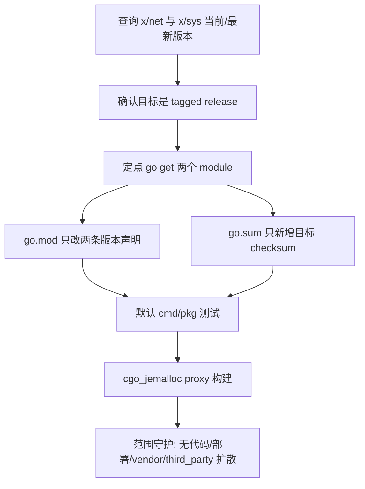

# dep-network-core-stack design

## 0. 术语约定

- **Network core stack**：本 feature 覆盖的两个 Go module：`golang.org/x/net` 与 `golang.org/x/sys`。它不是重写网络、resolver、coordinator 或 Redis 连接逻辑。
- **Target module version**：按 roadmap 第 4.1 节用 `GOPROXY=https://proxy.golang.org,direct go list -m ...` 查询到的 `@latest` tagged release。本次查询结果是 `golang.org/x/net v0.55.0`、`golang.org/x/sys v0.45.0`。
- **Minimal module diff**：只让 `go.mod` 的两条版本声明和 `go.sum` 的对应 checksum 变化；不借机全量 `go mod tidy`，不重排依赖块。
- **cgo_jemalloc verification gate**：`go build -tags cgo_jemalloc ./cmd/proxy`。它用于确认 `x/sys` 间接升级没有破坏 proxy 的 cgo 构建链，不代表本 feature 升级 `github.com/spinlock/jemalloc-go`。

防冲突结论：代码和 CodeStable 文档里已有 `Go module manifest`、`cgo_jemalloc`、`third_party/jemalloc-go`、`vendor/Godeps` 等叫法。本 design 沿用既有术语，不新增平行概念。

## 1. 决策与约束

### 需求摘要

本 feature 要把 `go.mod` 中 `golang.org/x/net` 从 `v0.51.0` 升到 `v0.55.0`，把 `golang.org/x/sys` 从 `v0.41.0` 升到 `v0.45.0`，并用一次最小依赖升级闭环证明：默认 `cmd/pkg` 测试、`cgo_jemalloc` proxy 构建和依赖范围守护都成立。

服务对象是维护 Codis 构建和依赖安全的人。成功标准是：`go.mod/go.sum` 只出现目标 module 的最小机械变化，Go 代码行为不变，`go test ./cmd/... ./pkg/...` 与 `go build -tags cgo_jemalloc ./cmd/proxy` 都通过。

明确不做：

- 不迁移 `github.com/coreos/etcd` 到现代 `go.etcd.io/etcd/*` module path。
- 不把 `golang.org/x/net/context` 改成标准库 `context`；这是可选代码清理，不是本次依赖升级的必要条件。
- 不升级 `github.com/hashicorp/consul/api`、`github.com/mattn/go-isatty` 或其他父依赖链。
- 不修改 `cmd/`、`pkg/` 运行逻辑、Redis 协议、proxy 路由、coordinator 语义或配置格式。
- 不修改 `third_party/jemalloc-go`、`extern/redis-8.6.3/`、Docker、部署脚本或前端资源。
- 不运行无目标的全量 `go mod tidy`，不生成 `vendor/`、`Godeps/` 或 `vendor/modules.txt`。
- 不升级 Go toolchain，不改变 `go 1.26.1` module directive。

### 复杂度档位

按“项目内部依赖维护”默认档位走，偏离如下：

- Compatibility = backward-compatible：依赖版本升级不能改变 Redis/proxy/topom 的外部行为。
- Determinism = reproducible：版本目标和 checksum 必须来自 Go module query 与 `go.mod/go.sum`，不能依赖本地 module cache 状态。
- Testability = verified：本条是 roadmap 的最小闭环，必须用默认测试和 `cgo_jemalloc` 构建自证。

### 关键决策

1. **目标版本采用 `@latest` tagged release**。
   - 依据：2026-06-04 查询 `go list -m -json <module>@latest`，`golang.org/x/net` 解析为 `v0.55.0`，`golang.org/x/sys` 解析为 `v0.45.0`，二者都是 tagged release，不是 pseudo version 或 pre-release。
   - 约束：如果 implement 阶段查询结果变化，必须记录实际命令结果；不能猜测上游版本。

2. **同一 diff 中定点升级两个 module**。
   - 依据：`golang.org/x/net v0.55.0` 的 `go.mod` 要求 `golang.org/x/sys v0.45.0`；当前仓库又显式 pin 了 indirect `x/sys v0.41.0`。同组升级能避免让 MVS 选择和显式 pin 互相拉扯。
   - 命令形态：`GOPROXY=https://proxy.golang.org,direct go get golang.org/x/net@v0.55.0 golang.org/x/sys@v0.45.0`。

3. **保留 `golang.org/x/sys` 的 indirect 身份**。
   - 依据：`go mod why -m golang.org/x/sys` 显示当前路径是 `pkg/models/consul -> github.com/hashicorp/consul/api -> github.com/hashicorp/go-hclog -> github.com/mattn/go-isatty -> golang.org/x/sys/unix`；本仓库没有直接 import `golang.org/x/sys/*`。
   - 变化：只把 indirect require 从 `v0.41.0` 提升到 `v0.45.0`。

4. **不做 context import 迁移**。
   - 依据：本仓库直接使用的是 `golang.org/x/net/context`，位置为 `pkg/models/etcd/etcdclient.go:11`、`pkg/utils/resolver.go:12`、`pkg/utils/redis/sentinel.go:13`。当前 `x/net v0.55.0` 仍提供该包，升级不要求改调用方。
   - 替代方案：把三处 import 改为标准库 `context`。拒绝原因：这会把依赖升级扩大成代码行为/兼容性清理，且不是跑通最小闭环所必需。

5. **不触碰 jemalloc-go local replace**。
   - 依据：`go.mod:58` 的 `replace github.com/spinlock/jemalloc-go => ./third_party/jemalloc-go` 是既有 `cgo_jemalloc` 构建契约。本 feature 只验证该构建链在 `x/sys` 升级后仍通过。

### 前置依赖

roadmap 条目 `dep-network-core-stack` 没有 `depends_on`，且 `status: planned`。本 design 启动后将 roadmap item 改为 `in-progress`，并写入 feature 目录名。

## 2. 名词与编排

### 2.1 名词层

#### module_set

现状：

| module | scope | current | latest query | current source |
|---|---:|---|---|---|
| `golang.org/x/net` | direct | `v0.51.0` | `v0.55.0` | `go.mod:23` |
| `golang.org/x/sys` | indirect | `v0.41.0` | `v0.45.0` | `go.mod:55` |

变化：

```text
feature_slug: dep-network-core-stack
module_set:
  - module_path: golang.org/x/net
    current_version: v0.51.0
    target_version: v0.55.0
    scope: direct
    replace_path: null
    upgrade_mode: direct-go-get
  - module_path: golang.org/x/sys
    current_version: v0.41.0
    target_version: v0.45.0
    scope: indirect
    replace_path: null
    upgrade_mode: direct-go-get
```

接口示例：

```diff
-	golang.org/x/net v0.51.0
+	golang.org/x/net v0.55.0
-	golang.org/x/sys v0.41.0 // indirect
+	golang.org/x/sys v0.45.0 // indirect
```

来源：`go-dependency-upgrade` roadmap 第 4.2 节合并子 feature 升级契约，以及 2026-06-04 实际 `go list` 查询。

#### checksum lockfile

现状：

- `go.sum` 已包含 `golang.org/x/net v0.51.0` 与 `golang.org/x/sys v0.41.0` 的 checksum。
- 历史 pseudo version 的 `go.mod` checksum 仍保留，用于旧依赖链解析；本 feature 不主动删除。

变化：

- 新增 4 条目标版本 checksum：

```text
golang.org/x/net v0.55.0 h1:bcvxaJn3e1U6InsFWt1JUq1aSjnRxLzT2rtD2KfkDF8=
golang.org/x/net v0.55.0/go.mod h1:L5U2KuzuOe1lY7Z+aWVIKK6qEeJXnXV9yzGA+WCHJww=
golang.org/x/sys v0.45.0 h1:dO4czNzziLiiXplLQgBCEpCvXQ3dnkn0SdaZSYdQ+FY=
golang.org/x/sys v0.45.0/go.mod h1:4GL1E5IUh+htKOUEOaiffhrAeqysfVGipDYzABqnCmw=
```

来源：临时 detached worktree 中执行定点 `go get` 后的 `go.sum` diff。

#### import surface

现状：

- 本仓库直接 import `golang.org/x/net/context` 三处：etcd client、resolver timeout helper、sentinel watcher。
- 本仓库不直接 import `golang.org/x/sys/*`；`x/sys/unix` 由 Consul/HashiCorp logging 依赖链触达。
- `go list -tags cgo_jemalloc -deps ./cmd/proxy` 触达 `github.com/spinlock/jemalloc-go`、`github.com/hashicorp/consul/api`、`github.com/mattn/go-isatty` 和 `golang.org/x/sys/unix`，所以 `x/sys` 升级必须覆盖 cgo build gate。

变化：

- import surface 不变。
- `golang.org/x/net/context` 继续由 `x/net v0.55.0` 提供。
- `x/sys/unix` 由 `x/sys v0.45.0` 提供，调用方链路仍来自 Consul/HashiCorp 间接依赖。

### 2.2 编排层



现状：

- roadmap 已把本条设为 `minimal_loop: true`，要求做完后证明依赖升级、`go.mod/go.sum` 最小变更、默认测试和 `cgo_jemalloc` 构建闭环可行。
- `go.mod` 当前使用 `go 1.26.1`，常规依赖来源是 `go.mod/go.sum`，`third_party/jemalloc-go` 通过 local replace 接入。
- `go get` 临时试跑显示，定点升级只改变 `go.mod` 两行并向 `go.sum` 新增 4 行，不新增 require，也不修改 replace。

变化：

- implement 阶段先按 roadmap 契约重新查询版本，再执行定点 `go get`。
- 验证顺序从 module manifest 到构建：先核对 `go.mod/go.sum` diff，再跑默认测试，最后跑 `cgo_jemalloc` 构建。
- 如果默认测试或 cgo 构建失败，先按错误落点判断是依赖升级真实不兼容，还是测试环境/已有代码问题；不得用全量 `go mod tidy` 或父依赖大升级掩盖失败。

流程级约束：

- **顺序约束**：版本查询 -> 定点升级 -> diff 守护 -> 默认测试 -> cgo build；不能先全量整理依赖图。
- **错误语义**：`go test` 或 `go build -tags cgo_jemalloc` 失败即视为本 feature 未完成；若错误来自上游 API 不兼容，必须回到 design/roadmap 讨论是否保留版本，不在实现中硬绕。
- **幂等性**：重复执行定点 `go get` 和验收命令不应继续改动 `go.mod/go.sum`，也不生成 `vendor/`、`Godeps/`、`vendor/modules.txt`。
- **兼容性**：运行代码 import、Redis 协议、proxy/topom/coordinator 行为保持不变。
- **可观测点**：`go list -m -u -json`、`go.mod` diff、`go.sum` diff、`go mod why -m`、`go test ./cmd/... ./pkg/...`、`go build -tags cgo_jemalloc ./cmd/proxy`、`git status --short`。

### 2.3 挂载点清单

- `go.mod` 中 `golang.org/x/net` direct require：删除或回退后，network core stack 的 direct module 升级消失。
- `go.mod` 中 `golang.org/x/sys` indirect require：删除或回退后，`x/sys` 目标版本不再被显式 pin 住，后续 Consul/RDB/Jemalloc 相关条目的前置闭环不成立。
- `go.sum` 中 `x/net v0.55.0` 与 `x/sys v0.45.0` checksum：删除后 clean checkout 不能用 lockfile 证明目标版本内容。
- `cgo_jemalloc` verification gate：删除该验收点后，本条无法承担 roadmap 的最小闭环职责。

### 2.4 推进策略

1. **版本调查复核**：重新执行 `go list -m -u -json`、`go list -m -json @latest`、`go list -m -versions -json` 覆盖两个 module。
   - 退出信号：`x/net` 目标仍是 tagged `v0.55.0`，`x/sys` 目标仍是 tagged `v0.45.0`；如变化则记录实际结果并暂停确认。

2. **module manifest 定点升级**：执行 `go get golang.org/x/net@v0.55.0 golang.org/x/sys@v0.45.0`。
   - 退出信号：`go.mod` 只把 `x/net` 与 `x/sys` 改到目标版本，`go 1.26.1` 和 `jemalloc-go` replace 保留。

3. **checksum 与依赖图收口**：核对 `go.sum` 和 module graph。
   - 退出信号：`go.sum` 只新增目标版本 checksum；`go mod why -m` 仍显示 `x/net` 来自本仓库 `golang.org/x/net/context` import，`x/sys` 来自 Consul/HashiCorp 间接链路。

4. **默认构建测试闭环**：运行默认 cmd/pkg 测试。
   - 退出信号：`go test ./cmd/... ./pkg/...` 通过，不报 module version、vendor mode 或 API 不兼容错误。

5. **cgo_jemalloc 闭环**：运行 proxy cgo 构建。
   - 退出信号：`go build -tags cgo_jemalloc -o /tmp/codis-proxy-cgo-test ./cmd/proxy` 通过，`go list -m -json github.com/spinlock/jemalloc-go` 仍指向 `third_party/jemalloc-go`。

6. **范围守护与临时产物清理**：核对最终 diff 和临时二进制。
   - 退出信号：diff 仅包含 `go.mod`、`go.sum`、本 feature spec 和 roadmap item 状态；删除 `/tmp/codis-proxy-cgo-test` 或确认它位于仓库外。

### 2.5 结构健康度与微重构

##### 评估

- compound convention：已用 `.codestable/tools/search-yaml.py` 搜索 `go module dependency upgrade x/net x/sys go.mod go.sum cgo_jemalloc` 与 `目录组织 文件归属 命名约定 go.mod dependency`，无匹配文档。
- 文件级 - `go.mod`：58 行，职责单一；本次只改两个 module 版本，不需要重排 require block。
- 文件级 - `go.sum`：已有历史 checksum，Go toolchain 会追加目标版本校验；不手工清理旧 checksum，避免把最小升级扩大成全量整理。
- 文件级 - `pkg/models/etcd/etcdclient.go`、`pkg/utils/resolver.go`、`pkg/utils/redis/sentinel.go`：只包含 `golang.org/x/net/context` import 和 context 类型使用；升级不要求改这些文件。
- 目录级 - 仓库根目录：`go.mod/go.sum` 已是既有标准入口，本次不新增根目录文件。
- 目录级 - `third_party/jemalloc-go`：只作为 `replace` 指向对象被验证，本次不新增或移动文件。

##### 结论：不做前置微重构

原因：本 feature 是依赖 manifest 的两项定点版本升级，不是在胖文件里追加逻辑，也不新增目录结构。把 `golang.org/x/net/context` 迁到标准库 `context` 属于代码清理，收益不构成本次依赖升级的前置条件。

##### 超出范围的观察

- `golang.org/x/net/context` 已是历史兼容包。后续如果要减少对 `x/net` 的直接使用，可以另起小型 refactor，但不应混进本次最小闭环。

## 3. 验收契约

### 关键场景清单

- 触发：执行 `GOPROXY=https://proxy.golang.org,direct go list -m -json golang.org/x/net@latest`。期望：返回 tagged `v0.55.0`，不是 pseudo 或 pre-release。
- 触发：执行 `GOPROXY=https://proxy.golang.org,direct go list -m -json golang.org/x/sys@latest`。期望：返回 tagged `v0.45.0`，不是 pseudo 或 pre-release。
- 触发：执行定点 `go get golang.org/x/net@v0.55.0 golang.org/x/sys@v0.45.0` 后检查 `go.mod`。期望：`x/net` 为 `v0.55.0`，`x/sys` 为 `v0.45.0 // indirect`；`go 1.26.1` 和 `replace github.com/spinlock/jemalloc-go => ./third_party/jemalloc-go` 不变。
- 触发：检查 `go.sum` diff。期望：新增 `x/net v0.55.0` 与 `x/sys v0.45.0` 的 module/content checksum；不出现无关 module 大量 churn。
- 触发：执行 `go mod why -m golang.org/x/net`。期望：仍可追溯到本仓库直接使用的 `golang.org/x/net/context`。
- 触发：执行 `go mod why -m golang.org/x/sys`。期望：仍可追溯到 Consul/HashiCorp 间接依赖链，不出现本仓库新增直接 import。
- 触发：执行 `go test ./cmd/... ./pkg/...`。期望：默认 cmd/pkg 测试通过。
- 触发：执行 `go build -tags cgo_jemalloc -o /tmp/codis-proxy-cgo-test ./cmd/proxy`。期望：proxy cgo 构建通过，jemalloc local replace 仍可解析。
- 触发：重复执行验收命令后查看 `git status --short`。期望：不生成 `vendor/`、`Godeps/`、`vendor/modules.txt`，不修改 tracked source 之外的预期文件。

### 明确不做的反向核对项

- Diff 不应包含 `cmd/`、`pkg/` 运行逻辑改动。
- Diff 不应把三处 `golang.org/x/net/context` import 改成标准库 `context`。
- Diff 不应修改 `third_party/jemalloc-go/` 或删除 `jemalloc-go` replace。
- Diff 不应包含 `extern/redis-8.6.3/`、Docker、部署脚本、前端资源或配置模板改动。
- Diff 不应升级 Consul、Etcd、Redis client、RDB analysis、metrics 或其他 roadmap 子 feature 覆盖的 module。
- Diff 不应生成 `vendor/modules.txt` 或新增 vendor/Godeps 目录。
- Diff 不应改变 `go 1.26.1` module directive。

## 4. 与项目级文档的关系

本 feature 不新增运行期能力，不改变 `redis-cluster-service` 或 `platform-release-artifacts` 的用户故事；它维护的是既有 Go modules 构建入口和依赖版本。acceptance 阶段应回写 roadmap item 为 `done`，但默认不需要更新 `.codestable/architecture/ARCHITECTURE.md` 或 requirement 文档，除非实现阶段发现依赖升级迫使构建契约发生结构变化。
