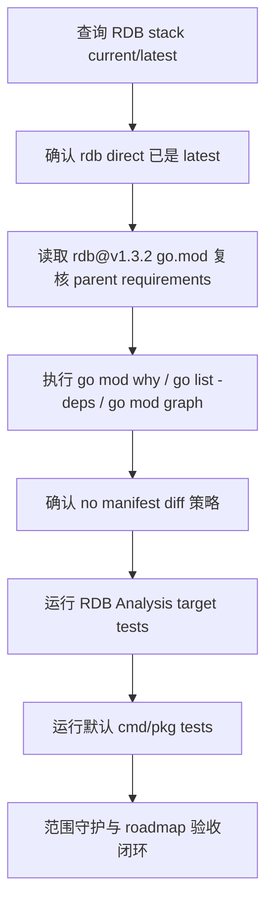

# dep-rdb-analysis-stack design

## 0. 术语约定

- **RDB analysis stack**：本 feature 覆盖的 Go module 组：direct `github.com/hdt3213/rdb`，以及 roadmap 列出的 sonic/bytedance/cpuid/asm/arch 依赖链。
- **RDB parser direct module**：`github.com/hdt3213/rdb`。仓库内实际 import 面在 `pkg/topom/topom_rdb_analysis.go`，使用 `github.com/hdt3213/rdb/model` 和 `github.com/hdt3213/rdb/parser`。
- **RDB dependency chain**：`github.com/hdt3213/rdb@v1.3.2` 的 `go.mod` 中要求的 `github.com/bytedance/sonic v1.15.0` 及其 indirect 依赖；这些 module 在本仓库 `go.mod` 中显式标为 `// indirect`。
- **Package-reachable module**：`go list -deps ./cmd/... ./pkg/...` 中真实导入的 module。当前默认包图只触达 `github.com/hdt3213/rdb` 的 parser/model/core/lzf/memprofiler 包，不触达 sonic/bytedance/base64x/cpuid/asm/arch 包。
- **No manifest diff**：本 feature 目标是确认 direct module 已是 `@latest`，并保留 parent-driven indirect 版本；不为了独立 `@latest` 产生无运行面收益的 `go.mod/go.sum` churn。

防冲突结论：代码和架构文档已有 `RDB Analysis`、`Remote RDB fetch analysis`、`RDB HTTP export` 等术语。本 design 只处理 Go module 版本维护，不新增 RDB Analysis 能力，不改变 remote fetch 或 Redis 8 export 语义。

## 1. 决策与约束

### 需求摘要

本 feature 要确认 RDB Analysis 使用的 `github.com/hdt3213/rdb` 与 sonic/bytedance 依赖链是否需要升级。2026-06-04 查询结果显示：`github.com/hdt3213/rdb` 当前 `v1.3.2` 已等于 `@latest`；其 `go.mod` 仍要求当前 sonic/bytedance 版本；默认 cmd/pkg package graph 不导入 sonic/bytedance/base64x/cpuid/asm/arch 包。因此本条不修改 `go.mod/go.sum`，只通过版本调查、依赖触达和测试证明保留边界。

服务对象是维护 Codis Dashboard RDB Analysis 和 Go modules 构建入口的人。成功标准是：RDB Analysis 编译面继续可通过；default cmd/pkg 测试通过；roadmap 中列出的 direct/indirect module 均有 current/latest/target/mode 记录；最终 diff 不出现无关依赖升级。

明确不做：

- 不升级 `github.com/hdt3213/rdb`，因为当前 `v1.3.2` 已是 `@latest`。
- 不单独把 sonic/bytedance/base64x/cpuid/asm/arch 依赖升到其独立 `@latest`；这些 module 由 `hdt3213/rdb@v1.3.2` 的 `go.mod` parent-driven 保留。
- 不运行无目标全量 `go mod tidy`，不删除当前显式 `// indirect` require，也不重排 require block。
- 不修改 `pkg/topom/topom_rdb_analysis.go`、RDB Analysis API、remote fetch、admin CLI、FE 页面或文档语义。
- 不修改 Redis 8 RDB HTTP export、`extern/redis-8.6.3/`、proxy 路径、coordinator、metrics、jemalloc 或其他 roadmap 子 feature module。
- 不升级 Go toolchain，不改变 `go 1.26.1` module directive。
- 不生成 `vendor/`、`Godeps/` 或 `vendor/modules.txt`。

### 复杂度档位

按“依赖维护 / 技术债”默认档位走，偏离如下：

- Compatibility = backward-compatible：RDB Analysis 的 upload/workspace/remote-fetch 输入、job 生命周期、结果结构和错误语义不能变化。
- Dependency policy = parent-driven：indirect module 独立 `@latest` 不等于必须升级；以 direct `hdt3213/rdb@latest` 的 module graph 为准。
- Testability = verified：必须覆盖 RDB Analysis target packages 和默认 cmd/pkg 测试，证明 parser API 和 dashboard/admin/FE 编译面没有回归。
- Determinism = reproducible：版本证据来自 `GOPROXY=https://proxy.golang.org,direct go list -m ...`、`go mod why`、`go list -deps` 和 `go mod graph`。

### 关键决策

1. **保留 `github.com/hdt3213/rdb v1.3.2`**。
   - 依据：`go list -m -u -json github.com/hdt3213/rdb` 无 Update；`go list -m -json github.com/hdt3213/rdb@latest` 返回 `v1.3.2`。
   - 取舍：执行同版本 `go get` 只能得到 no-op，不应产生 manifest churn。

2. **sonic/bytedance 依赖链不做独立升级**。
   - 依据：`github.com/hdt3213/rdb@v1.3.2.mod` 仍要求 `github.com/bytedance/sonic v1.15.0`、`github.com/bytedance/gopkg v0.1.3`、`github.com/bytedance/sonic/loader v0.5.0`、`github.com/cloudwego/base64x v0.1.6`、`github.com/klauspost/cpuid/v2 v2.2.9`、`golang.org/x/arch v0.9.0`。
   - 取舍：这些 module 的独立 `@latest` 是可见的，但不被当前 direct parent 要求；本仓库注意事项也要求不要顺手现代化 Go 依赖。

3. **不删除显式 indirect require**。
   - 依据：roadmap 覆盖的是 `go.mod` 中 47 个显式 require module；本条是升级/确认，不是清理 unused indirect 的 tidy 子 feature。
   - 取舍：`go mod why -m` 显示部分 module 不被当前 package graph 直接需要，但删除它们需要全量 module 语义收口，不在本条做。

4. **验证聚焦 dashboard/topom RDB Analysis 编译面**。
   - 依据：架构文档把 RDB Analysis 定义为 dashboard/topom 进程内离线分析能力，入口包括 FE upload/workspace 和 dashboard remote fetch，admin CLI 只调用 dashboard API。
   - 取舍：本 feature 不需要真实 Redis export e2e；依赖版本未变化时，target 编译测试和默认测试足以证明 Go API 使用面稳定。

### 前置依赖

roadmap 条目 `dep-rdb-analysis-stack` 依赖 `dep-network-core-stack`，当前已为 `done`。本 design 启动后将 roadmap item 改为 `in-progress`，并写入 feature 目录名。

## 2. 名词与编排

### 2.1 名词层

#### module_set

| module | scope | current | latest query | target | mode |
|---|---:|---|---|---|---|
| `github.com/hdt3213/rdb` | direct | `v1.3.2` | `v1.3.2` | `v1.3.2` | retain-with-note |
| `github.com/bytedance/gopkg` | indirect | `v0.1.3` | `v0.1.4` | `v0.1.3` | parent-driven retain |
| `github.com/bytedance/sonic` | indirect | `v1.15.0` | `v1.15.1` | `v1.15.0` | parent-driven retain |
| `github.com/bytedance/sonic/loader` | indirect | `v0.5.0` | `v0.5.1` | `v0.5.0` | parent-driven retain |
| `github.com/cloudwego/base64x` | indirect | `v0.1.6` | `v0.1.7` | `v0.1.6` | parent-driven retain |
| `github.com/klauspost/cpuid/v2` | indirect | `v2.2.9` | `v2.3.0` | `v2.2.9` | parent-driven retain |
| `github.com/twitchyliquid64/golang-asm` | indirect | `v0.15.1` | `v0.15.1` | `v0.15.1` | retain-with-note |
| `golang.org/x/arch` | indirect | `v0.9.0` | `v0.27.0` | `v0.9.0` | parent-driven retain |

#### 现状

- `pkg/topom/topom_rdb_analysis.go` import `github.com/hdt3213/rdb/model` 和 `github.com/hdt3213/rdb/parser`，并通过 `parser.NewDecoder(file).Parse(...)` 聚合 RDB object。
- `pkg/topom/topom_rdb_analysis_api.go` 暴露 upload/workspace/remote-fetch/get/cancel/remove 的 API handler 和 `ApiClient` 方法。
- `pkg/topom/topom_rdb_analysis_remote_fetch.go` 只负责从当前 product server 拉取 Redis 8 RDB HTTP export，下载完整后复用 RDB Analysis job。
- `go.mod` direct require `github.com/hdt3213/rdb v1.3.2`，并显式保留 sonic/bytedance 依赖链的 `// indirect` require。

#### 变化

- `go.mod/go.sum` 不变化。
- roadmap 覆盖 module 均记录 target/mode；direct `rdb` 已是目标版本，其余 indirect 按 parent-driven 策略保留。
- 测试闭环证明 RDB Analysis、remote fetch API、admin CLI 和 FE 静态入口编译面仍可通过。

### 2.2 编排层

#### 现状

- RDB Analysis 是 dashboard/topom 进程内离线任务，不进入 proxy Redis 请求路径。
- `go mod graph` 显示 main module 显式 require sonic/bytedance 链，且 `hdt3213/rdb@v1.3.2` 也要求同一组版本。
- `go mod why -m` 显示默认 package graph 只需要 `github.com/hdt3213/rdb`；其他 indirect module 不被 main module 当前包直接需要。

#### 变化

- implement 阶段重新执行版本查询和依赖触达命令，确认 design 结论仍成立。
- 不执行任何会修改 `go.mod/go.sum` 的升级命令；如出现意外 diff，先回到设计判断，不用 tidy 掩盖。
- target test gate 覆盖 `go test ./pkg/topom ./cmd/dashboard ./cmd/admin ./cmd/fe`。
- 默认 test gate 覆盖 `go test ./cmd/... ./pkg/...`。

流程级约束：

- **错误语义**：target/default test 失败时先区分既有测试、RDB parser API、remote fetch API 或环境问题；不得通过独立升级 sonic/bytedance 或全量 tidy 掩盖。
- **幂等性**：重复执行版本查询、依赖触达和测试不应改动 `go.mod/go.sum`。
- **兼容性**：RDB Analysis 的 upload/workspace/remote-fetch 输入、安全边界、job source、结果结构、cancel/remove 语义不变。
- **可观测点**：`go list -m -u -json`、`go list -m -json @latest`、`go mod graph`、`go mod why -m`、`go list -deps`、target test、默认 test、`git diff -- go.mod go.sum`、`git status`。

### 2.3 挂载点

- `go.mod` 中 `github.com/hdt3213/rdb v1.3.2` direct require：证明 RDB parser direct module 已在目标版本。
- `go.mod` 中 sonic/bytedance 依赖链的 `// indirect` require：本 feature 的保留对象；删除或升级会改变 module graph 边界。
- `pkg/topom/topom_rdb_analysis.go` 的 `github.com/hdt3213/rdb/*` import：证明 RDB Analysis parser 使用面被测试覆盖。
- target test gate：证明 dashboard/topom RDB Analysis 和 admin/FE 入口编译面仍可通过。
- roadmap item：记录本合并子 feature 完成，不让后续重复推进同一组 module。

拔除方式：本 feature 无 manifest/code 变化；若要撤销，只需移除本 feature spec/acceptance，并把 roadmap item 从 `done` 回到未执行状态。

### 2.4 推进策略

1. **版本调查复核**：重新执行 `go list -m -u -json`、`go list -m -json @latest` 覆盖 module_set。
   - 退出信号：`github.com/hdt3213/rdb` 仍是 `v1.3.2` 且无 Update；indirect latest 与 design 表一致。
2. **父依赖复核**：读取 `github.com/hdt3213/rdb@v1.3.2.mod` 并执行 `go mod graph`。
   - 退出信号：`rdb@v1.3.2` 仍要求当前 sonic/bytedance 版本；main module graph 与 design 一致。
3. **依赖触达分类**：执行 `go mod why -m` 与 `go list -deps ./cmd/... ./pkg/...`。
   - 退出信号：默认包图只直接触达 `hdt3213/rdb` parser/model/core 等包；sonic/bytedance 链不在实际 import graph。
4. **manifest no-op 守护**：确认无需执行升级，核对 `git diff -- go.mod go.sum`。
   - 退出信号：`go.mod/go.sum` 无 diff；`go 1.26.1` 和 jemalloc replace 保留。
5. **RDB Analysis target 测试**：运行 `go test ./pkg/topom ./cmd/dashboard ./cmd/admin ./cmd/fe`。
   - 退出信号：RDB Analysis manager/API/remote fetch/admin/FE 编译测试通过。
6. **默认构建测试闭环**：运行 `go test ./cmd/... ./pkg/...`。
   - 退出信号：默认 cmd/pkg 测试通过，不报 module version、vendor mode 或 RDB parser API 不兼容错误。
7. **范围守护与临时产物清理**：核对最终 diff、vendor/Godeps、roadmap 文档状态。
   - 退出信号：diff 仅包含本 feature spec 和 roadmap 状态；无 Go 源码、配置、部署、extern、vendor/Godeps 或 module churn。

### 2.5 结构健康度与微重构

compound 检索：不命中与本 feature 直接冲突的 dependency decision；沿用 `.codestable/attention.md` 中“不要全量 go mod tidy”和“不顺手现代化 Go 依赖”的项目约束。

文件级：

- `go.mod`：职责单一，本次不改版本、不重排 require block。
- `pkg/topom/topom_rdb_analysis.go`：文件偏大，但本次不新增 RDB 逻辑；为依赖确认而拆文件收益低且风险无关。
- `pkg/topom/topom_rdb_analysis_api.go` / `pkg/topom/topom_rdb_analysis_remote_fetch.go`：职责清晰，本次不改。

目录级：

- `pkg/topom/` 已按 RDB Analysis 拆出 manager、API 和 remote fetch 文件；本次不新增文件。
- `.codestable/features/2026-06-04-dep-rdb-analysis-stack/` 是标准 feature 目录。

结论：本次不做微重构。原因：本 feature 是 dependency inventory 确认和测试闭环，不追加运行期逻辑；拆 RDB Analysis 大文件或整理 topom 目录应另走 refactor 流程。

## 3. 验收契约

关键场景：

- **S1**：执行 `go list -m -u -json github.com/hdt3213/rdb`。期望：当前 `v1.3.2`，无 Update。
- **S2**：执行 `go list -m -json github.com/hdt3213/rdb@latest`。期望：`@latest` 等于 `v1.3.2`。
- **S3**：对 module_set 的 indirect 执行 `go list -m -u -json` 和 `go list -m -json @latest`。期望：latest 与 design 表一致，且 sonic/loader 不默认升 dev pre-release。
- **S4**：读取 `github.com/hdt3213/rdb@v1.3.2.mod`。期望：父 module 仍要求当前 sonic/bytedance 版本。
- **S5**：执行 `go mod graph` 并 grep RDB stack。期望：main module 和 `hdt3213/rdb@v1.3.2` 的 module graph 与 design 一致。
- **S6**：执行 `go mod why -m` 覆盖 RDB stack。期望：main module 只需要 `github.com/hdt3213/rdb`；其他 indirect 不被当前 package graph 直接需要。
- **S7**：执行 `go list -deps ./cmd/... ./pkg/...` 并 grep RDB stack。期望：默认包图触达 `github.com/hdt3213/rdb` parser/model/core/lzf/memprofiler 包，不触达 sonic/bytedance 依赖包。
- **S8**：检查 `git diff -- go.mod go.sum`。期望：无输出。
- **S9**：运行 `go test ./pkg/topom ./cmd/dashboard ./cmd/admin ./cmd/fe`。期望：通过。
- **S10**：运行 `go test ./cmd/... ./pkg/...`。期望：通过。
- **S11**：重复验收后查看 `git status --short --untracked-files=all`。期望：不生成 `vendor/`、`Godeps/`、`vendor/modules.txt` 或仓库内临时构建产物。

反向核对项：

- Diff 不应修改 `go.mod/go.sum`。
- Diff 不应修改 RDB Analysis manager、API、remote fetch、admin CLI、FE 或文档中的行为语义。
- Diff 不应修改 proxy、coordinator、Redis 8 export、metrics、jemalloc、Docker、部署脚本或配置模板。
- Diff 不应升级其他 roadmap 子 feature 覆盖的 module。

## 4. 架构归并计划

- `.codestable/architecture/ARCHITECTURE.md`：预计不更新。理由：当前架构已记录 RDB Analysis 使用 `github.com/hdt3213/rdb`，本 feature 不新增模块、接口或运行期流程。
- `.codestable/attention.md`：预计不更新。理由：既有“不运行全量 go mod tidy”和“不顺手现代化 Go 依赖”已覆盖本 feature 的关键约束。
- requirement：`null`。本 feature 是依赖维护 / 技术债，不新增用户可感能力。
