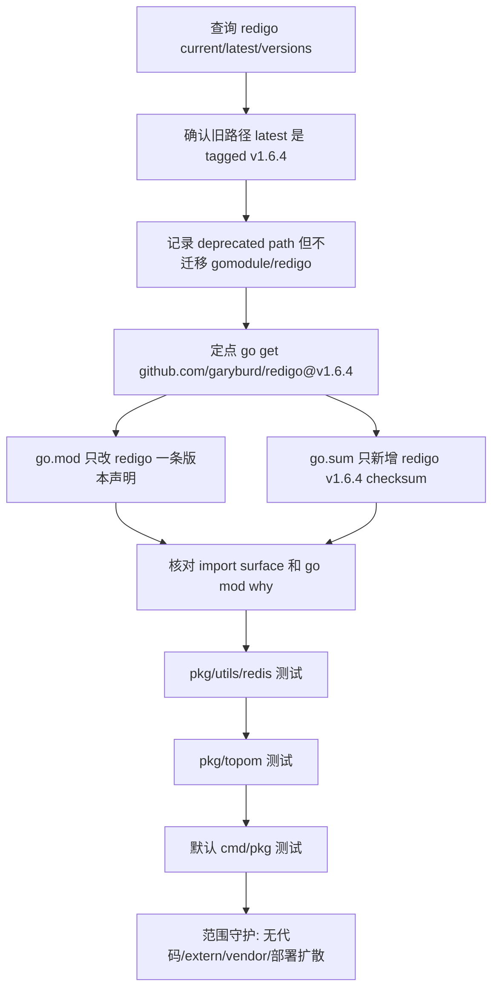

# dep-redis-client-stack design

## 0. 术语约定

- **Redis client stack**：本 feature 覆盖的 Go module `github.com/garyburd/redigo`，以及本仓库对它的直接封装 `pkg/utils/redis.Client` / `pkg/utils/redis.Sentinel`。它不是 proxy 内部 RESP codec `pkg/proxy/redis`，也不是 Redis Server 源码。
- **Target module version**：按 roadmap 第 4.1 节用 `GOPROXY=https://proxy.golang.org,direct go list -m ...` 查询到的旧 module path `@latest` tagged release。本次查询结果是 `github.com/garyburd/redigo v1.6.4`。
- **Deprecated module path note**：`go list -m -u -json github.com/garyburd/redigo` 对当前旧路径返回 `Deprecated: Use github.com/gomodule/redigo instead.`；`github.com/gomodule/redigo @latest` 当前是 `v1.9.3`。本条仍按 roadmap 做同路径升级，不迁移 import path。
- **Minimal module diff**：只让 `go.mod` 的 redigo 版本声明和 `go.sum` 的目标版本 checksum 变化；不借机全量 `go mod tidy`，不重排依赖块。

防冲突结论：代码和 CodeStable 文档里已有 `Redis client`、`Go module manifest`、`Minimal module diff`、`pkg/proxy/redis`、`RedisAuthIdentity` 等叫法。本 design 沿用既有术语，并明确 `Redis client stack` 不指 proxy 的 RESP codec。

## 1. 决策与约束

### 需求摘要

本 feature 要把 `go.mod` 中 `github.com/garyburd/redigo` 从 `v1.0.1-0.20170208211623-48545177e92a` 升级到 `v1.6.4`，并验证 Codis 通过 redigo 访问 Redis/Sentinel 的关键路径：连接、password/named `AUTH`、`SELECT`、`INFO`/`CONFIG`、同步/异步 slot 迁移、ACL 管理调用、Sentinel pub/sub / monitor 和 Sentinel script 配置透传。

服务对象是维护 Codis 运行期 Redis 管理路径和依赖安全的人。成功标准是：`go.mod/go.sum` 只出现 redigo 的最小机械变化，Go 代码行为不变，默认 `go test ./cmd/... ./pkg/...` 通过，`pkg/utils/redis` 与 `pkg/topom` 的 Redis client 关键测试通过。

明确不做：

- 不把 import path 从 `github.com/garyburd/redigo/redis` 迁移到 `github.com/gomodule/redigo/redis`；这是 module path/API 迁移，不是本 roadmap 条目的同路径版本升级。
- 不替换 Redis client library，不引入 go-redis 或其他新 client。
- 不修改 `pkg/utils/redis.Client` / `Pool` / `InfoCache` / `Sentinel` 的公开方法、错误包装方式、pipeline 计数、连接复用或 timeout 语义。
- 不修改 `RedisAuthIdentity`、`AUTH [username] password`、replication `masteruser/masterauth`、ACL 同步或 migration auth 语义。
- 不修改 slot migration 编排、`SLOTSMGRTTAGSLOT` / `SLOTSMGRTTAGSLOT-ASYNC` 参数、返回 `[migrated_count, remaining_count]` 的解析，或 Redis 8 adapter 行为。
- 不修改 `pkg/proxy/redis` 的 RESP codec、proxy client session、本地 `AUTH`/`SELECT` 处理、Stream/hot key cache/ACL 路由。
- 不把 proxy `EVAL` / `EVALSHA` 路由当成本 feature 的 redigo script 调用路径；代码中没有 `redigo.Script` / `NewScript` 用法，proxy script 命令走 `pkg/proxy/redis` RESP codec，不走 redigo。
- 不修复或接入 `extern/deprecated/redis-test`；它引用 redigo，但不在默认 `cmd/pkg` gate 内，且当前 `go test ./extern/deprecated/redis-test/...` 已因既有 vet/format 问题失败。
- 不升级 Martini、coordinator、RDB analysis、metrics、jemalloc 或其他 roadmap 子 feature 覆盖的 module。
- 不升级 Go toolchain，不改变 `go 1.26.1` module directive。
- 不修改 `third_party/jemalloc-go`、`extern/redis-8.6.3/`、Docker、部署脚本、前端资源或配置模板。

### 复杂度档位

按“项目内部依赖维护”默认档位走，偏离如下：

- Compatibility = backward-compatible：依赖版本升级不能改变 Codis Redis 管理命令、proxy/topom/coordinator 或 ACL/migration 行为。
- Determinism = reproducible：版本目标和 checksum 必须来自 Go module query 与 `go.mod/go.sum`，不能依赖本地 module cache 状态。
- Testability = verified：本组触达 Redis 连接和迁移控制面，必须覆盖 `pkg/utils/redis`、`pkg/topom` 和默认 cmd/pkg 测试。

### 关键决策

1. **目标版本采用旧 module path 的 `@latest` tagged release `v1.6.4`**。
   - 依据：2026-06-04 执行 `go list -m -json github.com/garyburd/redigo@latest`，返回 `v1.6.4`，时间为 `2022-08-31T18:07:03Z`，不是 pseudo version 或 pre-release。
   - 约束：如果 implement 阶段查询结果变化，必须记录实际命令结果；不能猜测上游版本。

2. **暂不迁移到 `github.com/gomodule/redigo`**。
   - 依据：`github.com/garyburd/redigo` 的 module metadata 已提示 deprecated，且 `github.com/gomodule/redigo @latest` 当前为 `v1.9.3`；但 roadmap 本条明确覆盖 module 是 `github.com/garyburd/redigo`，目标是 `v1.6.4`。
   - 取舍：迁移新 module path 会同时改 import path、module identity 和目标版本，风险与验收面大于本条依赖升级；应另起 roadmap/feature 决定。

3. **只改 manifest，不改 Redis client 封装代码**。
   - 依据：现有调用面使用 redigo 稳定入口：`redis.Conn`、`Dial`、`DialConnectTimeout`、`DialReadTimeout`、`DialWriteTimeout`、`Do`、`Send`、`Flush`、`Receive`、`Error`、`String`、`Values`、`Ints`、`Strings`、`StringMap`。临时 detached worktree 试跑定点升级后，`go test ./pkg/utils/redis`、`go test ./pkg/topom` 和 `go test ./cmd/... ./pkg/...` 均通过。
   - 约束：如果 implement 阶段出现 API 不兼容，应暂停回到 design/roadmap 讨论保留版本或扩大范围，不能顺手重写 Redis client 行为。

4. **把 `extern/deprecated/redis-test` 视为触点观察，不作为验收 gate**。
   - 依据：`go mod why -m github.com/garyburd/redigo` 会追溯到 `extern/deprecated/redis-test`，且该目录也直接 import `github.com/garyburd/redigo/redis`；但 roadmap 本条不覆盖 `extern/`，默认验收命令是 `go test ./cmd/... ./pkg/...`。
   - 观察：当前 `go test ./extern/deprecated/redis-test/...` 不依赖本次升级也会因既有 `fmt`/vet 问题失败。本 feature 不修它，也不把它新增为阻塞 gate。

### 前置依赖

roadmap 条目 `dep-redis-client-stack` 没有 `depends_on`，启动前状态为 `planned`。本 design 启动后将 roadmap item 改为 `in-progress`，并写入 feature 目录名。

## 2. 名词与编排

### 2.1 名词层

#### module_set

现状：

| module | scope | current | latest query | current source | reachability |
|---|---:|---|---|---|---|
| `github.com/garyburd/redigo` | direct | `v1.0.1-0.20170208211623-48545177e92a` | `v1.6.4` | `go.mod:10` | `pkg/utils/redis`, `extern/deprecated/redis-test` |

变化：

```text
feature_slug: dep-redis-client-stack
module_set:
  - module_path: github.com/garyburd/redigo
    current_version: v1.0.1-0.20170208211623-48545177e92a
    target_version: v1.6.4
    scope: direct
    replace_path: null
    upgrade_mode: direct-go-get
```

接口示例：

```diff
-	github.com/garyburd/redigo v1.0.1-0.20170208211623-48545177e92a
+	github.com/garyburd/redigo v1.6.4
```

来源：`go-dependency-upgrade` roadmap 第 4.2 节合并子 feature 升级契约，以及 2026-06-04 实际 `go list` 查询。

#### checksum lockfile

现状：

- `go.sum` 已包含 `github.com/garyburd/redigo v1.0.1-0.20170208211623-48545177e92a` 的 content checksum 和 `go.mod` checksum。
- 旧版本 checksum 不主动删除，避免把本条变成全量依赖整理。

变化：

- 新增 2 条目标版本 checksum：

```text
github.com/garyburd/redigo v1.6.4 h1:LFu2R3+ZOPgSMWMOL+saa/zXRjw0ID2G8FepO53BGlg=
github.com/garyburd/redigo v1.6.4/go.mod h1:rTb6epsqigu3kYKBnaF028A7Tf/Aw5s0cqA47doKKqw=
```

来源：临时 detached worktree 中执行 `GOPROXY=https://proxy.golang.org,direct go get github.com/garyburd/redigo@v1.6.4` 后的 `go.sum` diff。

#### import surface

现状：

- `pkg/utils/redis/client.go:17` 直接 import `github.com/garyburd/redigo/redis`，并在 `Client` 中持有 `redigo.Conn`。
- `pkg/utils/redis/client.go:49` 到 `pkg/utils/redis/client.go:52` 用 redigo `Dial` 和 timeout option 建立连接；`pkg/utils/redis/client.go:56` 到 `pkg/utils/redis/client.go:60` 发送 password-only 或 named `AUTH`。
- `pkg/utils/redis/client.go:85` 到 `pkg/utils/redis/client.go:129` 包装 `Do`、`Send`、`Flush`、`Receive`，并把 `redigo.Error` 转成项目错误。
- `pkg/utils/redis/client.go:132` 到 `pkg/utils/redis/client.go:142` 维护 `SELECT` 后的当前 DB 记录；`pkg/utils/redis/client.go:220` 到 `pkg/utils/redis/client.go:248` 处理 replication 配置与 `EXEC` 响应；`pkg/utils/redis/client.go:276` 到 `pkg/utils/redis/client.go:315` 解析同步/异步迁移返回。
- `pkg/utils/redis/sentinel.go:18` 直接 import redigo，`pkg/utils/redis/sentinel.go:109` 到 `pkg/utils/redis/sentinel.go:160` 使用 `SUBSCRIBE`/`Receive` 解析 Sentinel 事件，`pkg/utils/redis/sentinel.go:249` 到 `pkg/utils/redis/sentinel.go:316` 解析 Sentinel masters/slaves。
- `pkg/utils/redis/sentinel.go:465` 到 `pkg/utils/redis/sentinel.go:490` 通过 redigo `Send` / `Flush` 透传 Sentinel `notification-script` 和 `client-reconfig-script` 配置；这是本条能对应到的 script 相关 redigo 调用路径。
- 上层通过封装间接触达 redigo：`pkg/topom/topom.go:99` 创建迁移连接池，`pkg/topom/topom_slots.go:395` 到 `pkg/topom/topom_slots.go:422` 执行 `SELECT` 和 slot migration，`pkg/topom/topom_acl.go:279` 到 `pkg/topom/topom_acl.go:333` 执行 Redis ACL 管理命令，`pkg/topom/topom_api.go:423` 到 `pkg/topom/topom_api.go:432` 验证 `SLOTSINFO`，`cmd/ha/main.go:295` 到 `cmd/ha/main.go:301` 连接 slave 并发起 `SHUTDOWN`。
- `rg "redigo\\.Script|NewScript|EVAL|EVALSHA|notification-script|client-reconfig-script"` 显示 `EVAL` / `EVALSHA` 只出现在 proxy RESP/route 测试和 hot key cache 路径，不是 redigo 调用面。
- `extern/deprecated/redis-test/utils.go:24`、`extern/deprecated/redis-test/extra_incr.go:11`、`extern/deprecated/redis-test/bench/benchmark.go:20` 也直接 import redigo，但不在默认 cmd/pkg 验收范围内。

变化：

- import surface 不变。
- 继续使用旧 import path `github.com/garyburd/redigo/redis`。
- `pkg/utils/redis` 对上层暴露的 `Client`、`Pool`、`InfoCache`、`Sentinel` API 不变。
- `extern/deprecated/redis-test` 不改动。

### 2.2 编排层



现状：

- roadmap 把本条归入 `low-risk-runtime-stacks`，目标是升级 `github.com/garyburd/redigo`，验证 Redis 连接、`AUTH`、`SELECT`、迁移和脚本调用路径。
- `go.mod` 当前 direct require 旧 redigo pseudo version；默认 `cmd/pkg` 构建路径触达 `github.com/garyburd/redigo/internal` 与 `github.com/garyburd/redigo/redis`。
- 临时 detached worktree 试跑定点升级后，`go.mod` 只变 redigo 一行，`go.sum` 只新增 2 行，`go test ./pkg/utils/redis`、`go test ./pkg/topom`、`go test ./cmd/... ./pkg/...` 通过。

变化：

- implement 阶段先重新查询版本和 deprecated metadata，再执行定点 `go get`。
- 验证顺序从 module manifest 到 Redis client 关键包，再到默认 cmd/pkg 测试。
- 如果测试失败，先判断是 redigo API/行为不兼容、测试环境问题还是既有代码问题；不得用全量 `go mod tidy`、import path 迁移或业务代码重写掩盖失败。

流程级约束：

- **顺序约束**：版本查询 -> deprecated path 记录 -> 定点升级 -> diff 守护 -> Redis client 包测试 -> topom 测试 -> 默认测试；不能先迁移 module path 或全量整理依赖图。
- **错误语义**：`AUTH`、`SELECT`、`SLOTSINFO`、migration、Sentinel response 解析或 ACL 同步相关测试失败即视为本 feature 未完成；若错误来自上游 API 不兼容，必须回到 design/roadmap 讨论是否保留版本。
- **幂等性**：重复执行定点 `go get` 和验收命令不应继续改动 `go.mod/go.sum`，也不生成 `vendor/`、`Godeps/`、`vendor/modules.txt`。
- **兼容性**：Redis 管理命令、ACL/migration/auth 语义、proxy RESP codec、coordinator 和运行配置保持不变。
- **可观测点**：`go list -m -u -json`、`go list -m -versions -json`、`go.mod` diff、`go.sum` diff、`go mod why -m`、`go list -deps ./cmd/... ./pkg/...`、`go test ./pkg/utils/redis`、`go test ./pkg/topom`、`go test ./cmd/... ./pkg/...`、`git status --short`。

### 2.3 挂载点清单

- `go.mod` 中 `github.com/garyburd/redigo` direct require：删除或回退后，Redis client stack 的版本升级消失。
- `go.sum` 中 `github.com/garyburd/redigo v1.6.4` checksum：删除后 clean checkout 不能用 lockfile 证明目标版本内容。
- `pkg/utils/redis` target test gate：删除后，本条无法证明 Codis redigo 封装的 `AUTH`、`SELECT`、迁移响应和转换 helper 仍可工作。
- `pkg/topom` target test gate：删除后，本条无法证明 topom 通过 Redis client 执行 slot migration、stats、ACL/Sentinel script 配置相关路径仍可编译测试。
- 默认 cmd/pkg test gate：删除后，本条无法证明 dashboard/proxy/admin/ha 入口和 shared packages 在 redigo 升级后仍完整通过。

### 2.4 推进策略

1. **版本调查复核**：重新执行 `go list -m -u -json`、`go list -m -json @latest`、`go list -m -versions -json` 覆盖 `github.com/garyburd/redigo`，并记录 deprecated path metadata。
   - 退出信号：旧路径目标仍是 tagged `v1.6.4`；deprecated note 被记录；如变化则记录实际结果并暂停确认。

2. **依赖触达和迁移边界确认**：执行 `go mod why -m github.com/garyburd/redigo`、`go list -deps ./cmd/... ./pkg/...`，并复核 direct import surface。
   - 退出信号：默认 cmd/pkg 仍触达 redigo；直接 import 仅在 `pkg/utils/redis` 和 `extern/deprecated/redis-test`；本条继续保留旧 import path，不迁移 `gomodule/redigo`。

3. **module manifest 定点升级**：执行 `GOPROXY=https://proxy.golang.org,direct go get github.com/garyburd/redigo@v1.6.4`。
   - 退出信号：`go.mod` 只把 `github.com/garyburd/redigo` 改到 `v1.6.4`；`go 1.26.1` 和 `jemalloc-go` replace 保留。

4. **checksum 与依赖图收口**：核对 `go.sum`、module graph 和导入路径。
   - 退出信号：`go.sum` 只新增 redigo `v1.6.4` 的 content/go.mod checksum；没有无关 module churn；import path 未迁移。

5. **Redis client target 测试**：运行 `go test ./pkg/utils/redis`。
   - 退出信号：连接、AUTH、SELECT、INFO/CONFIG、SetMaster、SLOTSINFO、sync/async migration 和 auth identity 相关测试通过。

6. **Topom 集成路径测试**：运行 `go test ./pkg/topom`。
   - 退出信号：topom stats、slot action、ACL/Sentinel script 配置相关 Redis client 调用路径通过。

7. **默认构建测试闭环**：运行默认 cmd/pkg 测试。
   - 退出信号：`go test ./cmd/... ./pkg/...` 通过，不报 module version、vendor mode 或 API 不兼容错误。

8. **范围守护与临时产物清理**：核对最终 diff 和仓库状态。
   - 退出信号：diff 仅包含 `go.mod`、`go.sum`、本 feature spec 和 roadmap item 状态；不出现 `extern/`、vendor/Godeps、配置模板、部署脚本、前端资源或仓库内临时构建产物。

### 2.5 结构健康度与微重构

##### 评估

- compound convention：已用 `.codestable/tools/search-yaml.py` 搜索 `redigo redis client dependency upgrade go.mod go.sum` 与 `目录组织 文件归属 命名约定 go.mod dependency module`，无匹配文档。
- 文件级 - `go.mod`：当前 direct require block 仍是依赖 manifest 的单一职责入口；本次只改 redigo 一条版本声明，不需要重排 require block。
- 文件级 - `go.sum`：已有历史 checksum，Go toolchain 会追加目标版本校验；不手工清理旧 checksum，避免把最小升级扩大成全量整理。
- 文件级 - `pkg/utils/redis/client.go`：Redis client 封装承担连接、auth、命令封装、pool 和 Redis server 管理 helper，文件偏长但本次不新增逻辑；依赖升级不要求拆分。
- 文件级 - `pkg/utils/redis/sentinel.go`：Sentinel 管理逻辑偏集中，但本次不新增流程；redigo 升级不要求拆分。
- 文件级 - `extern/deprecated/redis-test/*`：deprecated 辅助代码有既有 vet/format 问题，本 feature 不修改。
- 目录级 - 仓库根目录：`go.mod/go.sum` 已是既有标准入口，本次不新增根目录文件。
- 目录级 - `pkg/utils/redis`：目录职责明确承载 Redis helper；本次不新增文件，不改变目录组织。

##### 结论：不做前置微重构

原因：本 feature 是依赖 manifest 的定点版本升级，不是在胖文件里追加逻辑，也不新增目录结构。拆分 `client.go` / `sentinel.go`、迁移 `gomodule/redigo` 或修复 `extern/deprecated/redis-test` 都不是升级旧路径 redigo 到 `v1.6.4` 的前置条件。

##### 超出范围的观察

- `github.com/garyburd/redigo` 旧 module path 已 deprecated。后续如果维护目标是继续跟进 redigo 新版本，应另起 feature 评估迁移到 `github.com/gomodule/redigo`，并把 import path、module identity、目标版本和运行期 smoke 一起纳入验收。
- `pkg/utils/redis/client.go` 与 `pkg/utils/redis/sentinel.go` 都是历史集中式 helper。后续如果继续新增 Redis 管理能力，建议先走 `cs-refactor` 评估是否拆分 client/pool/server-admin/sentinel 职责。

## 3. 验收契约

### 关键场景清单

- 触发：执行 `GOPROXY=https://proxy.golang.org,direct go list -m -json github.com/garyburd/redigo@latest`。期望：返回 tagged `v1.6.4`，不是 pseudo 或 pre-release。
- 触发：执行 `GOPROXY=https://proxy.golang.org,direct go list -m -u -json github.com/garyburd/redigo`。期望：当前版本为 `v1.0.1-0.20170208211623-48545177e92a`，update 为 `v1.6.4`，并记录 deprecated path note。
- 触发：执行 `GOPROXY=https://proxy.golang.org,direct go list -m -versions -json github.com/garyburd/redigo`。期望：版本列表包含 `v1.6.4`，且本条不选择 deprecated marker tag `v1.6.1-Deprecated-please-use-github-dot-com-gomodule-redigo`。
- 触发：执行 `GOPROXY=https://proxy.golang.org,direct go list -m -json github.com/gomodule/redigo@latest`。期望：只作为观察记录；本 feature 不把目标切到该 module path。
- 触发：执行定点 `go get` 后检查 `go.mod`。期望：只有 `github.com/garyburd/redigo` 改为 `v1.6.4`；`go 1.26.1` 和 `replace github.com/spinlock/jemalloc-go => ./third_party/jemalloc-go` 不变。
- 触发：检查 `go.sum` diff。期望：新增 redigo `v1.6.4` 的 content/go.mod checksum；不出现无关 module 大量 churn。
- 触发：执行 `go mod why -m github.com/garyburd/redigo`。期望：仍可追溯到旧 import path，且 `extern/deprecated/redis-test` 仅作为触点观察，不扩展本条范围。
- 触发：执行 `go list -deps ./cmd/... ./pkg/... | rg "github.com/garyburd/redigo"`。期望：默认 cmd/pkg 依赖仍触达 `github.com/garyburd/redigo/internal` 和 `github.com/garyburd/redigo/redis`。
- 触发：执行 `go test ./pkg/utils/redis`。期望：Redis client 封装测试通过，覆盖 `AUTH`、named auth、`SELECT`、`INFO`/`CONFIG`、`SLOTSINFO`、同步/异步迁移返回解析。
- 触发：执行 `go test ./pkg/topom`。期望：topom 通过 Redis client 的 stats、slot action、ACL/Sentinel 相关测试通过。
- 触发：搜索 `redigo.Script`、`NewScript`、`EVAL`、`EVALSHA` 与 Sentinel script 配置调用面。期望：本 feature 只验证 Sentinel `notification-script` / `client-reconfig-script` 配置透传；proxy `EVAL` / `EVALSHA` 仍不走 redigo。
- 触发：执行 `go test ./cmd/... ./pkg/...`。期望：默认 cmd/pkg 测试通过。
- 触发：重复执行验收命令后查看 `git status --short`。期望：不生成 `vendor/`、`Godeps/`、`vendor/modules.txt`，不修改 tracked source 之外的预期文件。

### 明确不做的反向核对项

- Diff 不应包含 `pkg/utils/redis/client.go`、`pkg/utils/redis/sentinel.go`、`RedisAuthIdentity` 或上层 topom/proxy Redis 运行逻辑改动。
- Diff 不应把 import path 改为 `github.com/gomodule/redigo/redis`。
- Diff 不应修改 `pkg/proxy/redis` RESP codec、proxy session `AUTH`/`SELECT`、Stream、hot key cache 或 ACL 路由。
- Diff 不应把 proxy `EVAL` / `EVALSHA` 路由或 hot key cache script invalidation 逻辑纳入 redigo 升级范围。
- Diff 不应修改 slot migration 编排、`SLOTSMGRT*` 参数、返回解析或 Redis 8 adapter 行为。
- Diff 不应修改 `extern/deprecated/redis-test`，也不应把该目录既有失败引入本 feature gate。
- Diff 不应升级 Martini、coordinator、RDB parser、metrics、jemalloc 或其他 roadmap 子 feature 覆盖的 module。
- Diff 不应修改 `third_party/jemalloc-go`、`extern/redis-8.6.3`、Docker、部署脚本、前端资源或配置模板。
- Diff 不应生成 `vendor/modules.txt` 或新增 vendor/Godeps 目录。
- Diff 不应改变 `go 1.26.1` module directive。

## 4. 与项目级文档的关系

本 feature 不新增运行期能力，不改变 `redis-cluster-service` 或 `platform-release-artifacts` 的用户故事；它维护的是既有 Go modules 构建入口和 Redis client 依赖版本。acceptance 阶段应回写 roadmap item 为 `done`，但默认不需要更新 `.codestable/architecture/ARCHITECTURE.md` 或 requirement 文档，除非实现阶段发现 redigo 升级迫使 Redis client 封装、module path 或构建契约发生结构变化。
