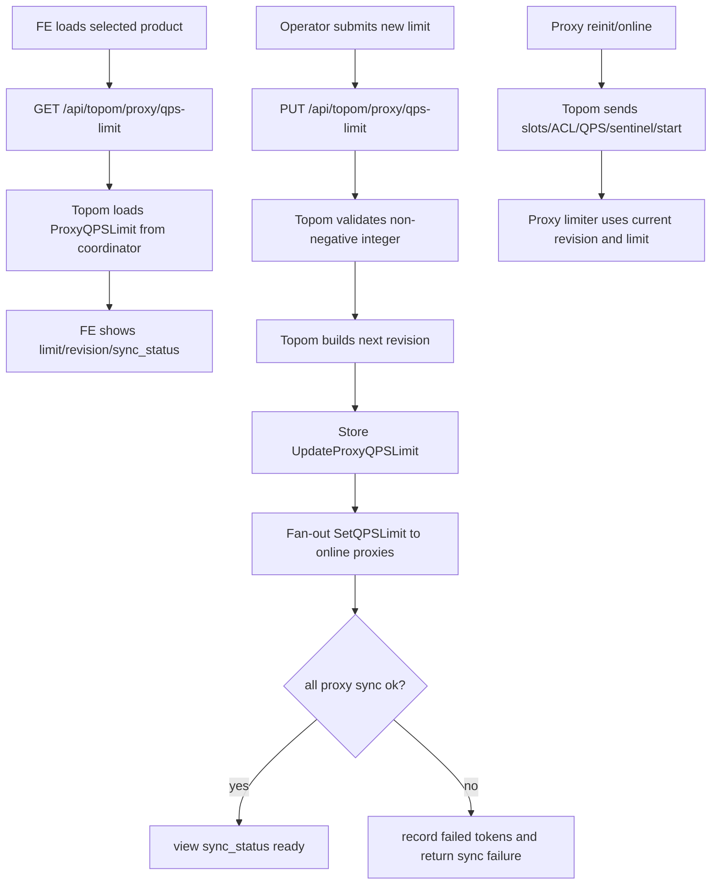

# proxy-qps-rate-limit design

## 0. 术语约定

- **Proxy QPS limit**：本 feature 指单个 codis-proxy 进程内的总请求 QPS 上限。`0` 表示不限流，正整数表示该 proxy 在当前运行配置下每秒最多接受多少条普通 Redis 请求。
- **Accepted request**：proxy 从客户端连接中成功解码出一条 Redis multi bulk，并通过 QPS limiter 检查后继续进入现有 `Session.handleRequest` / `Router.dispatch` 的请求。
- **Rejected request**：proxy 成功解码请求，但由于当前 proxy QPS budget 不足，直接返回 Redis error，不访问后端 Redis，不进入 slot 迁移、hot key cache 或 stream resolver。
- **QPS limiter**：proxy 进程内共享的 token bucket 运行态。它服务于所有 client session，不按客户端、DB、命令、slot 或后端 group 分桶。
- **Dashboard-managed QPS config**：dashboard/topom 维护在 coordinator 中的 product 级 proxy QPS 目标配置，并把它下发给当前 online proxy。
- **Local dynamic apply**：proxy admin API 接收 dashboard/topom 下发的配置并运行期更新本 proxy limiter，不重启 proxy。
- **Redis protocol CONFIG SET**：业务客户端通过 codis-proxy Redis 协议发送的 `CONFIG SET`。现状中 `CONFIG` 在 `pkg/proxy/mapper.go:78` 被标为 `FlagNotAllow`，`doc/unsupported_cmds.md:39` 也列为不支持。

防冲突结论：本文的 QPS limit 是 codis-proxy 普通请求入口保护，不是 Redis 8 RDB HTTP export 的 `codis-rdb-export-rate-limit`，不是 hot key cache 的 per-key 观测，也不是跨 proxy 的全局集群限流。

## 1. 决策与约束

### 需求摘要

目标是给 codis-proxy 增加可运行期调整的 QPS 限流能力，并让 dashboard/topom 成为统一管理面，FE 提供配置入口。成功标准是：默认配置下现有 proxy 行为不变；设置正数阈值后，单个 proxy 的普通请求超过 QPS budget 时返回明确 Redis error；dashboard 更新阈值后能写入 coordinator 并下发给所有 online proxy；新上线或 reinit 的 proxy 能收到当前目标配置；FE 能展示当前 limit、revision 和同步状态，并提交新阈值。

假设：

- `proxy_qps_limit = 0` 表示不限流；`proxy_qps_limit = N` 表示每个 proxy 进程各自最多接受约 N QPS。若集群有 3 个 proxy，总体可承载上限约为 `3 * N`，不是所有 proxy 共享一个 N。
- 限流单位是“请求条数”，不是字节数、pipeline 批次数、后端 roundtrip 数或命令复杂度。一个 pipeline 中的每条命令独立消耗一次 budget。
- 限流超过阈值时首版选择立即返回 Redis error，而不是等待 token。等待会让 session reader 阻塞并放大 pipeline 积压，和当前 proxy 的低延迟转发模型冲突。
- `AUTH`、`QUIT` 和 dashboard/admin 下发配置使用的 proxy admin HTTP API 不被 QPS limit 阻断，避免限流配置错误后无法认证、退出或恢复。
- 首版不追求多个 proxy 之间的严格公平；dashboard 统一下发同一个目标值，真正限流由各 proxy 本地执行。

明确不做：

- 不实现跨 proxy 的分布式 token bucket，不把每秒可用额度写入 coordinator，也不让 proxy 之间相互借用额度。
- 不做 per-client、per-IP、per-user、per-command、per-DB、per-slot、per-key 或 per-backend group 的细粒度限流。
- 不做自动扩缩容或根据 proxy stats 自动调整阈值；阈值来自配置。
- 不把 rejected request 转发到后端 Redis，也不排队等待后端空闲。
- 不改变 `proxy_max_clients`、`session_max_pipeline`、`session_auth_bruteforce`、ACL、hot key cache、stream routing 或 slot migration 的语义。
- 不开放完整 Redis `CONFIG` 命令族给业务客户端。若 review 确认必须支持 Redis protocol `CONFIG SET proxy_qps_limit <N>`，也只能作为精确字段的受控例外，且需要先确认 admin identity 策略；否则默认动态修改走 dashboard/topom API 和 proxy admin API。
- 不在 FE 做复杂策略编辑器，只提供当前阈值的查看、输入、提交、刷新和错误展示。

### 复杂度档位

- Compatibility = backward-compatible：默认 `0` 不限流，旧 proxy 配置、dashboard、FE 和业务请求行为保持不变。
- Performance = hot-path budgeted：limiter 检查在每条请求热路径上，只能做 O(1) 时间读取/更新，不访问 coordinator、不发 HTTP、不持有重锁。
- Concurrency = thread-safe：多个 session reader goroutine 并发消耗同一个 proxy limiter budget。
- Operations = dashboard-managed：product 级目标配置由 dashboard/topom 持久化和 fan-out，proxy admin API 只负责运行期应用。
- Observability = operational：proxy stats 暴露 limit、accepted/rejected、当前 token 或近似状态；dashboard view 暴露 revision 和 proxy sync status。
- Testability = unit + API：proxy limiter 和 session 行为可用 package test 覆盖；topom fan-out 可用 fake proxy admin server；FE 做静态交互和 API payload 验证。

### 关键决策

1. **限流归属在 codis-proxy 进程内，不放到后端 Redis 或 dashboard 请求路径。**
   - 依据：客户端请求先由 `Session.loopReader` 解码并进入 `Session.handleRequest`，见 `pkg/proxy/session.go:153` 到 `pkg/proxy/session.go:199`；这是所有普通 Redis 请求共同入口。
   - 结论：每个 proxy 持有一个进程级 limiter，检查通过后才进入现有本地命令、cache、stream、slot routing 和 backend 转发路径。

2. **dashboard/topom 是统一配置源，proxy admin API 是运行期执行端。**
   - 依据：ACL 已采用 coordinator 保存目标 revision、topom 更新后下发 proxy 的模型；`Topom.reinitProxy` 也会重放 ACL 到 proxy，见 `pkg/topom/topom_proxy.go:126` 到 `pkg/topom/topom_proxy.go:145`。
   - 变化：新增 product 级 `ProxyQPSLimit` model，topom 更新后先写 coordinator，再 fan-out 到 online proxy；proxy reinit 时同步当前 config，避免新 proxy 只拿到 slot 却没有限流配置。

3. **默认不把 Redis protocol `CONFIG SET` 暴露为业务客户端配置入口。**
   - 原因：codis-proxy 当前没有 Redis 协议层 admin identity；一旦允许普通已认证业务 client 执行 `CONFIG SET proxy_qps_limit`，业务流量就能修改全局运维保护阈值，和“dashboard 统一管理下发”冲突。
   - 当前建议：动态修改通过 `PUT /api/topom/proxy/qps-limit/:xauth` 持久化并下发，通过 `PUT /api/proxy/qps-limit/:xauth` 应用到单个 proxy。这里的 `xauth` 仍是现有管理面认证。
   - 待 review：若必须兼容 Redis protocol `CONFIG SET` 这个字面命令，需要新增受控例外，只允许 `CONFIG GET/SET proxy_qps_limit`，其余 `CONFIG` 保持不支持；同时必须确认用什么身份限制它，不能默认给所有业务客户端。

4. **限流失败返回错误，不等待。**
   - 错误示例：`ERR proxy qps limit exceeded`。
   - 原因：等待会让 session reader 停在前端连接上，pipeline 客户端会把 backlog 推高；立即错误更符合 proxy 已有 `too many pipelined requests` / `too many sessions` 的保护语义。
   - 统计：decoded request 仍计入 total；rejected request 计入 fails 和 limiter rejected stats，但不计入后端 Redis error。

5. **使用 token bucket 而不是直接复用现有 `OpQPS()` 统计。**
   - 依据：`pkg/proxy/stats.go:60` 到 `pkg/proxy/stats.go:90` 的 `cmdstats.qps` 是每秒观测值，更新滞后一秒，只适合展示，不适合精确接受/拒绝判定。
   - 变化：limiter 使用 monotonic time refill，limit 为 N 时每秒补 N 个 token，burst cap 建议为 `N` 或实现阶段确认的较小稳定窗口；`0` 时 fast path 直接允许。

## 2. 名词与编排

### 2.1 名词层

#### proxy 本地配置契约

现状：

- `pkg/proxy/config.go` 的 `Config` 包含 session、backend、hot key cache、metrics 等配置；没有普通请求 QPS 阈值。
- `config/proxy.toml` 由 `proxy.DefaultConfig` 生成，默认配置不会从 coordinator 读取运行期 product 级配置。

变化：

新增默认关闭配置：

```toml
# Set total accepted requests per second for this proxy process. 0 to disable.
proxy_qps_limit = 0
```

配置语义：

- `proxy_qps_limit = 0`：不限制普通请求 QPS。
- `proxy_qps_limit > 0`：当前 proxy 进程内所有 session 共享该 QPS budget。
- `proxy_qps_limit < 0`：配置校验失败。

本地配置只决定 proxy 启动时的初始 limiter 值。proxy 通过 dashboard 上线后，dashboard-managed config 可以覆盖这个运行态值；覆盖不回写本地 TOML。

#### coordinator 中的目标配置

现状：

- `models.Store` 已有 `/codis3/{product}/acl` 这类 product 级配置路径，见 `pkg/models/store.go:49` 到 `pkg/models/store.go:119`。
- topom context 当前加载 slots、group、proxy、sentinel、acl，见 `pkg/topom/context.go:14` 到 `pkg/topom/context.go:29`。

变化：

新增模型：

```text
ProxyQPSLimit:
  revision: int64
  limit: int64
  updated_at: string
```

新增 Store 契约：

```text
ProxyQPSLimitPath(product) -> /codis3/{product}/proxy_qps_limit
LoadProxyQPSLimit(must) -> *ProxyQPSLimit
UpdateProxyQPSLimit(config) -> error
```

接口示例：

```text
输入：ProxyQPSLimit{revision: 7, limit: 20000}
输出：coordinator 保存当前 product 的 proxy QPS 目标配置；topom 之后能把 revision 7 下发给 online proxy

输入：limit = -1
输出：dashboard/topom 校验失败，不写 coordinator，不下发 proxy
```

#### proxy runtime limiter

现状：

- `Proxy` 持有 router、auth brute-force guard、stats reporter 和 listener，见 `pkg/proxy/proxy.go`；没有普通请求限流运行态。
- `Stats` 已有 `ops.qps`、`ops.total`、`ops.fails`，见 `pkg/proxy/proxy.go:497` 到 `pkg/proxy/proxy.go:536`。

变化：

新增运行态：

```text
QPSLimiter:
  limit: int64
  revision: int64
  tokens: float64 or fixed-point int64
  last_refill: monotonic time
  accepted: int64
  rejected: int64

Allow(now) -> bool
SetLimit(revision, limit, now)
Stats() -> QPSLimitStats
```

Stats 示例：

```json
{
  "qps_limit": {
    "revision": 7,
    "limit": 20000,
    "enabled": true,
    "accepted": 123456,
    "rejected": 89
  }
}
```

#### dashboard/topom API view

现状：

- `pkg/topom/topom_api.go` 已有 `/api/topom/acl/:xauth` 和 proxy 管理 API；FE 的 ACL 编辑器只调用 dashboard/topom，不直连 proxy。
- `cmd/fe/assets/dashboard-fe.js` 在选择 product 后加载 overview 并调用 `loadACL()`，见 `cmd/fe/assets/dashboard-fe.js:625` 到 `cmd/fe/assets/dashboard-fe.js:637`。

变化：

新增 dashboard view：

```text
ProxyQPSLimitView:
  revision: int64
  limit: int64
  sync_status: string
```

新增 API：

```text
GET /api/topom/proxy/qps-limit/:xauth
  -> ProxyQPSLimitView

PUT /api/topom/proxy/qps-limit/:xauth
  <- { "limit": 20000 }
  -> ProxyQPSLimitView
```

`sync_status` 示例：

- `not_configured`：coordinator 中没有目标配置，等价于 `limit = 0`。
- `ready`：当前目标 revision 已成功下发给 online proxy，或当前没有 online proxy。
- `proxy_sync_failed:token1,token2`：coordinator 已更新，但部分 online proxy 下发失败；FE 展示错误并允许重试。

#### FE 编辑模型

现状：

- FE 是 AngularJS 单页，`index.html` 内已有 ACL 和 RDB Analysis 区域，`acl.js` 独立维护 ACL editor。

变化：

新增 `qps-limit.js` 或等价小模块：

```text
qps_limit_model:
  revision: int64
  limit: int64
  sync_status: string

qps_limit_edit:
  limit_text: string
  error: string
```

FE 行为：

- 选择 Codis product 后加载 QPS limit。
- 输入框只接受非负整数；提交前做轻量校验，最终以 dashboard/topom 校验为准。
- 提交成功后重新加载 view；提交失败展示 dashboard/topom 返回的错误。

### 2.2 编排层



请求路径：

```mermaid
flowchart TD
    A[client request decoded in Session.loopReader] --> B[get op info]
    B --> C{bypass command?}
    C -->|AUTH/QUIT| D[existing local handling]
    C -->|ordinary request| E[QPSLimiter.Allow(now)]
    E -->|allowed| F[existing Session.handleRequest]
    E -->|rejected| G[Request.Resp = ERR proxy qps limit exceeded]
    F --> H[local command/cache/stream/router/backend]
    G --> I[writer returns Redis error in request order]
    H --> I
```

现状：

- `Session.loopReader` 已经按请求逐条 decode、检查 pipeline 长度、构造 `Request` 并调用 `handleRequest`。
- `handleRequest` 先用 `getOpInfo` 判断命令是否禁止，再处理 `AUTH`、`SELECT`、`PING`、`CLIENT`、`CLUSTER`、`GET/MGET/MSET/DEL/EXISTS/SLOTS*` 和 default dispatch。

变化：

- proxy 初始化时根据 `Config.ProxyQPSLimit` 创建 limiter，默认 disabled。
- `Session.loopReader` 在已 decode 请求并取得 op info 后，对非 bypass 命令调用 limiter。
- limiter rejected 时构造 Redis error response 并走现有 writer 队列，保证 pipeline 响应顺序不变。
- `Proxy.SetQPSLimit` 或等价方法运行期更新 limiter。新 limit 为 0 时清空/禁用 token 检查；新 limit 为正数时 clamp 当前 token，避免从高限速调低后继承过大 burst。
- `Proxy.Stats` 增加 limiter stats；metrics reporter 是否加字段由实现阶段按现有 metrics 兼容性决定，首版建议只进 HTTP stats，不扩张 InfluxDB/StatsD 外部指标契约。

流程级约束：

- **错误语义**：rejected request 返回 Redis error，不关闭连接；`session_break_on_failure` 是否关闭连接按现有错误处理路径执行。
- **幂等性**：重复下发同一 revision/limit 到同一 proxy，应保持同一运行态，不增加业务副作用。
- **并发**：limiter 更新和 request `Allow` 可并发；更新不能等待已有请求完成。
- **顺序**：pipeline 中被拒绝和被接受的请求仍按原顺序写回。
- **恢复**：设置 `limit = 0` 后后续普通请求不再因 QPS limit 被拒绝。
- **可观测点**：dashboard view、proxy stats、topom sync status、proxy admin API 返回值和日志。

### 2.3 挂载点清单

1. **proxy 本地 limiter 和请求入口检查**：删掉后，proxy 不再对普通请求做 QPS 限流。
2. **proxy admin API `SetQPSLimit`**：删掉后，dashboard 无法运行期下发配置，只剩本地 TOML 初始值。
3. **models/store/topom 的 `ProxyQPSLimit` 配置源**：删掉后，dashboard 无法持久化 product 级目标配置，也无法在 proxy reinit 时重放。
4. **dashboard/topom API 和 fan-out**：删掉后，运维无法通过 dashboard 统一管理和同步 online proxy。
5. **FE QPS limit 面板**：删掉后，用户无法在前端页面配置，只能调用 API。

### 2.4 推进策略

1. **proxy limiter 骨架**：新增默认配置、配置校验、进程级 limiter 和 stats snapshot。
   - 退出信号：`limit = 0` fast path 不改变请求行为；`limit > 0` 的 limiter 单测能稳定接受/拒绝。
2. **请求入口接入**：在 session reader 请求路径中接入 limiter，保留 bypass 命令和 pipeline 顺序。
   - 退出信号：普通命令超过阈值返回 `ERR proxy qps limit exceeded`；`AUTH` / `QUIT` 不被限流阻断。
3. **proxy 动态应用接口**：新增 proxy admin API 和 ApiClient 方法，支持运行期 `SetQPSLimit`。
   - 退出信号：HTTP PUT 可把 limit 从 0 改正数、从正数改 0，proxy stats 反映新值。
4. **dashboard 管理源和 fan-out**：新增 model/store/topom context、GET/PUT API、revision 和 sync status；reinit proxy 时重放配置。
   - 退出信号：dashboard PUT 写 coordinator 并下发 online proxy；部分 proxy 失败时 sync_status 可见。
5. **FE 配置入口**：新增 FE editor，选择 product 后加载，提交后刷新。
   - 退出信号：FE 可展示当前 limit/revision/status，可提交非负整数并显示错误。
6. **验证与文档**：补 proxy/topom/FE 相关测试和运维说明。
   - 退出信号：目标 Go 测试通过；文档明确 per-proxy 语义、默认关闭、动态配置入口和 Redis protocol `CONFIG SET` 边界。

### 2.5 结构健康度与微重构

已查 `.codestable/compound`，没有命中关于目录组织、文件归属或命名约定的冲突性 decision/convention。

文件级评估：

- `pkg/proxy/session.go` 是请求入口大文件，直接塞 token bucket 细节会让职责混杂。结论：新建 `pkg/proxy/qps_limiter.go` 承载 limiter、stats 和动态更新逻辑，`session.go` 只保留一处薄检查。
- `pkg/proxy/proxy_api.go` 已有多个 admin endpoint。结论：只加 route 和薄 handler，业务校验放在 limiter/Proxy 方法里，不在 API 文件里扩张复杂逻辑。
- `pkg/topom/topom_api.go` 已经偏大。结论：新增 `pkg/topom/topom_qps_limit.go` 承载 view、request、build、sync-to-proxies；API 文件只挂 route 和薄 handler。
- `cmd/fe/assets/index.html` 是单页大 HTML，现有 ACL/RDB Analysis 已采用独立 JS + HTML 区域的方式。结论：新增小型 `qps-limit.js`，HTML 只加一个配置区块，不先做 FE 大拆分。

目录级评估：

- `pkg/proxy` 现有功能文件多，但已有 `auth_bruteforce.go`、`hot_key_cache.go`、`cluster_nodes.go` 这类按能力拆文件的模式；新增 `qps_limiter.go` 符合当前目录模式。
- `pkg/topom` 现有 feature 管理逻辑按 `topom_*.go` 平铺；新增 `topom_qps_limit.go` 符合当前模式。
- `cmd/fe/assets` 已有 `acl.js`、`rdb-analysis.js`，新增 `qps-limit.js` 符合当前 FE 资产组织。

结论：本次不做前置微重构。原因是可以通过新增专属文件和薄挂载完成，强行拆 `session.go` / `topom_api.go` / `index.html` 会扩大行为风险，不符合当前 feature 的最小闭环。

超出范围的观察：

- 如果后续要继续增加多个 dashboard-managed proxy runtime config，建议另走 `cs-refactor` 或新 feature 设计统一的 proxy runtime config model；本次不先抽通用配置框架，避免为了一个字段引入过度抽象。
- 如果必须开放 Redis protocol `CONFIG SET` 给业务连接，需要先设计 Redis 协议层 admin 身份或与 Codis ACL 的授权关系；这不是简单把 `CONFIG` 从 `FlagNotAllow` 中移除。

## 3. 验收契约

- 触发：proxy 使用默认配置启动。期望：`proxy_qps_limit = 0`，普通请求行为与当前版本一致，proxy stats 不出现误导性的 rejected 计数。
- 触发：proxy 配置 `proxy_qps_limit = -1`。期望：配置校验失败，错误指向 `proxy_qps_limit`。
- 触发：proxy 配置 `proxy_qps_limit = N`，连续发送超过 N 的普通请求。期望：超过 budget 的请求返回 `ERR proxy qps limit exceeded`，不访问后端 Redis，连接不因限流错误被无条件关闭。
- 触发：pipeline 中前几条请求消耗完 budget，后续请求被限流。期望：响应仍按 pipeline 请求顺序返回。
- 触发：限流启用时执行 `AUTH` 和 `QUIT`。期望：这些命令不因 QPS limit 被拒绝。
- 触发：proxy admin API 把 limit 从正数改为 `0`。期望：后续普通请求不再被 QPS limit 拒绝。
- 触发：proxy admin API 把 limit 从高值调低到低值。期望：运行态不会继承高值下积累的过大 burst。
- 触发：dashboard `PUT /api/topom/proxy/qps-limit/:xauth` 提交非负整数。期望：coordinator 中 revision 增加，online proxy 收到新配置，返回 view 包含新 limit 和 sync status。
- 触发：dashboard fan-out 到一个 proxy 失败。期望：coordinator 已保存目标配置，返回或后续 GET 显示 `proxy_sync_failed:<token>`，FE 展示错误并允许重试。
- 触发：新 proxy create/online/reinit。期望：topom 在启动该 proxy 前后按设计重放当前 `ProxyQPSLimit`，proxy stats 显示目标 limit。
- 触发：FE 选择 product。期望：加载并展示 limit、revision、sync status；提交非法输入时本地阻止或 dashboard 返回错误，提交合法输入后刷新 view。
- 触发：普通业务 Redis 客户端执行非 qps 字段的 `CONFIG` 命令。期望：仍保持不支持，不因为本 feature 开放完整 `CONFIG` 命令族。
- 触发：review 若批准 Redis protocol `CONFIG SET proxy_qps_limit <N>` 例外。期望：只允许精确 `proxy_qps_limit` 字段，非法字段仍返回不支持；该本地修改不写 coordinator，并会被 dashboard 下一次 sync 覆盖。

## 4. 影响面与回写

- 架构文档：acceptance 阶段需要在 `.codestable/architecture/ARCHITECTURE.md` 补充 Proxy QPS limit 的 per-proxy 语义、dashboard-managed config、admin API 下发和 Redis protocol `CONFIG SET` 边界。
- 需求文档：acceptance 阶段需要在 `.codestable/requirements/redis-cluster-service.md` 补充平台维护者可通过 dashboard/FE 对 proxy QPS 做默认关闭的保护性限流。
- 用户文档：建议新增或更新 proxy 运维说明，明确 `proxy_qps_limit = 0` 默认不限流、正数是 per-proxy limit、dashboard 下发覆盖本地运行态，以及 rejected request 的 Redis error 语义。
- 可卸载性：删除挂载点清单中的五类改动后，系统应回到“无 proxy QPS 限流配置、无 dashboard/FE QPS 配置入口、普通请求不被 limiter 拒绝”的状态；coordinator 中遗留的 `/proxy_qps_limit` 数据即使存在也不会被读取或下发。

## 5. Review 重点

请重点确认三件事：

1. `proxy_qps_limit` 是否按“每个 proxy 进程各自的总 QPS 上限”理解，而不是整个 product 跨 proxy 共享一个全局 QPS。
2. 超限时是否接受“立即返回 Redis error”，而不是等待 token 后继续处理。
3. “支持 config set 动态修改”是否必须是业务 Redis 协议里的 `CONFIG SET`。当前设计建议只走 dashboard/topom API + proxy admin API；若必须支持 Redis protocol，需要先补 admin identity 约束，不能直接对所有业务客户端开放。
