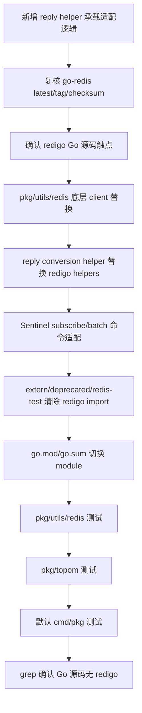

# redigo-to-go-redis design

## 0. 术语约定

- **Redis client library migration**：本 feature 把 Go 源码里对 `github.com/garyburd/redigo/redis` 的直接使用替换为 `github.com/redis/go-redis/v9`。它不是 Redis Server 源码迁移，也不是 proxy 内部 RESP codec `pkg/proxy/redis` 的替换。
- **Codis Redis helper API**：`pkg/utils/redis.Client` / `Pool` / `InfoCache` / `Sentinel` 暴露给 topom、proxy、HA 和 admin 的项目内 API。本 feature 默认保留这层 API，减少上层扩散。
- **Target go-redis version**：2026-06-04 执行 `GOPROXY=https://proxy.golang.org,direct go list -m -json github.com/redis/go-redis/v9@latest`，当前解析为 tagged release `v9.20.0`，tag 时间 `2026-05-28T07:31:45Z`，module `go 1.24`，来源 repo 为 `https://github.com/redis/go-redis`。
- **All Go redigo usage**：包括默认 `cmd/` / `pkg/` 构建路径下的 redigo import，也包括 `extern/deprecated/redis-test` 中的 redigo import；不包括 CodeStable 历史文档对 redigo 的归档描述。
- **Reply conversion helpers**：替代 redigo `String` / `Values` / `Ints` / `StringMap` 的项目内解析 helper，用于把 go-redis 的 `interface{}` / command result 转成 Codis 既有类型。

防冲突结论：代码和历史 feature 里已有 `Redis client stack`、`pkg/utils/redis`、`pkg/proxy/redis`、`RedisAuthIdentity` 等叫法。本 design 使用 `Redis client library migration` 表示库替换，避免和已完成的 `dep-redis-client-stack` 同路径升级混淆。

## 1. 决策与约束

### 需求摘要

本 feature 要把所有 Go 源码中使用的 `github.com/garyburd/redigo` 替换成 `github.com/redis/go-redis/v9 v9.20.0`，并验证 Codis 通过 Redis client 管理 Redis/Sentinel 的关键路径仍可工作：连接、password/named `AUTH`、`SELECT`、`INFO` / `CONFIG`、`MULTI` / `EXEC`、同步/异步 slot migration、ACL 管理、Sentinel pub/sub、Sentinel monitor/remove/flushconfig。

服务对象是维护 Codis Go 依赖和 Redis 管理路径的人。成功标准是：Go 源码不再 import redigo；`go.mod` 以 `github.com/redis/go-redis/v9 v9.20.0` 替代 `github.com/garyburd/redigo`；`pkg/utils/redis`、`pkg/topom`、默认 `go test ./cmd/... ./pkg/...` 通过；`rg "github.com/garyburd/redigo" --glob '*.go'` 没有命中。

明确不做：

- 不替换或重写 `pkg/proxy/redis` RESP codec，不改变 proxy client/backend 转发协议。
- 不修改 Redis Server / Redis 8 Codis Server 源码、slot migration 命令协议、RDB export、Redis 8 adapter 行为。
- 不改变 `pkg/utils/redis.Client` / `Pool` / `InfoCache` / `Sentinel` 对上层的公开 API，除非实现阶段证明 go-redis 无法兼容并回到 design 重新确认。
- 不引入 go-redis cluster/ring/failover client，不把 Codis 当 Redis Cluster 接入。
- 不开启 RESP3 行为作为默认路径；默认按 RESP2 兼容 Redis 3 fallback 和现有 RESP2 reply 解析。
- 不启用 go-redis 默认 command retry 语义去重试 Codis migration、ACL 或 Sentinel 运维命令。
- 不通过全量 `go mod tidy` 扩散依赖图；只用目标 `go get` 和验收命令驱动最小 `go.mod/go.sum` 变化。
- 不修复 `extern/deprecated/redis-test` 既有 vet/format/测试质量问题；只清除它的 redigo import 并保持其已有用途边界。
- 不升级 Go toolchain，不改变 `go 1.26.1` module directive，不修改 `third_party/jemalloc-go`、Docker、部署脚本、前端资源或配置模板。

### 复杂度档位

本 feature 不是低风险同路径升级，按“运行期依赖迁移”偏高档位处理：

- Compatibility = strict：Redis 管理命令、ACL/migration/auth 语义、Sentinel 多数派逻辑和 proxy 行为不能漂移。
- Determinism = verified：`go-redis` 版本、checksum 和 tag 来源必须用 Go module query / download 复核。
- Testability = broad：必须覆盖 `pkg/utils/redis`、`pkg/topom`、默认 cmd/pkg 测试，并用 grep 证明 Go 源码红线已清除。

### 关键决策

1. **采用 `github.com/redis/go-redis/v9 v9.20.0`，不使用旧 `github.com/go-redis/redis` 路径。**
   - 依据：`go list -m -json github.com/redis/go-redis/v9@latest` 返回 `v9.20.0`；`go mod download -json github.com/redis/go-redis/v9@v9.20.0` 返回 checksum `h1:WnQYxLkgO2xiXTCJY0ldIiI8dNqCDlQAG+AtaH7a2a0=` 和 GitHub tag ref `refs/tags/v9.20.0`。
   - 约束：实现阶段重新查询；如果 `@latest` 变化，记录实际结果并暂停确认目标版本。

2. **保留 `pkg/utils/redis` 作为上层稳定适配层。**
   - 依据：上层使用点集中在 `topom`、`proxy`、`cmd/ha`，通过 `Client` / `Pool` / `InfoCache` / `Sentinel` 间接触达 redigo；直接替换上层调用会扩大风险。
   - 变化：底层 import alias 使用 `goredis "github.com/redis/go-redis/v9"`，避免和当前 package `redis` 冲突。

3. **`Client` 使用 go-redis standalone client + dedicated `Conn`，不使用共享自动 pool 替代 Codis 现有 pool。**
   - 依据：Codis 当前 `Client.Select()` 维护单连接 DB 状态，`Pool.PutClient()` 只在 pipeline 收齐、连接无错误、未超时时复用连接。go-redis `Client` 自动 pool 会让动态 `SELECT` 状态跨连接失真。
   - 变化：每个 Codis `Client` 持有一个 go-redis base client 和一个 dedicated `Conn`；Codis 的 `Pool` 继续决定是否复用这个 `Client`。

4. **显式设置 go-redis 兼容选项。**
   - `Protocol: 2`：保持 RESP2 reply shape；go-redis 仍会尝试 `HELLO 2`，Redis 不支持时按 Redis error fallback。
   - `DisableIdentity: true`：避免自动 `CLIENT SETINFO` 改变 Redis 3 / fake server 命令流。
   - `MaxRetries: -1`：避免非幂等 migration / ACL / Sentinel 命令被自动重试。
   - `DialTimeout` / `ReadTimeout` / `WriteTimeout`：沿用现有 timeout；connect timeout 使用 `min(1s, timeout)`。
   - `Username` / `Password`：来自 `RedisAuthIdentity`，保留 password-only 与 named auth。

5. **保留 `Send` / `Flush` / `Receive` 语义，但改成 go-redis pipeline 队列。**
   - 依据：这些方法是公开方法，且 `sentinel.go` 和 `SetMaster()` 当前依赖“先排队、flush、按顺序 receive”的编排。
   - 变化：`Send` 创建/复用 `Pipeliner` 并追加 `Do`；`Flush` 执行 queued commands；`Receive` 按顺序读取 queued command 的 result。Redis command error 在 `Receive` 体现，网络/连接错误关闭 client。

6. **`extern/deprecated/redis-test` 只做 import 清除，不新增默认 gate。**
   - 依据：用户目标是“所有 Go 部分”；但该目录是 deprecated，且历史 feature 已记录它不在默认 `cmd/pkg` gate 内。
   - 变化：用 go-redis 或本目录内最小 helper 替换 redigo 连接和转换函数；不修复既有 vet/format 失败。

## 2. 名词与编排

### 2.1 名词层

#### module_set

现状：

| module | scope | current | reachability |
|---|---:|---|---|
| `github.com/garyburd/redigo` | direct | `v1.6.4` | `pkg/utils/redis`, `extern/deprecated/redis-test` |
| `github.com/redis/go-redis/v9` | absent | `v9.20.0 @latest` | not used |

变化：

```text
module_set:
  - module_path: github.com/garyburd/redigo
    current_version: v1.6.4
    target_version: null
    scope: direct
    upgrade_mode: remove-after-import-migration
  - module_path: github.com/redis/go-redis/v9
    current_version: absent
    target_version: v9.20.0
    scope: direct
    upgrade_mode: direct-go-get
```

接口示例：

```diff
-	github.com/garyburd/redigo v1.6.4
+	github.com/redis/go-redis/v9 v9.20.0
```

go-redis 自身 `go.mod` 为 `go 1.24`，低于本仓库 `go 1.26.1`，工具链版本上兼容。

#### client_handle

现状：

- `pkg/utils/redis/client.go` 的 `Client` 持有 `redigo.Conn`，构造函数立即 `Dial` 并按需 `AUTH`。
- `Do` 执行单命令，Redis error 从 redigo reply value 中识别；网络错误关闭连接。
- `Send` / `Flush` / `Receive` 提供低层 pipeline，`Pipeline.Send` / `Pipeline.Recv` 用于 pool recycle 判断。
- `Select()` 在当前连接上执行 `SELECT` 并记录 `Database`，后续同一 `Client` 复用该 DB 状态。

变化：

- `Client` 持有 go-redis base client 和 dedicated `Conn`，上层字段 `Addr` / `Auth` / `AuthIdentity` / `Database` / `LastUse` / `Timeout` / `Pipeline` 保持。
- 构造函数用 go-redis `Options` 建立兼容配置，并通过一次受控连接初始化验证保持“构造失败即返回 error”的语义。
- `Do` 调用 dedicated `Conn.Do(ctx, cmd, args...)`，`Result()` 的 Redis error 直接作为 error 返回，再统一 `errors.Trace`。
- `Select()` 仍发送显式 `SELECT`，只在成功后更新 `Database`；不依赖 go-redis `Options.DB` 动态切换。
- `isRecyclable()` 继续以 go-redis connection error、pipeline send/recv 计数和 idle timeout 判断。

#### reply_shape

现状：

- `redigo.String` 解析 bulk string。
- `redigo.Values` 解析 array。
- `redigo.Int` / `Ints` 解析 integer / integer array。
- `redigo.StringMap` 解析 Sentinel `masters` / `slaves` 返回的 flat array。

变化：

- 新增或集中 `replyString` / `replyValues` / `replyInt` / `replyInts` / `replyStringMap` helper。
- helper 接受 go-redis `Result()` 返回的 `interface{}`，保留严格 shape 校验；错误信息继续包含原始 reply。
- Redis error 不再作为 `interface{}` reply value 向业务层流动，而是在 `Do` / `Receive` 返回 error；`EXEC` 内部 command error 仍需逐项检查。

#### sentinel_client

现状：

- Sentinel 管理通过 `pkg/utils/redis.Sentinel` 使用 `Client.Send` / `Flush` / `Receive` 做批量命令。
- `subscribeCommand` 通过 redigo `SUBSCRIBE` + `Receive` 手工解析 subscribe ack 和 message。
- `mastersCommand` / `slavesCommand` 使用 `redigo.StringMap` 解析 Sentinel 返回。

变化：

- 批量 Sentinel 命令可继续复用 `Client` pipeline wrapper，也可在同包内部用 go-redis `Pipelined` 直接按顺序取 command result。
- `subscribeCommand` 优先改用 go-redis `Subscribe(ctx, "+switch-master")` 和 `PubSub.Receive` / `ReceiveMessage`，在收到 subscription ack 后调用 `onSubscribed()`。
- 多数派、timeout、cancel、日志和错误回调语义保持。

#### deprecated_redis_test

现状：

- `extern/deprecated/redis-test/utils.go`、`extra_incr.go`、`bench/benchmark.go` 直接 import `github.com/garyburd/redigo/redis`，并使用 `redis.Conn` / `redis.Dial` / `redis.Int` / `redis.Values` / `redis.String`。

变化：

- 清除这些 import。
- 用本目录内最小 go-redis helper 或直接 go-redis client 替换连接、`Do` 和 reply conversion。
- 不把 `extern/deprecated/redis-test` 升级为默认测试门禁；只用 grep 和可选 compile smoke 确认 redigo usage 清除。

### 2.2 编排层



现状：

- 默认 cmd/pkg redigo 触点集中在 `pkg/utils/redis/client.go` 和 `pkg/utils/redis/sentinel.go`。
- 上层 `pkg/topom`、`pkg/proxy`、`cmd/ha` 通过项目内封装间接使用 Redis client。
- `extern/deprecated/redis-test` 也有 redigo import，但不属于默认 gate。

变化：

- 先替换 `pkg/utils/redis` 的底层实现，保持上层 API 和调用点不变。
- 再清除 deprecated extern 的 redigo import，避免“所有 Go 部分”目标留尾巴。
- 最后用 module manifest 和 grep 收口，证明 redigo 不再是 Go 源码依赖。

流程级约束：

- **顺序约束**：先复核版本和触点，再迁移核心 helper，再处理 extern，最后改 module manifest；不要先删 redigo 造成大面积编译失败。
- **错误语义**：Redis command error、network error、context cancel/timeout 要分清。Redis command error 不应被当作可复用连接的普通 reply 混过验收；网络错误必须关闭当前 client。
- **幂等性**：重复运行 target tests 和 grep 不应继续改动 `go.mod/go.sum`，不生成 vendor/Godeps。
- **兼容性**：`AUTH [username] password`、`SELECT` 当前 DB、`MULTI/EXEC` 内部 error、`SLOTSMGRT*` 返回 `[migrated, remaining]`、Sentinel majority 逻辑保持。
- **可观测点**：`go list -m -json @latest`、`go mod download -json`、`go.mod/go.sum` diff、`rg` redigo import、`go test ./pkg/utils/redis`、`go test ./pkg/topom`、`go test ./cmd/... ./pkg/...`、`git status --short`。

### 2.3 挂载点清单

- `go.mod` direct require：删除 `github.com/redis/go-redis/v9` 或恢复 `github.com/garyburd/redigo` 后，本 feature 的依赖替换消失。
- `pkg/utils/redis` 底层 client handle：恢复 redigo import 后，默认 cmd/pkg 的 Redis 管理路径回到旧库。
- `pkg/utils/redis` reply conversion helpers：删除后，Codis 无法保持 `INFO`、`CONFIG GET`、`SLOTSINFO`、migration、Sentinel masters/slaves 的既有解析契约。
- `pkg/utils/redis` Sentinel subscribe/batch 适配：删除后，Sentinel monitor、remove、masters/slaves 和 switch-master 监听不能证明 go-redis 下仍工作。
- `extern/deprecated/redis-test` redigo cleanup：删除后，`all Go redigo usage` 的 grep 验收会失败。

### 2.4 推进策略

1. **安全微重构：reply helper 文件**：新增 `pkg/utils/redis/reply.go` 承载 reply conversion helpers，不改变现有 redigo 调用行为。
   - 退出信号：`pkg/utils/redis` 编译/测试仍通过；新增 helper 文件不被上层直接依赖。

2. **版本与触点复核**：重新执行 go-redis `@latest` / versions / download 查询，并 grep Go 源码 redigo 使用点。
   - 退出信号：目标版本仍是正式 tagged `v9.20.0` 或已记录变更并暂停；Go 源码触点清单完整。

3. **核心 client handle 迁移**：把 `pkg/utils/redis.Client` 底层从 redigo 替换为 go-redis dedicated `Conn`，保留构造、`Do`、`Select`、`Close`、pool recycle 语义。
   - 退出信号：`pkg/utils/redis` 编译通过；上层调用签名不变；构造失败、AUTH、SELECT 测试可描述。

4. **reply conversion 与 pipeline 迁移**：实现 reply helpers 和 `Send` / `Flush` / `Receive` wrapper，替换 redigo conversion 调用。
   - 退出信号：`InfoFull`、`SetMaster`、`SlotsInfo`、sync/async migration、`Role` 的 shape 校验保持；pipeline send/recv 计数仍可驱动 recycle。

5. **Sentinel 路径迁移**：改造 subscribe、masters/slaves、monitor/remove/flushconfig 的 go-redis 调用路径。
   - 退出信号：Sentinel subscribe ack、`+switch-master` message、masters/slaves string map、monitor/remove pipeline 语义都有测试或现有 topom gate 覆盖。

6. **deprecated extern 清理**：清除 `extern/deprecated/redis-test` redigo imports。
   - 退出信号：该目录 Go 源码不再 import redigo；不引入该目录为默认验收 gate，不修无关历史问题。

7. **module manifest 收口**：执行定点 `go get github.com/redis/go-redis/v9@v9.20.0`，删除 redigo direct require 并核对 go.sum。
   - 退出信号：`go.mod` 只有预期 module 切换及必要 indirect 变化；`go.sum` 不保留 redigo 作为当前可达依赖；不运行无目标全量 tidy。

8. **测试闭环**：运行 target package 测试和默认 cmd/pkg 测试。
   - 退出信号：`go test ./pkg/utils/redis`、`go test ./pkg/topom`、`go test ./cmd/... ./pkg/...` 通过。

9. **范围守护**：grep 和 git diff 收口。
   - 退出信号：`rg "github.com/garyburd/redigo" --glob '*.go'` 无命中；diff 不包含 Redis Server、proxy RESP codec、Docker、部署、前端或无关依赖升级。

### 2.5 结构健康度与微重构

##### 评估

- compound convention：已搜索 `redigo go-redis redis client migration dependency module connection pool`，无匹配沉淀文档。
- 文件级 - `pkg/utils/redis/client.go`：文件同时承担连接、命令封装、reply 解析、pool、InfoCache。现状偏胖，但本 feature 不新增外部 API；reply conversion 可以独立进新文件，避免继续加重主文件。
- 文件级 - `pkg/utils/redis/sentinel.go`：Sentinel 编排集中，go-redis PubSub / pipeline 迁移会改内部流程，但不需要先拆公共 API。
- 文件级 - `extern/deprecated/redis-test/utils.go`：历史测试 helper 很长且质量问题既有；本次只清除 import，不做结构治理。
- 目录级 - `pkg/utils/redis`：目录职责明确，是 Redis helper 的正确落点；新增 reply helper 文件不会造成目录摊平问题。
- 目录级 - `extern/deprecated/redis-test`：deprecated 工具目录，清除 import 即可，不新增子系统。

##### 结论：做一个安全微重构

新增 `pkg/utils/redis/reply.go` 承载 go-redis reply conversion helpers。这是“新文件承载新适配逻辑”，不是行为重构；它能减少 `client.go` 继续膨胀，并让 redigo helper 替换点集中可测。

##### 超出范围的观察

`pkg/utils/redis/client.go` 和 `sentinel.go` 仍是历史集中式 helper。完整拆分 client/pool/server-admin/sentinel 职责应另走 `cs-refactor`，不作为本 feature 前置条件。

## 3. 验收契约

### 关键场景清单

- 触发：执行 `GOPROXY=https://proxy.golang.org,direct go list -m -json github.com/redis/go-redis/v9@latest`。期望：返回正式 tagged release；当前设计目标为 `v9.20.0`。
- 触发：执行 `GOPROXY=https://proxy.golang.org,direct go mod download -json github.com/redis/go-redis/v9@v9.20.0`。期望：返回 checksum 和 GitHub tag ref，可复核来源。
- 触发：构造 `NewClientNoAuth(fake, timeout)`。期望：连接初始化成功；fake server 可观测 go-redis `HELLO` fallback 但不出现 `CLIENT SETINFO`。
- 触发：构造 `NewClient(fake, "secret", timeout)`。期望：password-only auth 成功，语义等价于 Redis `AUTH secret`。
- 触发：构造 `NewClientWithAuthIdentity(fake, RedisAuthIdentity{Username:"svc", Password:"secret"}, timeout)`。期望：named auth 成功，语义等价于 Redis `AUTH svc secret`。
- 触发：`Select(2)` 连续调用两次。期望：只在 DB 变化时发送 `SELECT`，`Database` 成功后更新。
- 触发：`InfoFull()` 处理 replication info 和 `CONFIG GET maxmemory`。期望：`master_addr` 和 `maxmemory` 解析与旧行为一致。
- 触发：`SetMaster()` password-only 与 named auth。期望：保留 `SLAVEOF` alias、`masterauth`、named auth 下的 `masteruser`、`CONFIG REWRITE`、`CLIENT KILL TYPE normal`，并检查 `EXEC` 内部错误。
- 触发：`SlotsInfo()`、`MigrateSlot()`、`MigrateSlotAsync()`。期望：严格解析 `[slot,count]` 与 `[migrated,remaining]`，返回 remaining count。
- 触发：Sentinel subscribe 收到 `+switch-master`。期望：多数派订阅 ack 后才调用 `onMajoritySubscribed()`，同 product event 触发返回。
- 触发：Sentinel masters/slaves/monitor/remove/flushconfig。期望：string map 解析、pipeline 顺序和 timeout/cancel 行为保持。
- 触发：`go test ./pkg/utils/redis`。期望：通过。
- 触发：`go test ./pkg/topom`。期望：通过。
- 触发：`go test ./cmd/... ./pkg/...`。期望：通过。
- 触发：执行 `rg "github.com/garyburd/redigo" --glob '*.go'`。期望：无命中。
- 触发：执行 `rg "github.com/redis/go-redis/v9" go.mod pkg cmd extern --glob '*.go'`。期望：命中 `go.mod` 和迁移后的 Go 源码，不命中 `pkg/proxy/redis` 作为被替换对象。
- 触发：查看 `git diff --name-status`。期望：不包含 `extern/redis-8.6.3`、Docker、部署脚本、前端资源、配置模板或无关 module 升级。

### 明确不做的反向核对项

- Diff 不应修改 `pkg/proxy/redis` RESP codec 或 proxy backend/session 路由语义。
- Diff 不应修改 Redis 8 Codis Server 源码或 slot migration 命令协议。
- Diff 不应引入 go-redis cluster/ring/failover client。
- Diff 不应开启 RESP3 作为 Codis Redis helper 默认行为。
- Diff 不应保留任何 Go 源码对 `github.com/garyburd/redigo` 的 import。
- Diff 不应把 `extern/deprecated/redis-test` 的既有质量问题纳入默认 gate。
- Diff 不应运行全量 `go mod tidy` 导致无关依赖 churn。

## 4. 收尾与回写

本 feature 是运行期依赖迁移，不新增用户可见能力，默认不需要新 requirement。acceptance 阶段如果实现确实只替换底层 client 并保持 `pkg/utils/redis` API，不需要更新 architecture；如果实现引入了新的稳定适配层、长期 go-redis 兼容约束或测试 gate，应回写 `.codestable/architecture/ARCHITECTURE.md` 的 Go module / Redis helper 段，并提示是否用 `cs-decide` 归档“Redis client library migration 约束”。
