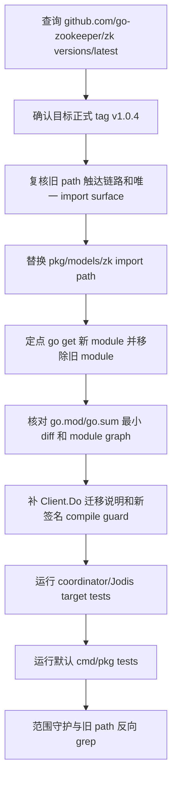

# dep-zookeeper-module-path-migration design

## 0. 术语约定

- **Zookeeper module path migration**：本 feature 覆盖的依赖迁移动作，目标是把 Go module 和 import path 从旧仓库 `github.com/samuel/go-zookeeper` / `github.com/samuel/go-zookeeper/zk` 切到维护中的 `github.com/go-zookeeper/zk`。
- **Target release**：`github.com/go-zookeeper/zk v1.0.4`。2026-06-05 通过 `GOPROXY=https://proxy.golang.org,direct go list -m -json github.com/go-zookeeper/zk@latest` 查询到 `@latest` 为 `v1.0.4`；GitHub releases/tags 同步标记 `v1.0.4` 为 latest。
- **Old-path upgrade feature**：历史 feature `.codestable/features/2026-06-04-dep-coordinator-zookeeper-stack/` 只把旧 module path `github.com/samuel/go-zookeeper` 升到 pseudo version `v0.0.0-20201211165307-7117e9ea2414`，不覆盖本次 module path 迁移。
- **Minimal module-path diff**：只替换 Zookeeper SDK 的 module path、import path 和对应 checksum；不运行无目标全量 `go mod tidy`，不引入 `replace` 把新旧 path 强行别名化。
- **Client.Do breaking API**：`pkg/models/zk.Client.Do` 是 exported API，签名暴露第三方 `*zk.Conn`；Go 的类型身份绑定 import path，因此本次迁移会让直接使用旧 `github.com/samuel/go-zookeeper/zk.Conn` 的外部回调源码编译失败。该兼容性影响必须通过迁移文档显式说明。

防冲突结论：代码和历史 feature 中已经使用 `Zookeeper coordinator stack` 表示旧 path 的版本升级。本 design 使用 `Zookeeper module path migration` 表示从 `samuel` path 到 `go-zookeeper` path 的迁移，避免误读为重做旧 feature。

## 1. 决策与约束

### 需求摘要

本 feature 要把所有 Go 组件使用的 Zookeeper SDK 从 `github.com/samuel/go-zookeeper/zk` 迁移到 `github.com/go-zookeeper/zk v1.0.4`，并验证 Codis 的 Zookeeper coordinator、Jodis 注册发现和默认 cmd/pkg 构建测试闭环仍成立。

服务对象是维护 Codis coordinator 后端、Jodis proxy 发现、Go modules 构建入口和直接调用 `pkg/models/zk.Client.Do` 的 Go 开发者。成功标准是：仓库代码不再 import `github.com/samuel/go-zookeeper/zk`；`go.mod` direct require 改为 `github.com/go-zookeeper/zk v1.0.4`；`pkg/models/zk` 继续以 `models.Client` 语义编译通过；`Client.Do` 的新 SDK 回调签名有 compile guard；外部调用方迁移说明已落文档；coordinator 相关目标测试与默认 `go test ./cmd/... ./pkg/...` 通过。

明确不做：

- 不修改 `models.Client` 接口、`models.NewClient("zk"|"zookeeper", ...)` 分支、dashboard/proxy/admin/fe coordinator 参数或配置语义。
- 不改 Zookeeper coordinator 的 `Mkdir`、`Create`、`Update`、`Delete`、`Read`、`List`、`WatchInOrder`、ephemeral 节点、sequence 节点、digest auth 或 reconnect 逻辑。
- 不保留旧 `Client.Do(func(*github.com/samuel/go-zookeeper/zk.Conn) error)` 回调签名；这是本次 module path 迁移的显式 breaking API，必须通过迁移文档说明。
- 不把默认 coordinator 改成 Zookeeper，也不新增 Zookeeper 数据迁移、部署脚本、服务启动入口或真实 Zookeeper server e2e。
- 不修改 etcd、filesystem、Consul coordinator 后端。
- 不升级 Redis client、Martini、etcd、Consul、RDB analysis、metrics、jemalloc 或其他 Go module。
- 不升级 Go toolchain，不改变 `go 1.26.1` module directive。
- 不运行无目标全量 `go mod tidy`，不生成 `vendor/`、`Godeps/` 或 `vendor/modules.txt`。
- 不修改 `extern/redis-8.6.3/`、Docker、部署脚本、前端资源或配置模板。

### 复杂度档位

按“项目内部依赖维护”默认档位走，偏离如下：

- Compatibility = backward-compatible：Zookeeper coordinator 的外部配置、auth 格式、watch/ephemeral/sequence 节点语义和 `models.Client` 调用方不能变化。
- Determinism = reproducible：目标版本必须来自 `GOPROXY=https://proxy.golang.org,direct go list -m ...` 和官方 tag/release 交叉验证，不能依赖本地 cache 猜测。
- Testability = verified：本组直接挂在 `pkg/models/zk` 和 coordinator 参数入口，必须覆盖目标包测试和默认 cmd/pkg 测试。

### 关键决策

1. **迁移到新 module path 的最新正式 tag `v1.0.4`**。
   - 依据：`go list -m -versions -json github.com/go-zookeeper/zk` 返回 `v1.0.0` 到 `v1.0.4`；`go list -m -json github.com/go-zookeeper/zk@latest` 返回 `Version: v1.0.4`。
   - 交叉证据：GitHub releases/tags 显示 `v1.0.4` 为 latest，tag 日期为 2024-07-24。

2. **不使用 `replace` 桥接旧 path**。
   - 依据：本仓库只有 `pkg/models/zk/zkclient.go` 一个真实旧 import；直接替换 import path 更清晰，且不会让 `go.mod` 同时保留旧 module identity。
   - 取舍：如果实现阶段发现某个 transitive 依赖仍要求旧 path，应先报告 module graph 冲突，不通过长期 `replace` 掩盖。

3. **保持 Zookeeper coordinator 代码语义不变**。
   - 依据：`github.com/go-zookeeper/zk v1.0.4` 中当前代码使用到的 API 仍存在，包括 `Connect`、`SetLogger`、`AddAuth`、`Exists`、`Create`、`GetW`、`Set`、`Delete`、`Children`、`ChildrenW`、`ErrNoNode`、`ErrNodeExists`、`ErrNotEmpty`、ACL helper 和 flag/permission 常量。
   - 取舍：如编译或测试暴露 API/行为不兼容，应回到 design 分析，不在本 feature 中顺手重写 watch、ACL、ephemeral 或 reconnect 行为。

4. **验收覆盖 Jodis/coordinator 编译面**。
   - 依据：`go mod why -m github.com/samuel/go-zookeeper` 当前追溯到 `pkg/models/zk -> github.com/samuel/go-zookeeper/zk`；`go list -deps ./cmd/... ./pkg/...` 命中同一 import path。dashboard/proxy/admin/fe 都能通过 coordinator 参数或 Jodis 配置进入该抽象。

5. **不做全量 `go mod tidy` 收口**。
   - 依据：`.codestable/attention.md` 明确禁止无目标全量 tidy；本次应通过定点 `go get` 和目标测试驱动最小 module diff。

6. **显式声明 `Client.Do` 的源码级 breaking change**。
   - 依据：`Client.Do` 的参数类型是 `func(conn *zk.Conn) error`。旧 path 和新 path 下的 `zk.Conn` 是不同 Go package identity 的命名类型，函数类型不 identical。
   - 取舍：不采用旧 SDK 兼容层、unsafe 指针转换或新旧双连接。它们会保留旧依赖或改变 `Do` 的连接语义，违背“所有 Go 组件使用新 SDK”的目标。
   - 落地：新增迁移说明文档，要求直接调用 `Client.Do` 的外部用户把回调 import path 改为 `github.com/go-zookeeper/zk`；新增 compile guard 固化新签名。

## 2. 名词与编排

### 2.1 名词层

#### module_set

| module | scope | current | target | current source | reachability |
|---|---:|---|---|---|---|
| `github.com/samuel/go-zookeeper` | direct | `v0.0.0-20201211165307-7117e9ea2414` | remove | `go.mod:20` | `pkg/models/zk` direct import |
| `github.com/go-zookeeper/zk` | direct | absent | `v1.0.4` | `go list @latest` | `pkg/models/zk` direct import after migration |

```text
module_set:
  - module_path: github.com/samuel/go-zookeeper
    current_version: v0.0.0-20201211165307-7117e9ea2414
    target_version: remove
    scope: direct
    replace_path: null
    migration_mode: remove-old-path
  - module_path: github.com/go-zookeeper/zk
    current_version: absent
    target_version: v1.0.4
    scope: direct
    replace_path: null
    migration_mode: direct-go-get
```

#### 现状

- `pkg/models/zk/zkclient.go` 直接 import `github.com/samuel/go-zookeeper/zk`，并把它封装成 `models.Client` 所需的 CRUD、watch 和 ephemeral/sequence 节点方法。
- `pkg/models/client.go` 在 `NewClient` 中通过 `"zk"` / `"zookeeper"` 分支返回 `zkclient.New(addrlist, auth, timeout)`。
- `cmd/internal/coordinator/args.go` 继续提供 `--zookeeper` / `--zookeeper-auth` coordinator 参数解析，外部配置名仍是 `zookeeper`。
- `go.mod` direct require `github.com/samuel/go-zookeeper v0.0.0-20201211165307-7117e9ea2414`。
- `go.sum` 包含旧 module path 的历史 checksum。

#### 变化

- `pkg/models/zk/zkclient.go` 的 import path 改为 `github.com/go-zookeeper/zk`，package alias 仍为 `zk`。
- `pkg/models/zk.Client.Do` 的 exported 方法签名随 import path 迁移为 `func(func(*github.com/go-zookeeper/zk.Conn) error) error`；直接使用旧 SDK path 的外部源码需要按迁移文档改 import。
- `go.mod` 删除 `github.com/samuel/go-zookeeper` direct require，新增 `github.com/go-zookeeper/zk v1.0.4` direct require。
- `go.sum` 新增 `github.com/go-zookeeper/zk v1.0.4` 相关 checksum；旧 `github.com/samuel/go-zookeeper` checksum 如果不再被 module graph 引用，应从 `go.sum` 移除。
- `pkg/models/zk`、`models.Client`、cmd 参数、配置和文档语义不变。

示例：

```diff
- import "github.com/samuel/go-zookeeper/zk"
+ import "github.com/go-zookeeper/zk"

- github.com/samuel/go-zookeeper v0.0.0-20201211165307-7117e9ea2414
+ github.com/go-zookeeper/zk v1.0.4
```

### 2.2 编排层



#### 现状

- 当前 Zookeeper coordinator 使用 `github.com/samuel/go-zookeeper/zk` API；调用方只依赖 `models.Client` 抽象。
- `go list -m -json github.com/go-zookeeper/zk@latest` 显示新 path 有正式 tag `v1.0.4`。
- `rg` 显示真实 Go 源码里只有 `pkg/models/zk/zkclient.go` import 旧 path；其他命中是 `go.mod/go.sum` 和历史 CodeStable 文档。

#### 变化

- implement 阶段先替换 import path，再执行定点 `go get github.com/go-zookeeper/zk@v1.0.4`。
- 如 `go get` 未自动移除旧 module，使用 Go 工具驱动的最小 edit 删除旧 direct require，并通过 `go list -deps` / `go mod why` 证明旧 module 不再被触达。
- `Client.Do` 的源码级 breaking change 通过 `doc/zookeeper_sdk_migration_zh.md` 说明；`pkg/models/zk` 增加 compile guard，证明新回调签名使用 `github.com/go-zookeeper/zk.Conn`。
- target test gate 覆盖 `go test ./pkg/models/zk ./pkg/models ./cmd/internal/coordinator ./cmd/dashboard ./cmd/proxy ./cmd/admin ./cmd/fe`。
- 默认 test gate 覆盖 `go test ./cmd/... ./pkg/...`。

流程级约束：

- **错误语义**：任何 test 失败先判断是新 SDK API/行为不兼容、module graph 冲突还是既有环境问题；不得用全量 tidy、长期 replace 或 coordinator 语义改写掩盖。
- **幂等性**：重复执行定点 `go get` 和验收命令不应继续改动 `go.mod/go.sum`，也不生成 vendor/Godeps。
- **兼容性**：dashboard/proxy/admin/fe 的 `--zookeeper`、`--zookeeper-auth`、config coordinator 字段、Jodis 字段和 `models.Client` 方法语义不变。
- **可观测点**：`go list`、`go mod why`、`go list -deps`、`rg` 旧 path、`git diff -- go.mod go.sum pkg/models/zk/zkclient.go`、target test、默认 test、`git status`。

### 2.3 挂载点

- `pkg/models/zk/zkclient.go` 的 SDK import path：回退后，本 feature 在代码编译面消失。
- `go.mod` 中 `github.com/go-zookeeper/zk v1.0.4` direct require：删除后，clean checkout 无法锁定新 SDK module。
- `go.sum` 中 `github.com/go-zookeeper/zk v1.0.4` checksum：删除后，lockfile 证据消失。
- `doc/zookeeper_sdk_migration_zh.md`：删除后，`Client.Do` 的 breaking API 迁移说明消失。
- `pkg/models/zk` 的 `Client.Do` compile guard：删除后，新签名的外部包编译证据消失。
- 旧 path 反向 grep gate：证明本 feature 不再通过旧 SDK path 工作。
- coordinator target test gate：证明 Zookeeper coordinator/Jodis 相关编译面仍可通过。

拔除方式：把 `pkg/models/zk/zkclient.go` import 改回 `github.com/samuel/go-zookeeper/zk`，`go.mod` direct require 改回旧 module，并移除新 module checksum 后，module path 迁移在系统视角消失。

### 2.4 推进策略

1. **版本调查复核**：重新执行 `go list -m -json github.com/go-zookeeper/zk@latest`、`go list -m -versions -json github.com/go-zookeeper/zk`，并核对 GitHub release/tag。
   - 退出信号：目标仍是正式 tag `v1.0.4`；不是 pseudo version；module path 为 `github.com/go-zookeeper/zk`。
2. **依赖触达和 import surface 复核**：执行 `go mod why -m github.com/samuel/go-zookeeper`、`go list -deps ./cmd/... ./pkg/...`、`rg` 旧 path。
   - 退出信号：旧 path 经 `pkg/models/zk -> github.com/samuel/go-zookeeper/zk` 被默认 cmd/pkg 路径触达，真实 Go import surface 只有 `pkg/models/zk/zkclient.go`。
3. **SDK import path 迁移**：把 `pkg/models/zk/zkclient.go` import 替换为 `github.com/go-zookeeper/zk`。
   - 退出信号：源代码不再 import `github.com/samuel/go-zookeeper/zk`；package name 仍是 `zk`；无函数语义改动。
4. **module manifest 定点迁移**：执行目标版本的定点 module 更新，删除旧 direct require。
   - 退出信号：`go.mod` direct require 为 `github.com/go-zookeeper/zk v1.0.4`；`github.com/samuel/go-zookeeper` 不再出现在 `go.mod`；`go 1.26.1` 和 jemalloc-go replace 保留。
5. **checksum 与依赖图收口**：核对 `go.sum`、module graph、旧 path 反向 grep。
   - 退出信号：`go.sum` 只出现新 SDK 必要 checksum 和旧 SDK 未引用 checksum 清理；没有无关 module churn；`go list -deps ./cmd/... ./pkg/...` 触达 `github.com/go-zookeeper/zk` 且不触达旧 path。
6. **public API 迁移说明与 compile guard**：补充 `Client.Do` breaking API 迁移文档，并增加外部包风格的 compile guard。
   - 退出信号：文档明确旧 `samuel` 回调签名需要迁到 `go-zookeeper`；compile guard 证明 `Client.Do` 接受 `func(*github.com/go-zookeeper/zk.Conn) error`。
7. **coordinator target 测试**：运行 `go test ./pkg/models/zk ./pkg/models ./cmd/internal/coordinator ./cmd/dashboard ./cmd/proxy ./cmd/admin ./cmd/fe`。
   - 退出信号：Zookeeper client 包、models 工厂、coordinator 参数解析和相关 cmd 入口均编译测试通过。
8. **默认构建测试闭环**：运行 `go test ./cmd/... ./pkg/...`。
   - 退出信号：默认 cmd/pkg 测试通过，不报 module version、vendor mode 或 API 不兼容错误。
9. **范围守护与临时产物清理**：核对最终 diff、旧 path 搜索、vendor/Godeps 和临时产物。
   - 退出信号：diff 只包含 `go.mod`、`go.sum`、`pkg/models/zk/zkclient.go`、public API 迁移文档、compile guard 和本 feature spec；无配置、部署、extern、Docker、前端、vendor/Godeps 或无关 module churn。

### 2.5 结构健康度与微重构

compound 检索：

- `.codestable/tools/search-yaml.py --dir .codestable/compound --query "zookeeper go-zookeeper coordinator dependency go module module path import"` 无匹配文档。
- `.codestable/tools/search-yaml.py --dir .codestable/compound --query "目录组织 文件归属 命名约定 go.mod dependency module zookeeper import path"` 无匹配文档。

文件级：

- `go.mod`：职责单一，本次只替换一条 direct require，不需要重排 require block。
- `pkg/models/zk/zkclient.go`：约 420 行，职责集中在 Zookeeper `models.Client` 实现；本次只替换 SDK import path，不新增逻辑，不需要拆文件。
- `pkg/models/client.go` 和 `cmd/internal/coordinator/args.go`：作为兼容性验收输入，本次不改。

目录级：

- `pkg/models/zk/` 当前只有 `zkclient.go`，没有新文件落点压力。
- 仓库根目录的 `go.mod/go.sum` 是既有标准入口，本次不新增根目录文件。

结论：本次不做微重构。原因：这是依赖 module path 定点迁移，改动可以收敛为 import path 与 module manifest；拆分 `zkclient.go`、重写 reconnect/watch 逻辑或重组 coordinator 目录都会扩大为行为/架构改造，不是当前迁移的前置条件。

超出范围的观察：`pkg/models/zk/zkclient.go` 的 watch/reconnect 错误处理仍是历史实现，如后续要增强真实 Zookeeper server 行为验证或重构 client lifecycle，应另走 `cs-refactor` 或独立 issue/feature。

## 3. 验收契约

关键场景：

- **S1**：执行 `GOPROXY=https://proxy.golang.org,direct go list -m -json github.com/go-zookeeper/zk@latest`。期望：`Version` 为 `v1.0.4`，`Path` 为 `github.com/go-zookeeper/zk`。
- **S2**：执行 `GOPROXY=https://proxy.golang.org,direct go list -m -versions -json github.com/go-zookeeper/zk`。期望：版本列表包含正式 tag，最高版本为 `v1.0.4`。
- **S3**：执行 `rg -n "github\\.com/samuel/go-zookeeper/zk|github\\.com/samuel/go-zookeeper" pkg cmd go.mod`。期望：实现后无匹配。
- **S4**：执行 `go mod why -m github.com/go-zookeeper/zk`。期望：可追溯到 `pkg/models/zk -> github.com/go-zookeeper/zk`。
- **S5**：执行 `go list -deps ./cmd/... ./pkg/...` 并 grep go-zookeeper。期望：默认 cmd/pkg 触达 `github.com/go-zookeeper/zk`，不再触达 `github.com/samuel/go-zookeeper/zk`。
- **S6**：检查 `go.mod` diff。期望：删除旧 direct require，新增 `github.com/go-zookeeper/zk v1.0.4`；`go 1.26.1` 和 `replace github.com/spinlock/jemalloc-go => ./third_party/jemalloc-go` 不变。
- **S7**：检查 `go.sum` diff。期望：只新增新 SDK checksum 并清理不再引用的旧 SDK checksum；不出现无关 module 大量 churn。
- **S8**：运行 `go test ./pkg/models/zk ./pkg/models ./cmd/internal/coordinator ./cmd/dashboard ./cmd/proxy ./cmd/admin ./cmd/fe`。期望：通过。
- **S9**：运行 `go test ./cmd/... ./pkg/...`。期望：通过。
- **S10**：重复验收后查看 `git status --short --untracked-files=all`。期望：不生成 `vendor/`、`Godeps/`、`vendor/modules.txt` 或仓库内临时构建产物。
- **S11**：检查 `doc/zookeeper_sdk_migration_zh.md`。期望：明确 `Client.Do` 的旧 `github.com/samuel/go-zookeeper/zk.Conn` 回调签名是源码级 breaking change，并给出新 import path 示例。
- **S12**：检查 `pkg/models/zk` 的 API compile guard。期望：外部包风格测试能编译 `var do func(func(*github.com/go-zookeeper/zk.Conn) error) error = client.Do`。

反向核对项：

- Diff 不应修改 `models.Client`、`models.NewClient`、dashboard/proxy/admin/fe coordinator 参数、配置模板或文档中的 coordinator 语义。
- Diff 不应修改 Zookeeper CRUD、watch、ephemeral、sequence、digest auth 或 reconnect 逻辑。
- Diff 不应修改 etcd、filesystem、Consul coordinator 后端。
- Diff 不应升级 Redis client、Martini、etcd、Consul、RDB parser、metrics、jemalloc 或其他 module。
- Diff 不应使用长期 `replace` 把旧 path 指向新 path。
- Diff 不应通过 unsafe、双连接或保留旧 SDK 伪装 `Client.Do` 兼容。
- Diff 不应运行全量 tidy 造成无关 module churn。
- Diff 不应修改 `go 1.26.1` module directive、`third_party/jemalloc-go` replace、`extern/redis-8.6.3/`、Docker、部署脚本或前端资源。

## 4. 与项目级架构文档的关系

本 feature 不新增运行期能力，不改变 `Coordinator / Store` 抽象、Zookeeper 后端外部语义、cmd 参数或 requirement 用户故事。它会改变 Go module manifest 中 Zookeeper SDK 的 module identity，并让 `pkg/models/zk` 的 import path 指向维护中的新 module。

acceptance 阶段应评估是否更新 `.codestable/architecture/ARCHITECTURE.md` 中 `Coordinator / Store` 或 `Go module manifest` 的依赖说明。若架构总入口只记录 coordinator 抽象和 module mode 入口，不列具体 Zookeeper SDK module path，则无需更新。无 requirement 回写。
