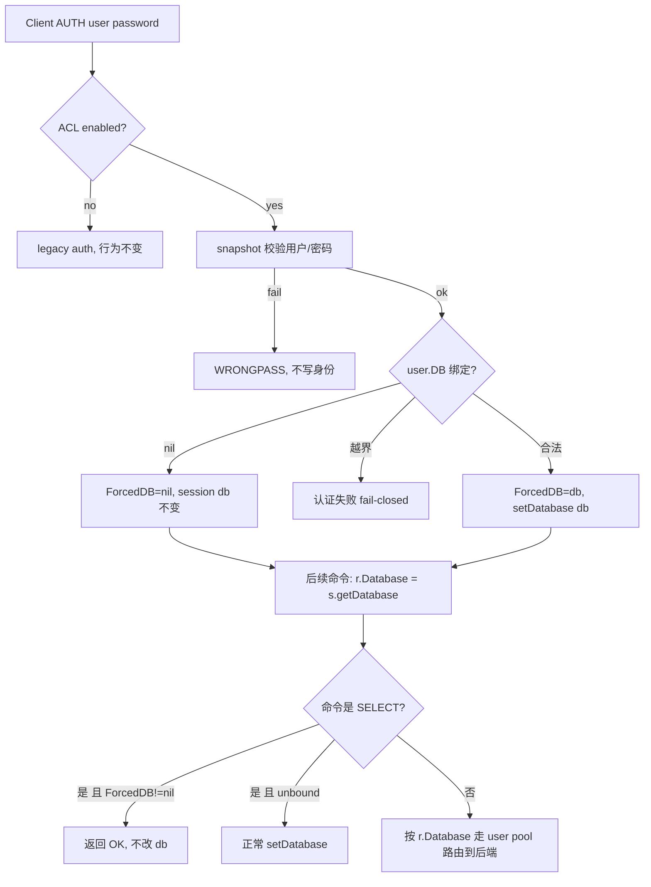

# acl-db-routing design

## 0. 术语约定

- **DB-bound ACL user**：在 Codis ACL 用户上配置了固定 db 的用户。客户端用该用户认证成功后，本会话所有命令被强制路由到该 db。
- **Forced DB**：DB-bound 用户在 session 上生效的 db。它是纯 proxy 路由属性，不渲染进 Redis `ACL SETUSER`，Redis 后端只在该 db 内按原有 ACL 规则判断权限。
- **Unbound user**：未配置 db 的 ACL 用户（含未启用该能力的存量用户）。行为与现状完全一致：db 从 0 开始，`SELECT` 正常生效。

防冲突结论：Forced DB 不是 Redis ACL 的 selector / keyspace 概念（Redis ACL 没有"强制 db"语义），也不是 proxy 的 `backend_number_databases` 上限本身——它复用现有 session db + user-bound backend pool 的 `(addr, db, user, ...)` 维度，只是把 db 的来源从客户端 `SELECT` 改成认证身份。

本 feature 是 `2026-06-04-codis-acl` 的增量扩展，复用其 ACL 模型、snapshot 下发、session 身份和 user pool；不引入新的认证或同步通道。

## 1. 决策与约束

### 需求摘要

让运维给某个 Codis ACL 用户绑定一个固定 db。业务客户端用该用户（`AUTH user password`，或 `AUTH password` 对应 `default` 用户）认证成功后，proxy 强制把该会话的所有命令路由到绑定 db，**优先级高于客户端的 `SELECT`**——客户端再发 `SELECT` 不改变实际路由。

成功标准（可验证）：

- 给用户 `app1` 绑定 db=3 并下发后，客户端 `AUTH app1 <pwd>` 成功，随后 `SET k v` / `GET k` 实际落在后端 db 3（而非 db 0）。
- 同一会话先 `AUTH app1 <pwd>` 再 `SELECT 5`：`SELECT` 返回 `OK`，但后续命令仍落在 db 3。
- 未绑定 db 的 ACL 用户认证后行为与现状一致：db 从 0 开始，`SELECT n` 生效路由到 db n。
- 绑定 db 超出 proxy `backend_number_databases` 范围时，该用户 `AUTH` 返回认证/配置错误，fail-closed，不静默落到错误 db。
- 存量 ACL（coordinator 中无 db 字段的旧记录）解码后全部视为 unbound，升级后行为不变。

### 三个已拍板决策（来自用户确认）

1. **绑定粒度 = 按用户**：在 `models.ACLUser` 上加 db 字段，不改 `PasswordHashes` 结构。"不同密码 → 不同 db"通过建不同 ACL 用户（各自带密码 + db）实现。
   - 代价：`default` 用户只能绑一个 db，所有 `AUTH password` 共享。
2. **SELECT 行为 = 返回 OK 但忽略**：DB-bound 会话收到 `SELECT` 一律回 `OK`，不改变路由 db。最大化客户端兼容性（很多客户端连上来自动 `SELECT`）。
3. **适用范围 = 仅 ACL 模式**：只在 `codis_acl_enabled=true` 下生效；legacy `session_auth` 单密码路径完全不变。

### 复杂度档位

- Compatibility = backward-compatible（db 字段缺省 = unbound；存量 ACL、未绑定用户、legacy auth 全部行为不变）。
- Security = hardened（沿用 ACL feature 的认证边界；db 是路由属性，不放大权限，不进日志/明文）。
- Concurrency = distributed-consistent（db 随 ACL revision 一起下发、切换、stale 重认证，复用现有 revision gate）。
- 其余维度走默认档位（无偏离信号）。

### 明确不做

- 不改 `PasswordHashes` 为 per-password 结构，不支持"同一用户不同密码绑不同 db"。
- 不改 legacy `session_auth` 路径，不给单密码 session_auth 绑定 db。
- 不把 db 绑定渲染进 Redis `ACL SETUSER`，不依赖 Redis 侧任何 per-user db 能力。
- 不实现"禁止 SELECT 报错"或"仅允许 SELECT 到绑定 db"两种变体（已选 OK-忽略）。
- 不改变 Codis 内部命令（迁移、stats、`ACL DRYRUN`、`ACL SETUSER`）的 db 来源——内部路径继续用其自身的 `r.Database`，不受 Forced DB 影响。
- 不做 db 级别的跨 group 数据隔离保证之外的任何新隔离语义；db 路由一致性沿用现有 user pool 行为。

## 2. 名词与编排

### 2.1 名词层

#### ACL 模型加 db 字段

现状：

- `models.ACLUser` 只有 `Name / Enabled / PasswordHashes / Rules`，见 `pkg/models/acl.go:18`。
- proxy 侧 snapshot 用 `NewACLSnapshot` 逐字段 deep copy，见 `pkg/proxy/acl.go:28`。

变化：`ACLUser` 增加可空 db 字段，**用指针表达"未绑定"**（避免 `int` 缺省 0 与"绑定到 db 0"歧义，保证存量 JSON 解码 = unbound）：

```text
ACLUser:
  name, enabled, password_hashes, rules   # 现状不变
  db: *int   // json:"db,omitempty"；nil=未绑定，>=0=绑定到该 db
```

接口示例：

```text
输入：ACLUser{Name: "app1", DB: ptr(3), Rules: ["on","~app:*","+@all"], PasswordHashes:[h]}
coordinator 存：{"name":"app1","db":3,...}
旧记录 {"name":"legacy",...}（无 db）解码 -> DB=nil -> unbound
topom 渲染 ACL SETUSER：仍是 `SETUSER app1 reset on #h ~app:* +@all`，不含 db
```

`NewACLSnapshot` 的 deep copy 同步带上 `DB`。

#### 会话身份携带 Forced DB

现状：`SessionACLIdentity{Username, CredentialHash, Password, Revision, Stale}`，认证时写入 session，见 `pkg/proxy/session_auth.go:16` 与 `:102`。

变化：

```text
SessionACLIdentity:
  ...现状字段...
  ForcedDB: *int   // nil=未绑定；非 nil=本会话强制 db
```

认证语义（在 `handleACLAuth` 解析用户后）：

```text
user.DB == nil                          -> ForcedDB=nil（unbound，行为不变）
user.DB != nil 且 0<=db<backend_number_databases
                                        -> ForcedDB=&db，并 setDatabase(db)
user.DB != nil 且 db 越界               -> 认证失败，返回 Redis error，不写身份，fail-closed
```

### 2.2 编排层



现状：

- 每条请求在 reader 循环里 `r.Database = s.getDatabase()`，见 `pkg/proxy/session.go:201`。
- `SELECT` 改 session db：`handleSelect` 校验范围后 `setDatabase`，见 `pkg/proxy/session.go:383`。
- 稳定 slot 命令按 `r.Database` 经 `userBackendConn(addr, db, ...)` 路由，见 `pkg/proxy/router.go:182` 与 `forward.go:231`。

变化（**仅两个强制点 + 一个解析点**，最大化复用现有 db 流）：

1. **认证解析点**（`handleACLAuth`）：解析出绑定用户后按 2.1 语义设 `ForcedDB`，绑定时 `setDatabase(db)`。
2. **SELECT 强制点**（`handleSelect`）：若当前 ACL 身份 `ForcedDB != nil`，直接返回 `RespOK`，**不** `setDatabase`。其余路径不变。
3. 命令转发**不改**：`r.Database = s.getDatabase()` 天然返回 Forced DB（因为 SELECT 已无法改它），后端 user pool 路由复用现状。

流程级约束：

- **优先级**：Forced DB 通过"认证时 setDatabase + SELECT 变 no-op"实现，SELECT 永远改不动绑定 db。
- **一致性**：db 绑定随 `models.ACL` 经现有 `SetACL` snapshot 下发；revision 切换 → 旧 session stale → 重认证时重新解析 ForcedDB，复用现有 revision gate，不新增通道。
- **revision 重认证边角**：用户从"绑定"变"未绑定"后重认证，session db 不主动回置（停留在旧绑定 db 直到客户端 SELECT）；从"未绑定"变"绑定"或换绑后重认证按新 db 生效。属可接受边角，implement 决定是否在 unbound 重认证时回置 0。
- **内部命令隔离**：迁移 / `ACL DRYRUN` / `ACL SETUSER` / stats 等内部路径用各自构造的 `r.Database`，不读 session Forced DB，不受影响。
- **越界 fail-closed**：绑定 db ≥ `backend_number_databases` 时 `AUTH` 失败，不静默降级。topom 侧只能校验 db≥0（拿不到 proxy 的 db 数量），上限由 proxy 在认证时兜底。

### 2.3 挂载点清单

- `models.ACLUser.DB` 字段（`pkg/models/acl.go`）— 承载绑定关系的数据契约；删了它整个 feature 消失。
- proxy 认证 + SELECT 强制（`pkg/proxy/session_auth.go` 设 `ForcedDB`、`pkg/proxy/session.go handleSelect` no-op、`pkg/proxy/acl.go` snapshot 带 DB）— 实际强制路由的执行点；删了它绑定不生效。
- topom 配置入口（`pkg/topom/topom_acl.go` 的 `ACLUserUpdate` / `ACLUserView` / `buildACLUser` db 校验与回显）— 运维设置/查看绑定的源头；删了它无法配置。
- 配置界面（`cmd/fe/assets/acl.js` + `index.html` 的 per-user db 输入，`cmd/admin/dashboard.go` 的 `redactACLUpdateRequest` 保留 db）— 运维操作面；删了它只能靠裸 JSON，但能力仍在。

### 2.4 推进策略

1. 名词层：`models.ACLUser` 加 `DB *int`，`NewACLSnapshot` deep copy 带上。
   退出信号：含/不含 db 的 ACL 均能 encode/decode；旧 JSON 解码 DB=nil。
2. proxy 强制：`SessionACLIdentity.ForcedDB`、`handleACLAuth` 解析（含越界 fail-closed）、`handleSelect` no-op。
   退出信号：绑定用户命令落绑定 db、SELECT 回 OK 不改路由；unbound 用户行为不变。
3. 控制面：topom `ACLUserUpdate/View/buildACLUser` 支持 db（校验 db≥0、回显、不渲染进 SETUSER）；admin redact 保留 db。
   退出信号：提交带 db 的用户后，GET 回显 db，且后端收到的 `ACL SETUSER` 不含 db。
4. FE：acl.js + index.html 加 per-user db 输入与展示。
   退出信号：FE 能配置/查看绑定 db。
5. 验收覆盖：正常、SELECT 忽略、unbound 不变、越界 fail-closed、revision 切换重认证、存量解码。
   退出信号：目标 proxy/topom/models package 测试通过。

### 2.5 结构健康度与微重构

##### 评估

- 文件级 — `pkg/models/acl.go`（33 行）：加一个字段，属现有职责延伸。
- 文件级 — `pkg/proxy/session_auth.go`（219 行）：加 ForcedDB 解析，落在已有 `handleACLAuth` 内，无膨胀。
- 文件级 — `pkg/proxy/session.go`（`handleSelect` 约 16 行）：加一个 `ForcedDB != nil` 早返回分支，改动极小。
- 文件级 — `pkg/topom/topom_acl.go`（414 行）：加 db 校验/回显，属现有 ACL 管理职责。
- 文件级 — `cmd/fe/assets/acl.js`（已是独立 ACL 控制器，约 5.4KB）：加一个 db 字段，正是该文件存在的目的。
- 目录级 — 全部落在 `2026-06-04-codis-acl` 已建好的 `acl_*` / `topom_acl*` / `acl.js` 承载点，无新目录、无需重组。

##### 结论：本次不做微重构

原因：改动是在 codis-acl feature 已拆好的文件里加一个字段 + 两个强制点，每个文件增量都很小，没有触发胖文件或职责混杂；已有 ACL 承载结构正是这次该落的位置。

##### 超出范围的观察

- `pkg/proxy/session.go` 本地命令分发长期偏胖（codis-acl design 已记录），本 feature 不触碰该问题，沿用其结论交后续 `cs-refactor`。

## 3. 验收契约

### 关键场景清单

- 绑定生效：`app1` 绑 db=3，客户端 `AUTH app1 <pwd>` 后 `SET k v` 落后端 db 3；用 service 账号在 db 3 能查到 key，db 0 查不到。
- SELECT 被忽略：`AUTH app1 <pwd>` 后 `SELECT 5` 返回 `OK`，随后 `GET k` 仍读 db 3。
- 默认用户绑定：`default` 绑 db=2，客户端 `AUTH <pwd>`（无用户名）后命令落 db 2。
- unbound 不变：`app_ro` 未绑 db，`AUTH app_ro <pwd>` 后 db 从 0 开始，`SELECT 4` 生效，命令落 db 4。
- 越界 fail-closed：`app_bad` 绑 db=99 但 proxy `backend_number_databases=16`，`AUTH app_bad <pwd>` 返回错误，不写会话身份，不落任何命令。
- 存量兼容：coordinator 中无 db 字段的旧 ACL 升级后解码全部 unbound，客户端行为与升级前一致。
- revision 切换：把 `app1` 的 db 从 3 改 7 并下发新 revision，旧会话下一条非 AUTH 命令返回 `NOAUTH`，重认证后命令落 db 7。
- topom 回显：提交 `app1{db:3}` 后 `GET ACL view` 返回该用户 db=3；同时该用户在后端的 `ACL SETUSER` 不含任何 db token。
- FE 配置：FE ACL 面板可为用户填写/展示绑定 db，提交后刷新可见。
- 内部隔离：slot 迁移进行中，绑定用户执行被允许的命令成功，且迁移/`ACL DRYRUN` 走的 db 不被 Forced DB 干扰。

### 明确不做的反向核对项

- 后端 Redis 收到的 `ACL SETUSER` 不应包含任何 db / select-db token。
- legacy `session_auth`（`codis_acl_enabled=false`）下不应出现任何 db 绑定行为。
- 绑定用户的 `SELECT` 不应改变实际路由 db，也不应返回错误（必须返回 OK）。
- 越界绑定 db 不应静默落到 db 0 或被截断。
- db 绑定不应放大用户权限或绕过 Redis 侧 ACL key/command 判断。

## 4. 与项目级架构文档的关系

acceptance 阶段回写 `.codestable/architecture/ARCHITECTURE.md`：

- 在 proxy 段补充 **DB-bound ACL user / Forced DB**：认证时按用户绑定 db、SELECT 在绑定会话变 no-op、db 随 revision 切换重认证。
- 在 dashboard/topom 段补充 ACL 用户的可选 db 绑定字段，且该字段不渲染进 Redis `ACL SETUSER`。
- 在已知约束补充：db 绑定是 proxy 路由属性，越界由 proxy fail-closed，仅 ACL 模式生效。

相关输入：

- `.codestable/features/2026-06-04-codis-acl/codis-acl-design.md`（基础 feature）
- `.codestable/compound/2026-06-03-explore-codis-proxy-redis8-acl.md`
